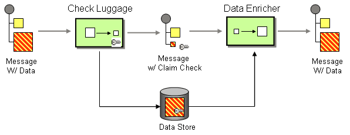

# 3. Use A Claim Check For Large or Sensitive Messages

Date: 2022-07-18

## Status

Proposed

## Context

Messaging platforms may impose limits on the size of the message that they can transport. As an example, SNS has a 256Kb
upper limit to message size. Even if your platform supports large messages may perform badly in some brokers, due to the
likelihood of forcing more frequent garbage collections.

Some data is sensitive and should be encrypted at rest. Messages in a broker are considered "data at rest" but not all
message brokers support encrypting their contents.

In both of these cases we want to remove the payload from the message itself, put it into a backing store (that may
support desirable properties such as encryption), and retrieve it from that store when needed.

The driving force for this requirements is requests from users for support for large messages, not encryption, which is
a 'nice to have' on top.

## Decision

The general pattern we want to use is referred to as
a [Claim Check](https://www.enterpriseintegrationpatterns.com/patterns/messaging/StoreInLibrary.html).

The Claim Check has a number of pieces:

1: A **Check-Luggage** component, that takes the message body from a *Wrapper* (which turns a Brighter message into a
transport message) and generates a key for the **Claim Check** and an expiry time for the message.

2: A **Store-Luggage** interface, that abstracts a distributed store (S3, Redis etc) that can be implemented to store
checked messages (should support expiry).

3: A **Retrieve-Luggage** interface, that abstracts a distributed store (S3, Redis) that can be implemented to retrieve
checked messages.

4: A **Data-Enricher** component that uses the **Claim Check** from the message to provides the message body to an
*Unwrapper* (which turns a raw message back into a Brighter message).

The **Claim Check** itself will be a field on our message header and will be a string value. By default we will use a
UUID for the string value.

We will use the pattern names for components by default. Although the baggage metaphor may feel a little strained, it
does provide evident architecture by linking back to the EiP pattern.

A given component likely implements both Store Luggage and Retrieve Luggage but is used in these roles independently to
send and receive.

## Consequences

* We have an Envelope Wrapper, but by convention, and we should standardize that to work with a standardized Claim
  Check. See [Use An Envelope Wrapper](./0004-use-an-envelope-wrapper-with-transports.md)
* We will need to support a range of abstractions over storage that could be used for a message. If the initial set
  includes AWS S3, Azure Blob Storage, and Redis we will cover the common choices.
* When configuring Brighter we will need to know:
    * If you intend to use our support for a Claim Check
    * What storage you wish to use for the Data Store. This is effectively a Store and Retrieve Luggage implementation. 
