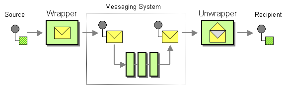

# 4. Use An Envelope Wrapper with Transports

Date: 2022-10-04

## Status

Proposed

## Context

Brighter models a Message with two parts: a Message Header and a Message Body.

The body is a byte array and the headers include both Brighter defined headers and a "bag" that can be used for
user-defined headers.

This is an internal format to Brighter and not native to any transport.

To publish we must convert the Brighter Message into the native transport's message format. By convention we call this
component {BrokerName}MessagePublisher where {BrokerName} is the name of the transport.

To read a message from the queue we must convert the transport's message into a Brighter Message. By convention we call
this component {BrokerName}MessageCreator where {BrokerName} is the name of the transport.

This is by convention only as there is no interface required to be implemented by Brighter.

The interfaces that we ask you to implement are the IAmAMessageConsumer and IAmAMessageProducer (along with interfaces
related to a producer registry, subscriptions and publications and gateway configuration).

We interface with the middleware through their provision of two key concepts: a consumer (IAmAConsumer) and a producer (
IAmAProducer).

By convention a given transport's consumer's **Receive()** method uses a {Broker}MessageCreator class with a *
*CreateMessage** method that receives the transport's SDK abstraction for a message and transforms it into a Brighter
Message.

We create a producer via a IAmAProducerRegistryFactory, which creates producers from publications and a connection to
the broker.

By convention a given transport's producer's **Send** or **SendAsync** method uses a {Broker}MessagePublisher class with
a **PublishMessage** method that takes a BrighterMessage, converts it to the transport's SDK's message format and sends
it.

We create a consumer as part of a channel. The middleware implements IAmAChannelFactory which is used by
IAmAConsumerFactory to create a new Consumer.

On consuming from a subscription, once the raw message from the middleware is translated to a Brighter message the
message pump passes through a translate message step, which looks up a registered message mapper. The mapper translates
it into a request.

On producing to a publication, we convert from the request type to a brighter message by calling the registered message
mapper. The brighter message is then passed to the producer.

### Wrap and Unwrap

The [Envelope Wrapper](https://www.enterpriseintegrationpatterns.com/patterns/messaging/EnvelopeWrapper.html) pattern
provides for middleware that transforms the message between source and messaging system or messaging system and
recipient.
Although the diagram below shows one wrapper, in principle the pattern allows for a pipeline of transformations where,
in effect each middleware step provides translation required to pass it over the platform.



### Points of Interception

We have two possible interception points:

- Within the transport. We would need to move from the conventions above to a defined interface for the conversion from
  brighter message to SDK message.
- Within the message mapper. There is already an interception point here, for converting requests to Brighter messages
  and vice-versa.

### Options

#### Do Nothing

This means that customers will continue to use a bespoke approach based on message mappers to amend brighter messages.
This works, but does not allow us to offer "out of the box" solutions to common problems such as large messages, not
allow customers to re-use their own solutions.

We or our customers could create a base class to try and get re-use of bespoke support for large messages. This would
fix the immediate problem. But as soon as someone wants to add another common mapping feature, such as encryption, we
hit the issue that C# is single inheritance so we cannot mix in behaviors.

#### Wrap-Unwrap Pipeline for Message Mapper

In this option we create build a pipeline on top of Message Mapper that allows transformations of a brighter message. We
define an interface for the pipeline steps:

```csharp

public interface IAmAMessageTransform
{
    Message Wrap(Message message);
    Message Unwrap(Message message);

}
```

You implement this interface to provide your behavior, such as using a claim check for a large message. The MapTo method
transforms messages that you are posting, and the MapFrom method transforms messages you are receiving.

We signal that we are using one of these mixins via an attribute on the mapper, as this is consistent with the approach
elsewhere

```csharp

 [ClaimCheck(0, typeof(S3Storage), threshold: 512)]
 public Message MapToMessage(GreetingMade request)
 {
 
 }

```

As with our handlers, the code that calls our message mapper, determines if it has a pipeline, and if so runs it before
executing the mapper to return the results.

By using a pipeline we can "mix in" behaviors and thus avoid the C# single inheritance issue.

The pipeline would not need to be Russian Doll, as there would be no requirement for exception handling or 'before and
after'. This could simplify implementation.

Transformations are limited to the brighter message and not the raw SDK representation.

#### Wrap-Unwrap Pipeline for Transport

In this approach we would need to standardize the interfaces transports use to create and publish messages

```csharp

public interface IMessageCreator
{
    Message CreateMessage<T>(T message);
}

public interface IMessagePublisher<T>
{
    T CreateMessage(Message brighterMessage);
    bool PublishMessage(T message);
}

```

We would then define a base class for those components, that provided protected methods for a pipeline. A pipeline step
would either modify the SDK message for a consumer, or the brighter message for a sender. Conversion to/from SDK for the
transport is by the above components.

```csharp

public interface ITransportMessageTransform<T>
{
     T Transform(T transportMessage);
}

public interface IMessageTransform
{
    Message Transform(Message);

}

```

This adds support for transformations of the SDK message.

Because we have no access to the transport pipeline, we would need to configure pipeline elements in the Subscription or
Publication. Most likely we would need to add a fluent interface of the form

```csharp

public interface IMessageTransformBuilder
{
    IMessageTransformBuilder With(IMessageTransformBuilder transform);
}

```

And then pass the list of transformations to the transport when we call to publish or receive.

## Decision

Most transforms can be managed within the brighter header and body. The transport can usually just map these out. Even
something such as deciding on binary vs structured for CloudEvents can be handled at this level (for structured rewrite
headers into the body).

For this reason we want to go ahead with the Wrap-Unwrap Pipeline for Message Mapper option.

This has the advantage of extending the existing MessageMapper behavior without being a breaking change for existing
code, so it could go out in a minor release.

## Consequences

We can support common behaviors for transformations, and we, or others can publish libraries of common transforms.
