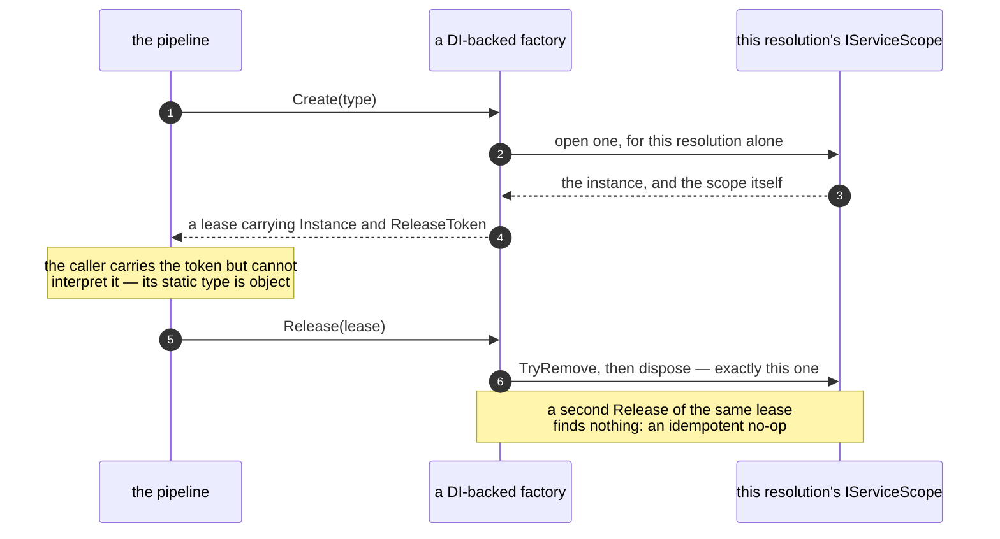

# 66. Release a factory-created instance through an opaque `Lease<T>`

Date: 2026-07-28

## Status

Accepted

## Context

The DI-friendly factories — mapper, transformer, handler — leaked memory. Fixing the leak means giving each resolution its own DI scope and closing it on `Release`, and that turns `Release` into the problem: it has to close *the one scope that leased this instance*, and the bare instance cannot identify it.

### Where this ADR sits

Four ADRs came out of the #4252 lifetime work, one decision each, and they are meant to be read in order:

| ADR | Decides |
| --- | --- |
| **0066** *(this one)* | what a factory returns, so that `Release` can name the resolution it is releasing |
| 0067 | that a `Transient` resolution gets its own DI scope, tracked by scope identity and released idempotently |
| 0068 | that disposal is deterministic on the explicit path and best-effort in the finalizer |
| 0069 | who owns, and therefore who disposes, the registry and the factories |

ADRs 0070–0074 then build on all four: they give a *pipeline* its own DI scope, and let it join one the host already owns.

### Why the bare instance cannot identify what to release

On master, a `Transient` resolution goes through `ServiceProviderLifetimeScope`, which creates **one shared child DI scope** the first time it is needed and reuses it for *every* subsequent resolution, disposing it only when the factory itself is disposed. `Release(instance)` disposes the resolved instance if it is `IDisposable` but never closes that scope. So each resolution's dependency graph is captured by the long-lived scope and retained for the lifetime of the factory — a per-message allocation that is never reclaimed on the hot path.

To fix the leak we must **control lifetime per resolution**: give each resolution its own child DI scope and close it on `Release`. The instance cannot serve as the key, because one instance does not map to one scope. A *shared* instance — one the container returns from a `Singleton` descriptor, resolved under the default `Transient` `MapperLifetime`/`TransformerLifetime`, since Brighter's configured lifetime and the container's registration lifetime are independent axes (see *Terms* in ADR 0067) — is handed out from many scopes. Keying release on it stacks many scopes under one key, and release can no longer tell resolutions apart. `Release` needs a **token for what leased the instance**, not the instance.

### The forces

- **Assembly boundary.** The lease type lives in **core** (`Paramore.Brighter`), but the real `IServiceScope` lives in the **DI** assembly. So the token must be an opaque `object?` the caller carries but cannot interpret; all DI-specific disposal — including the pump-deadlock context suppression — stays in the DI layer.
- **Over-release must be safe.** Callers release in `finally` blocks and on failure paths, so releasing the same lease twice has to be a no-op rather than a use-after-dispose.
- **Forward influence.** This establishes "resolution-scoped lease" as the unit of lifetime, which is directly relevant to the planned **scope-handling improvements** — a scope per pipeline on the consumer side, where the message is the *bound* on that pipeline rather than the scope itself, and a producer side able to resolve from an ambient ASP.NET request scope. The lease is the natural handle those designs build on.

## Decision

**`Create`/`Get` return a `sealed class Lease<T>` — opaque data pairing the resolved `Instance` with an opaque `object? ReleaseToken` — and `factory.Release(lease)` / `registry.Release<T>(lease)` key release on the resolution rather than on the instance.**

Set-based tracking (`ConcurrentDictionary<IServiceScope, byte>` plus an idempotent `TryRemove`) replaces the per-instance stack, `InstanceComparer`, and the `CollectScopesToRelease` re-home.

### The mechanism, end to end

The token *is* the resolution's own `IServiceScope`, so `Release` reclaims exactly one scope and a second release finds nothing:

### What the lease is, and what it is not

**A token-less lease is a deliberate, visible choice, not a default.** A factory that opens a per-resolution scope returns a lease carrying its release token, passed as the constructor's second argument. The token-less case — a shared instance, or a no-op factory that reclaims nothing on release — is built through a named `Lease<T>.Untracked(instance)` factory, **not** an implicit conversion from `T`. So "release reclaims nothing here" is stated at the call site rather than becoming true silently: a factory that owns a scope cannot accidentally return a token-less lease, and a caller cannot pass a bare instance where a lease carrying a token is expected.

**The lease's generic argument also carries the *interface*.** `Get<T>` returns a `Lease<IAmAMessageMapper<T>>` and `GetAsync<T>` a `Lease<IAmAMessageMapperAsync<T>>`. A dual-interface mapper — `JsonMessageMapper<T>`, which implements both — resolved from `GetAsync` is therefore an async-typed lease that can only bind to the async `Release<T>` overload. Routing it to the sync factory would mean releasing against a different `ServiceProviderLifetimeScope` than it was resolved from, a silent leak; here it is a **compile-time type error**. The two `Release<T>` overloads are distinguished by parameter type, so they are plain public methods on the concrete registry and no interface cast is needed at the call site.

## Consequences

### Positive

- Over-releasing a lease is an **idempotent no-op** rather than a use-after-dispose, and the dual-interface silent misroute becomes a compile error. Both hazards are removed by the type system rather than by discipline.
- The type system also confines the token-less "reclaims nothing" lease to the explicit `Untracked` factory, so a scope-owning factory cannot manufacture one by accident and silently leak the scope it was meant to reclaim.
- Keying on the resolution rather than the instance closes the shared-instance over-release / use-after-dispose bug class outright, so the instance-keyed stack and its concurrent re-home pass are no longer needed. ADR 0067 is the internal `ServiceProviderLifetimeScope` mechanism this decision is realised by.
- The per-resolution lease is the natural handle for the scope-handling work that follows: a pipeline scope on the consumer side, and a producer side resolving from an ambient request scope, both key off it.

### Negative

- **Broad breaking surface**: six interfaces, the DI implementations, the registry, the pipelines and builders, and every test double.
- Because `Lease<T>` is invariant, the registry's `Release<T>` is generic; the factory `Release` stays non-generic and the registry re-wraps, carrying the same token.

## Alternatives Considered

**1. Return the bare instance — the naïve option.** Leave the signatures alone and have `Release(instance)` work out what to close. **Rejected**: the caller must release *the specific resolution* it holds, and only a token carrying resolution identity — the resolution's own `IServiceScope` — lets `Release` reclaim exactly one scope and makes over-release an idempotent no-op. Returning the bare instance forces instance-keying, which *is* the bug.

**2. Make the lease `IDisposable`/`IAsyncDisposable` — a self-releasing lease.** `using`/`await using` at the call site, `Release` gone from the interfaces. This is the more modern shape and it was **rejected on impact**:

- It pushes the DI-specific pump-deadlock **context-suppression disposal** out of the DI layer and into a token wrapper — worse separation of concerns.
- It is a **larger public-surface change** on an already-breaking major-version PR: removing `Release` from all six interfaces, rather than changing its parameter.
- The chosen shape — opaque-data class plus `factory.Release(lease)` — keeps `Create`/`Release` symmetry, so the conceptual change is smaller and all disposal logic stays where it belongs.

The choice between the two was made deliberately and is reversible if the balance changes.

## References

- Related ADRs:
  - [ADR 0067: Per-resolution DI scope for transient factory instances](0067-per-resolution-di-scope-for-transient-factory-instances.md) — the internal mechanism that realises this decision, and the `Terms` block defining the configured-lifetime and registration-lifetime axes
  - [ADR 0068: Deterministic disposal — the finalizer is a safety net](0068-deterministic-disposal-finalizer-safety-net.md) — how a lease's release surfaces failures
  - [ADR 0069: Ownership and disposal cascade for mapper/transform factories](0069-factory-registry-ownership-and-disposal-cascade.md) — who disposes the factories that hold unreleased leases
- External references:
  - Issue #4252 — the per-message scope leak this sequence closes
