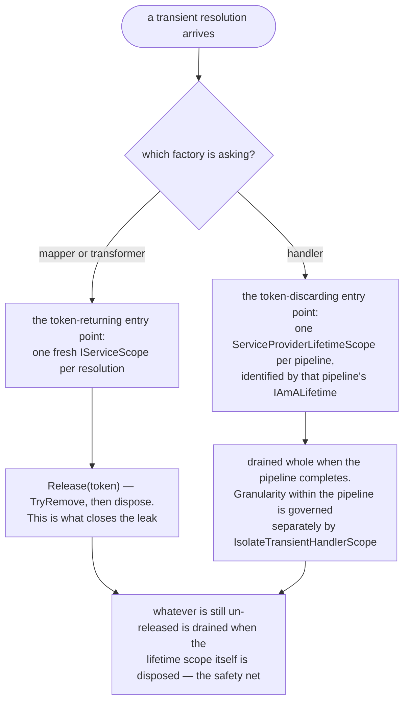

# 67. Per-resolution DI scope for transient factory instances

Date: 2026-07-28

## Status

Accepted

## Context

**Scope**: how `ServiceProviderLifetimeScope` — the DI-backed lifetime helper shared by the mapper, transformer and handler factories — creates, tracks and releases the `IServiceScope` for a *transient* resolution.

### Where this ADR sits

Four ADRs came out of the #4252 lifetime work, one decision each, and they are meant to be read in order:

| ADR | Decides |
| --- | --- |
| 0066 | what a factory returns, so that `Release` can name the resolution it is releasing |
| **0067** *(this one)* | that a `Transient` resolution gets its own DI scope, tracked by scope identity and released idempotently |
| 0068 | that disposal is deterministic on the explicit path and best-effort in the finalizer |
| 0069 | who owns, and therefore who disposes, the registry and the factories |

ADRs 0070–0074 then build on all four: they give a *pipeline* its own DI scope, and let it join one the host already owns. The `Terms` block below is the one they reference rather than restate.

### Terms

Two **independent** axes decide what a resolution yields, and conflating them is the main source of confusion in this area:

- **Configured lifetime** — Brighter's own `HandlerLifetime` / `MapperLifetime` / `TransformerLifetime`. It governs the **artefact**: whether Brighter resolves a fresh handler, mapper or transform per resolution (`Transient`), reuses one per Brighter lifetime scope (`Scoped`), or holds one for the application (`Singleton`).
- **Registration lifetime** — the container's `ServiceLifetime` on a descriptor. It governs what the container returns for a resolution, and therefore the **dependencies** the artefact is constructed with.

Because they are set independently, "a container-`Singleton` instance resolved under `MapperLifetime.Transient`" is not a contradiction but an ordinary case, and it is the one that matters below: Brighter asks for a fresh resolution every time and the container hands back the same shared object every time. That is precisely what instance-keyed release cannot tell apart.

Three further terms are kept distinct throughout. A **DI scope** is Microsoft's `IServiceScope`. `ServiceProviderLifetimeScope` is Brighter's helper that creates, tracks and disposes DI scopes — it is not itself one. `IAmALifetime` is the token identifying a single pipeline. Where this ADR says "scope" unqualified, it means a DI scope.

[ADR 0039](0039-scoping-dependencies-inline-with-lifetime-scope.md) established a lifetime scope per subscriber so that handlers in a `Publish` fan-out do not share scoped dependencies. Within that model the mapper and transformer factories created a **single** `IServiceScope` per factory and reused it for every transient resolution. `MapperLifetime` and `TransformerLifetime` both **default to `Transient`**, and those factories live for the application's lifetime, so that one scope was never released between messages: every transient mapper or transform accumulated a scope for the life of the process. That is the leak reported in #4252, and because the default lifetime is `Transient` it was the default code path, not an opt-in.

A scope owns more than the instance it produced: it also owns whatever that instance captured from it, including the scope's own `IServiceProvider`, which the container injects when a constructor asks for one. So a scope's lifetime must follow the *resolution*, not the instance's disposability — disposing a scope while its instance is still in use hands that instance a disposed provider.

## Decision

`ServiceProviderLifetimeScope` creates a **fresh `IServiceScope` per transient resolution** and disposes it when that resolution is released.

### The mechanism, end to end

The two factory families reach the same helper by two different entry points, and the difference is what identifies a resolution: for a mapper or transform it is the resolution's own scope, carried back as a token; for a handler it is the pipeline, which already has an identity of its own.

### Track by scope identity, release idempotently

- Each transient resolution's scope is recorded in a set keyed by the **scope's own reference** (`ConcurrentDictionary<IServiceScope, byte>`). The scope *is* the resolution's identity; the returned release token (see [ADR 0066](0066-release-factory-instances-on-an-opaque-lease)) is that scope.
- `Release(token)` is an atomic `TryRemove` followed by disposal, so releasing exactly the one resolution's scope, and a second release of the same token is a no-op — never a pop of another resolution's scope.
- The tracking set is not keyed by the resolved instance. A shared instance (a container-`Singleton` resolved under `Transient`) therefore has one distinct entry per resolution rather than a stack under one key — the mechanism that realises ADR 0066's per-resolution keying.

### The factory's disposal is the safety net

An un-released resolution's scope is drained when the lifetime scope itself is disposed: `Dispose()` iterates the set, removing and disposing each scope best-effort (a throwing disposal is logged, not propagated, so one failure cannot skip the rest). This bounds an un-released resolution to the host's lifetime rather than leaking to process exit.

### Two resolution entry points

- The **mapper and transformer factories** take the token-returning entry point and release each resolution's scope per message — this is what closes the leak.
- The **handler factory** takes a token-discarding entry point: a handler is resolved through a `ServiceProviderLifetimeScope` created per pipeline — `IAmALifetime` is that pipeline's identity — and disposed when the pipeline completes, so the whole scope is drained at pipeline end and there is no per-instance release. The transient-handler scope granularity *within* a pipeline is governed separately by `IBrighterOptions.IsolateTransientHandlerScope` (see below).

### An escape hatch to the pre-existing shared handler scope

Making each transient resolution isolate its own scope also changes what a *transient handler* sees: before this work, the transient handlers in one pipeline shared a single DI scope, so a scoped-registered dependency was one shared instance across the whole pipeline. Per-resolution isolation gives each transient handler its own scope, and therefore a distinct instance of that dependency.

`IBrighterOptions.IsolateTransientHandlerScope` preserves an opt-out. It defaults to `true` (each transient handler resolution gets its own scope — the new behaviour). Setting it to `false` restores the **pre-existing shared instance scope**: all transient handlers in one pipeline share a single DI scope that is disposed when the pipeline completes. It is a **compatibility fallback** for code that relied on the old cross-handler sharing under `Transient` and cannot yet switch to `HandlerLifetime = Scoped` (the preferred way to share state across a pipeline).

The flag is **scoped to the handler factory only**. It has no effect on Scoped or Singleton handlers, and — crucially — none on the mapper and transformer factories, which *always* isolate per resolution because that isolation is the leak fix this ADR exists for. The shared-scope path is a choice about handler-dependency sharing, not a way to reopen the mapper/transform leak.

### Scope disposal respects the async pump

A scope is disposed through `IAsyncDisposable` when it offers it. On a thread owned by the Proactor's single-threaded synchronization context the synchronous disposal path suppresses that context for the duration of the wait, so a user `DisposeAsync` continuation posted back to it resumes on the thread pool rather than deadlocking the pump.

## Consequences

### Positive

- Closes #4252: each transient mapper/transform gets and releases its own scope, so a long-running host no longer accumulates one scope per message.
- Releasing one resolution can never dispose a scope another live resolution depends on (realises ADR 0066), and disposal is deterministic rather than GC-timed (see ADR 0068).
- The change to transient-handler scoping is reversible: `IsolateTransientHandlerScope = false` restores the pre-existing shared handler scope for code that depended on it, without reopening the mapper/transform leak.

### Negative

- A transient resolution allocates and retains a scope until it is released, **even for a non-disposable instance** (the scope owns the instance's injected provider). Callers that resolve a mapper/transform directly must release it; see ADR 0066 for the lease contract they use.

## Alternatives Considered

### Keep one shared factory scope, dispose only `IDisposable` instances

The pre-fix model. **Rejected because** it leaks the scope (and the instance's injected `IServiceProvider`) for the process lifetime under the default `Transient` lifetime, and it cannot free a resolution's dependencies until the factory itself is disposed at shutdown — the #4252 defect.

### Track scopes keyed by the resolved instance

**Rejected because** a shared instance stacks many scopes under one key, so release cannot tell resolutions apart — the exact use-after-dispose / over-release hazard ADR 0066 exists to remove.

## References

- Realises: [ADR 0066: Release a factory-created instance through an opaque `Lease<T>`](0066-release-factory-instances-on-an-opaque-lease.md)
- Refines: [ADR 0039: Scoping dependencies inline with lifetime scope](0039-scoping-dependencies-inline-with-lifetime-scope.md)
- Related: [ADR 0068: Deterministic disposal — the finalizer is a safety net](0068-deterministic-disposal-finalizer-safety-net.md), [ADR 0069: Ownership and disposal cascade for mapper/transform factories](0069-factory-registry-ownership-and-disposal-cascade.md)
