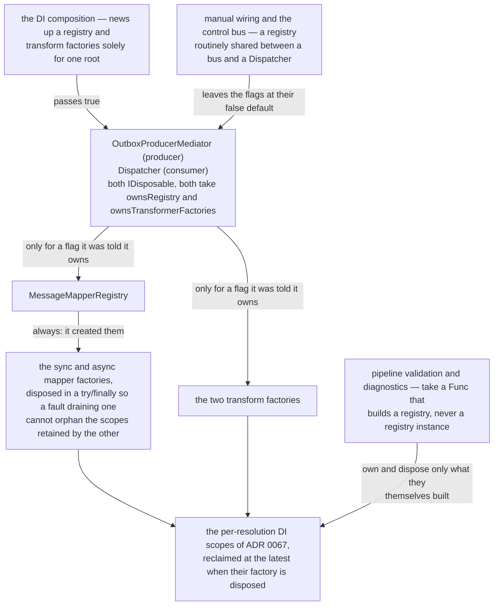

# 69. Ownership and disposal cascade for mapper/transform factories

Date: 2026-07-28

## Status

Accepted

## Context

**Scope**: which component disposes the mapper registry and the mapper/transform factories, so the per-resolution DI scopes of ADR 0067 are actually reclaimed.

A per-resolution DI scope that a caller fails to release is drained only when its factory is disposed (ADR 0067). For an IoC-backed factory nothing else can reach those factories to dispose them, so an owner must — and must do so exactly once, without disposing a factory or registry that another owner is still using.

### Where this ADR sits

Four ADRs came out of the #4252 lifetime work, one decision each, and they are meant to be read in order:

| ADR | Decides |
| --- | --- |
| 0066 | what a factory returns, so that `Release` can name the resolution it is releasing |
| 0067 | that a `Transient` resolution gets its own DI scope, tracked by scope identity and released idempotently |
| 0068 | that disposal is deterministic on the explicit path and best-effort in the finalizer |
| **0069** *(this one)* | who owns, and therefore who disposes, the registry and the factories |

ADRs 0070–0074 then build on all four: they give a *pipeline* its own DI scope, and let it join one the host already owns. The ownership rule stated here is why the *registry* is the object that speaks for the factories it holds.

## Decision

Disposal follows ownership: **the component that created a disposable disposes it, and disposal cascades from the owner down.**

### The mechanism, end to end

Ownership is declared, not inferred, and it defaults to *not* owning. The cascade only runs as far as the flags say it may:

### The registry owns its factories

`MessageMapperRegistry` is `IDisposable` and disposes the mapper factories it was constructed with — both the synchronous and asynchronous factory. It disposes both even when the first `Dispose` throws (`try/finally`), so a fault draining one factory cannot orphan the scopes retained by the other, and the disposal is idempotent (the disposed flag is claimed with a single atomic exchange) so an owner and the container can both dispose it exactly once.

### Producer and consumer roots cascade — but only what they are told they own

Ownership is **declared explicitly and defaults to non-owning.** Both roots take `ownsRegistry` and `ownsTransformerFactories` constructor flags that **default to `false`**, and each disposes the registry / transform factories only when the matching flag is `true`. A root handed a *shared* registry or factories — the manual-wiring and control-bus paths, where a registry is routinely shared with another bus or Dispatcher — therefore never tears them down. The DI composition, which news up a registry and factories solely for one root, opts in by passing `true`.

- The `OutboxProducerMediator` (producer side) is `IDisposable` and, for each flag it owns, cascades into the `IAmAMessageMapperRegistry` and both transform factories, disposing each quietly (a failure to dispose one is logged, not allowed to skip the rest). A `ReferenceEquals` guard avoids disposing the same object twice when the sync and async registry are one instance (the DI path).
- The `Dispatcher` (consumer side) is likewise `IDisposable` and disposes the registry and transform factories only for the flags it was told it owns.

### A non-creator does not dispose

Components that receive a registry they did not create do not dispose it. The pipeline validation and diagnostics components take a `Func<MessageMapperRegistry>` rather than a registry instance: each invokes the factory once and owns and disposes only the registry it thereby created, so it can never dispose a caller's shared registry.

## Consequences

### Positive

- Every per-resolution DI scope is reclaimed at the latest when its owning root is disposed, bounding retention to the host lifetime; in the DI path each root gets its own registry and factories, so disposal is airtight.

### Negative

- The non-owning default makes manual sharing safe, but the ownership flags can still be misused: if a `MessageMapperRegistry` or a transformer factory is shared between independently-disposed owners (e.g. a `CommandProcessor` external bus and a `Dispatcher`) **and** more than one of them is constructed with `ownsRegistry`/`ownsTransformerFactories = true`, disposing that owner tears down objects the others still use, and their subsequent resolutions throw `ObjectDisposedException`. This is a runtime break with no compile-time signal; the guidance is that at most one owner may claim ownership of a shared instance — give each owner its own registry/factories, or leave the flags `false` and let the DI container own disposal.

## References

- Related: [ADR 0067: Per-resolution DI scope for transient factory instances](0067-per-resolution-di-scope-for-transient-factory-instances.md), [ADR 0033: Lifetime of Command Processor and Mediator](0033-lifetime-of-command-processor-and-mediator.md)
