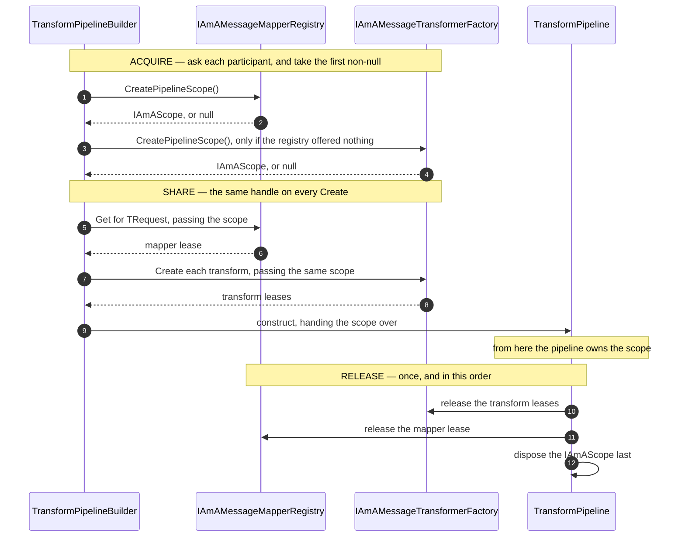
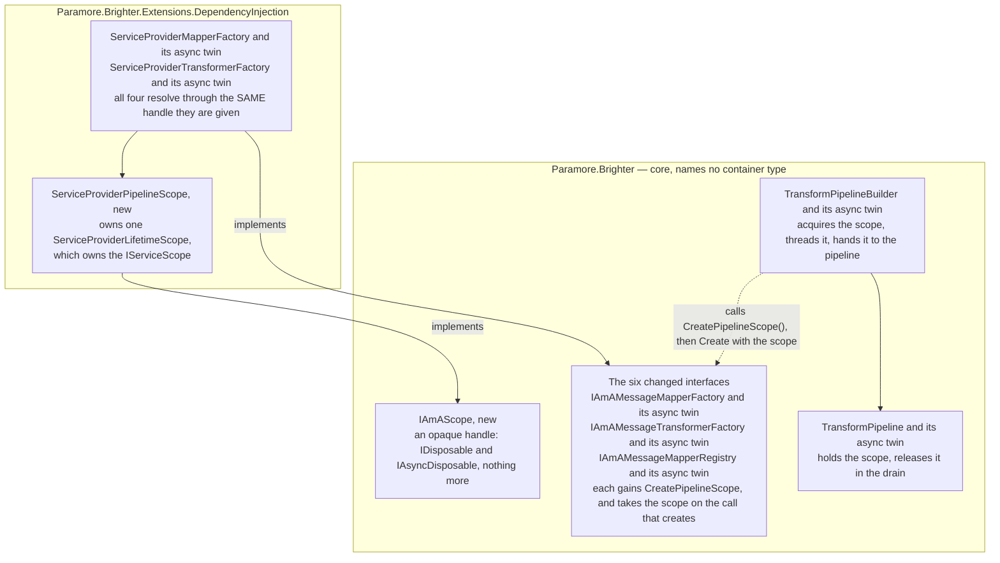

# 70. Per-pipeline DI scope shared by the mapper and transform factories

Date: 2026-08-02

## Status

Proposed

## Context

A transform pipeline is a message mapper plus the `[WrapWith]`/`[UnwrapWith]` transforms that decorate it. Both are resolved from the application's container, through Brighter's factory interfaces, once per message. On current master they are resolved from **two different DI scopes**, and under a configured lifetime of `Scoped` neither of those DI scopes is released until the host shuts down. So a mapper meant to serve one message serves the process, and a dependency injected into both a mapper and its transform is two objects where the application asked for one.

**Parent Requirement**: [specs/0036-scoped-lifetime-per-pipeline/requirements.md](../../specs/0036-scoped-lifetime-per-pipeline/requirements.md)

**Scope**: This ADR decides one thing — **a transform pipeline takes one DI scope, and the mapper factory and the transformer factory both resolve from it**. It discharges FR-1 … FR-7, **FR-20** — the clean break on `MapperLifetime.Scoped`, which is made here and release-noted in step 7a's first bullet — and constraint C-19, and closes Defect 1 and Defect 1b.

**How the set treats non-functional requirements and constraints, stated once here because this is the first ADR.** Every FR has exactly one owning ADR, named in that ADR's `Scope`, so a coverage audit lands on the mechanism that makes the requirement true. **NFRs and constraints are not distributed that way and are not meant to be.** They are properties every ADR in the set is written to hold — container-agnosticism (NFR-1, ADR 0014), no ASP.NET reference on the DI package (NFR-2), thread safety under concurrent pipelines (NFR-4), bounded growth (NFR-5), the terminology separation (NFR-8) — and a reader looking for the ADR that *discharges* NFR-1 will not find one, because no single decision delivers it. Where an NFR or a constraint does resolve to one decision it is named in that ADR's `Scope` alongside the FRs, as C-19 is here, C-8's disposal half is here, and NFR-9's truth table is ADR 0074's. Everything else is held by construction, and the acceptance criteria that guard them — AC-22's source and project scans above all — are written over the repository rather than over any one ADR.

It introduces `IAmAScope` as the core scope handle, settling the disposal half of C-8 and confirming the seam types' home. It also discharges **FR-13's clauses for transform pipelines** — **both** of them, jointly with FR-6: the lead clause that Brighter releases a scope it created when the pipeline completes and thereby disposes the container-`Scoped` instances resolved from it (step 5), and the disposal-failure clause — what happens, and at what level it is logged, when releasing an *owned* transform-pipeline scope throws (step 4a). The **handler-family** instance of both is ADR 0071's, and what FR-13 delegates to FR-12 — that a borrowed scope is never disposed at all — is ADR 0072's, through FR-12 itself. **So FR-13 divides by family rather than by clause**, and no ADR claims the whole of it. AC-33 exercises the handler instance of the disposal-failure clause, which is why it is named in 0071 and not here. No acceptance criterion exercises the transform instance directly: AC-6 covers the *failed-build* case and AC-33 the handler one, so the completed-transform-pipeline case rests on FR-13 alone. It also serves **FR-27.1** — the scope-creation protocol below is what makes "a pipeline takes a pipeline scope when at least one participating factory is `Scoped`" true of a transform pipeline.

It does **not** decide `IAmAScopeProvider`, the *ambient* concept, `ScopeAffinity`, adoption or borrowing, ASP.NET (`IHttpContextAccessor`), the opt-in option on `IBrighterOptions`, `Publish`-subscriber ambient suppression, FR-27.2's affinity computation, or the `ValidatePipelines()` rules of FR-22. Each is deferred, and to a different sibling: the ambient concept, adoption and FR-27.2 are ADR 0072's, ASP.NET is 0073's, FR-22's rules are 0074's, `Publish`-subscriber suppression is 0075's, and the opt-in option is 0076's. Nor does it converge handler pipelines onto this mechanism — that is ADR 0071. This ADR is written so as not to foreclose any of them.

This ADR **supersedes no prior ADR.** It extends the 0066–0069 sequence.

### Where this ADR sits

Seven ADRs deliver the parent requirement, one decision each. They are meant to be read in order; this is the first.

| ADR | Decides |
| --- | --- |
| **0070** *(this one)* | a transform pipeline takes one DI scope, carried **as a parameter** |
| 0071 | handler pipelines converge onto the **same handle**, carried on the object they already pass |
| 0072 | how a pipeline discovers an **ambient** DI scope the host owns |
| 0073 | the **ASP.NET Core package**, and the one line an application writes to opt in |
| 0074 | **where** the six scope-configuration rules are evaluated |
| 0075 | how a `Publish` subscriber **suppresses** adoption, for itself and everything nested beneath it |
| 0076 | the **affinity option**, and how one setting reaches all four registration paths in any order |

One rule unifies the first two, and it is the sentence to carry into the rest: **the per-pipeline object carries the DI scope.** For a transform pipeline that object is the `TransformPipeline<TRequest>`, and the scope arrives as a parameter, because `Create(Type)` has no per-pipeline object to hang it on. For a handler pipeline (ADR 0071) it is the `IAmALifetime`, which every resolution site already receives, so the scope rides on it.

Handler pipelines are **not** touched here, and the two handler factory interfaces are **not** changed: nothing in `IAmAHandlerFactorySync`, `IAmAHandlerFactoryAsync`, `ServiceProviderHandlerFactory`, `PipelineBuilder<TRequest>`, `HandlerLifetimeScope` or `IAmALifetime` changes. They already have a per-pipeline object — `IAmALifetime` — and a working per-pipeline DI scope keyed on it, which is the model this ADR copies. **ADR 0071 then converges them onto the mechanism decided here**, so that one story serves both families; FR-7's requirement that handler *behaviour* be preserved holds across both.

ADR 0067's `Terms` block defines the two axes this ADR uses — Brighter's *configured lifetime* (`Transient`/`Scoped`/`Singleton`, which governs the artefact) and the container's *registration lifetime* (which governs the dependencies) — and keeps `IServiceScope`, `ServiceProviderLifetimeScope` and `IAmALifetime` distinct. This ADR does not restate it.

### The two factory families release completely differently

Every factory call is a `Create` matched by a `Release`. They divide into two families that reclaim on entirely different terms.

| Family | `Create` / `Release` | Its DI scope is keyed per | `Scoped` is reclaimed by |
| --- | --- | --- | --- |
| `IAmAHandlerFactorySync` (`:44`, `:51`), `IAmAHandlerFactoryAsync` (`:44`, `:51`) | `Create(Type, IAmALifetime)` / `Release(handler, IAmALifetime)` | **pipeline** — one `ServiceProviderLifetimeScope` per `IAmALifetime` (`ServiceProviderHandlerFactory.cs:127-131`) | `Release` — it disposes that pipeline's DI scope (`:102-107`, `:133-137`) |
| `IAmAMessageMapperFactory` (`:45`, `:60`), `IAmAMessageMapperFactoryAsync` (`:46`, `:62`), `IAmAMessageTransformerFactory` (`:44`, `:50`), `IAmAMessageTransformerFactoryAsync` (`:45`, `:54`) | `Create(Type) → Lease<T>?` / `Release(Lease<T>?)` | **factory** — one built in the constructor (`ServiceProviderMapperFactory.cs:46`, `ServiceProviderTransformerFactory.cs:46`) | **nothing** |

Two defects follow from the second row's *"nothing"*, and they are the whole of this ADR's problem:

- **Defect 1 — a `Scoped` mapper or transform silently lives for the process.** The factories are constructed once for the singleton `Dispatcher` and once for the singleton `OutboxProducerMediator`, so `GetOrCreateScoped` (`:163-178`) caches every artefact by type for the host's life. Message N+1 sees message N's state, and an `IDisposable` mapper is never disposed.
- **Defect 1b — the mapper and transformer factories do not share a DI scope.** `ServiceProviderMapperFactory` and `ServiceProviderTransformerFactory[Async]` each build their own `ServiceProviderLifetimeScope`, hence their own `IServiceScope`. A container-`Scoped` dependency injected into a mapper *and* into its `[UnwrapWith]` transform is therefore two instances. Fixing Defect 1 factory-by-factory would leave this untouched — which is what C-19 records, and why FR-3 is the requirement that shapes the solution.

`ClaimCheckTransformer` (`src/Paramore.Brighter/Transforms/Transformers/ClaimCheckTransformer.cs:62`) is the concrete case: it takes `IAmAStorageProvider` and `IAmAStorageProviderAsync`, and is the one Brighter-shipped transform with constructor dependencies. A user's mapper and its claim-check transform sharing a `Scoped` unit of work is exactly FR-3's example.

#### Why one family reclaims and the other does not

The handler family already does the right thing: **a per-pipeline object travels on every call**, so `ServiceProviderHandlerFactory` can key a DI scope on it and dispose that DI scope on `Release`. This is the model this ADR copies, and copies literally.

The mapper/transform family cannot, as its interfaces stand. `Create(Type)` carries nothing that identifies a pipeline (ADR 0066 deliberately made the return an opaque `Lease<T>`), so those factories key one DI scope for their whole life and release *per resolution*. `ServiceProviderLifetimeScope.GetOrCreate<T>(Type, out object? releaseToken)` (`:126`) issues a release token in exactly one case — isolated `Transient` (`:139-140`, `GetTransient` `:259-261`). For `Scoped` the token is `null` (`:136`, documented at `:118-123`), so `Release(Lease)` is a no-op and the artefact is reclaimed only when the factory itself is disposed at shutdown (`ServiceProviderMapperFactory.cs:78`; its own remarks say so at `:61-65`).

### The forces

- **Core must stay container-agnostic — NFR-1.** ADR 0014 is the durable principle behind it: Brighter offers per-family factory interfaces rather than abstracting an IoC container, and the *application* supplies the implementation. So no type in `Paramore.Brighter` may name `IServiceProvider`, `IServiceCollection`, `ServiceLifetime` or `ServiceDescriptor`, and core may take no direct dependency on `Microsoft.Extensions.DependencyInjection`. That rule needs enforcing at the level of core's *source*, not its project file: `Microsoft.Extensions.DependencyInjection` is already on core's compile closure transitively through `Microsoft.Extensions.Logging`, so those types compile in core today. Whatever this ADR adds to a core signature must therefore be a core, container-free type — **NFR-1(a)**, which `IAmAScope` discharges — and it must stay implementable over Autofac or SimpleInjector as readily as over Microsoft's container (NFR-7).
- **The interfaces are alterable, and the cost is understood — NFR-1 again, in what it no longer forbids.** NFR-1 does not freeze these signatures; it constrains what may go on them and what is owed when they change. `netstandard2.0` has no default interface members, so any member added to an interface breaks every implementation at compile time. Within this repository that is 12 classes in `src/` and 70 test doubles — and **NFR-1(b)** requires every one of them to move in the same change. Outside it, these interfaces have no known public implementations: `IAmAMessageMapperRegistry`'s own documentation says "the default implementation `MessageMapperRegistry` is suitable for most purposes and the interface is provided for testing" (`IAmAMessageMapperRegistry.cs:34`). The change is therefore a **deliberate breaking change**, weighed against a design that would otherwise have to reach the factories by ambient state, and owed a release note naming each interface and its migration.
- **NFR-1's withdrawal reaches four of this ADR's six interfaces, and the other two are covered by extension rather than by text.** The withdrawal paragraph enumerates `IAmAMessageMapperFactory`, `IAmAMessageMapperFactoryAsync`, `IAmAMessageTransformerFactory`, `IAmAMessageTransformerFactoryAsync`, `IAmAHandlerFactorySync` and `IAmAHandlerFactoryAsync`; **`IAmAMessageMapperRegistry` and `IAmAMessageMapperRegistryAsync` are not in it**, NFR-1(b)'s enumeration of implementations that must move does not reach them, `MessageMapperRegistry` or `ControlBusMessageMapperFactory`, and AC-24's clause is written over "the six **factory** interfaces whose signature changed". The registries are broken here for the reason the forces bullet above gives — the builders reach the mapper only through them — and **NFR-1(b), NFR-1(c) and AC-24 are read as extending to them on identical reasoning**: the same `netstandard2.0` compile break, the same in-repo move-together obligation, the same migration owed to a hand-rolled implementation. That extension is not a licence to leave it unrecorded: step 7a's single release-note entry is a deliberate **superset** of AC-24 and names all eight interfaces the set breaks, the two registries among them.
- **The registry sits between the builder and the mapper factory.** Neither builder calls a mapper factory directly: both resolve their mapper through the registry interface (`TransformPipelineBuilder.cs:332`, and its async twin). Anything the mapper factory needs must therefore travel through the registry as well — which is why the two registry interfaces are in step 2's list beside the four factories. The sites are in *Implementation Approach* step 3.
- **The two factories are constructed at different sites, and nothing today connects them.** The mapper factories are built by one static helper and handed to the `MessageMapperRegistry`'s constructor; the transformer factories are built by two separate public helpers, each taking only an `IServiceProvider` (`ServiceCollectionExtensions.cs:945`, `:957`). So there is no existing object that sees both, and no place a shared scope could be handed to them without one being invented. Step 6 names all four sites.
- **NFR-4 — thread safety.** The factories are singletons shared across concurrent pipelines: several `Post` calls on one `OutboxProducerMediator`, several performers consuming concurrently.
- **NFR-5 / NFR-6 — bounded, cheap.** Zero Brighter-created DI scopes live after the Nth message, and **at most one DI scope begin/release per pipeline**, never one per resolution.
- **NFR-8 — `IAmAScope` must be documented as distinct from `IAmALifetime`.** `IAmALifetime` (`src/Paramore.Brighter/IAmALifetime.cs`) is `IDisposable` with `Add(IHandleRequests)`/`Add(IHandleRequestsAsync)`: it *tracks handler instances* for a handler pipeline and is implemented by `HandlerLifetimeScope`. It is not a DI scope and is not being replaced.
- **C-1 — Microsoft's DI scopes do not nest.** A child scope created from a scoped provider is root-parented. This is why the unit has to be the pipeline (D0) and why there is no "scope within a scope" available.
- **C-3 stands.** On the consumer a transform pipeline's DI scope ends before the handler pipeline's begins (`Proactor.cs:239` then `:241`). A `Scoped` dependency used by an unwrap transform and by the handler is two instances. That is intended and is not fixed here.
- **D3 — a clean break.** `MapperLifetime.Scoped` stops caching across messages, with no compatibility flag (OOS-8). This is a deliberate behavioural change requiring a release note.
- **D12 — participation is structural.** For a transform pipeline the mapper factory *and* the transformer factory both participate, **whether or not the mapper declares any transform**.

## Decision

**A transform pipeline takes one DI scope, created by whichever participating factory can offer one, passed as an argument to every `Create` that serves the pipeline, and released when the pipeline is released.**

The scope travels the way the handler family's scope already travels: **as a parameter**. The four mapper and transformer factory interfaces, and the two mapper registry interfaces, take the scope on the call that creates an artefact, and each gains a member that offers to create one.

### The mechanism, end to end

Three things happen, in this order, once per pipeline. **Acquire**: the builder asks the participating factories for a scope and takes the first one offered — a `null` from all of them means no pipeline scope, and behaviour is exactly as today. **Share**: that one handle is passed to every `Create` the pipeline needs, so the mapper and every transform resolve from the same `IServiceScope`. **Release**: the pipeline owns the handle from the moment it is constructed, and its existing release-once drain ends it — after the leases have gone back to their factories, never before.



Two invariants are worth reading off the diagram, because everything else follows from them.

The first is the participation rule. **The transformer factory counts as a participant whether or not the mapper declares a transform** (D12), so `TransformerLifetime = Scoped` alone makes the pipeline take a scope. What the diagram shows is how that is delivered rather than asserted: the participants are asked in a fixed order and the first non-null answer wins, so a `{Transient mapper, Scoped transformer}` pipeline still gets a scope from the transformer factory even though the registry declined, and a `{Scoped mapper, Singleton transformer}` pipeline gets one from the registry and the transformer factory is never asked. That is FR-27.1's rule — *at least one participant `Scoped`* — falling out of the protocol. The diagram is precise about the two things the prose can blur: the second ask happens **only if the first offered nothing**, and the scope reaches a transform's `Create` only where there is a transform to create (`TransformPipelineBuilder.cs:193`, inside the loop over the mapper's transform attributes). Neither weakens the participation rule, because participation is structural and is about which lifetimes are consulted, not about which factory happened to resolve something.

The second is ordering. The scope is disposed **last**, so a factory whose `Release` still has work to do is never left resolving against a dead scope.

### Where the pieces live



**Reading the edges.** A solid arrow is a compile-time reference or an ownership; a dotted arrow is a runtime call. Every solid arrow crossing the boundary runs from the DI package into core, which is the real reference direction — core names nothing in the package. The builder's dotted arrow lands on the **interfaces**, not on the classes that implement them, which is the whole point of the seam: core calls a contract it owns, and the container package is the only thing that knows a container exists.

One `IServiceScope` per transform pipeline, reached by every participating factory, disposed exactly once when the pipeline is released. That is FR-1, FR-2 and FR-3 in one mechanism, and it is the same shape `ServiceProviderHandlerFactory` already uses for handlers — with `IAmAScope` playing, for transform pipelines, the per-pipeline-object part that `IAmALifetime` already plays for handler pipelines.

### Key Components

#### The roles, and what each is responsible for

| Role | Type | Stereotype | Responsibility |
| --- | --- | --- | --- |
| Pipeline scope handle | `IAmAScope` (core) | **knowing** (information holder) | *Is* the DI scope a pipeline resolves from. Says nothing about where it came from, who owns it, or how to resolve anything |
| Scope offerer | the four factory interfaces and the two registry interfaces (core) | **deciding** | Answers, for one pipeline, whether it has a DI scope to offer. `null` means it has none, and behaviour is exactly today's |
| Scope acquirer | `TransformPipelineBuilder[Async]` (core) | **doing** (structurer) | Asks the participants in a fixed order, threads the first non-null handle through every `Create`, and releases it itself if the build fails |
| Scope owner | `TransformPipeline[Async]` (core) | **doing** | Holds the handle for the pipeline's life and ends it exactly once, after the leases have gone back to their factories |
| Scope implementation | `ServiceProviderPipelineScope` (DI package) | **knowing** | Owns one `ServiceProviderLifetimeScope`, and so one `IServiceScope`, for this pipeline |

The split between the last two is what makes the design work: the object that *acquires* the scope is not the object that *owns* it, because the build can fail after the scope exists and before a pipeline does — which is FR-5, and why the builder's failed-build path releases it directly.

#### `IAmAScope` — the pipeline scope handle (new, core, public)

```csharp
namespace Paramore.Brighter
{
    /// <summary>
    /// A handle to the DI scope one pipeline resolves from. Brighter core neither creates nor inspects
    /// the scope behind it; it holds the handle for the life of the pipeline and releases it when the
    /// pipeline is released. Distinct from <see cref="IAmALifetime"/>, which tracks handler instances
    /// for a handler pipeline and is not a DI scope.
    /// </summary>
    public interface IAmAScope : IDisposable, IAsyncDisposable
    {
    }
}
```

- **Home** — the `Paramore.Brighter` namespace and assembly, alongside `IAmALifetime`. This confirms C-8's assumption. It names no container type.
- **Both `IDisposable` and `IAsyncDisposable`** (C-8, settled). The precedent is exact: `src/Paramore.Brighter/IAmATransformLifetimeAsync.cs` is `internal interface IAmATransformLifetimeAsync : IDisposable, IAsyncDisposable`. This costs no new dependency — `src/Paramore.Brighter/Paramore.Brighter.csproj:24` already carries a `netstandard2.0`-conditional `PackageReference Include="Microsoft.Bcl.AsyncInterfaces"`, whose comment states it is there precisely because `ReleaseAsync`/`IAsyncDisposable` are on the public async surface. Both members are needed because the sync pipeline releases through `Dispose()` and the async pipeline through `DisposeAsync()`, and the async path must not block the Proactor's single-threaded synchronization context.
- **Error conditions** — `Dispose()` and `DisposeAsync()` are **idempotent**; a second call of either, in either order, is a no-op and must not throw (AC-8). A disposal that fails throws to its caller, and the caller swallows it: a successful `Post` is not failed by a teardown fault. It does **not** log at today's level. Every existing release site logs at `Warning` — `OutboxProducerMediator.FailedToReleasePipeline` (`:1448`), and the two pumps (`Reactor.cs:637`, `Proactor.cs:651`) — and those messages report a *mapper or transform release* failure, which is not what FR-13 and AC-6 are about. Both require the failure to **dispose an owned pipeline scope** at `LogLevel.Error`, so this ADR adds two new messages at that level rather than raising the five that exist; step 4a says where.
- **No members beyond disposal.** It is a handle: core's only responsibility toward it is *holding* it and *ending* it. Adding a "which scope is this?" accessor would put container knowledge in core, and keeping it empty is what lets ADR 0072 implement it over a borrowed request scope whose disposal is a no-op.

#### The changed signatures

Six interfaces change. Each gains `CreatePipelineScope()`; the four that create an artefact also take the scope on the call that creates it. **No `Release` signature changes** — the pipeline owns the scope and disposes it, so release needs nothing new.

```csharp
public interface IAmAMessageMapperFactory
{
    /// <summary>Creates a DI scope for one pipeline to resolve from, or null when this factory has
    /// none to offer — it is not container-backed, or its configured lifetime is not Scoped. The
    /// caller must always release the returned handle; releasing it may or may not dispose an
    /// underlying scope, and the handle alone knows which.</summary>
    IAmAScope? CreatePipelineScope();

    Lease<IAmAMessageMapper>? Create(Type messageMapperType, IAmAScope? scope = null);
    void Release(Lease<IAmAMessageMapper>? lease);          // unchanged
}

public interface IAmAMessageMapperRegistry
{
    IAmAScope? CreatePipelineScope();
    Lease<IAmAMessageMapper<T>>? Get<T>(IAmAScope? scope = null) where T : class, IRequest;
    // ResolveMapperInfo, Release, Register: unchanged
}
```

`IAmAMessageMapperFactoryAsync`, `IAmAMessageTransformerFactory`, `IAmAMessageTransformerFactoryAsync` and `IAmAMessageMapperRegistryAsync` change the same way — `Create(Type, IAmAScope?)`, `GetAsync<T>(IAmAScope?)`, and `CreatePipelineScope()` on each.

**Contract.**

| Member | Input | Output | Error conditions |
| --- | --- | --- | --- |
| `CreatePipelineScope()` | none | an `IAmAScope` the caller must release, or `null` when this participant has none to offer. It is an **owned** scope as this ADR stands; ADR 0072 widens the contract so the same handle may name a **borrowed** ambient whose release disposes nothing, which is why the member promises release rather than ownership | **This ADR's contract has one failure.** A failure to **create the container scope** may throw and is an ordinary build failure: the builder's existing `catch` turns it into `ConfigurationException` carrying it as the inner exception (AC-5). *Widened by ADR 0072, not part of this contract:* a throw from the **ambient source** that ADR adds inside this member is wrapped in its `AmbientScopeSourceException` and let past cleanup unwrapped, so the caller sees the provider's own exception (FR-24.1, AC-30). The two are discriminated by exception type, and both the type and the clause that discriminates them are 0072's to add |
| `Create(Type, IAmAScope?)` | a scope from *any* participant, or `null` | as before | a scope this implementation does not recognise is **ignored**, not rejected: the implementation falls back to exactly its current behaviour. It must not throw |
| `Get<T>(IAmAScope?)` | as above | as before | forwards the scope to the factory it owns; otherwise unchanged |

**Why a defaulted parameter.** `IAmAScope? scope = null` keeps every existing *call site* compiling — `factory.Create(type)` and `registry.Get<T>()` still bind. It does nothing for *implementers*, who must still declare the parameter; the break is theirs alone. The default is `null` and must stay `null`: a default parameter value is compiled into the call site, so changing it later would not reach already-built callers.

**Why `CreatePipelineScope()` is on the interface rather than discovered by a type test.** A factory that does not answer the question cannot compile, so there is no such thing as a container-backed factory that silently keeps Defect 1. That is the whole reason to spend a breaking change here rather than probe for a capability at runtime.

**Why `Release` is untouched.** The handler family disposes its per-pipeline DI scope inside `Release(handler, IAmALifetime)`. Here the *pipeline* owns the `IAmAScope` and disposes it in its drain, so the two paths would fight for ownership if `Release` also took it. Leases still return to their factories exactly as today: for `Scoped` the release token is `null` and the call is already a no-op (`ServiceProviderLifetimeScope.cs:136`), and reclamation happens when the pipeline scope is disposed.

**No sync/async twins beyond the ones that already exist.** No member added here carries a request-shaped payload, and the only sync/async asymmetry — disposal — lives on `IAmAScope`, which carries both. The interfaces are twinned already for the reasons ADR 0005 gives; this change simply follows the existing twinning.

#### Where each type is touched

| Assembly | Type | Change |
| --- | --- | --- |
| `Paramore.Brighter` | `IAmAScope` | **new** |
| `Paramore.Brighter` | `IAmAMessageMapperFactory`, `IAmAMessageMapperFactoryAsync`, `IAmAMessageTransformerFactory`, `IAmAMessageTransformerFactoryAsync` | `CreatePipelineScope()`; scope parameter on `Create` |
| `Paramore.Brighter` | `IAmAMessageMapperRegistry`, `IAmAMessageMapperRegistryAsync` | `CreatePipelineScope()`; scope parameter on `Get<T>`/`GetAsync<T>` |
| `Paramore.Brighter` | `MessageMapperRegistry` (`:41`) | implements both new members by forwarding to the factories it owns |
| `Paramore.Brighter` | `TransformPipelineBuilder` | acquires and threads the scope in `BuildWrapPipeline<TRequest>()` (`:93`) and `BuildUnwrapPipeline<TRequest>()` (`:134`); `FindMessageMapper<TRequest>` (`:330`) and `BuildTransformPipeline<TRequest>` (`:174`) carry it; `CleanUpAfterFailedBuild<TRequest>` (`:231`) releases an owned scope |
| `Paramore.Brighter` | `TransformPipelineBuilderAsync` | the same, on `:93`, `:134`, `:255`, `:231`; note its transformer field is `_messageTransformerFactoryAsync` (`:52`) |
| `Paramore.Brighter` | `TransformerFactory<TRequest>` (`:32`), `TransformerFactoryAsync<TRequest>` (`:30`) | `internal`; take the scope and pass it to `factory.Create` (`TransformerFactory.cs:42`, `TransformerFactoryAsync.cs:40`) |
| `Paramore.Brighter` | `TransformPipeline<TRequest>`, `TransformPipelineAsync<TRequest>` | hold the pipeline scope; release it in the drain |
| `Paramore.Brighter` | `WrapPipeline<TRequest>`, `UnwrapPipeline<TRequest>`, `WrapPipelineAsync<TRequest>`, `UnwrapPipelineAsync<TRequest>` | optional trailing constructor parameter, forwarded to the base |
| `Paramore.Brighter` | `TransformPipelineDrain` (`internal static`, `:38`) | a third drain step, run in a `finally` around today's `disposeScope`/`releaseMapper` (`Drain` `:46`, `DrainAsync` `:85`). Steps 1 and 2 keep hold-and-compose, but whatever they held is thrown **after** step 3 rather than instead of it; step 3's own failure is caught here, logged and swallowed. Gains a `Log` partial and a static logger, which it does not have today |
| `Paramore.Brighter` | `TransformPipelineDrain.Log` | **new** — `FailedToDisposePipelineScope` at `LogLevel.Error` for a DI-scope release failure on a completed transform pipeline (FR-13) |
| `Paramore.Brighter` | `TransformPipelineBuilder.Log`, `TransformPipelineBuilderAsync.Log` — beside `FailedToCleanUpAfterFailedBuild` (`:409`, `:318`) | gain `FailedToDisposePipelineScopeAfterFailedBuild` at `LogLevel.Error` (AC-6). The two existing `Warning` members are unchanged in level and meaning |
| `Paramore.Brighter` | `SimpleMessageMapperFactory[Async]`, `SimpleMessageTransformerFactory[Async]`, `EmptyMessageTransformerFactory[Async]` | `CreatePipelineScope()` returns `null`; `Create` ignores the scope |
| `Paramore.Brighter.ServiceActivator` | `ControlBusMessageMapperFactory` (`:31`) | the same two no-op changes. It gains no container dependency — `IAmAScope` is a core type |
| `…DependencyInjection` | `ServiceProviderPipelineScope` | **new** |
| `…DependencyInjection` | `ServiceProviderLifetimeScope` (`:42`) | gains `IAsyncDisposable` and a whole-scope `DisposeAsync()` routed through its existing `DisposeScopeAsync` (`:449`), so the handle's async release has something async to call. `Dispose()` (`:462`), `DisposeScope` (`:406`) and its context suppression (`:422-436`) are unchanged |
| `…DependencyInjection` | `ServiceProviderMapperFactory`, `ServiceProviderMapperFactoryAsync`, `ServiceProviderTransformerFactory`, `ServiceProviderTransformerFactoryAsync` | implement both new members |

Unchanged, and named so the omission is not read as an oversight: `IAmAHandlerFactorySync` and `IAmAHandlerFactoryAsync`; `ServiceProviderHandlerFactory`; `IAmALifetime` and `HandlerLifetimeScope`; `PipelineBuilder<TRequest>` and `Pipelines<TRequest>`; `CommandProcessor`; `Dispatcher`, `DispatchBuilder`, `ConsumerFactory` (C-2); **the three pipeline-release sites that swallow today — `OutboxProducerMediator` (`:1448`), `Reactor` (`:637`) and `Proactor` (`:651`) — which are not edited at all, because step 4a puts the `Error`-level message on `TransformPipelineDrain` instead; their `FailedToReleasePipeline` keeps its level, its message and its meaning**; `BrighterOptions`; `IAmATransformLifetime[Async]` and `TransformLifetimeScope[Async]`; and `ResolveMapperInfo`, which resolves a mapper *type* without creating an instance (called at `TransformPipelineBuilder.cs:172`, and its async twin `ResolveAsyncMapperInfo` at `TransformPipelineBuilderAsync.cs:172`) and so needs no scope.

`Paramore.Brighter.ServiceActivator` keeps its current dependency set — a single project reference to `Paramore.Brighter` — because `ControlBusMessageMapperFactory`'s two new members name only core types (NFR-3).

### Technology Choices

**Where the per-pipeline DI scope and the per-pipeline artefact cache live.** `ServiceProviderPipelineScope` owns exactly one `ServiceProviderLifetimeScope`, **constructed with the configured lifetime and isolate-transient flag of the factory that created the handle — not hard-wired to `Scoped`**. On a transform pipeline that lifetime is always `Scoped`, because a factory offers a handle only when its own lifetime is `Scoped` (step 6); the type is nonetheless specified over its creator's lifetime, because ADR 0071's handler family takes a handle for `Transient` as well and that ADR restates this specification rather than widening it. That class already owns, publishes once (`EnsureRootScopePublished`) and drains the `IServiceScope` its configured lifetime implies, so the handle needs no second thing to hold. The four container-backed factories resolve through it, so:

- the `IServiceScope` supplies **dependency** identity and disposal — one container-`Scoped` `DbContext` for the mapper and every transform in the pipeline, which is FR-3;
- the `ServiceProviderLifetimeScope`'s per-type `_scopedInstances` cache (`:163-178`) supplies **artefact** identity, now per pipeline instead of per factory, which is C-17 preserved.

Sharing one artefact cache between the mapper and the transforms is harmless — a mapper and a transform are different types.

**Why a `ServiceProviderLifetimeScope` and not an `IServiceScope` directly.** A raw `IServiceScope` would be the smaller thing to own, and for this ADR alone it would do: only `Scoped` yields a handle here. It is the wrong choice because `ServiceProviderLifetimeScope` is the type that already knows what *each* configured lifetime implies — root provider for `Singleton`, one `IServiceScope` for `Scoped`, a fresh one per resolution for `Transient` (`:132-142`) — and it is constructed with that lifetime and the isolate-transient flag rather than hard-wired to `Scoped`. ADR 0071 needs exactly that: the handler family takes a handle for `Transient` as well as `Scoped`, because ADR 0067's per-resolution scope and `IsolateTransientHandlerScope` ride on it. Owning the richer type costs nothing now and is what lets one handle serve both families.

**What this cache does and does not give.** Because the handle is constructed once per pipeline, a cache held by the handle gives artefact identity **per pipeline**. That is exactly what this ADR requires, and all of it: the pipeline is the unit (D0), and FR-1 and FR-2 ask for one artefact per type per pipeline. It is **not** enough for adoption. Under `JoinAmbient` the artefact must follow the *borrowed* DI scope, which may span several pipelines in one request — two `Post`s sharing one mapper (FR-16, D7) — and a handle constructed per pipeline cannot express that however it holds its cache. Adoption therefore needs the cache to belong to the DI scope rather than to the handle, and **ADR 0072 supplies that**, as a container-`Scoped` service. **The *outcome* of this ADR is unchanged when it does** — the owned case still gets one cache per pipeline, because a Brighter-created scope is per pipeline — **but the mechanism is not**: ADR 0072 relocates the cache off `ServiceProviderLifetimeScope`, so the `_scopedInstances` field named above becomes a resolution from the scope in play, and it changes the publish protocol on both paths so a faulted entry is evicted rather than cached. What this ADR relies on is the property, not the field.

**No ambient state anywhere.** The scope is an argument. There is no `AsyncLocal`, no static, no package-level table, and nothing per-flow: two concurrent builds on two threads pass two different handles down two different call stacks. That is what satisfies NFR-4, and it is the main thing the parameter buys over the alternatives below.

**Artefact identity stays Brighter's** (C-17). Every mapper and transform type is still registered `ServiceLifetime.Transient`; nothing about how the container is populated changes.

**Why not put the pipeline scope on `IAmALifetime`.** `IAmALifetime` is the handler pipeline's instance tracker, with `Add(IHandleRequests)` on it, and it does not exist on the transform path at all. Reusing it would conflate two units of work and would break NFR-8 the moment it was documented.

### Implementation Approach

**1. Core type.** Add `IAmAScope` to `src/Paramore.Brighter/`. XML documentation states, per NFR-8, what it is and how it differs from `IAmALifetime`, and `IAmALifetime`'s own documentation gains the reciprocal sentence.

**2. The interfaces.** Add `CreatePipelineScope()` and the scope parameter as above, then move every implementation in the repository in the same change: 12 classes in `src/` (four container-backed factories, six core factories, `ControlBusMessageMapperFactory`, `MessageMapperRegistry`) and 70 test doubles — 64 factory doubles across 37 test files, and six registry doubles in three files, one of which contains no factory double: **38 test files in all**. Every non-container implementation gets the same two-line treatment: return `null`, ignore the parameter.

**3. The builders.** In `TransformPipelineBuilder` and `TransformPipelineBuilderAsync`, both `BuildWrapPipeline<TRequest>()` and `BuildUnwrapPipeline<TRequest>()` — four methods, wrap and unwrap symmetric — acquire the scope first, **inside the guarded region**, and thread it. The acquisition sits inside the `try` and not above it because a container that cannot create a scope is an ordinary build failure and AC-5 requires it to reach the caller as a `ConfigurationException`; the declaration joins the three that are already there (`:95-97`) so the `catch` can see it. **This is the whole of the change in this ADR's commit** — one clause, the one that is already there:

```csharp
IAmAScope? scope = null;
try
{
    scope = CreatePipelineScope();
    messageMapperLease = FindMessageMapper<TRequest>(scope);
    transformLeases = BuildTransformPipeline<TRequest>(FindWrapTransforms(messageMapperLease.Instance), scope);
    pipeline = new WrapPipeline<TRequest>(
        messageMapperLease, _messageTransformerFactory, transformLeases,
        _instrumentationOptions, _mapperRegistry, scope);
    ...
    return pipeline;
}
catch (Exception e)
{
    CleanUpQuietly(pipeline, transformLeases, messageMapperLease, scope);
    throw new ConfigurationException("Error building wrap pipeline for outgoing message, see inner exception for details", e);
}
```

`CleanUpQuietly` is today's inline guard lifted to a private method: it calls `CleanUpAfterFailedBuild` and logs a cleanup failure rather than letting it mask the error the caller needs (`:122-123`, `:163-164`). It is lifted here rather than left inline because ADR 0072 adds a second clause that needs the identical cleanup.

**The discriminating clause is ADR 0072's, and is not written here.** There is one failure that must not be wrapped in a `ConfigurationException` — a throw from the ambient source — and it is discriminated by exception type rather than by position. Both the type (`AmbientScopeSourceException`) and the clause that catches it arrive with **ADR 0072, step 1b**, which edits all six builder `catch` blocks in one change; writing either half here would not compile in this ADR's commit, and writing the clause in both ADRs would have it applied twice. What this ADR owes 0072 is only the shape above: a single named cleanup helper the added clause can call, and a `scope` in scope for it.

The private `CreatePipelineScope()` helper asks the mapper registry first — `_mapperRegistry` in the sync builder (`:51`), `_mapperRegistryAsync` in the async one (`:50`) — then the transformer factory, and returns the **first non-null** handle, or `null`. Order is fixed and documented: the mapper is the mandatory half of a transform pipeline. The transformer factory is allowed to be null (the v9 compatibility path, `TransformPipelineBuilder.cs:180`), so the second ask is null-conditional.

`BuildTransformPipeline<TRequest>` passes the scope into `new TransformerFactory<TRequest>(attribute, _messageTransformerFactory)` (`:193`) and thence to `factory.Create(transformerType, scope)`. This is where D12 is *spent*, not where it is discharged. D12 is discharged one step earlier, by **asking** the transformer factory for a scope through `CreatePipelineScope()` whether or not the mapper declares a transform — participation is about which factories are consulted, not about which one resolved something. Inside the loop the consequence is the ordinary one: where a transform *is* declared it is created from the pipeline's scope, so `TransformerLifetime = Scoped` behaves identically whichever participant offered that scope.

**4. Failed build — FR-5.** `CleanUpAfterFailedBuild<TRequest>` (`:231` on both builders) gains the scope. The two builders are line-identical through this whole region — the guarded `catch` blocks are `:116-125` for wrap and `:157-166` for unwrap in each, with the `ConfigurationException` thrown at `:124` and `:165` — so there is one shape to change and it is changed twice. When a pipeline object was constructed it already owns the scope and `pipeline.Dispose()` releases it; when it was not, the cleanup releases the scope directly — **in a `finally` around the lease releases, not as a statement after them**. The distinction is the whole of FR-5 and NFR-5 on this path: `ReleaseTransforms` guards each transform release individually and says why in a source comment (`TransformPipelineBuilder.cs:215-223` — "skipping the rest would leak their DI scopes permanently"), but `_mapperRegistry.Release(messageMapperLease)` at `:244` is **not** guarded, so a throwing mapper `Release` appended to by a plain statement would skip the scope release and leak the very resource this step exists to reclaim. Release failures are caught by the existing guard (`TransformPipelineBuilder.cs:116-125` for wrap, `:157-166` for unwrap), so the `ConfigurationException` carrying the original build error is still what the caller sees (AC-5). What that guard logs is **not** sufficient for AC-6 — see step 4a.

**4a. Two new log messages, at `Error` — FR-13, AC-6.** AC-6 requires that when a *failing* build's pipeline-scope disposal itself throws, a capturing `ILoggerProvider` records **that disposal failure** at `LogLevel.Error`; FR-13's disposal clause requires the same for a pipeline that completed normally. Neither is satisfied today: the five messages that exist all log at `Warning`, and all five are about releasing a **mapper or a transform**, not about disposing a DI scope — `FailedToCleanUpAfterFailedBuild` (`TransformPipelineBuilder.cs:409`, `TransformPipelineBuilderAsync.cs:318`) and `FailedToReleasePipeline` (`OutboxProducerMediator.cs:1448`, `Reactor.cs:637`, `Proactor.cs:651`).

Raising those five was rejected. They report a pre-existing failure this specification does not touch, so raising them changes the observed level for applications that never opt in — and it would leave a capturing provider unable to tell a throwing mapper `Release` from a throwing scope disposal, which is exactly the discrimination AC-6 asks for. Two new messages are added instead, and the five keep their level and their meaning:

- `FailedToDisposePipelineScopeAfterFailedBuild` — `LogLevel.Error`, emitted by `CleanUpAfterFailedBuild` when releasing the owned scope throws on the failed-build path. It **logs and swallows**: exactly one record per failure, and the failure does not reach the outer guard, so no `FailedToCleanUpAfterFailedBuild` `Warning` is written for the same event. Swallowing is right here because the scope release is the last act of cleanup and the outer guard exists to stop cleanup masking the build error; the build's `ConfigurationException` still propagates unchanged (AC-5, AC-6).

  **Which message a failed build writes depends on which of step 4's two branches it takes, and AC-6 pins the second.** Both branches are live: `pipeline` is assigned at `TransformPipelineBuilder.cs:104` and the build can still throw at `:106`, `:108` or `:111`. Where a pipeline object *was* constructed, `CleanUpAfterFailedBuild` delegates to `pipeline.Dispose()` (`:237-241`), the scope release runs inside the drain, and a failure there is the drain's to report — so what a capturing provider sees is `FailedToDisposePipelineScope`, the completed-pipeline message, at the same `Error` level. Where it was **not** constructed, the cleanup releases the scope directly and writes `FailedToDisposePipelineScopeAfterFailedBuild`. **AC-6's test drives the second branch** — a build that fails before the pipeline object exists, which is the ordinary shape of a mapper or transform resolution failure — and asserts that message. The two names are worth keeping distinct even though both are `Error`, because the first tells an operator the pipeline ran and its teardown failed and the second tells them the pipeline never existed; what they are **not** is a pair a test may assume it can select between by failing the build at an arbitrary point.
- `FailedToDisposePipelineScope` — `LogLevel.Error`, emitted where an owned scope's release throws on a transform pipeline whose work completed. The failure is swallowed, the caller's result is returned unchanged, and nothing is latched — a subsequent pipeline behaves normally (FR-13). ADR 0071 puts the same rule, and a member of the same name, on the handler family's `HandlerLifetimeScope.Log`, where AC-33 guards it.

Both name the request type. `FailedToDisposePipelineScopeAfterFailedBuild` lives beside the existing `Log` members in the two transform builders, which is where `CleanUpAfterFailedBuild` runs.

**`FailedToDisposePipelineScope` lives on `TransformPipelineDrain`, and not at the three release sites, because the drain is the only participant that can tell the failures apart.** `OutboxProducerMediator.ReleasePipeline` (`:1269-1279`), `Reactor` and `Proactor` each catch one exception from `pipeline.Dispose()` and write one message; by then the drain has already composed whatever failed into a single `AggregateException`, and nothing in it says which step produced which inner exception. Discriminating there would mean type-sniffing the same shape in three places. The drain already holds the failures in separate variables — that is what its hold-and-compose logic is — so it is the object that knows, and it is where the discrimination belongs. Step 5 says what it does with them. This is the same placement rule ADR 0071 applies on the handler side, where `HandlerLifetimeScope` owns both the ordering and the reporting — though it reaches a simpler answer, logging *both* its failure kinds at `Error` and throwing nothing, because `CommandProcessor` disposes it under `using var` and anything it threw would replace the handler's own exception.

The cost is that `TransformPipelineDrain` stops being a pure static helper over two delegates and acquires a logger of its own, through `ApplicationLogging.CreateLogger` as every other core type does. That is a real loss — it was attractive precisely because it held ordering and nothing else — and it is accepted because the alternative writes the same three-way exception inspection at three call sites and gets it wrong at one of them eventually.

**5. Pipeline release — FR-6.** `TransformPipeline<TRequest>` and `TransformPipelineAsync<TRequest>` store the scope alongside the existing `protected TransformLifetimeScope? InstanceScope` (`TransformPipeline.cs:16`), taken as an optional trailing constructor parameter — the shape `IAmAMessageMapperRegistry? mapperRegistry = null` already uses (`:24`) — and threaded through `WrapPipeline<TRequest>`, `UnwrapPipeline<TRequest>`, `WrapPipelineAsync<TRequest>` and `UnwrapPipelineAsync<TRequest>`. `TransformPipelineDrain.Drain`/`DrainAsync` — today `Drain(Action disposeScope, Action releaseMapper)` (`:46`) and `DrainAsync(Func<ValueTask>, Func<ValueTask>)` (`:85`) — gain a third step, which runs in a **`finally`** around the transform scope disposal and the mapper release. The ordering is what it looks like — leases go back to their factories first, then the DI scope is released, so a factory that still needs its `Release` to run (a `Transient` transformer under a mixed configuration) is not resolving against a dead scope — and the `finally` is what makes the third step unconditional.

**It has to be a `finally`, and this is the reason.** Today's drain *exits by throwing* whenever step 1 or step 2 fails: the mapper-release `catch` ends in two unconditional `throw`s (`:67-72`), and a held transform-scope failure is rethrown as the method's last statement (`:76`). A third step merely appended after those two would therefore never run on any failure path — and the pipeline's release-once guard is claimed *before* the drain is called (`Interlocked.Exchange(ref _released, 1)`, `TransformPipeline.cs:65`, ahead of the drain at `:69`), so neither a later `Dispose()` nor the finalizer would retry it. The scope would leak on exactly the paths FR-6 names, one `IServiceScope` per failure, until process exit. **The existing composition is therefore deferred, not preserved verbatim**: steps 1 and 2 still hold their failures and the caller still observes them composed as an `AggregateException`, but that exception is thrown once the `finally` has released the scope.

**The third step's failures are handled differently from the first two, and that difference is the whole of step 4a's discrimination.** Steps 1 and 2 keep today's *observable* behaviour: each failure is held so the next step still runs, and whatever was held surfaces to the caller composed as an `AggregateException` — thrown after the `finally` rather than before it, which is the one thing that did change — conforming to ADR 0068, whose rule is that an explicit `Dispose` surfaces failures and the finalizer only retries best-effort and swallows. The three release sites keep catching that and keep logging `FailedToReleasePipeline` at `Warning`, unchanged. Step 3 does not join it: a DI-scope release that throws is caught inside the drain, logged there at `LogLevel.Error` as `FailedToDisposePipelineScope`, and swallowed, because FR-13 requires a pipeline whose work completed not to be failed by its own teardown. So a capturing provider sees `Error` for a scope-disposal failure and `Warning` for a mapper or transform release failure, from one `Dispose()`, without any call site having to tell them apart — and if both happen, it sees both. The pipeline's existing release-once guard (`Interlocked.Exchange(ref _released, 1)`, `TransformPipeline.cs:65`) already makes the whole drain, and therefore the scope release, happen exactly once (FR-6); `IAmAScope`'s own idempotence is belt and braces for AC-8.

**6. The container package — and the one core type whose members this step specifies.** `MessageMapperRegistry` is in `Paramore.Brighter`, not in the container package, and its two forwarding members are specified in the last bullet below rather than in step 2 because what they forward *to* is decided here; the edit itself belongs with step 2's core commit.

- `ServiceProviderPipelineScope` wraps one `ServiceProviderLifetimeScope` and disposes it exactly once under either `Dispose()` or `DisposeAsync()`, claimed with a single atomic exchange.
- **`ServiceProviderLifetimeScope` gains whole-scope asynchronous disposal**, and it has to: today it is `IDisposable` alone (`:42`), its only whole-object teardown is the synchronous `Dispose()` (`:462`), and the async drain it already owns — `DisposeScopeAsync` (`:449`) — is reachable only from `ReleaseAsync` (`:367`), which is per-release-token and returns `default` on the `Scoped` path. Without this, `DisposeAsync()` on the handle above could only block on a synchronous dispose, which is the stall Alternative 8 rejects. It gains `IAsyncDisposable` and routes the root and outstanding scopes through the existing `DisposeScopeAsync`, mirroring what `Dispose()` does through `DisposeScope` (`:406`). The synchronous path keeps its `SynchronizationContext` suppression (`:422-436`, marked a load-bearing invariant in the source), which is what makes a blocking release safe where one is still taken — ADR 0071's handler pipelines, which release synchronously.
- Each of the four container-backed factories returns a new `ServiceProviderPipelineScope` from `CreatePipelineScope()` **when its own configured lifetime is `Scoped`**, and `null` otherwise. Composed with step 3's first-non-null routing, that per-factory rule delivers the pipeline-level rule FR-27.1 states: **the pipeline takes a scope when `Scoped` participates in it**, whichever participant that is. `Create(Type, IAmAScope?)` resolves through the handle when it is a `ServiceProviderPipelineScope` and the lifetime is `Scoped`. **When the lifetime is `Scoped` and no handle is supplied it resolves fresh, and caches nothing** — the factory-wide `Scoped` cache goes, rather than surviving as a second behaviour on the same factory (step 9). For `Transient` and `Singleton` the path is exactly today's, handle or no handle.
  **What this rule does not settle, and what does.** *Whether* there is a scope is answerable one factory at a time; *what affinity the pipeline's adoption decision carries* is not, because FR-27.2 tests the whole participating set — a single `Transient` participant makes the pipeline decline to adopt. **ADR 0072 supplies that computation, and sites it in a policy object rather than in any factory.** The information is reachable because each of the five container-backed factories already reads `IBrighterOptions` in its constructor — `ServiceProviderMapperFactory.cs:44-45` is the exemplar — and that one object carries all three lifetimes, even though each factory today keeps only its own. What each factory retains instead, and what computes the affinity, are both 0072's to decide. The offer rule and the routing above stay as written when it arrives, and the affinity rides on the ask this ADR does not yet make.
- `MessageMapperRegistry` forwards both members to the (up to two) factories it was built with: `CreatePipelineScope()` returns the first non-null answer from the sync then the async factory; `Get<T>`/`GetAsync<T>` pass the scope straight through. This is consistent with ADR 0069 — the registry owns those factories, so it is the right object to speak for them — and because `MessageMapperRegistry` implements both `IAmAMessageMapperRegistry` and `IAmAMessageMapperRegistryAsync` (`:41`), one implementation serves both builders.
- **No change to the four construction sites** (`ServiceCollectionExtensions.cs:807`, `:808`, `:945`, `:957`). The shared scope reaches both families through the argument the builder passes, not through construction — which is why factories built at different sites need no new wiring.

**7. Behaviour by configured lifetime.** `MapperLifetime` (`BrighterOptions.cs:52`) and `TransformerLifetime` (`:69`) are set independently, so this table is read **once per participating factory**, not once per pipeline. All three lifetimes are stated, and two of them do not change (C-6, OOS-7):

| The factory's configured lifetime | `CreatePipelineScope()` | Scope argument | Resolution and reclamation | Changed? |
| --- | --- | --- | --- | --- |
| `Transient` | `null` | ignored | a fresh DI scope per resolution, released by `Release(Lease)` — ADR 0067 unchanged, and `IsolateTransientHandlerScope` (`BrighterOptions.cs:37`) untouched | **No** |
| `Scoped` | a new owned `IAmAScope` | resolved from | the pipeline's single `IServiceScope`; one artefact per type per pipeline; both artefact and its container-`Scoped` dependencies disposed when the pipeline is released | **Yes — this ADR** |
| `Singleton` | `null` | ignored | the root provider, one artefact per process | **No** |

**The mixed case, stated because the table alone does not give it.** Where the two differ, each factory follows its own row and the pipeline gets whatever the protocol yields. `{Scoped mapper, Transient transformer}` takes a pipeline scope — the registry offers one — and the mapper resolves from it, but the transforms do not: `Transient` resolves from a fresh per-resolution DI scope (ADR 0067) and ignores the argument, so the mapper and its transforms are **not** sharing a container-`Scoped` dependency. `{Transient mapper, Scoped transformer}` is the mirror image, with the transformer factory supplying the scope. So a pipeline scope existing is not the same as Defect 1b being closed for that pipeline; only `{Scoped, Scoped}` closes it, which is why FR-3 says *both*. FR-22.2 rejects a mixed `Transient`/`Scoped` configuration at startup for exactly this reason, and FR-27.2 fixes what happens when `ValidatePipelines()` was never called — both are siblings' work, not this ADR's.

All three of `HandlerLifetime`, `MapperLifetime` and `TransformerLifetime` still default to `Transient` (`BrighterOptions.cs:20`, `:52`, `:69`), so an application that changes nothing sees no behavioural change from this ADR.

**7a. What `release_notes.md` records.** The upgrade breaks belong in **one** entry, so a reader upgrading sees a single list rather than several unrelated ones. This ADR is where the first four originate; the rest arrive with its siblings and are enumerated here so none is left to be noticed on its own. No ADR numbers them — the order they are written in is not a fact about the release — and each sibling states its own break in its own *Consequences* and points back here rather than opening a second entry.

- **Behavioural, this ADR.** `MapperLifetime.Scoped` stops meaning "one instance for the process" and starts meaning "one instance per pipeline" — an application relying, knowingly or not, on the cached instance changes behaviour with no compile error to warn it (FR-20).
- **Source and binary, this ADR.** The six factory and registry interfaces of step 2, naming each and stating the migration in step 2's terms (NFR-1(c), AC-24).
- **Behavioural, this ADR.** A `Scoped` mapper or transformer factory no longer caches at factory level. `Create(type)` called directly, with no pipeline scope, resolves a fresh artefact where today it returns the one the factory has held since its constructor ran (step 9). Brighter's own paths always pass a scope and are unaffected; a caller that resolves artefacts through a factory by hand sees new instances where it saw one, and reclamation at the point it releases rather than at process exit. This is Defect 1 closing on the last path it survived on, and it has no compile error to warn of it.
- **Binary, this ADR.** The six transform-pipeline constructors of step 5 gain a defaulted trailing `IAmAScope?`: `WrapPipeline<TRequest>` (`WrapPipeline.cs:53`), `UnwrapPipeline<TRequest>` (`UnwrapPipeline.cs:45`), `WrapPipelineAsync<TRequest>` (`WrapPipelineAsync.cs:57`), `UnwrapPipelineAsync<TRequest>` (`UnwrapPipelineAsync.cs:47`) and the two abstract bases (`TransformPipeline.cs:21`, `TransformPipelineAsync.cs:22`). All six types are public. Source-compatible for a caller that recompiles and passes the existing arguments, binary-breaking for an assembly that does not — the same shape as ADR 0075's entry below.
- **Source and binary, ADR 0071.** `IAmAHandlerFactory` gains `CreatePipelineScope()` and `IAmALifetime` gains `PipelineScope`, with the same migration — return `null` from both unless the implementation wants pipeline scoping. **Eight interfaces break across the two ADRs, not six**, and three of the eight are not factories — the two mapper registries and `IAmALifetime`. AC-24's own wording enumerates a different six (NFR-1's withdrawal list: the four mapper and transformer factories plus `IAmAHandlerFactorySync`/`IAmAHandlerFactoryAsync`); this single entry is a superset of it and satisfies it.
- **Behavioural, ADR 0071.** `HandlerLifetimeScope.Dispose()` is repaired to release every tracked handler and dispose the pipeline scope even when a handler factory's `Release` throws. Today that exception propagates unwrapped out of `Send` or `Publish` and the remaining releases are skipped; afterwards every release runs and the failure is logged at `Error` and swallowed instead, so code catching the specific type at the call site stops seeing it and must read the log. A failure to dispose the pipeline scope itself is treated identically (FR-13). Neither can reach the caller, because `CommandProcessor` disposes the builder under `using var` and an exception leaving `Dispose()` would replace the handler's own — which FR-5 and FR-6 forbid.
- **Behavioural, ADR 0072.** The `Scoped` artefact cache stops publishing a faulted `Lazy`. A resolution that threw once is retried on the next request for that type, where today the remembered fault is rethrown for the life of the scope (issue #4260's `Scoped` half; the `Singleton` cache is unchanged). It reaches a host that never opts in and registers no ambient source, because the eviction applies to the owned path as well, and it has no compile error to warn of it.
- **Binary, ADR 0075.** `PipelineBuilder<TRequest>`'s two dispatch constructors are public and gain a defaulted `bool isolateSubscribers`. Source-compatible for anything recompiled, binary-breaking for an assembly that is not.
- **Source and binary, ADR 0076.** `IBrighterOptions` gains `DefaultScopeAffinity`, which breaks a hand-rolled implementation. There is **one implementation in `src/` and none in `tests/`**, edited in the same change, so nothing in this repository *breaks* — which is not the same as nothing implementing it.
- **Behavioural, ADR 0074.** `IAmAPipelineValidator` no longer resolves to `PipelineValidator`. It resolves to the `ScopeConfigurationValidator` that decorates it, so an application or test that resolves the interface and casts to the concrete type breaks. Nothing about the validation *result* changes; what changes is what the container hands back.
- **Compatibility, ADR 0074.** C-18's note: an application that calls `ValidatePipelines()` and mixes `Transient` with `Scoped` across the three lifetimes now fails to start (FR-22.2).

**8. Both sides, both builders.** FR-4 requires the producer side to behave as the consumer does. The producer's wrap pipeline is built and released per `Post`/`DepositPost` in `OutboxProducerMediator` — sync at `:1248` with `ReleasePipeline` at `:1258`, async at `:1312` with `ReleasePipelineAsync` at `:1321` — and the consumer's unwrap pipeline is built and released per message in `Reactor.TranslateMessage` (build `:531`) and `Proactor.TranslateMessage` (build `:538`), each releasing in its `finally`. `OutboxProducerMediator` also builds unwrap pipelines at `:569` and `:587`. Because the scope is created inside the builder and released by the pipeline's disposal, **every one of these six call sites is correct without being touched**, which is also what keeps C-2 intact.

**9. Out-of-bracket `Create` — one behaviour per factory, not two.** A third party calling a factory's `Create(type)` directly, with the defaulted `null` scope, gets a **freshly resolved artefact and no caching** when the configured lifetime is `Scoped`. The factory-wide `_lifetimeScope` built in the constructor (`ServiceProviderMapperFactory.cs:46`) stops serving `Scoped`, so Defect 1 closes on **every** path rather than only on the paths Brighter itself takes.

This is a deliberate choice against the cheaper one. The alternative — resolve through the handle when there is one, and keep today's cache when there is not — would have made the defaulted parameter mean "existing callers see no change at all", and no in-repo test would have moved. It is rejected because it leaves one factory with two behaviours selected by an argument, so what `MapperLifetime.Scoped` *means* would depend on how the factory was reached; and because it would leave the defect this ADR exists to close alive on a path, which the ADR would then have to keep explaining. The cost is a behavioural break for a direct caller, and it is release-noted in step 7a rather than absorbed. It does not reach Brighter's own paths: In Brighter's own paths this does not arise: the only mapper resolutions in `src/` are `_mapperRegistry.Get<TRequest>()` (`TransformPipelineBuilder.cs:332`) and `_mapperRegistryAsync.GetAsync<TRequest>()` (`TransformPipelineBuilderAsync.cs:255`), both inside `FindMessageMapper<TRequest>`, and the only callers of the transformer factories' `Create` are `TransformerFactory<TRequest>` (`:42`) and `TransformerFactoryAsync<TRequest>` (`:40`) from inside `BuildTransformPipeline`.

**9a. Verification — the criteria that decide whether this ADR worked, and where each becomes observable.** The mechanism above is not self-evidencing: every claim in *Positive* is falsifiable by one of six acceptance criteria, and this step names which, so a reader does not have to infer the test plan from the *References* list.

| Criterion | What it falsifies | Where the mechanism makes it observable |
| --- | --- | --- |
| **AC-1** (FR-1) | Defect 1, on the mapper. Two messages, two distinct mapper instances, the first disposed before the second is constructed | Each unwrap pipeline gets its own handle from the registry (step 3) and disposes it in the drain (step 5). Consumer-side, so `Reactor`/`Proactor` per-message build and release (step 8) |
| **AC-2** (FR-2) | The same, on the transform — and asserted against **both** builders, which is why step 3's four methods are changed symmetrically | The transform resolves from the same handle inside `BuildTransformPipeline` (step 3) |
| **AC-3** (FR-3) | Defect 1b. The mapper's `IMarker` and its transform's `IMarker` reference-equal within a pipeline, distinct across pipelines, the first disposed at the end of the first pipeline | One `IServiceScope` behind one handle serves both `Create` calls — the *Share* leg of the mechanism. Only under `{Scoped, Scoped}`; step 7's mixed case says why |
| **AC-4** (FR-4) | FR-4's producer symmetry, per `Post`/`DepositPost` | The scope is created inside the builder and released by the pipeline, so `OutboxProducerMediator`'s four sites get it without being touched (step 8) |
| **AC-21** (C-3) | That this ADR did **not** silently widen the unit of work. The transform's `IMarker` and the handler's must **not** be reference-equal, and the transform's must be disposed before `Handle` is entered | The transform pipeline's handle is disposed in its own drain, before the handler pipeline is built — C-3 preserved by the release ordering, not by accident |
| **AC-23** (NFR-5, NFR-6) | Bounded growth. Over 10,000 messages, scopes begun equals scopes released, zero live at the end, and the count equals the count of **pipelines**, not of resolutions | One acquire per build and one release per drain, with no per-resolution scope on the `Scoped` path |

Two further guards are named elsewhere and not repeated here: the four container-backed factories each returning a scope under `Scoped` and `null` otherwise (*Risks*), and the two `FactoryLifetimeTests` that must keep passing unchanged as FR-7's handler regression guard (*Positive*).

**10. What this ADR leaves standing for its siblings.** `PipelineBuilder<TRequest>`'s eager per-subscriber resolution and its end-of-publish release stay exactly as they are (D10). This ADR introduces no per-flow state of its own, so ADR 0075's suppression flag is the only such mechanism in play; and because `CreatePipelineScope()` is a factory-side member returning an opaque handle, ADRs 0071 and 0072 change what it returns without changing anything core does with it.


## Consequences

### Positive

- **Defect 1 is closed.** A `Scoped` mapper or transform is per transform pipeline. Message N's instance is disposed before message N+1's is constructed, on the consumer (FR-1, FR-2) and per `Post`/`DepositPost` on the producer (FR-4).
- **Defect 1b is closed where FR-3 asks it to be — with `MapperLifetime` and `TransformerLifetime` *both* `Scoped`.** One `IServiceScope` then serves the mapper and every transform in the pipeline, so a container-`Scoped` dependency injected into both is one instance (FR-3, C-19), and it is one instance whether or not the mapper declares a transform (D12). Under a mixed `{Scoped, Transient}` configuration it is still two instances, by ADR 0067's design — step 7 says so plainly.
- **Bounded resources.** Steady-state consumption leaves zero Brighter-created DI scopes live (NFR-5); the `_scopedInstances` cache that grew for the host's life now dies with the pipeline.
- **Cost is per pipeline.** Exactly one DI scope is begun and released per transform pipeline that has a `Scoped` participating factory, and none per resolution (NFR-6). A pipeline with no `Scoped` participant creates no DI scope at all and pays two null returns.
- **The two factory families converge.** Mappers and transforms now scope the way handlers already do, by the same means — a per-pipeline object on the call. There is one story to teach, and the asymmetry that made the mapper family the odd one out is gone.
- **No hidden state.** The scope is an argument on the stack. Nothing is per-flow, per-thread or static, so there is no `ExecutionContext` behaviour to reason about, nothing a debugger cannot show you next to the `Create` call, and nothing for a future change to accidentally move across an `await`.
- **A container-backed factory cannot silently opt out.** `CreatePipelineScope()` is a required member, so an implementation that ignores pipeline scoping does so visibly, in source, rather than by failing a runtime capability probe.
- **The seam is testable without a container.** A test double implementing the six interfaces in an assembly that does not reference `Microsoft.Extensions.DependencyInjection` can assert the whole protocol.
- **Core stays container-agnostic** (ADR 0014, NFR-1(a)). `IAmAScope` names no container type, `Paramore.Brighter` gains no direct container package reference, and `Paramore.Brighter.ServiceActivator` keeps its single project reference to `Paramore.Brighter` and no package reference (NFR-3).
- **`Transient` and `Singleton` are untouched** (C-6, OOS-7), including ADR 0067's per-resolution scopes and `IsolateTransientHandlerScope`.
- **Handler behaviour is untouched** (FR-7). `FactoryLifetimeTests.Factory_WithScopedLifetime_ReturnsSameInstanceWithinScope` (`tests/Paramore.Brighter.Extensions.Tests/FactoryLifetimeTests.cs:36`) and its async twin `AsyncFactory_WithScopedLifetime_ReturnsSameInstanceWithinScope` (`:154`) assert *within-pipeline* handler identity — two `Create` calls against the same `TestLifetimeScope` returning the same instance — and must keep passing unchanged as the regression guard.

### Negative

- **Six public interfaces break at compile time.** `netstandard2.0` has no default interface members, so every implementation of `IAmAMessageMapperFactory`, `IAmAMessageMapperFactoryAsync`, `IAmAMessageTransformerFactory`, `IAmAMessageTransformerFactoryAsync`, `IAmAMessageMapperRegistry` and `IAmAMessageMapperRegistryAsync` must be edited to compile. This is the price of the design and it is not recoverable later. **It needs a release note** naming each interface and the migration: implement `CreatePipelineScope()` as `return null;` and add an ignored `IAmAScope? scope = null` parameter, unless the implementation is container-backed and wants pipeline scoping. The break is **source-compatible for call sites** — `factory.Create(type)` still binds, because the parameter is defaulted — and **binary-breaking for anyone not recompiled**, caller and implementer alike: a default parameter value is compiled into the call site, so an already-built assembly binds to a method that no longer exists. That is NFR-1(c)'s framing for the **four factory interfaces** it names; the **two mapper registries are outside both NFR-1's withdrawal list and AC-24's wording**, and are covered by extension of the same reasoning rather than by their text — the forces say so. Step 7a records where all six are written down, in an entry that is deliberately a superset of AC-24.
- **A large mechanical edit.** 12 classes in `src/` and 70 test doubles change in one commit. Mechanical, but it is a wide diff in which a genuine change is easy to lose, and it must land as one commit or the build is broken in between.
- **Core gains one public type**, `IAmAScope`, close enough in name to the existing `IAmALifetime` to need documentation to keep them apart (NFR-8). Public surface in core is permanent.
- **The scope parameter is on interfaces most implementations will ignore.** A hand-rolled `SimpleMessageMapperFactory`-style factory now declares a parameter it never reads and a method that always returns `null` — noise on the interface, paid by every implementer to serve the container-backed ones.
- **The defaulted parameter is a small versioning trap.** `IAmAScope? scope = null` compiles the default into each call site, so it can never be changed to a non-null default without recompiling callers. Documented on the members.
- **D3 is a behavioural break.** `MapperLifetime.Scoped` stops caching mappers across messages, with no compatibility flag (OOS-8). An application that relied on that — deliberately or not — migrates to `Singleton`. **This needs a release note.**
- **Four tests encode the old contract and must change**, all in `tests/Paramore.Brighter.Extensions.Tests/`, and every one of them drives a `ServiceProvider*Factory` directly under `Scoped` with no pipeline scope — which is exactly the path step 9 changes:
  - `When_releasing_a_scoped_mapper_it_should_stay_usable_for_later_resolutions.cs`
  - `When_two_threads_first_resolve_a_scoped_mapper_concurrently_it_should_not_leak_a_scope.cs`
  - `When_disposing_a_factory_holding_a_scoped_async_disposable_only_mapper_should_dispose_it.cs`
  - `When_a_scope_is_first_published_while_the_owner_is_disposing_it_should_not_leak.cs`

  The first asserts precisely the cross-pipeline reuse that FR-1 removes. The other three are about a factory-wide scope that a `Scoped` factory no longer keeps **at all**; their invariants move onto the pipeline scope, where the same properties — reuse within one unit, no leak under concurrent first resolution, disposal of an async-only disposable — still have to hold.
- **Six pipeline constructors and one internal drain helper change shape.** `WrapPipeline<TRequest>`, `UnwrapPipeline<TRequest>`, `WrapPipelineAsync<TRequest>`, `UnwrapPipelineAsync<TRequest>` and the two abstract bases take an optional trailing parameter. Source-compatible for callers who use the existing parameters, binary-breaking for anyone who constructed one without recompiling — which in practice is only Brighter's two builders.
- **`TransformLifetimeScope`/`TransformLifetimeScopeAsync` are now one of three things a pipeline drains** (transform leases, then the mapper lease, then the DI scope). They are neither extended nor subsumed — they track *leases*, this tracks a *DI scope*, and the ordering between them is load-bearing — but a reader has to hold three release steps in mind instead of two.
- **`TransformPipelineDrain`'s control flow changes, not just its step count.** Today the method exits by throwing as soon as it has something to report; from here it holds what it has, releases the scope in a `finally`, and throws afterwards. The observable result is the same exception with the same inners, but anyone reading the drain to understand teardown ordering has a `try`/`finally` to hold in mind where there was a straight-line sequence, and the "compose then throw" and "release the scope" concerns are no longer adjacent in the source.

### Risks and Mitigations

| Risk | Mitigation |
| --- | --- |
| A pipeline scope outlives its pipeline (leak) or is released early (use-after-dispose) because creation and release are in different places | The scope is created in the builder and released by the pipeline's existing release-once drain, which every call site already invokes in a `finally` — six sites, all unchanged. The failed-build path releases it explicitly (FR-5). AC-5's 1,000-failure case is the regression guard |
| A release failure masks a `ConfigurationException` | The existing guard in both builders' `catch` blocks catches and logs cleanup failures before rethrowing the build error (`TransformPipelineBuilder.cs:116-125`, `:157-166`); the third drain step runs in a `finally` and its own failure is swallowed, so it neither joins the composition nor pre-empts it (ADR 0068). AC-6 |
| Double release, or one pipeline's release affecting another's live scope | The pipeline's `Interlocked.Exchange` release-once guard, plus `IAmAScope`'s own idempotent disposal claimed with a single atomic exchange, plus a distinct handle per pipeline with no shared table. AC-8 |
| Concurrent pipelines interfering | There is no shared mutable state to interfere with: the handle is an argument on each build's own stack. NFR-4 |
| The mechanical edit across 82 implementations hides a real change, or misses one | The compiler finds every missed implementation — that is the point of putting `CreatePipelineScope()` on the interface. The edit lands as one commit; the four container-backed factories are the only ones whose bodies are not `return null;` / ignore-the-parameter, and a test asserts each of the four returns a scope under `Scoped` and `null` otherwise |
| A user's hand-rolled factory fails to compile after upgrade with no explanation | The release note names all six interfaces and gives the two-line migration; the compiler error points at the member |
| Terminology drift between `IAmAScope`, `IAmALifetime`, `HandlerLifetimeScope`, `ServiceProviderLifetimeScope` and `TransformLifetimeScope` | NFR-8: XML documentation on `IAmAScope` and on `IAmALifetime` states what each is for and how they relate; `docs/guides/lifetimes-and-scoping.md` (FR-25) carries the same distinction |
| A shared `MessageMapperRegistry` disposed by one owner while another builds a pipeline | Unchanged by this ADR — ADR 0069's ownership rules and `ServiceProviderLifetimeScope`'s targeted `ObjectDisposedException` message (`:320`) still govern |

## Alternatives Considered

**1. An additive capability role — `IAmAPipelineScopeParticipant`, discovered by a type test.** Add a new public core interface with "create a scope" and "resolve from this scope until I say stop", implement it on the container-backed factories alongside the unchanged factory interfaces, and have the builders probe for it with `as`. No interface breaks at all. **Rejected on three counts.** It cannot carry the scope on the call, because the call signature is what it is deliberately not changing — so the scope has to reach `Create` by per-flow state, an `AsyncLocal` on each factory, bracketed by the builder. That state is safe only for as long as the bracket never crosses an `await`, which is true today and is exactly the kind of invariant a later change breaks silently. It makes participation *optional at runtime*: a container-backed factory that omits the role keeps Defect 1 with no diagnostic, in a codebase where the whole point is that the defect is silent. And it adds a second public core type whose only purpose is to avoid editing six interfaces whose implementations are, in practice, Brighter's own.

**2. A container-package-private ambient.** Put an `AsyncLocal<ServiceProviderLifetimeScope>` inside `Paramore.Brighter.Extensions.DependencyInjection`, publish it wherever a pipeline begins, and have both factories read it. No core change at all, no new core type, and the scope is trivially shared between the two factories. **Rejected.** It is invisible coupling: nothing at the call site in `BuildWrapPipeline` says a scope is in play, so the mechanism cannot be read, cannot be unit-tested without a container, and cannot be implemented by a non-Microsoft container (NFR-7). It has no explicit end, so the failed-build release of FR-5 has nowhere natural to live. And it needs a publication point that only core knows — the start of a pipeline — which means core must call *something* anyway, at which point the honest version is the parameter.

**3. Construction-only: hand both factories the same collaborator at their construction sites.** Change `ServiceCollectionExtensions.cs:807`, `:808`, `:945` and `:957` to pass a shared object. Smallest possible surface, no interface change. **Rejected**: a collaborator shared for the *lifetime of the factories* is not a per-pipeline scope. To get one DI scope per pipeline out of it, the collaborator still needs a per-pipeline key on every `Create` — which is either the parameter this ADR adds, or the ambient of alternative 2 — while additionally coupling the four construction sites.

**4. Overloads rather than changed signatures.** Keep `Create(Type)` and `Get<T>()` and add `Create(Type, IAmAScope?)` and `Get<T>(IAmAScope?)` beside them. **Rejected**: on an interface an added overload is still a required member, so it breaks every implementation exactly as the parameter does, while doubling the surface and leaving each implementation free to answer the two overloads differently. The defaulted parameter achieves the only thing the overload would have bought — call-site source compatibility — without the ambiguity.

**5. Put the scope on `Release` as well, mirroring the handler family exactly.** `Release(Lease<T>?, IAmAScope?)`, with the factory disposing the pipeline's DI scope on release as `ServiceProviderHandlerFactory` does (`:133-137`). **Rejected**: a transform pipeline has *two* factories sharing one scope, so "the factory disposes it on release" has no single owner and would double-dispose or race. The pipeline is the one object that corresponds to the scope's life, so the pipeline owns it. The handler family gets away with the simpler rule only because a handler pipeline has exactly one factory.

**6. Release the scope when the build ends rather than when the pipeline is released.** A `using` around the build would be tidier and would need no state on the pipeline. **Rejected**: the artefacts resolved during the build, and their container-`Scoped` dependencies, must live until the pipeline has been *used*, not merely built. Releasing at end of build would push the release out to all six call sites — `OutboxProducerMediator` ×4 and the two pumps — and the pumps are exactly what C-2 forbids changing.

**7. `IAmAChainScope`, `IAmAPipelineScope`, `IAmAUnitOfWorkScope` as the handle name.** Considered and **rejected** by D4; the name is `IAmAScope`. `IAmAPipelineScope` was the closest, but the seam is used for handler pipelines too under 0071 and 0072, and "chain" is not a term of art in this codebase — the unit is a pipeline, and `PipelineBuilder<TRequest>.Build` returns `Pipelines<TRequest>`.

**8. `IAmAScope : IDisposable` only.** Halves the surface. **Rejected** by the settled decision on C-8, and for a concrete reason: the async pipeline releases through `DisposeAsync`, and on the Proactor's single-threaded synchronization context an `IAsyncDisposable`-only mapper released through a blocking synchronous path is a stall at best (see the guidance in `ServiceProviderLifetimeScope`, `:384-388`). `IAmATransformLifetimeAsync` already carries both interfaces for the same reason, and `Microsoft.Bcl.AsyncInterfaces` is already referenced on `netstandard2.0` (`Paramore.Brighter.csproj:24`), so this costs nothing.

## References

- Requirements: [specs/0036-scoped-lifetime-per-pipeline/requirements.md](../../specs/0036-scoped-lifetime-per-pipeline/requirements.md) — FR-1 … FR-7, FR-13, FR-16, FR-20, FR-22, FR-24, FR-25, FR-27, NFR-1, NFR-3, NFR-4, NFR-5, NFR-6, NFR-7, NFR-8, C-1, C-2, C-3, C-6, C-8, C-17, C-18, C-19, D0, D3, D4, D7, D10, D12, OOS-7, OOS-8; AC-1, AC-2, AC-3, AC-4, AC-5, AC-6, AC-8, AC-21, AC-23, AC-24, AC-30, AC-33
- Related ADRs (cited by slug — ADR numbers are not unique in this repo, C-16):
  - `0066-release-factory-instances-on-an-opaque-lease` [Accepted] — why `Create` returns a `Lease<T>` carrying an opaque token, and therefore why it carries no pipeline identity of its own
  - `0067-per-resolution-di-scope-for-transient-factory-instances` [Accepted] — `Transient`'s per-resolution DI scope, unchanged here; its `Terms` block defines the configured-lifetime and registration-lifetime axes this ADR uses
  - `0068-deterministic-disposal-finalizer-safety-net` [Accepted] — the release path this ADR's third drain step conforms to
  - `0069-factory-registry-ownership-and-disposal-cascade` [Accepted] — why `MessageMapperRegistry` is the right object to speak for the factories it owns
  - `0039-scoping-dependencies-inline-with-lifetime-scope` [Proposed] — a DI scope per registered subscriber on `Publish`; not reopened
  - `0033-lifetime-of-command-processor-and-mediator` [Proposed] — the `CommandProcessor` is a singleton; not reopened (C-5)
  - `0014-di-friendly-framework` [Accepted] — per-family factory interfaces rather than abstracting an IoC container; the principle that keeps `IAmAScope` container-free
  - `0064-pipeline-cache-type-key` [Accepted] — the type-keyed metadata caches in these same builders
  - `0007-aspect-oriented-programming` [Accepted] and `0004-use-an-envelope-wrapper-with-transports` [Proposed] — the wrap/unwrap transform pipeline this ADR scopes
  - `0005-support-async-pipelines` [Accepted] — why the sync/async twins exist that this change follows
- External references:
  - [Dependency injection guidelines — scope validation and captive dependencies](https://learn.microsoft.com/en-us/dotnet/core/extensions/dependency-injection-guidelines)
  - [Default interface members and `netstandard2.0`](https://learn.microsoft.com/en-us/dotnet/csharp/language-reference/proposals/csharp-8.0/default-interface-methods)
  - Wirfs-Brock & McKean, *Object Design: Roles, Responsibilities, and Collaborations* — the role/stereotype vocabulary used to allocate `IAmAScope` as an information holder
