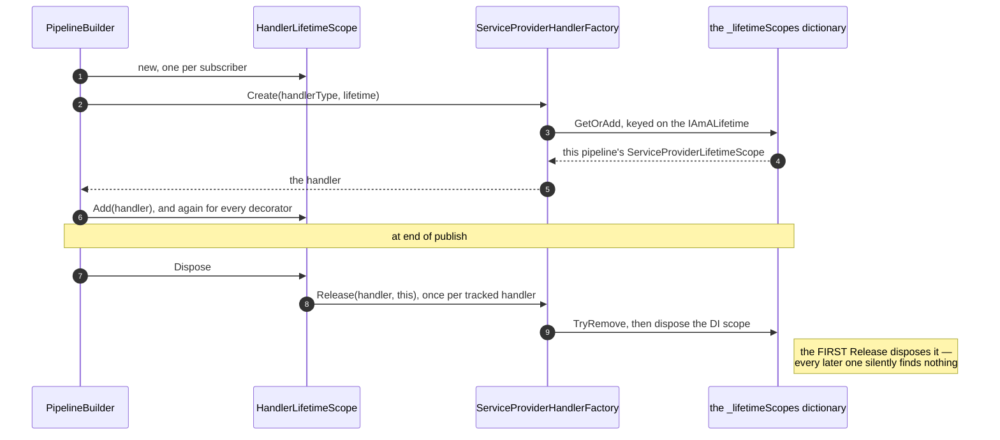
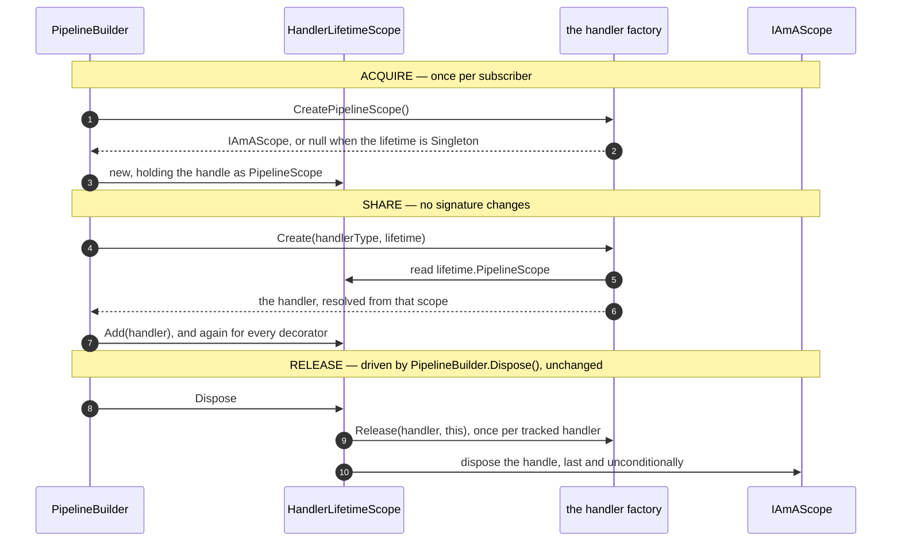
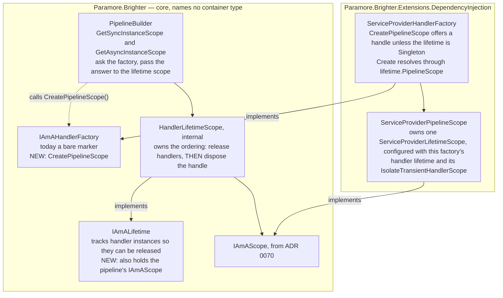

# 71. Handler pipelines take their DI scope as a pipeline scope handle

Date: 2026-08-02

## Status

Proposed

## Context

ADR 0070 gave a transform pipeline one DI scope, carried as an `IAmAScope` handle and released when the pipeline is released. Handler pipelines already have a per-pipeline DI scope — that is the model 0070 copied — but they reach it by an entirely different route, and after 0070 the codebase would hold two mechanisms for one idea.

**Parent Requirement**: [specs/0036-scoped-lifetime-per-pipeline/requirements.md](../../specs/0036-scoped-lifetime-per-pipeline/requirements.md)

**Scope**: This ADR decides one thing — **a handler pipeline obtains and releases its DI scope through the same `IAmAScope` handle as a transform pipeline**. It discharges **FR-13's clauses for handler pipelines** — the lead clause that a scope Brighter created is released when the pipeline completes, which here is preserved rather than newly delivered and is guarded jointly with FR-6, and the **disposal-failure clause** — a `PipelineScope` disposal that throws on a pipeline whose handler completed normally is logged at `LogLevel.Error` and swallowed, and the caller's result is returned unchanged (step 2, AC-33) — and it extends the same rule to a handler `Release` that throws, because FR-5 and FR-6 forbid a teardown failure masking the caller's own exception and `using var` gives a throwing `Dispose()` no way to avoid doing so. The transform-pipeline instance of both is ADR 0070's, and what FR-13 delegates to FR-12 — that a borrowed scope is never disposed at all — is ADR 0072's, through FR-12 itself. **FR-13 divides by family rather than by clause**, and no ADR claims the whole of it. It otherwise preserves the **scoping** exactly: one DI scope per handler pipeline, resolved from at the same points, disposed at the same point. It is not observationally inert — the handle is disposed *after* the handlers are released, so `HandlerLifetimeScope.Dispose()` has to be repaired to survive a throwing `Release`, and an application whose handler factory throws there stops seeing that exception at the call site afterwards (*Consequences*, and the release-note entry ADR 0070 step 7a describes). It exists to protect FR-7 while removing the divergence, and to give ADR 0072 and the ADRs after it one seam to build on instead of two. It also **preserves FR-6 for the handler family** — a throwing handler still releases the pipeline scope, exactly once — and strengthens how: the handle is disposed unconditionally and its disposal is idempotent, where today a throwing `Release` can skip the reclamation entirely. **AC-7** is that guarantee's regression guard, and it attaches to the handle path alongside the duplication of AC-14's named pair that step 6 requires.

It does **not** decide the *ambient* concept, `IAmAScopeProvider`, `ScopeAffinity`, adoption or borrowing, ASP.NET, the opt-in option on `IBrighterOptions`, `Publish`-subscriber ambient suppression, or the `ValidatePipelines()` rules of FR-22. Each is deferred, and to a different sibling: adoption is ADR 0072's, ASP.NET is 0073's, FR-22's rules are 0074's, suppression is 0075's, and the opt-in option is 0076's. It does not change **when** a handler pipeline has a DI scope, **which** lifetimes get one, or **when** it is released. `PipelineBuilder<TRequest>`'s eager per-subscriber resolution and its end-of-publish release stay exactly as they are (D10), and ADR 0039 (`0039-scoping-dependencies-inline-with-lifetime-scope`)'s DI scope per registered subscriber is preserved unchanged.

This ADR **supersedes no prior ADR.** It extends the 0066–0069 sequence and applies the rule ADR 0070 established.

### Where this ADR sits

Seven ADRs deliver the parent requirement, one decision each. This is the second, and the only one that is substantially structural: it discharges FR-13 for the handler family and is otherwise taken for the sake of the ADRs after it.

| ADR | Decides |
| --- | --- |
| 0070 | a transform pipeline takes one DI scope, carried **as a parameter** |
| **0071** *(this one)* | handler pipelines converge onto the **same handle**, carried on the object they already pass |
| 0072 | how a pipeline discovers an **ambient** DI scope the host owns |
| 0073 | the **ASP.NET Core package**, and the one line an application writes to opt in |
| 0074 | **where** the six scope-configuration rules are evaluated |
| 0075 | how a `Publish` subscriber **suppresses** adoption, for itself and everything nested beneath it |
| 0076 | the **affinity option**, and how one setting reaches all four registration paths in any order |

ADR 0070's rule is the one this ADR applies: **the per-pipeline object carries the DI scope.** The two families differ only in *which* object plays that part. A transform `Create(Type)` has no per-pipeline object, so 0070 had to add a parameter; a handler `Create(Type, IAmALifetime)` already receives one, so here the scope rides on it and no signature changes at all.

### How a handler pipeline reaches its DI scope today

The DI scope exists, and it is already per pipeline — but core never holds it. Core holds the *key*, the factory holds the scope in a dictionary keyed on that key, and `Release` is what disposes it:



Step by step, with the code:

1. `PipelineBuilder<TRequest>` creates one `HandlerLifetimeScope` per subscriber — `GetSyncInstanceScope()` (`:567`) and `GetAsyncInstanceScope()` (`:578`), each recording it in `_instanceScopes` (`:47`).
2. That object is passed as `IAmALifetime` on every `Create`: the subscriber's own handler at `:191`/`:236`, and each attribute decorator through `BuildPipeline` (`:272`), `BuildAsyncPipeline` (`:316`), `PushOntoPipeline` (`:499`) and `AppendToPipeline` (`:430`), all of which thread the same `instanceScope`.
3. `ServiceProviderHandlerFactory` keys a DI scope on it: `_lifetimeScopes.GetOrAdd(lifetime, …)` over a `ConcurrentDictionary<IAmALifetime, ServiceProviderLifetimeScope>` (`:40`, `GetOrCreateLifetimeScope` `:127-131`).
4. `HandlerLifetimeScope` tracks each resolved handler (`Add`), and on `Dispose()` calls `factory.Release(handler, this)` for each.
5. `Release` (`:102-107`) delegates to `ReleaseLifetimeScope` (`:133-137`), which does `TryRemove` + `scope.Dispose()`. The **first** release disposes the DI scope; every later one silently finds nothing.
6. `PipelineBuilder.Dispose()` (`:269-270`) drains `_instanceScopes`, which is what starts step 4.

### The divergence ADR 0070 leaves

| | Handler pipeline (today) | Transform pipeline (ADR 0070) |
| --- | --- | --- |
| Per-pipeline object | `IAmALifetime` | the `TransformPipeline<TRequest>` itself |
| The DI scope is | created **inside the factory**, keyed on that object in a dictionary | created **by the factory** and handed out as an `IAmAScope` |
| Held by | nobody in core — core holds only the key | the pipeline |
| Disposed by | the factory, inside `Release` | the pipeline, in its drain |
| Cost per `Create` | a `ConcurrentDictionary` lookup | none |

Two mechanisms for one idea is the immediate cost. The larger one is ahead: **D2 fixes that a single option governs adoption for both handler pipelines and transform pipelines**, so ADR 0072 has to make a handler pipeline able to resolve from an ambient the host owns. Against the dictionary model that means teaching `GetOrCreateLifetimeScope` to sometimes not create, sometimes not own and sometimes not dispose — adoption implemented a second time, in a second shape. Against the handle model it is the same change 0072 already makes for transforms: `CreatePipelineScope()` returns a borrowed scope instead of an owned one.

### The forces

- **The scoping must be preserved, and FR-7's last clause has to be read before this ADR can proceed.** FR-7 is: *"One `Send`/`SendAsync` takes one handler pipeline scope, released when the pipeline completes. This is today's behaviour and must be regression-guarded, **not re-implemented differently**."* This ADR does replace the carrier — a `ConcurrentDictionary<IAmALifetime, ServiceProviderLifetimeScope>` becomes an `IAmAScope` on the object core already holds — so the clause is met head-on rather than skirted. **The reading taken here is that "not re-implemented differently" governs the observable scoping, not the internal carrier**: one DI scope per handler pipeline, resolved from at the same points, disposed at the same point, which step 5's table shows unchanged in every row. Read the other way the clause would forbid ADR 0072 as well, since adoption cannot be delivered by the dictionary without re-implementing it there instead. That is a constraint on *scoping*, and it is not the same as a promise that nothing observable changes — the handle is disposed after the handlers are released, and today's disposal path cannot survive a throwing `Release` long enough to reach it (`HandlerLifetimeScope.cs:74-93`, no `try`/`catch` anywhere). Repairing that is part of this ADR, and its cost is stated in *Consequences* rather than claimed away.
- **`Transient` is not only `Scoped`'s poor relation here.** The handler factory's per-pipeline `ServiceProviderLifetimeScope` serves `Transient` as well as `Scoped`, carrying `IsolateTransientHandlerScope` (`BrighterOptions.cs:37`) into it so each resolution gets its own inner DI scope (ADR 0067). C-6 forbids regressing that. So a handler pipeline takes a handle whenever its lifetime is **not** `Singleton` — where a transform pipeline takes one only under `Scoped`. **A `Transient` handle is not what FR-27.1 calls a pipeline scope**, and the asymmetry does not leak into the seam: FR-27.1 is about a pipeline with a `Scoped` participant, and a `Transient` handler pipeline makes no ambient ask and takes no adoption decision (AC-46's first branch). It is ADR 0067's per-resolution isolation wearing this ADR's handle, and ADR 0072 states the same reconciliation from the seam's side.
- **`IAmALifetime` is already threaded everywhere the scope is needed.** It reaches every one of the four sites that resolve an artefact for a handler pipeline — two for the handler itself, two for every attribute decorator — through **six** methods on `PipelineBuilder` that thread it onwards and resolve nothing themselves. It does so unavoidably, because both `Create` signatures take a non-nullable `IAmALifetime`: no resolution site can exist without one. Anything travelling beside it would travel beside it through every one of them. *Technology Choices* enumerates all **eight** methods that carry it — the six threading methods and the two resolution helpers — with their citations.
- **`IAmALifetime` and `IAmAScope` must stay distinct** (NFR-8). One tracks handler instances so they can be released; the other is a DI scope handle. Neither becomes the other.
- **C-2 — the message pump is untouched.** `Reactor`, `Proactor`, `Dispatcher`, `DispatchBuilder` and `ConsumerFactory` require no change.
- **NFR-4 — what the `ConcurrentDictionary` is currently buying, and what replaces it.** Today the per-pipeline DI scope is created by `_lifetimeScopes.GetOrAdd` and reclaimed by `TryRemove` (`ServiceProviderHandlerFactory.cs:129`, `:135`), and that `TryRemove` is what makes a concurrent double-`Release` dispose exactly once. Removing the dictionary removes that guarantee, so the design has to supply confinement instead of atomicity, and it does: one `HandlerLifetimeScope` is constructed per subscriber and never leaves the `PipelineBuilder` that made it, `CreatePipelineScope()` reads no shared state and shares nothing between calls, and `PipelineScope` is fixed at construction so every reader sees the same value without coordinating. Disposal is issued from exactly one place, on one thread, and `IAmAScope`'s idempotent disposal (ADR 0070) covers the rest. `Publish` runs *subscribers* concurrently, and each has its own handle, so concurrency is between pipelines and never within one. The sites are in *Implementation Approach* and the touched table.
- **D0 and C-1 — the unit is the pipeline, and nesting is a new pipeline, not a nested scope.** A handler that issues a `Send`, a `Post` or a `Publish` builds a fresh `PipelineBuilder` with its own `HandlerLifetimeScope` and its own handle. Microsoft's DI scopes do not nest (C-1) — a scope created from a scoped provider is root-parented — so a nested pipeline's DI scope is a sibling of its caller's, never a child, and its disposal is independent. That is true today and this ADR does not change it; it is stated because the handle makes the relationship look hierarchical when it is not.
- **Core must stay container-agnostic** (ADR 0014, NFR-1). `IAmAScope` names no container type, which is what lets it appear on a core interface at all — and it is what keeps both new members implementable over Autofac or SimpleInjector as readily as over Microsoft's container (NFR-7).
- **Two more public interfaces break.** `netstandard2.0` has no default interface members. `IAmAHandlerFactory` is implemented by 21 classes in this repository (5 in `src/`, 16 test doubles); `IAmALifetime` by 7 (one in `src/`, internal, plus 6 test doubles). One of the 21 implements the **bare marker** and has no body at all — `sealed class DummyHandlerFactory : IAmAHandlerFactory;` — so it gains one.

## Decision

**A handler pipeline's DI scope is an `IAmAScope`, created by its handler factory, carried on the pipeline's `IAmALifetime`, and released when that lifetime scope is released.**

The per-pipeline object carries the DI scope. That is the same rule ADR 0070 states for transform pipelines; the two families differ only in *which* object plays the part, because a handler `Create` already receives one and a transform `Create` does not.

### The mechanism, end to end

Compare this with the *today* diagram above. The lifelines are in the same order and only the fourth changes **role** — the dictionary becomes the handle; the third is relabelled from the concrete `ServiceProviderHandlerFactory` to "the handler factory" because after this ADR the builder asks the interface and any factory may answer. The same three things happen at the same three moments: the dictionary is gone, the handle is held by the object core already owns, and `Release` no longer disposes anything.



Three consequences fall straight out of the diagram. `Create` and `Release` keep their signatures, because the scope travels on an argument they already take. The ordering rule — artefacts back to their factory *before* the DI scope they came from dies — is the same rule ADR 0070 adds to `TransformPipelineDrain` as its third drain step, and here it lives in the one object that knows about both. And the handle is disposed **unconditionally**, which closes a latent leak: today a pipeline whose handler fails to resolve never calls `Release`, so its dictionary entry survives for the life of the process.

### Where the pieces live



**Reading the edges**, on the same convention ADR 0070 uses: a solid arrow is a compile-time reference or an ownership, a dotted arrow is a runtime call. Both edges crossing the boundary are solid and run from the DI package into core, which is the real reference direction. The one call edge stays inside core and lands on the interface — the builder asks `IAmAHandlerFactory`, not the class implementing it, which is why core needs no knowledge that a container exists.

### Key Components

#### The roles, and what each is responsible for

| Role | Type | Stereotype | Responsibility |
| --- | --- | --- | --- |
| Scope offerer | `IAmAHandlerFactory` (core) | **deciding** | Answers, for one handler pipeline, whether it has a DI scope to offer. `null` for `Singleton`; a handle for `Transient` and `Scoped` alike |
| Handler tracker **and** scope holder | `IAmALifetime` (core) | **knowing**, two things | Tracks handler instances so they can be released — its existing job — and now also carries the handle for the pipeline they were resolved from |
| Release ordering | `HandlerLifetimeScope` (core, internal) | **doing** | Releases every tracked handler, then disposes the handle. Never the other way round |
| Scope acquirer | `PipelineBuilder<TRequest>` (core) | **doing** (structurer) | Asks the factory once per subscriber and hands the answer to that subscriber's lifetime scope. Nothing else changes |
| Scope implementation | `ServiceProviderPipelineScope` (DI package) | **knowing** | Owns one `ServiceProviderLifetimeScope`, configured with the handler lifetime and the isolate flag, so `Transient` behaviour is identical |

Loading two responsibilities onto `IAmALifetime` is the cost this ADR pays, and it is paid deliberately: NFR-8 keeps `IAmALifetime` and `IAmAScope` distinct concepts, and the lifetime scope *holds* a scope rather than *becoming* one. *Consequences* records that the name gets no easier to read for it.

#### `IAmAHandlerFactory` gains the offer (core, public)

```csharp
namespace Paramore.Brighter
{
    public interface IAmAHandlerFactory
    {
        /// <summary>Creates a DI scope for one handler pipeline to resolve from, or null when this
        /// factory has none to offer. The caller must always release the returned handle; releasing it
        /// may or may not dispose an underlying scope, and the handle alone knows which.</summary>
        IAmAScope? CreatePipelineScope();
    }
}
```

`IAmAHandlerFactory` (`IAmAHandlerFactory.cs:7`) is today a marker interface with no members, and both `IAmAHandlerFactorySync` (`:36`) and `IAmAHandlerFactoryAsync` (`:36`) derive from it. Putting the member there rather than on both twins means one declaration, one implementation in `ServiceProviderHandlerFactory` (which implements both), and no possibility of a factory answering the two twins differently. The cost is that `IAmAHandlerFactory` stops being a marker and becomes a contract — a fair description of what it now is.

The member's **shape** is ADR 0070's, and so is its *create-failure* behaviour — a container that cannot create a scope throws, and the caller's existing guard turns that into `ConfigurationException`. ADR 0070's **second** failure mode is not yet in play here: a throw from an ambient source, wrapped in `AmbientScopeSourceException` and let past the builders' `catch` filters unwrapped (FR-24.1, AC-30), arrives only when ADR 0072 makes this member ask for an ambient. This ADR makes no ask, so the contract below states one error condition; 0072 widens it and amends both `PipelineBuilder` `catch` filters (`:202-205`, `:248-251`), and AC-30 is written over a `Send` — this family's pipeline. Its **null rule is not**, and the difference matters to an implementor. A transform factory offers nothing unless its configured lifetime is `Scoped`; a handler factory offers a handle for `Transient` too, because ADR 0067's per-resolution scope rides on the same `ServiceProviderLifetimeScope` object and would regress without one (C-6). Applying 0070's rule here — `null` for anything that is not `Scoped` — is the mistake this paragraph exists to prevent.

#### `IAmALifetime` gains the handle (core, public)

```csharp
public interface IAmALifetime : IDisposable
{
    /// <summary>The DI scope this handler pipeline resolves from, or null when it has none.
    /// Released when this lifetime scope is released; whether releasing it disposes anything is
    /// the handle's own business. Distinct from this interface's own job, which is tracking
    /// handler instances so they can be released.</summary>
    IAmAScope? PipelineScope { get; }

    void Add(IHandleRequests instance);        // unchanged
    void Add(IHandleRequestsAsync instance);   // unchanged
}
```

The scope rides on the object that already reaches every resolution site, so **no `Create` or `Release` signature changes** — the handler factory reads `lifetime.PipelineScope`.

**Contract.**

| Member | Input | Output | Error conditions |
| --- | --- | --- | --- |
| `IAmAHandlerFactory.CreatePipelineScope()` | none | an `IAmAScope` the caller must release for `Transient` and `Scoped` alike; `null` for `Singleton`, and `null` from any factory that is not container-backed | May throw if the container cannot create a scope; the caller's existing guard turns that into `ConfigurationException` (`PipelineBuilder.cs:179-205`). It is called **once per pipeline**, by `PipelineBuilder` when it constructs the `HandlerLifetimeScope` |
| `IAmALifetime.PipelineScope` under `Transient` | — | non-null | **FR-27.1's "takes no pipeline scope" is not asserted over this property, and AC-46's "no pipeline scope taken" must not be tested by its nullness.** A `Transient` handler pipeline holds a handle, because ADR 0067's per-resolution isolation rides on it; what FR-27.1 and AC-46 are about is the *seam* — the ambient ask and the adoption decision — and a `Transient` handler pipeline makes neither. AC-46's assertion is written over the ambient recorder: zero asks, zero adoption decisions. An implementation asserting `lifetime.PipelineScope is null` for a `{Transient, Transient, Transient}` host is testing the wrong thing and will fail |
| `IAmALifetime.PipelineScope` | none | the handle this lifetime scope was constructed with, or `null` | Never throws. It is a **stable** property: the value is fixed at construction and does not change between reads, so a factory may read it on every `Create` without coordinating. `null` under a non-`Singleton` lifetime is not an error — it is the no-handle path below. Reading it after the lifetime scope has been disposed is the caller's error, not this property's |

**A handle this factory does not recognise is ignored, not rejected** — the same rule ADR 0070 states for `Create(Type, IAmAScope?)`, and it is one rule for one design rather than two. Where `PipelineScope` is non-null but is not a `ServiceProviderPipelineScope`, `ServiceProviderHandlerFactory` resolves through `GetOrCreateLifetimeScope` exactly as it does today. A handle that this factory *does* recognise but did not create — a `ServiceProviderPipelineScope` built by a second `ServiceProviderHandlerFactory` over a different provider — passes the type test and is resolved from. **That is accepted, and it is the caller's error**, on the same terms as any other misuse of a public `Create(Type, IAmALifetime)`: no identity check is added, because the check would cost every resolution a comparison to defend against a configuration Brighter never builds — `PipelineBuilder` always passes the handle it just obtained from the factory it is about to call. The contract table's error column says so.

Where the handle is genuinely foreign, the consequence is stated rather than buried: **two DI scopes then exist for that pipeline** — the unrecognised handle, disposed by `HandlerLifetimeScope` as it disposes any handle it holds, and Brighter's own, reclaimed by `ReleaseLifetimeScope` on the first `Release` (`ServiceProviderHandlerFactory.cs:133-137`) exactly as before this ADR. On that path the leak this ADR closes is **not** closed: a `Create` whose handler is never tracked leaves the dictionary entry keyed on a dead `IAmALifetime`.

None of Brighter's own paths can reach it. `PipelineBuilder` constructs the `HandlerLifetimeScope` with a handle from the same factory it then calls, and ADR 0072's ladder declines an unusable ambient before any handle is produced, so a foreign handle arrives only from outside the dispatch path — a caller invoking the public `Create(Type, IAmALifetime)` with an `IAmALifetime` of its own, or a lifetime scope built by one factory and passed to another. That is why NFR-5's and NFR-6's per-pipeline budgets are not breached by this rule: they bound what Brighter does, and Brighter does not do this.

The two responsibilities stay legible, and NFR-8's distinction survives: `IAmALifetime` *tracks handlers*; `IAmAScope` *is a DI scope*. The lifetime scope holds one, it does not become one. The XML documentation on both says so.

#### `HandlerLifetimeScope` — the ordering lives here (core, internal)

`HandlerLifetimeScope` (`:33`) takes the handle in its constructor, exposes it as `PipelineScope`, and in `Dispose()` releases every tracked handler **first** and disposes the handle **second**.

That ordering rule is the one ADR 0070 gives transform pipelines, where it lands as `TransformPipelineDrain`'s new third step — artefacts go back to their factory before the DI scope they were resolved from dies, so a factory whose `Release` still has work to do is not left resolving against a dead scope. Neither family enforces it today, because until 0070 neither pipeline object held a DI scope to order against. Putting it inside `HandlerLifetimeScope` means the one object that knows about both the handlers and the scope is the object that orders them, and `PipelineBuilder.Dispose()` (`:269-270`) needs no change at all.

#### Where each type is touched

| Assembly | Type | Change |
| --- | --- | --- |
| `Paramore.Brighter` | `IAmAHandlerFactory` (`:7`) | gains `IAmAScope? CreatePipelineScope()` |
| `Paramore.Brighter` | `IAmALifetime` (`:34`) | gains `IAmAScope? PipelineScope { get; }` |
| `Paramore.Brighter` | `HandlerLifetimeScope` (`:33`, `internal`) | takes and exposes the handle; disposes it after releasing tracked handlers |
| `Paramore.Brighter` | `HandlerLifetimeScope.Log` (`:95`) | gains `FailedToReleaseHandler` and `FailedToDisposePipelineScope`, both at `LogLevel.Error` — the first for a handler-factory `Release` that throws, the second for a scope-disposal failure on a completed pipeline (FR-13, AC-33). The four existing `Debug` members are unchanged. **The second depends on ADR 0070 step 4b**: without the surfacing disposal path that ADR adds, `ServiceProviderLifetimeScope.Dispose()` catches the failure and writes `FailedToDisposeScope` at `Warning` (`:462-501`, `:520`), and this member never fires |
| `Paramore.Brighter` | `PipelineBuilder<TRequest>` | `GetSyncInstanceScope()` (`:567`) and `GetAsyncInstanceScope()` (`:578`) ask the factory and pass the result to the `HandlerLifetimeScope` constructor. Nothing else **in this ADR** — two siblings edit the same class: ADR 0072 amends both `catch` filters (`:202-205`, `:248-251`) and ADR 0075 adds a defaulted `bool isolateSubscribers` to the two dispatch constructors (`:59`, `:76`) with a bracket inside both build-loop bodies (`:187-198`, `:232-244`) |
| `Paramore.Brighter` | `SimpleHandlerFactorySync` (`:33`), `SimpleHandlerFactoryAsync` (`:33`) | `CreatePipelineScope()` returns `null` |
| `Paramore.Brighter` | `SimpleHandlerFactory` (`SimpleHandlerFactory.cs:11`, **public**) | the same. It implements **both** twins, which is why alternative 6's "one declaration, not two" argument is not hypothetical: it and `ServiceProviderHandlerFactory` are the two in-repo types that would otherwise have to answer the same question twice |
| `Paramore.Brighter.ServiceActivator` | `ControlBusHandlerFactorySync` (`ControlBusHandlerFactory.cs:6`) | the same. It gains no container dependency — `IAmAScope` is a core type |
| `…DependencyInjection` | `ServiceProviderHandlerFactory` (`:34`) | implements `CreatePipelineScope()`; `Create` resolves through `lifetime.PipelineScope`. Both `Release` overloads (`:102-107`, `:120-125`) are **unchanged** |
| `…DependencyInjection` | `ServiceProviderPipelineScope` (new in ADR 0070) | **unchanged in specification, exercised here for the first time on a non-`Scoped` lifetime**: the `ServiceProviderLifetimeScope` it owns is configured with its creator's lifetime, so a `Transient` handler pipeline gets a `Transient` one carrying `IsolateTransientHandlerScope`. No new member; see *Technology Choices* |

Unchanged, and named so the omission is not read as an oversight: `IAmAHandlerFactorySync.Create`/`Release` and their async twins; `Pipelines<TRequest>` and `AsyncPipelines<TRequest>`; `BuildPipeline`, `BuildAsyncPipeline`, `AppendToPipeline`, `AppendToAsyncPipeline`, `PushOntoPipeline` and `PushOntoAsyncPipeline`, which keep threading `IAmALifetime` and nothing beside it, as do `HandlerFactory.CreateRequestHandler` and `AsyncHandlerFactory.CreateAsyncRequestHandler`; `PipelineBuilder.Dispose()`; `CommandProcessor`; the pumps (C-2); `BrighterOptions`; and everything ADR 0070 decided for the transform family.

`Paramore.Brighter.ServiceActivator` keeps its current dependency set — a single project reference to `Paramore.Brighter`, no package reference — because `ControlBusHandlerFactorySync`'s new member names only core types (NFR-3).

### Technology Choices

**Why the handle hangs off `IAmALifetime` rather than travelling as a second parameter.** A parameter is what ADR 0070 chose for the transform family, and the first instinct is to copy it exactly. It is the wrong fit here. `IAmALifetime` is already threaded through **six** methods on `PipelineBuilder` that pass it onwards without resolving anything — `BuildPipeline` (`:272`), `BuildAsyncPipeline` (`:316`), `AppendToPipeline` (`:430`), `AppendToAsyncPipeline` (`:451`), `PushOntoPipeline` (`:499`) and `PushOntoAsyncPipeline` (`:525`), the sync and async twins of each of three — to reach four sites that do resolve: the subscriber's own handler at `PipelineBuilder.cs:191` and `:236`, and every attribute decorator at `HandlerFactory.cs:47` and `AsyncHandlerFactory.cs:46`. Two further methods carry it into those decorator sites — `HandlerFactory.CreateRequestHandler` (`HandlerFactory.cs:44`) and `AsyncHandlerFactory.CreateAsyncRequestHandler` (`AsyncHandlerFactory.cs:42`) — so **eight** methods carry an `IAmALifetime` in all. Both `Create` signatures take it non-nullably (`IAmAHandlerFactorySync.cs:44`), so no resolution site can exist without one. A scope parameter would travel beside it through all eight, forever, as a second thing that is always passed with the first, and not one of them could drop it. Two parameters that are never apart are one parameter. Hanging the scope on the object that already makes the journey costs one property, changes no method signature, and keeps the rule identical in both families: *the per-pipeline object carries the DI scope*.

**Why `Create` and `Release` do not change.** The factory reads the scope off the argument it already has, so neither signature moves — and neither does `Release`'s **body**. On the handle path `Release(handler, IAmALifetime)` does nothing *to the handler*, which is what its own documentation already says (`ServiceProviderHandlerFactory.cs:94-99`: disposing the scope is what disposes the handler, so disposing it here would dispose it twice). What changes is that it no longer disposes the pipeline's **DI scope** either: its `ReleaseLifetimeScope` call finds no dictionary entry to remove, because a pipeline that supplied a handle never made one. That same call is what still reclaims the no-handle path below, which is why it stays. This is also why the transform family's `Release` was left alone in 0070: in both families the pipeline object owns the scope, so no `Release` may dispose it.

**`ServiceProviderPipelineScope` is configured by its creator, which is how ADR 0070 specifies it and what the handler family needs.** 0070 states the type as owning one `ServiceProviderLifetimeScope` constructed with **its creator's** configured lifetime and isolate-transient flag, noting that on a transform pipeline that lifetime is always `Scoped` because a transform factory offers a handle under `Scoped` and nothing else. The handler family is the reason the specification is written over the creator rather than over a constant: here the handler factory constructs it with `new ServiceProviderLifetimeScope(_serviceProvider, _handlerLifetime, _isolateTransientHandlerScope)` — the same three arguments `GetOrCreateLifetimeScope` (`ServiceProviderHandlerFactory.cs:127-131`) passes today — so the wrapped lifetime scope is configured `Transient` for a `Transient` handler pipeline, carrying `IsolateTransientHandlerScope` with it. **The type's lifetime is its creator's, not a constant** — a restatement of 0070's specification from the family that exercises the non-`Scoped` case, not a change to it. It is what makes `Transient` behaviour identical: the per-pipeline lifetime scope still isolates each resolution and still drains its outstanding inner scopes when the pipeline ends (C-6, ADR 0067). Nothing else about the type changes — it still wraps exactly one lifetime scope and still disposes it exactly once.

**The dictionary survives as the no-handle path.** `Create` may be called with a `lifetime` whose `PipelineScope` is `null` — a hand-rolled `IAmALifetime`, or a caller invoking the factory outside a `PipelineBuilder`. That case keeps `_lifetimeScopes` and today's `GetOrAdd`/`TryRemove` behaviour exactly, so no existing caller changes meaning. Brighter's own paths never take it, because `PipelineBuilder` always supplies a handle when the factory offers one.

### Implementation Approach

**1. Core.** Add the two members. `IAmAScope`'s XML documentation (ADR 0070) gains a sentence about handler pipelines; `IAmALifetime`'s gains the reciprocal one NFR-8 requires.

**2. `HandlerLifetimeScope`.** Constructor takes `IAmAScope? pipelineScope` after the factory arguments; the three existing constructors forward it. `Dispose()` is rewritten to the hold-and-compose shape ADR 0068 requires, and the fault tolerance runs **handler to handler**, not merely between the releases and the disposal:

- release every tracked sync handler, then every tracked async handler, catching per item and recording the failure for logging rather than letting it abort the loop — today a throw from the first tracked handler skips every remaining `Release` *and* both `Clear()` calls (`HandlerLifetimeScope.cs:74-93`, no `try`/`catch` anywhere);
- clear both tracking lists unconditionally, so the scope does not outlive its disposal holding references;
- dispose `PipelineScope` last and unconditionally, catching any failure and holding it too;
- log every held failure at `LogLevel.Error` — handler-release failures through a new `FailedToReleaseHandler` member, the scope disposal through a new `FailedToDisposePipelineScope` member, both on the existing `Log` partial (`HandlerLifetimeScope.cs:95`) — and **throw nothing**.

**`Dispose()` never throws, and that is one rule for both failure kinds rather than two.** The tempting design surfaces a handler `Release` failure to the caller — it is the application's own teardown code failing on an object it owns, and ADR 0068's rule is that an explicit `Dispose` surfaces failures rather than hiding them. It cannot be had here. `CommandProcessor` disposes the builder through `using var` (`CommandProcessor.cs:317`, `:394`, `:472`, `:575`), so an exception leaving `Dispose()` **replaces** whatever the handler itself threw — it does not chain to it, and the original is not recoverable. FR-5 requires that "a release failure must not mask it" and FR-6's example requires a throwing handler's exception to reach "the caller unchanged", so a `Dispose()` that can throw is not compatible with either. Surfacing a release failure on a pipeline that *succeeded* is no better founded: FR-13's rule that a completed pipeline is not failed by its own teardown does not become a different rule because the failing object was resolved rather than created.

So both kinds are logged at `Error` and swallowed, neither is latched, and the caller's result — or the caller's own exception — is returned unchanged. **AC-33 is that rule's regression guard for the scope-disposal half and AC-51 for the handler-release half.** **AC-7 is not the second of those**, and the distinction is worth stating because the two read alike: AC-7's Given has a throwing **handler**, not a throwing `Release`, so it guards the release-exactly-once guarantee (FR-6) and says nothing about a teardown that itself fails. AC-51 is the criterion written for this rule. ADR 0068 is still satisfied in the part that matters: the failure is *reported*, at the level a diagnostic failure warrants, rather than discarded silently. What is given up is the ability to fail a call because its teardown failed, which nothing in the requirements asks for and two requirements forbid.

The hold-every-failure part is the shape `TransformPipelineDrain` already has on the transform side, and it is the reason step 6 adds a mirror of that family's regression test.

**The release is synchronous, and here are the three types that make it so** — an implementor otherwise looks for the `await using` that is not there. `IAmALifetime` (`IAmALifetime.cs:34`), `IAmAPipelineBuilder<TRequest>` (`IAmAPipelineBuilder.cs:36`) and `IAmAnAsyncPipelineBuilder<TRequest>` (`IAmAnAsyncPipelineBuilder.cs:37`, `internal` like the one before it) are all `IDisposable` and none is `IAsyncDisposable`, so `Dispose()` is the only exit even on the async dispatch path. What makes a blocking release safe there is the container's own suppression of the current `SynchronizationContext` for the duration of its synchronous drain (`ServiceProviderLifetimeScope.cs:422-436`, marked a load-bearing invariant in the source). *Consequences* argues the trade and says what revisiting it would cost.

**3. `PipelineBuilder`.** In `GetSyncInstanceScope()` and `GetAsyncInstanceScope()`, ask the factory that is already in hand:

```csharp
private IAmALifetime GetSyncInstanceScope()
{
    if (_syncHandlerFactory is null)
        throw new NullReferenceException("HandlerFactorySync is null");

    var scope = new HandlerLifetimeScope(_syncHandlerFactory, _syncHandlerFactory.CreatePipelineScope());
    _instanceScopes.Add(scope);

    return scope;
}
```

Nothing else in `PipelineBuilder` changes **in this ADR**; the two siblings that edit the same class are named in the touched table. The scope is added to `_instanceScopes` inside the `HandlerLifetimeScope` it belongs to, so `Dispose()` (`:269-270`) already reaches it, and D10's release timing — every subscriber's scope drained together at end of publish, not tightened — is preserved by construction rather than by care.

**4. `ServiceProviderHandlerFactory`.** `CreatePipelineScope()` returns a new `ServiceProviderPipelineScope` when `_handlerLifetime` is not `Singleton`, and `null` when it is. Both `Create` overloads keep their `Singleton` branch on `_singletonScope` and, for the other two lifetimes, resolve through `lifetime.PipelineScope` when it is a `ServiceProviderPipelineScope`. Where it is `null`, or is a handle this factory does not recognise, they fall back to `GetOrCreateLifetimeScope` — today's behaviour exactly, on today's terms, with the consequences the contract above sets out.

**Neither `Release` overload is modified** (`:102-107`, `:120-125`), and this is easy to get wrong: their `ReleaseLifetimeScope(lifetime)` call is what still reclaims the no-handle path, and on the handle path it is a no-op because `TryRemove` finds no entry — a pipeline that supplied a handle never called `GetOrAdd`. Deleting the call to match "`Release` disposes nothing" would break the fallback. The two paths coexist in one unchanged method body.

**5. Behaviour by configured lifetime.** Nothing in this column changes; only where the scope comes from does.

| Handler lifetime | `CreatePipelineScope()` | Resolution and reclamation | Changed? |
| --- | --- | --- | --- |
| `Transient` | a handle over a `Transient` lifetime scope carrying `IsolateTransientHandlerScope` | each resolution gets its own inner DI scope, all drained when the pipeline ends — ADR 0067 unchanged | **No** |
| `Scoped` | a handle over a `Scoped` lifetime scope | one DI scope for the pipeline; one artefact per type; disposed when the pipeline ends | **No** |
| `Singleton` | `null` | the root provider, one artefact per process | **No** |

**6. Regression guards.** `FactoryLifetimeTests.Factory_WithScopedLifetime_ReturnsSameInstanceWithinScope` (`tests/Paramore.Brighter.Extensions.Tests/FactoryLifetimeTests.cs:36`) and its async twin (`:154`) drive `Create` with a hand-rolled `TestLifetimeScope`, so after this change they exercise the **no-handle** path and their assertions and setup keep passing unchanged. The *file* still changes: `TestLifetimeScope` (`:311`) implements `IAmALifetime` with three members and is one of the six test doubles the interface break counts, so it gains `PipelineScope => null` like the other five. That is useful — it pins the fallback — but it means this pair no longer exercises the path Brighter itself takes. The designation is **AC-14's**, not AC-9's: AC-14's *"Explicitly NOT excluded"* clause names both tests, requires them to keep passing unchanged, and says they "serve as regression guards for AC-9". They will keep passing, on the fallback. **Both must therefore be duplicated onto the handle path**, resolving through a `TestLifetimeScope` whose `PipelineScope` is the factory's own, and AC-14's designation attaches to the duplicated pair as well.

FR-7's guarantee is **not** left unguarded in the meantime: AC-9 is written over an end-to-end `Send`, which necessarily builds its pipeline through `PipelineBuilder` and therefore takes the handle path. What the duplication buys is a *direct* guard on within-pipeline handler identity over a handle, at the same level of the stack the existing pair guards it on the fallback — worth having, and not a hole being plugged.

A second test is required work, not a nicety: the mirror of `When_a_transform_release_throws_the_scope_still_releases_the_rest` for the handler family. A `HandlerLifetimeScope` holding three tracked handlers, whose factory's `Release` throws on the first, must still release the other two, still clear both tracking lists, still dispose the handle, and record exactly one `LogLevel.Error` naming the failing release — while `Dispose()` itself **returns normally**. It does not surface the failure composed: that is the transform family's shape, and step 2 rejects it here (AC-51's third clause). Nothing today asserts any of that, which is why the defect step 2 repairs has survived.

A third is **AC-33's regression guard**: a `Send` whose handler completes normally, over a handle whose `Dispose()` throws, must return the handler's result unchanged, must record the failure at `LogLevel.Error` through a capturing `ILoggerProvider` registered for `Paramore.Brighter.*`, and a second `Send` must behave identically — the failure is swallowed, not latched.

A fourth is **AC-51's**, and it is the one an implementation is most likely to fail: a `Send` whose handler throws `InvalidOperationException` **and** whose factory's `Release` also throws must surface the handler's `InvalidOperationException` to the caller, with the release failure appearing only in the log at `Error`. An implementation that lets `Dispose()` throw passes every other test in this ADR and fails this one, because `using var` puts the disposal failure in the caller's path in place of the handler's.

## Consequences

### Positive

- **One mechanism, with one stated exception.** Both families now say the same thing: a factory offers a scope, the per-pipeline object holds it, and disposes it after its artefacts have gone back. One story to teach, one ordering rule, one handle type. They differ in *how* the disposal is issued — synchronously here, and see the timing difference recorded under *Negative* — but not in what is disposed, when, or in what order.

  **They also agree on the outcome of a teardown failure, by different mechanisms, and the difference is forced by the call sites rather than chosen.** In neither family does a teardown failure reach the caller. On the transform side the drain composes and throws, and the six release sites catch it and log `FailedToReleasePipeline` at `Warning` — they are already written that way and ADR 0070 leaves them alone. On the handler side there is no such catch to rely on: `CommandProcessor` disposes the builder through `using var`, so anything `Dispose()` threw would leave `Send` in place of the handler's own exception. The failure is therefore caught and logged where it happens. Same guarantee to the caller, one level louder here because nothing downstream will report it.
- **ADR 0072 builds adoption once.** A borrowed ambient becomes what `CreatePipelineScope()` returns, for handler pipelines and transform pipelines alike. Under the dictionary model the handler side would have needed its own "sometimes do not create, sometimes do not own, sometimes do not dispose" variant.
- **`Release` stops having a hidden second job.** Today the first `Release` on a pipeline disposes the DI scope and the rest silently find nothing — behaviour that is invisible at the call site and depends on iteration order inside `HandlerLifetimeScope.Dispose()`. Now disposal happens once, in one place, explicitly.
- **A dictionary lookup leaves the resolution path.** Every handler and every decorator resolution currently pays a `ConcurrentDictionary` `GetOrAdd` keyed on an object with reference identity; now the handle is a field read. The atomicity that `GetOrAdd`/`TryRemove` supplied is replaced by confinement rather than dropped — one handle per subscriber, never shared, disposed from one place — which the forces bullet on NFR-4 sets out.
- **A latent leak closes.** `Create` populates `_lifetimeScopes` before it resolves, and only `Release` removes the entry. A pipeline whose handler fails to resolve — `Create` returns null and `PipelineBuilder` throws `ConfigurationException` (`:192-193`) — never tracks a handler, so `Release` is never called and that entry, with its `ServiceProviderLifetimeScope`, stays for the life of the process. Under this ADR `HandlerLifetimeScope.Dispose()` disposes the handle unconditionally.
- **No signature changes on `Create` or `Release`**, so the eight methods that carry `IAmALifetime` are untouched and the diff stays small where the logic is dense.

### Negative

- **Two more public interfaces break at compile time.** `IAmAHandlerFactory` (21 implementations here: 5 in `src/`, 16 test doubles) and `IAmALifetime` (7: one internal `src/` class, 6 test doubles). On `netstandard2.0` there is no default interface member to absorb either. Both belong in the single `release_notes.md` entry ADR 0070 step 7a describes, with the migration: `CreatePipelineScope()` returns `null`, `PipelineScope` returns `null`, unless you want pipeline scoping.

  **Neither break is named by the authorities usually cited for them, and the ledger covers them by extension rather than by their text.** NFR-1's withdrawn signature freeze names exactly six interfaces, and neither `IAmAHandlerFactory` — the shared base, today a bare marker — nor `IAmALifetime` is among them; AC-24's obligation is written over "the six **factory** interfaces", and `IAmALifetime` is not a factory interface at all. NFR-1(c)'s obligation to release-note a break is read as extending to both, on the same reasoning that withdrew the freeze. **No requirements amendment is owed to make the ledger cover them**: ADR 0070 step 7a's single entry names **eight interfaces across this ADR and 0070, three of which are not factories** — the two mapper registries and `IAmALifetime` — and an entry that states more than AC-24 requires satisfies AC-24 rather than contradicting it. One *is* owed for an unrelated reason, and it happens to name both: AC-24's last clause counts "the six **factory** interfaces **whose signature changed**", and under this design no count of six exists — ADR 0070 step 7a does that arithmetic — so the clause is amended to name NFR-1's six together with `IAmAHandlerFactory` and `IAmALifetime`. The ledger is deliberately a superset, ADR 0070 and ADR 0075 say the same, and what a reader must not conclude is that the extra breaks went unrecorded because no acceptance criterion demanded them.

  **The direction that looks like a gap, and is not.** AC-24's clause is a definite description — "the six **factory** interfaces **whose signature changed**" — and NFR-1's withdrawal list names six, two of which are `IAmAHandlerFactorySync` and `IAmAHandlerFactoryAsync`. Alternative 6 puts `CreatePipelineScope()` on the shared base rather than on each twin, so **those two twins' own signatures do not change**, and a reader counting signatures against NFR-1's list finds **four**, not six. The count that does reach five is a different one over a different set — the **factory** interfaces whose own signature changes, which drops the twins and adds `IAmAHandlerFactory`, a base that is on no requirement's list — and ADR 0070 step 7a sets both counts out rather than reconciling them, because they cannot be reconciled: AC-24's numeral has no referent under either. Nothing is uncovered by it: every implementation of either twin still stops compiling, because the base it extends gained a member — which is exactly what an application implementing `IAmAHandlerFactorySync` sees, and that documentation tells clients to implement it. ADR 0070 step 7a names both twins and writes their migration for that reason. The choice is deliberate and is not revisited to make an enumeration come out even: a pipeline has one scope, and an offer on both twins invites two.

- **The external cost of breaking the handler factory family is not the same argument ADR 0070 makes for its six, and it is higher.** 0070 can say its interfaces have no known public implementations and point at `IAmAMessageMapperRegistry`'s own documentation saying the interface "is provided for testing". That argument does not transfer. `IAmAHandlerFactorySync`'s documentation says the opposite: *"we require clients of the Paramore.Brighter library need to implement `IAmAHandlerFactorySync`… Typically you would use an IoC container to implement the Handler Factory"* (`IAmAHandlerFactorySync.cs:32-34`). This is the seam Brighter has always told applications to implement themselves, so an out-of-repo implementation is the expected case, not a hypothetical one, and every one of them stops compiling.

  What keeps the cost bearable rather than absent: the migration is a single member returning `null` on a base interface most implementers reach through a twin they already implement; it restores exactly today's behaviour; and the alternative — reaching the factories by ambient state — was rejected in ADR 0070 on grounds that apply here unchanged. **The honest statement is that this ADR spends an externally-visible break on an internal structural gain**, and *Alternatives* 1 is where that trade is argued. Applications supplying a container-backed factory of their own also gain the ability to offer a pipeline scope, which is the only thing they get back for the break.
- **This ADR discharges FR-13 for the handler family and is otherwise structural, and it is still not free.** Both of that requirement's clauses are its own for this family (step 2, AC-33 for the disposal-failure half, AC-7 for the handler-release rule it extends to); everything else here is a structural change taken for the sake of the ADRs after it, and it costs two interface breaks and one observable behavioural change to make — a legitimate thing to argue about, and the reason *Alternatives* below states the do-nothing option first. What it does **not** change is the scoping: which pipelines get a DI scope, which lifetimes get one, where artefacts resolve from, and when the scope is disposed are all exactly as they are today (step 5's table).
- **`IAmALifetime` now holds something that is not a handler.** The name was already close enough to `IAmAScope` to need NFR-8; putting an `IAmAScope` *on* it narrows the gap further. Mitigated only by documentation, which is a weaker mitigation than a better name would have been.
- **The handler pipeline releases its scope synchronously, and the transform pipeline does not.** Both **async** dispatch paths take the builder with `using`, not `await using` (`CommandProcessor.cs:394`), and all three types on that path are `IDisposable` and not `IAsyncDisposable` — step 2 names them with their citations. So an async handler pipeline's `IAmAScope` can only be released through `Dispose()`, while ADR 0070's transform pipeline releases through `DrainAsync` and a genuinely asynchronous scope disposal. This is deliberate and it is not free.

  It is **safe** rather than merely tolerated: the synchronous drain in `ServiceProviderLifetimeScope.DisposeScope` suppresses the current `SynchronizationContext` for the duration, and is documented as existing precisely to stop an `IAsyncDisposable` artefact deadlocking the Proactor pump's single-threaded context. What it costs is occupancy: the disposal runs to completion on the calling thread, which on the Proactor is the pump thread. The alternative was to put `IAsyncDisposable` on `IAmALifetime` — a second break on a public interface with seven implementations — plus both internal builder interfaces and two `CommandProcessor` call sites, to remove a block the container already makes safe. That trade was declined here and can be revisited without disturbing anything this ADR decides, because the handle type already carries both members.

- **The no-handle path survives in `ServiceProviderHandlerFactory`.** `_lifetimeScopes`, `GetOrCreateLifetimeScope` and `ReleaseLifetimeScope` remain for callers that supply no handle, so the factory carries two resolution paths and two disposal paths where the goal was one. Brighter's own code never takes the second, which is exactly what makes it easy to leave rotting.
- **The FR-7 regression guards move to the path Brighter no longer takes.** `FactoryLifetimeTests`' two tests — named in **AC-14**'s *"Explicitly NOT excluded"* clause and required to keep passing unchanged — keep passing precisely because they use the fallback. That designation now has to attach to the duplicated handle-path pair as well, which is an amendment to **AC-14**, not merely extra test coverage. It is a smaller amendment than it first appears: AC-9's own end-to-end `Send` still runs over the handle path, so what moves is the *unit-level* guard, not the guarantee.
- **`HandlerLifetimeScope.Dispose()` gains error-composition logic, and that is a repair, not an addition.** Today `Dispose()` (`HandlerLifetimeScope.cs:74-93`) is two bare `.Each(…)` loops calling `Release(trackedItem, this)` with no `try`/`catch` anywhere, followed by two `Clear()` calls. A user factory's `Release` can throw — `SimpleHandlerFactorySync.Release` calls `disposable?.Dispose()` — and a throw from the first tracked handler aborts the loop, skips every remaining `Release`, and skips both `Clear()` calls, leaving a disposed scope still holding references to handlers that were never released. The transform family already has this fixed and regression-guarded (`tests/Paramore.Brighter.Core.Tests/MessageSerialisation/When_a_transform_release_throws_the_scope_still_releases_the_rest.cs`). So step 2 is not merely adding composition between the handler releases and the new scope disposal; it is bringing handler-to-handler fault tolerance up to the standard the transform side already meets. The work is larger than "one new step", and the existing defect is real today.

  **And it is the one thing an application can observe change.** Today a throwing `Release` propagates its own exception, unwrapped, out of `Dispose()` and therefore out of `Send` or `Publish`; afterwards every handler is released, both tracking lists are cleared, the handle is disposed, and the release failure is logged at `Error` and swallowed. Code that catches the specific type a handler's `Dispose` throws stops seeing it, and must read the log instead — a behavioural break, and one this ADR does not have the option of avoiding, because the handle is disposed *after* the releases and an aborted loop would leave it undisposed, which is a scope leak on the very path this ADR adds. It joins ADR 0070 step 7a's single release-note entry (AC-24).

- **Neither teardown failure is observable to a caller any more, and a diagnostic that used to be loud is now only logged.** Today a handler factory's `Release` that throws propagates its own exception out of `Dispose()` and therefore out of `Send`; afterwards it is logged at `Error` and swallowed, exactly as a `PipelineScope` disposal failure is (FR-13, AC-33). The cost is real and falls on whoever writes a failing `Release`: a container whose teardown fails every time reports it only in the log, and an application that never reads logs at `Error` will not notice a resource it is failing to reclaim. That cost is accepted because the alternative is worse — under `using var` a throwing `Dispose()` destroys the handler's own exception rather than joining it, which FR-5 and FR-6 both forbid — and because it is the same trade ADR 0070 makes for transform pipelines.

### Risks and Mitigations

| Risk | Mitigation |
| --- | --- |
| `Transient` handler behaviour drifts — the per-resolution isolation of ADR 0067, or `IsolateTransientHandlerScope` | `CreatePipelineScope()` constructs the `ServiceProviderLifetimeScope` with the same three arguments `GetOrCreateLifetimeScope` passes today, including the flag. A handler pipeline takes a handle for `Transient` as well as `Scoped`, unlike a transform pipeline. C-6 |
| Release timing changes, tightening or loosening D10 | The handle is disposed by `HandlerLifetimeScope.Dispose()`, which `PipelineBuilder.Dispose()` (`:269-270`) already drives at exactly the point the DI scope is disposed today. `PipelineBuilder` needs no new list and no new disposal call |
| `Publish` subscriber isolation regresses (ADR 0039) | One `HandlerLifetimeScope`, and therefore one handle, per subscriber, created in the same loop as today (`:190`, `:235`). Nothing is shared between subscribers |
| A decorator resolves from a different scope than its handler | Decorators resolve through the same `IAmALifetime` instance they do today — all eight methods that carry it are listed in *Technology Choices* — and the handle is a property of it. Same object, same scope, by construction |
| Double disposal of the handle | `HandlerLifetimeScope.Dispose()` is the only place that disposes it, and `IAmAScope`'s disposal is idempotent (ADR 0070). `Release` disposes nothing on this path |
| The surviving no-handle path silently diverges from the handle path over time | Both are exercised: `FactoryLifetimeTests`' existing pair pins the fallback, and the duplicated pair required above pins the handle path |
| Terminology drift between `IAmAScope`, `IAmALifetime`, `HandlerLifetimeScope`, `ServiceProviderLifetimeScope` and `TransformLifetimeScope` | NFR-8: XML documentation on `IAmALifetime` and `IAmAScope` states what each is for and how they relate, now including that one holds the other; `docs/guides/lifetimes-and-scoping.md` (FR-25) carries the same distinction |

## Alternatives Considered

**1. Do nothing — leave handler pipelines on the dictionary.** ADR 0070 stands on its own, the handler family keeps working, and no interface breaks. **Rejected**, but it is the serious alternative. It leaves two mechanisms for one idea in a codebase where the defect being fixed was itself a divergence between two factory families, and it pushes the cost to ADR 0072, which must then implement ambient adoption twice — once against a handle it is handed, once against a dictionary it owns — with `Publish` subscriber isolation (FR-8) to get right in both. The breaking change is cheaper now than the second adoption path is later.

**2. Copy ADR 0070 exactly: a scope parameter on `Create`.** `Create(Type, IAmALifetime, IAmAScope? scope = null)`, symmetric with the transform family. **Rejected**: the handler resolution path threads `IAmALifetime` through the six `PipelineBuilder` methods *Technology Choices* names, as well as the two resolution helpers, so the scope would be a second parameter travelling beside the first through all eight, permanently. Two parameters that are never apart should be one. The transform family takes a parameter only because its `Create(Type)` has no per-pipeline object to hang anything on — that absence is the problem ADR 0070 exists to solve, not a shape to imitate.

**3. Replace `IAmALifetime` with `IAmAScope`.** One per-pipeline type instead of two: delete `HandlerLifetimeScope`'s tracking and let the DI scope's disposal reclaim the handlers. Maximum alignment. **Rejected**: the two do genuinely different jobs, and only one of them is Brighter's to own. `IAmALifetime` exists so that a **user-supplied** handler factory gets a `Release` call per handler — a factory that pools handlers, or one over a container that requires explicit release, depends on it. A DI scope's disposal reclaims what *the container* created, not what someone else's factory did. NFR-8 keeps them distinct for the same reason, and ADR 0072 will implement `IAmAScope` over a borrowed request scope that has no business tracking anyone's handlers.

**4. Give the handler family a token and a dictionary, and make the transform family match it.** Converge in the other direction: leave `ServiceProviderHandlerFactory` as it is and have the mapper and transformer factories key their scopes on a shared per-pipeline token too. **Rejected — it cannot work.** A transform pipeline is served by *two* factories built at two different construction sites; a per-factory dictionary keyed on the same token hands each of them its own DI scope, which is Defect 1b, unfixed. A dictionary shared across both factories is a package-level table — the ambient rejected as ADR 0070's Alternative 2. Only the handle can carry a scope between two factories, so convergence can only run in this direction.

**5. Hold the handles in a second list on `PipelineBuilder`.** `_pipelineScopes` beside `_instanceScopes`, both drained in `Dispose()`. Keeps `IAmALifetime` unchanged, so one fewer interface breaks. **Rejected**: two lists that must stay index-aligned and be disposed in a fixed order relative to one another, with the ordering rule living in `PipelineBuilder` rather than in the object that knows about both handlers and scope. It also leaves the factory unable to reach the handle, so alternative 2's parameter comes back with it.

**6. Put `CreatePipelineScope()` on both handler factory twins rather than on `IAmAHandlerFactory`.** Symmetric with the transform family, where the four interfaces each declare it. **Rejected**: `IAmAHandlerFactory` already exists as the shared base (`IAmAHandlerFactory.cs:7`) and the transform family only declares it four times because it has no such base. Declaring it twice would let a factory implementing both twins answer them differently, which has no meaning — a pipeline has one scope.

## References

**Related ADRs — the other six of this set:**

- ADR 0070 [0070-per-pipeline-di-scope-for-mapper-and-transform-factories](0070-per-pipeline-di-scope-for-mapper-and-transform-factories.md) — a transform pipeline takes one DI scope, carried as a parameter
- ADR 0072 [0072-ambient-scope-adoption-seam](0072-ambient-scope-adoption-seam.md) — how a pipeline discovers an ambient DI scope the host owns
- ADR 0073 [0073-aspnet-core-request-scope-package](0073-aspnet-core-request-scope-package.md) — the ASP.NET Core package, and the one line an application writes to opt in
- ADR 0074 [0074-lifetime-validation-evaluation-site](0074-lifetime-validation-evaluation-site.md) — where the six scope-configuration rules are evaluated
- ADR 0075 [0075-publish-subscriber-scope-suppression](0075-publish-subscriber-scope-suppression.md) — how a `Publish` subscriber suppresses adoption, for itself and everything nested beneath it
- ADR 0076 [0076-scope-affinity-option-and-write-through](0076-scope-affinity-option-and-write-through.md) — the affinity option, and how one setting reaches all four registration paths in any order

- Requirements: [specs/0036-scoped-lifetime-per-pipeline/requirements.md](../../specs/0036-scoped-lifetime-per-pipeline/requirements.md) — FR-6, FR-7, FR-13, NFR-1, NFR-3, NFR-4, NFR-5, NFR-6, NFR-7, NFR-8, C-1, C-2, C-6, D0, D2, D10; AC-7, AC-9, AC-14, AC-24, AC-33, AC-51. Deferred to a sibling and named here only where this ADR routes them: FR-8 (ADR 0075), FR-22 (ADR 0074), FR-24.1 and AC-30 (ADR 0072), FR-25 (the guidance page, declared in ADR 0074), FR-27.1 and AC-46 (ADR 0072)
- Related ADRs (cited by slug — ADR numbers are not unique in this repo, C-16):
  - `0070-per-pipeline-di-scope-for-mapper-and-transform-factories` [Proposed] — `IAmAScope`, `CreatePipelineScope()` and the per-pipeline DI scope for transform pipelines; this ADR brings handler pipelines onto it
  - `0067-per-resolution-di-scope-for-transient-factory-instances` [Accepted] — the `Transient` per-resolution DI scope and `IsolateTransientHandlerScope`, preserved here
  - `0068-deterministic-disposal-finalizer-safety-net` [Accepted] — the error-composition rule `HandlerLifetimeScope.Dispose()` now follows
  - `0039-scoping-dependencies-inline-with-lifetime-scope` [Proposed] — a DI scope per registered subscriber on `Publish`; preserved, not reopened
  - `0033-lifetime-of-command-processor-and-mediator` [Proposed] — the `CommandProcessor` is a singleton; not reopened (C-5)
  - `0014-di-friendly-framework` [Accepted] — per-family factory interfaces rather than abstracting an IoC container; the principle that keeps `IAmAScope` container-free
  - `0005-support-async-pipelines` [Accepted] — why the sync/async handler factory twins exist, and why the shared base is the right home for a member that is not per-twin
- External references:
  - [Dependency injection guidelines — scope validation and captive dependencies](https://learn.microsoft.com/en-us/dotnet/core/extensions/dependency-injection-guidelines)
  - Wirfs-Brock & McKean, *Object Design: Roles, Responsibilities, and Collaborations* — the role/stereotype vocabulary that keeps `IAmALifetime` (a tracker) and `IAmAScope` (an information holder) apart
