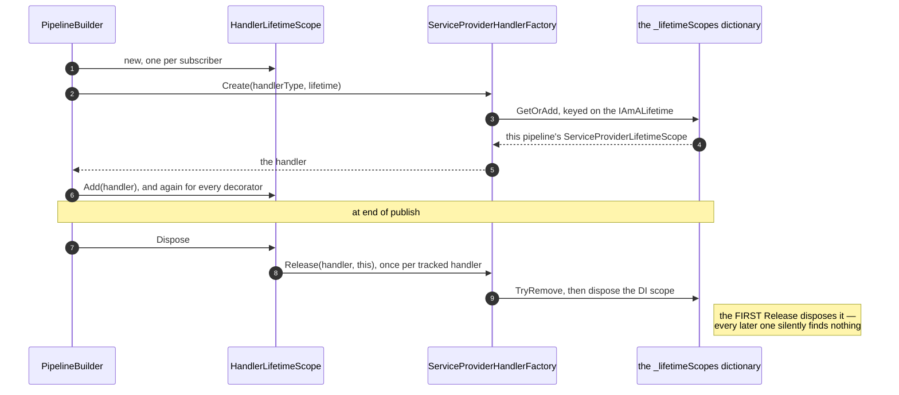
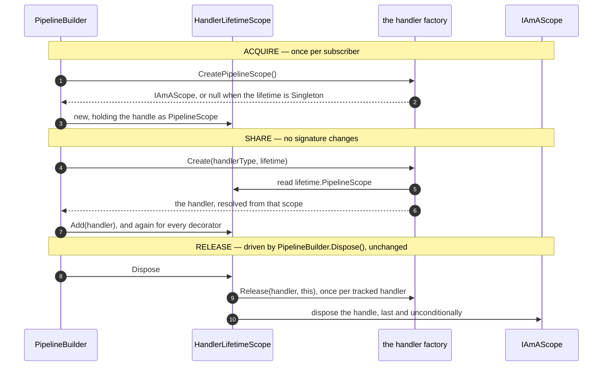
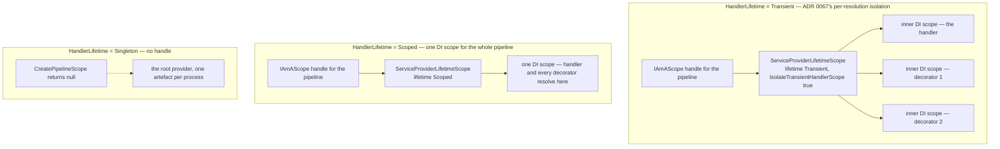
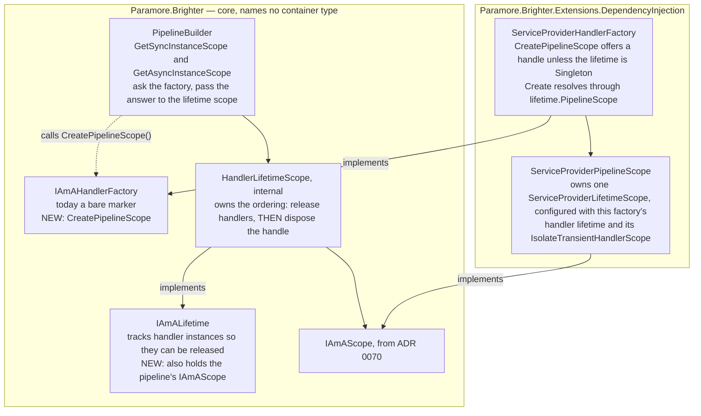
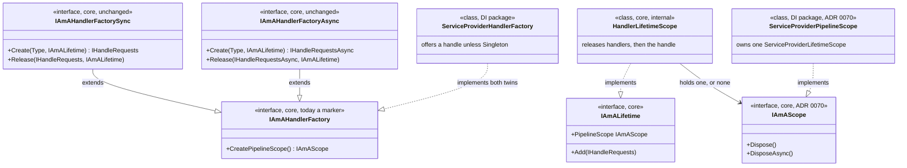

# 71. Handler pipelines take their DI scope as a pipeline scope handle

Date: 2026-08-02

## Status

Proposed

## Context

A handler pipeline already gets a DI scope of its own, so that a handler and its decorators resolve together and their dependencies are disposed when the pipeline ends. Brighter's core does not hold that scope. Core holds a per-pipeline tracking object, the handler factory keeps the scope in a dictionary keyed on that object, and releasing a handler is what disposes it. ADR 0070 has just given transform pipelines the same guarantee by a different route, so the codebase now holds two mechanisms for one idea — and the route this family takes is the one every later ADR in this set would have to build on twice.

### Scope

**Parent requirement**: [specs/0036-scoped-lifetime-per-pipeline/requirements.md](../../specs/0036-scoped-lifetime-per-pipeline/requirements.md)

This ADR decides one thing: **a handler pipeline obtains and releases its DI scope through the same `IAmAScope` handle as a transform pipeline.**

**In scope.** Each requirement below is discharged here by the named mechanism.

- **FR-7 — handler pipeline scoping is preserved.** One `Send`/`SendAsync` takes one handler pipeline scope, released when the pipeline completes. This ADR replaces the carrier and preserves the scoping; step 5's table shows it unchanged in every row. Its guards are **AC-9**, written over an end-to-end `Send` and therefore over the handle path, and step 6's migration of AC-14's named pair onto that same path. ADR 0070 names FR-7 as *served* rather than discharged, because it touches no handler pipeline. This is the ADR that replaces the carrier, so it is the one whose mechanism has to make the guarantee true.
- **FR-13 for the handler family — Brighter disposes every scope it created.** ADR 0070 records the decisions that make FR-13 true for mapper and transform pipelines; this ADR records the decisions that make it true for handler pipelines. Two clauses land here:
  - the **lead clause** — a scope Brighter created is released when the pipeline completes. It is preserved rather than newly delivered, and is guarded jointly with FR-6;
  - the **disposal-failure clause** — a `PipelineScope` disposal that throws on a pipeline whose handler completed normally is logged at `LogLevel.Error` and swallowed, and the caller's result is returned unchanged (step 2, **AC-33**).
- **FR-13's disposal-failure rule extended to a handler `Release` that throws** (step 2, **AC-51**). FR-5 and FR-6 forbid a teardown failure masking the caller's own exception, and `using var` gives a throwing `Dispose()` no way to avoid doing so. AC-51 is the criterion written for this extension. AC-7 is not, and step 2 says why.
- **FR-6 for the handler family — a pipeline scope is released exactly once, on every exit path.** A throwing handler still releases the pipeline scope, exactly once. This ADR strengthens how: the handle is disposed unconditionally and its disposal is idempotent, where today a throwing `Release` can skip the reclamation entirely. **AC-7** is the guard.
- **The release ordering rule, which no tagged requirement carries.** Tracked handlers go back to their factory *before* the DI scope they were resolved from is disposed. `HandlerLifetimeScope` owns that order. Step 6's design-owed test is what pins it, because no acceptance criterion can — for the reason step 6 gives.
- **NFR-5 and NFR-6 for the handler family — bounded and cheap.** One `Send`/`SendAsync` begins and releases one handler pipeline scope and none per resolution, so nothing survives the Nth message. ADR 0070 carries the transform half; the guard is **AC-23**, whose all-`Scoped` triple spans both families.
- **NFR-4 for the handler family — concurrent pipelines cannot interfere.** Today `TryRemove` is what makes a concurrent double-`Release` dispose exactly once; the replacement buys the same atomicity from confinement, immutability and single-issue disposal, stated as a decision in *The mechanism, end to end*. **AC-8** reaches it over two concurrently live pipeline scopes, though it is tagged FR-6. The transform family is ADR 0070's, the shared request-scoped cache ADR 0072's, and suppression ADR 0075's.
- **NFR-8's `IAmALifetime` half — the two names are kept apart.** This ADR loads a second responsibility onto `IAmALifetime`, which narrows the gap, so it writes the reciprocal sentence its documentation owes (step 1, and *Consequences* records the cost). ADR 0070 documents `IAmAScope` at the other end, so neither claims the whole of NFR-8, and ADR 0074's guidance page carries the same distinction under **AC-25**.
- **NFR-1's clause (b), for the two interfaces this ADR breaks.** Every implementation in the repository moves in the same change; on `netstandard2.0` there are no default interface members, so partial adoption does not compile. Clauses (a) and (c) are ADR 0070's at its own end, and NFR-1's core-purity clause is ADR 0074's.
- **NFR-3 for the change this ADR makes to `Paramore.Brighter.ServiceActivator`.** `ControlBusHandlerFactorySync`'s new member names only core types, so the assembly keeps its single project reference and gains no package reference. ADRs 0070 and 0075 each state the same of their own change to that assembly; the guard is **AC-22.2**.

**Contributed to here, discharged elsewhere.**

- **FR-13's borrowed-scope carve-out** — that a borrowed scope is never disposed at all — is routed to **FR-12** by FR-13 itself, and belongs to ADR 0072. No ADR claims the whole of FR-13.
- **FR-27.1's rule for `Transient` handler pipelines** is ADR 0072's, which owns the seam the rule is about. What this ADR adds is one contract row, placed where an implementor would otherwise reach for the wrong instrument.

**Out of scope.**

- **The *ambient* concept, adoption and borrowing — ADR 0072's**, including `IAmAScopeProvider` and `ScopeAffinity`. `CreatePipelineScope()` makes no ambient ask in this ADR.
- **ASP.NET Core, and the one line an application writes to opt in — ADR 0073's.**
- **The `ValidatePipelines()` rules of FR-22 — ADR 0074's.**
- **`Publish`-subscriber ambient suppression — ADR 0075's** (FR-8).
- **The opt-in affinity option on `IBrighterOptions` — ADR 0076's.**
- **When a handler pipeline has a DI scope, which lifetimes get one, and when it is released.** None of the three changes. `PipelineBuilder<TRequest>`'s eager per-subscriber resolution and its end-of-publish release stay exactly as they are (D10), and ADR 0039 (`0039-scoping-dependencies-inline-with-lifetime-scope`)'s DI scope per registered subscriber is preserved unchanged.

This ADR supersedes no prior ADR. It extends the 0066–0069 sequence and applies the rule ADR 0070 established.

### Where this ADR sits

Seven ADRs deliver the parent requirement, one decision each; the requirements constrain observable behaviour only and hand how it is implemented to design (C-13). This is the second, and the only one that is substantially structural: it discharges FR-13 for the handler family and FR-7, and is otherwise taken for the sake of the ADRs after it.

| ADR | Decides |
| --- | --- |
| 0070 | a transform pipeline takes one DI scope, carried **as a parameter** |
| **0071** *(this one)* | handler pipelines converge onto the **same handle**, carried on the object they already pass |
| 0072 | how a pipeline discovers an **ambient** DI scope the host owns |
| 0073 | the **ASP.NET Core package**, and the one line an application writes to opt in |
| 0074 | **where** the scope-configuration rules are evaluated |
| 0075 | how a `Publish` subscriber and the consumer pump **suppress** adoption, for themselves and every pipeline created beneath them |
| 0076 | the **affinity option**, and how one setting reaches all four registration paths in any order |

ADR 0070's rule is the one this ADR applies: **the per-pipeline object carries the DI scope.** The two families differ only in *which* object plays that part. A transform `Create(Type)` has no per-pipeline object, so 0070 had to add a parameter; a handler `Create(Type, IAmALifetime)` already receives one, so here the scope rides on it and no signature changes at all.

ADR 0067's `Terms` block defines the two axes used throughout, and this ADR does not restate them: Brighter's *configured lifetime* governs the artefact, the container's *registration lifetime* governs the dependencies, and `IServiceScope`, `ServiceProviderLifetimeScope` and `IAmALifetime` stay distinct from one another. This ADR does extend the last of those three: `IAmALifetime` keeps its identifying role and additionally carries the pipeline's DI scope, as *Key Components* specifies. ADR 0067's block records that its definition is partial after this ADR.

The siblings can mostly avoid the phrase "lifetime scope"; this one cannot, and the difference is deliberate. `HandlerLifetimeScope` is the pre-existing type this ADR rewrites and `ServiceProviderLifetimeScope` the pre-existing type it reasons about throughout, so the phrase is kept for those two types and for nothing else. It is never used for what this ADR introduces, which is an `IAmAScope`. NFR-8's specific ambiguity — `IAmAScope` against `IAmALifetime` — is discharged where *Key Components* states the two responsibilities, and by the XML documentation on both.

### How a handler pipeline reaches its DI scope today

The DI scope exists, and it is already per pipeline — but core never holds it. Core holds the *key*, the factory holds the scope in a dictionary keyed on that key, and `Release` is what disposes it:



Step by step, with the code:

1. `PipelineBuilder<TRequest>` creates one `HandlerLifetimeScope` per subscriber — `GetSyncInstanceScope()` (`:567`) and `GetAsyncInstanceScope()` (`:578`), each recording it in `_instanceScopes` (`:47`).
2. That object is passed as `IAmALifetime` on every `Create`: the subscriber's own handler at `:191`/`:236`, and each attribute decorator through `BuildPipeline` (`:272`) and `BuildAsyncPipeline` (`:316`), then `PushOntoPipeline` (`:499`)/`AppendToPipeline` (`:430`) or their async twins (`:525`, `:451`), all of which thread the same `instanceScope`.
3. `ServiceProviderHandlerFactory` keys a DI scope on it: `_lifetimeScopes.GetOrAdd(lifetime, …)` over a `ConcurrentDictionary<IAmALifetime, ServiceProviderLifetimeScope>` (`:40`, `GetOrCreateLifetimeScope` `:127-131`).
4. `HandlerLifetimeScope` tracks each resolved handler (`Add`), and on `Dispose()` calls `factory.Release(handler, this)` for each.
5. `Release` (`:102-107`) delegates to `ReleaseLifetimeScope` (`:133-137`), which does `TryRemove` + `scope.Dispose()`. The **first** release disposes the DI scope; every later one silently finds nothing.
6. `PipelineBuilder.Dispose()` (`:269-270`) drains `_instanceScopes`, which is what starts step 4.

### The divergence ADR 0070 leaves

| | Handler pipeline (today) | Transform pipeline (ADR 0070) |
| --- | --- | --- |
| Per-pipeline object | `IAmALifetime` | the `TransformPipeline<TRequest>` itself |
| The DI scope is | created **inside the factory**, keyed on that object in a dictionary | created **by the factory** and handed out as an `IAmAScope` |
| Held by | nobody in core — core holds only the key | the pipeline |
| Disposed by | the factory, inside `Release` | the pipeline, in its drain |
| Cost per `Create` | a `ConcurrentDictionary` lookup | none |

Two mechanisms for one idea is the immediate cost. The larger cost is ahead. **D2 fixes that a single option governs adoption for both handler pipelines and transform pipelines**, so ADR 0072 has to make a handler pipeline able to resolve from an ambient the host owns.

Against the dictionary model that means teaching `GetOrCreateLifetimeScope` to sometimes not create, sometimes not own and sometimes not dispose — adoption implemented a second time, in a second shape. Against the handle model it is the same change 0072 already makes for transforms: `CreatePipelineScope()` returns a borrowed scope instead of an owned one.

### The forces

- **The scoping must be preserved, and FR-7's last clause has to be read before this ADR can proceed.** FR-7 is: *"One `Send`/`SendAsync` takes one handler pipeline scope, released when the pipeline completes. This is today's behaviour and must be regression-guarded, **not re-implemented differently**."* This ADR does replace the carrier, so the clause is met head-on rather than skirted. **The reading taken here is that "not re-implemented differently" governs the observable scoping, not the internal carrier.** Read the other way, the clause would forbid ADR 0072 as well, since adoption cannot be delivered by the dictionary without re-implementing it there instead. That reading constrains *scoping* — one DI scope per handler pipeline, resolved from at the same points, disposed at the same point — and it is not a promise that nothing observable changes. The handle is disposed after the handlers are released, and today's disposal path cannot survive a throwing `Release` long enough to reach it (`HandlerLifetimeScope.cs:74-93`, no `try`/`catch` anywhere). Repairing that is part of this ADR, and *Consequences* prices it rather than claiming it away.
- **`Transient` is not only `Scoped`'s poor relation here.** The handler factory's per-pipeline `ServiceProviderLifetimeScope` serves `Transient` as well as `Scoped`, carrying `IsolateTransientHandlerScope` (`BrighterOptions.cs:37`) into it so that each resolution gets its own inner DI scope (ADR 0067). C-6 forbids regressing that. So a handler pipeline takes a handle whenever its lifetime is **not** `Singleton`, where a transform pipeline takes one only under `Scoped`. *The mechanism, end to end* has the diagram.
- **`IAmALifetime` is already threaded everywhere the scope is needed.** It reaches every one of the four sites that resolve an artefact for a handler pipeline — two for the handler itself, two for every attribute decorator. It does so unavoidably, because both `Create` signatures take a non-nullable `IAmALifetime`, so no resolution site can exist without one. Anything travelling beside it would travel beside it through every one of them. *Technology Choices* enumerates the **eight** methods that carry it along the resolution path, and says where the same object travels off that path.
- **`IAmALifetime` and `IAmAScope` must stay distinct** (NFR-8). One tracks handler instances so they can be released; the other is a DI scope handle. Neither becomes the other.
- **NFR-4 — the dictionary is buying atomicity, and removing it means buying thread safety another way.** Today `TryRemove` is what makes a concurrent double-`Release` dispose exactly once. The replacement is confinement, immutability and single-issue disposal; *The mechanism, end to end* states it as a decision rather than as a note, because it is one.
- **C-2 — the message pump is untouched.** `Reactor`, `Proactor`, `Dispatcher`, `DispatchBuilder` and `ConsumerFactory` require no change.
- **D0 and C-1 — the unit is the pipeline, and nesting is a new pipeline, not a nested scope.** A handler that issues a `Send`, a `Post` or a `Publish` builds a fresh `PipelineBuilder` with its own `HandlerLifetimeScope` and its own handle. Microsoft's DI scopes do not nest (C-1) — a scope created from a scoped provider is root-parented — so a nested pipeline's DI scope is a sibling of its caller's, never a child, and its disposal is independent. That is true today and this ADR does not change it. It is stated because the handle makes the relationship look hierarchical when it is not.
- **Core must stay container-agnostic** (ADR 0014, NFR-1). `IAmAScope` names no container type, which is what lets it appear on a core interface at all, and what keeps both new members implementable over Autofac or SimpleInjector as readily as over Microsoft's container (NFR-7).
- **Two more public interfaces break.** `netstandard2.0` has no default interface members. `IAmAHandlerFactory` is implemented by 21 classes in this repository (5 in `src/`, 16 test doubles); `IAmALifetime` by 7 (one in `src/`, internal, plus 6 test doubles). One of the 21 implements the **bare marker** and has no body at all — `sealed class DummyHandlerFactory : IAmAHandlerFactory;` — so it gains one.

## Decision

**A handler pipeline's DI scope is an `IAmAScope`, created by its handler factory, carried on the pipeline's `IAmALifetime`, and released when that lifetime scope is released.**

The per-pipeline object carries the DI scope. That is the same rule ADR 0070 states for transform pipelines; the two families differ only in *which* object plays the part, because a handler `Create` already receives one and a transform `Create` does not.

### The mechanism, end to end

Compare this with the *today* diagram above. The lifelines are in the same order and only the fourth changes **role** — the dictionary becomes the handle. The third is relabelled from the concrete `ServiceProviderHandlerFactory` to "the handler factory", because after this ADR the builder asks the interface and any factory may answer.



The same three things happen at the same three moments as today. What changes is that the dictionary is gone, the handle is held by the object core already owns, and `Release` no longer disposes anything.

Three consequences fall straight out of the diagram.

- **`Create` and `Release` keep their signatures**, because the scope travels on an argument they already take.
- **The ordering rule is the same rule in shape as ADR 0070's**, which lands there as `TransformPipelineDrain`'s third drain step: artefacts go back to their factory before the DI scope they came from dies. Here it lives in the one object that knows about both the handlers and the scope. The mechanism underneath differs, and *`HandlerLifetimeScope` — the ordering lives here* says how.
- **The handle is disposed unconditionally**, which closes a latent leak. Today a pipeline whose handler fails to resolve never calls `Release`, so its dictionary entry survives for the life of the process.

#### What a `Transient` handler pipeline gets, and why it takes a handle at all

A handler pipeline takes a handle whenever its configured lifetime is not `Singleton`. That is wider than the transform family, where only `Scoped` earns one, and the reason is that ADR 0067's per-resolution isolation rides on the very object the handle wraps.



Read three things off the diagram. Under `Transient` the handle does **not** give one artefact per pipeline: each resolution still gets its own inner DI scope, and what the handle scopes to the pipeline is the *set* of those inner scopes, all drained together when the pipeline ends. Under `Scoped` the handle gives exactly one DI scope, and every participant in the pipeline resolves from it. Under `Singleton` there is no handle, and `Create` resolves from `_singletonScope` as it does today.

**A `Transient` handle is not what FR-27.1 calls a pipeline scope**, and the asymmetry does not leak into the seam. FR-27.1 is about a pipeline with a `Scoped` participant. A `Transient` handler pipeline makes no ambient ask and takes no adoption decision, which is AC-46's first branch. What it holds is ADR 0067's per-resolution isolation wearing this ADR's handle, and ADR 0072 states the same reconciliation from the seam's side.

#### What replaces the dictionary's atomicity

Removing `_lifetimeScopes` removes a thread-safety guarantee, and the design has to supply one in its place. This is a decision rather than a detail, because it is what makes the handle safe to reach from code Brighter did not write.

Today the per-pipeline DI scope is created by `_lifetimeScopes.GetOrAdd` and reclaimed by `TryRemove` (`ServiceProviderHandlerFactory.cs:129`, `:135`), and that `TryRemove` is what makes a concurrent double-`Release` dispose exactly once. **The replacement is not restriction. It is confinement, immutability and single-issue disposal**, and Brighter accepts that the handle is reachable rather than fencing it off.

- **Confinement.** One `HandlerLifetimeScope` is constructed per subscriber and is never shared with another pipeline. `Publish` runs *subscribers* concurrently and each has its own handle, so concurrency is between pipelines and never within one.
- **Immutability.** `PipelineScope` is fixed at construction, so every reader sees the same value without coordinating, and a factory may read it on every `Create` without a lock.
- **Single-issue disposal.** Disposal is issued from exactly one place, on one thread — `HandlerLifetimeScope.Dispose()` — and `IAmAScope`'s disposal is idempotent (ADR 0070), which covers a caller that disposes the handle early.

**Confinement is not the same as keeping the object to itself, which this design never did.** The `IAmALifetime` travels widely today: to the factory on every `Create` and `Release`, and through `pipeline.AddToLifetime(instanceScope)` (`PipelineBuilder.cs:195`, `:241`) down the whole decorator chain (`RequestHandler.cs:83-86`). What the handle adds is that this well-travelled object now exposes a DI scope. That is a real widening, it is convention rather than restriction, and *Consequences*, under *Negative*, prices it and names the two routes that reach it.

### Where the pieces live



**Reading the edges**, on the same convention ADR 0070 uses: a solid arrow is a compile-time reference or an ownership, a dotted arrow is a runtime call. Both edges crossing the boundary are solid and run from the DI package into core, which is the real reference direction. The one call edge stays inside core and lands on the interface — the builder asks `IAmAHandlerFactory`, not the class implementing it — which is why core needs no knowledge that a container exists.

### Key Components



#### The roles, and what each is responsible for

| Role | Type | Responsibilities | Responsibility classifier | Collaborators |
| --- | --- | --- | --- | --- |
| Scope offerer | `IAmAHandlerFactory` (core) | Answers, for one handler pipeline, whether it has a DI scope to offer. `null` for `Singleton`; a handle for `Transient` and `Scoped` alike | **deciding** | `PipelineBuilder`, its only caller in Brighter's own code; the `IAmAScope` it offers |
| Handler tracker **and** scope holder | `IAmALifetime` (core) | Tracks handler instances so they can be released — its existing job — and now also carries the handle for the pipeline they were resolved from | **knowing**, two things | every handler factory, on `Create` and `Release`; every decorator, through `AddToLifetime`; the `IAmAScope` it holds |
| Release ordering | `HandlerLifetimeScope` (core, internal) | Releases every tracked handler, then disposes the handle. Never the other way round. Logs both failure kinds at `Error` and throws neither | **doing** | the two handler factories it was constructed with; the handle; `PipelineBuilder`, which drives its disposal |
| Scope acquirer | `PipelineBuilder<TRequest>` (core) | Asks the factory once per subscriber and hands the answer to that subscriber's lifetime scope. Nothing else changes | **doing** | `IAmAHandlerFactory`; the `HandlerLifetimeScope` it constructs and later drains |
| Scope implementation | `ServiceProviderPipelineScope` (DI package) | Owns one `ServiceProviderLifetimeScope`, configured with the handler lifetime and the isolate flag, so `Transient` behaviour is identical | **knowing** | `ServiceProviderHandlerFactory`, which constructs it; the `ServiceProviderLifetimeScope` it wraps |

Loading two responsibilities onto `IAmALifetime` is the cost this ADR pays, and it is paid deliberately. NFR-8 keeps `IAmALifetime` and `IAmAScope` distinct concepts, and the lifetime scope *holds* a scope rather than *becoming* one. *Consequences* records that the name gets no easier to read for it.

#### `IAmAHandlerFactory` gains the offer (core, public)

```csharp
namespace Paramore.Brighter
{
    public interface IAmAHandlerFactory
    {
        /// <summary>Creates a DI scope for one handler pipeline to resolve from, or null when this
        /// factory has none to offer. The caller must always release the returned handle; releasing it
        /// may or may not dispose an underlying scope, and the handle alone knows which.</summary>
        IAmAScope? CreatePipelineScope();
    }
}
```

`IAmAHandlerFactory` (`IAmAHandlerFactory.cs:7`) is today a marker interface with no members, and both `IAmAHandlerFactorySync` (`:36`) and `IAmAHandlerFactoryAsync` (`:36`) derive from it. Putting the member on the base rather than on both twins means one declaration, one implementation in `ServiceProviderHandlerFactory` (which implements both), and no possibility of a factory answering the two twins differently. The cost is that `IAmAHandlerFactory` stops being a marker and becomes a contract — a fair description of what it now is.

**The member's shape is ADR 0070's. Its null rule is not.** Two things follow, and an implementor needs both.

- **The shape, and the create-failure behaviour, transfer unchanged.** A container that cannot create a scope throws, and the caller's existing guard turns that into `ConfigurationException`.
- **The null rule does not transfer, and applying 0070's rule here is the mistake this paragraph exists to prevent.** A transform factory offers nothing unless its configured lifetime is `Scoped`. A handler factory offers a handle for `Transient` too, because ADR 0067's per-resolution scope rides on the same `ServiceProviderLifetimeScope` object and would regress without one (C-6).

ADR 0070's **second** failure mode is not yet in play. A throw from an ambient source, wrapped in `AmbientScopeSourceException` and let past the builders' `catch` filters unwrapped (FR-24.1, AC-30), arrives only when ADR 0072 makes this member ask for an ambient. This ADR makes no such ask, so the contract below states one error condition. ADR 0072 widens it and amends both `PipelineBuilder` `catch` filters (`:202-205`, `:248-251`); AC-30's `Send` branch is written over this family's pipeline.

#### `IAmALifetime` gains the handle (core, public)

```csharp
public interface IAmALifetime : IDisposable
{
    /// <summary>The DI scope this handler pipeline resolves from, or null when it has none.
    /// Released when this lifetime scope is released; whether releasing it disposes anything is
    /// the handle's own business. Distinct from this interface's own job, which is tracking
    /// handler instances so they can be released.</summary>
    IAmAScope? PipelineScope { get; }

    void Add(IHandleRequests instance);        // unchanged
    void Add(IHandleRequestsAsync instance);   // unchanged
}
```

The scope rides on the object that already reaches every resolution site, so **no `Create` or `Release` signature changes** — the handler factory reads `lifetime.PipelineScope`.

**Contract.**

| Member | Input | Output | Error conditions |
| --- | --- | --- | --- |
| `IAmAHandlerFactory.CreatePipelineScope()` | none | an `IAmAScope` the caller must release for `Transient` and `Scoped` alike; `null` for `Singleton`, and `null` from any factory that is not container-backed | May throw if the container cannot create a scope; the caller's existing guard turns that into `ConfigurationException` (`PipelineBuilder.cs:179-205`). It is called **once per pipeline**, by `PipelineBuilder` when it constructs the `HandlerLifetimeScope` |
| `IAmALifetime.PipelineScope` under `Transient` | — | non-null | A `Transient` handler pipeline holds a handle, because ADR 0067's per-resolution isolation rides on it. So **FR-27.1's *"takes no pipeline scope"* must not be asserted over this property, and neither must AC-46's *"no pipeline scope taken"***. Both are about the *seam* — the ambient ask and the adoption decision — and a `Transient` handler pipeline makes neither. AC-46's instrument is the ambient recorder: zero asks, zero adoption decisions. An implementation asserting `lifetime.PipelineScope is null` for a `{Transient, Transient, Transient}` host is testing the wrong thing and will fail |
| `IAmALifetime.PipelineScope` | none | the handle this lifetime scope was constructed with, or `null` | Never throws. It is a **stable** property: the value is fixed at construction and does not change between reads, so a factory may read it on every `Create` without coordinating. `null` under a non-`Singleton` lifetime is an error where a container-backed factory reads it: `ServiceProviderHandlerFactory.Create` throws `ConfigurationException`, because after this ADR it keeps no scope of its own to fall back to. Reading it after the lifetime scope has been disposed is the caller's error, not this property's |

**FR-27.1 and AC-46 now say so (revision 28)**, defining *"takes no pipeline scope"* over the seam rather than over this property's nullness. FR-27's rule 1 says such a pipeline *"takes no pipeline scope and asks nothing"*, and AC-46's first **Then** asserts *"zero adoption decisions and no pipeline scope taken"* — the rule and the criterion always asserted the right thing, and what the amendment adds is the instrument their words point at. ADR 0072 records it from the seam's side, and this ADR's *Consequences*, under *Negative*, records it beside the AC-14 designation change, which has since landed too (revision 29).

**A handle this factory does not recognise is rejected.** Where `PipelineScope` is non-null but is not a `ServiceProviderPipelineScope`, `ServiceProviderHandlerFactory` throws `ConfigurationException`. It has nothing else to do, because the dictionary it used to fall back to is removed.

**FR-7 is what makes rejection the only answer.** ADR 0070 answers the same case for a transform pipeline by resolving fresh and caching nothing (step 9). That answer is available to it because a mapper resolved twice may legitimately be two objects once `MapperLifetime.Scoped` means "one per pipeline". FR-7 leaves the handler family no such answer: two `Create` calls for one pipeline must return the **same** handler, so a factory with no scope to resolve from cannot degrade quietly. It can only fail. The rule reads differently in the two ADRs because the requirement does, not because the design forgot to converge.

**This does not contradict ADR 0072's *"an ambient that does not implement the role is ignored, not rejected"*, which decides a different question about a different object.** There the factory declines an **ambient** a provider offered, inside `CreatePipelineScope()`, before any handle exists — and declining is safe because create-and-own is always available to it (FR-11(b)). Here the object is a **handle a caller passed**, already fixed on the `IAmALifetime`, and the factory is asked to resolve *from* it with nothing left to create instead. The rule that covers both: decline where a fallback exists, throw where none does.

A handle that this factory *does* recognise but did not create — a `ServiceProviderPipelineScope` built by a second `ServiceProviderHandlerFactory` over a different provider — passes the type test and is resolved from. **That is accepted, and it is the caller's error**, on the same terms as any other misuse of a public `Create(Type, IAmALifetime)`. No identity check is added: the check would cost every resolution a comparison, to defend against a configuration Brighter never builds, because `PipelineBuilder` always passes the handle it just obtained from the factory it is about to call. The contract table's error column says so.

Where the handle is genuinely foreign, the consequence is stated rather than buried: **the pipeline gets no handler and no second DI scope.** The `ConfigurationException` leaves the unrecognised handle where it was, for `HandlerLifetimeScope` to dispose as it disposes any handle it holds, and the factory has no scope of its own to strand. Before this ADR a caller that already held a scope of its own got Brighter's dictionary scope as well, and leaked it whenever the handler was never tracked. Failing at the first `Create` is the louder answer and the cheaper one.

None of Brighter's own paths can reach it. `PipelineBuilder` constructs the `HandlerLifetimeScope` with a handle from the same factory it then calls, and ADR 0072's ladder declines an unusable ambient before any handle is produced. A foreign handle therefore arrives only from outside the dispatch path: a caller invoking the public `Create(Type, IAmALifetime)` with an `IAmALifetime` of its own, or a lifetime scope built by one factory and passed to another. That is why NFR-5's and NFR-6's per-pipeline budgets are not breached by this rule — they bound what Brighter does, and Brighter does not do this.

The two responsibilities stay legible, and NFR-8's distinction survives: `IAmALifetime` *tracks handlers*; `IAmAScope` *is a DI scope*. The lifetime scope holds one, it does not become one. The XML documentation on both says so.

#### `HandlerLifetimeScope` — the ordering lives here (core, internal)

`HandlerLifetimeScope` (`:33`) takes the handle in its constructor, exposes it as `PipelineScope`, and in `Dispose()` releases every tracked handler **first** and disposes the handle **second**.

That ordering rule is the same rule in shape as ADR 0070's, where it lands as `TransformPipelineDrain`'s new third step: artefacts go back to their factory before the DI scope they were resolved from dies, so a factory whose `Release` still has work to do is not left resolving against a dead scope. **The mechanism underneath it is not the same, and the difference decides how the rule can be guarded.**

- **In the transform family, `Release` genuinely reclaims.** A `Transient` participant's per-resolution scopes are tracked in the **factory's own** lifetime scope and its `Release` disposes them (`ServiceProviderTransformerFactory.cs:66-71` into `ServiceProviderLifetimeScope.cs:346-350`, isolation being the constructor's default at `:81`). ADR 0070's step 6 keeps that path exactly as it is, handle or no handle.
- **Here there is no factory-side bookkeeping at all.** A `Transient` handler pipeline's inner scopes live **inside the handle**, which is constructed with the handler lifetime and `IsolateTransientHandlerScope`, so disposing the handle is what reclaims them and `Release` does nothing at all. *Why `Create` and `Release` keep their signatures, and why `Release` loses its body*, below, states that in full.

**So what the ordering protects is a factory this repository does not ship**: one that both offers a handle and leaves its `Release` work to do afterwards — resolving against a scope already dead, or touching the handler instance, which the handle's disposal has already disposed (`ServiceProviderHandlerFactory.cs:94-99`). No factory here is both: the container-backed one's `Release` loses its body, and the factories whose `Release` disposes the handler return `null` from `CreatePipelineScope()`, so they offer no handle to order against. That is why the rule is pinned by a required test rather than by an acceptance criterion, and step 6 says so.

Neither family enforces the ordering today, because until ADR 0070 neither pipeline object held a DI scope to order against. Putting the logic inside `HandlerLifetimeScope` means the one object that knows about both the handlers and the scope is the object that orders them, and `PipelineBuilder.Dispose()` (`:269-270`) needs no change at all.

#### Where each type is touched

| Assembly | Type | Change |
| --- | --- | --- |
| `Paramore.Brighter` | `IAmAHandlerFactory` (`:7`) | gains `IAmAScope? CreatePipelineScope()` |
| `Paramore.Brighter` | `IAmALifetime` (`:34`) | gains `IAmAScope? PipelineScope { get; }` |
| `Paramore.Brighter` | `HandlerLifetimeScope` (`:33`, `internal`) | takes and exposes the handle; disposes it after releasing tracked handlers |
| `Paramore.Brighter` | `HandlerLifetimeScope.Log` (`:95`) | gains `FailedToReleaseHandler` and `FailedToDisposePipelineScope`, both at `LogLevel.Error`. **The two members carry different criteria and the pairing is not interchangeable**: AC-51's Given is a throwing `Release` (FR-5, FR-6), AC-33's a throwing `PipelineScope` disposal (FR-13). The four existing `Debug` members are unchanged. **The second depends on ADR 0070 step 4b** — without the surfacing disposal path that ADR adds, `ServiceProviderLifetimeScope.Dispose()` catches the failure and writes `FailedToDisposeScope` at `Warning` (`:462-501`, `:522`), and this member never fires |
| `Paramore.Brighter` | `PipelineBuilder<TRequest>` | `GetSyncInstanceScope()` (`:567`) and `GetAsyncInstanceScope()` (`:578`) ask the factory and pass the result to the `HandlerLifetimeScope` constructor. Nothing else **in this ADR** — two siblings edit the same class: ADR 0072 amends both `catch` filters (`:202-205`, `:248-251`) and ADR 0075 adds a defaulted `bool isolateSubscribers` to the two dispatch constructors (`:59`, `:76`) with a bracket inside both build-loop bodies (`:187-198`, `:232-244`) |
| `Paramore.Brighter` | `SimpleHandlerFactorySync` (`:33`), `SimpleHandlerFactoryAsync` (`:33`) | `CreatePipelineScope()` returns `null` |
| `Paramore.Brighter` | `SimpleHandlerFactory` (`SimpleHandlerFactory.cs:11`, **public**) | the same. It implements **both** twins, which is why alternative 6's "one declaration, not two" argument is not hypothetical: it and `ServiceProviderHandlerFactory` are the two in-repo types that would otherwise have to answer the same question twice |
| `Paramore.Brighter.ServiceActivator` | `ControlBusHandlerFactorySync` (`ControlBusHandlerFactory.cs:6`) | the same. It gains no container dependency — `IAmAScope` is a core type |
| `…DependencyInjection` | `ServiceProviderHandlerFactory` (`:34`) | implements `CreatePipelineScope()`; `Create` resolves through `lifetime.PipelineScope`, and throws `ConfigurationException` when a non-`Singleton` lifetime hands it no usable handle. `_lifetimeScopes` (`:40`), `GetOrCreateLifetimeScope` (`:127-131`) and `ReleaseLifetimeScope` (`:133-137`) are **removed**, so both `Release` overloads (`:102-107`, `:120-125`) keep their signatures and lose their bodies |
| `…DependencyInjection` | `ServiceProviderPipelineScope` (new in ADR 0070) | **unchanged in specification, exercised here for the first time on a non-`Scoped` lifetime**: the `ServiceProviderLifetimeScope` it owns is configured with its creator's lifetime, so a `Transient` handler pipeline gets a `Transient` one carrying `IsolateTransientHandlerScope`. No new member; see *Technology Choices* |

Unchanged, and named so that the omission is not read as an oversight:

- `IAmAHandlerFactorySync.Create`/`Release` and their async twins;
- `Pipelines<TRequest>` and `AsyncPipelines<TRequest>`;
- `BuildPipeline`, `BuildAsyncPipeline`, `AppendToPipeline`, `AppendToAsyncPipeline`, `PushOntoPipeline` and `PushOntoAsyncPipeline`, which keep threading `IAmALifetime` and nothing beside it, as do `HandlerFactory.CreateRequestHandler` and `AsyncHandlerFactory.CreateAsyncRequestHandler`;
- `IHandleRequests`, `IHandleRequestsAsync`, `RequestHandler` and `RequestHandlerAsync`, whose `AddToLifetime(IAmALifetime)` (`IHandleRequests.cs:71`, `IHandleRequestsAsync.cs:82`, `RequestHandler.cs:83-86`, `RequestHandlerAsync.cs:97-100`) keeps both its signature and its body. It is named here because it is the route by which the handle becomes reachable from a decorator, which *Consequences* prices, and not because anything about it changes;
- `PipelineBuilder.Dispose()`;
- `CommandProcessor`;
- the pumps (C-2);
- `BrighterOptions`;
- and everything ADR 0070 decided for the transform family.

`Paramore.Brighter.ServiceActivator` keeps its current dependency set — a single project reference to `Paramore.Brighter`, no package reference — because `ControlBusHandlerFactorySync`'s new member names only core types (NFR-3).

### Technology Choices

**Why the handle hangs off `IAmALifetime` rather than travelling as a second parameter.** A parameter is what ADR 0070 chose for the transform family, and the first instinct is to copy it exactly. It is the wrong fit here, because `IAmALifetime` is already threaded through **six** methods on `PipelineBuilder` that pass it onwards without resolving anything:

- `BuildPipeline` (`:272`) and `BuildAsyncPipeline` (`:316`);
- `AppendToPipeline` (`:430`) and `AppendToAsyncPipeline` (`:451`);
- `PushOntoPipeline` (`:499`) and `PushOntoAsyncPipeline` (`:525`).

Those six reach four sites that do resolve: the subscriber's own handler at `PipelineBuilder.cs:191` and `:236`, and every attribute decorator at `HandlerFactory.cs:47` and `AsyncHandlerFactory.cs:46`. Two further methods carry it into the decorator sites — `HandlerFactory.CreateRequestHandler` (`HandlerFactory.cs:44`) and `AsyncHandlerFactory.CreateAsyncRequestHandler` (`AsyncHandlerFactory.cs:42`) — so **eight** methods carry an `IAmALifetime` along the resolution path. Both `Create` signatures take it non-nullably (`IAmAHandlerFactorySync.cs:44`), so no resolution site can exist without one.

A scope parameter would travel beside it through all eight, forever, as a second thing that is always passed with the first, and not one of them could drop it. **Two parameters that are never apart are one parameter.** Hanging the scope on the object that already makes the journey costs one property, changes no method signature, and keeps the rule identical in both families: *the per-pipeline object carries the DI scope*.

**Eight is the resolution path's count, not the object's whole reach.** `AddToLifetime(IAmALifetime)` carries the same object off that path and into the pipeline: `PipelineBuilder` calls it on every built pipeline (`:195`, `:241`) and `RequestHandler.AddToLifetime` forwards it down the whole decorator chain (`RequestHandler.cs:83-86`, async twin `RequestHandlerAsync.cs:97-100`). A grep of `src/` for declarations taking an `IAmALifetime` parameter returns **32**. The eight above are the subset a second parameter would have had to be threaded through, which is what the argument here is about; the other twenty-four are what makes the handle reachable from outside the dispatch path, and *Consequences*, under *Negative*, prices that.

**Why `Create` and `Release` keep their signatures, and why `Release` loses its body.** The factory reads the scope off the argument it already has, so neither signature moves. `Release`'s **body** goes entirely, for two reasons that arrive together:

- it already does nothing *to the handler*, which is what its own documentation says (`ServiceProviderHandlerFactory.cs:94-99`: disposing the scope is what disposes the handler, so disposing it here would dispose it twice);
- with `_lifetimeScopes` removed it has no **DI scope** left to dispose either, because the `ReleaseLifetimeScope` call goes with the dictionary it read.

Both overloads become empty. ADR 0070 left the transform family's `Release` alone for the first half of the same reason: in both families the pipeline object owns the scope, so no `Release` may dispose it. The families differ in what is left over — 0070's `Release` still reclaims a `Transient` participant's per-resolution scopes, and this one has no work of its own at all.

**`ServiceProviderPipelineScope` is configured by its creator, which is how ADR 0070 specifies it and what the handler family needs.** ADR 0070 states the type as owning one `ServiceProviderLifetimeScope` constructed with **its creator's** configured lifetime and isolate-transient flag, noting that on a transform pipeline that lifetime is always `Scoped`, because a transform factory offers a handle under `Scoped` and nothing else.

The handler family is the reason the specification is written over the creator rather than over a constant. Here the handler factory constructs it with `new ServiceProviderLifetimeScope(_serviceProvider, _handlerLifetime, _isolateTransientHandlerScope)` — the same three arguments `GetOrCreateLifetimeScope` (`ServiceProviderHandlerFactory.cs:127-131`) passes today — so the wrapped lifetime scope is configured `Transient` for a `Transient` handler pipeline, carrying `IsolateTransientHandlerScope` with it. **The type's lifetime is its creator's, not a constant.** That is a restatement of ADR 0070's specification from the family that exercises the non-`Scoped` case, not a change to it, and it is what makes `Transient` behaviour identical: the per-pipeline lifetime scope still isolates each resolution and still drains its outstanding inner scopes when the pipeline ends (C-6, ADR 0067). Nothing else about the type changes — it still wraps exactly one lifetime scope and still disposes it exactly once.

**The dictionary is removed, not kept as a fallback.** `_lifetimeScopes`, `GetOrCreateLifetimeScope` and `ReleaseLifetimeScope` go. `Create` may still be *called* with a `lifetime` whose `PipelineScope` is `null` — a hand-rolled `IAmALifetime`, or a caller reaching the factory outside a `PipelineBuilder` — and under a non-`Singleton` lifetime that call now throws `ConfigurationException`.

Keeping the dictionary for that case was the cheaper option and it was rejected. It leaves one factory with **two behaviours selected by an argument**, which is the ground ADR 0070 gives in its step 9 for removing the mapper factories' own `Scoped` cache rather than keeping it where no handle is passed. A path Brighter's own code never takes is also the path that rots, because nothing in the dispatch suite exercises it.

Brighter's own paths cannot reach the throw. `PipelineBuilder` always supplies a handle when the factory offers one, and ADR 0072's ladder returns `null` from `CreatePipelineScope()` only when `HandlerLifetime` is `Singleton` — the one lifetime whose `Create` resolves from `_singletonScope` and never reads the handle. What the removal costs is a behavioural break for a caller that resolves handlers by hand, and ADR 0070 step 7a release-notes it rather than absorbing it.

### Implementation Approach

**1. Core.** Add the two members, then **move every implementation in the repository in the same change.** NFR-1(b) makes that non-optional, and on `netstandard2.0` there is no default interface member, so the solution does not compile until they all move.

- **Six classes in `src/`**: the five handler factories the touched table names, and `HandlerLifetimeScope`.
- **Twenty-two test files.** 16 `IAmAHandlerFactory` implementations across 16 files — eleven `QuickHandlerFactory`/`QuickHandlerFactoryAsync` doubles in the AWS, AWS.V4, Gcp, RMQ.Async, RMQ.Sync and RocketMQ suites (RMQ.Sync has only the sync one), and five in `Paramore.Brighter.Core.Tests` — plus six `TestLifetimeScope` doubles in six files, all in `tests/Paramore.Brighter.Extensions.Tests/`, none of which also carries a factory double.
- Only two implementations do more than answer `null`: `ServiceProviderHandlerFactory` (step 4) and `HandlerLifetimeScope` (step 2). Every other one is the same one-line edit — `CreatePipelineScope()` returns `null`, `PipelineScope` returns `null` — and `DummyHandlerFactory`, which implements the bare marker with no body at all, gains one.
- `IAmAScope`'s XML documentation (ADR 0070) gains a sentence about handler pipelines; `IAmALifetime`'s gains the reciprocal one NFR-8 requires.

**2. `HandlerLifetimeScope`.** The constructor takes `IAmAScope? pipelineScope` after the factory arguments, and the three existing constructors forward it. `Dispose()` is rewritten to the hold-and-compose shape ADR 0068 requires, and the fault tolerance runs **handler to handler**, not merely between the releases and the disposal:

- release every tracked sync handler, then every tracked async handler, catching per item and recording the failure for logging rather than letting it abort the loop. Today a throw from the first tracked handler skips every remaining `Release` *and* both `Clear()` calls (`HandlerLifetimeScope.cs:74-93`, no `try`/`catch` anywhere);
- clear both tracking lists unconditionally, so the scope does not outlive its disposal holding references;
- dispose `PipelineScope` last and unconditionally, catching any failure and holding it too;
- log every held failure at `LogLevel.Error` — handler-release failures through a new `FailedToReleaseHandler` member, the scope disposal through a new `FailedToDisposePipelineScope` member, both on the existing `Log` partial (`HandlerLifetimeScope.cs:95`) — and **throw nothing**.

**`Dispose()` never throws, and that is one rule for both failure kinds rather than two.** The tempting design surfaces a handler `Release` failure to the caller: it is the application's own teardown code failing on an object it owns, and ADR 0068's rule is that an explicit `Dispose` surfaces failures rather than hiding them. It cannot be had here.

- `CommandProcessor` disposes the builder through `using var` (`CommandProcessor.cs:317`, `:394`, `:472`, `:575`), so an exception leaving `Dispose()` **replaces** whatever the handler itself threw. It does not chain to it, and the original is not recoverable.
- FR-5 requires that a release failure must not mask the caller's exception, and FR-6's example requires a throwing handler's exception to reach the caller unchanged. A `Dispose()` that can throw is compatible with neither.
- Surfacing a release failure on a pipeline that *succeeded* is no better founded. FR-13's rule that a completed pipeline is not failed by its own teardown does not become a different rule because the failing object was resolved rather than created.

So both kinds are logged at `Error` and swallowed, neither is latched, and the caller's result — or the caller's own exception — is returned unchanged. The criteria this rule answers to:

- **AC-33** — the regression guard for the scope-disposal half (FR-13);
- **AC-51** — the regression guard for the handler-release half (FR-13, FR-5, FR-6). It is the criterion written for this rule;
- **AC-7** — *not* the second of those. Its Given has a throwing **handler**, not a throwing `Release`, so it guards FR-6's release-exactly-once guarantee and says nothing about a teardown that itself fails. The two read alike, which is why the distinction is stated.

ADR 0068 is still satisfied in the part that matters: the failure is *reported*, at the level a diagnostic failure warrants, rather than discarded silently. What is given up is the ability to fail a call because its teardown failed, which nothing in the requirements asks for and two requirements forbid.

The hold-every-failure part is the shape `TransformPipelineDrain` already has on the transform side, and it is why step 6 adds a mirror of that family's regression test.

**The release is synchronous, and here are the three types that make it so** — an implementor otherwise looks for the `await using` that is not there. `IAmALifetime` (`IAmALifetime.cs:34`), `IAmAPipelineBuilder<TRequest>` (`IAmAPipelineBuilder.cs:36`) and `IAmAnAsyncPipelineBuilder<TRequest>` (`IAmAnAsyncPipelineBuilder.cs:37`, `internal` like the one before it) are all `IDisposable` and none is `IAsyncDisposable`, so `Dispose()` is the only exit even on the async dispatch path. What makes a blocking release safe there is the container's own suppression of the current `SynchronizationContext` for the duration of its synchronous drain (`ServiceProviderLifetimeScope.cs:422-436`, marked a load-bearing invariant in the source). *Consequences* argues the trade and says what revisiting it would cost.

**3. `PipelineBuilder`.** In `GetSyncInstanceScope()` and `GetAsyncInstanceScope()`, ask the factory that is already in hand:

```csharp
private IAmALifetime GetSyncInstanceScope()
{
    if (_syncHandlerFactory is null)
        throw new NullReferenceException("HandlerFactorySync is null");

    var scope = new HandlerLifetimeScope(_syncHandlerFactory, _syncHandlerFactory.CreatePipelineScope());
    _instanceScopes.Add(scope);

    return scope;
}
```

Nothing else in `PipelineBuilder` changes **in this ADR**; the two siblings that edit the same class are named in the touched table. The scope is added to `_instanceScopes` inside the `HandlerLifetimeScope` it belongs to, so `Dispose()` (`:269-270`) already reaches it. D10's release timing — every subscriber's scope drained together at end of publish, not tightened — is preserved by construction rather than by care.

**4. `ServiceProviderHandlerFactory`.** `CreatePipelineScope()` returns a new `ServiceProviderPipelineScope` when `_handlerLifetime` is not `Singleton`, and `null` when it is. Both `Create` overloads keep their `Singleton` branch on `_singletonScope` and, for the other two lifetimes, resolve through `lifetime.PipelineScope` when it is a `ServiceProviderPipelineScope`. Where it is `null`, or is a handle this factory does not recognise, they throw `ConfigurationException`, with the consequences the contract above sets out. `_lifetimeScopes` (`:40`), `GetOrCreateLifetimeScope` (`:127-131`) and `ReleaseLifetimeScope` (`:133-137`) are deleted in the same change.

**Both `Release` overloads keep their signatures and lose their bodies** (`:102-107`, `:120-125`). The `ReleaseLifetimeScope(lifetime)` call goes with the dictionary it reads, and the `Singleton` early return goes with it — a method that does nothing needs no branch to decide not to do it. What remains is two empty overloads, and their XML documentation carries the reason: the handle disposes the handler, and `HandlerLifetimeScope` disposes the handle.

**5. Behaviour by configured lifetime.** Nothing in this column changes; only where the scope comes from does.

| Handler lifetime | `CreatePipelineScope()` | Resolution and reclamation | Changed? |
| --- | --- | --- | --- |
| `Transient` | a handle over a `Transient` lifetime scope carrying `IsolateTransientHandlerScope` | each resolution gets its own inner DI scope, all drained when the pipeline ends — ADR 0067 unchanged | **No** |
| `Scoped` | a handle over a `Scoped` lifetime scope | one DI scope for the pipeline; one artefact per type; disposed when the pipeline ends | **No** |
| `Singleton` | `null` | the root provider, one artefact per process | **No** |

**6. Regression guards, and the tests that have to move with the path.** Removing the fallback moves work into the test suite, and the size of it is stated rather than discovered. **Six files in `tests/Paramore.Brighter.Extensions.Tests/` construct `ServiceProviderHandlerFactory` directly and call `Create` with a hand-rolled `TestLifetimeScope`**: `FactoryLifetimeTests`, `FactoryErrorHandlingTests`, `FactoryThreadSafetyTests`, `When_a_transient_handler_captures_the_service_provider_should_resolve_after_create`, `When_releasing_a_transient_disposable_handler_should_dispose_it_once` and `When_two_handlers_share_a_lifetime_the_scope_follows_the_handler_lifetime`. They hold **26** facts, which divide three ways:

- **Twenty-one** configure a non-`Singleton` handler lifetime and resolve through the dictionary today, so each must obtain a handle from `CreatePipelineScope()` on the factory under test and construct its `TestLifetimeScope` with it.
- **Four** configure `Singleton`, resolve from `_singletonScope` and are untouched beyond the one-line interface move.
- **One** passes a `null` lifetime deliberately and asserts that `Create` either works or throws `ArgumentNullException`; it becomes an assertion about `ConfigurationException`.

**Two of the twenty-one are named by an acceptance criterion, and moving them amends it.** `FactoryLifetimeTests.Factory_WithScopedLifetime_ReturnsSameInstanceWithinScope` (`FactoryLifetimeTests.cs:36`) and its async twin (`:154`) are AC-14's *"Explicitly NOT excluded"* pair: the criterion required them to keep passing **unchanged** and said they serve as regression guards for AC-9. After this ADR they cannot pass unchanged, because the path they resolve on is gone. **They are migrated onto the handle path rather than duplicated onto it** — the same two tests, asserting the same within-pipeline handler identity, over a handle instead of a dictionary entry. That is an amendment to **AC-14**, and the criterion now designates the pair over the carrier that replaces the dictionary (revision 29).

FR-7's guarantee is **not** left unguarded while they move. AC-9 is written over an end-to-end `Send`, which necessarily builds its pipeline through `PipelineBuilder` and therefore takes the handle path. What the migration buys is a *direct* guard on within-pipeline handler identity over a handle, at the level of the stack this pair already guards it, and it removes a guard that would otherwise have gone on pinning a path this ADR deletes.

Three further tests are required work rather than niceties.

- **The handler family's mirror of `When_a_transform_release_throws_the_scope_still_releases_the_rest`.** A `HandlerLifetimeScope` holding three tracked handlers, whose factory's `Release` throws on the first, must still release the other two, still clear both tracking lists, still dispose the handle, and record exactly one `LogLevel.Error` naming the failing release — while `Dispose()` itself **returns normally**. It does not surface the failure composed: that is the transform family's shape, and step 2 rejects it here (AC-51's third clause). Nothing today asserts any of that, which is why the defect step 2 repairs has survived.
- **AC-33's regression guard.** A `Send` whose handler completes normally, over a pipeline scope whose container-`Scoped` dependency throws from `Dispose()`, must return the handler's result unchanged, must record the failure at `LogLevel.Error` through a capturing `ILoggerProvider` registered for `Paramore.Brighter.*`, and a second `Send` must behave identically — the failure is swallowed, not latched.
- **AC-51's, and it is the one an implementation is most likely to fail.** A `Send` whose handler throws `InvalidOperationException` **and** whose factory's `Release` also throws must surface the handler's `InvalidOperationException` to the caller, with the release failure appearing only in the log at `Error`. An implementation that lets `Dispose()` throw passes every other test in this ADR and fails this one, because `using var` puts the disposal failure in the caller's path in place of the handler's.

**The first of those three also carries the ordering assertion, and it is the only thing in the set that does.** The factory records a tick on each `Release` and the handle records one on its `Dispose()`; the handle's tick must be **last**. Without it, nothing pins the responsibility *Key Components* gives this object — *releases every tracked handler, then disposes the handle, never the other way round* — and that responsibility is the reason the logic sits in `HandlerLifetimeScope` rather than in `PipelineBuilder` (alternative 5).

**No acceptance criterion reaches the ordering, and none can be written over Brighter's own types.** AC-51's third branch asserts that the remaining handlers are released *and* that the pipeline scope is disposed, not that they happen in that order, and it could assert no more: on the handle path Brighter's handler factory releases nothing at all, so the order is invisible to any host built from what this repository ships, and only a recording factory can see it. The ordering test is therefore a **design-owed test**, in the sense ADR 0070's step 9a verification table uses that term for the completed-transform-pipeline drain, and not a gap in the acceptance criteria.

## Consequences

### Positive

- **One mechanism, with one stated exception.** Both families now say the same thing: a factory offers a scope, the per-pipeline object holds it, and disposes it after its artefacts have gone back. One story to teach, one ordering rule, one handle type. They differ in *how* the disposal is issued — synchronously here, and see the timing difference recorded under *Negative* — but not in what is disposed, when, or in what order. The ordering rule is one rule in shape rather than one mechanism, and *`HandlerLifetimeScope` — the ordering lives here* says where they part: over there `Release` reclaims a `Transient` participant's per-resolution scopes, and here the handle's disposal does.

  **The two families also agree on the outcome of a teardown failure, by different mechanisms, and the call sites force the difference rather than the design choosing it.** In neither family does a teardown failure reach the caller. On the transform side the drain composes and throws, and the **three** release sites that swallow today — `OutboxProducerMediator`, `Reactor` and `Proactor`, the same three ADR 0070 names as unchanged — catch it and log `FailedToReleasePipeline` at `Warning`. They are already written that way and ADR 0070 leaves them alone. On the handler side there is no such catch to rely on: `CommandProcessor` disposes the builder through `using var`, so anything `Dispose()` threw would leave `Send` in place of the handler's own exception. The failure is therefore caught and logged where it happens. Same guarantee to the caller, one level louder here because nothing downstream will report it.
- **ADR 0072 builds adoption once.** A borrowed ambient becomes what `CreatePipelineScope()` returns, for handler pipelines and transform pipelines alike. Under the dictionary model the handler side would have needed its own "sometimes do not create, sometimes do not own, sometimes do not dispose" variant.
- **`Release` stops having a hidden second job.** Today the first `Release` on a pipeline disposes the DI scope and the rest silently find nothing — behaviour that is invisible at the call site and depends on iteration order inside `HandlerLifetimeScope.Dispose()`. Now disposal happens once, in one place, explicitly.
- **A dictionary lookup leaves the resolution path.** Every handler and every decorator resolution currently pays a `ConcurrentDictionary` `GetOrAdd` keyed on an object with reference identity; now the handle is a field read. The atomicity that `GetOrAdd`/`TryRemove` supplied is replaced rather than dropped, on the terms *What replaces the dictionary's atomicity* sets out.
- **A latent leak closes.** `Create` populates `_lifetimeScopes` before it resolves, and only `Release` removes the entry. A pipeline whose handler fails to resolve — `Create` returns null and `PipelineBuilder` throws `ConfigurationException` (`:192-193`) — never tracks a handler, so `Release` is never called and that entry, with its `ServiceProviderLifetimeScope`, stays for the life of the process. Under this ADR `HandlerLifetimeScope.Dispose()` disposes the handle unconditionally, and with `_lifetimeScopes` removed there is no entry left to strand.
- **No signature changes on `Create` or `Release`**, so the eight methods that carry `IAmALifetime` along the resolution path are untouched, and so is `AddToLifetime`. The diff stays small where the logic is dense.

### Negative

- **Two more public interfaces break at compile time.** `IAmAHandlerFactory` (21 implementations here: 5 in `src/`, 16 test doubles) and `IAmALifetime` (7: one internal `src/` class, 6 test doubles). On `netstandard2.0` there is no default interface member to absorb either. Step 1 states the move as work, with the file counts — 22 test files — because NFR-1(b) requires every implementation to move in the same change and the solution does not compile otherwise. Both belong in the single `release_notes.md` entry ADR 0070 step 7a catalogues, which carries a one-line pointer to this section rather than a second copy of it. The migration is therefore stated here: `CreatePipelineScope()` returns `null`, `PipelineScope` returns `null`, unless you want pipeline scoping. **The `PipelineScope` half carries a condition**: a hand-rolled `IAmALifetime` answering `null` is safe for a factory that interprets it itself, but handed to `ServiceProviderHandlerFactory` under a non-`Singleton` lifetime it now throws, which is this ADR's third contribution to the ledger and has its own bullet below.

  **NFR-1 names neither of them, and AC-24 names both.** NFR-1's withdrawn signature freeze names exactly six interfaces, and neither `IAmAHandlerFactory` — the shared base, today a bare marker — nor `IAmALifetime` is among them; NFR-1(c)'s obligation to release-note a break is read as extending to both, on the same reasoning that withdrew the freeze. AC-24 needs no such extension: its enumerating clause names both outright, and its general clause asks for one item per breaking change this work introduces, so ADR 0070 step 7a's single entry records them because the criterion asks rather than in spite of it.

  **The twins are named there too, and the reason is the base.** Alternative 6 puts `CreatePipelineScope()` on the shared base rather than on each twin, so `IAmAHandlerFactorySync` and `IAmAHandlerFactoryAsync` do not change their own signatures — and every implementation of either still stops compiling, because the base it extends gained a member. That is what an application implementing `IAmAHandlerFactorySync` sees, and that documentation tells clients to implement it. **The migration above is written for them by name**: return `null` from `CreatePipelineScope()` unless the implementation wants pipeline scoping, which is the whole of what a twin's implementer does. ADR 0070 step 7a's catalogue entry points at this section for them. The choice is deliberate and is not revisited to make an enumeration come out even — a pipeline has one scope, and an offer on both twins invites two.

- **The external cost of breaking the handler factory family is higher than ADR 0070's, and it is not the same argument.** ADR 0070 can say its interfaces have no known public implementations, and point at `IAmAMessageMapperRegistry`'s own documentation saying the interface "is provided for testing". That argument does not transfer. `IAmAHandlerFactorySync`'s documentation says the opposite: *"we require clients of the Paramore.Brighter library need to implement `IAmAHandlerFactorySync`… Typically you would use an IoC container to implement the Handler Factory"* (`IAmAHandlerFactorySync.cs:32-34`). This is the seam Brighter has always told applications to implement themselves, so an out-of-repo implementation is the expected case rather than a hypothetical one, and every one of them stops compiling.

  What keeps the cost bearable rather than absent: the migration is a single member returning `null` on a base interface most implementers reach through a twin they already implement; it restores exactly today's behaviour; and the alternative — reaching the factories by ambient state — was rejected in ADR 0070 on grounds that apply here unchanged. **The honest statement is that this ADR spends an externally-visible break on an internal structural gain**, and *Alternatives* 1 is where that trade is argued. Applications supplying a container-backed factory of their own also gain the ability to offer a pipeline scope, which is the only thing they get back for the break.
- **This ADR discharges FR-13 for the handler family and FR-7, is otherwise structural, and is still not free.** Both of FR-13's clauses are its own for this family — step 2, with AC-33 for the disposal-failure half and **AC-51** for the handler-release rule it extends to. FR-7 is discharged by *preserving* the scoping rather than by delivering anything new, which is why "otherwise structural" still holds: step 5's table is its mechanism, and AC-9 and step 6's migrated pair are its guards. Everything else here is a structural change taken for the sake of the ADRs after it, and it costs two interface breaks and one observable behavioural change to make — a legitimate thing to argue about, and the reason *Alternatives* below states the do-nothing option first. What it does **not** change is the scoping: which pipelines get a DI scope, which lifetimes get one, where artefacts resolve from, and when the scope is disposed are all exactly as they are today (step 5's table).
- **`IAmALifetime` now holds something that is not a handler.** The name was already close enough to `IAmAScope` to need NFR-8; putting an `IAmAScope` *on* it narrows the gap further. Mitigated only by documentation, which is a weaker mitigation than a better name would have been.
- **The pipeline's DI scope becomes reachable from code Brighter did not write, and this ADR accepts that rather than fencing it off.** The plumbing is unchanged and predates this work: `AddToLifetime(IAmALifetime)` is a public member of `IHandleRequests` and `IHandleRequestsAsync` (`IHandleRequests.cs:71`, `IHandleRequestsAsync.cs:82`), `PipelineBuilder` calls it on every built pipeline (`:195`, `:241`), and `RequestHandler.AddToLifetime` forwards it down the whole decorator chain through an interface-typed successor (`RequestHandler.cs:83-86`, `RequestHandlerAsync.cs:97-100`). What changes is what the object hands over: it now exposes `PipelineScope`.

  **Two routes reach the handle, and they are not equally surprising.**

  - The **handler factory**, on every `Create` and `Release`. This is the seam Brighter's own documentation tells applications to implement (`IAmAHandlerFactorySync.cs:32-34`), and the one this design *intends* to read the handle.
  - A **decorator that implements `IHandleRequests<TRequest>` directly** rather than deriving from `RequestHandler<TRequest>`. The successor call is an interface dispatch and `HandlerFactory.CreateRequestHandler` casts only to the interface (`HandlerFactory.cs:47`), so such a decorator is handed the `IAmALifetime` and may keep it.

  **The subscriber's own handler is not a third route.** `PipelineBuilder` casts it to `RequestHandler<TRequest>`/`RequestHandlerAsync<TRequest>` (`:191`, `:236`), and that base's `AddToLifetime` is neither virtual nor stores its argument.

  **What makes this safe is not that the handle is out of reach**, and *What replaces the dictionary's atomicity* is where the replacement is stated. The handle is immutable, so nothing holding the lifetime scope can point the pipeline at a different scope; and disposal is issued from one place with idempotent disposal beneath it, so an early disposal from outside does not fail the pipeline's own teardown. It does fail that pipeline's remaining resolutions, and that is **the caller's error** on exactly the terms *Key Components* already sets out for a handle this factory did not create. The trade is the one *Technology Choices* argues: a second parameter would have travelled the same eight resolution-path methods and could not have been dropped from any of them, so hanging the scope on the object that already makes the journey is the cheaper shape — but the object makes a longer journey than the resolution path, and this is what that costs.
- **The handler pipeline releases its scope synchronously, and the transform pipeline does not.** Both **async** dispatch paths take the builder with `using`, not `await using` (`CommandProcessor.cs:394`), and all three types on that path are `IDisposable` and not `IAsyncDisposable` — step 2 names them with their citations. So an async handler pipeline's `IAmAScope` can only be released through `Dispose()`, while ADR 0070's transform pipeline releases through `DrainAsync` and a genuinely asynchronous scope disposal. This is deliberate and it is not free.

  It is **safe** rather than merely tolerated: the synchronous drain in `ServiceProviderLifetimeScope.DisposeScope` suppresses the current `SynchronizationContext` for the duration, and is documented as existing precisely to stop an `IAsyncDisposable` artefact deadlocking the Proactor pump's single-threaded context. What it costs is occupancy — the disposal runs to completion on the calling thread, which on the Proactor is the pump thread. The alternative was to put `IAsyncDisposable` on `IAmALifetime`, a second break on a public interface with seven implementations, plus both internal builder interfaces and two `CommandProcessor` call sites, to remove a block the container already makes safe. That trade was declined here and can be revisited without disturbing anything this ADR decides, because the handle type already carries both members.
- **Resolving handlers without a pipeline scope stops working, and no compile error warns of it.** `_lifetimeScopes`, `GetOrCreateLifetimeScope` and `ReleaseLifetimeScope` are removed rather than kept as a fallback, so a caller that resolves handlers through `ServiceProviderHandlerFactory` by hand — its own `IAmALifetime`, a non-`Singleton` handler lifetime — gets a `ConfigurationException` where it used to get a working per-lifetime scope. The migration is one line: obtain a handle from `CreatePipelineScope()` on the same factory and construct the lifetime scope with it. This is the handler family's counterpart of ADR 0070's factory-level cache removal, taken on that ADR's own ground — **one behaviour per factory, not two selected by an argument** — and it is the **third** item this ADR contributes to ADR 0070 step 7a's single release-note entry, catalogued there with a one-line pointer to this bullet (AC-24). What it buys is a factory with one resolution path and one disposal path; what a fallback would have bought is a second of each that Brighter's own suite never runs, and an unrun path is the one that rots.
- **The FR-7 regression guards have to be rewritten onto the handle path, and they are not the only tests that move.** `FactoryLifetimeTests`' two tests — named in **AC-14**'s *"Explicitly NOT excluded"* clause and required, until revision 29, to keep passing **unchanged** — assert within-pipeline handler identity through a hand-rolled `TestLifetimeScope`, which after this ADR resolves nothing. They are migrated rather than duplicated, which is an amendment to **AC-14** and not merely extra test coverage, and the criterion carries it. Step 6 states the whole cost: **six files, 26 facts, 21 of them resolving on the path being removed.** That is the price of the tidier factory, and it is paid once.

  It is a smaller amendment than it first appears, because AC-9's own end-to-end `Send` still runs over the handle path: what moves is the *unit-level* guard, not the guarantee. **It was not the only amendment that criterion was owed** — ADR 0073 splits AC-14's spy clause out into the ASP.NET package's own test project, for reasons that have nothing to do with the handle — and the two touch different halves of it, this one the whole-suite regression half and that one the spy half, so they landed together rather than competing. It is also one of **two** amendments this ADR records; the other is to FR-27.1 and AC-46, stated beneath the contract table in *Key Components*. Both have landed — that one at revision 28, this one at revision 29.
- **`HandlerLifetimeScope.Dispose()` gains error-composition logic, and that is a repair rather than an addition.** Today `Dispose()` (`HandlerLifetimeScope.cs:74-93`) is two bare `.Each(…)` loops calling `Release(trackedItem, this)` with no `try`/`catch` anywhere, followed by two `Clear()` calls. A user factory's `Release` can throw — `SimpleHandlerFactorySync.Release` calls `disposable?.Dispose()` — and a throw from the first tracked handler aborts the loop, skips every remaining `Release`, and skips both `Clear()` calls, leaving a disposed scope still holding references to handlers that were never released. The transform family already has this fixed and regression-guarded (`tests/Paramore.Brighter.Core.Tests/MessageSerialisation/When_a_transform_release_throws_the_scope_still_releases_the_rest.cs`). So step 2 is not merely adding composition between the handler releases and the new scope disposal; it is bringing handler-to-handler fault tolerance up to the standard the transform side already meets. The work is larger than "one new step", and the existing defect is real today.

  **And it is the one thing an application can observe change.** Today a throwing `Release` propagates its own exception, unwrapped, out of `Dispose()` and therefore out of `Send` or `Publish`. Afterwards every handler is released, both tracking lists are cleared, the handle is disposed, and the release failure is logged at `Error` and swallowed. Code that catches the specific type a handler's `Dispose` throws stops seeing it and must read the log instead — a behavioural break, and one this ADR does not have the option of avoiding, because the handle is disposed *after* the releases and an aborted loop would leave it undisposed, which is a scope leak on the very path this ADR adds. It joins ADR 0070 step 7a's single release-note entry, which catalogues it with a one-line pointer to this bullet (AC-24).
- **Neither teardown failure is observable to a caller any more, and a diagnostic that used to be loud is now only logged.** Today a handler factory's `Release` that throws propagates its own exception out of `Dispose()` and therefore out of `Send`; afterwards it is logged at `Error` and swallowed (AC-51), exactly as a `PipelineScope` disposal failure is (FR-13, AC-33). The cost is real and falls on whoever writes a failing `Release`: a container whose teardown fails every time reports it only in the log, and an application that never reads logs at `Error` will not notice a resource it is failing to reclaim. That cost is accepted because the alternative is worse — under `using var` a throwing `Dispose()` destroys the handler's own exception rather than joining it, which FR-5 and FR-6 both forbid — and because it is the same trade ADR 0070 makes for transform pipelines.

### Risks and Mitigations

| Risk | Mitigation |
| --- | --- |
| `Transient` handler behaviour drifts — the per-resolution isolation of ADR 0067, or `IsolateTransientHandlerScope` | `CreatePipelineScope()` constructs the `ServiceProviderLifetimeScope` with the same three arguments `GetOrCreateLifetimeScope` passes today, including the flag. A handler pipeline takes a handle for `Transient` as well as `Scoped`, unlike a transform pipeline. C-6 |
| Release timing changes, tightening or loosening D10 | The handle is disposed by `HandlerLifetimeScope.Dispose()`, which `PipelineBuilder.Dispose()` (`:269-270`) already drives at exactly the point the DI scope is disposed today. `PipelineBuilder` needs no new list and no new disposal call |
| `Publish` subscriber isolation regresses (ADR 0039) | One `HandlerLifetimeScope`, and therefore one handle, per subscriber, created in the same loop as today (`:190`, `:235`). Nothing is shared between subscribers |
| A decorator resolves from a different scope than its handler | Decorators resolve through the same `IAmALifetime` instance they do today — the eight methods that carry it along the resolution path are listed in *Technology Choices* — and the handle is a property of it. Same object, same scope, by construction |
| Double disposal of the handle | `HandlerLifetimeScope.Dispose()` is the only place in Brighter's own code that disposes it, and `IAmAScope`'s disposal is idempotent (ADR 0070). `Release` disposes nothing at all. A user-written factory or decorator that reaches the handle and disposes it early is the caller's error, priced under *Negative* — idempotence means it does not fail the pipeline's own teardown |
| Terminology drift between `IAmAScope`, `IAmALifetime`, `HandlerLifetimeScope`, `ServiceProviderLifetimeScope` and `TransformLifetimeScope` | NFR-8: XML documentation on `IAmALifetime` and `IAmAScope` states what each is for and how they relate, now including that one holds the other; `docs/guides/lifetimes-and-scoping.md` (FR-25) carries the same distinction |

## Alternatives Considered

**1. Do nothing — leave handler pipelines on the dictionary.** ADR 0070 stands on its own, the handler family keeps working, and no interface breaks. **Rejected**, but it is the serious alternative. It leaves two mechanisms for one idea in a codebase where the defect being fixed was itself a divergence between two factory families, and it pushes the cost to ADR 0072, which must then implement ambient adoption twice — once against a handle it is handed, once against a dictionary it owns — with `Publish` subscriber isolation (FR-8) to get right in both. The breaking change is cheaper now than the second adoption path is later.

**2. Copy ADR 0070 exactly: a scope parameter on `Create`.** `Create(Type, IAmALifetime, IAmAScope? scope = null)`, symmetric with the transform family. **Rejected**: the handler resolution path threads `IAmALifetime` through the six `PipelineBuilder` methods *Technology Choices* names, as well as the two resolution helpers, so the scope would be a second parameter travelling beside the first through all eight, permanently. Two parameters that are never apart should be one. The transform family takes a parameter only because its `Create(Type)` has no per-pipeline object to hang anything on — that absence is the problem ADR 0070 exists to solve, not a shape to imitate.

**3. Replace `IAmALifetime` with `IAmAScope`.** One per-pipeline type instead of two: delete `HandlerLifetimeScope`'s tracking and let the DI scope's disposal reclaim the handlers. Maximum alignment. **Rejected**: the two do genuinely different jobs, and only one of them is Brighter's to own. `IAmALifetime` exists so that a **user-supplied** handler factory gets a `Release` call per handler — a factory that pools handlers, or one over a container that requires explicit release, depends on it. A DI scope's disposal reclaims what *the container* created, not what someone else's factory did. NFR-8 keeps them distinct for the same reason, and ADR 0072 will implement `IAmAScope` over a borrowed request scope that has no business tracking anyone's handlers.

**4. Give the handler family a token and a dictionary, and make the transform family match it.** Converge in the other direction: leave `ServiceProviderHandlerFactory` as it is and have the mapper and transformer factories key their scopes on a shared per-pipeline token too. **Rejected — it cannot work.** A transform pipeline is served by *two* factories built at two different construction sites; a per-factory dictionary keyed on the same token hands each of them its own DI scope, which is Defect 1b, unfixed. A dictionary shared across both factories is a package-level table — the ambient rejected as ADR 0070's Alternative 2. Only the handle can carry a scope between two factories, so convergence can only run in this direction.

**5. Hold the handles in a second list on `PipelineBuilder`.** `_pipelineScopes` beside `_instanceScopes`, both drained in `Dispose()`. Keeps `IAmALifetime` unchanged, so one fewer interface breaks. **Rejected**: two lists that must stay index-aligned and be disposed in a fixed order relative to one another, with the ordering rule living in `PipelineBuilder` rather than in the object that knows about both handlers and scope. It also leaves the factory unable to reach the handle, so alternative 2's parameter comes back with it.

**6. Put `CreatePipelineScope()` on both handler factory twins rather than on `IAmAHandlerFactory`.** Symmetric with the transform family, where the four interfaces each declare it. **Rejected**: `IAmAHandlerFactory` already exists as the shared base (`IAmAHandlerFactory.cs:7`) and the transform family only declares it four times because it has no such base. Declaring it twice would let a factory implementing both twins answer them differently, which has no meaning — a pipeline has one scope.

## References

**Related ADRs — the other six of this set:**

- ADR 0070 [0070-per-pipeline-di-scope-for-mapper-and-transform-factories](0070-per-pipeline-di-scope-for-mapper-and-transform-factories.md) — a transform pipeline takes one DI scope, carried as a parameter
- ADR 0072 [0072-ambient-scope-adoption-seam](0072-ambient-scope-adoption-seam.md) — how a pipeline discovers an ambient DI scope the host owns
- ADR 0073 [0073-aspnet-core-request-scope-package](0073-aspnet-core-request-scope-package.md) — the ASP.NET Core package, and the one line an application writes to opt in
- ADR 0074 [0074-lifetime-validation-evaluation-site](0074-lifetime-validation-evaluation-site.md) — where the scope-configuration rules are evaluated
- ADR 0075 [0075-publish-and-pump-scope-suppression](0075-publish-and-pump-scope-suppression.md) — how a `Publish` subscriber and the consumer pump suppress adoption, for themselves and every pipeline created beneath them
- ADR 0076 [0076-scope-affinity-option-and-write-through](0076-scope-affinity-option-and-write-through.md) — the affinity option, and how one setting reaches all four registration paths in any order

- Requirements: [specs/0036-scoped-lifetime-per-pipeline/requirements.md](../../specs/0036-scoped-lifetime-per-pipeline/requirements.md) — FR-5, FR-6, FR-7, FR-13, NFR-1, NFR-3, NFR-4, NFR-5, NFR-6, NFR-7, NFR-8, C-1, C-2, C-6, C-13, D0, D2, D10; AC-7, AC-8, AC-9, AC-14, AC-22 (its AC-22.2 clause is NFR-3's mechanical guard), AC-23, AC-24, AC-25, AC-33, AC-51. Deferred to a sibling and named here only where this ADR routes them: FR-8 (ADR 0075), FR-12 (ADR 0072), FR-22 (ADR 0074), FR-24.1 and AC-30 (ADR 0072), FR-25 (the guidance page, declared in ADR 0074), FR-27.1 and AC-46 (ADR 0072 — routed there, but the amendment made to both, revision 28, is recorded at this end too, beneath the contract table in *Key Components*)
- Related ADRs (cited by slug — ADR numbers are not unique in this repo, C-16):
  - `0070-per-pipeline-di-scope-for-mapper-and-transform-factories` [Proposed] — `IAmAScope`, `CreatePipelineScope()` and the per-pipeline DI scope for transform pipelines; this ADR brings handler pipelines onto it
  - `0067-per-resolution-di-scope-for-transient-factory-instances` [Accepted] — the `Transient` per-resolution DI scope and `IsolateTransientHandlerScope`, preserved here; its `Terms` block defines the configured-lifetime and registration-lifetime axes this ADR uses and does not restate, and the `IAmALifetime` this ADR extends
  - `0068-deterministic-disposal-finalizer-safety-net` [Accepted] — the error-composition rule `HandlerLifetimeScope.Dispose()` now follows
  - `0039-scoping-dependencies-inline-with-lifetime-scope` [Proposed] — a DI scope per registered subscriber on `Publish`; preserved, not reopened
  - `0033-lifetime-of-command-processor-and-mediator` [Proposed] — the `CommandProcessor` is a singleton; not reopened (C-5)
  - `0014-di-friendly-framework` [Accepted] — per-family factory interfaces rather than abstracting an IoC container; the principle that keeps `IAmAScope` container-free
  - `0005-support-async-pipelines` [Accepted] — why the sync/async handler factory twins exist, and why the shared base is the right home for a member that is not per-twin
- External references:
  - [Dependency injection guidelines — scope validation and captive dependencies](https://learn.microsoft.com/en-us/dotnet/core/extensions/dependency-injection-guidelines)
  - Wirfs-Brock & McKean, *Object Design: Roles, Responsibilities, and Collaborations* — the role and responsibility vocabulary that keeps `IAmALifetime` (a tracker) and `IAmAScope` (an information holder) apart
