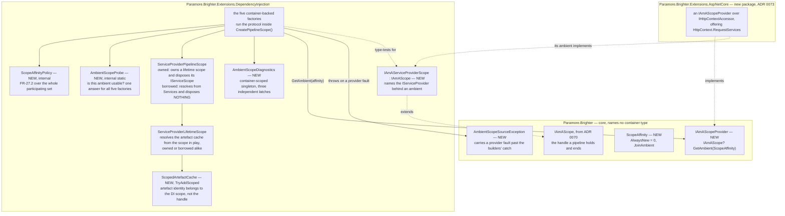

# 72. Adopting an ambient DI scope — the resolution-source hand-off

Date: 2026-08-02

## Status

Proposed

## Context

ADR 0070 gave a transform pipeline one DI scope, obtained from `CreatePipelineScope()` and carried as an `IAmAScope`. ADR 0071 brought handler pipelines onto the same handle. In both, the scope is one the container package **created**, and there is exactly one place a pipeline asks for it.

That is the whole mechanism needed to adopt a DI scope the host already owns — an ASP.NET request scope — because adoption is then simply *what `CreatePipelineScope()` returns*. What is missing is the one thing neither sibling decided: **how a pipeline discovers an ambient DI scope and gets at the resolution source behind it**.

**Parent Requirement**: [specs/0036-scoped-lifetime-per-pipeline/requirements.md](../../specs/0036-scoped-lifetime-per-pipeline/requirements.md)

**Scope**: This ADR decides **the non-core hand-off by which an ambient exposes a resolution source to the container package** and, because that is unimplementable without it, **which object computes a pipeline's `ScopeAffinity` when its participating factories have different configured lifetimes**. It discharges FR-10, FR-11, FR-12 — **which is where FR-13's borrowed-scope carve-out lands**, FR-13 routing "a borrowed scope is never disposed at all" to FR-12 in terms rather than keeping a clause of its own; FR-13's two clauses divide between ADR 0070 (transform pipelines) and ADR 0071 (handler pipelines) — **FR-21**, FR-24, **FR-27.1 and FR-27.2**, and — because this is where each is made true rather than merely relied on — **FR-16, including both FR-16a and **FR-16b** — the borrowed scope gives dependency identity across a `Send`'s handler pipeline and a `Post`'s transform pipeline in one request, which is FR-16b's mechanism and AC-34's assertion**, **FR-18**, **FR-19**, **FR-23** and **FR-26**. Each is discharged by a named mechanism here. Each is discharged by a named mechanism here: **FR-16/FR-16a** by `ScopedArtefactCache`, which is what makes two `Post`s in one request share one mapper (D7); **FR-18** by ladder row 7, the fall-back to a Brighter-owned scope when a registered provider offers nothing; **FR-19** by **the pump's own flow being suppressed** — ADR 0075's third bracket, taken in `Performer.Run()` — so every consumer pipeline's ask carries `AlwaysNew`, ladder row 6 gives it a scope it creates and owns, and no ambient is adopted whatever flow the pump was started from. ⚠ The pump publishing no per-message ambient (D0b, OOS-1) is **not** what makes this true and is no longer offered as the reason: it leaves a `Dispatcher` started from inside a live request free to inherit an `HttpContext`, which C-14 assumes away rather than prevents and which the seam would then borrow from at row 10. **ADR 0075 owns the mechanism and states the site**; this ADR discharges the requirement. ADR 0076 supplies the property and its inheritance onto `ConsumersOptions`, and says so; **FR-23** by `AmbientScopeProbe` and ladder rows 8 and 9; and **FR-26** by `ScopedArtefactCache` being resolved *from* the borrowed scope rather than held beside it, so Brighter keeps no state that outlives a scope it does not own. **FR-21 — affinity applies to `Scoped` only — is discharged here** because this is where it is made true: ladder rows 1 and 2 make a factory whose configured lifetime is not `Scoped` offer nothing and make no ask, and `ScopeAffinityPolicy` yields `JoinAmbient` only where at least one participant is `Scoped` and none is `Transient`. AC-26 is its guard. ADR 0076 supplies the property those tests read and its `AlwaysNew` default, and says so. FR-13's ownership clause is who owns, and who must not dispose, a scope the pipeline was handed; that requirement's disposal-failure clause is ADR 0070's for transform pipelines and ADR 0071's for handler pipelines, where AC-33 guards it. **FR-27.3 — suppression as a subscriber property — is ADR 0075's to discharge**, not this ADR's; it enters the protocol below at one line and adds no outcome to it.

It does **not** decide four naming questions and one siting question. Three are ADR 0073's — the ambient-query member `GetAmbient(ScopeAffinity)`, the package `Paramore.Brighter.Extensions.AspNetCore` and the registration extension `AddBrighterRequestScope(ScopeAffinity)` (C-11); the fourth, the shape and spelling of the opt-in property on `IBrighterOptions`, is ADR 0076's (C-9). This ADR uses their settled spellings where it names them at all, and calls the option *the affinity option*, because nothing here depends on any of them. It does not decide **how a `Publish` subscriber suppresses adoption** for itself and for the pipelines beneath it — that is ADR 0075, which owns the flag, both brackets and the reasoning about `ExecutionContext`. Suppression enters the protocol below at exactly one line, the affinity computation, and adds no outcome to it. And it does not decide **where FR-22's validation rules are evaluated** — that is ADR 0074. Where FR-24.3's duplicate-provider warning is concerned, this ADR decides only the **registration model that makes a duplicate detectable and resolution predictable**; the site at which the rule is evaluated and the message produced is 0074's.

This ADR **supersedes no prior ADR.** It extends the 0066–0069 sequence and completes the seam ADRs 0070 and 0071 opened.

### Where this ADR sits

Seven ADRs deliver the parent requirement, one decision each. This is the third; it is where the feature starts, the first two having only closed defects.

| ADR | Decides |
| --- | --- |
| 0070 | a transform pipeline takes one DI scope, carried **as a parameter** |
| 0071 | handler pipelines converge onto the **same handle**, carried on the object they already pass |
| **0072** *(this one)* | how a pipeline discovers an **ambient** DI scope the host owns |
| 0073 | the **ASP.NET Core package**, and the one line an application writes to opt in |
| 0074 | **where** the six scope-configuration rules are evaluated |
| 0075 | how a `Publish` subscriber **suppresses** adoption, for itself and everything nested beneath it |
| 0076 | the **affinity option**, and how one setting reaches all four registration paths in any order |

The rule the first two state is **the per-pipeline object carries the DI scope**, and this ADR is where that object learns it may not have created its own scope at all.

The two siblings converged both pipeline families onto one member, `CreatePipelineScope()`. That is why adoption is a change in **one** place: joining an ambient scope is simply what that member returns.

ADR 0067's `Terms` block defines the two axes used throughout — Brighter's *configured lifetime*, which governs the artefact, and the container's *registration lifetime*, which governs the dependencies — and keeps `IServiceScope`, `ServiceProviderLifetimeScope` and `IAmALifetime` distinct from one another. This ADR does not restate it, and does not use "lifetime scope" for anything it introduces. (NFR-8 is a documentation obligation about one specific ambiguity, `IAmAScope` against `IAmALifetime`; it is discharged where this package documents its types, **not by this sentence**.)

### What the two siblings leave open

| Question | Where it stands after 0070 and 0071 |
| --- | --- |
| How does a pipeline learn that an ambient DI scope exists? | Nothing exists. `IAmAScopeProvider` and `ScopeAffinity` are named by D4 but no ADR has introduced them |
| Once an ambient is offered, how does a container-backed factory resolve from it? | `IAmAScope` has no members beyond disposal, deliberately, so it carries no answer. ADR 0070 explicitly declined to introduce a hand-off type |
| When a pipeline's participating factories have different lifetimes, who decides the affinity? | FR-27.2 states the rule over the whole participating set, but `CreatePipelineScope()` is called on **one** factory |

### The forces

- **Core must stay container-agnostic.** ADR 0014 is the principle: Brighter offers per-family factory interfaces rather than abstracting an IoC container, and the application supplies the implementation. No type in `Paramore.Brighter` may name `IServiceProvider`, `IServiceCollection`, `ServiceLifetime` or `ServiceDescriptor`, and that has to hold at the level of core's *source*, because `Microsoft.Extensions.DependencyInjection` is already on core's compile closure transitively through `Microsoft.Extensions.Logging`. So the type that carries a resolution source cannot live in core, and `IAmAScope` cannot grow a member that returns one.
- **C-1 — Microsoft's DI scopes do not nest.** A scope created from a scoped provider is root-parented, so it cannot see the request's `DbContext`. Adopting can therefore only mean *resolving directly from the caller's provider*. There is no "wrap the ambient in a child scope" option that would have let the handle stay opaque.
- **C-7 — ownership travels with the DI scope.** Created implies Brighter disposes (FR-13); adopted implies the caller's, never disposed by Brighter (FR-12). An ambient that is offered and then declined — stale (FR-23), or returned for an `AlwaysNew` ask (FR-24.4) — is the **created** case, and Brighter must not dispose the thing it declined.
- **D11 — the provider is an *ambient source*, not a scope supplier.** The container package always creates and owns the `IServiceScope` when it is not borrowing one. "No provider registered" (FR-11), "provider returned nothing" (FR-24.2) and "ambient present but unusable" (FR-23) all collapse onto one path: *create your own*. Brighter registers **no default provider**, which is what makes registering the ASP.NET one incapable of producing a duplicate.
- **The seam is a public extension point and must be implementable off ASP.NET and off Microsoft's container** (NFR-7). AC-35 requires a test-assembly provider that holds its ambient in an `AsyncLocal`, references no ASP.NET, and whose ambient a Brighter handler genuinely resolves from. AC-13 requires a different fake, in an assembly that references **no** container package at all, that records only the affinity each pipeline asked with. Those two ACs pull in opposite directions and together fix the hand-off's shape.
- **FR-8 must be honourable from outside this package.** Per-subscriber isolation on `Publish` is decided by ADR 0075, but the pipeline that honours it is this one. Whatever carries that decision has to be readable by a container package Brighter does not ship (NFR-7), which is why the protocol below reads a flag rather than receiving an argument.
- **D19 — the diagnostic latches are per Brighter container**, once per (condition, provider implementation type), and must belong to a container-scoped singleton rather than a `static`, or AC-11's third branch is unsatisfiable by a correct implementation.
- **NFR-2 / D1 — no ASP.NET dependency in the DI package.** The ASP.NET package depends on the DI package; never the reverse. Registering the provider *is* the opt-in — there is no middleware.
- **NFR-4 — thread safety.** Concurrent pipelines on different threads must not interfere with one another, and nothing the seam introduces may be torn or shared between them.

## Decision

**An ambient exposes its resolution source to the container package through a one-member role interface that lives in that package rather than in core, and a container-backed factory tests for that role when it creates a pipeline scope — asking the ambient source exactly once, carrying an affinity computed over the pipeline's whole participating set, and then either borrowing that resolution source without owning it or creating and owning a scope exactly as it does today.**

The role is `IAmAServiceProviderScope`, an `IAmAScope` that can name the `IServiceProvider` behind it. The affinity is computed by a policy object rather than by each factory, because a pipeline's participating factories can carry different configured lifetimes and only one of them is asked to create the scope. Everything else — where a declined ambient goes, when a diagnostic fires, who owns what — falls out of a single ordered protocol, below.

### The mechanism, end to end

Every path that is not *borrowed* ends at **create and own a scope**, which is exactly today's behaviour. That is the design's central property: six distinct failures — no provider, nothing offered, a stale ambient, an ambient from a container this package cannot use, an ambient offered for an `AlwaysNew` ask, and suppression in force — all converge on one fallback, and it is the one that already works.

The protocol is a ladder. Each row is tested in order and the first that matches decides:

| | Situation | Outcome | Diagnostic |
| --- | --- | --- | --- |
| 1 | **the factory being asked** has no scope to offer — its own configured lifetime is not `Scoped` (mapper factory: `MapperLifetime`; transformer factory: `TransformerLifetime`), or, for the handler factory, is `Singleton` | `null`: this factory offers nothing. **Transform family**: ADR 0070's first-non-null routing asks the next participant. **Handler family**: there is no next participant — the pipeline takes no pipeline scope and makes no ask | none |
| 2 | `Scoped` does not participate in this pipeline — handler family, `HandlerLifetime` is `Transient` | **a handle, but not an FR-27 pipeline scope** — ADR 0067's per-resolution machinery riding on a handle — and **no ask is made at all** (FR-27.1) | none |
| 3 | no `IAmAScopeProvider` is registered at all | **OWNED**, and no ask is made — there is nothing to ask. Behaviour is exactly as before this change whatever the affinity option says (FR-11(a)) | **none** — FR-11(a) makes the affinity irrelevant here and FR-19's two diagnostics are bounded to hosts *where an ambient source is registered*, so this case is silent by requirement, not by omission |
| 4 | the ambient source throws | the fault is wrapped in `AmbientScopeSourceException`, which each builder's `catch` recognises: cleanup runs, then the **original** is rethrown **unwrapped** — a misconfigured container is a startup-class fault, never degraded to "no ambient" and never folded into `ConfigurationException` (FR-24.1, AC-30) | none |
| 5 | the ask did **not** carry `JoinAmbient`, and something came back | **OWNED**; the ambient is ignored *before* it is probed, and never disposed (FR-24.4) | *ambient offered for an `AlwaysNew` ask and ignored* |
| 6 | the ask did **not** carry `JoinAmbient`, and nothing came back | **OWNED** | none |
| 7 | the ask carried `JoinAmbient`, and nothing came back | **OWNED** (FR-24.2, which includes FR-18's ordinary "no current `HttpContext`" case) | *no ambient offered* |
| 8 | something came back, but does not implement `IAmAServiceProviderScope` | **OWNED**; declined, never disposed (FR-11(b), FR-13, C-7) | *ambient offered but unusable* |
| 9 | something came back and implements the role, but fails the usability probe | **OWNED**; declined, never disposed (FR-23) | *ambient offered but unusable* |
| 10 | something came back, implements the role, and passes the probe | **BORROWED** — resolve from it, own nothing, dispose nothing (FR-12, C-7) | none |

**Rows 1 and 2 are both FR-27.1's "no pipeline scope", and row 2 still yields an object.** FR-27.1 puts them in one category — a pipeline with no `Scoped` participant takes no pipeline scope and asks nothing — and neither row makes an ask. What row 2 returns is nonetheless non-null, because a `Transient` handler pipeline carries ADR 0067's per-resolution isolation and `IsolateTransientHandlerScope` on the same handle (ADR 0071). **That handle is not what FR-27 means by a pipeline scope**, and rows 3–10's `OWNED` is reserved for one that is. An implementation asserting AC-46's "no pipeline scope taken" over the handle's nullness is testing the wrong thing. **Under FR-27.1 the ask and the pipeline scope are co-extensive** — a pipeline that takes one asks exactly once, and a pipeline that takes none never asks — so the recorder's zero asks *is* the assertion of "no pipeline scope taken". There is no separate observable, and none is needed; AC-13's own note says the fake cannot see scopes.

Rows 3 onwards are reached only after the affinity has been computed, and that computation is also the single point at which suppression enters:

> `affinity = AmbientScopeSuppression.IsSuppressed ? AlwaysNew : the policy over the whole participating set`

**`AmbientScopeSuppression` is ADR 0075's type** — it owns the flag, all three of its brackets and the reasoning — and this is the one line in this design that reads it. Suppression adds no row to the ladder — a suppressed pipeline takes rows 5 or 6, which is where a host whose ambient source offers nothing lands anyway.

**Two kinds of flow reach that line already suppressed, and the second is why FR-19 holds.** A `Publish` subscriber, and everything nested beneath it, is suppressed by ADR 0075's first two brackets (FR-8, FR-27.3). **A consumer pipeline is suppressed too, for its whole life**, by that ADR's third bracket in `Performer.Run()` — so no pipeline the pump drives ever computes `JoinAmbient`, and **the consumer side never reaches an adoption**, whatever the affinity option says and whatever flow the `Dispatcher` was started from. Its ask is still made and still carries `AlwaysNew` (D16), so the decision stays observable; ADR 0073's provider returns nothing on such an ask, so it lands on **row 6 — `OWNED`, no diagnostic**. That is what discharges FR-19 here, and ADR 0075 step 4a is where the site and the reason for it live. ⚠ **This is stronger than FR-19 as currently drafted, and AC-20 has not caught up**: that criterion asserts **exactly one** FR-24.2 *no ambient offered* `Warning` over a `JoinAmbient` consumer run, which was right while the consumer's ask still carried `JoinAmbient` and lands on row 7. Under this bracket the ask carries `AlwaysNew`, row 6 fires and the count is **zero**. The correction is owed to FR-19, AC-20 and C-14 together and is carried in the requirements true-up, not here.

**Row 1 is a test on one factory, and the ladder runs once per pipeline.** Those two facts have to hold together or D16's *exactly one ask* is not delivered, and what makes them hold is ADR 0070's first-non-null routing: the participants are asked in a fixed order and the first that offers a handle wins, so at most one of them ever gets past row 1. Walk `{Transient mapper, Scoped transformer}`: the registry is asked first and forwards to the mapper factory, whose `MapperLifetime` is not `Scoped`, so row 1 returns `null` and it makes no ask; the transformer factory is asked next, its `TransformerLifetime` *is* `Scoped`, so it falls through row 1 and runs the rest of the ladder — computing the affinity over **both** lifetimes, which is why the policy is not a per-factory test. The pipeline gets one scope and one ask, from the participant that had something to offer.

Three further things the ladder is making a point of. The ask happens **even when the affinity is `AlwaysNew`** — rows 5 and 6 (D16) — which is what makes a pipeline's adoption decision observable at all. A declined ambient is **never disposed**, at rows 5, 8 and 9 alike, because Brighter does not own what it declined (C-7). And the three diagnostics are distinct, independently latched conditions, not three spellings of one.

### Where the pieces live



### Key Components

#### The roles, and what each is responsible for

| Role | Type | Stereotype | Responsibility |
| --- | --- | --- | --- |
| Ambient source | `IAmAScopeProvider` (core) | **deciding** | Answers, for one pipeline carrying one affinity, whether there is an ambient it may adopt. Creates nothing, owns nothing, disposes nothing |
| Pipeline scope handle | `IAmAScope` (core, ADR 0070) | **knowing** (information holder) | Is the scope a pipeline resolves from. Says nothing about where it came from or who owns it |
| Resolution source | `IAmAServiceProviderScope` (DI package) | **knowing** | An `IAmAScope` that can name the `IServiceProvider` behind it, so a Microsoft-container-backed factory can resolve from it |
| Affinity policy | `ScopeAffinityPolicy` (DI package, internal) | **deciding** | Applies FR-27.2 to a participating set of configured lifetimes and yields the pipeline's `ScopeAffinity` |
| Usability probe | `AmbientScopeProbe` (DI package, internal static) | **deciding** | Answers, for one offered ambient, whether this container package can resolve from it — the single implementation the five factories share |
| Per-scope artefact cache | `ScopedArtefactCache` (DI package) | **knowing** | Holds the `Scoped` artefacts one DI scope has produced, keyed by type, and is owned and released by that DI scope |
| Diagnostics latch | `AmbientScopeDiagnostics` (DI package) | **doing** | Emits each of the three ambient `Warning` conditions at most once per (condition, provider implementation type) per Brighter container |
| Scope adopter | the five container-backed factories | **doing** | Inside `CreatePipelineScope()`: compute, ask, decline or borrow, create |

#### `IAmAScopeProvider` and `ScopeAffinity` — the core half of the seam (new, core, public)

```csharp
namespace Paramore.Brighter
{
    /// <summary>
    /// An ambient source. Answers whether there is a DI scope the calling application already owns
    /// that this pipeline may resolve from. It supplies no scope of its own: whatever it does not
    /// offer, the container package creates and owns.
    /// </summary>
    public interface IAmAScopeProvider
    {
        IAmAScope? GetAmbient(ScopeAffinity affinity);
    }

    public enum ScopeAffinity
    {
        AlwaysNew = 0,
        JoinAmbient
    }
}
```

Both type names are settled by D4. The *member* spelling `GetAmbient` was a working name under C-11; ADR 0073 keeps it, and its contract — one argument, the asking pipeline's affinity; one return, an ambient or nothing — was fixed by D17 and never open. `AlwaysNew` is `0` so that `default(ScopeAffinity)` is the safe value.

**Contract.**

| Member | Input | Output | Error conditions |
| --- | --- | --- | --- |
| `GetAmbient(ScopeAffinity)` | the affinity of the pipeline that is asking, computed by the caller over the whole participating set | an ambient the pipeline may adopt, or `null` | A throw reaches the caller of `Send`/`Publish`/`Post` **unwrapped**, by the mechanism below — a misconfigured container is a startup-class fault and must not be degraded to "no ambient", nor folded into the `ConfigurationException` every other build failure becomes (FR-24.1, AC-30). Returning `null` is not an error; it is the ordinary answer where there is no ambient (FR-24.2). Returning an ambient for an `AlwaysNew` ask **violates this contract**; Brighter ignores it rather than trusting the provider (FR-24.4) |

The obligation and the guard are both required, and both are stated here. The provider is told it must neither consult nor adopt on an `AlwaysNew` ask; Brighter's side ignores anything returned for one anyway, because `IAmAScopeProvider` is a public extension point and FR-8's per-subscriber isolation must not be defeasible by a third-party implementation.

**The ask is made even when the affinity is `AlwaysNew`** (D16). It is what makes a pipeline's adoption decision observable at all: without it, FR-27.2's decline-to-adopt rule has no observable, and AC-13 and AC-46 — which assert *exact* counts of adoption decisions and the affinity each carried — are unimplementable. The cost is one virtual call per pipeline that takes a pipeline scope. NFR-6 does not bless it and is not cited for it: NFR-6 budgets **DI scopes**, and an `AlwaysNew` ask allocates none. The ask is justified on observability alone.

#### `IAmAServiceProviderScope` — the hand-off (new, DI package, public)

```csharp
namespace Paramore.Brighter.Extensions.DependencyInjection
{
    /// <summary>
    /// An <see cref="IAmAScope"/> that names the <see cref="IServiceProvider"/> behind it, so a
    /// container-backed Brighter factory can resolve a pipeline's artefacts and their dependencies
    /// from it. Implement this on an ambient scope offered by an <see cref="IAmAScopeProvider"/>.
    /// The implementer owns the underlying scope; Brighter never disposes it.
    /// </summary>
    public interface IAmAServiceProviderScope : IAmAScope
    {
        IServiceProvider Services { get; }
    }
}
```

**Contract.**

| Member | Input | Output | Error conditions |
| --- | --- | --- | --- |
| `Services` | none | the provider a pipeline adopting this ambient resolves from — for the ASP.NET provider, `HttpContext.RequestServices` | Must not throw and must not be `null`. It **may** name a provider whose scope has already been disposed; that is FR-23's case and Brighter probes for it before resolving anything. Brighter never disposes the returned provider, nor the `IAmAServiceProviderScope` itself (FR-12, C-7) |
| `Dispose()` / `DisposeAsync()` (from `IAmAScope`) | — | — | Brighter never calls either on an ambient, adopted or declined. They exist only because `IAmAScope` carries them |

Four properties of this shape are load-bearing:

- **It is a role interface, not a base class and not a concrete type.** Any assembly can implement it without inheriting anything, which is what AC-35's non-ASP.NET, non-Microsoft-container-package provider needs and what NFR-7 requires generally.
- **It lives in the DI package, not core.** It names `IServiceProvider`, so core is the one place it cannot go — and it is meaningful only to a package that resolves from Microsoft's container. A package built over Autofac or SimpleInjector declares its own equivalent role over its own container's resolution source; nothing in core has to change for it.
- **The four container-backed transform factories and the handler factory type-test for the interface**, never for a class: `if (ambient is IAmAServiceProviderScope src)`. `ServiceProviderPipelineScope`'s **borrowed construction path** therefore stays **internal** to the DI package. The class itself is `public` — the DI package's convention, which ADR 0070's *Technology Choices* states with the count — but its constructor is `internal`, so no third party ever builds one and none is handed one: the seam binds an implementer to a contract rather than to Brighter's implementation.
- **An ambient that does not implement the role is ignored, not rejected.** An ambient offered by a package that declares its own role over another container's resolution source, handed to Microsoft-backed factories, is a configuration the seam must survive, not diagnose by throwing: the factory declines it and takes the *created* path, which is FR-11(b), FR-13 and C-7's third case. It is declined under FR-23's condition — *ambient offered but unusable* — since that is exactly what it is from this container package's side, and reporting it there reuses a specified, latched diagnostic instead of inventing a fourth. **This is an extension of FR-23's diagnostic beyond its literal text, stated as one**: FR-23 is written about a *stale* resolution source and AC-29 exercises a capturing provider, so neither reaches an ambient of a foreign role type, and **no acceptance criterion guards this row**. The extension is taken on the same reasoning ADR 0070 uses to extend NFR-1(b) to the two mapper registries, and the gap is recorded in *Negative* rather than left to be discovered. Nothing is thrown, and the declined `IAmAScope` is **not** disposed.

**On the name.** `IAmAServiceProviderScope` is this ADR's to choose — it is not one of C-11's three working names — and it is chosen because it states both halves of what the type is, an `IAmAScope` whose resolution source is an `IServiceProvider`, and because it carries the `ServiceProvider*` prefix every other Microsoft-container type in the package already wears (`ServiceProviderLifetimeScope`, `ServiceProviderHandlerFactory`, `ServiceProviderMapperFactory`).

#### `ScopeAffinityPolicy` — who computes the affinity (new, DI package, internal)

FR-27.2 makes the affinity a property of the *whole* participating set, but ADR 0070's protocol calls `CreatePipelineScope()` on one factory and D16 requires exactly one ask per pipeline. The factory that creates the pipeline scope must therefore know every participant's configured lifetime. It can: all five container-backed factories already read `IBrighterOptions` in their constructors — `ServiceProviderMapperFactory.cs:44-45`, `ServiceProviderMapperFactoryAsync.cs:45-46`, `ServiceProviderTransformerFactory.cs:44-45`, `ServiceProviderTransformerFactoryAsync.cs:45-46` and `ServiceProviderHandlerFactory.cs:49-50`, and `IBrighterOptions` (`BrighterOptions.cs:72`) carries all three of `HandlerLifetime`, `MapperLifetime` and `TransformerLifetime`. Today each factory keeps only its own; from here each keeps the policy instead.

```csharp
internal sealed class ScopeAffinityPolicy
{
    public ScopeAffinityPolicy(IBrighterOptions? options);

    public ScopeAffinity ForHandlerPipeline();     // participants: { HandlerLifetime }
    public ScopeAffinity ForTransformPipeline();   // participants: { MapperLifetime, TransformerLifetime }
}
```

One object holds FR-27.2's rule so that five factories do not each re-derive it, and two members rather than a general one because D12 fixes exactly two participating sets and there are only two.

**Contract.**

| Member | Input | Output | Error conditions |
| --- | --- | --- | --- |
| ctor | the resolved `IBrighterOptions`, or `null` where none is registered | — | Never throws. The policy answers `AlwaysNew` **unconditionally** when the options object is `null`, so every pipeline creates its own scope — the same degradation every other failure path takes. It is stated as its own rule rather than derived from the property defaults, because the factories' existing `null` fallbacks are **not** those defaults: `ServiceProviderMapperFactory.cs:45` and its three transform-family siblings fall back to `ServiceLifetime.Singleton`, and only `ServiceProviderHandlerFactory.cs:50` falls back to `Transient`. Those fallbacks are unchanged by this ADR and are not what this rule reads |
| `ForHandlerPipeline()` | none; reads `{ HandlerLifetime }` and the affinity option | `JoinAmbient` when the affinity option is `JoinAmbient` and `HandlerLifetime` is `Scoped`; `AlwaysNew` otherwise | Never throws. **Tests for `JoinAmbient` positively**, so any value outside the enum degrades to `AlwaysNew` |
| `ForTransformPipeline()` | none; reads `{ MapperLifetime, TransformerLifetime }` and the affinity option | `JoinAmbient` when the affinity option is `JoinAmbient`, at least one of the two is `Scoped`, and neither is `Transient`; `AlwaysNew` otherwise. `Singleton` participants are ignored (FR-27.2) | as above |

Both members are pure functions of state fixed at container build, so they are **safe to call concurrently and hold nothing**; a factory may keep one policy instance for its life and call it once per pipeline from any thread.

**Positive testing for `JoinAmbient` is a contract, not an implementation detail.** ADR 0076 relies on it: `ScopeAffinity` is a plain non-nullable enum on a public options interface, so an application can assign a cast integer that is neither member, and the safe degradation is *do not adopt*. Every reader of a `ScopeAffinity` in this design — the policy here, and the affinity guard on the provider's answer — tests for `JoinAmbient` positively rather than testing for `AlwaysNew` and treating everything else as adoption. `AlwaysNew = 0` makes `default(ScopeAffinity)` safe for the same reason.

#### `AmbientScopeSourceException` — the courier (new, core, public)

The one type in this ADR an implementer outside Brighter is *obliged* to construct. It carries a provider's own exception out of `GetAmbient` without letting it be mistaken for an ordinary build failure.

| Member | Input | Output | Error conditions |
| --- | --- | --- | --- |
| `AmbientScopeSourceException(Exception inner)` | the exception the provider threw | an instance whose `InnerException` is **never `null`** | none — the constructor does not validate, because the only caller is the factory that just caught the inner exception |

**The never-null invariant is load-bearing**, not incidental: it is what licenses `e.InnerException!` at the six sites that unwrap it, so a provider that constructs one without an inner exception breaks those call sites rather than merely being untidy. Any factory that asks a provider for an ambient — including one in a third-party container package (NFR-7) — must wrap a throw from that ask in this type; the discrimination in the builders' `catch` filters is by this type and nothing else. *Technology Choices* says why a bespoke type rather than a reused one.

#### `ScopedArtefactCache` — artefact identity under a borrowed scope (new, DI package, public)

Under `JoinAmbient` the borrowed DI scope owns the **artefact**, not merely its dependencies (D7, FR-16a): two `Post`s in one request share one mapper. ADR 0070 gives artefact identity **per pipeline**, by way of `ServiceProviderLifetimeScope`'s per-type `_scopedInstances` cache (`:163-178`) riding on the handle, and says in terms that this is sufficient for the owned case and insufficient for adoption. Supplying what adoption needs is this ADR's.

The reason per-pipeline is not enough is that a borrowed `ServiceProviderPipelineScope` is constructed **per pipeline** too — each `Post` calls `CreatePipelineScope()` and gets its own handle over the same `HttpContext.RequestServices`. A cache that is a private field of the handle (`ServiceProviderLifetimeScope.cs:49`) would therefore give per-pipeline artefact identity and two mappers, falsifying FR-16(a) and AC-17.

So the cache moves off the handle and into the DI scope. `ScopedArtefactCache` is registered `TryAddScoped` by the DI package and holds the per-type artefact dictionary; `ServiceProviderLifetimeScope`'s `Scoped` path resolves it **from the scope in play** rather than owning a field:

- **borrowed** — resolved from `src.Services`, so one instance per request scope, shared by every pipeline in that request, released by the container when the request scope ends;
- **owned** — resolved from the `IServiceScope` `EnsureRootScopePublished()` (`:185`) just created, so one instance per pipeline, exactly today's behaviour and exactly what FR-1, FR-2 and AC-1 require.

One mechanism, both cases. It is FR-26's recommended mechanism, and it is what makes FR-26 hold with no weak references and no eviction logic: the container owns the association's lifetime and disposes it with the scope. `TryAddScoped` rather than `AddScoped` is what lets AC-37 clause 2's positive control register the same type `Singleton` and observe the retention it is controlling for. The cache disposes nothing it holds — MS DI already tracks disposable transient resolutions against the scope that created them, which is what AC-17 asserts — so its `Dispose` only drops references and decrements AC-37 clause 3's counter.

Where a borrowed provider cannot supply a `ScopedArtefactCache` — an ambient from a container Brighter did not register into — the handle **declines the borrow at the probe** rather than falling back. Dependency sharing, which is the headline of adoption, is unaffected; artefact identity reverts to per pipeline. There is no private fallback cache: `ServiceProviderLifetimeScope.cs:49`'s `_scopedInstances` field *becomes* a resolution of this service, as step 3a says, and a provider that cannot supply one does not pass the probe. That keeps one statement of where the cache lives, and puts the decline where the other three decline points already are (C-7).

**Contract.** The move from a per-pipeline field to a request-`Scoped` service turns a cache one pipeline owned into one every concurrent pipeline in a request contends for, which is squarely inside NFR-4. It is answered by **inheriting today's protocol verbatim** rather than inventing one:

| Member | Input | Output | Error conditions |
| --- | --- | --- | --- |
| `GetOrAdd(Type, Func<object?>)` | the artefact type, and a factory that resolves one | the single instance of that type held by this cache | Concurrency is `ConcurrentDictionary<Type, Lazy<object?>>` with the `Lazy` publish protocol `ServiceProviderLifetimeScope.cs:163-178` already uses: concurrent first-resolvers of one type produce **one** instance and the losers see the winner's, and a resolution that throws propagates to every waiter. **A faulted resolution is not retained**: the entry is removed and the exception propagates. **The removal must take the observed pair, not the key** — `TryRemove(KeyValuePair<Type, Lazy<object?>>)`, not `TryRemove(type, out _)`. Under `ExecutionAndPublication` every thread that awaited the faulting `Lazy` observes the exception and every one of them attempts the eviction, so a key-only removal can delete a *healthy* `Lazy` that a concurrent resolver published in between — which under `JoinAmbient` yields two `Scoped` artefacts in one borrowed request scope, exactly what FR-16(a) and AC-17 forbid. A losing waiter's removal is then a no-op, which is the required behaviour (NFR-4), so a later resolution of the same type in the same scope resolves again rather than rethrowing a remembered failure. The owned and borrowed paths are identical here — one protocol, not two |
| `Dispose()` | — | — | Drops its references and nothing else. It disposes no artefact it holds: MS DI already tracks disposable transient resolutions against the scope that created them, which is what AC-17 asserts. A `Dispose` racing a `GetOrAdd` is the container disposing a scope while a pipeline resolves from it, which is the caller's error and the same error it is today |

**The one place the protocol is not inherited, and why.** `Lazy`'s default `LazyThreadSafetyMode.ExecutionAndPublication` **caches the fault**: a `GetService` that throws is remembered, and every later request for that type rethrows it. Today that is confined to one pipeline. Moving the cache into the scope is what makes that unacceptable — under `JoinAmbient` the fault would live as long as the request, so one transient resolution failure would poison that artefact type for every remaining pipeline in it. The widening is this ADR's doing, so the fix is this ADR's obligation rather than an adjacent one: **`GetOrAdd` evicts a faulted entry instead of publishing it**, on both the owned and the borrowed `Scoped` path. That is issue **#4260**'s fix for the `Scoped` cache — the `Singleton` cache is out of scope, and step 3a says why — and fixing the owned path here rather than only the borrowed one is deliberate — evicting on fault *only* where the scope is borrowed splits one protocol across two paths for half a fix, and leaves the owned path with the behaviour that was tolerable only because its cache was short-lived. Step 3a says how.

#### `AmbientScopeDiagnostics` — the three latches (new, DI package, container-scoped singleton)

Three rules require a latched `Warning` naming a provider implementation type, and they are three distinct diagnostics, latched independently:

| Condition | Rule | When |
| --- | --- | --- |
| *no ambient offered* | FR-24.2 | a `JoinAmbient` ask returned nothing. Includes FR-18's ordinary case — an opted-in host with no current `HttpContext`. Never fires on an `AlwaysNew` ask |
| *ambient offered but unusable* | FR-23 | a `JoinAmbient` ask returned an ambient that does not implement this package's hand-off role, or one that failed the usability probe |
| *ambient offered for an `AlwaysNew` ask and ignored* | FR-24.4 | any ask carrying `AlwaysNew` returned something |

Each is latched once per **(condition, provider implementation type)** and the latch belongs to an instance registered `TryAddSingleton` on the Brighter container — the host's root provider — **not** to a `static` (D19). A process-static latch makes AC-31's `AlwaysNew` branch vacuous and AC-11's third branch unsatisfiable by a correct implementation, both of which reuse one provider implementation type across branches in separate hosts. Each message names its condition in terms a capturing `ILoggerProvider` can discriminate on; naming only the provider type is insufficient, because all three do that.

**Contract.**

| Member | Input | Output | Error conditions |
| --- | --- | --- | --- |
| `WarnOnce(condition, providerType)` | one of the three conditions above, and the **implementation** type of the provider that was asked. There is no key for "no provider is registered", and none is needed: that case makes no ask and emits no diagnostic (ladder row 3, FR-11(a)) | the message is logged at `Warning` on the first call for that pair and on no later one | **Atomic per (condition, provider implementation type)** — a single `ConcurrentDictionary<(Condition, Type), byte>.TryAdd`, whose return value decides whether to log. It has to be atomic rather than check-then-set: AC-11 asserts *exact* warning counts, and a `Publish` runs its subscribers concurrently on both twins — `Parallel.ForEach` (`CommandProcessor.cs:481`) on the sync path and `await Task.WhenAll(tasks)` (`:601`) on the async one, which is the twin AC-11 is written over — so three subscribers hitting the same condition on a check-then-set latch could log two or three times. Never throws; a logging failure is the logger's |

Only one ordering constraint is real, and it is FR-24's exclusivity rule: **FR-24.4 is evaluated first**, because an ambient returned for an `AlwaysNew` ask is ignored *before* it is probed — so a stale ambient returned for one is reported under FR-24.4 and never under FR-23. FR-23 and FR-24.2 are **mutually exclusive** — one is "an ambient came back and cannot be used", the other is "nothing came back" — so their relative order is immaterial, and the ladder and the pseudo-code test *nothing came back* first purely because it is the cheaper test. The requirements do **not** say the order is immaterial — they fix FR-24.4, then FR-23, then FR-24.2, and record that the overlap between the last two is real. The two are reconciled rather than in conflict: this ladder's *nothing came back* is a strictly narrower condition than FR-23's *treat a failed probe exactly as "no ambient"*, so separating those rows rather than merging them yields the same outcomes the requirements' order would.

#### Where each type is touched

| Assembly | Type | Change |
| --- | --- | --- |
| `Paramore.Brighter` | `IAmAScopeProvider`, `ScopeAffinity` | **new** |
| `Paramore.Brighter` | `AmbientScopeSourceException` | **new** — carries a provider fault past the pipeline builders' wrapping `catch` |
| `Paramore.Brighter` | `PipelineBuilder<TRequest>` | an `AmbientScopeSourceException` clause ahead of the wrapping `catch` in both build paths (`:202-205`, `:248-251`) |
| `Paramore.Brighter` | `TransformPipelineBuilder`, `TransformPipelineBuilderAsync` | an `AmbientScopeSourceException` clause ahead of each wrapping `catch` — `:116-125` and `:157-166`, at identical lines in both files, quoted catch-line through closing brace as ADR 0070 quotes them — so cleanup runs and then the original is rethrown |
| `…DependencyInjection` | `IAmAServiceProviderScope`, `ScopeAffinityPolicy`, `ScopedArtefactCache`, `AmbientScopeDiagnostics` | **new** |
| `…DependencyInjection` | `AmbientScopeProbe` | **new** — internal static, one member `CanResolveFrom(IAmAServiceProviderScope)`; the ladder's usability test, shared by all five factories |
| `…DependencyInjection` | `ServiceProviderPipelineScope` | an **internal** borrowed construction path with non-owning disposal |
| `…DependencyInjection` | `ServiceProviderLifetimeScope` | an internal borrowed mode (resolve from a given provider; create and dispose nothing); the `Scoped` path resolves its artefact cache from the scope in play rather than owning `_scopedInstances` (`:49`), and a faulted resolution is evicted rather than published (#4260's `Scoped` half, step 3a). `GetOrCreateSingleton` (`:152`) and its `_singletonInstances` cache are **not** touched |
| `…DependencyInjection` | `ServiceProviderMapperFactory`, `ServiceProviderMapperFactoryAsync`, `ServiceProviderTransformerFactory`, `ServiceProviderTransformerFactoryAsync`, `ServiceProviderHandlerFactory` | keep a `ScopeAffinityPolicy`, the resolved `IAmAScopeProvider` and the diagnostics singleton — the last held **nullable**, so a factory constructed by hand over a provider that never ran `AddBrighter` makes `WarnOnce` a no-op rather than a null dereference, the same degradation `ScopeAffinityPolicy` takes for a null `IBrighterOptions`; `CreatePipelineScope()` runs the protocol below, which includes **one read of core's `AmbientScopeSuppression.IsSuppressed`** at the affinity computation — the flag, both brackets, the reasoning **and this edit** are ADR 0075's. **The line appears at this ADR's step 3 to show where in the protocol it sits; it arrives with ADR 0075's commit and would not compile in this one**, because the type it reads does not exist until 0075 declares it |
| `…DependencyInjection` | `ServiceCollectionExtensions.BrighterHandlerBuilder` (`:142`, reached from `:119`) | registers `ScopedArtefactCache` (`TryAddScoped`) and `AmbientScopeDiagnostics` (`TryAddSingleton`) |
| `Paramore.Brighter.Extensions.AspNetCore` | the provider | **new package**, kept under that name by ADR 0073; its ambient implements `IAmAServiceProviderScope` over `HttpContext.RequestServices` |

Unchanged, and named so the omission is not read as an oversight: `CommandProcessor`, whose dispatch methods gain nothing here; `IAmAScope`, and every interface ADRs 0070 and 0071 changed — no member is added to any of them here, though `CreatePipelineScope()`'s **contract** is widened: the handle it returns may now name a borrowed ambient, so the member promises that the caller must always *release* rather than that it *owns*, and only the handle knows whether releasing disposes anything (FR-12); `MessageMapperRegistry`, whose two forwarding members behave exactly as 0070 specifies; `IAmALifetime` and `HandlerLifetimeScope`; `PipelineBuilder.Dispose()` (`:269-270`), so D10's release timing is preserved by construction; `Reactor`, `Proactor`, `Dispatcher`, `DispatchBuilder` and `ConsumerFactory` (C-2); the pump's per-message behaviour (D0b); `BrighterOptions`' three lifetime properties and `IsolateTransientHandlerScope` (`:37`); and `RequestContext`.

### Technology Choices

**Why a provider fault needs a type of its own to escape.** FR-24.1 asks for something the surrounding code actively prevents. The ask is made inside `CreatePipelineScope()`, and every call site of that member sits inside a pipeline builder's guarded region — `PipelineBuilder.cs:190` and `:235` are inside the `try` whose `catch` at `:202` and `:248` turns everything that is not already a `ConfigurationException` into one, and `TransformPipelineBuilder.cs:116` and `:157` do the same without even a filter. A provider's `InvalidOperationException` would therefore reach the caller as a `ConfigurationException`, which is precisely the degradation FR-24.1 forbids and AC-30 falsifies.

Three ways out were available, and the difference between them is where the fault is allowed to escape. Moving the ask outside the guarded region is the obvious one and is the worst: on the handler path the ask is *per subscriber*, inside a loop inside the `try` (`PipelineBuilder.cs:187` sync, `:232` async), so hoisting it means either asking once for a set of subscribers whose lifetimes are independent — which loses D16's one-ask-per-pipeline meaning — or restructuring the loop so each iteration has its own guarded region, which is a change to the dispatch path this specification is otherwise careful not to make (C-2's neighbourhood, and D10's release timing rides on that loop). The reason is the loop structure, not a cleanup: `PipelineBuilder`'s catches run none. Letting the fault reach the caller as a typed Brighter exception is defensible but changes what AC-30 asserts. What this ADR does instead is give the ask its own exception type, `AmbientScopeSourceException`, and teach the wrapping `catch` in each of the three builders' two build paths — six in all — to recognise it: **whatever cleanup that catch already ran still runs, and then the original exception is rethrown with `ExceptionDispatchInfo.Capture(...).Throw()`**, stack intact — step 1b says what that is in each family. The caller sees what the provider threw, nothing is leaked, and no dispatch method changes.

**The type is a courier to an application and a contract to an implementer.** An application never observes it: it exists between the ask and the builder that catches it, and what reaches a caller is always the provider's own exception, unwrapped. But it is `public` in `Paramore.Brighter` and it has to be — a container package Brighter does not ship implements `CreatePipelineScope()` itself, and NFR-7 makes that a first-class case rather than a hypothetical one. **Any `IAmAScope`-producing factory that asks an `IAmAScopeProvider` must wrap a throw from that ask in this type**, or FR-24.1 silently fails for that package: the provider's fault is folded into `ConfigurationException` like any other build failure and the "misconfigured container is a startup-class fault" rule does not hold. Its contract is one line and is guaranteed rather than incidental: the constructor takes the provider's exception, and **`InnerException` is never `null`** — which is what licenses the `e.InnerException!` in the builders' rethrow. It is the reason `CreatePipelineScope()` can carry two error behaviours at once — the ambient ask propagates, while a failure to *create* a container scope stays an ordinary build failure and becomes the `ConfigurationException` AC-5 requires. Because the discrimination is by type rather than by position, the scope acquisition can sit inside the builder's `try` where AC-5 needs it, which is what ADR 0070's implementation sketch does.

**Why the affinity is computed on Brighter's side rather than asked of the provider.** The provider does not know the configured lifetimes and must not have to. It answers one question — is there an ambient here — and the pipeline tells it the affinity it is asking with. That keeps `IAmAScopeProvider` implementable in an assembly that references no container package at all, which is precisely what AC-13's fake is.

**Why `IAmAScope` stays empty.** Making the hand-off a *derived* role rather than a member on `IAmAScope` keeps ADR 0070's promise that a core handle knows nothing about resolution, and it keeps the ASP.NET package free of any obligation the DI package does not also impose. It also means the same `IAmAScope` type serves an owned Brighter scope, a borrowed ambient and an ambient Brighter declined, with no capability flag.

**Artefact identity, restated for both affinities.** Dependency identity always follows the DI scope. Artefact identity follows the **pipeline** under `AlwaysNew` and the **borrowed DI scope** under `JoinAmbient`; `Singleton` sits outside both, resolving from the root provider. That is what `ScopedArtefactCache` implements, and it is the sentence FR-25's guidance page has to carry.

### Implementation Approach

**1. The core types.** Add `IAmAScopeProvider` and `ScopeAffinity` to `src/Paramore.Brighter/`, and `AmbientScopeSourceException` beside them. None names a container type; the source-level guard AC-22.3 runs returns nothing new.

**1a. Structural, and separate: one spelling for the two `PipelineBuilder` catch filters.** `:248` reads `when(!(e is ConfigurationException))` where `:202` reads `when (e is not ConfigurationException)`. Normalising them changes no behaviour and belongs in its own commit ahead of the behavioural change, per Tidy First; doing it first also means the clause added below is added twice to the same shape.

**1b. The six builder `catch` blocks learn one clause — the wrapping `catch` in each of the three builders' two build paths.** Ahead of each existing wrapping `catch` — `PipelineBuilder.cs:202` and `:248`, `TransformPipelineBuilder.cs:116` and `:157`, and the same two lines in `TransformPipelineBuilderAsync` — add a clause for `AmbientScopeSourceException` that rethrows the inner exception through `ExceptionDispatchInfo.Capture(...).Throw()`. **What it does before rethrowing differs between the two families, because their general clauses differ.** In the four transform-builder catches the new clause calls the same cleanup the general clause calls — ADR 0070's `CleanUpQuietly`, which is why 0070 lifts it to a named method. In `PipelineBuilder`'s two catches it calls nothing, because those catches run no cleanup: `:202-205` and `:248-251` do nothing but wrap in `ConfigurationException`. What discharges AC-30's "no pipeline scope is leaked" on that path is `PipelineBuilder.Dispose()` (`:269-270`) firing from the `using var builder` at each of `CommandProcessor`'s four dispatch sites — it runs whether or not the build threw, and this ADR does not disturb it. Nothing else in the builders changes, and the general clause's behaviour for every other failure is untouched (AC-5). Both `PipelineBuilder` filters now also exclude the new type.

**2. The `CreatePipelineScope()` protocol.** This is the decision ladder under *The mechanism, end to end*, written out as the code runs it. One protocol, run inside every container-backed factory's `CreatePipelineScope()`. Adoption is **one** change, not two: after ADR 0071 both families reach their scope through this member, so a borrowed ambient is simply what it returns. There is no second path for handlers.

Step 1 is a test on the **asked** factory alone, and D16's *exactly one ask per pipeline* is delivered per family rather than by anything here. For a **transform** pipeline it is ADR 0070's first-non-null routing: the mapper registry is asked first and the transformer factory only if the registry offered nothing, so at most one participant reaches step 3. For a **handler** pipeline there is no routing to rely on and none is needed — one factory is called once per pipeline (ADR 0071), so at most one ask is structurally guaranteed. Under `{Transient mapper, Scoped transformer}` the registry returns `null` at step 1 without asking, and the transformer factory runs steps 3 onward — computing the affinity over the **whole** set, `{MapperLifetime = Transient, TransformerLifetime = Scoped}`. That set contains a `Transient`, so FR-27.2 yields `AlwaysNew` and the pipeline creates and owns its scope, even though the factory that was asked is itself `Scoped`. That is the case the policy exists for, and the reason step 3 cannot be a per-factory test.

```
CreatePipelineScope():

  1. if THIS factory's own configured lifetime has no scope to offer -> return null
        (mapper factory: MapperLifetime not Scoped.                     ADR 0070's routing
         transformer factory: TransformerLifetime not Scoped.           then asks the next
         handler factory: HandlerLifetime is Singleton.)                participant

  2. if Scoped does not participate in this pipeline                 -> return an OWNED handle,
        (handler family only: HandlerLifetime == Transient)             make NO ask     [FR-27.1]

  3. affinity = AmbientScopeSuppression.IsSuppressed        [ADR 0075: type AND edit]
                  ? ScopeAffinity.AlwaysNew
                  : policy.ForHandlerPipeline() / ForTransformPipeline()   [FR-27.2]

  4. if (_scopeProvider is null) return OWNED           // ladder row 3: nothing to ask,
                                                       // and no diagnostic  [FR-11(a)]
  5. ambient = _scopeProvider.GetAmbient(affinity)     // exactly once  [D16, D17]
                 // a throw is wrapped in AmbientScopeSourceException here, and
                 // rethrown unwrapped by the builder's catch  [FR-24.1, AC-30]

  6. if (affinity != ScopeAffinity.JoinAmbient):     // positive test: anything that is
                                                     // not JoinAmbient does not adopt
        if ambient is not null -> diagnostics.WarnOnce(IgnoredForAlwaysNewAsk, providerType)
        -> OWNED                                                     [FR-24.4, AC-11]

     if ambient is null -> diagnostics.WarnOnce(NoAmbientOffered, providerType)
        -> OWNED                                                     [FR-24.2, FR-18]

     if ambient is not IAmAServiceProviderScope src
        -> diagnostics.WarnOnce(OfferedButUnusable, providerType); OWNED

     if not AmbientScopeProbe.CanResolveFrom(src)
        -> diagnostics.WarnOnce(OfferedButUnusable, providerType); OWNED   [FR-23]

     -> BORROWED over src.Services                                   [FR-12, C-7]
```

At no point is a declined ambient disposed (C-7).

**`AmbientScopeProbe` — what the probe is, and what it does and does not discriminate.** It is an internal static helper in the DI package with one member, `bool CanResolveFrom(IAmAServiceProviderScope)`, so the five factories share one answer rather than five private copies of it. It reads `Services`, then resolves `IServiceScopeFactory` from it — a service every Microsoft-shaped provider supplies with no descriptor of its own. **Three outcomes are a failed probe**: a `null` `Services`, a `null` `IServiceScopeFactory`, and any exception thrown either by reading `Services` or by the resolution, `ObjectDisposedException` among them. It allocates no scope, runs once per pipeline, and keeps `ObjectDisposedException` from Brighter's own resolution off the caller's stack (FR-23).

**Which providers reach rows 8 and 9, and which cannot.** A disposed-but-offered resolution source is reachable only from a provider that **captures** one rather than reading it afresh on every ask: an `AsyncLocal`-backed provider for non-ASP.NET hosts (NFR-7, AC-35), a provider that stores `HttpContext.RequestServices` at construction, or a custom `IHttpContextAccessor` that does not clear itself at end of request. **ADR 0073's provider is none of these**, and it is worth saying so because the opposite is the intuitive reading. ASP.NET Core's built-in `HttpContextAccessor` holds its `AsyncLocal` over a *shared holder object* and clears that holder when the request ends, so a flow that outlives the response — deferred work whose request has already completed — observes a **null** `HttpContext`, `GetAmbient` returns `null`, and the ask lands on **row 7, *no ambient offered* (FR-24.2)**. It never reaches the probe. ⚠ **That reasoning holds only for a flow that outlives the *response*, and a `Dispatcher` started from inside a live request is not one.** While the request is still open that flow sees a **non-null** `HttpContext` whose `RequestServices` is the live request scope, so nothing here declines it and row 10 would fire. It is not this paragraph's case, and it is not reached at all: ADR 0075's pump-flow bracket suppresses that flow, so the ask carries `AlwaysNew` and never gets past row 6. So the probe is not dead code, but the case that justifies it belongs to providers Brighter does not ship, which is what makes it a seam obligation rather than an ASP.NET one.

Treating a `null` or throwing `Services` as a failed probe is what **guards** the contract table's obligation on that member rather than merely stating it. The alternative was to let a violating provider produce a `NullReferenceException` from inside `CreatePipelineScope()`, which the pipeline builders' general `catch` would turn into `ConfigurationException` — the same degradation FR-24.1 forbids for a *throwing* provider, arriving by a different route. A provider that breaks its contract is declined under FR-23's *offered but unusable*, latched once, and the pipeline creates its own scope.

**What the type test and the probe do not discriminate is the ambient's container.** The type test asks whether the offered `IAmAScope` implements **this package's role**; the probe asks whether the provider behind it is **live and Microsoft-shaped**. Neither asks which container built it, and neither could: `System.IServiceProvider` is exactly the interface every container's Microsoft-DI adapter exposes. So an ASP.NET host running Autofac or SimpleInjector behind `AutofacServiceProviderFactory` offers an `HttpContext.RequestServices` that passes both tests and **is borrowed from, on its own terms and correctly** — Brighter's registrations went into the same `IServiceCollection` that container was populated from. What the type test declines is an ambient from a package that declares its own role type over its own container's resolution source, as *Technology Choices* says such a package must; that ambient never implements `IAmAServiceProviderScope`, and declining it is the intended outcome.

**The residue is stated rather than claimed away.** A provider that passes both tests and then cannot resolve a Brighter artefact yields `null` from `Create`, and the builder's existing guard turns that into `ConfigurationException` (`PipelineBuilder.cs:193`) — not a latched `Warning`. No cheap test distinguishes that case in advance, and the probe deliberately does not try: resolving one of Brighter's own artefact types to find out would construct an artefact per pipeline on the fast path, for a case the builder's existing `null` guard already turns into a `ConfigurationException`.

`_scopeProvider` is resolved once, in the factory's constructor, from the root `IServiceProvider` it already receives. FR-24.3 requires `IAmAScopeProvider` to be registered with a plain `services.AddSingleton<IAmAScopeProvider, T>()` on **every** path including the ASP.NET extension's — never `TryAddSingleton` — so that every duplicate descriptor stays in the collection and is visible to validation, while MS DI resolves the service type to the **last** descriptor. **That registration model is this ADR's; the site at which the duplicate rule is evaluated and its message produced is ADR 0074's.** Because Brighter registers no default provider (D11), registering the ASP.NET one can never itself create a duplicate.

**3. The affinity rule, stated over the family.** A pipeline's participating set is **structural** (D12):

| Pipeline | Participating set | Notes |
| --- | --- | --- |
| transform | `{ MapperLifetime, TransformerLifetime }` | both, always — whether or not the mapper declares any `[WrapWith]`/`[UnwrapWith]`, and whether or not a transformer factory instance exists at all (`TransformPipelineBuilder.cs:180`'s v9 null path) |
| handler | `{ HandlerLifetime }` | alone |

The rule, over that set:

- the pipeline **takes a pipeline scope and asks, exactly once**, if and only if `Scoped` is in the set (FR-27.1);
- the ask carries `JoinAmbient` if and only if the affinity option is `JoinAmbient`, `Scoped` is in the set, `Transient` is **not** in the set, and suppression is not in force on this flow (ADR 0075); otherwise `AlwaysNew` (FR-27.2);
- `Singleton` participants are **ignored** by the test, exactly as FR-22.2 ignores them. A `{Scoped mapper, Singleton transformer}` transform pipeline adopts; the `Singleton` transformer resolves from the root provider as it always did, ignoring the handle it is passed.

Two consequences must be said plainly.

**`TransformerLifetime = Transient` always vetoes adoption for a transform pipeline.** That is D12 plus FR-27.2, pinned by AC-46, and it is an accepted cost, not a defect: adopting for half a pipeline — the mapper in the caller's transaction, its transforms in a throwaway scope off root — is the failure mode D8 exists to prevent, and the fail-safe is to create an owned scope. Since all three lifetimes default to `Transient` (`BrighterOptions.cs:20`, `:52`, `:69`), an application adopting must move all three together, which is the same conclusion FR-16(b) and FR-22.2 reach from the other direction.

**The `Transient`/`Scoped` asymmetry between the two families is about the *handle*, not about the *ask*.** ADR 0071 gives a handler pipeline a handle for `Transient` as well as `Scoped`, because the handler factory's per-pipeline scope also carries `IsolateTransientHandlerScope` (ADR 0067, C-6); a transform pipeline takes one only under `Scoped`. That handle-for-`Transient` is ADR 0067's per-resolution machinery riding on a handle — it is **not** FR-27's pipeline scope, and step 2 above makes no ask for it. The ask is tied to `Scoped` participation, never to whether a handle exists. AC-46's first branch, `{Transient, Transient, Transient}`, records **zero** decisions across a `Send`, a three-subscriber `Publish` and a `Post`, even though every one of those handler pipelines holds a handle.

**3a. Artefact caching, and the one behaviour that is not inherited.** `ScopedArtefactCache` takes the `Lazy` publish protocol `ServiceProviderLifetimeScope.cs:163-178` already uses, with one deliberate change: **a factory that throws does not leave a faulted entry behind.** The `Lazy` is removed from the dictionary — by the key/value overload, so only the faulted entry goes — before the exception propagates, so a later resolution of the same type in the same scope calls the factory again. `ServiceProviderLifetimeScope.cs:49`'s private `_scopedInstances` field becomes a resolution of this service and inherits the same rule, so the **owned and borrowed paths** keep one protocol between them. It is required work rather than an adjacent nicety: moving the cache into the scope is what turns a fault confined to one pipeline into one confined to a whole request, and this ADR is what moves it.

**What is in scope of the #4260 fix, and what is not.** Both `Scoped` paths — owned and borrowed — stop publishing a faulted `Lazy`. **`GetOrCreateSingleton` (`:152`) and its `_singletonInstances` cache are deliberately left alone**, so this closes the `Scoped` half of #4260 and no more. The reason is the same one that keeps `Singleton` out of the ladder: a `Singleton` artefact resolves from the root provider and sits outside both affinities, so adoption does not widen its blast radius and the behaviour that was tolerable before this ADR is exactly as tolerable after it. Fixing it belongs to #4260 on its own terms. An implementor must not read "both" as "both methods".

**4. Borrowing, and what it does and does not own.** `ServiceProviderPipelineScope` gains an internal borrowed construction path over an `IServiceProvider`. Borrowed implies `Scoped` by construction — a pipeline only reaches the **borrowed outcome**, the last line of step 6 in the protocol above, with `Scoped` participating and no `Transient` participant; it may well reach the *ask* carrying `AlwaysNew`, which is what ladder rows 5 and 6 and D16 describe — so the borrowed mode has no `Transient` per-resolution path of its own, and a `Singleton` participant sharing the pipeline resolves from the root provider without consulting the handle at all. It holds nothing but the borrowed provider and a `ServiceProviderLifetimeScope` in borrowed mode. **The artefact cache is not held here.** In both modes it is `ServiceProviderLifetimeScope`'s `Scoped` path that resolves `ScopedArtefactCache` from the scope in play — from `src.Services` when borrowed, from the `IServiceScope` it just created when owned — which is what gives one owner for the cache instead of two and is the edge the *Where the pieces live* diagram draws. `Dispose()` and `DisposeAsync()` are idempotent no-ops (AC-16, AC-38 — AC-8's idempotence rule is written over two live pipelines each holding a **Brighter-created** handle, so it does not reach this case and is not cited for it). Brighter disposes neither the provider, nor the ambient `IAmAScope`, nor any instance resolved from it (FR-12, AC-16); the instances are disposable transients that MS DI has already tracked against the request scope, and the caller disposes them when the request ends. On the failed-build path there is no owned scope, so `CleanUpAfterFailedBuild` releases nothing the caller owns and AC-38 holds by construction.

**5. Registration.** All four registration entry points route through `ServiceCollectionExtensions.BrighterHandlerBuilder` (`:142`; the `BrighterOptions` overload at `:119` forwards to it), so that is the single place `ScopedArtefactCache` (`TryAddScoped`) and `AmbientScopeDiagnostics` (`TryAddSingleton`) are registered — and it is the only registration point this ADR adds. Nothing here depends on the `IOptions` pipeline, so C-12a's split across the four paths does not bite; the affinity option's journey to `IBrighterOptions` is FR-17's problem and 0076's decision, and this ADR reads whatever object `IBrighterOptions` resolves to, exactly as the factories already do.

**6. What is left to the siblings.** ADR 0073 settles the spelling of `GetAmbient`, the ASP.NET package name and the registration extension name; ADR 0076 settles the opt-in property and how a setting reaches it. Nothing above changes shape for any of them. ADR 0074 decides where FR-22's rules and FR-24.3's duplicate-provider rule are **evaluated**; this ADR has fixed the registration model those rules read and the three runtime latches they do not. ADR 0075 decides how a `Publish` subscriber suppresses adoption; it enters the protocol above at step 3 and nowhere else.

## Consequences

### Positive

- **Adoption is implemented once.** One protocol inside `CreatePipelineScope()` serves handler pipelines and transform pipelines, sync and async, producer and consumer. That is what ADR 0071's structural change was bought for, and it is now spent.
- **A third party can supply an ambient without inheriting anything.** `IAmAServiceProviderScope` is a one-member role, so AC-35's `AsyncLocal`-backed console-host provider participates on exactly the terms the ASP.NET package does, with no ASP.NET reference anywhere near it (NFR-7).
- **A provider can be written with no container reference at all.** AC-13's recorder implements `IAmAScopeProvider`, returns nothing, and records the affinity each pipeline asked with — because the ambient source and the resolution source are different roles, and only one of them touches a container.
- **The seam degrades to today's behaviour on every failure path.** No provider registered, provider returned nothing, ambient stale, ambient from a container this package cannot use, ambient offered for an `AlwaysNew` ask, suppression in force — all six converge on *create and own a scope*. There is one path to reason about, and it is the one that already exists (FR-11, FR-13, C-7).
- **FR-8 cannot be defeated by a third-party provider.** The guard on Brighter's side ignores an ambient returned for an `AlwaysNew` ask before it probes it, so a provider that violates the contract changes nothing about isolation and merely earns a latched warning (AC-11).
- **FR-16 and FR-26 are satisfied by one mechanism with no bookkeeping.** Making the artefact cache a container-`Scoped` service gives per-request artefact identity under adoption and per-pipeline identity without it, and the container releases it either way — no weak references, no eviction, no disposal callback Brighter does not get.
- **`Transient` and `Singleton` are untouched.** ADR 0067's per-resolution scopes, `IsolateTransientHandlerScope` (`BrighterOptions.cs:37`) and `Singleton`'s root resolution do not pass through the seam and make no ask (C-6, OOS-7, AC-46).
- **Release timing is unchanged.** `PipelineBuilder.Dispose()` (`:269-270`) still drains every subscriber's scope together at end of publish; nothing here tightens it (D10, AC-10).
- **Core stays container-agnostic** (ADR 0014). The three new core types name no container type, and the source-level guard AC-22.3 runs finds nothing new.

### Negative

- **Artefact identity has to move off the handle**, and that costs a new registered service plus a change to `ServiceProviderLifetimeScope`'s `Scoped` path. `_scopedInstances` (`:49`) stops being a private field and becomes a resolution, which is a small but real complication of a class that is already the densest in the package. ADR 0070 anticipated the need but deliberately did not pay for it, so the whole of the cost lands here.
- **`ScopedArtefactCache` is public surface in the DI package** that most users will never name. It has to be public so that AC-37's positive control can re-register it and so that the pattern is legible to a non-Microsoft container package, and `TryAddScoped` means an application can silently change Brighter's artefact identity by registering it differently.
- **Issue #4260's blast radius widens under adoption, and this ADR fixes the half it widens.** `GetOrCreateScoped` and `GetOrCreateSingleton` both cache a `Lazy<object?>` in default mode, which caches a **faulted** `GetService`. Today a faulted `Scoped` entry is confined to one pipeline's cache; once the cache is owned by a borrowed request scope, one transient resolution failure poisons that artefact type for every remaining pipeline in that request. Fixing the `Scoped` half therefore becomes a prerequisite of adoption rather than an adjacent nicety. **The `Singleton` half is untouched** — it resolves from the root provider, adoption does not reach it, and it stays #4260's to close.

  **This is a behavioural break, and it is this ADR's own.** It reaches a host that never opts in and registers no provider, because the eviction rule applies to the owned `Scoped` path as well: a resolution that faulted once is retried where today the remembered fault is rethrown. There is no compile error to warn of it, which is the release note's first category. **It belongs in ADR 0070 step 7a's single entry** — the one ledger the set keeps — and not in an entry of its own; step 7a carries it as *Behavioural, ADR 0072*, a one-line pointer back to this bullet, which is where the break is argued. This is the only break this ADR makes.
- **`TransformerLifetime = Transient` silently prevents every transform pipeline from adopting**, whatever `MapperLifetime` says and whether or not any transform is declared (D12, AC-46). Since all three lifetimes default to `Transient`, an application that sets only `MapperLifetime = Scoped` and opts in gets no adoption and — unless it calls `ValidatePipelines()` (C-15) — no signal either. That is accepted and is the reason FR-25's decision guide has to be framed as a joint choice over all three.
- **An ambient that does not implement this package's hand-off role is declined with a `Warning` and nothing else.** A host that registers a provider from a package built over another container — one that offers its own role type, as such a package must — alongside Microsoft-backed factories gets working software that never adopts, reported once per container. That is the fail-safe behaviour C-7 asks for, but it is a quiet one. (A host merely *running* Autofac behind `AddBrighter` is a different case and adopts normally; the probe section says why.)
- **A provider that passes both tests and still cannot resolve Brighter's artefacts fails loudly, not quietly.** The pipeline borrows, `Create` returns `null`, and the builder's existing guard raises `ConfigurationException` (`PipelineBuilder.cs:193`) rather than a latched `Warning`. The seam declines what it can detect cheaply and no more; detecting this case in advance would cost an artefact construction per pipeline on the fast path, to detect a case the builder already reports.
- **The migration cost, and who pays it.** Applications pay nothing to keep today's behaviour: the affinity option defaults to `AlwaysNew`, no provider is registered by default, and every path degrades to *create your own*. The cost falls on applications that **opt in**, and it is the joint-lifetime choice: all three of `HandlerLifetime`, `MapperLifetime` and `TransformerLifetime` must move together, `{Scoped, Scoped, Transient}` is not a destination, and an in-process `Publish` subscriber still cannot join the caller's transaction (C-4). Implementers of `IAmAScopeProvider` pay a second cost: an ambient that does not implement `IAmAServiceProviderScope` is inert against Brighter's own container package.

### Risks and Mitigations

| Risk | Mitigation |
| --- | --- |
| Brighter disposes a scope the caller owns | Ownership is decided in one place — the last two lines of the protocol — and a borrowed `ServiceProviderPipelineScope`'s disposal is a no-op. A **declined** ambient is never disposed either, which the protocol states at each of its three decline points (C-7). AC-16 and AC-38 |
| A provider offers a resolution source whose scope is already disposed, surfacing `ObjectDisposedException` from Brighter's own resolution | The usability probe runs before any pipeline instance is resolved from the ambient, and a failed probe declines and creates. It bounds Brighter's resolution only — a handler that captures and uses `RequestServices` itself is outside Brighter's control. AC-29, whose provider is one that **captures** a resolution source; see step 2's *which providers reach rows 8 and 9* for why the ASP.NET provider is not one |
| Two `Post`s in one request get two mappers, falsifying FR-16(a) | The artefact cache is owned by the DI scope, not by the per-pipeline handle — the one thing ADR 0070 identifies as needed for adoption and does not itself supply. AC-17 is the guard |
| Brighter-held per-scope state accumulates across requests | The cache is a container-`Scoped` service, so the container disposes it with the scope and Brighter needs no disposal callback. AC-37's three clauses — including the positive control on the production path — measure it |
| A faulted resolution poisons an artefact type for a whole request | #4260's faulted-`Lazy` caching must be fixed on the `Scoped` path as part of this work; that cache must not retain a faulted entry. The `Singleton` cache is out of scope and unaffected by adoption (step 3a) |
| The three diagnostics collapse into one, or latch for the process | Three independent latches keyed on (condition, provider implementation type), held by a container-scoped singleton (D19). AC-11's third branch is the only case that distinguishes the schemes, and it is deliberately written to |
| A duplicate provider changes which ambient is used without anyone noticing | Plain `AddSingleton` on every path keeps every descriptor in the collection so validation can see it, and MS DI's last-descriptor resolution makes the effective provider predictable. Brighter registers no default, so the extension cannot itself create a duplicate. AC-32 |
| Adoption is implemented twice — once against a handle, once against the handler factory's dictionary | There is one protocol, in `CreatePipelineScope()`. ADR 0071's surviving no-handle fallback in `ServiceProviderHandlerFactory` never adopts and never asks; it is the path for a caller who supplies an `IAmALifetime` with a null `PipelineScope`, and Brighter's own code never takes it |
| Under `JoinAmbient`, two `Send`s in one request share a handler instance and therefore its mutable `Context` | This follows from D7 — artefact identity follows the borrowed scope — and is intended. Two *concurrent* in-request sends of the same command type are a genuine hazard; it belongs in `docs/guides/lifetimes-and-scoping.md` (FR-25) beside the statement that `AlwaysNew` is the default |

## Alternatives Considered

**1. Do nothing — no adoption at all.** ADRs 0070 and 0071 already close Defect 1 and Defect 1b, which are the actual bugs; adoption is a feature. **Rejected**, but it is the honest alternative: it leaves the case the specification was raised for — a Brighter handler and the controller that called it resolving two different `DbContext` instances in one request, while a Darker query handler in the same action resolves the controller's — with no answer other than "pass state through `RequestContext.Bag`". FR-16 and FR-17 are the requirement.

**2. A concrete-class hand-off: a public borrowed constructor on `ServiceProviderPipelineScope`.** The ASP.NET package constructs a `ServiceProviderPipelineScope` over `HttpContext.RequestServices` and returns it as the ambient; the factories type-test for the class. No new interface at all. **Rejected on two counts.** It freezes `ServiceProviderPipelineScope`'s **construction signature and ownership contract** forever — the class owns a `ServiceProviderLifetimeScope`, is constructed with a lifetime and an isolate flag, and is the type most likely to change as the seam is used. The class is `public` today, by the package convention ADR 0070's *Technology Choices* records, but its constructor is `internal` and nothing outside the package is handed one, so nothing binds to that shape; a public borrowed constructor is what would make a third party bind to Brighter's implementation rather than to a contract. And it does not generalise: a package over Autofac cannot construct a Microsoft-container class, so NFR-7's "implementable over another container" would be met only by the class not being involved, which is the interface again with extra steps.

**3. An abstract provider base class in the DI package.** Ship `abstract class ServiceProviderScopeProviderBase : IAmAScopeProvider` and have the ASP.NET package and third parties derive from it. **Rejected.** It spends the implementer's single base class to save one property, and it is the wrong shape for the actual implementers: the ASP.NET provider's whole body is "read `IHttpContextAccessor`, return `HttpContext.RequestServices`", and a test double's is "return the `AsyncLocal`". Neither has anything to inherit. Roles in this codebase are interfaces (`IAmA*`), and this one has one member.

**4. Put a resolution member on `IAmAScope` itself.** One type instead of two, no type test, no downcast. **Rejected**, and the rule that forbids it is right rather than merely present. `IAmAScope` is a `Paramore.Brighter` type on core interfaces, and putting `IServiceProvider` — or any "give me an instance of this type" member — on it would make core's public seam an abstraction over an IoC container, which is exactly what ADR 0014 decided Brighter does **not** do. The practical bite is immediate: `IAmAScope` is what a mapper factory in a test assembly with no container reference has to be able to see, and what an Autofac-backed package has to be able to implement without Microsoft's abstractions on its compile closure. A generic `T? Resolve<T>()` avoids naming `IServiceProvider` but is worse — it is a container abstraction with the name filed off, and it would put resolution semantics core has no way to define into a core contract.

**5. A middleware-based ASP.NET ambient.** `app.UseBrighterScope()`, publishing the request scope for Brighter to pick up. **Rejected by D1 and OOS-4.** It adds a required call site to every ASP.NET application, in a place ordering matters and is easy to get wrong; it does nothing for hosts that are not ASP.NET pipelines; and it does not remove the need for the provider, because Brighter still has to *ask* for the ambient at the point a pipeline is built. Registering the provider is the opt-in, and there is no per-request gesture at all.

**6. Put the usability probe on the hand-off role.** Add `bool IsUsable { get; }` to `IAmAServiceProviderScope` and let the ambient answer for itself. **Rejected.** The question that matters is "can *this container package* resolve from this provider", which is the DI package's question and not the ambient owner's; making every implementer answer it would have each of them reproduce Microsoft's disposal semantics, and a wrong answer would surface as `ObjectDisposedException` from Brighter's own resolution — exactly what FR-23 forbids. Keeping the role at one member also keeps it implementable by anyone, which is the whole point of it.

**7. Give the borrowed handle its own artefact cache and accept per-pipeline artefact identity under adoption.** Simplest possible borrowed scope: no registered service, no change to `ServiceProviderLifetimeScope`. **Rejected**: it falsifies FR-16(a) and AC-17 — two `Post`s in one request would resolve two mappers — and it contradicts D7, which is the reading of the lifetime model that makes adoption coherent at all. If the pipeline's scope *is* the request scope, the request owns the instance.

## References

**Related ADRs — the other six of this set:**

- ADR 0070 [0070-per-pipeline-di-scope-for-mapper-and-transform-factories](0070-per-pipeline-di-scope-for-mapper-and-transform-factories.md) — a transform pipeline takes one DI scope, carried as a parameter
- ADR 0071 [0071-pipeline-scope-handle-for-handler-pipelines](0071-pipeline-scope-handle-for-handler-pipelines.md) — handler pipelines converge onto the same handle, carried on the object they already pass
- ADR 0073 [0073-aspnet-core-request-scope-package](0073-aspnet-core-request-scope-package.md) — the ASP.NET Core package, and the one line an application writes to opt in
- ADR 0074 [0074-lifetime-validation-evaluation-site](0074-lifetime-validation-evaluation-site.md) — where the six scope-configuration rules are evaluated
- ADR 0075 [0075-publish-subscriber-scope-suppression](0075-publish-subscriber-scope-suppression.md) — how a `Publish` subscriber suppresses adoption, for itself and everything nested beneath it
- ADR 0076 [0076-scope-affinity-option-and-write-through](0076-scope-affinity-option-and-write-through.md) — the affinity option, and how one setting reaches all four registration paths in any order

- Requirements: [specs/0036-scoped-lifetime-per-pipeline/requirements.md](../../specs/0036-scoped-lifetime-per-pipeline/requirements.md) — FR-1, FR-2, FR-8, FR-10, FR-11, FR-12, FR-13, FR-16/FR-16a, FR-17, FR-21, FR-18, FR-19, FR-22, FR-23, FR-24, FR-25, FR-26, FR-27; NFR-2, NFR-4, NFR-6, NFR-7, NFR-8; C-1, C-2, C-4, C-6, C-7, C-9, C-11, C-12a, **C-14**, C-15; D0b, D1, D4, D7, D8, D10, D11, D12, D16, D17, D19; AC-1, AC-5, AC-8, AC-10, AC-11, AC-13, AC-16, AC-17, **AC-20**, AC-22, AC-26, AC-29, AC-30, AC-31, AC-32, AC-33, AC-34, AC-35, AC-37, AC-38, AC-46; OOS-1, OOS-4, OOS-7
- Related ADRs (cited by slug — ADR numbers are not unique in this repo, C-16):
  - `0070-per-pipeline-di-scope-for-mapper-and-transform-factories` [Proposed] — the transform pipeline takes one DI scope, carried as a parameter; introduces `IAmAScope` and `ServiceProviderPipelineScope`. This ADR keeps its forward-compatibility promises and discharges the one thing it names as outstanding for adoption: artefact identity under a **borrowed** scope, which does not follow from a per-pipeline handle
  - `0071-pipeline-scope-handle-for-handler-pipelines` [Proposed] — handler pipelines converge onto the same handle via `IAmAHandlerFactory.CreatePipelineScope()` and `IAmALifetime.PipelineScope`, which is what lets adoption be one change rather than two
  - `0014-di-friendly-framework` [Accepted] — per-family factory interfaces rather than abstracting an IoC container; the durable reason the hand-off lives outside core and the reason alternative 4 is refused
  - `0067-per-resolution-di-scope-for-transient-factory-instances` [Accepted] — `Transient`'s per-resolution DI scope and `IsolateTransientHandlerScope`, untouched here; its `Terms` block defines the configured-lifetime and registration-lifetime axes this ADR uses and does not restate
  - `0066-release-factory-instances-on-an-opaque-lease` [Accepted] — the opaque `Lease<T>`, whose release remains a no-op for `Scoped` and is unaffected by borrowing
  - `0068-deterministic-disposal-finalizer-safety-net` [Accepted] — the disposal rules a borrowed handle's no-op disposal must still satisfy
  - `0069-factory-registry-ownership-and-disposal-cascade` [Accepted] — why `MessageMapperRegistry` speaks for the factories it owns, and therefore why the transform pipeline's single ask travels through it
  - `0075-publish-subscriber-scope-suppression` [Proposed] — how a `Publish` subscriber suppresses adoption for itself and for the pipelines beneath it. It enters the protocol here at one line, the affinity computation, and adds no outcome to the ladder
  - `0039-scoping-dependencies-inline-with-lifetime-scope` [Proposed] — a DI scope per registered subscriber on `Publish`; ADR 0075 exists to protect it, and it is not reopened (D0c)
  - `0053-pipeline-validation-at-startup` [Accepted] and `0064-validate-pipeline-assembly-and-provider-registration` [Accepted] — the `ValidatePipelines()` machinery FR-24.3's duplicate-provider warning lands in; this ADR fixes the registration model, ADR 0074 decides the site
- External references:
  - [Dependency injection guidelines — scope validation and captive dependencies](https://learn.microsoft.com/en-us/dotnet/core/extensions/dependency-injection-guidelines)
  - Issue #4260 — faulted-`Lazy` caching in `GetOrCreateScoped`/`GetOrCreateSingleton`, whose blast radius this ADR widens
  - Wirfs-Brock & McKean, *Object Design: Roles, Responsibilities, and Collaborations* — the role/stereotype vocabulary used to separate the ambient source (deciding) from the resolution source (knowing)
