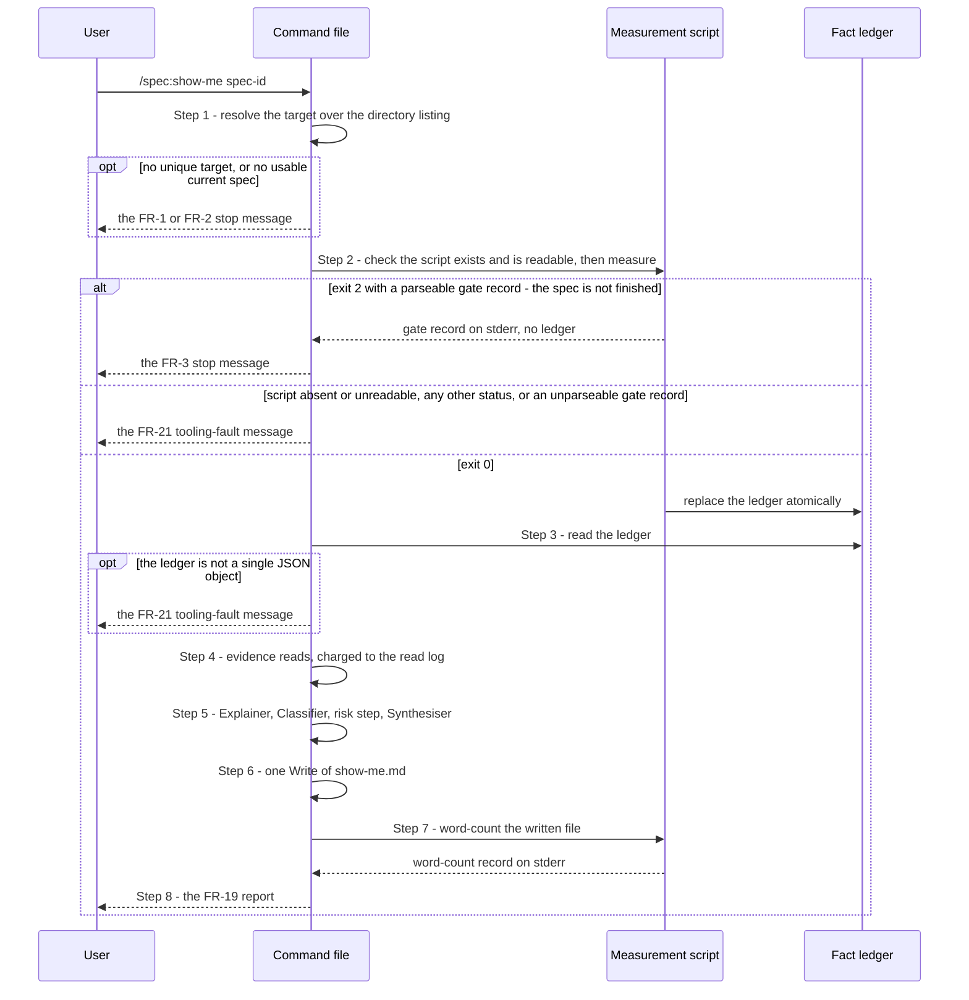
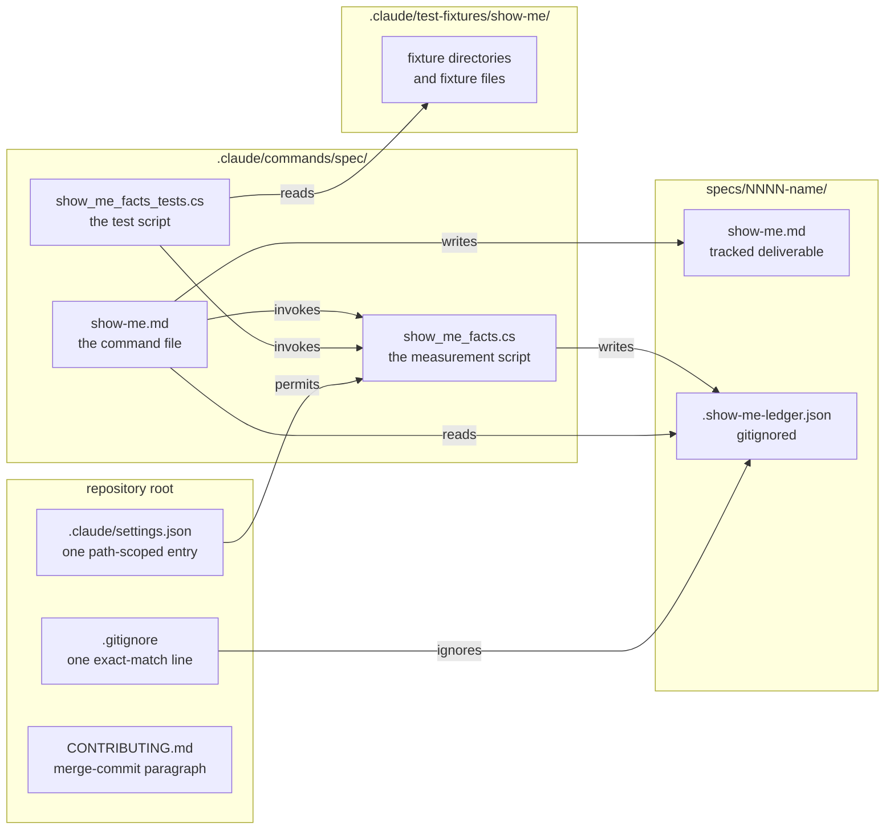

# 0072. The Measurement Seam and Output of `/spec:show-me`

Date: 2026-09-19

## Status

Proposed

## Context

Spec 0037 asks for a slash command, `/spec:show-me [spec-id]`, that runs against a finished spec
and writes one durable file, `specs/NNNN-name/show-me.md`: what the spec changed, and how risky it
looks to merge. Half of that file is counted — files, lines, tasks, ids, commits — and must come out
the same on every run. The other half is judged — a narrative, a breaking-change list, a verdict on
each requirement — and cannot. A prompt that does both in one breath lets the judging do the
counting, and nothing then catches a wrong number.

### Terms

- **Measurer** — the measurement script. Key Components 1 states its contract.
- **Synthesiser** — the stage that assembles the file: it places what the other stages produced —
  the Classifier's items and migrations, the Explainer's block or named line, the risk step's lines —
  word for word, and writes all the other prose. Key Components, *The stages*, states its rule.
- **Classifier** — the stage that judges breaking-change items, requirement statuses and the work
  no requirement covers. Its rule is stated in
  [0073-show-me-advisory-risk-model](0073-show-me-advisory-risk-model.md).
- **Explainer** — the stage that reads source to draw a diagram. Its rule is stated in
  [0077-show-me-visual-explanation](0077-show-me-visual-explanation.md).
- **Fact ledger**, **measured head**, **merge base**, **spec diff**, **charged bytes** —
  `requirements.md` § *Definitions* states each one.
- **Read log** — the command's in-context record of what it read and what each read cost. Key
  Components 3 states it. It is never written to disk and is not the fact ledger.
- **Reserve** — the last 100,000 bytes of the per-run read budget, which only diagram reads may
  spend. Key Components 3 states its size; which reads spend it is
  [0077-show-me-visual-explanation](0077-show-me-visual-explanation.md)'s.
- **Mechanically countable** — a count, sum or threshold outcome computed over the repository's
  artefacts: the diff, `tasks.md`, `requirements.md`, `.adr-list`, `release_notes.md`. The
  script computes every one. A tally of the command's own judgements — how many items it judged
  breaking, how many ids it judged `Shipped` — is not mechanically countable: NFR-1 names those
  tallies as judgement-derived, and the Classifier produces them. Nor is a byte size taken only to
  decide whether a read is affordable: NFR-3 makes that a free size probe, it is never written into
  `show-me.md`, and the command either takes it itself or reads it from the ledger (Key
  Components 3).

### Scope

**Parent requirement**: [specs/0037-show-me/requirements.md](../../specs/0037-show-me/requirements.md)

**In scope**:

- FR-1, FR-2 — target resolution: the whole argument matched by the model over a pre-executed
  directory listing (Key Components 4).
- FR-3 — the completeness gate, evaluated from the script's exit status and gate record, above both
  writes (Key Components 4).
- FR-4, NFR-8 — exactly two writes; the ledger replaced atomically by the script, `show-me.md`
  replaced by one `Write` (Key Components 2 and 5).
- FR-5, FR-9, FR-10, FR-14's path list, FR-15 — the file's header, and the sections built from the
  ledger and the command's reads (Key Components 5).
- FR-6's narrative, FR-7, FR-8 — the section shapes, their read obligations and their mechanical
  parts. The judgement inside FR-7 and FR-8 is the Classifier's (0073).
- FR-10, FR-20 — spec branch, base ref, PR discovery, measured head and merge base, all resolved by
  the script (Key Components 1).
- FR-16 — every row's effect on a section, except the factor levels rows 8, 9 and 12 force (0073)
  and row 12's diagram line (0077).
- FR-17, NFR-5 — tracked paths only, tested before a path is written (Key Components 5).
- FR-18, C-10 — the writes, the single `gh pr list` query, and the one path-scoped allow-list entry
  (Technology Choices).
- FR-19 — the session report, including the word-count result.
- FR-21 — the measurement script: language, invocation, exit statuses, stderr records, ledger cap,
  atomic write, modes, pinned invocation, and the one failure mode (Key Components 1 and 2).
- NFR-1 — the split between mechanical and judged fields, made structural by the seam.
- NFR-2 — the word count, executed by the script's word-count mode.
- NFR-3 — the byte budget, the `wc -c` probe, the reserve's size, the full-diff ban and the
  degradation rule (Key Components 3). Which reads draw on the reserve is 0077's.
- NFR-4 — offline behaviour: the script exits `0` with the PR fields null.
- NFR-6 — the conventions of the three `/spec:show-me` artefacts.
- NFR-7 — traceability for counts and prose. The diagram half is 0077's.
- NFR-9 — the sibling test script, its fixtures, and the `CONTRIBUTING.md` merge-commit paragraph
  (Key Components 6).

**Out of scope**:

- The risk factors, the overall level, the forced levels and the advisory construction —
  [0073-show-me-advisory-risk-model](0073-show-me-advisory-risk-model.md).
- The diagram trigger, drawing, caps, the reserve's spending and the fallback lines —
  [0077-show-me-visual-explanation](0077-show-me-visual-explanation.md).
- The forms the `/spec` family writes (declared ids, task tags, marked release-notes sections) and
  the `/spec:write_release_notes` command —
  [0078-spec-family-machine-readable-forms](0078-spec-family-machine-readable-forms.md). This ADR owns
  only *reading* those forms.
- The four stated patterns. They are stated once, in `requirements.md` § *Definitions*, and
  implemented once, in the script. No ADR in this set transcribes one.

### Where this ADR sits

| ADR | Decides |
| --- | --- |
| **[0072-show-me-command-resolution-and-output](0072-show-me-command-resolution-and-output.md)** *(this one)* | What the command is, how it resolves its target, what it measures and reads, and the shape of the file it writes |
| [0073-show-me-advisory-risk-model](0073-show-me-advisory-risk-model.md) | How the advisory risk level is computed, and how it stays advisory |
| [0077-show-me-visual-explanation](0077-show-me-visual-explanation.md) | When the command draws a diagram, what it may draw, and which stage may read source to draw it |
| [0078-spec-family-machine-readable-forms](0078-spec-family-machine-readable-forms.md) | The forms the `/spec` family writes so that a tool can read them, and the command that writes release notes in one of them |

The sentence that unifies all four: **every value a command states is counted by one tested script,
copied from a named source, or judged from evidence it can name, and no command writes outside what
it owns.**

### Counting in prose that nobody runs

A pattern written into a markdown document is a description of code. Nobody executes it, so no test
reaches it, and it carries the escaping of the prose around it. Patterns and counts embedded in the
prose of a command file produced these results:

| Defect | Returned | Correct | Cause |
| --- | --- | --- | --- |
| Declared-id count | 0 | 28 | The pipe had to be escaped to sit in a markdown table cell, and the escape became part of the pattern |
| NFR-2 word count | 16 | 8 | The count did not exclude fenced blocks |
| FR-13 invariant check | 3 false positives | 0 | `if` matched inside `diff` |
| One stated pattern | 3 variants | 1 | The same pattern was copied into three places and drifted |

Each defect was invisible to a reader and untestable where it sat. In an executable artefact, each
one is an ordinary bug with an ordinary test. The requirements responded with FR-21: one script
does the counting, and each stated pattern is implemented once, in that script.

### The forces

- **Some output must be identical between runs, and the rest cannot be.** NFR-1 lists the
  mechanical fields and names the judged ones.
- **The command must count nothing it could get wrong silently.** FR-21 puts every countable value
  in one script, with its own test (NFR-9).
- **The command must still read evidence.** FR-7 needs the public-API lines of the diff, FR-14 needs
  the diff's paths, and FR-6's diagram needs source. Those are reads, not counts.
- **One run, one diff, one remote query.** FR-20 pins the merge base and measured head once. FR-18
  allows one `gh pr list` query per run and no `gh pr diff`.
- **A stop writes nothing.** FR-3 and NFR-8 require a stopped run to leave the repository
  byte-for-byte unchanged, but the gate reads counts the script produces.
- **The full diff does not fit.** Spec 0036's full diff is 4,081,673 bytes, which is more than the
  context window. NFR-3 budgets reads in bytes.
- **The script's output streams are not its own.** The toolchain writes diagnostics to standard
  output, and children write errors to standard error (FR-21).
- **No interpreter grant.** Every candidate language can run arbitrary commands, so the allow-list
  entry must name the script's own path (FR-18, C-10).
- **Neither spec ids nor ADR numbers are unique.** Three directories are numbered `0002`, one name
  contains spaces, and five ADRs are numbered `0037` (C-1, C-9).
- **The family has a shape.** Every `/spec:*` command is one markdown file with front matter
  (NFR-6).

## Decision

**Let one tested script count everything mechanically countable, let the command read and judge,
and join them by one JSON ledger.**

The script resolves refs, queries the pull request once, counts everything NFR-1 lists, and writes
the ledger atomically. The command reads that ledger, reads the evidence it needs within a byte
budget, judges what NFR-1 names as judged, and writes `show-me.md` in one call. The command may
issue a path-scoped `git diff` over the ledger's two shas, and it may read files. It may never
compute a mechanically countable value. Because the script writes the ledger only after the
completeness gate passes, every stop falls before `show-me.md` is written. Only FR-21's fifth failure
state comes after the ledger is replaced (Key Components 4).

### The mechanism, end to end

The run has four kinds of stop — FR-1, FR-2, FR-3 and FR-21 — and one path to a written file. Four
invariants read off the diagram:

- **A stop leaves the repository unchanged, with one exception.** Step 1's stops happen before the
  script runs. Step 2's stops happen before the ledger exists, because the script writes the ledger
  only after the gate passes. The exception is Step 3's stop, FR-21's fifth failure state: the script
  has already replaced the gitignored ledger when the command finds it unparseable (Key Components
  4).
- **The protocol is small.** Once the target is resolved, two probes before invoking, the exit
  status, the last prefixed line on standard error, and whether the ledger parses decide every
  branch. The command never parses standard output. It reads
  standard error only on `2` and at Step 7, and then only the last line carrying the right prefix.
- **Only the script touches the ledger.** The command reads it once, at Step 3, and never writes it.
- **The word count cannot change the outcome.** Step 7 runs after the one `Write`. Its result is
  reported, and `show-me.md` is not revised.

### Where the pieces live

In a `/spec:show-me` run, every write into the spec directory comes from the command or the
script. The test script reads the fixtures, and its only writes are to remove or restore a ledger
its own runs touched. Nothing is added under `src/` or `tests/`, and none of the three
`.claude/commands/spec/` artefacts is part of the product build.

### Key Components

#### The stages, and the rule each one holds

The command file is one ordered procedure, not a program, so these are stages, not types. Each name
is shorthand for the rule the stage holds.

| Stage | Is | Decided in | The rule it holds |
| --- | --- | --- | --- |
| Measurer | the measurement script | this ADR | Counts every value NFR-1 lists; never paraphrases, never judges |
| Explainer | the model, at Step 5 | [0077-show-me-visual-explanation](0077-show-me-visual-explanation.md) | The only stage that reads source files; draws nothing it has not read |
| Classifier | the model, at Step 5 | [0073-show-me-advisory-risk-model](0073-show-me-advisory-risk-model.md) | Judges each breaking-change item, requirement status and piece of work no requirement covers once, and tallies its own judgements |
| Risk step | the model, at Step 5, inside the command file's risk-step markers | [0073-show-me-advisory-risk-model](0073-show-me-advisory-risk-model.md) | Computes the factor levels and the overall level, names the factors that set it, and writes the factor table, the `**Overall risk: …**` line, the raising sentence as the rationale's first sentence when there is one, and FR-13's sentence; the only step that may test a level |
| Synthesiser | the model, at Step 5 | this ADR | Writes all other prose, including the rest of the risk rationale; every number it writes comes from the ledger or from the Classifier's tallies |

##### The seam runs between counting and reading

A stage on the model's side may read a file, a commit log or a
diff, and every read is charged in bytes. No stage on the model's side may compute a mechanically
countable value (*Terms*), whether or not the ledger carries it. The test for the seam is AC-70:
the command file contains no pipeline that computes such a value.

#### 1. The measurement script

`.claude/commands/spec/show_me_facts.cs`, a C# file-based app, run from the repository root with
`dotnet run`. Its argument grammar is fixed, because the command file, the test script and the
allow-list entry all depend on it:

| Mode | Invocation | Writes | Exit status |
| --- | --- | --- | --- |
| Measuring | `dotnet run .claude/commands/spec/show_me_facts.cs -- {target directory}` | the ledger, beside the target, only on `0` | `0` — gate passed, complete ledger written. `2` — gate not passed, gate record on stderr, no ledger. Other — tooling fault |
| Measuring, with test inputs | the same, followed by `--pinned {merge-base sha} {head sha}`, `--release-notes {path}`, or both, in either order | the ledger, only on `0` | as above; a pinned sha that is not a local commit is a tooling fault |
| Word count | `dotnet run .claude/commands/spec/show_me_facts.cs -- {file} --word-count` | nothing | `0` — counted, word-count record on stderr. Other — not counted |

The `--` straight after the script's path is load-bearing. Without it, `dotnet run` reads options
that follow the path as its own: measured on this repository with SDK 10.0.401,
`dotnet run a.cs --file b.cs` runs `b.cs`. With it, `dotnet run` consumes the `--` and passes every
later token to the script as an argument. That was measured for `--file`, `--project`, `-p:`,
`--launch-profile` and `--no-build`: each reached the script as plain text, and the script's exit
status came back unchanged. The script accepts exactly the arguments in the table above. Any other
argument is a usage error, which exits with a status other than `0` or `2` and writes no ledger.

The command file issues two invocations. The measuring one passes only the target directory, which
is AC-93's rule. The word-count one passes only the written `show-me.md` and `--word-count`, which
FR-21 *Modes* requires. Neither ever passes `--pinned` or `--release-notes`.

What the script measures is FR-21's list, grouped into ref fields, diff fields and file fields. What
each kind of run records in each group is FR-21's *kinds of run* table, which is normative; the
script implements that table and this ADR does not restate it. The rules the script follows:

- **Every stated pattern is implemented once, here.** `requirements.md` states each pattern in POSIX
  extended form. .NET's `Regex` does not support POSIX bracket classes, so each pattern is
  translated. The translation sits next to the POSIX original, quoted verbatim as a comment, and
  NFR-9's fixtures prove it. The public-API figure of 131 over the calibration pair is the proof for
  the pattern that matters most.
- **Diffs are read with a pathspec or a summary flag, never whole.** Net lines come from
  `--numstat`, bucket counts from `--name-only`, and the public-API count from the `src/`-scoped
  diff. NFR-3's full-diff ban binds the script as it binds the command.
- **Children's standard error is captured, not passed through.** `git` and `gh` run as child
  processes with both streams redirected, so a child's message can never carry a record prefix.
  A `gh` query that returns no matching PR is FR-16 row 1. A `gh` that cannot be started — not
  installed, not on `PATH` — or that exits non-zero, or that has not finished after 30 seconds and is
  killed, is row 2. Either way there is no PR, and the script still exits `0` (NFR-4).
- **The script also emits the values NFR-1 derives from its counts**: factor F1's level, whether
  each of D1, D2 and D3 fired, and the number of `.adr-list` entries that resolved, which is the
  value D3 tests. F1's thresholds are FR-11's and the tests are FR-6 (a)'s; both are implemented
  once, here. F1's level and the trigger outcomes are diff fields, so both are null when no spec
  diff was measured, which is when FR-6 (a) says the trigger is not evaluated. F1's level in that
  case is FR-16 row 12's, applied as
  [0073-show-me-advisory-risk-model](0073-show-me-advisory-risk-model.md) decides.
- **The script locates everything the command reads in parts.** For each marked section for the
  target, each declaration's paragraph, each ADR's front matter, `## Status` and `## Consequences`,
  and the whole of `tasks.md`, `requirements.md` and the `src/`-scoped diff, it emits the range and
  the byte size, split into *windows* of whole lines of at most 25,000 bytes each. Within `/spec:show-me`,
  recognition — headings, fences, extent — is therefore implemented once, in the script, and the
  command reads by window without re-recognising anything. A declaration's paragraph runs from its line to the line
  before the next declaration or the next heading of level three or higher (`###`, `##` or `#`),
  whichever comes first, or to the end of the file, so a requirement with its own sub-headings, such
  as FR-6's `##### Visual explanation`, is not cut short. A single line longer than 25,000 bytes
  forms a window of its own, flagged `oversize`.
- **The locating fields are inputs, not statements.** FR-21 says the script owns exactly the NFR-1
  fields "plus the inputs those fields depend on", and that the ledger carries them "at minimum".
  The ranges and sizes are positions and sizes of the inputs the owned fields are counted from, so
  they fall under that clause. `show-me.md` never states one.
- **The script decides nothing a reader could judge.** It emits the marked-section count and `{m}`,
  not a verdict on what the release notes say. It emits the declared-id set, not a status for any id.

The stderr records are one line each: `show-me-gate: ` or `show-me-wordcount: `, then a single-line
JSON object. The gate record carries which of FR-3's three cases applies and, for the unchecked
case, `{n}`, `{total}` and the first three unchecked titles. The word-count record carries the
counted total, the excluded fenced-block line count, and whether the total is inside 400–2,000. The
command reads only the last line with the right prefix.

#### 2. The fact ledger

One JSON object at `{target directory}/.show-me-ledger.json`, serialised with `System.Text.Json` with
indentation on, so that no line of it approaches the window limit. Its
field names are the contract between the script, the command file and the test script, so they are
fixed here. A *window list* is a list of `{first_line, last_line, bytes, oversize}`.

| Field | Group | Holds |
| --- | --- | --- |
| `schema_version` | — | integer, `1` |
| `target`, `pinned` | — | the target directory as given; `true` only on a pinned run |
| `spec_branch` | ref | `{ref, sha}` — the full ref FR-10 resolved and its sha |
| `rules_tried` | ref | FR-10's rules in order, each with its outcome, including `{ref} is already merged into {base ref}` for a skipped candidate |
| `local_divergence` | ref | `{name, sha}` when rule 1 chose a remote-tracking ref and the local branch differs; otherwise null |
| `base` | ref | `{ref, sha}` — `origin/master` or `master` |
| `pr` | ref | `{number, url, head_sha, head_present}` for the chosen open PR |
| `pr_count` | ref | how many open PRs FR-20's query kept — `0` when the query found none (FR-16 row 1), null with `gh unavailable` when the query failed (row 2) |
| `measured_head` | ref | `{sha, source}`, where `source` is `pr_head`, `branch_tip` or `pinned` |
| `merge_base` | ref | sha |
| `buckets` | diff | the six buckets and `total`, each `{files, added, removed}` |
| `src_subdirectory_count` | diff | the number of distinct immediate subdirectories of `src/` |
| `public_api_lines` | diff | changed public API declaration lines |
| `commits` | diff | commits in merge base..measured head |
| `src_diff` | diff | `{command, bytes, windows}` — the exact `git diff` command line the script ran, and its output's size and window list |
| `f1_level` | diff | `Low`, `Medium` or `High` |
| `triggers` | diff | `{d1, d2, d3}`, each `true` or `false`. D3 reads `.adr-list`, but all three are diff fields because FR-6 (a) evaluates the trigger only over a measured diff |
| `tasks` | file | `{total, checked, unchecked, first_unchecked, by_tag, bytes, windows}`, with `by_tag` holding the four tags and `untagged` |
| `requirements` | file | `{present, bytes, windows}` for `requirements.md` |
| `declared_ids`, `declared_total` | file | the distinct ids, in FR-then-NFR order, and their count |
| `declarations` | file | `{id, bytes, windows}` for every declaration line |
| `adr_list` | file | one `{entry, path, reason, matches, extract}` per `.adr-list` entry: `path` null and `reason` `ADR file not found` or `ambiguous ADR number` when it does not resolve, `matches` listing the filenames an ambiguous number matched, and `extract` holding `{part, bytes, windows}` for the ADR's front matter, `## Status` and `## Consequences` |
| `adr_resolved_count` | file | how many `.adr-list` entries resolved to exactly one file |
| `release_notes` | file | `{path, present, count, sections, m}`: whether the file exists, the number of sections marked for the target — `0` when the file is absent — each section's `{bytes, windows}`, and `{m}` |
| `gh_commands` | — | the command line of every `gh` invocation, in order |

A field that is null because its value could not be determined has an entry in a `null_reasons`
object, keyed by field name. The reasons are fixed strings: `not a spec directory`, `pinned`, `spec
branch not determinable`, `no PR found for branch {branch}`, `gh unavailable` and `not present`. Which
fields each run nulls is FR-21's *kinds of run* table, and each nulled field carries that run's
reason: on a fixture run every ref and diff field carries `not a spec directory`; on a pinned run
every ref field except the two pinned shas carries `pinned`; on a spec run whose branch is not
determinable, every ref field except `base` and `rules_tried` — which FR-16 rows 12 and 15 still
need — and every diff field carries `spec branch not
determinable`. `local_divergence` follows the same rule on those runs. When `requirements.md` is
absent, `requirements`' size and windows, `declared_ids`, `declared_total` and `declarations` are
null with the reason `not present`. Otherwise
some fields use null as an ordinary value and carry no reason: `local_divergence`, null when the
spec branch resolved and there is no divergence; `release_notes.m`, null when no marked section
carries a `#### Breaking changes` heading (FR-21's `{m}` rule); and an `.adr-list` entry's `reason`
and `matches`, null when the entry resolved. When `.adr-list` is absent or empty (FR-16 row 6),
`adr_list` is an empty list and `adr_resolved_count` is `0`: a measured zero, not a missing value.
An entry that does not resolve carries its reason inside
its own entry. A value is never `0` or absent in place of null. The distinction between FR-16 rows 1
and 2 is the reason on `pr`. Row 16 is `pr` present with `head_present: false` and
`measured_head.source` of `branch_tip`.

The ledger carries no diff text and no list of changed files. The script checks the serialised size
before writing anything: an object over 65,536 bytes is a tooling fault, exit `1`, and no ledger is
written. Most of the object is window lists, and they grow with the size of the inputs; spec 0036's
is estimated at under 20 KB, which the first run will measure. The window lists narrow the margin
FR-21 describes, from an order of magnitude to a few times, and that is a stated negative.

##### The write is atomic

The script serialises the whole object in memory, writes it to a temporary file named
`.show-me-ledger.json.tmp` in the same directory, and replaces the ledger with
`File.Move(…, overwrite: true)`. A same-directory move is a rename, so a reader sees either the old
ledger or the new one. The temporary file is deleted in a `finally` block. A failure before the move
therefore leaves no ledger where none existed and leaves a previous ledger unchanged (AC-83), and it
leaves no temporary file (FR-4). The fixed name means any run overwrites and then moves a temporary
file a killed run left behind. Concurrent runs on one target are not supported, and this design
makes no guarantee about them.

The ledger is working state. The exact-match `.gitignore` line `.show-me-ledger.json` ignores it at
any depth, so `git status --porcelain` differs after a run only by `show-me.md` (AC-30, AC-74).
Because it is untracked, `show-me.md` never names it, and every value it carries is attributed to
the artefact the script counted it from (FR-17, NFR-7).

#### 3. The command's reads, and the read log

Every read the command makes is charged against NFR-3's budget of 1,048,576 bytes, and recorded in
the read log with its path, how it was read, and the bytes charged.

##### How a read is made

The command's tools limit what one call returns, and the limits decide the mechanism:

| Tool | Limit, measured 2026-09-25 | Consequence |
| --- | --- | --- |
| `Read` | about 25,000 tokens per call; files over 256 KB refused without an offset and limit; lines over 2,000 characters truncated; a line-number prefix added to every line | a whole read of `tasks.md` (229,159 B) is several calls, and a long line silently loses its tail |
| `Bash` | output middle-truncated at 30,000 characters by default | a 303,715-byte diff in one call would reach the model about 90% missing |

So every read of text is a Bash read of one *window*: a run of whole lines, read with
`tail -n +{first} {path} | head -n {count}`, or, for a diff, the same `git diff` piped through `tail`
and `head`. One rule covers every window, whoever planned it:

1. **A planned window** comes from a ledger window list, which holds at most 25,000 bytes of whole
   lines. The ledger plans windows for everything it locates: `tasks.md`, `requirements.md`, each
   declaration's paragraph, each ADR extract, each marked section and the `src/`-scoped diff.
2. **An unplanned window** covers anything the ledger does not locate — the ledger itself,
   `git diff --name-only` output, an Explainer source file, an Explainer `grep`. The command sizes it
   before reading it, by piping the same command into `wc -c`, starting at 200 lines. A window over
   25,000 bytes is halved and sized again, down to a single line. Sizing is a probe and costs
   nothing, so no window is ever read blind.
3. **A single line that cannot be read whole** — an `oversize` window in a ledger list, or a one-line
   unplanned window still over 25,000 bytes — is not read. A value that needed it is `Unverifiable`
   or `not available`, with that reason.
4. **A truncated output** — one carrying the tool's truncation marker, which can happen only if a
   local setting lowered the tool's limit below 25,000 characters — counts as not read, with the
   outcome in rule 3. Its output is charged, because it entered context.

Every window is charged the bytes it brought into context, which is the size it was priced at before
it was issued. The total therefore stays inside the budget as long as the running total is kept
correctly, which is a model-checked target (Consequences): nothing is read whose size the bytes
remaining do not cover.

Reading in windows is how every read is made, not a degradation. A read *in full*, as
`requirements.md` defines it under *Charged bytes*, brings every byte of the file into context in as
many calls as the tools require, which is what a file read by its windows does. Degradation, as NFR-3
uses the word, is reading only part of a file that does not fit the bytes remaining — by targeted
extraction or bounded chunks — and when even that cannot be afforded, the affected value is
`Unverifiable`.

The `src/`-scoped diff's windows are line numbers in the script's own `git diff` output, so the
command must produce the same output. The ledger records the exact command line the script ran, in
`src_diff.command`, and the command runs that line, piped only through `tail` and `head`.

`Read` is used once, and not for evidence: `Write` refuses to replace a file the session has not
read, so when `show-me.md` already exists the command reads it (Key Components 5).

##### What is read, and what it costs

The table is in read order: `specs/.current-spec` at Step 1 when there is no argument, the ledger at
Step 3, then Step 4's reads from the existing `show-me.md` down, then the Explainer's at Step 5. The marked release-notes section comes before `requirements.md`
because FR-7 makes reading it an obligation, and `requirements.md`, whose paragraphs degrade
gracefully, takes what is left. No full-content read of a file is issued before the command has run
`wc -c` on its path. `wc -c` is a
size probe, not a read, and costs nothing (NFR-3, AC-76). A range the ledger locates — a
declaration's paragraph, a section, an ADR extract, the diff — is priced by its `bytes` in the
ledger. For the release-notes read the command also runs `wc -c` on the release-notes file, as FR-7
requires, and prices the read from the sections' sizes. `git diff --name-only` output is sized by
piping the same command into `wc -c`.

| Read | How | Budget |
| --- | --- | --- |
| `specs/.current-spec`, when no argument is given | one unplanned window, at Step 1 (FR-2) | general allowance; negligible |
| The ledger | unplanned windows | general allowance; at most 65,536 B |
| The existing `show-me.md`, when there is one | `Read`, as the first of Step 4's reads; charged its `wc -c` plus Read's line-number prefix; never used as evidence | general allowance |
| `.issue-number`, `.adr-list` | one unplanned window each | general allowance; negligible |
| `tasks.md` | its planned windows, in order, while bytes remain | general allowance |
| The `src/`-scoped diff | its planned windows, in order | general allowance |
| `git diff --name-only` over the same pair | only when the spec diff touches nothing under `src/` (FR-14); unplanned windows | general allowance |
| Each ADR in `.adr-list` | its `extract` windows only | general allowance |
| Marked release-notes section(s) for the target | each section's windows; all sections together or none | general allowance |
| Commit subjects, `git log --format='%h %s' {merge base}..{measured head}` | only when `.adr-list` is missing or empty and a diff was measured, because FR-16 row 6 writes the narrative from the commits then; unplanned windows. With no diff there is no commit range, so the narrative uses `requirements.md` and `tasks.md` alone, and the git history row says why (FR-16 row 12) | general allowance |
| `requirements.md` | all its planned windows if they fit; otherwise each declaration's windows, in declaration order, while bytes remain | general allowance |
| Source files for a diagram | as [0077-show-me-visual-explanation](0077-show-me-visual-explanation.md) decides | whatever the general allowance has left, plus the reserve |

The command never reads `PROMPT.md` or a `PROMPT-*.md` companion. FR-17 permits reading one as
background but does not require it, and leaving it unread keeps it out of the budget and out of
`## Inputs used` without a special case. A `PROMPT.md` that git tracks is an ordinary file, and it is
read only if some other rule names it.

The reserve is the last 100,000 bytes of the budget, and only the Explainer's reads may spend it.
Everything else draws on the remaining 948,576 bytes. On spec 0036 the fixed reads cost 694,377
bytes — the ledger at its cap, `tasks.md` whole, the `src/`-scoped diff and seven ADR extracts —
which leaves 254,199 bytes, less the existing `show-me.md` when there is one, for the release-notes
section, any commit subjects and `requirements.md`. Spec 0036 has neither of the first two, so all
of it goes to `requirements.md`.
At 273,674 bytes it does not fit, so its declaration paragraphs are read in declaration order while
bytes remain. Any paragraph that cannot be afforded is not read, and a status that needed it is
`Unverifiable` with that reason (NFR-3). The reserve is untouched when the Explainer starts (AC-78).

##### Two reads are obligations, not options

When a marked section exists for the target, the command reads it, unless the bytes remaining cannot
cover every marked section; then it reads none and FR-16 row 5a applies. When evidence FR-7 or FR-8
needs cannot be read, the affected status is `Unverifiable` or the affected input `not available`,
with its reason, never zero (NFR-3). FR-3's and FR-9's values come from the ledger, and the command
never extracts them.

##### The full diff is never read

At 4,081,673 bytes it exceeds the context window, so a run that tried it would fail rather than
degrade. Every `git diff` the command issues names the ledger's two shas and either a pathspec or a
summary flag (AC-73, AC-77).

##### The read log

The read log is the evidence for AC-52, AC-63 and AC-76. It lives in the model's context for one
run, and nothing writes it to disk. `## Inputs used` is not a copy of it (Key Components 5).

#### 4. The precondition gate and the four stops

| Stop | Decided at | Evidence | Message |
| --- | --- | --- | --- |
| FR-1 — ambiguous or no match | Step 1 | the pre-executed `ls -1d specs/*/` listing | FR-1's two messages |
| FR-2 — no usable current spec | Step 1 | `specs/.current-spec` and `test -d` | FR-2's message |
| FR-3 — spec not finished | Step 2 | exit `2` and the gate record | FR-3's three messages |
| FR-21 — `absent` | Step 2, before invoking | `test -f` on the script's path fails | FR-21's message, naming the state |
| FR-21 — `unreadable` | Step 2, before invoking | `test -r` on the script's path fails | FR-21's message, naming the state |
| FR-21 — `exited {code}` | Step 2 | any exit status other than `0` or `2` | FR-21's message, naming the state |
| FR-21 — `gate facts were not parseable` | Step 2 | exit `2`, with no last `show-me-gate:` line that parses as one JSON object | FR-21's message, naming the state |
| FR-21 — `ledger was not a single JSON object` | Step 3 | exit `0`, and the ledger does not parse as one JSON object | FR-21's message, naming the state |

The two probes before invoking exist because a missing or unreadable `.cs` file makes `dotnet run`
itself fail, with an exit status the script never chose. Without them, `absent` and `unreadable`
would both read as `exited {code}`, and AC-72's first two cases would fail.

The command resolves the target by matching the **whole** trimmed argument over the listing, in
FR-1's three-rule order, in the model rather than in a shell loop. The listing is a few dozen short
lines, and a shell loop over `specs/*/` splits `specs/0021-Expose Unacceptable Message Window/` into
four words unless every expansion is quoted — the kind of detail that rots. The listing's trailing
slash excludes `specs/README.md` and `specs/.current-spec` by construction (AC-35).

There is no fifth kind of stop. No absent or degraded input stops the run; each FR-16 row sets its
section's defined text and the run continues. A run that exits `0` at Step 2 and parses at Step 3
always writes `show-me.md`, whatever the risk level (FR-13).

In FR-21's fifth failure state the script exits `0` and the ledger does not parse. The script has
already replaced the ledger atomically, so that ledger stays in place. The command stops without
reading it as fact, and the next successful run replaces it (NFR-8's stated exception).

#### 5. The output document

`show-me.md` is assembled in memory in FR-5's order and written with one `Write`, which replaces
the whole file. Whether the file was created or replaced (FR-19) is the `test -f` the command runs
at Step 4; when the file exists, the command also reads it then, because `Write` refuses to replace
a file the session has not read. That read is charged and is never used as evidence. Before any repository path is written into it — a link, a path in `## Where to look
first`, a node in a diagram — the command runs `git ls-files --error-unmatch` on that path, so an
untracked path such as `PROMPT.md` cannot appear (FR-17, NFR-5). Every ADR reference carries the
filename stem and a relative link, never a bare number (C-9).

| Section | From the ledger (copied, never recomputed) | From the command's reads (judged) |
| --- | --- | --- |
| Metadata block (FR-5) | branch ref, measured head, base ref, merge base, PR number and URL | nothing judged; the generation date comes from `date +%F` and the issue from `.issue-number` |
| `## What changed and why` (FR-6) | `.adr-list` resolution | the 150–600-word narrative; each ADR's title and Status from its extract. The diagram or fallback line is 0077's |
| `## Breaking changes` (FR-7) | marked-section count and `{m}` | the item list, classifications, migrations and the count `{n}`, from the Classifier; the disagreement line when `{m}` is not null and differs from `{n}` |
| `## Did it ship what it said?` (FR-8) | the declared-id set and `{total}` | each id's status, the tallies `{k}` and Part 4's terms, and Part 3's list of work no requirement covers, all from the Classifier; the Synthesiser writes Part 1's id list from those statuses by FR-8's collapse rules |
| `## How it was built` (FR-9) | task total, per-tag counts, commit count — or FR-9's fallback line when the diff fields are null | nothing |
| `## Blast radius` (FR-10) | everything, including the provenance lines | nothing |
| `## Risk assessment (advisory)` (FR-11–FR-13) | F1's `src/` count and F1's level | see [0073-show-me-advisory-risk-model](0073-show-me-advisory-risk-model.md) |
| `## Where to look first` (FR-14) | — | 3–7 paths, each with a reason of at most 25 words: the paths the Explainer handed over with a diagram for this section, or, when there is none, paths chosen from the diff reads. The diagram is 0077's |
| `## Inputs used` (FR-15) | resolution of `.adr-list` entries, PR presence and its reason | FR-15's rows, with each mark set from the read log (below) |

`## How it was built` states two things and nothing else: task shape and commit count. It carries
no review history and no CI state, and no `## Inputs used` row names either (FR-9, AC-17, AC-62).

`## Inputs used` is FR-15's fixed set of rows — `requirements.md`, `tasks.md`, `.adr-list` and one
row per ADR it names, `.issue-number`, the `release_notes.md` section, git history and the pull
request — plus one row per source file the Explainer read. Each row is marked `used`,
`used (targeted extraction)` for an Explainer source read by extraction, or `not available:
{reason}`. A file read by its windows, whole or in part, is `used`: `requirements.md` read by
declaration paragraphs is still `used`, and any status that lost its paragraph says so itself as
`Unverifiable`. The git history row is `used` when a spec diff was measured, because the diff reads
and the ledger's commit count come from it, and `not available: spec branch not determinable` when
none was (FR-16 row 12). Three reads never produce a row, because none is an input: the ledger and the
measurement script, which are part of the command (FR-15, AC-75); `specs/.current-spec`, which only
chooses the target; and the existing `show-me.md`. `PROMPT.md` and its companions are not read and get
no row, even when absent (FR-16 row 11).

#### 6. The test script and its fixtures

`.claude/commands/spec/show_me_facts_tests.cs`, a second C# file-based app, run by a person or a task
as `dotnet run .claude/commands/spec/show_me_facts_tests.cs` from the repository root. It invokes
the measurement script as a child process for each row of NFR-9's table, asserts on the exit status,
the ledger's fields and the stderr record, prints each failed assertion, and exits non-zero if any
fails. It uses no test framework and touches nothing under `src/` or `tests/`. Like the
measurement script, it is committed at mode `100644` and carries no first-line marker.

- **Fixtures** live under `.claude/test-fixtures/show-me/`. That keeps fixture `.md` files out of
  `.claude/commands/`, where each would register as a slash command, and out of `specs/`, where each
  would appear in `/spec:status`.
- **Ledgers are restored.** Before each run, the test script saves any ledger already in the target
  directory. Afterwards it deletes a ledger its run created, and restores a saved one byte-for-byte.
- **Residue is checked.** After all runs, the test script asserts that no temporary file remains in
  any fixture directory (AC-83).
- **Arguments are checked.** One row runs `… show_me_facts.cs -- specs/x --file {probe}.cs` and
  asserts a tooling-fault exit, no ledger, and that the probe did not run. The probe is a fixture
  `.cs` file under `.claude/test-fixtures/show-me/` that exits with a status no other row uses. It
  is test data, not a delivered program: nothing but this row runs it, so FR-21's one executable
  artefact is still the measurement script. That
  row also proves the `--` still separates `dotnet run`'s options from the script's arguments on the
  SDK in use.
- **The FR-13 invariant check** runs over `.claude/commands/spec/show-me.md`. What it asserts —
  and the literal line held in the test script that proves it does not match inside a word (AC-81)
  — is 0073's to define.

The calibration row is pinned to `6145913a0` and `91d549be6`, so it survives PR #4282's merge as
long as both commits stay reachable. `CONTRIBUTING.md` gains one paragraph asking that pull
requests are merged with a merge commit, and says why: tooling pins commit shas from a merged
branch's history, and only a merge commit keeps them reachable (AC-94).

#### Where each artefact is touched

| Path | Change |
| --- | --- |
| `.claude/commands/spec/show-me.md` | Rewritten: gate, reads, stages and write, with no counting pipeline |
| `.claude/commands/spec/show_me_facts.cs` | New: the measurement script |
| `.claude/commands/spec/show_me_facts_tests.cs` | New: the test script |
| `.claude/test-fixtures/show-me/` | New: NFR-9's fixture directories and files |
| `.claude/commands/spec/README.md` | `/spec:show-me` catalogued, and both scripts documented |
| `.claude/settings.json` | One entry: `Bash(dotnet run .claude/commands/spec/show_me_facts.cs -- specs/:*)` |
| `.gitignore` | One line: `.show-me-ledger.json` |
| `CONTRIBUTING.md` | One paragraph: merge commits, and why |

Deliberately unchanged: every file under `src/` and `tests/`, the CI workflows, the `gh` entries and
the `deny` list in `.claude/settings.json`, and `release_notes.md`. The amendments to
`/spec:requirements`, `/spec:tasks`, `/spec:design` and `/spec:review` belong to
`0078-spec-family-machine-readable-forms`.

### Technology Choices

#### Why the script is a C# file-based app

- **Every contributor has the toolchain.** Brighter cannot be built without the .NET SDK. CI installs
  the 10.0 SDK, and no `global.json` pins a lower one, so file-based apps add nothing to anyone's
  machine. Python is not comparable: the repository has no `.py` files, and it ships both `.sh` and
  `.ps1` scripts because `CONTRIBUTING.md` documents Linux, macOS and Windows paths.
- **It has a real JSON serialiser.** The defect class this seam removes is hand-made escaping.
  `System.Text.Json` escapes quotes, backslashes and non-ASCII text without being asked.
- **It needs no build step.** `dotnet run {file}.cs` needs no project, restore or build command. It
  costs about 7.8 s on the first run, 1.3 s after an edit and 0.2 s warm, measured on this
  repository. The root `Directory.Build.props` does not disturb it.
- **It is committed at mode `100644`.** `dotnet run` reads the file, as `awk -f` reads
  `generate_adr_index.awk`, so the file is not executed by path. A C# file-based app needs no
  first-line marker when it is run through `dotnet run`, so it carries none (NFR-6, AC-53).

#### Why the payload travels in a file

Measured on this repository: when a file-based app is recompiled, `dotnet run` writes the compiler's
warnings to standard output, ahead of the program's own output. A warm run is clean. A contract on
standard output would therefore pass every test and fail on a fresh clone, in CI, or after an edit.
The ledger is a file the script writes itself, so no toolchain can interleave with it.

The two payloads that must reach the command without a ledger — the gate facts and the word count —
are small and travel on standard error. Standard error is not clean either, so each is one line with
its own prefix, and the command reads only the last line carrying that prefix.

#### Why the one allow-list entry names the script

`Bash(dotnet run:*)` would let the command compile and run any C# file, which would make the `deny`
list's `curl`, `wget` and `ssh` entries bypassable. The entry is therefore
`Bash(dotnet run .claude/commands/spec/show_me_facts.cs -- specs/:*)`, and each part of it closes one
way round it:

- **The script's path** names the one program. Removing the script leaves the entry permitting
  nothing, and a second C# file in the same directory is not named (AC-82).
- **The `--`** stops `dotnet run` reading any later token as its own option. Without it,
  `… show_me_facts.cs --file {other}.cs` would run the other file (Key Components 1).
- **The `specs/`** after the `--` means the entry matches only a command whose first argument after
  the separator starts with `specs/`. The entry therefore stays closed even if the permission
  matcher treats `:*` as a plain string prefix with no word boundary: `… show_me_facts.cs --file`
  does not start with `… show_me_facts.cs -- specs/`.

The command's two invocations both fit it: the measuring one passes `specs/{dir}`, and the
word-count one passes `specs/{dir}/show-me.md`. A directory name with spaces is quoted after the
prefix — `-- specs/"0021-Expose Unacceptable Message Window"` — so the command text still starts with
`-- specs/` and the shell still passes one argument. The test script passes fixture paths outside
`specs/`, but a person runs it, not the command, so it needs no entry. The command's own `git` reads,
its `wc -c` probes and its `tail` and `head` windows are covered by existing entries. The script's
`git` and `gh` children need no entry.

The command file's `allowed-tools` lists what the command itself runs: `ls`, `cat`, `date`, `head`,
`tail`, `test`, `wc`, `grep`, `git diff`, `git log`, `git ls-files`, the script entry above, `Read`
and `Write`. `git log` reads the commit subjects FR-16 row 6 needs; it computes nothing.
`grep`, sized first like any unplanned window, is for the Explainer's literal searches for member
names
([0077-show-me-visual-explanation](0077-show-me-visual-explanation.md)). It lists no `gh` verb, no
`git merge-base` and no interpreter (AC-30).

#### Why the command reads diffs itself

The alternative was a script that extracts the evidence — the `src/`-scoped diff, the ADR extracts —
into files for the command to read. FR-4 forbids diff text in the ledger, and a second file would
break FR-4's two-write rule. More basically, reading is not where the defects were. The four defects
above were all counts. A read of a pinned diff returns the same bytes every time; a count written in
prose does not reliably return the same number. The seam therefore runs between counting and
reading, and the command reads under the byte budget.

#### Why there is no sub-agent

`/spec:status` and `/spec:gear` run in the main agent, and so does this one. A sub-agent starts with a clean context, so it would either receive every extract in its
prompt or read the inputs a second time, which would double the budget. FR-19's report must come
from the main agent anyway.

#### Why the test script is also C#

It inherits every reason the measurement script has, and one more: it parses the ledger as JSON and
asserts on fields, which C# does with the same serialiser the script writes with. A shell test script
would need a `.ps1` twin for Windows, and would compare JSON as text.

### Implementation Approach

Numbered in commit order. Each behavioural step on the script is test-first: the test script's row
comes before the script code that satisfies it. Three steps are verified another way, and say so.

1. **Structural.** Add the `.gitignore` line and the `.claude/settings.json` entry.
2. **Structural.** Create the fixture tree under `.claude/test-fixtures/show-me/` from NFR-9's table.
3. **Behavioural.** The test script's harness: invoke the script, parse the ledger, save and restore
   any pre-existing ledger, report failures, set the exit code.
4. **Behavioural.** Script file fields: task checkboxes and tags, declared ids and their
   `declarations` windows, `.adr-list` resolution with each entry's `extract`, `adr_resolved_count`,
   the argument grammar, and the gate and exit `2` with its record. Fixtures: *declared*, *zero-id*,
   *no-tasks*, *unfinished*. The *declared* fixture's rows also assert each declaration's windows,
   and `adr_resolved_count` of `2`; the calibration row asserts `7`.
5. **Behavioural.** Marked-section recognition and `{m}`, reading the form
   [0078-spec-family-machine-readable-forms](0078-spec-family-machine-readable-forms.md) defines.
   Fixture: the release-notes file, whose marked
   section's count, first line, last line and byte size are asserted as well as `{m}`.
6. **Behavioural.** Pinned diff fields: buckets, net lines, `src_subdirectory_count`, public-API lines,
   commit count, `src_diff` with its windows, `f1_level` and `triggers`. Rows: the calibration spec, where F1
   is `High` and D1, D2 and D3 fire, and the pinned *declared* fixture. Further pinned rows test the
   thresholds at their boundaries, each pinned to a pair of commits from `master`'s own history,
   chosen when the row is built:

   | Row | The pair's diff | Asserted |
   | --- | --- | --- |
   | F1 at 10 and 11 | 10, then 11, files under `src/` | `f1_level` `Low`, then `Medium` |
   | F1 at 50 and 51 | 50, then 51, files under `src/` | `f1_level` `Medium`, then `High` |
   | D1, too few files | 4 files under `src/`, across 2 or more subdirectories | `triggers.d1` `false` |
   | D1, too few subdirectories | 5 or more files under `src/`, in 1 subdirectory | `triggers.d1` `false` |
   | D1 at both thresholds | 5 files under `src/`, across 2 subdirectories | `triggers.d1` `true` |
   | D2 at 9 and 10 | 9, then 10, changed public API declaration lines | `triggers.d2` `false`, then `true` |

   That is nine rows. `master`'s history is never rewritten, so these pairs stay reachable.
7. **Behavioural, verified by the command-level criteria.** Unpinned ref fields: spec branch, base
   ref, PR discovery, measured head, merge base, the `gh` record, and FR-10's divergence and
   merged-candidate lines. Fixture runs null every ref field by design (FR-21), so the test script
   cannot assert these values; the step is verified against AC-18, AC-46, AC-47, AC-84 and AC-85,
   with the stand-in `gh` AC-84 describes. The kinds-of-run nulls are test-script rows.
8. **Behavioural, partly by inspection.** The atomic write and the over-cap refusal are verified by
   inspecting the write path (AC-83), because provoking either needs a fault hook or an outsized
   fixture. The residue check is a test-script row.
9. **Behavioural.** Word-count mode. Fixtures: the two word-count files.
10. **Behavioural, verified by the command-level criteria.** The command file: the pre-executed
    directory listing; Step 1's resolution; Step 2's exit-status
    handling, the two pre-invocation probes and the four stop messages; Step 3's ledger read; Step
    4's reads and read log; Step 5's stages in the order *Explainer, Classifier, risk step,
    Synthesiser*, with the risk step between the markers that
    [0073-show-me-advisory-risk-model](0073-show-me-advisory-risk-model.md)'s Implementation
    Approach orders; Step 6's tracked-path check and one `Write`; Step 7's word count; Step 8's
    report. Apart from the FR-13 check, which the test script runs, this step is verified by running
    the command against the criteria each part names.
11. **Structural.** The README catalogue entries and the `CONTRIBUTING.md` paragraph.

## Consequences

### Positive

- **The mechanical fields are deterministic by construction.** One program produces them, and a
  program run twice on the same inputs gives the same answer. NFR-1 becomes testable, and NFR-9
  tests it on real fixtures, including the two defects that motivated the split.
- **A stop writes nothing, by step order.** The script writes the ledger only after the gate passes,
  and the command writes `show-me.md` only after that. AC-7 and AC-71 follow from the order. The one
  exception is FR-21's fifth failure state, whose ledger is gitignored.
- **The protocol is small.** Once the target is resolved, two probes, the exit status, one prefixed
  line and one ledger parse decide every branch. Standard output is never parsed, so toolchain noise cannot change a run's outcome.
- **Every diff in a run describes the same change.** The ledger pins two shas once, and every read
  names them. Two sets of numbers cannot appear in one `show-me.md` (FR-20).
- **The budget is met by arithmetic.** Every read is priced before it is issued, so a run that keeps
  its running total correctly cannot exceed 1,048,576 bytes, and spec 0036's fixed reads leave the
  reserve untouched.
- **`## Inputs used` is a projection.** It is built from the ledger and the read log, so an input
  that was used has a row, and a claim with no source has nowhere to come from (NFR-7).
- **The command's tool surface is small.** No `gh` verb and no interpreter appear in its front
  matter; the one new allow-list entry permits one program.

### Negative

- **The ledger's cap has less headroom than FR-21 intended.** The window lists grow with the inputs,
  so the object is larger than the low-single-digit-KB FR-21 expected. A spec with inputs several
  times larger than spec 0036's could reach the 65,536-byte cap, and the run would stop as a tooling
  fault.
- **Two checks rest on the model.** The budget's running total is kept by the model, summing more
  than fifty window sizes, and whether the ledger parses as one JSON object is judged by the model
  over its windows. This ADR's defect table shows the model can miscount. Neither has a mechanical
  backstop; both are model-checked targets, as 0077's diagram caps are.
- **The .NET 10 SDK becomes a hard requirement** for anyone running `/spec:show-me`, and the first
  run after an edit pays a compile of several seconds.
- **FR-18's confinement moved into code.** The `gh` call is in the script, so the front matter no
  longer shows it. AC-30 is checked against the ledger's `gh` record and the script's source.
- **The ledger is a second written file.** It is kept out of `git status` by one `.gitignore` line,
  and a reader of `show-me.md` cannot follow a number to it — only to the artefact the script
  counted it from.
- **The judged sections are not reproducible, and the level can move with them.** FR-7's items and
  FR-8's statuses may differ between runs, and they feed F2 and F5. NFR-1 says so, and so does this
  ADR.
- **The byte budget can still bind.** A spec whose `requirements.md`, `tasks.md` and diff are all
  larger than spec 0036's pushes more reads into extraction. The degradation is designed, but it is
  still context the synthesis does not get.
- **Format drift is not detected by this command.** A `tasks.md` or `requirements.md` in a form the
  patterns do not recognise yields `untagged` tasks or FR-16 row 9. The forms are prescribed and
  reviewed by `0078-spec-family-machine-readable-forms`, not policed here.
- **Two new artefacts to maintain**, in a family that had one executable file.

### Risks and Mitigations

- **Risk: a stage on the model's side computes a mechanically countable value** — estimating a file
  count, or counting declaration lines in the diff it read.
  *Mitigation*: the command file names the ledger field for every counted value it writes. AC-70
  checks that the command file contains no counting pipeline, and AC-32 compares two runs'
  mechanical fields.
- **Risk: a killed script leaves its temporary file behind.** The `finally` block does not run when
  the process is killed, and the temporary file's name is not covered by the exact-match
  `.gitignore` line, which FR-4 fixes as the one line added.
  *Mitigation*: the name is fixed, so the next run on that target overwrites the file and moves it
  away. Until then it shows in `git status`. The residue check in NFR-9's test catches a leak in any
  path the script can exit by.
- **Risk: a later SDK changes how `dotnet run` parses its arguments**, so that some option after the
  `--` separator is read by `dotnet run` again, and the allow-list entry widens.
  *Mitigation*: the `specs/` suffix constrains only the first token after `--`, so it does not close
  this gap on its own. The test script closes it: one row runs
  `… show_me_facts.cs -- specs/x --file {probe}.cs`, where `{probe}.cs` is a fixture program that
  exits with a status no other row uses, and asserts that the probe did not run. An SDK that
  re-parses options after `--` fails that row on the first test run after the upgrade.
- **Risk: a compiler warning or a `gh` error carries a record prefix.**
  *Mitigation*: the script captures its children's standard error, and the prefixes are
  `show-me-`-qualified strings that no toolchain emits. The command reads only the last prefixed
  line.
- **Risk: the argument is split on whitespace by a later edit.**
  *Mitigation*: FR-1 states the whole-argument rule, AC-35 tests it with the unquoted four-word
  name, and Key Components 4 records why the match runs over a line list.
- **Risk: the calibration commits become unreachable** if PR #4282 is squashed or rebased.
  *Mitigation*: the `CONTRIBUTING.md` paragraph (AC-94). Enforcing the merge method in GitHub's
  settings is out of scope, so this stays a risk.

## Alternatives Considered

### Alternative 1: Keep measuring in shell pipelines written into the command file

Do the counting in `git`, `gh`, `grep` and `awk` pipelines quoted in the command file's prose, and
let the model run them as written.

**Rejected because the reproducibility is illusory.** A pipeline that runs is deterministic. A
pipeline transcribed into markdown is a description that no one executes and no test reaches, and it
carries the markdown's escaping. The four defects in *Counting in prose that nobody runs* are that
failure, observed. A script is not new to this family either: `.claude/commands/adr/generate_adr_index.awk`
is an executable artefact in it already.

### Alternative 2: Replace the judged sections with mechanical proxies

Maximise determinism by deriving breaking changes from declaration lines, requirement status from
commit messages, and the narrative from `git log --oneline`.

**Partially accepted, and rejected for the rest.** It is accepted wherever a mechanical answer is the
right answer, which is why `## Blast radius` and `## How it was built` have no judged content, and
why FR-8's id set is mechanical. It is rejected for the judged sections:

- A declaration-line diff cannot tell an added overload from a breaking signature change, and cannot
  see a behavioural break. `MapperLifetime.Scoped` no longer caching for the life of the process
  changes no declaration line.
- An id in a commit message is not evidence that a requirement shipped.
- FR-6 asks for prose a contributor can read without the ADRs. A commit log is the artefact this
  command exists to replace.

### Alternative 3: A program that owns the whole command

A thin prompt that runs a program which generates the markdown, with the model filling narrative
slots.

**Rejected because the narrative slots are most of the point.** FR-6's narrative, FR-7's migrations,
FR-12's rationale and FR-14's reasons are what a reader reads. Templating around them splits their
provenance across two artefacts. FR-16's degradation rows would also become a program's error paths,
away from the step that discovers each absence.

### Alternative 4: Delegate synthesis to a sub-agent

Measure and read in the main agent, then hand everything to a sub-agent that returns the eight
sections.

**Rejected.** A sub-agent with no file-editing tool is safer, which is the family's reason to
delegate, but this command is read-only apart from one `Write`. A clean-context sub-agent must either
receive every extract in its prompt or spend the budget twice, and FR-19's report must come from the
main agent regardless.
[0077-show-me-visual-explanation](0077-show-me-visual-explanation.md) reaches the same conclusion for
the Explainer, for a reason of its own.

### Alternative 5: Write the measurement script in awk, Python or shell

- **awk** is the family's one precedent and needs nothing installed. **Rejected because it has no
  JSON support.** Hand-writing the escaping of quotes, backslashes and non-ASCII text rebuilds the
  hazard this seam removes. `"cmd" | getline` also hides a child's exit status, and the script must
  tell "`gh` found nothing" from "`gh` failed".
- **Python** fits best technically: a probe emitted valid JSON on a clean standard output and ran in
  0.05 s. **Rejected on portability within this repository.** Python 3 is not present by default on
  Windows, so it would add a prerequisite or need a second script, and FR-21 allows one. CI would
  not catch the gap, because every job runs on `ubuntu-latest`.
- **A POSIX shell script** needs nothing installed. **Rejected for the JSON reason, more acutely**, and
  because it would need a `.ps1` twin.

### Alternative 6: Pre-extract the evidence in the script

Let the script write the `src/`-scoped diff and the ADR extracts to files, so the command runs no
shell command after the ledger is read.

**Rejected.** FR-4 allows two written files and forbids diff text in the ledger, so the extracts
would need a third file that FR-4 does not allow. The rule it would protect — no shell call during
synthesis — guards against the wrong failure: the observed defects were counts, not reads. A
path-scoped `git diff` over two pinned shas returns the same bytes on every run.

### Alternative 7: Read `tasks.md` and the full diff and let the model count

**Rejected.** Spec 0036's full diff is 4,081,673 bytes, about 1.6 M tokens, which exceeds the
context window, so the run would fail rather than degrade. `tasks.md` is read whole, because at
229,159 bytes it fits the budget. What stays rejected is letting the model count, which would
collapse NFR-1's split.

## References

- Requirements: [specs/0037-show-me/requirements.md](../../specs/0037-show-me/requirements.md)
- Related ADRs:
  - [0073-show-me-advisory-risk-model](0073-show-me-advisory-risk-model.md) — the risk level, its
    factors and its advisory construction. It reads F1's input from the ledger and F2's and F5's
    from the Classifier.
  - [0077-show-me-visual-explanation](0077-show-me-visual-explanation.md) — the diagram trigger, the
    Explainer and the reserve's spending. It reads its trigger values from the ledger.
  - [0078-spec-family-machine-readable-forms](0078-spec-family-machine-readable-forms.md) — the forms
    the script's patterns recognise, and the command that writes marked release-notes sections.
  - [0071-tdd-review-gear](0071-tdd-review-gear.md) — the other ADR that decides a `/spec:*`
    command's own behaviour rather than Brighter's runtime.
- Conventions and prior art in this repository:
  - [`.claude/commands/spec/status.md`](../../.claude/commands/spec/status.md) — a command that runs
    in the main agent, with no sub-agent.
  - [`.claude/commands/spec/switch.md`](../../.claude/commands/spec/switch.md) — the pre-executed `!`
    shell block and whole-`$ARGUMENTS` handling.
  - [`.claude/commands/spec/README.md`](../../.claude/commands/spec/README.md) — the command
    catalogue and the sub-agent policy.
  - [`.claude/commands/adr/generate_adr_index.awk`](../../.claude/commands/adr/generate_adr_index.awk)
    — the family's first executable artefact, committed at mode `100644`.
  - [`.claude/settings.json`](../../.claude/settings.json) — the allow-list this ADR adds one entry to.
  - [`.agent_instructions/adr_frontmatter.md`](../../.agent_instructions/adr_frontmatter.md) — "the
    number is a non-unique ordering hint; identity is the filename stem".
- External references: PR [#4282](https://github.com/BrighterCommand/Brighter/pull/4282) — spec 0036's
  pull request, the calibration case. Its figures (517 files, 76 under `src/`, 131 public-API lines,
  the byte sizes) are `requirements.md`'s, measured over `6145913a0..91d549be6`.
