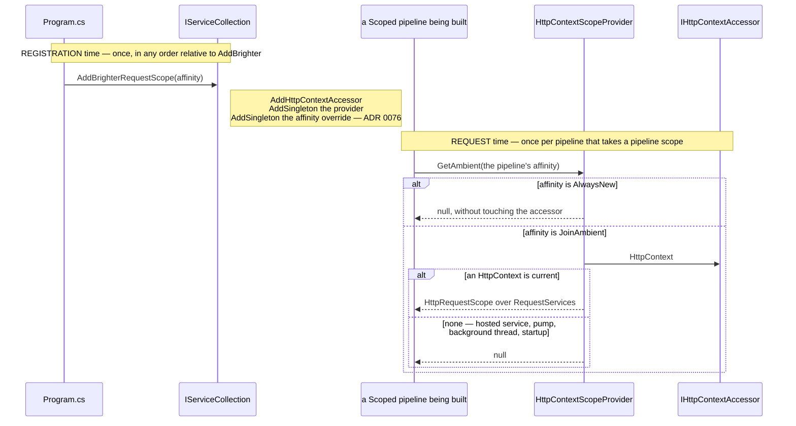
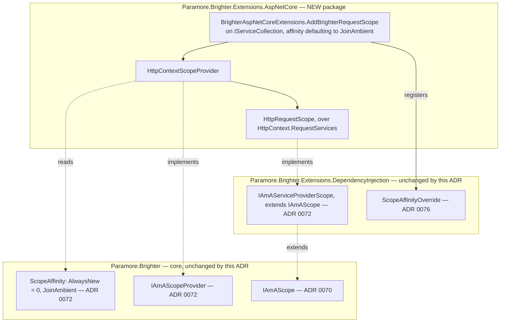

# 73. ASP.NET Core's request scope as Brighter's ambient scope — a package of its own, and one line to opt in

Date: 2026-08-02

## Status

Proposed

## Context

ADR 0072 built the seam. A pipeline that takes a pipeline scope asks an `IAmAScopeProvider` exactly once, carrying a `ScopeAffinity`, and either borrows the ambient the provider offers or creates and owns a scope as it does today. ADR 0076 supplies the affinity: a `DefaultScopeAffinity` property on `IBrighterOptions`, and the override that carries an opt-in gesture's argument onto the object every one of the four registration paths produces.

Neither of them offers an ambient. **Nothing in the repository implements `IAmAScopeProvider`**, so the seam exists with no source to consult and the affinity has nothing to be affine to. The framework where FR-16's case actually lives — a controller action whose Brighter handler, whose Darker query handler and whose own code should all resolve the same `DbContext` — is ASP.NET Core, and ASP.NET Core already owns exactly the DI scope that case wants: the per-request scope behind `HttpContext.RequestServices`.

**Parent Requirement**: [specs/0036-scoped-lifetime-per-pipeline/requirements.md](../../specs/0036-scoped-lifetime-per-pipeline/requirements.md)

**Scope**: This ADR decides **how an ASP.NET Core application offers its request scope to Brighter** — the package that holds the ambient source, its name, the single registration extension that is the whole of the opt-in gesture, that extension's name and signature, and the package's target frameworks and SDK. It discharges FR-15, and serves FR-10, FR-12, FR-16, FR-17, FR-18, FR-23, FR-25.11, NFR-2 and NFR-7.

It does **not** decide the opt-in property, the override that carries this extension's argument, or how either reaches the four registration paths — that is ADR 0076, and this extension is one of its two callers. It does not decide how a pipeline discovers or adopts an ambient (ADR 0072), the transform pipeline's DI scope (ADR 0070) or the handler convergence (ADR 0071). It does not decide where FR-22's validation rules are evaluated (ADR 0074), and it adds no validation rule of its own. It changes no lifetime, and it adds nothing to `Paramore.Brighter` or to `Paramore.Brighter.Extensions.DependencyInjection`.

This ADR **supersedes no prior ADR.** It is the application-facing end of the 0070–0072 sequence.

### Where this ADR sits

Seven ADRs deliver the parent requirement, one decision each. This is the fourth, and the only one an application author has to touch anything to use.

| ADR | Decides |
| --- | --- |
| 0070 | a transform pipeline takes one DI scope, carried **as a parameter** |
| 0071 | handler pipelines converge onto the **same handle**, carried on the object they already pass |
| 0072 | how a pipeline discovers an **ambient** DI scope the host owns |
| **0073** *(this one)* | the **ASP.NET Core package**, and the one line an application writes to opt in |
| 0074 | **where** the six scope-configuration rules are evaluated |
| 0075 | how a `Publish` subscriber **suppresses** adoption, for itself and everything nested beneath it |
| 0076 | the **affinity option**, and how one setting reaches all four registration paths in any order |

The rule the first two state is **the per-pipeline object carries the DI scope**. This ADR does not touch that object: it decides only where the scope a pipeline may carry comes from, when the host is an ASP.NET Core application.

ADR 0067's `Terms` block defines the two axes used throughout — Brighter's *configured lifetime*, which governs the artefact, and the container's *registration lifetime*, which governs the dependencies — and keeps `IServiceScope`, `ServiceProviderLifetimeScope` and `IAmALifetime` distinct. This ADR does not restate it. Per NFR-8, "lifetime scope" is not used for anything introduced here.

### What the application has to write, and what it must not have to

The whole of the opt-in, from an application's side, is one line in `Program.cs`. Everything in this ADR is a constraint on what that line may be and where it may live.

- **It must be reachable before the Brighter registration as well as after it.** AC-48 says so in as many words: *"the same holds with the extension call placed before `AddBrighter` as well as after it — the rule is not an ordering rule (C-10)."* That decides the receiver type on its own; it also means the extension cannot be the thing that writes the affinity onto the options object, which is the problem ADR 0076 exists to solve.
- **It must be one gesture, not two.** Registering the ambient source **is** the opt-in (D1). There is no middleware to add, no per-request call site, and nothing for a controller or a handler to remember to do.
- **Taking the package reference must change nothing.** FR-15 and AC-14: with the extension not called, an `IHttpContextAccessor` spy records **zero** accesses. No module initializer, no assembly scanning hook, no auto-registration.
- **No `HttpContext` is the ordinary case, not an error** (FR-18). A hosted service, a consumer pump, a background thread, startup. The provider returns nothing and the pipeline creates its own scope, exactly as if the application had never opted in.
- **The dependency direction is fixed** (D1, NFR-2). The ASP.NET package depends on the DI package; the DI package must gain no ASP.NET dependency, because it lands on every consumer host, every console producer and every worker service in the ecosystem.

### The forces

- **D1 / NFR-2 — a separate package, backed by `IHttpContextAccessor`.** No middleware, no ASP.NET dependency in the DI package, and registering the provider is the opt-in.
- **D13 — the extension takes the affinity as an explicit argument**, defaulting to `JoinAmbient`. Opting out means passing `AlwaysNew`, or not calling the extension. What that argument then *does* is ADR 0076's.
- **D16 / FR-10 — the ask is made even under `AlwaysNew`**, so that the decision is observable, and the provider must neither consult nor adopt on such an ask.
- **D17 — `IAmAScope? GetAmbient(ScopeAffinity affinity)`** is the contract, fixed and not open: one argument, the asking pipeline's affinity; one return, an ambient or nothing.
- **FR-23 / C-7 — the provider does not probe and does not own.** A stale or disposed `RequestServices` is ADR 0072's usability probe to catch; disposal of the ambient is ASP.NET's, never Brighter's.
- **From ADR 0072, fixed**: the ambient must implement `IAmAServiceProviderScope` for a Microsoft-container-backed factory to resolve from it, and `IAmAScopeProvider` is registered with plain `AddSingleton`, never `TryAddSingleton`, so every duplicate descriptor stays visible to validation (FR-24.3) while MS DI resolves the last.
- **From ADR 0076, fixed**: the affinity this extension is passed travels as a `ScopeAffinityOverride` in the service collection, and is applied to the options object from inside the factory that produces it. This extension registers the value and knows nothing else about it.

## Decision

**ASP.NET Core's per-request DI scope is offered to Brighter by a package of its own, whose entire public surface is one `IServiceCollection` extension: calling it registers the ambient source and selects the affinity, and not calling it leaves Brighter exactly as it is today.**

The shape that takes is one new package, `Paramore.Brighter.Extensions.AspNetCore`, holding three small types — the extension class, an `IAmAScopeProvider` over `IHttpContextAccessor`, and an `IAmAServiceProviderScope` over `HttpContext.RequestServices` whose disposal is a no-op because ASP.NET owns the scope. The package takes ASP.NET Core from the shared framework rather than from a package reference, which fixes its target frameworks. The names and signatures are under *Key Components*.

### The mechanism, end to end

There are two moments and they are far apart. At registration time the extension puts three things in the collection and returns. At request time the provider answers one question, per pipeline, from `IHttpContextAccessor`.



Every `null` on that diagram means the same thing and it is not a failure: the pipeline creates and owns a DI scope, exactly as it does today. Only the one branch that returns an `HttpRequestScope` changes anything, and what it changes is decided by ADR 0072's ladder, not here.

### Where the pieces live



Every edge crossing a boundary runs from the new package downward — ASP.NET package to DI package to core — and none runs the other way. That is the whole of NFR-2, and it is why this is a package rather than three types in the DI package.

### Key Components

#### The roles, and what each is responsible for

| Role | Type | Stereotype | Responsibility |
| --- | --- | --- | --- |
| The ambient source | `HttpContextScopeProvider` | **deciding** | Answers, for one pipeline carrying one affinity, whether there is a request scope it may adopt. Creates nothing, owns nothing, disposes nothing |
| The ambient scope | `HttpRequestScope : IAmAServiceProviderScope` | **knowing** (information holder) | Names `HttpContext.RequestServices` as the provider a pipeline adopting this ambient resolves from. Disposal is a no-op: ASP.NET owns the request scope |
| The registration extension | `BrighterAspNetCoreExtensions.AddBrighterRequestScope` | **doing** (structurer) | Puts the ambient source and the affinity override into the service collection. It is the whole of the opt-in |

The division that matters is between the **source** and the **scope**. The source decides whether to offer; the scope only names where to resolve from. Keeping them apart is what lets the offer be declined — by ADR 0072's affinity guard or by its usability probe — without anything having been created, and therefore without anything needing to be released.

#### The package and its extension (new package)

```csharp
namespace Microsoft.Extensions.DependencyInjection      // deliberate, and a departure — see below
{
    public static class BrighterAspNetCoreExtensions
    {
        /// <summary>
        /// Registers ASP.NET Core's per-request DI scope as Brighter's ambient scope, and selects the
        /// scope affinity Brighter's Scoped pipelines use. Call it once, in any order relative to
        /// AddBrighter or AddConsumers. Pass ScopeAffinity.AlwaysNew to register the ambient source
        /// without opting in. Not calling it at all leaves Brighter exactly as it is today.
        /// </summary>
        public static IServiceCollection AddBrighterRequestScope(
            this IServiceCollection services,
            ScopeAffinity affinity = ScopeAffinity.JoinAmbient)
        {
            services.AddHttpContextAccessor();
            services.AddSingleton<IAmAScopeProvider, HttpContextScopeProvider>();   // plain AddSingleton — ADR 0072, FR-24.3
            services.AddSingleton(new ScopeAffinityOverride(affinity));             // plain AddSingleton — ADR 0076, FR-17
            return services;
        }
    }
}
```

**Contract.**

| Member | Input | Output | Error conditions |
| --- | --- | --- | --- |
| `AddBrighterRequestScope(IServiceCollection, ScopeAffinity)` | the affinity, defaulting to `JoinAmbient` (D13) | the same collection, for chaining | Throws `ArgumentNullException` on a null collection, matching `AddBrighter` (`ServiceCollectionExtensions.cs:65-66`). It never throws on ordering, never inspects an existing descriptor, and never alters a lifetime (FR-17, FR-21). Calling it twice is a configuration error it does not throw on: the last call's affinity is effective, and a repeat carrying a different affinity is reported by validation (FR-17, AC-49) — see below. Calling it **without any Brighter registration at all** — no `AddBrighter`, no `AddConsumers` — is **inert and is not an error**: ADR 0076's `RegisterBrighterOptions` never runs, so the override is never read; no `IBrighterOptions` is registered, so nothing reads the affinity; and the provider sits in the collection with nothing to consult it. There is no Brighter host to misconfigure, and the extension is not the place to diagnose the absence of one |
| `HttpContextScopeProvider.GetAmbient(ScopeAffinity)` | the asking pipeline's affinity | an `HttpRequestScope` over `HttpContext.RequestServices` when the affinity is `JoinAmbient` and an `HttpContext` is current; otherwise `null` | Must not throw where there is no current `HttpContext` — a hosted service, a consumer pump, a background thread, startup (FR-18). It neither consults `IHttpContextAccessor` nor returns anything on an `AlwaysNew` ask (D16, FR-24.4). It does not probe the ambient for staleness; that is the DI package's question and ADR 0072 answers it |
| `HttpRequestScope.Services` | none | `HttpContext.RequestServices` | Never null. May name a scope ASP.NET has already disposed — FR-23's case, which ADR 0072's probe catches before anything is resolved. `Dispose()` and `DisposeAsync()` are no-ops: ASP.NET owns the request scope (FR-12, C-7) |

`AddHttpContextAccessor()` is Microsoft's own idempotent `TryAddSingleton<IHttpContextAccessor, HttpContextAccessor>()`, so it is safe alongside an application that already called it. `IAmAScopeProvider` is registered with **plain `AddSingleton`, never `TryAddSingleton`**, exactly as ADR 0072 requires, so a duplicate descriptor stays visible to FR-24.3's validation while MS DI resolves the last.

**Two calls to the extension resolve to the last one, and a conflicting repeat is reported.** `ScopeAffinityOverride` is registered with plain `AddSingleton` for the same two reasons `IAmAScopeProvider` is: MS DI resolves the service type to the **last** descriptor, so the last call's affinity is the effective one — and every call's descriptor stays in the collection, so validation can see that there was more than one. A `TryAddSingleton` here would satisfy neither. It would make the *first* call win while the provider's plain `AddSingleton` made the *last* call win, giving a host that carried one call's affinity and another call's provider; and it would leave the second descriptor out of the collection entirely, so nothing could be reported. FR-17 requires both halves, and this is the mechanism that supplies them.

That leaves the repeat determined but still wrong, so FR-17 makes it visible: where the collection holds affinity-carrying descriptors with **more than one distinct affinity value**, validation reports a `Warning` naming every affinity registered, identifying the last as effective, and naming the guidance page (AC-49). A repeat carrying the **same** affinity is idempotent in effect and is not a finding — the exclusion FR-24.3 makes for a repeated identical provider registration, and the reason the duplicate-*provider* rule cannot serve here: both calls register the same `HttpContextScopeProvider` type, which FR-24.3 excludes in terms. The two rules are complementary rather than overlapping — FR-24.3 catches *two different providers*, FR-17 catches *two different affinities* — and ADR 0074 evaluates both. There is still no correct answer to "which of two contradictory opt-ins did you mean"; what this buys is that the answer Brighter picks is the one the reader would predict, and that they are told they asked twice.

#### The three C-11 working names

**`Paramore.Brighter.Extensions.AspNetCore` — kept.** The `Paramore.Brighter.Extensions.*` family names the Microsoft extension surface being integrated: `DependencyInjection`, `Diagnostics`, `OpenTelemetry`, and on the consumer side `ServiceActivator.Extensions.Hosting`. `AspNetCore` is that pattern applied to ASP.NET Core, and it makes the dependency direction legible from the package name alone.

**`IAmAScope? GetAmbient(ScopeAffinity affinity)` — kept.** The contract is fixed by D17 and is not open. The spelling says what the member does — it *gets an ambient*, it does not create, begin or open one — and the noun is the one FR-17 and FR-24 use throughout. `TryGetAmbient` was considered and rejected: the `Try*` convention implies an `out` parameter and a `bool` return, and a nullable return already says the same thing more directly. `GetAmbientScope` is redundant beside a return type of `IAmAScope`.

**`AddBrighterAspNetCoreScopes(...)` — rejected, and replaced by `AddBrighterRequestScope(ScopeAffinity affinity = ScopeAffinity.JoinAmbient)`.** The old spelling is wrong in three ways. Its plural implies more than one thing is registered, when it is one ambient source. Its noun implies the extension creates scopes, when the whole of D11 is that it creates none: ASP.NET creates the request scope and Brighter borrows it. And it is long enough to read as a framework incantation rather than a configuration line.

The constraints on the replacement are all real and all narrow the field:

- **It must extend `IServiceCollection`, not `IBrighterBuilder`.** An `IBrighterBuilder` extension is only reachable from the value `AddBrighter`/`AddConsumers` returns, which would make "call the extension before `AddBrighter`" unexpressible — and AC-48 requires exactly that ordering to work.
- **`Use*` is wrong.** In .NET generally `Use*` belongs to `IApplicationBuilder`; in Brighter specifically `Use*` already means "an `IBrighterBuilder` extension" — `UseScheduler`, `UseOutboxSweeper`, `UseOutboxArchiver`, `UseFluentValidation`, `UseAsyncApi`, `UseExternalLuggageStore`, `UseBoxProvisioning`, `UsePublicationFinder`. Every `Use*` in the repository extends `IBrighterBuilder`. A `Use*` here would be wrong twice over.
- **`Add*` is right and the prefix should be `AddBrighter`.** The `IServiceCollection` extensions the application sees are `AddBrighter` and `AddConsumers`; `AddProducers` and `AddControl` extend `IBrighterBuilder`. `AddBrighterRequestScope` reads as one of that family, and sorts beside `AddBrighter` for any reader who has both namespaces in scope.
- **Singular, and naming what is registered.** One ambient source, and the thing it makes ambient is ASP.NET's request scope.

Rejected candidates, with what each had going for it:

| Candidate | Real advantage | Why rejected |
| --- | --- | --- |
| `AddBrighterAspNetCoreScopes(...)` | says which framework | plural; implies Brighter creates scopes; longest of the candidates |
| `AddBrighterHttpRequestScope(...)` | removes any confusion with Brighter's own `IRequest` | one character shorter than the name being replaced, so it does not fix the complaint that prompted the rename |
| `AddBrighterAmbientScope(...)` | uses the normative term for the concept — *ambient scope* is a DI scope the host owns | claims the general name for the ASP.NET case. NFR-7 anticipates an `AsyncLocal`-backed provider for non-ASP.NET hosts; that package would have the better claim on the generic spelling |
| `UseBrighterRequestScope(...)` | reads naturally in `Program.cs` | `Use*` means `IBrighterBuilder` in this codebase and `IApplicationBuilder` in .NET; this is neither |
| `AddBrighterScopeAffinity(affinity)` | names the argument | names the *setting* rather than what is registered, and would suggest it works without an ambient source, which it does not |

**The extension class sits in `namespace Microsoft.Extensions.DependencyInjection`, and that is a departure from this repository's own convention.** Every other Brighter `IServiceCollection` extension declares its own namespace — `AddBrighter` in `Paramore.Brighter.Extensions.DependencyInjection`, `AddConsumers` in the ServiceActivator equivalent — and a repository-wide search for `namespace Microsoft.Extensions.DependencyInjection` in `src/` finds nothing. The departure is taken on one ground, and it is not that it sorts beside `AddBrighter`: it would only do that in a file that had already imported both namespaces, which is precisely the file this is meant to help. It is that **ASP.NET Core's implicit usings put `Microsoft.Extensions.DependencyInjection` in scope in every `Program.cs` already**, so the one line an application has to write to opt in needs no `using` at all — while the Brighter namespace would need one that the application may otherwise not have, because it is a *new* package's namespace and not the one `AddBrighter` lives in. For a package whose entire audience is an ASP.NET `Program.cs`, discoverability with zero imports is worth the inconsistency, and the inconsistency is recorded here so it is a decision rather than an accident.

The residual cost of `AddBrighterRequestScope` is stated rather than hidden: Brighter's own vocabulary uses "request" for a command, event or query (`IRequest`, `RequestContext`, `RequestHandlerAttribute`), so "request scope" could be misread as "the scope of a Brighter request". Two things make that tolerable — the method lives in a package whose name says ASP.NET Core, and Brighter has no existing "request scope" concept for it to collide with, since the normative terms are *pipeline scope* and *ambient scope*. The XML doc comment says "ASP.NET Core's per-request DI scope" in its first line for that reason.

#### Where each type is touched

| Assembly | Type | Change |
| --- | --- | --- |
| `Paramore.Brighter.Extensions.AspNetCore` | `BrighterAspNetCoreExtensions`, `HttpContextScopeProvider`, `HttpRequestScope` | **new package** on `$(BrighterCoreTargetFrameworks)`, with a project reference to `Paramore.Brighter.Extensions.DependencyInjection` and a `FrameworkReference` to `Microsoft.AspNetCore.App` |
| `…Extensions.DependencyInjection` | `ScopeAffinityOverride` (ADR 0076) | **no change** — this package constructs and registers one, and that is the whole of its dependency on the affinity mechanism |
| `Paramore.Brighter` | — | **no change**, so AC-22.3's source-level guard is untouched and NFR-1 holds trivially |

Unchanged, and named so the omissions are not read as oversights: `Paramore.Brighter.Extensions.DependencyInjection` gains no ASP.NET reference (NFR-2); no lifetime property moves — `IsolateTransientHandlerScope` (`BrighterOptions.cs:37`) and the three lifetimes (`:20`, `:52`, `:69`) are untouched; `BrighterHandlerBuilder` (`:119`, `:142`) is untouched, including the `ScopedArtefactCache` and `AmbientScopeDiagnostics` registrations ADR 0072 adds there; and every rule in ADR 0072's `CreatePipelineScope()` protocol holds unchanged, this package supplying only one of the ladder's inputs.

### Technology Choices

**What the new package targets, and how it reaches ASP.NET's types.** `Paramore.Brighter.Extensions.AspNetCore` targets **`$(BrighterCoreTargetFrameworks)` — `net8.0;net9.0;net10.0`** — and takes ASP.NET Core from the shared framework with `<FrameworkReference Include="Microsoft.AspNetCore.App"/>`. There is **no `Directory.Packages.props` entry**, because a framework reference is not a package reference and central package management has nothing to manage.

Three things make this the only implementable choice rather than a preference. `netstandard2.0` is dropped: on that target the only shippable `Microsoft.AspNetCore.Http.Abstractions` is the end-of-life 2.2.x line, and taking a dependency on it to serve a target no ASP.NET Core application uses is a cost with no beneficiary. That is a **deliberate departure from `BrighterTargetFrameworks`** (`src/Directory.Build.props:43`, `netstandard2.0;net8.0;net9.0;net10.0`), and a well-worn one — 24 projects in `src/` already target `$(BrighterCoreTargetFrameworks)` (`:45`). On `net8.0`+ the ASP.NET types come from the shared framework, so a `PackageReference` would be the wrong mechanism even if one existed; a single unconditional `FrameworkReference` serves all three targets with no conditional `ItemGroup`. And the precedent for shipping ASP.NET from `src/` already exists: `src/Paramore.Brighter.ServiceActivator.Control.Api` is a packable ASP.NET Core library on exactly these targets — it uses `Sdk="Microsoft.NET.Sdk.Web"` with `OutputType=Library`, which supplies the framework reference implicitly, which is why a grep for `FrameworkReference` or `AspNetCore` across `src/*.csproj` finds nothing and proves nothing.

`Microsoft.NET.Sdk` plus an explicit `FrameworkReference` is preferred to the Web SDK here: this package is a class library with three types and no static assets, no launch profile and no `wwwroot`, and the explicit reference says in the project file what the Web SDK would say implicitly. **`IHttpContextAccessor` and `AddHttpContextAccessor` live in `Microsoft.AspNetCore.Http.Abstractions`**, which the framework reference brings in.

**Why the provider takes `IHttpContextAccessor` as a dependency rather than reaching for a static.** The accessor is itself `AsyncLocal`-backed and is the supported way to reach the current context outside a controller; taking it as a constructor dependency keeps the provider a plain testable type with no ambient state of its own, and lets a test host substitute it. It is also what makes FR-15's zero-access assertion measurable: a spy implementation counts the accesses, and there are none unless the extension was called.

**Why `HttpRequestScope`'s disposal is a no-op rather than a throw.** ADR 0070 gives `IAmAScope` both `IDisposable` and `IAsyncDisposable`, and the pipeline disposes what it was given, unconditionally, without knowing whether it was created or borrowed. A borrowed ambient must therefore tolerate disposal and do nothing with it: ASP.NET disposes the request scope when the request ends, and a Brighter pipeline that ends first must not take it down early (FR-12, C-7). Throwing would make correct code fail; disposing would make it fail later and elsewhere.

### Implementation Approach

**1. Build the package.** A `Microsoft.NET.Sdk` class library targeting `$(BrighterCoreTargetFrameworks)`, with a `ProjectReference` to `Paramore.Brighter.Extensions.DependencyInjection` and one `<FrameworkReference Include="Microsoft.AspNetCore.App"/>` for `IHttpContextAccessor` and `AddHttpContextAccessor` — no `Directory.Packages.props` entry, and no `netstandard2.0`; *Technology Choices* gives the reasoning. Three types: the extension class, `HttpContextScopeProvider`, `HttpRequestScope`. The provider's whole body is an affinity check, a null check on `_accessor.HttpContext`, and a wrap; the scope's is a property and two no-op disposals.

**2. The extension registers three things and returns.** `AddHttpContextAccessor()`, the provider under plain `AddSingleton`, and ADR 0076's `ScopeAffinityOverride` under plain `AddSingleton`. It reads nothing from the collection and removes nothing from it. This depends on ADR 0072 having added `ScopeAffinity` and `IAmAScopeProvider` to core, and on ADR 0076 having added `ScopeAffinityOverride` to the DI package; nothing in this package compiles before both.

**3. `AlwaysNew` short-circuits in the provider as well as in Brighter.** D16 requires the ask to be made even under `AlwaysNew`, so the decision is observable; FR-10 requires the provider neither to consult nor to adopt on such an ask. `HttpContextScopeProvider` therefore returns `null` before touching `IHttpContextAccessor`. Brighter ignores an ambient returned for an `AlwaysNew` ask anyway (FR-24.4, ADR 0072), so this is the provider honouring its half of a contract Brighter also guards.

**4. FR-15 and AC-14 hold by construction.** Nothing in the package runs unless the extension is called, so the `IHttpContextAccessor` spy records zero accesses in a host that only takes the package reference.

**5. Documentation.** FR-25.11 requires the guidance page to state the three gestures explicitly: opt in with `AddBrighterRequestScope()`; register the ambient source without opting in with `AddBrighterRequestScope(ScopeAffinity.AlwaysNew)`; opt out entirely by not calling the extension. The precedence rule that makes the first of those beat an application's own assignment — in any order and on any path, and not reported by validation — is ADR 0076's, and the page states it once.

**6. What this leaves to the siblings.** ADR 0076 decides what the affinity argument does after this extension deposits it, and owns the release-note entry for the `IBrighterOptions` member. ADR 0072 decides whether the ambient this provider offers is adopted. ADR 0074 decides where FR-17's repeated-opt-in rule and FR-24.3's duplicate-provider rule are **evaluated**; this ADR fixes only the registration model they read — every call's descriptor present, the last one effective — and adds no rule.

## Consequences

### Positive

- **The opt-in is one line, and it is the same line whichever entry point registered Brighter.** `services.AddBrighterRequestScope();` in `Program.cs`, in any position relative to `AddBrighter` or `AddConsumers`. No middleware, no per-request call site, no ordering rule to get wrong (D1, C-10).
- **Adding the package reference without calling the extension changes nothing**, and the `IHttpContextAccessor` spy records zero accesses (AC-14). The package has no module initializer, no assembly scanning hook and no auto-registration.
- **Core gains nothing, and neither does the DI package.** Every type here is in the new package. NFR-1's source-level clause is untouched and NFR-2 holds by the dependency direction.
- **A host with no `HttpContext` is served by the same code path as one that never opted in** (FR-18). A hosted service, a pump thread or a startup task gets `null` from the provider and creates its own scope; there is no second mode to reason about.
- **The seam stays implementable off ASP.NET.** Nothing here is privileged: another package registers its own `IAmAScopeProvider` and its own `ScopeAffinityOverride` in exactly the same two lines, which is what NFR-7 anticipates.
- **The provider is a decision and no state.** An affinity test, a null test and a wrap, over an injected accessor — testable without a web host, and with nothing to leak.

### Negative

- **A new package is a new package.** A NuGet artefact, a build target, a release cadence and a version matrix, for three small types. That is the price of NFR-2, and NFR-2 is worth it: an ASP.NET reference in the DI package would land on every consumer host and every console producer in the ecosystem.
- **The new package does not ship for `netstandard2.0`, and that is the first opt-in gesture Brighter has that some of its own targets cannot reach.** An application still on `netstandard2.0`, or on a target the shared framework does not serve, gets the seam (ADR 0072) but not the in-repository ambient source, and must write its own `IAmAScopeProvider` to opt in. The alternative was a dependency on the end-of-life `Microsoft.AspNetCore.Http.Abstractions` 2.2.x line, which is worse.
- **The extension class sits in a namespace this repository otherwise never declares.** `Microsoft.Extensions.DependencyInjection` is Microsoft's, and putting a Brighter type in it trades a convention for zero imports at the one call site that matters. A reader who greps for Brighter's extension methods by namespace will not find this one.
- **A repeated opt-in is still a configuration error, and validation is the only thing that says so.** Both halves resolve to the last call, so the host is at least coherent — but an application that calls the extension twice with different affinities gets one of them silently unless it calls `ValidatePipelines()` **and** runs a validation host (C-15, D14). The warning FR-17 requires costs a rule in ADR 0074 and a troubleshooting entry on the guidance page (FR-25.10).
- **`AddBrighterRequestScope` uses "request" in a codebase where "request" already means something else.** Brighter's `IRequest` is a command, an event or a query. The package name and the doc comment are the mitigation, and they are weaker than a name that could not be misread — but every candidate that could not be misread was worse on some other axis, and the table above says which.
- **The package can be referenced and called in a host with no Brighter registration at all, and nothing says so.** It is inert rather than wrong, and diagnosing the absence of a Brighter host is not a leaf package's job — but an application that calls only this extension has written a line that does nothing, and will get no signal that it did.

### Risks and Mitigations

| Risk | Mitigation |
| --- | --- |
| The ASP.NET provider throws in a host with no `HttpContext` — a hosted service, a pump thread, startup | The provider null-checks `IHttpContextAccessor.HttpContext` and returns `null`; the pipeline then creates and owns a scope exactly as if not opted in (FR-18). AC-19 asserts zero entries at `Error` or above and exactly one latched `Warning` across two such calls |
| A stale `HttpContext.RequestServices` reaches Brighter's resolution and throws `ObjectDisposedException` | The provider does not probe; ADR 0072's usability probe runs on the DI package's side before anything is resolved from the ambient, and a failed probe declines and creates (FR-23, AC-29). Splitting it that way keeps the provider implementable by anyone |
| A borrowed request scope is disposed by Brighter before the request ends | `HttpRequestScope.Dispose()` and `DisposeAsync()` are no-ops by contract, and ADR 0070's pipeline disposes its handle without knowing whether it was created or borrowed (FR-12, C-7) |
| `AddBrighterRequestScope` is read as "Brighter request" rather than "HTTP request" | The package name says ASP.NET Core, the XML doc's first line says "ASP.NET Core's per-request DI scope", and Brighter has no competing "request scope" concept — its normative terms are *pipeline scope* and *ambient scope* (NFR-8) |
| The extension is called twice, with different affinities, and one is silently lost | Both the provider and the override are registered with plain `AddSingleton`, so the last call is effective on both halves and every call's descriptor survives for ADR 0074's FR-17 rule to report (AC-49) |
| An application takes the package reference expecting it to do something | FR-15 makes inertness the specified behaviour rather than an accident, and AC-14 pins it with a spy that must record zero accesses. The guidance page states that the reference alone changes nothing (FR-25.11) |

## Alternatives Considered

**1. Do nothing — no ASP.NET package.** ADR 0072's seam would exist with no in-repository ambient source, usable only by an application that writes its own `IAmAScopeProvider`. **Rejected**, but it is the honest alternative and it is worth naming what it costs: FR-16's case — a Brighter handler and the controller that called it resolving the same `DbContext`, and a Darker query handler in the same action resolving it too — is the reason the specification was raised, and the framework it happens in is ASP.NET Core. Shipping the seam without the source would leave the motivating case unreachable out of the box.

**2. Middleware — `app.UseBrighterScope()` publishing the request scope.** **Rejected by D1 and OOS-4**, and ADR 0072 rejects the same shape on the seam's side. It adds a required call site in a place where ordering matters and is easy to get wrong; it does nothing for hosts that are not ASP.NET pipelines; and it does not remove the need for the provider, since Brighter still has to *ask* at the point a pipeline is built. `IHttpContextAccessor` reaches the same context with no call site at all.

**3. Ship the ASP.NET provider inside `Paramore.Brighter.Extensions.DependencyInjection`.** One fewer package, one fewer version to align. **Rejected by NFR-2 and D1.** It would put `Microsoft.AspNetCore.Http` on the compile closure of every host that uses Brighter's Microsoft DI integration — every consumer host, every console producer, every worker service — for a type they will never resolve. The dependency direction is fixed: the ASP.NET package depends on the DI package, never the reverse.

**4. Make the registration extension an `IBrighterBuilder` extension.** It would chain naturally — `services.AddBrighter(...).AddBrighterRequestScope()` — and would match `AddProducers` and `AddControl`, which both extend `IBrighterBuilder`. **Rejected.** An `IBrighterBuilder` extension is only reachable from the value `AddBrighter` or `AddConsumers` returned, so "call the extension before the Brighter registration" becomes unexpressible — and AC-48 requires that ordering to work. It would also make the opt-in unavailable to an application that discards the builder, which is the common shape in `Program.cs`.

**5. Declare the extension in `Paramore.Brighter.Extensions.AspNetCore`, its own namespace.** It would keep the repository's convention intact, and it is what every other Brighter `IServiceCollection` extension does. **Rejected on the one thing this package exists to make easy**: the call site is a `Program.cs` where `Microsoft.Extensions.DependencyInjection` is already in scope through ASP.NET Core's implicit usings, and a new package's own namespace is not. The cost of the departure is one convention; the cost of keeping it is a `using` directive on the single line the whole feature is meant to be.

**6. A `Microsoft.NET.Sdk.Web` project, as `ServiceActivator.Control.Api` is.** The Web SDK supplies the ASP.NET framework reference implicitly, so the project file gets shorter. **Rejected** because this is a class library with three types and no web assets: no static files, no `wwwroot`, no launch profile, no endpoints. The Web SDK would bring conventions this package never uses, and the explicit `FrameworkReference` states in the project file what the SDK would state invisibly — which matters more in a package whose whole purpose is one visible dependency edge.

## References

- Requirements: [specs/0036-scoped-lifetime-per-pipeline/requirements.md](../../specs/0036-scoped-lifetime-per-pipeline/requirements.md) — FR-10, FR-12, FR-15, FR-16, FR-17, FR-18, FR-21, FR-23, FR-24, FR-25.10, FR-25.11; NFR-1, NFR-2, NFR-7, NFR-8; C-7, C-10, C-11, C-15; D1, D11, D13, D14, D16, D17; AC-14, AC-19, AC-22, AC-29, AC-48, AC-49; OOS-4
- Related ADRs (cited by slug — ADR numbers are not unique in this repo, C-16):
  - `0076-scope-affinity-option-and-write-through` [Proposed] — the `DefaultScopeAffinity` property this extension's argument ends up on, `ScopeAffinityOverride`, and the write-through that carries it onto all four registration paths in any order
  - `0072-ambient-scope-adoption-seam` [Proposed] — the seam this package feeds: `IAmAScopeProvider`, `ScopeAffinity`, `IAmAServiceProviderScope`, the usability probe, and the plain-`AddSingleton` provider registration model this extension must use
  - `0070-per-pipeline-di-scope-for-mapper-and-transform-factories` [Proposed] — `IAmAScope`, and the pipeline that disposes its handle without knowing whether it was created or borrowed
  - `0074-lifetime-validation-evaluation-site` [Proposed] — where FR-17's repeated-opt-in rule and FR-24.3's duplicate-provider rule are evaluated over the descriptors this extension leaves behind
  - `0014-di-friendly-framework` [Accepted] — per-family factory interfaces rather than an IoC container abstraction; why the ASP.NET provider is a package and not a core concept
  - `0067-per-resolution-di-scope-for-transient-factory-instances` [Accepted] — its `Terms` block defines the two lifetime axes used here
- External references:
  - [`IHttpContextAccessor` and `AddHttpContextAccessor`](https://learn.microsoft.com/en-us/aspnet/core/fundamentals/http-context) — the ASP.NET ambient source and its `AsyncLocal` backing
  - [Use ASP.NET Core APIs in a class library](https://learn.microsoft.com/en-us/aspnet/core/fundamentals/target-aspnetcore) — why `FrameworkReference` rather than `PackageReference` on `net8.0`+
  - Wirfs-Brock & McKean, *Object Design: Roles, Responsibilities, and Collaborations* — the role/stereotype vocabulary separating the ambient source (deciding) from the ambient scope (knowing) and the registration extension (doing)
