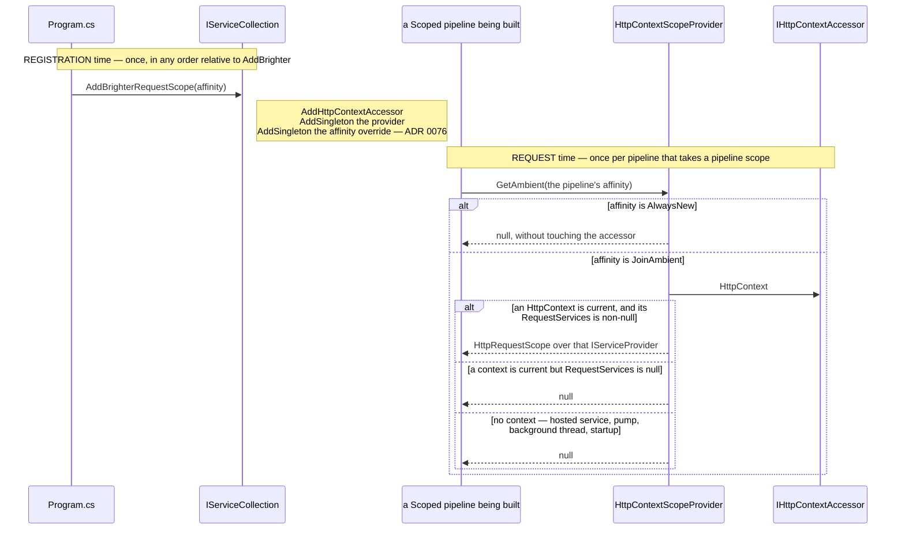
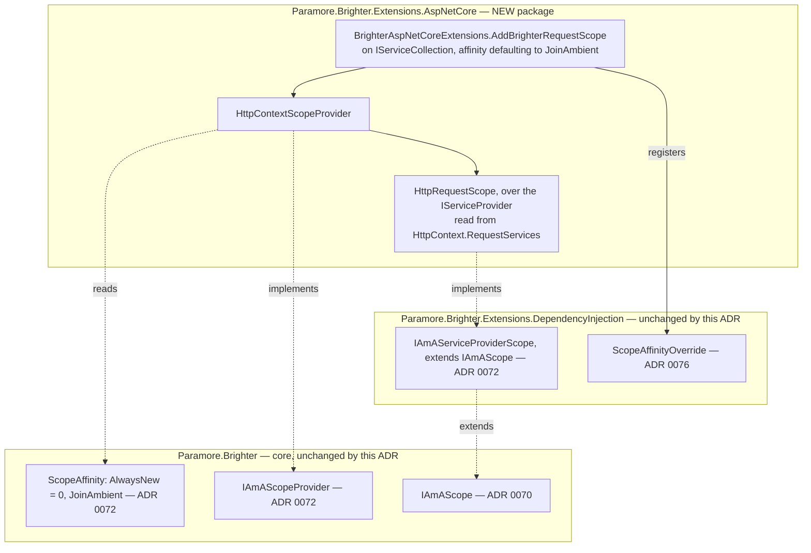

# 73. ASP.NET Core's request scope as Brighter's ambient scope — a package of its own, and one line to opt in

Date: 2026-08-02

## Status

Proposed

## Context

ADR 0072 built the seam and ADR 0076 the setting that switches it on, but nothing so far offers Brighter an ambient scope to adopt. An ASP.NET Core application has exactly the scope the feature was raised for — the per-request one its controllers and its `DbContext` already resolve from — and no way to hand it over. Somebody has to ship the piece that does, and where that piece lives is not obvious: it needs ASP.NET Core types, and neither core nor the DI package may depend on ASP.NET.

Mechanically, the seam asks an `IAmAScopeProvider` exactly once per pipeline, carrying a `ScopeAffinity` computed from the `DefaultScopeAffinity` on `IBrighterOptions`, and either borrows what comes back or creates and owns a scope as it does today.

**Nothing in the repository implements `IAmAScopeProvider`**, so as things stand the seam has no source to consult and the affinity has nothing to be affine to. The framework where FR-16's case actually lives — a controller action whose Brighter handler, whose Darker query handler and whose own code should all resolve the same `DbContext` — is ASP.NET Core, and ASP.NET Core already owns exactly the DI scope that case wants: the per-request scope behind `HttpContext.RequestServices`.

**Parent Requirement**: [specs/0036-scoped-lifetime-per-pipeline/requirements.md](../../specs/0036-scoped-lifetime-per-pipeline/requirements.md)

**Scope**: This ADR decides **how an ASP.NET Core application offers its request scope to Brighter** — the package that holds the ambient source, its name, the single registration extension that is the whole of the opt-in gesture, that extension's name and signature, and the package's target frameworks and SDK. It discharges **FR-15's package-inertness half** — that taking the reference, and calling nothing, leaves Brighter behaving exactly as it does today, which is FR-15's stated example and the thing this package is the only one able to deliver, and which acquires a criterion capable of failing only once AC-14's spy clause sits in a project that takes the reference (step 4a) — and **the registration half of FR-17**: the gesture, its argument and the descriptors it leaves behind. **FR-15's normative clause, the affinity option's default value, is ADR 0076's**, and the "no pipeline adopts" behaviour that follows from that default is ADR 0072's ladder. **FR-17 is split three ways** — the model FR-13 also follows, one requirement divided across the siblings that each make part of it true: the gesture is this ADR's, the write-through mechanism that carries its argument onto whichever options object a registration path produces is ADR 0076's, and the site at which its repeated-call rule is evaluated is ADR 0074's. It serves FR-10, FR-12, FR-16, FR-18, FR-23, FR-25.11, NFR-2 and NFR-7.

It does **not** decide the opt-in property, the override that carries this extension's argument, or how either reaches the four registration paths — that is ADR 0076, and this extension is its **first** caller — the only one Brighter ships, with NFR-7 anticipating others. It does not decide how a pipeline discovers or adopts an ambient (ADR 0072), the transform pipeline's DI scope (ADR 0070) or the handler convergence (ADR 0071). It does not decide where any validation rule is evaluated — that is ADR 0074 — and it adds no rule against FR-17's *other* configuration error, an application assigning `DefaultScopeAffinity` while also calling this extension, which no rule can detect without the sentinel FR-17 bans. It changes no lifetime, and it adds nothing to `Paramore.Brighter` or to `Paramore.Brighter.Extensions.DependencyInjection`.

This ADR **supersedes no prior ADR.** It is the application-facing end of the 0070–0072 sequence.

### Where this ADR sits

Seven ADRs deliver the parent requirement, one decision each; the requirements constrain observable behaviour only and hand how it is implemented to design (C-13). This is the fourth, and the only one an application author has to touch anything to use.

| ADR | Decides |
| --- | --- |
| 0070 | a transform pipeline takes one DI scope, carried **as a parameter** |
| 0071 | handler pipelines converge onto the **same handle**, carried on the object they already pass |
| 0072 | how a pipeline discovers an **ambient** DI scope the host owns |
| **0073** *(this one)* | the **ASP.NET Core package**, and the one line an application writes to opt in |
| 0074 | **where** the six scope-configuration rules are evaluated |
| 0075 | how a `Publish` subscriber **suppresses** adoption, for itself and everything nested beneath it |
| 0076 | the **affinity option**, and how one setting reaches all four registration paths in any order |

The rule the first two state is **the per-pipeline object carries the DI scope**. This ADR does not touch that object: it decides only where the scope a pipeline may carry comes from, when the host is an ASP.NET Core application.

ADR 0067's `Terms` block defines the two axes used throughout — Brighter's *configured lifetime*, which governs the artefact, and the container's *registration lifetime*, which governs the dependencies — and keeps `IServiceScope`, `ServiceProviderLifetimeScope` and `IAmALifetime` distinct. This ADR does not restate it, and follows its vocabulary: "lifetime scope" is not used for anything introduced here. (NFR-8 is a documentation obligation about one specific ambiguity, `IAmAScope` against `IAmALifetime`; it is discharged where ADRs 0070 and 0072 document those types and by FR-25's guidance page; this package declares neither, so nothing here bears on it.)

### What the application has to write, and what it must not have to

The whole of the opt-in, from an application's side, is one line in `Program.cs` — plus the `using` that line needs, which *Technology Choices* decides and does not pretend away. Everything in this ADR is a constraint on what that line may be and where it may live.

- **It must be reachable before the Brighter registration as well as after it.** AC-48 says so in as many words: *"the same holds with the extension call placed before `AddBrighter` as well as after it — the rule is not an ordering rule (C-10)."* That decides the receiver type on its own; it also means the extension cannot be the thing that writes the affinity onto the options object, which is the problem ADR 0076 exists to solve.
- **It must be one gesture, not two.** Registering the ambient source **is** the opt-in (D1). There is no middleware to add, no per-request call site, and nothing for a controller or a handler to remember to do.
- **Taking the package reference must change nothing at run time.** FR-15 and AC-14: with the extension not called, an `IHttpContextAccessor` spy records **zero** accesses. No module initializer, no assembly scanning hook, no auto-registration. ⚠ **That assertion can only fail in a project that takes the reference**, and none of the existing test projects does or may, which is why step 4a moves the spy clause into this package's own test project and why the amendment to AC-14 that entails is owed. This is a claim about *behaviour*; what the reference costs at build and deploy time is a separate question, answered under *Technology Choices* and priced in *Consequences*.
- **No `HttpContext` is the ordinary case, not an error** (FR-18). A hosted service, a background thread, startup. The provider returns nothing and the pipeline creates its own scope, as it does for a host that never opted in — save one latched `Warning` per container per provider type, which is the only difference **in this case**; FR-19 permits at most two log entries in total for a host with an ambient source registered, and the second — FR-23's *ambient offered but unusable* — does not arise here. ⚠ **A consumer pump is not one of these**, though it looks like one: its flow is suppressed (ADR 0075), so its ask carries `AlwaysNew`, the provider declines on the affinity rather than on the absence of a context, and it emits **nothing** (see the C-14 paragraph under *Key Components*).
- **The dependency direction is fixed** (D1, NFR-2). The ASP.NET package depends on the DI package; the DI package must gain no ASP.NET dependency, because it lands on every consumer host, every console producer and every worker service in the ecosystem.

### The forces

- **D1 / NFR-2 — a separate package, backed by `IHttpContextAccessor`.** No middleware, no ASP.NET dependency in the DI package, and registering the provider is the opt-in.
- **D13 — the extension takes the affinity as an explicit argument**, defaulting to `JoinAmbient`. Opting out means passing `AlwaysNew`, or not calling the extension. What that argument then *does* is ADR 0076's.
- **D16 — the ask is made even under `AlwaysNew`**, so that the decision is observable, and **an `AlwaysNew` ask must neither consult nor adopt** — D16's own words, and the rule this provider honours. (FR-10 states the rule on the provider — *a `GetAmbient(AlwaysNew)` call must neither consult nor adopt an ambient and must return nothing* — and D16 restates it; FR-27.1 and FR-24.4 cite it there correctly.)
- **D17 — `IAmAScope? GetAmbient(ScopeAffinity affinity)`** is the contract, fixed and not open: one argument, the asking pipeline's affinity; one return, an ambient or nothing.
- **FR-23 / C-7 — the provider does not probe and does not own.** A stale or disposed `RequestServices` is ADR 0072's to catch — by its usability probe before resolution, and, for a source disposed *after* that probe, by its translation of `ObjectDisposedException` at the borrowed resolution site; disposal of the ambient is ASP.NET's, never Brighter's.
- **From ADR 0072, fixed**: the ambient must implement `IAmAServiceProviderScope` for a Microsoft-container-backed factory to resolve from it, and `IAmAScopeProvider` is registered with plain `AddSingleton`, never `TryAddSingleton`, so every duplicate descriptor stays visible to validation (FR-24.3) while MS DI resolves the last.
- **From ADR 0076, fixed**: the affinity this extension is passed travels as a `ScopeAffinityOverride` in the service collection, and is applied to the options object from inside the factory that produces it. This extension registers the value and knows nothing else about it.

## Decision

**ASP.NET Core's per-request DI scope is offered to Brighter by a package of its own, whose entire opt-in surface is one `IServiceCollection` extension: an application calls one method, names no type, and not calling it leaves Brighter exactly as it is today.**

The shape that takes is one new package, `Paramore.Brighter.Extensions.AspNetCore`, holding three small types — the extension class, an `IAmAScopeProvider` over `IHttpContextAccessor`, and an `IAmAServiceProviderScope` over `HttpContext.RequestServices` whose disposal is a no-op because ASP.NET owns the scope. The package takes ASP.NET Core from the shared framework rather than from a package reference, which fixes its target frameworks. The names and signatures are under *Key Components*.

**"One extension" is a statement about what an application has to *call*, not about accessibility.** `HttpContextScopeProvider` and `HttpRequestScope` are **public**, and two things carry that. **NFR-7's** promise that another package may follow this one's pattern is worth more if the pattern can be composed rather than only copied — the same argument ADR 0075 makes for its own type, and the same repository rule that has no `InternalsVisibleTo` to fall back on. And **AC-19 asserts a `Warning` naming this provider's implementation type**, which a cross-assembly test reaches most naturally as `typeof(HttpContextScopeProvider)`. (AC-29 is *not* a second instance of that: its provider is one that **captures** a resolution source, in a console host of AC-35's shape, and FR-23's condition does not arise for this package at all — the built-in accessor clears itself at end of request and offers no ambient.) *(AC-18's recorder is not one of the reasons: AC-18 has the recorder resolve `IEnumerable<IAmAScopeProvider>` on its first `GetAmbient` call and select the entry that is not itself, so it delegates through the core interface and never names this type. It builds against an internal provider without difficulty.)* Nothing about the opt-in gesture changes: an application still writes one line and names neither type. What is public is the provider and the scope it hands back — not any constructor path Brighter reserves to itself, since the provider takes only `IHttpContextAccessor` and the scope only an `IServiceProvider`, which it null-checks itself rather than trusting the caller to have done so. That check is what makes a public constructor safe to expose: composing the pattern means constructing these types from outside this package, so ADR 0072's non-null obligation on `Services` cannot rest on the one path this package happens to take.

### The mechanism, end to end

There are two moments and they are far apart. At registration time the extension puts three things in the collection and returns. At request time the provider answers one question, per pipeline, from `IHttpContextAccessor`.



Every `null` on that diagram means the same thing and none of them is a failure: the pipeline creates and owns a DI scope, exactly as it does today. The three of them are an `AlwaysNew` ask, no current context, and a context whose `RequestServices` is null — the last being the **provider's** half of ADR 0072's non-null obligation on `Services`, which is why it is on the diagram rather than only in the prose. The scope's own constructor carries the other half, for the callers this diagram does not draw: the type is public, so the provider's check binds the path drawn here and nothing else. Only the one branch that returns an `HttpRequestScope` changes anything, and what it changes is decided by ADR 0072's ladder, not here.

### Where the pieces live



Every edge crossing a boundary runs from the new package downward — ASP.NET package to DI package to core — and none runs the other way. That is the whole of NFR-2, and it is why this is a package rather than three types in the DI package.

### Key Components

#### The roles, and what each is responsible for

| Role | Type | Stereotype | Responsibility |
| --- | --- | --- | --- |
| The ambient source | `HttpContextScopeProvider` | **deciding** | Answers, for one pipeline carrying one affinity, whether there is a request scope it may adopt. Creates nothing, owns nothing, disposes nothing |
| The ambient scope | `HttpRequestScope : IAmAServiceProviderScope` | **knowing** (information holder) | Names the `IServiceProvider` a pipeline adopting this ambient resolves from — the one the provider read out of `HttpContext.RequestServices` and validated, captured at construction. Disposal is a no-op: ASP.NET owns the request scope |
| The registration extension | `BrighterAspNetCoreExtensions.AddBrighterRequestScope` | **doing** (structurer) | Puts the ambient source and the affinity override into the service collection. It is the whole of the opt-in |

The division that matters is between the **source** and the **scope**. The source decides whether to offer; the scope only names where to resolve from. Keeping them apart is what lets the offer be declined — by ADR 0072's affinity guard or by its usability probe — without anything having been created, and therefore without anything needing to be released.

#### The package and its extension (new package)

```csharp
namespace Paramore.Brighter.Extensions.AspNetCore       // the package's own, as every Brighter package does
{
    public static class BrighterAspNetCoreExtensions
    {
        /// <summary>
        /// Registers ASP.NET Core's per-request DI scope as Brighter's ambient scope, and selects the
        /// scope affinity Brighter's Scoped pipelines use. Call it once, in any order relative to
        /// AddBrighter or AddConsumers. Pass ScopeAffinity.AlwaysNew to register the ambient source
        /// without opting in. Not calling it at all leaves Brighter exactly as it is today.
        /// </summary>
        /// <param name="services">The service collection to register into.</param>
        /// <param name="affinity">Whether Brighter's Scoped pipelines join the ambient request scope
        /// or always create their own. Defaults to <see cref="ScopeAffinity.JoinAmbient"/>, because
        /// calling this method is itself the opt-in gesture.</param>
        /// <returns>The same <paramref name="services"/>, for chaining.</returns>
        /// <exception cref="ArgumentNullException"><paramref name="services"/> is null.</exception>
        public static IServiceCollection AddBrighterRequestScope(
            this IServiceCollection services,
            ScopeAffinity affinity = ScopeAffinity.JoinAmbient)
        {
            ArgumentNullException.ThrowIfNull(services);

            services.AddHttpContextAccessor();
            services.AddSingleton<IAmAScopeProvider, HttpContextScopeProvider>();   // plain AddSingleton — ADR 0072, FR-24.3
            services.AddSingleton(new ScopeAffinityOverride(affinity));             // plain AddSingleton — ADR 0076, FR-17
            return services;
        }
    }
}
```

**Contract.**

| Member | Input | Output | Error conditions |
| --- | --- | --- | --- |
| `AddBrighterRequestScope(IServiceCollection, ScopeAffinity)` | the affinity, defaulting to `JoinAmbient` (D13) | the same collection, for chaining | Throws `ArgumentNullException` on a null collection, matching `AddBrighter` (`ServiceCollectionExtensions.cs:65-66`). It never throws on ordering, never inspects an existing descriptor, and never alters a lifetime (FR-17, FR-21). Calling it twice is a configuration error it does not throw on: the last call's affinity is effective, and a repeat carrying a different affinity is reported by validation (FR-17, AC-49) — see below. Calling it **without any Brighter registration at all** — no `AddBrighter`, no `AddConsumers` — is **inert and is not an error**: ADR 0076's `RegisterBrighterOptions` never runs, so the override is never read; no `IBrighterOptions` is registered, so nothing reads the affinity; and the provider sits in the collection with nothing to consult it. There is no Brighter host to misconfigure, and the extension is not the place to diagnose the absence of one |
| `HttpContextScopeProvider.GetAmbient(ScopeAffinity)` | the asking pipeline's affinity | an `HttpRequestScope` over the `IServiceProvider` read from `HttpContext.RequestServices`, when the affinity is `JoinAmbient`, an `HttpContext` is current, **and its `RequestServices` is non-null**; otherwise `null` | Must not throw where there is no current `HttpContext` — a hosted service, a consumer pump, a background thread, startup (FR-18) — nor where a context is current but carries no `IServiceProvidersFeature`. It neither consults `IHttpContextAccessor` nor returns anything on an `AlwaysNew` ask (D16). It does not probe the ambient for staleness; that is the DI package's question and ADR 0072 answers it |
| `HttpRequestScope(IServiceProvider)` | the `IServiceProvider` the provider read out of `HttpContext.RequestServices` and validated — **never the `HttpContext`** | — | Throws `ArgumentNullException` on a null provider, the same guard the extension uses and `AddBrighter` before it (`ServiceCollectionExtensions.cs:65-66`). The guard is on the type rather than left to the provider because the constructor is **public** and meant to be composed (NFR-7), so it is an entry point this package does not control |
| `HttpRequestScope.Services` | none | the `IServiceProvider` the scope was **constructed with** | **Obliged** to be non-null by ADR 0072's role contract, and this implementation discharges that with a **check and a capture**, which do different work and neither of which suffices alone. The constructor check is what makes the value non-null; the capture is what keeps it so, because the property is then a field read and there is no later read to go null. The capture is also what rules out holding the `HttpContext` instead: `HttpContext.RequestServices` has a public setter and is backed by a replaceable `IServiceProvidersFeature`, so a construction-time check on a stored context would not be an invariant of a later read, and a `DefaultHttpContext` built directly returns `null` from it. May name a scope ASP.NET has already disposed — FR-23's case, which ADR 0072's probe catches before anything is resolved. `Dispose()` and `DisposeAsync()` are no-ops: ASP.NET owns the request scope (FR-12, C-7) |

`AddHttpContextAccessor()` is Microsoft's own idempotent `TryAddSingleton<IHttpContextAccessor, HttpContextAccessor>()`, so it is safe alongside an application that already called it. **C-14 is what was taken to bound this in a consumer host, and it does not hold** — it is an assumption rather than a verified invariant. A pump thread is taken to carry no usable ambient `HttpContext`, yet `IHttpContextAccessor` is `AsyncLocal`-backed, so a `Dispatcher` started from inside a **live** request inherits one: the context is non-null, its `RequestServices` is that request's scope, ADR 0072's usability probe passes, and the ask lands on ladder row 10 — **borrowed**. Every pipeline that pump drives would then resolve from one request's scope for the life of the process. That is an FR-19 violation in resolution and identity rather than in logging, and FR-23 does not reach it: FR-23 governs a *stale* source, and this one is live.

**The case cannot arise, and the reason is not this package's.** ADR 0075 suppresses the pump's own flow at `Performer.Run()`, so a consumer pipeline's ask always carries `AlwaysNew`, and `GetAmbient` returns nothing on an `AlwaysNew` ask (D16, the contract row above) whatever `HttpContext` is current. Nothing this package offers is ever adopted on the consumer side, so there is no operator discipline to get right and **no Risks row here** — the risk sits in ADR 0075, beside the bracket that closes it. What this package owes C-14 is the statement that its own accessor is the mechanism by which the assumption could have been falsified, which is this paragraph. `IAmAScopeProvider` is registered with **plain `AddSingleton`, never `TryAddSingleton`**, exactly as ADR 0072 requires, so a duplicate descriptor stays visible to FR-24.3's validation while MS DI resolves the last.

**Two calls to the extension resolve to the last one, and a conflicting repeat is reported.** `ScopeAffinityOverride` is registered with plain `AddSingleton` for the same two reasons `IAmAScopeProvider` is: MS DI resolves the service type to the **last** descriptor, so the last call's affinity is the effective one — and every call's descriptor stays in the collection, so validation can see that there was more than one. A `TryAddSingleton` here would satisfy neither. It would make the *first* call win while the provider's plain `AddSingleton` made the *last* call win, giving a host that carried one call's affinity and another call's provider; and it would leave the second descriptor out of the collection entirely, so nothing could be reported. FR-17 requires both halves, and this is the mechanism that supplies them.

That leaves the repeat determined but still wrong, so FR-17 makes it visible — and what this ADR owes that rule is a **registration mechanism**, not a message: every call's descriptor must survive in the collection for a rule to read, which is why the override goes in under plain `AddSingleton`. **The condition, the severity and the message are ADR 0074's**, as is the reason the duplicate-*provider* rule cannot serve here: both calls register the same `HttpContextScopeProvider` type, which FR-24.3 excludes in terms, so FR-24.3 catches *two different providers* and FR-17 *two different affinities*, complementary rather than overlapping. A repeat carrying the same affinity is idempotent in effect and is not a finding, mirroring FR-24.3's own exclusion (AC-49). There is still no correct answer to "which of two contradictory opt-ins did you mean"; what this buys is that the answer Brighter picks is the one the reader would predict, and that they are told they asked twice.

#### The three names this ADR settles

**`Paramore.Brighter.Extensions.AspNetCore` — kept.** The `Paramore.Brighter.Extensions.*` family names the framework or extension surface being integrated: `DependencyInjection`, `Diagnostics`, `OpenTelemetry`, and on the consumer side `ServiceActivator.Extensions.Hosting`. `AspNetCore` is that pattern applied to ASP.NET Core, and it makes the dependency direction legible from the package name alone.

**`IAmAScope? GetAmbient(ScopeAffinity affinity)` — kept.** The contract is fixed by D17 and is not open. The spelling says what the member does — it *gets an ambient*, it does not create, begin or open one — and the noun is the one FR-17 and FR-24 use throughout. `TryGetAmbient` was considered and rejected: the `Try*` convention implies an `out` parameter and a `bool` return, and a nullable return already says the same thing more directly. `GetAmbientScope` is redundant beside a return type of `IAmAScope`.

**`AddBrighterAspNetCoreScopes(...)` — rejected, and replaced by `AddBrighterRequestScope(ScopeAffinity affinity = ScopeAffinity.JoinAmbient)`.** The old spelling is wrong in three ways. Its plural implies more than one thing is registered, when it is one ambient source. Its noun implies the extension creates scopes, when D11 makes the provider an **ambient source rather than a scope supplier**: ASP.NET already created the request scope, and this package only offers it. And it is long enough to read as a framework incantation rather than a configuration line.

The constraints on the replacement are all real and all narrow the field:

- **It must extend `IServiceCollection`, not `IBrighterBuilder`.** An `IBrighterBuilder` extension is only reachable from the value `AddBrighter`/`AddConsumers` returns, which would make "call the extension before `AddBrighter`" unexpressible — and AC-48 requires exactly that ordering to work.
- **`Use*` is wrong.** In .NET generally `Use*` belongs to `IApplicationBuilder`; in Brighter specifically `Use*` already means "an `IBrighterBuilder` extension" — `UseScheduler`, `UseOutboxSweeper`, `UseOutboxArchiver`, `UseFluentValidation`, `UseAsyncApi`, `UseExternalLuggageStore`, `UseBoxProvisioning`, `UsePublicationFinder`. Every `Use*` in the repository extends `IBrighterBuilder`. A `Use*` here would be wrong twice over.
- **`Add*` is right and the prefix should be `AddBrighter`.** The `IServiceCollection` extensions the application sees are `AddBrighter` and `AddConsumers`; `AddProducers` and `AddControl` extend `IBrighterBuilder`. `AddBrighterRequestScope` reads as one of that family, and sorts beside `AddBrighter` for any reader who has both namespaces in scope.
- **Singular, and naming what is registered.** One ambient source, and the thing it makes ambient is ASP.NET's request scope.

Rejected candidates, with what each had going for it:

| Candidate | Real advantage | Why rejected |
| --- | --- | --- |
| `AddBrighterAspNetCoreScopes(...)` | says which framework | plural; implies Brighter creates scopes; longest of the candidates |
| `AddBrighterHttpRequestScope(...)` | removes any confusion with Brighter's own `IRequest` | one character shorter than the name being replaced, so it does not fix the complaint that prompted the rename |
| `AddBrighterAmbientScope(...)` | uses the normative term for the concept — *ambient scope* is a DI scope the host owns | claims the general name for the ASP.NET case. NFR-7 anticipates an `AsyncLocal`-backed provider for non-ASP.NET hosts; that package would have the better claim on the generic spelling |
| `UseBrighterRequestScope(...)` | reads naturally in `Program.cs` | `Use*` means `IBrighterBuilder` in this codebase and `IApplicationBuilder` in .NET; this is neither |
| `AddBrighterScopeAffinity(affinity)` | names the argument | names the *setting* rather than what is registered, and would suggest it works without an ambient source, which it does not |

**The extension class sits in `namespace Paramore.Brighter.Extensions.AspNetCore` — the package's own, as every Brighter package does.** Every other Brighter `IServiceCollection` extension declares a namespace matching its assembly: `AddBrighter` in `Paramore.Brighter.Extensions.DependencyInjection`, `AddConsumers` in the ServiceActivator equivalent, and a repository-wide search for `namespace Microsoft.Extensions.DependencyInjection` in `src/` finds nothing. This package does the same.

The question was live because there were three candidates rather than two, and the cost is worth stating plainly. Declaring `Microsoft.Extensions.DependencyInjection` would have made the opt-in line need **no `using` at all**, because ASP.NET Core's implicit usings put that namespace in scope in every `Program.cs`; declaring `Paramore.Brighter.Extensions.DependencyInjection` — the namespace `AddBrighter` itself lives in, and therefore already imported in any file that registers Brighter — would have achieved the same with a smaller departure. **Both were rejected in favour of the convention.** What Brighter gives up is one `using` directive at one call site; what it keeps is that a Brighter type lives in a Brighter namespace matching its assembly, that a reader grepping for Brighter's extension methods by namespace finds this one, and that no Brighter **extension** package declares a namespace another assembly owns. A `using` on the line above the line is a small price for the rule every Brighter `IServiceCollection` extension already follows. (The rule is about extension entry points, not about every type in `src/`: `Paramore.Brighter.DynamoDb` declares `Paramore.Brighter.Outbox.DynamoDB`, and `Paramore.Brighter.Archive.Azure` sets a `RootNamespace` of `Paramore.Brighter.Storage.Azure`. Neither is an extension entry point, and neither licenses a third.)

The residual cost of `AddBrighterRequestScope` is stated rather than hidden: Brighter's own vocabulary uses "request" for a command, event or query (`IRequest`, `RequestContext`, `RequestHandlerAttribute`), so "request scope" could be misread as "the scope of a Brighter request". Two things make that tolerable — the method lives in a package whose name says ASP.NET Core, and Brighter has no existing "request scope" concept for it to collide with, since the normative terms are *pipeline scope* and *ambient scope*. The XML doc comment says "ASP.NET Core's per-request DI scope" in its first line for that reason.

#### Where each type is touched

| Assembly | Type | Change |
| --- | --- | --- |
| `Paramore.Brighter.Extensions.AspNetCore` | `BrighterAspNetCoreExtensions`, `HttpContextScopeProvider`, `HttpRequestScope` | **new package** on `$(BrighterCoreTargetFrameworks)`, with a project reference to `Paramore.Brighter.Extensions.DependencyInjection` and a `FrameworkReference` to `Microsoft.AspNetCore.App` |
| `…Extensions.DependencyInjection` | `ScopeAffinityOverride` (ADR 0076) | **no change** — this package constructs and registers one, and that is the whole of its dependency on the affinity mechanism |
| `Paramore.Brighter.Extensions.AspNetCore.Tests` | the ASP.NET test host | **new test project** — the repository has none capable of hosting a controller action, and eight of this ADR's criteria need one; it also takes this package's reference without calling the extension, which is the only place AC-14's spy clause can fail. Needs a `Directory.Packages.props` entry for `Microsoft.AspNetCore.Mvc.Testing` and a `Brighter.slnx` entry; step 4a |
| `Paramore.Brighter` | — | **no change**, so AC-22.3's source-level guard is untouched and NFR-1 holds trivially |

Unchanged, and named so the omissions are not read as oversights: `Paramore.Brighter.Extensions.DependencyInjection` gains no ASP.NET reference (NFR-2, guarded mechanically by **AC-22.2**, which asserts that package has no `PackageReference`/`ProjectReference` matching `Microsoft.AspNetCore.*` — AC-22.3 is the *core-source* guard and is a different clause); no lifetime property moves — `IsolateTransientHandlerScope` (`BrighterOptions.cs:37`) and the three lifetimes (`:20`, `:52`, `:69`) are untouched; `BrighterHandlerBuilder` (`ServiceCollectionExtensions.cs:119`, `:142`) is untouched, including the `ScopedArtefactCache` and `AmbientScopeDiagnostics` registrations ADR 0072 adds there; and every rule in ADR 0072's `CreatePipelineScope()` protocol holds unchanged, this package supplying only one of the ladder's inputs.

### Technology Choices

**What the new package targets, and how it reaches ASP.NET's types.** `Paramore.Brighter.Extensions.AspNetCore` targets **`$(BrighterCoreTargetFrameworks)` — `net8.0;net9.0;net10.0`** — and takes ASP.NET Core from the shared framework with `<FrameworkReference Include="Microsoft.AspNetCore.App"/>`. There is **no `Directory.Packages.props` entry**, because a framework reference is not a package reference and central package management has nothing to manage.

Three things make this the only implementable choice rather than a preference. `netstandard2.0` is dropped: on that target the extension would need `PackageReference`s to **both** `Microsoft.AspNetCore.Http.Abstractions` (for `IHttpContextAccessor`) and `Microsoft.AspNetCore.Http` (for `AddHttpContextAccessor`), and the only shippable versions of either are the end-of-life 2.2.x line. Taking two dependencies on that line to serve a target no ASP.NET Core application uses is a cost with no beneficiary. That is a **deliberate departure from `BrighterTargetFrameworks`** (`src/Directory.Build.props:43`, `netstandard2.0;net8.0;net9.0;net10.0`), and a well-worn one — 24 projects in `src/` already target `$(BrighterCoreTargetFrameworks)` (`:45`). On `net8.0`+ the ASP.NET types come from the shared framework, so a `PackageReference` would be the wrong mechanism even if one existed; a single unconditional `FrameworkReference` serves all three targets with no conditional `ItemGroup`. **What it costs is that it flows transitively**: a project referencing this package acquires the shared-framework requirement whether or not it calls the extension. That is accepted rather than unnoticed — it is what makes this an ASP.NET Core package rather than a universal one, it is stated in *Consequences*, and it is the reason the guidance is to reference it from ASP.NET Core hosts only. And the precedent for shipping ASP.NET from `src/` already exists: `src/Paramore.Brighter.ServiceActivator.Control.Api` is a packable ASP.NET Core library on exactly these targets — it uses `Sdk="Microsoft.NET.Sdk.Web"` with `OutputType=Library`, which supplies the framework reference implicitly, which is why a grep for `FrameworkReference` or `AspNetCore` across `src/*.csproj` finds nothing and proves nothing.

`Microsoft.NET.Sdk` plus an explicit `FrameworkReference` is preferred to the Web SDK here: this package is a class library with three types and no static assets, no launch profile and no `wwwroot`, and the explicit reference says in the project file what the Web SDK would say implicitly. **`IHttpContextAccessor` lives in `Microsoft.AspNetCore.Http.Abstractions` and `AddHttpContextAccessor` in `Microsoft.AspNetCore.Http`** — verified against the `Microsoft.AspNetCore.App.Ref` pack — and the framework reference brings in both.

**Why the provider takes `IHttpContextAccessor` as a dependency rather than reaching for a static.** The accessor is itself `AsyncLocal`-backed and is the supported way to reach the current context outside a controller; taking it as a constructor dependency keeps the provider a plain testable type with no ambient state of its own, and lets a test host substitute it. It is also what makes FR-15's zero-access assertion measurable: a spy implementation counts the accesses, and there are none unless the extension was called.

**Why `HttpRequestScope`'s disposal is a no-op rather than a throw.** ADR 0070 gives `IAmAScope` both `IDisposable` and `IAsyncDisposable`, and the pipeline disposes what it was given, unconditionally, without knowing whether it was created or borrowed. A borrowed ambient must therefore tolerate disposal and do nothing with it: ASP.NET disposes the request scope when the request ends, and a Brighter pipeline that ends first must not take it down early (FR-12, C-7). Throwing would make correct code fail; disposing would make it fail later and elsewhere.

### Implementation Approach

**1. Build the package.** A `Microsoft.NET.Sdk` class library targeting `$(BrighterCoreTargetFrameworks)`, with a `ProjectReference` to `Paramore.Brighter.Extensions.DependencyInjection` and one `<FrameworkReference Include="Microsoft.AspNetCore.App"/>` for `IHttpContextAccessor` and `AddHttpContextAccessor` — no `Directory.Packages.props` entry, and no `netstandard2.0`; *Technology Choices* gives the reasoning. Three types: the extension class, `HttpContextScopeProvider`, `HttpRequestScope`. The provider's whole body is an affinity check, **two** null checks — `_accessor.HttpContext`, then that context's `RequestServices` — and a wrap: `new HttpRequestScope(context.RequestServices)`. The scope's whole body is a constructor taking an `IServiceProvider` and `ArgumentNullException.ThrowIfNull`-ing it, a property returning it, and two no-op disposals. **ADR 0072's non-null obligation on `Services` is discharged by that check and that capture together, and neither does the other's work.** The check is what makes the value non-null, and it has to be on the type: the constructor is public so the pattern can be composed (NFR-7), so the provider's own `RequestServices` check binds the asks that come through the provider and nothing else. Capturing the `IServiceProvider` rather than the `HttpContext` is what keeps the value non-null afterwards — a scope holding the context would re-read a settable property backed by a replaceable `IServiceProvidersFeature`, so its check would guard construction rather than the read. The null is reachable in a shape this ADR calls expected: `HttpContext.RequestServices` is null on a `DefaultHttpContext` with no `IServiceProvidersFeature`, and *Technology Choices* makes substituting the accessor a design goal, so a test double reaching this provider is an ordinary caller. A null there and a missing `HttpContext` take the same path — return `null`, which is FR-18's *nothing offered*.

**2. The extension registers three things and returns.** `AddHttpContextAccessor()`, the provider under plain `AddSingleton`, and ADR 0076's `ScopeAffinityOverride` under plain `AddSingleton`. It reads nothing from the collection and removes nothing from it. This depends on ADR 0072 having added `ScopeAffinity` and `IAmAScopeProvider` to core, and on ADR 0076 having added `ScopeAffinityOverride` to the DI package; nothing in this package compiles before both.

**3. `AlwaysNew` short-circuits in the provider as well as in Brighter.** D16 requires the ask to be made even under `AlwaysNew`, so the decision is observable, and requires that such an ask neither consult nor adopt. `HttpContextScopeProvider` therefore returns `null` before touching `IHttpContextAccessor`. Brighter ignores an ambient returned for an `AlwaysNew` ask anyway (FR-24.4, ADR 0072), so this is the provider honouring its half of a contract Brighter also guards.

**4. FR-15's inertness holds by construction, and AC-14's spy clause is what makes it falsifiable.** Nothing in the package runs unless the extension is called, so the `IHttpContextAccessor` spy records zero accesses in a host that only takes the package reference. **Which project runs that spy is not a detail**: an assertion about accesses to a type the project under test cannot reference passes whatever the package does, so the clause has to sit where the reference is taken, which is step 4a's project.

**4a. A test project has to be built, and there is nothing to extend.** **Eight** of the acceptance criteria this ADR cites or discharges — AC-15, AC-16, AC-17, AC-18, AC-19, AC-34, AC-48 and AC-49 — need a running ASP.NET Core host with a controller action, and **no test project in the repository can host one**: none of the **37** references `Microsoft.AspNetCore.*`, `Microsoft.AspNetCore.Mvc.Testing` or `WebApplicationFactory`, and `Brighter.slnx` has no ASP.NET **test** entry — the only ASP.NET project in the solution is `src/Paramore.Brighter.ServiceActivator.Control.Api`, cited under *Technology Choices*. So a new `tests/Paramore.Brighter.Extensions.AspNetCore.Tests` is required work, on the same TFMs as the package, with a `Microsoft.NET.Sdk.Web`-hosted `WebApplicationFactory` fixture, and it must be added to `Brighter.slnx`. ⚠ **It has a second role, and that one is not among the eight.** It references this package and **deliberately never calls the extension**, which is the arrangement AC-14's spy clause needs; that half wants the *reference*, not a host, so the eight above are unchanged and stay eight.

**AC-14 divides in two, and the halves need different homes.** Its **whole-suite regression half** — no `IAmAScopeProvider` registered, and *the existing Brighter test suite* for `Send`, `Publish`, `Post`, `DepositPost` and consumption run unchanged, with its named exclusions and its named non-excluded pair, all under `tests/Paramore.Brighter.Extensions.Tests/` — **stays where those projects live**. There is no controller, no `HttpContext` and no provider in it, it is not one of the eight, and sending it here would make it unimplementable. Those projects acquire **no** ASP.NET dependency; what leaves them is the spy clause.

**The spy clause cannot stay there, because in those projects it is vacuous by construction.** `IHttpContextAccessor` lives in `Microsoft.AspNetCore.Http.Abstractions`; **AC-22.2** forbids `Paramore.Brighter.Extensions.DependencyInjection` any `Microsoft.AspNetCore.*` reference, and the identifier appears nowhere in `src/` or `tests/` — none of the test projects step 4a counts references the assembly it lives in, and nothing Brighter ships touches the type. An assertion that a type no assembly under test can reach records zero accesses cannot fail, whatever the package does. So the clause belongs in `tests/Paramore.Brighter.Extensions.AspNetCore.Tests`, which **references this package and deliberately never calls the extension** — the one arrangement in which the assertion is about something. That is what makes it a genuine package-inertness test, and it is what gives **FR-15's package-inertness half** the criterion this ADR's `Scope` claims for it.

⚠ **That is an amendment to AC-14 rather than a reading of it**, and it is carried in the requirements true-up rather than here; the criterion stands as written until then. It is the **second** amendment owed to AC-14: ADR 0071's *Consequences*, under *Negative*, records the first, attaching the *"Explicitly NOT excluded"* designation to the pair it duplicates onto the handle path. That designation belongs to the regression half and this split to the spy half, so the two touch different halves of the same criterion and land together.

**This qualifies step 1's "no `Directory.Packages.props` entry" claim, which is true only of the *package*.** The `FrameworkReference` gives the src project its ASP.NET types with no versioned dependency, but `Microsoft.AspNetCore.Mvc.Testing` is an ordinary NuGet package and **does** need a central-package-management entry. The two facts are not in tension; they are about different projects, and the distinction is worth stating because it is the kind of claim a reader carries from one to the other. Which fixtures the project holds, and how those criteria are distributed across them, is task-breakdown work and is not decided here.

**5. Documentation.** FR-25.11 requires the guidance page to state the three gestures explicitly: opt in with `AddBrighterRequestScope()`; register the ambient source without opting in with `AddBrighterRequestScope(ScopeAffinity.AlwaysNew)`; opt out entirely by not calling the extension. The precedence rule that makes the first of those beat an application's own *assignment* of `DefaultScopeAffinity` — in any order and on any path, and not reported by validation — is ADR 0076's, and the page states it once. The one thing it does **not** beat is an application that registers `IBrighterOptions` **itself**, which defeats the write-through in either ordering and loses this extension's argument entirely; that case is not silent, and the page's troubleshooting section carries it as one of the six validation messages (FR-25.10). It is ADR 0076's limit and ADR 0074's FR-22.4 rule; nothing about it is this package's to decide, and nothing this extension could do would avoid it.

**6. What this leaves to the siblings.** **This ADR contributes no entry to ADR 0070 step 7a's release-note ledger** — a new package breaks nothing on upgrade, and its `netstandard2.0` gap is a property of the opt-in rather than a change to existing behaviour, stated in *Consequences* and on the guidance page instead. ADR 0076 decides what the affinity argument does after this extension deposits it, and owns the release-note entry for the `IBrighterOptions` member. ADR 0072 decides whether the ambient this provider offers is adopted. ADR 0074 decides where FR-17's repeated-opt-in rule and FR-24.3's duplicate-provider rule are **evaluated**; this ADR fixes only the registration model they read — every call's descriptor present, the last one effective — and adds no rule.

## Consequences

### Positive

- **The opt-in is one line, and it is the same line whichever entry point registered Brighter.** `services.AddBrighterRequestScope();` in `Program.cs`, in any position relative to `AddBrighter` or `AddConsumers`. No middleware, no per-request call site, no ordering rule to get wrong (D1, C-10).
- **Adding the package reference without calling the extension runs nothing and registers nothing**, and the `IHttpContextAccessor` spy records zero accesses (AC-14). The package has no module initializer, no assembly scanning hook and no auto-registration. What it does cost a project that references it is stated under *Negative*.
- **Core gains nothing, and neither does the DI package.** Every type here is in the new package. NFR-1's source-level clause is untouched and NFR-2 holds by the dependency direction.
- **A host with no `HttpContext` is served by the same code path as one that never opted in** (FR-18). A hosted service or a startup task gets `null` from the provider and creates its own scope; the only thing distinguishing it is FR-24.2's single latched `Warning` — the only difference **in this case**, FR-19 permitting at most two log entries in total for a host with an ambient source registered, of which FR-23's does not arise here (AC-19). There is no second code path to reason about. A **pump** thread reaches the same outcome by a different route — declined on affinity rather than on a missing context, and silently — because ADR 0075 suppresses its flow.
- **The seam stays implementable off ASP.NET.** Nothing here is privileged: another package registers its own `IAmAScopeProvider` and its own `ScopeAffinityOverride` in exactly the same two lines, which is what NFR-7 anticipates.
- **The provider is a decision and no state.** An affinity test, a null test and a wrap, over an injected accessor — testable without a web host, and with nothing to leak.

### Negative

- **A new package is a new package.** A NuGet artefact, a build target, a release cadence and a version matrix, for three small types. That is the price of NFR-2, and NFR-2 is worth it: an ASP.NET reference in the DI package would land on every consumer host and every console producer in the ecosystem.
- **The package is not an inert dependency, even though calling nothing in it runs nothing.** `FrameworkReference` flows transitively, so any project that references this package acquires the `Microsoft.AspNetCore.App` shared framework: the entry appears in its `runtimeconfig.json` and the ASP.NET Core runtime must be installed wherever it is deployed. A worker service or console producer that takes the reference *just in case*, and never calls `AddBrighterRequestScope`, still pays that. The behavioural inertness FR-15 and AC-14 require is untouched — no Brighter code runs and no descriptor is added — but the two claims are about different things and this one cuts the other way. **The rule for consumers is that this package is for ASP.NET Core hosts**; a host that is not one should take ADR 0072's seam and write its own `IAmAScopeProvider`. The alternative — `PackageReference`s on `Microsoft.AspNetCore.Http` and `.Abstractions` — would make the reference genuinely light for a non-web consumer at the cost of two package dependencies and a version matrix to maintain against the framework the host already carries, and is rejected on that trade rather than overlooked.
- **The new package does not ship for `netstandard2.0`, and that is the first opt-in gesture Brighter has that some of its own targets cannot reach.** An application still on `netstandard2.0`, or on a target the shared framework does not serve, gets the seam (ADR 0072) but not the in-repository ambient source, and must write its own `IAmAScopeProvider` to opt in. The alternative was a dependency on the end-of-life `Microsoft.AspNetCore.Http.Abstractions` 2.2.x line, which is worse.
- **The opt-in line needs a `using` that the alternatives would not have.** `AddBrighterRequestScope()` lives in `Paramore.Brighter.Extensions.AspNetCore`, so a `Program.cs` needs `using Paramore.Brighter.Extensions.AspNetCore;` beside the `using` it already has for `AddBrighter`. Two of the three namespace candidates would have removed that line — one of them without any departure from convention worth the name — and the convention was chosen over the convenience. It is one directive, but it is one directive on the single gesture this whole package exists to make easy, and IntelliSense will not offer the method until it is written.
- **A repeated opt-in is still a configuration error, and validation is the only thing that says so.** Both halves resolve to the last call, so the host is at least coherent — but an application that calls the extension twice with different affinities gets one of them silently unless it calls `ValidatePipelines()` **and** runs a validation host (C-15, D14). The warning FR-17 requires costs a rule in ADR 0074 and a troubleshooting entry on the guidance page (FR-25.10).
- **`AddBrighterRequestScope` uses "request" in a codebase where "request" already means something else.** Brighter's `IRequest` is a command, an event or a query. The package name and the doc comment are the mitigation, and they are weaker than a name that could not be misread — but every candidate that could not be misread was worse on some other axis, and the table above says which.
- **The package can be referenced and called in a host with no Brighter registration at all, and nothing says so.** It is inert rather than wrong, and diagnosing the absence of a Brighter host is not a leaf package's job — but an application that calls only this extension has written a line that does nothing, and will get no signal that it did.

### Risks and Mitigations

| Risk | Mitigation |
| --- | --- |
| The ASP.NET provider throws in a host with no `HttpContext`, or with one carrying no `RequestServices` — a hosted service, a pump thread, startup, a directly-constructed `DefaultHttpContext` | The provider null-checks `IHttpContextAccessor.HttpContext` **and that context's `RequestServices`**, returning `null` on either; the pipeline then creates and owns a scope exactly as if not opted in (FR-18). AC-19 asserts zero entries at `Error` or above and exactly one latched `Warning` across two such calls |
| An `HttpContext.RequestServices` that is stale, or that is disposed while a pipeline is still resolving from it, reaches Brighter's resolution and throws `ObjectDisposedException` | The provider does not probe, and ADR 0072 answers both halves on the DI package's side. **Stale**: its usability probe runs before anything is resolved from the ambient, and a failed probe declines and creates (FR-23, AC-29). **Live at the probe and disposed afterwards** — a response completing while a pipeline started from that request is still building: its borrowed resolution path translates the `ObjectDisposedException` into a `ConfigurationException` naming the cause. Splitting it that way keeps the provider implementable by anyone |
| A borrowed request scope is disposed by Brighter before the request ends | `HttpRequestScope.Dispose()` and `DisposeAsync()` are no-ops by contract, and ADR 0070's pipeline disposes its handle without knowing whether it was created or borrowed (FR-12, C-7) |
| `AddBrighterRequestScope` is read as "Brighter request" rather than "HTTP request" | The package name says ASP.NET Core, the XML doc's first line says "ASP.NET Core's per-request DI scope", and Brighter has no competing "request scope" concept — its own terms for the two are *pipeline scope* and *ambient scope*, on ADR 0067's `Terms` block |
| The extension is called twice, with different affinities, and one is silently lost | Both the provider and the override are registered with plain `AddSingleton`, so the last call is effective on both halves and every call's descriptor survives for ADR 0074's FR-17 rule to report (AC-49) |
| An application takes the package reference expecting it to do something | FR-15 makes inertness the specified behaviour rather than an accident, and AC-14's spy clause pins it with a spy that must record zero accesses — from the project that takes the reference, which is what makes the assertion capable of failing (step 4a). The guidance page states that the reference alone changes nothing (FR-25.11) |

## Alternatives Considered

**1. Do nothing — no ASP.NET package.** ADR 0072's seam would exist with no in-repository ambient source, usable only by an application that writes its own `IAmAScopeProvider`. **Rejected**, but it is the honest alternative and it is worth naming what it costs: FR-16's case — a Brighter handler and the controller that called it resolving the same `DbContext`, and a Darker query handler in the same action resolving it too — is the reason the specification was raised, and the framework it happens in is ASP.NET Core. Shipping the seam without the source would leave the motivating case unreachable out of the box.

**2. Middleware — `app.UseBrighterScope()` publishing the request scope.** **Rejected by D1 and OOS-4**, and ADR 0072 rejects the same shape on the seam's side. It adds a required call site in a place where ordering matters and is easy to get wrong; it does nothing for hosts that are not ASP.NET pipelines; and it does not remove the need for the provider, since Brighter still has to *ask* at the point a pipeline is built. `IHttpContextAccessor` reaches the same context with no call site at all.

**3. Ship the ASP.NET provider inside `Paramore.Brighter.Extensions.DependencyInjection`.** One fewer package, one fewer version to align. **Rejected by NFR-2 and D1.** It would put `Microsoft.AspNetCore.Http` on the compile closure of every host that uses Brighter's Microsoft DI integration — every consumer host, every console producer, every worker service — for a type they will never resolve. The dependency direction is fixed: the ASP.NET package depends on the DI package, never the reverse.

**4. Make the registration extension an `IBrighterBuilder` extension.** It would chain naturally — `services.AddBrighter(...).AddBrighterRequestScope()` — and would match `AddProducers` and `AddControl`, which both extend `IBrighterBuilder`. **Rejected.** An `IBrighterBuilder` extension is only reachable from the value `AddBrighter` or `AddConsumers` returned, so "call the extension before the Brighter registration" becomes unexpressible — and AC-48 requires that ordering to work. It would also make the opt-in unavailable to an application that discards the builder, which is the common shape in `Program.cs`.

**5. Declare the extension in `Microsoft.Extensions.DependencyInjection`.** ASP.NET Core's implicit usings put that namespace in scope in every `Program.cs`, so the opt-in line would need no `using` at all — the strongest form of the zero-import goal, and Microsoft's own convention for `IServiceCollection` extensions. **Rejected**: no type in `src/` declares that namespace today, a Brighter type in Microsoft's namespace is not discoverable by grepping Brighter's own, and the convenience bought is one directive.

**6. Declare it in `Paramore.Brighter.Extensions.DependencyInjection`, the namespace `AddBrighter` lives in.** This is the closest of the three, and the one most easily missed: it reaches the same zero-import outcome, because any `Program.cs` that calls `AddBrighter` has already imported it, and it keeps the type under a Brighter namespace. **Rejected on the remaining departure** — a package declaring a namespace that belongs to a different assembly, which makes the assembly a type lives in unguessable from its namespace, and which no other Brighter package does. The zero-import goal is real but it is worth one `using`, not a rule that holds nowhere else.

**7. A `Microsoft.NET.Sdk.Web` project, as `ServiceActivator.Control.Api` is.** The Web SDK supplies the ASP.NET framework reference implicitly, so the project file gets shorter. **Rejected** because this is a class library with three types and no web assets: no static files, no `wwwroot`, no launch profile, no endpoints. The Web SDK would bring conventions this package never uses, and the explicit `FrameworkReference` states in the project file what the SDK would state invisibly — which matters more in a package whose whole purpose is one visible dependency edge.

## References

**Related ADRs — the other six of this set:**

- ADR 0070 [0070-per-pipeline-di-scope-for-mapper-and-transform-factories](0070-per-pipeline-di-scope-for-mapper-and-transform-factories.md) — a transform pipeline takes one DI scope, carried as a parameter
- ADR 0071 [0071-pipeline-scope-handle-for-handler-pipelines](0071-pipeline-scope-handle-for-handler-pipelines.md) — handler pipelines converge onto the same handle, carried on the object they already pass
- ADR 0072 [0072-ambient-scope-adoption-seam](0072-ambient-scope-adoption-seam.md) — how a pipeline discovers an ambient DI scope the host owns
- ADR 0074 [0074-lifetime-validation-evaluation-site](0074-lifetime-validation-evaluation-site.md) — where the six scope-configuration rules are evaluated
- ADR 0075 [0075-publish-subscriber-scope-suppression](0075-publish-subscriber-scope-suppression.md) — how a `Publish` subscriber suppresses adoption, for itself and everything nested beneath it
- ADR 0076 [0076-scope-affinity-option-and-write-through](0076-scope-affinity-option-and-write-through.md) — the affinity option, and how one setting reaches all four registration paths in any order

- Requirements: [specs/0036-scoped-lifetime-per-pipeline/requirements.md](../../specs/0036-scoped-lifetime-per-pipeline/requirements.md) — FR-10, FR-12, FR-15, FR-16, FR-17, FR-18, FR-19, FR-21, FR-22 (its FR-22.4 rule, evaluated by ADR 0074), FR-23, FR-24, FR-25.10, FR-25.11; NFR-1, NFR-2, NFR-7, NFR-8; C-7, C-10, C-11, C-13, C-14, C-15; D1, D11, D13, D14, D16, D17; AC-14, AC-15, AC-16, AC-17, AC-18, AC-19, AC-22 (its AC-22.2 clause is NFR-2's mechanical guard), AC-29, AC-34, AC-48, AC-49; OOS-4
- Related ADRs (cited by slug — ADR numbers are not unique in this repo, C-16):
  - `0076-scope-affinity-option-and-write-through` [Proposed] — the `DefaultScopeAffinity` property this extension's argument ends up on, `ScopeAffinityOverride`, and the write-through that carries it onto all four registration paths in any order
  - `0072-ambient-scope-adoption-seam` [Proposed] — the seam this package feeds: `IAmAScopeProvider`, `ScopeAffinity`, `IAmAServiceProviderScope`, the usability probe, and the plain-`AddSingleton` provider registration model this extension must use
  - `0070-per-pipeline-di-scope-for-mapper-and-transform-factories` [Proposed] — `IAmAScope`, and the pipeline that disposes its handle without knowing whether it was created or borrowed
  - `0074-lifetime-validation-evaluation-site` [Proposed] — where FR-17's repeated-opt-in rule and FR-24.3's duplicate-provider rule are evaluated over the descriptors this extension leaves behind
  - `0075-publish-subscriber-scope-suppression` [Proposed] — why a mechanism a package Brighter does not ship must be able to use is public rather than `internal` plus `InternalsVisibleTo`; a `Publish` subscriber suppresses adoption of the ambient this package offers
  - `0014-di-friendly-framework` [Accepted] — per-family factory interfaces rather than an IoC container abstraction; why the ASP.NET provider is a package and not a core concept
  - `0067-per-resolution-di-scope-for-transient-factory-instances` [Accepted] — its `Terms` block defines the two lifetime axes used here
- External references:
  - [`IHttpContextAccessor` and `AddHttpContextAccessor`](https://learn.microsoft.com/en-us/aspnet/core/fundamentals/http-context) — the ASP.NET ambient source and its `AsyncLocal` backing
  - [Use ASP.NET Core APIs in a class library](https://learn.microsoft.com/en-us/aspnet/core/fundamentals/target-aspnetcore) — why `FrameworkReference` rather than `PackageReference` on `net8.0`+
  - Wirfs-Brock & McKean, *Object Design: Roles, Responsibilities, and Collaborations* — the role/stereotype vocabulary separating the ambient source (deciding) from the ambient scope (knowing) and the registration extension (doing)
