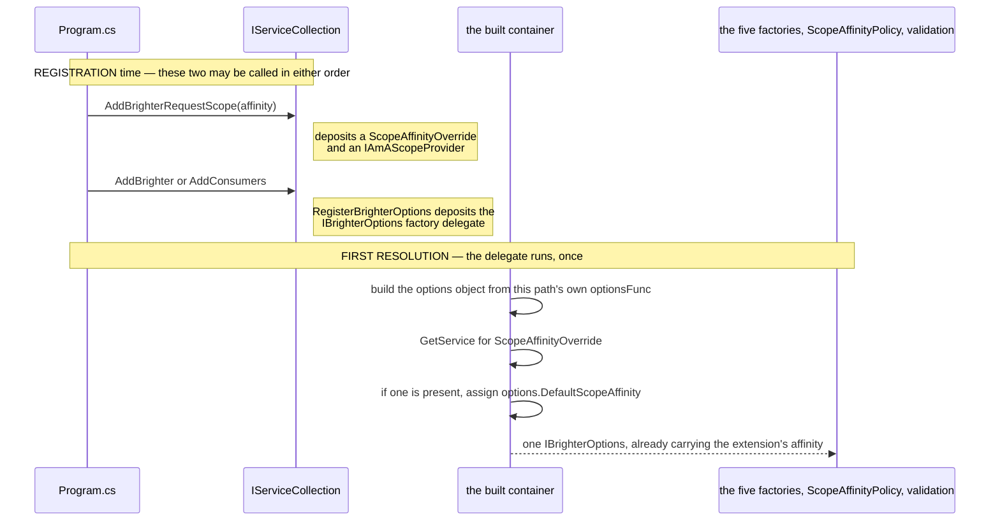
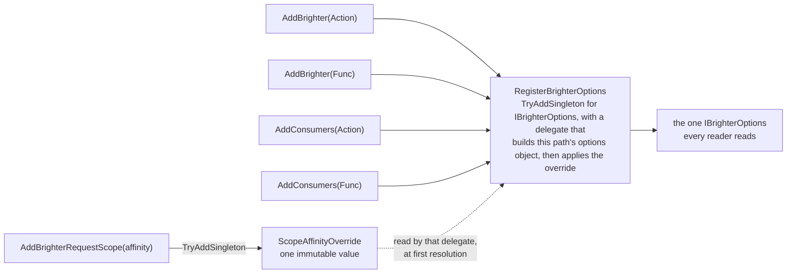
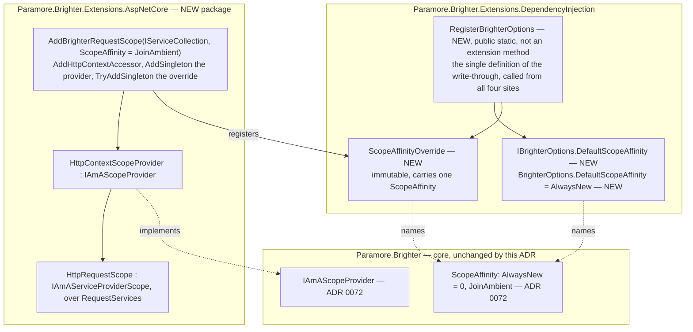

# 73. The scope-affinity opt-in — the option, the ASP.NET registration extension, and the override that carries the affinity onto all four registration paths

Date: 2026-08-02

## Status

Proposed

## Context

ADR 0072 built the seam. A pipeline that takes a pipeline scope asks an `IAmAScopeProvider` exactly once, carrying a `ScopeAffinity` that `ScopeAffinityPolicy` computes from `IBrighterOptions`, and either borrows the ambient the provider offers or creates and owns a scope as it does today. Everything in that mechanism is settled except its input: **nothing yet puts a `ScopeAffinity` on `IBrighterOptions`, and nothing yet registers an ambient source.**

That is this ADR. Two of its three parts are naming; the third is not. Brighter's five container-backed factories read `IBrighterOptions` (`ServiceProviderMapperFactory.cs:44`, and the same two lines in the other four), and `IBrighterOptions` is registered on **four** separate registration paths, only one of which runs an `IOptions` pipeline. An opt-in gesture in a package that knows about none of them has to reach the object all four produce, in any registration order. Getting that wrong makes the opt-in fail silently and totally on three of the four.

**Parent Requirement**: [specs/0036-scoped-lifetime-per-pipeline/requirements.md](../../specs/0036-scoped-lifetime-per-pipeline/requirements.md)

**Scope**: This ADR decides three things that are one gesture — **the opt-in property on `IBrighterOptions`, the ASP.NET package and its single registration extension, and the mechanism by which that extension's affinity argument reaches the object `IBrighterOptions` resolves to on every registration path in every order.** It discharges FR-14, FR-15, FR-17, FR-19 and FR-21, and serves FR-16, FR-18, FR-20, FR-22, FR-23, FR-25.11, NFR-1, NFR-2 and NFR-7.

It does **not** decide where FR-22's validation rules are evaluated — that is ADR 0074. It does not reopen ADR 0072's seam, ADR 0070's transform-pipeline scope or ADR 0071's handler convergence. It changes no lifetime, and it adds no validation rule.

This ADR **supersedes no prior ADR.** It completes the 0070–0072 sequence on the application-facing side.

### Where this ADR sits

Five ADRs deliver the parent requirement, one decision each. This is the fourth, and the only one an application author has to touch anything to use.

| ADR | Decides |
| --- | --- |
| 0070 | a transform pipeline takes one DI scope, carried **as a parameter** |
| 0071 | handler pipelines converge onto the **same handle**, carried on the object they already pass |
| 0072 | how a pipeline discovers an **ambient** DI scope the host owns, and where `Publish` suppression hangs |
| **0073** *(this one)* | the **opt-in** property, the ASP.NET package, and how that setting reaches all four registration paths |
| 0074 | **where** the lifetime and captive-dependency rules are evaluated |

The whole of the opt-in, from an application's side, is one line in `Program.cs`. The work is making that line land on four registration paths that behave differently and can be called in any order.

ADR 0067's `Terms` block defines the two axes used throughout — Brighter's *configured lifetime*, which governs the artefact, and the container's *registration lifetime*, which governs the dependencies. This ADR does not restate it. Per NFR-8, "lifetime scope" is not used for anything introduced here.

### The four registration paths, and what each does with `IBrighterOptions`

There is no `AddServiceActivator`; the consumer entry point is `AddConsumers`. All four route through `ServiceCollectionExtensions.BrighterHandlerBuilder`, which registers `IAmACommandProcessor`, so each alone is a complete Brighter host.

| Entry point | `IBrighterOptions` registration | Registration form | Runs `IOptions`? |
| --- | --- | --- | --- |
| `AddBrighter(Action<BrighterOptions>)` (`Extensions.DependencyInjection/ServiceCollectionExtensions.cs:61`) | `:74` | factory delegate over `IOptions<BrighterOptions>.Value` | **yes** — `AddOptions<BrighterOptions>()` `:69`, `Configure(configure)` `:71` |
| `AddBrighter(Func<IServiceProvider, BrighterOptions>)` (`:88`) | `:97` | factory delegate — the application's own `Func` | no |
| `AddConsumers(Action<ConsumersOptions>)` (`ServiceActivator.Extensions.DependencyInjection/ServiceCollectionExtensions.cs:29`) | `:38` | **a pre-built instance** — `new ConsumersOptions()` `:36`, `configure?.Invoke(options)` `:37` | no |
| `AddConsumers(Func<IServiceProvider, ConsumersOptions>)` (`:78`) | `:88` | factory delegate — the application's own `Func` | no |

Four sites, in two assemblies, and every one of them uses `TryAddSingleton`, so in a mixed producer-plus-consumer host the **first** registration wins (C-12). Three consequences follow and all three are load-bearing here.

- A `services.Configure<BrighterOptions>(...)` contributed by a later package reaches the object the factories read on **one** path. On the other three it reaches nothing at all, because no `IOptions` pipeline exists on them.
- `ConsumersOptions : BrighterOptions` (`ConsumersOptions.cs:10`). The `IOptions` machinery keys on the closed generic type, so a `PostConfigure<BrighterOptions>` would not reach a `ConsumersOptions` even if the consumer paths did run an options pipeline.
- Whichever registration wins the `TryAdd` is the object every reader sees — the five factories, ADR 0072's `ScopeAffinityPolicy`, and ADR 0074's validation. So the affinity must be applied at **every** one of the four sites, not at the one an ADR author happens to be looking at.

### The forces

- **AC-45 asserts the value on the *resolved* `IBrighterOptions`, on all four paths.** Not on `IOptions<BrighterOptions>.Value`, which C-12a shows is a different object on three of them. Its second clause starts each host from a **non-default** affinity and then passes the opposite value to the extension, so an implementation that silently drops the argument fails.
- **AC-48 forbids an ordering rule in as many words**: *"the same holds with the extension call placed before `AddBrighter` as well as after it — the rule is not an ordering rule (C-10)."* Any mechanism that needs the extension to run after the Brighter registration is disqualified by that clause alone.
- **D13 fixes the argument, D18 fixes precedence.** The extension takes the affinity as an explicit argument defaulting to `JoinAmbient`; the argument **is** the value and wins unconditionally. Opting out means passing `AlwaysNew`, or not calling the extension.
- **No sentinel, and none may be introduced** (FR-17). The option stays a plain non-nullable value (FR-14). The direct consequence is that "the application assigned `AlwaysNew`" and "the application left the default" are indistinguishable, which is why assigning the option alongside the extension is a **documented** configuration error (FR-25.11) rather than a validated one.
- **D1 / NFR-2 — no ASP.NET dependency in the DI package.** The ASP.NET package depends on the DI package, never the reverse. Registering the provider **is** the opt-in: no middleware, no per-request call site.
- **FR-15 / AC-14 — a package reference alone changes nothing.** With the extension not called, an `IHttpContextAccessor` spy records **zero** accesses.
- **FR-18 — no `HttpContext` is the ordinary case**, not an error. A hosted service, a consumer pump, a background thread, startup. The provider returns nothing and the pipeline creates its own scope.
- **D2 — one flag governs both pipeline kinds.** There is no way to opt handler pipelines in and transform pipelines out.
- **D5 / FR-21 — affinity applies to `Scoped` only.** `Transient` and `Singleton` are unaffected under either setting. An inert opt-in is validated, never inferred and never silently corrected — but *where* is ADR 0074's.
- **From ADR 0072, fixed**: `IAmAScopeProvider` is registered with plain `AddSingleton`, never `TryAddSingleton`, so every duplicate descriptor stays visible to validation (FR-24.3) while MS DI resolves the last; and the ambient must implement `IAmAServiceProviderScope` for a Microsoft-container-backed factory to resolve from it.

## Decision

**`IBrighterOptions` gains a `ScopeAffinity DefaultScopeAffinity` property defaulting to `ScopeAffinity.AlwaysNew`. A new package `Paramore.Brighter.Extensions.AspNetCore` supplies an `IAmAScopeProvider` over `IHttpContextAccessor`, registered by one `IServiceCollection` extension, `AddBrighterRequestScope(ScopeAffinity affinity = ScopeAffinity.JoinAmbient)`. That extension carries its argument by registering a `ScopeAffinityOverride` singleton, which Brighter's own `IBrighterOptions` factory delegate reads and applies to the options object it is about to hand out — at all four registration sites, so the argument lands after every application options delegate on every path and in every order.**

### The mechanism, end to end

The problem is that an opt-in gesture in a leaf package has to set a value on an object that, on two of the four registration paths, does not exist yet and will not until the container is built. The answer is to stop trying to write to it. **The extension deposits a value into the collection; the one place that does have the object — the factory that produces it — picks the value up.** Those are two different moments, so there is no ordering to get right.



Because the assignment happens *inside* the producer, it necessarily runs after every application-supplied delegate has contributed — after `Configure` on the `IOptions` path, after `configure.Invoke(options)` on the consumer `Action` path, after the application's `Func` has returned on both `Func` paths. That is D18 satisfied by construction rather than by an ordering rule: the extension wins because it writes last, and it writes last because it writes from inside.

All four entry points funnel through the same definition, which is what makes the rule true on every path rather than on the one an author happened to be looking at:



### Where the pieces live



The dependency direction is fixed and is the whole of NFR-2: the ASP.NET package depends on the DI package, the DI package depends on core, and neither of the lower two ever depends upward.

### Key Components

#### The roles, and what each is responsible for

| Role | Type | Stereotype | Responsibility |
| --- | --- | --- | --- |
| The ambient source | `HttpContextScopeProvider` (ASP.NET package) | **deciding** | Answers, for one pipeline carrying one affinity, whether there is a request scope it may adopt. Creates nothing, owns nothing, disposes nothing |
| The ambient scope | `HttpRequestScope : IAmAServiceProviderScope` (ASP.NET package) | **knowing** (information holder) | Names `HttpContext.RequestServices` as the provider a pipeline adopting this ambient resolves from. Disposal is a no-op: ASP.NET owns the request scope |
| The affinity override | `ScopeAffinityOverride` (DI package) | **knowing** (information holder) | Carries one value — the affinity the opt-in gesture selected. It decides nothing and does nothing; it exists so the value has a type and a place to sit in the collection |
| The options object | `BrighterOptions` / `ConsumersOptions` behind `IBrighterOptions` | **knowing** | The single object every reader takes configuration from: the five factories, `ScopeAffinityPolicy` (ADR 0072), and validation (ADR 0074) |
| The registration extension | `AddBrighterRequestScope` | **doing** (structurer) | Puts the ambient source and the override into the service collection. It is the whole of the opt-in |
| The options registration | `RegisterBrighterOptions` (DI package) | **doing** | Produces the options object each path supplies and applies the override to it before anyone can read it |

The division that matters is between the **override** and the **options object**. The override knows what the application asked for; the options object is what every reader reads. Keeping them as two roles rather than one is what makes the mechanism order-independent: the override can be registered before the options object exists, because it is not the options object.

#### The opt-in property (change, DI package, public)

```csharp
namespace Paramore.Brighter.Extensions.DependencyInjection
{
    public class BrighterOptions : IBrighterOptions
    {
        /// <summary>
        /// Selects whether a Scoped pipeline creates its own DI scope or joins an ambient DI scope the
        /// host already owns, where an ambient source offers one. Applies to Scoped handlers, mappers
        /// and transforms only: Transient and Singleton are unaffected under either setting (FR-21).
        /// Defaults to AlwaysNew, which is exactly today's behaviour.
        /// </summary>
        public ScopeAffinity DefaultScopeAffinity { get; set; } = ScopeAffinity.AlwaysNew;

        // ...existing members unchanged
    }

    public interface IBrighterOptions
    {
        ScopeAffinity DefaultScopeAffinity { get; set; }

        // ...existing members unchanged
    }
}
```

**Contract.**

| Member | Input | Output | Error conditions |
| --- | --- | --- | --- |
| `DefaultScopeAffinity` | a `ScopeAffinity`; the property is non-nullable and has no "unset" value (FR-14, FR-17) | the affinity every pipeline in this host starts from, before `ScopeAffinityPolicy` narrows it over the participating set (FR-27.2) and before `Publish` suppression forces `AlwaysNew` (FR-8) | Cannot throw. An out-of-range enum value is not defensible against and is not defended against: any value that is not `JoinAmbient` behaves as `AlwaysNew`, because `ScopeAffinityPolicy` tests for `JoinAmbient` positively. Setting it while also calling the registration extension is a configuration error whose outcome is the extension's value — documented (FR-25.11), not validated |

Four things about this shape.

**It is a `ScopeAffinity`, not a `bool`.** D13 already fixes the registration extension's argument as a `ScopeAffinity`, and D4 fixes the enum's name and its two values. A `bool AdoptAmbientScope` would give one concept two spellings — `AdoptAmbientScope = true` at the setting site and `ScopeAffinity.JoinAmbient` at the extension call one line away — and the guidance page (FR-25.11) would have to teach the mapping between them. It would also close the door on a third affinity without a breaking change. The `bool` is a genuine alternative with a genuine advantage, recorded below.

**`ConsumersOptions : BrighterOptions`** (`ConsumersOptions.cs:10`), so both consumer paths inherit the property with no separate work, and the affinity is settable in an `AddConsumers` delegate exactly as it is in an `AddBrighter` one. FR-19 makes the setting inert on the consumer side — every consumer pipeline creates and owns its scope, and the only permitted difference is at most two latched `Warning` entries for the life of the host. That inertness is about *pump-driven* pipelines: a `Send` issued from a controller in a host registered through `AddConsumers` is a producer-side pipeline and does adopt, which is what AC-45's second clause exercises on the two `AddConsumers` paths.

**Adding a member to `IBrighterOptions` is a source and binary break for any hand-rolled implementation**, and `netstandard2.0` has no default interface member to absorb it. The blast radius is small and is stated rather than assumed: a repository-wide search for implementations of `IBrighterOptions` finds **exactly one** in `src/` — `BrighterOptions` (`BrighterOptions.cs:9`) — and **none** in `tests/`; every test that needs one constructs a `BrighterOptions`. Nothing in the repository breaks. An application that implemented the interface by hand does, and that is a third break to record in `release_notes.md` alongside FR-20's behavioural break and FR-22.2's compatibility break (C-18, AC-24).

**It is not a compatibility flag.** `IsolateTransientHandlerScope` (`BrighterOptions.cs:37`) exists to restore pre-#4254 behaviour and is documented as a fallback for code that cannot move to `Scoped`; D3 rules out any equivalent flag for the `MapperLifetime.Scoped` break. `DefaultScopeAffinity` selects a *feature*. The two do not interact: `IsolateTransientHandlerScope` governs `Transient` handlers only, and FR-21 confines affinity to `Scoped`, so their domains do not intersect at any lifetime.

#### `ScopeAffinityOverride` — the value the extension carries (new, DI package, public)

```csharp
namespace Paramore.Brighter.Extensions.DependencyInjection
{
    /// <summary>
    /// The scope affinity selected by an opt-in registration extension. Registering one of these is how
    /// a package that knows nothing about Brighter's registration paths sets the default affinity on
    /// whichever options object IBrighterOptions resolves to, in any registration order. It wins over
    /// any affinity the application assigned itself (D18).
    /// </summary>
    public sealed class ScopeAffinityOverride
    {
        public ScopeAffinityOverride(ScopeAffinity affinity) => Affinity = affinity;

        public ScopeAffinity Affinity { get; }
    }
}
```

**Contract.**

| Member | Input | Output | Error conditions |
| --- | --- | --- | --- |
| `Affinity` | none | the affinity the opt-in gesture selected | Cannot throw. Immutable after construction, so a reader cannot observe it changing between the moment `IBrighterOptions` is built and the moment a pipeline reads it |
| *(the type as a service)* | resolved with `GetService`, never `GetRequiredService` | `null` where no extension was called — the ordinary case for every host that does not opt in | Absence is not an error; it is the default configuration (FR-15) |

It lives in the DI package, not core: core may name no container type and this type exists only to be a service in a Microsoft service collection, but it names only `ScopeAffinity`, a core type, so it adds nothing to core's compile closure and the AC-22.3 source-level guard is untouched. It is public because the ASP.NET package is a separate assembly; `InternalsVisibleTo` was rejected for the reason ADR 0072 gives about suppression — the mechanism must be available to a package Brighter does not ship, since NFR-7 anticipates other ambient sources.

It is a type rather than a bare `ScopeAffinity` registered as a service because registering an enum as a service type is the primitive-obsession failure: `GetService(typeof(ScopeAffinity))` names nothing, collides with any other use of the enum as a service, and cannot be told apart from a default value. The wrapper names the role.

#### `RegisterBrighterOptions` — where the override is applied (new, DI package, public static, not an extension method)

```csharp
// Paramore.Brighter.Extensions.DependencyInjection.ServiceCollectionExtensions
// Public so that the ServiceActivator DI package can call it. DON'T CALL THIS DIRECTLY.
public static void RegisterBrighterOptions(
    IServiceCollection services,
    Func<IServiceProvider, BrighterOptions> optionsFunc)
{
    services.TryAddSingleton<IBrighterOptions>(sp =>
    {
        var options = optionsFunc(sp);
        var over = sp.GetService<ScopeAffinityOverride>();
        if (over is not null)
            options.DefaultScopeAffinity = over.Affinity;   // D18: the extension wins
        return options;
    });
}
```

It is declared like `BrighterHandlerBuilder` (`:119`, `:142`) — public, not an extension method, carrying a "DON'T CALL THIS DIRECTLY" doc comment — so it does not appear in IntelliSense on `services.` beside `AddBrighter`, but is reachable from the ServiceActivator DI package, which already calls `ServiceCollectionExtensions.BrighterHandlerBuilder` across the assembly boundary.

**Every one of the four registration sites is rewritten to call it**, and each keeps its own `optionsFunc`. This is the family the rule is stated over, and each member is stated:

| Site | Today | After |
| --- | --- | --- |
| `Extensions.DependencyInjection/ServiceCollectionExtensions.cs:74` | `TryAddSingleton<IBrighterOptions>(sp => sp.GetRequiredService<IOptions<BrighterOptions>>().Value)` | `RegisterBrighterOptions(services, sp => sp.GetRequiredService<IOptions<BrighterOptions>>().Value)`. The `AddOptions`/`Configure` pair at `:69-71` and the `BrighterHandlerBuilder` call at `:77-79` are unchanged |
| `Extensions.DependencyInjection/ServiceCollectionExtensions.cs:97` | `TryAddSingleton<IBrighterOptions>(configure)` | `RegisterBrighterOptions(services, configure)`. `:98-100` unchanged |
| `ServiceActivator.Extensions.DependencyInjection/ServiceCollectionExtensions.cs:38` | `TryAddSingleton<IBrighterOptions>(options)` — **the one instance registration** | `RegisterBrighterOptions(services, _ => options)`. `:39`'s `TryAddSingleton<IAmConsumerOptions>(options)` stays an **instance** registration — see below. `:64`'s `BrighterHandlerBuilder(services, options)` unchanged |
| `ServiceActivator.Extensions.DependencyInjection/ServiceCollectionExtensions.cs:88` | `TryAddSingleton<IBrighterOptions>(configure)` | `RegisterBrighterOptions(services, configure)`. `:89-90`'s `IAmConsumerOptions` cast and `:131-133`'s `BrighterHandlerBuilder` unchanged |

Three details of that table are behavioural and must be stated, not glossed.

**One site converts a pre-built instance into a factory delegate, and that is a real change with a null effect here.** MS DI does not dispose an instance the developer registered; it does dispose whatever a factory delegate returns, if it is `IDisposable`. Neither `BrighterOptions` nor `ConsumersOptions` implements `IDisposable`, and neither `IBrighterOptions` nor `IAmConsumerOptions` extends it, so nothing changes today. It becomes live the day either options type gains a disposable member, and that is worth knowing. What the delegate does *not* defer is construction: `new ConsumersOptions()` and `configure?.Invoke(options)` still run at `:36-37`, at registration time, because `:45` onwards reads `options.InboxConfiguration` to decide which inbox descriptors to add. Only the override's application is deferred to first resolution.

**`IAmConsumerOptions` on the `Action` path stays an instance registration, deliberately.** The obvious tidy — make `:39` mirror `:89-90`'s `sp => (IAmConsumerOptions)sp.GetRequiredService<IBrighterOptions>()` so both service types route through one point — would import the `Func` overload's defect onto the `Action` path. In a mixed host with `AddBrighter` first, `IBrighterOptions` resolves to a `BrighterOptions`, which is not an `IAmConsumerOptions`, and the cast throws `InvalidCastException` (`:89-90`). That is pre-existing and not caused here, and the `Action` overload is the one every mixed-host Acceptance Criterion is required to use precisely because it does not have it. Leaving `:39` alone keeps it that way.

**The residue is smaller than it first looks, and it is worth being exact about, because "the two registrations disagree" would be a serious objection if it were true.** On the `Action` path both service types name the *same* `ConsumersOptions` instance, and only the `IBrighterOptions` factory applies the override — so between a first resolution of `IAmConsumerOptions` and a first resolution of `IBrighterOptions`, that object's `DefaultScopeAffinity` still holds whatever the application set. That state is **not reachable through the `IAmConsumerOptions` contract**: `IAmConsumerOptions` is a *core* interface (`src/Paramore.Brighter/IAmConsumerOptions.cs:7`) with five members — `DefaultChannelFactory`, `InboxConfiguration`, `Subscriptions`, `InstrumentationOptions`, `ShutdownTimeout` — and the affinity is on `IBrighterOptions`, which is a DI-package interface it does not extend. Observing the discrepancy would require downcasting to `ConsumersOptions` or `IBrighterOptions`; no consumer of `IAmConsumerOptions` in `src` or `tests` does that, and every one of them reads only subscriptions, the channel factory or the inbox. So the choice is between spreading a known crash and tolerating a state that the interface cannot express.

**In a mixed host the winner of the `TryAdd` applies the override, and both sides now do.** `IBrighterOptions` is `TryAddSingleton` in both assemblies, so first registration wins, whichever it is. Because all four sites route through `RegisterBrighterOptions`, whichever descriptor survives applies the override. A host where `AddConsumers(Action)` registers first gets the affinity on its `ConsumersOptions`; a host where `AddBrighter` registers first gets it on its `BrighterOptions`; in both, that is the object the factories read. The losing side's options object never receives the override and is never read for affinity. Applying it at only one of the two assemblies' sites would have made the opt-in depend on registration order in exactly the way AC-48 forbids.

#### The ASP.NET package and its extension (new package)

```csharp
namespace Microsoft.Extensions.DependencyInjection      // the conventional home for an IServiceCollection extension
{
    public static class BrighterAspNetCoreExtensions
    {
        /// <summary>
        /// Registers ASP.NET Core's per-request DI scope as Brighter's ambient scope, and selects the
        /// scope affinity Brighter's Scoped pipelines use. Call it once, in any order relative to
        /// AddBrighter or AddConsumers. Pass ScopeAffinity.AlwaysNew to register the ambient source
        /// without opting in. Not calling it at all leaves Brighter exactly as it is today.
        /// </summary>
        public static IServiceCollection AddBrighterRequestScope(
            this IServiceCollection services,
            ScopeAffinity affinity = ScopeAffinity.JoinAmbient)
        {
            services.AddHttpContextAccessor();
            services.AddSingleton<IAmAScopeProvider, HttpContextScopeProvider>();   // plain AddSingleton — ADR 0072, FR-24.3
            services.TryAddSingleton(new ScopeAffinityOverride(affinity));
            return services;
        }
    }
}
```

**Contract.**

| Member | Input | Output | Error conditions |
| --- | --- | --- | --- |
| `AddBrighterRequestScope(IServiceCollection, ScopeAffinity)` | the affinity, defaulting to `JoinAmbient` (D13) | the same collection, for chaining | Throws `ArgumentNullException` on a null collection, matching `AddBrighter` (`:65-66`). It never throws on ordering, never inspects an existing descriptor, and never alters a lifetime (FR-17, FR-21). Calling it twice is a configuration error it does not throw on — see below |
| `HttpContextScopeProvider.GetAmbient(ScopeAffinity)` | the asking pipeline's affinity | an `HttpRequestScope` over `HttpContext.RequestServices` when the affinity is `JoinAmbient` and an `HttpContext` is current; otherwise `null` | Must not throw where there is no current `HttpContext` — a hosted service, a consumer pump, a background thread, startup (FR-18). It neither consults `IHttpContextAccessor` nor returns anything on an `AlwaysNew` ask (D16, FR-24.4). It does not probe the ambient for staleness; that is the DI package's question and ADR 0072 answers it |
| `HttpRequestScope.Services` | none | `HttpContext.RequestServices` | Never null. May name a scope ASP.NET has already disposed — FR-23's case, which ADR 0072's probe catches before anything is resolved. `Dispose()` and `DisposeAsync()` are no-ops: ASP.NET owns the request scope (FR-12, C-7) |

`AddHttpContextAccessor()` is Microsoft's own idempotent `TryAddSingleton<IHttpContextAccessor, HttpContextAccessor>()`, so it is safe alongside an application that already called it. `IAmAScopeProvider` is registered with **plain `AddSingleton`, never `TryAddSingleton`**, exactly as ADR 0072 requires, so a duplicate descriptor stays visible to FR-24.3's validation while MS DI resolves the last.

**Two calls to the extension do not stack**, because `ScopeAffinityOverride` is `TryAddSingleton`: the **first** call's affinity is the effective one and the second call's argument is discarded. That is the right default for three reasons and one honest cost. It keeps the override single-valued, so no reader has to disambiguate a set. It matches how every other Brighter-owned singleton in the registration path is registered. And the double call is not silent overall: the same two calls also add **two** `IAmAScopeProvider` descriptors of the same implementation type, which is precisely FR-24.3's duplicate-provider condition and is reported as a `Warning` by whatever ADR 0074 decides evaluates it. The cost is an asymmetry: the *effective provider* is the last descriptor and the *effective affinity* is the first, so two calls carrying different affinities give a host whose two halves disagree. There is no correct answer to "which of two contradictory opt-ins did you mean", and the configuration is diagnosable; that is the trade, recorded rather than argued away.

#### The three C-11 working names

**`Paramore.Brighter.Extensions.AspNetCore` — kept.** The `Paramore.Brighter.Extensions.*` family names the Microsoft extension surface being integrated: `DependencyInjection`, `Diagnostics`, `OpenTelemetry`, and on the consumer side `ServiceActivator.Extensions.Hosting`. `AspNetCore` is that pattern applied to ASP.NET Core, and it makes the dependency direction legible from the package name alone.

**`IAmAScope? GetAmbient(ScopeAffinity affinity)` — kept.** The contract is fixed by D17 and is not open. The spelling says what the member does — it *gets an ambient*, it does not create, begin or open one — and the noun is the one FR-17 and FR-24 use throughout. `TryGetAmbient` was considered and rejected: the `Try*` convention implies an `out` parameter and a `bool` return, and a nullable return already says the same thing more directly. `GetAmbientScope` is redundant beside a return type of `IAmAScope`.

**`AddBrighterAspNetCoreScopes(...)` — rejected, and replaced by `AddBrighterRequestScope(ScopeAffinity affinity = ScopeAffinity.JoinAmbient)`.** The old spelling is wrong in three ways. Its plural implies more than one thing is registered, when it is one ambient source. Its noun implies the extension creates scopes, when the whole of D11 is that it creates none: ASP.NET creates the request scope and Brighter borrows it. And it is long enough to read as a framework incantation rather than a configuration line.

The constraints on the replacement are all real and all narrow the field:

- **It must extend `IServiceCollection`, not `IBrighterBuilder`.** An `IBrighterBuilder` extension is only reachable from the value `AddBrighter`/`AddConsumers` returns, which would make "call the extension before `AddBrighter`" unexpressible — and AC-48 requires exactly that ordering to work.
- **`Use*` is wrong.** In .NET generally `Use*` belongs to `IApplicationBuilder`; in Brighter specifically `Use*` already means "an `IBrighterBuilder` extension" — `UseScheduler`, `UseOutboxSweeper`, `UseOutboxArchiver`, `UseFluentValidation`, `UseAsyncApi`, `UseExternalLuggageStore`, `UseBoxProvisioning`, `UsePublicationFinder`. Every `Use*` in the repository extends `IBrighterBuilder`. A `Use*` here would be wrong twice over.
- **`Add*` is right and the prefix should be `AddBrighter`.** The `IServiceCollection` extensions the application sees are `AddBrighter` and `AddConsumers`; `AddProducers` and `AddControl` extend `IBrighterBuilder`. `AddBrighterRequestScope` sorts next to `AddBrighter` in IntelliSense, which is where a reader looking for Brighter's registration surface will be.
- **Singular, and naming what is registered.** One ambient source, and the thing it makes ambient is ASP.NET's request scope.

Rejected candidates, with what each had going for it:

| Candidate | Real advantage | Why rejected |
| --- | --- | --- |
| `AddBrighterAspNetCoreScopes(...)` | says which framework | plural; implies Brighter creates scopes; longest of the candidates |
| `AddBrighterHttpRequestScope(...)` | removes any confusion with Brighter's own `IRequest` | one character shorter than the name being replaced, so it does not fix the complaint that prompted the rename |
| `AddBrighterAmbientScope(...)` | uses the normative term for the concept — *ambient scope* is a DI scope the host owns | claims the general name for the ASP.NET case. NFR-7 anticipates an `AsyncLocal`-backed provider for non-ASP.NET hosts; that package would have the better claim on the generic spelling |
| `UseBrighterRequestScope(...)` | reads naturally in `Program.cs` | `Use*` means `IBrighterBuilder` in this codebase and `IApplicationBuilder` in .NET; this is neither |
| `AddBrighterScopeAffinity(affinity)` | names the argument | names the *setting* rather than what is registered, and would suggest it works without an ambient source, which it does not |

The residual cost of `AddBrighterRequestScope` is stated rather than hidden: Brighter's own vocabulary uses "request" for a command, event or query (`IRequest`, `RequestContext`, `RequestHandlerAttribute`), so "request scope" could be misread as "the scope of a Brighter request". Two things make that tolerable — the method lives in a package whose name says ASP.NET Core, and Brighter has no existing "request scope" concept for it to collide with, since the normative terms are *pipeline scope* and *ambient scope*. The XML doc comment says "ASP.NET Core's per-request DI scope" in its first line for that reason.

#### Where each type is touched

| Assembly | Type | Change |
| --- | --- | --- |
| `…Extensions.DependencyInjection` | `IBrighterOptions` (`BrighterOptions.cs:72`) | gains `ScopeAffinity DefaultScopeAffinity { get; set; }` — a source and binary break for a hand-rolled implementation |
| `…Extensions.DependencyInjection` | `BrighterOptions` (`:9`) | gains the property, defaulting to `AlwaysNew` |
| `…Extensions.DependencyInjection` | `ScopeAffinityOverride` | **new** |
| `…Extensions.DependencyInjection` | `ServiceCollectionExtensions` | **new** `RegisterBrighterOptions`; `:74` and `:97` call it |
| `…ServiceActivator.Extensions.DependencyInjection` | `ServiceCollectionExtensions` | `:38` and `:88` call `RegisterBrighterOptions`; `:38` stops registering an instance for `IBrighterOptions`. `:39`, `:89-90` unchanged |
| `…ServiceActivator.Extensions.DependencyInjection` | `ConsumersOptions` (`:10`) | **no change** — it inherits the property from `BrighterOptions` |
| `Paramore.Brighter.Extensions.AspNetCore` | `BrighterAspNetCoreExtensions`, `HttpContextScopeProvider`, `HttpRequestScope` | **new package**, referencing `Paramore.Brighter.Extensions.DependencyInjection` and `Microsoft.AspNetCore.Http` |

Unchanged, and named so the omissions are not read as oversights: `Paramore.Brighter` gains nothing at all, so AC-22.3's source-level guard is untouched and NFR-1 holds trivially; `Paramore.Brighter.Extensions.DependencyInjection` gains no ASP.NET reference (NFR-2); `IsolateTransientHandlerScope` (`BrighterOptions.cs:37`) and the three lifetime properties (`:20`, `:52`, `:69`); `BrighterHandlerBuilder` (`:119`, `:142`), including the `ScopedArtefactCache` and `AmbientScopeDiagnostics` registrations ADR 0072 adds there; `ConsumerOwnsValidation = true` (`:60`, `:127`); every `TryAdd` in `BrighterHandlerBuilder`, so registration precedence is exactly as it is today; and every rule in ADR 0072's `CreatePipelineScope()` protocol.

### Technology Choices

**Why the override is read inside Brighter's own `IBrighterOptions` factory, rather than written from the extension.** The extension runs at registration time, on a collection, and cannot see the object it needs to write to — on two of the four paths that object does not exist yet and will not until first resolution; on a third it exists only as a descriptor's `ImplementationInstance`; on the fourth it is produced by the `IOptions` pipeline. Inverting the direction removes the problem entirely: the extension deposits a value, and the one place that *does* have the object — the factory that produces it — picks the value up. Neither half needs to know when the other ran.

**Why this necessarily satisfies D18.** The assignment happens inside the factory delegate that produces the options object, which by construction runs after every application-supplied delegate has contributed to it: after `Configure(configure)` on the `IOptions` path, after `configure.Invoke(options)` on the consumer `Action` path, and after the application's `Func` has returned on both `Func` paths. There is no ordering to get right because there is no ordering: the extension wins because it writes last, and it writes last because it writes from inside the producer.

**Why the value is applied to the options object rather than read at each use site.** AC-45's first Then asserts the affinity *on the resolved `IBrighterOptions`*, so a design in which the factories consult `ScopeAffinityOverride` directly and never write through fails it outright. There is a deeper reason to prefer write-through: ADR 0074's validation must read the configuration **as the factories see it**, and ADR 0072's `ScopeAffinityPolicy` reads `IBrighterOptions`. One source of truth for four readers is the point of having an options object at all.

**Why `GetService` and not `GetRequiredService`.** No override registered is the ordinary configuration — every host that has not opted in, which is every host that exists today. Absence must be silent (FR-15), so the read must tolerate it. This matches how the factories already read `IBrighterOptions` itself: `ServiceProviderMapperFactory.cs:44` uses `GetService` and falls back to a default.

**Thread safety.** MS DI creates a singleton once, under its own lock, so the write to `DefaultScopeAffinity` happens exactly once and completes before any caller holds the reference the factory returns. No reader can observe the object in a half-configured state (NFR-4).

### Implementation Approach

**1. Add the property.** `ScopeAffinity DefaultScopeAffinity { get; set; }` on `IBrighterOptions` and `= ScopeAffinity.AlwaysNew` on `BrighterOptions`. This depends on ADR 0072 having added `ScopeAffinity` to core; until then the DI package cannot name it. Nothing else in this ADR compiles before that.

**2. Add `ScopeAffinityOverride`** to the DI package, and `RegisterBrighterOptions` to `ServiceCollectionExtensions` beside `BrighterHandlerBuilder`.

**3. Move all four registration sites onto it, in one commit.** `:74`, `:97`, and the ServiceActivator package's `:38` and `:88`. Partial adoption gives a host whose opt-in works on some entry points and not others, which is the failure mode FR-17 exists to prevent. The ServiceActivator package's `:39` and `:89-90` are explicitly *not* touched.

**4. Build the ASP.NET package.** A `netstandard2.0`-and-up class library referencing `Paramore.Brighter.Extensions.DependencyInjection` and `Microsoft.AspNetCore.Http` (for `IHttpContextAccessor` and `AddHttpContextAccessor`). Three types: the extension class, `HttpContextScopeProvider`, `HttpRequestScope`. The provider's whole body is a null check on `_accessor.HttpContext`, an affinity check, and a wrap; the scope's is a property and two no-op disposals. FR-15 and AC-14 hold by construction: nothing in the package runs unless the extension is called, so the `IHttpContextAccessor` spy records zero accesses in a host that only takes the package reference.

**5. `AlwaysNew` short-circuits in the provider as well as in Brighter.** D16 requires the ask to be made even under `AlwaysNew`, so the decision is observable; FR-10 requires the provider neither to consult nor to adopt on such an ask. `HttpContextScopeProvider` therefore returns `null` before touching `IHttpContextAccessor`. Brighter ignores an ambient returned for an `AlwaysNew` ask anyway (FR-24.4, ADR 0072), so this is the provider honouring its half of a contract Brighter also guards.

**6. Documentation.** FR-25.11 requires the guidance page to state the three gestures explicitly: opt in with `AddBrighterRequestScope()`; register the ambient source without opting in with `AddBrighterRequestScope(ScopeAffinity.AlwaysNew)`; opt out entirely by not calling the extension. It must also state that assigning `DefaultScopeAffinity` while calling the extension is a configuration error whose outcome is the extension's value, in any order and on any path, and that it is **not** reported by validation. `release_notes.md` gains the `IBrighterOptions` member as a third break (C-18, AC-24).

**7. What this leaves to ADR 0074.** Where FR-22's rules and FR-24.3's duplicate-provider rule are evaluated. This ADR fixes what they read — `DefaultScopeAffinity` on the object `IBrighterOptions` resolves to, with the override already applied — and adds no rule of its own. In particular it adds no rule against the FR-17 configuration error, deliberately: without the sentinel FR-17 bans, that configuration is indistinguishable from the ordinary opt-in, and a rule comparing values would fire on every default host that called `AddBrighterRequestScope()`.

## Consequences

### Positive

- **The opt-in is one line, and it is the same line on all four entry points.** `services.AddBrighterRequestScope();` in `Program.cs`, in any position relative to `AddBrighter` or `AddConsumers`. No middleware, no per-request call site, no ordering rule to get wrong (D1, C-10).
- **Order-independence is structural, not tested-in.** The mechanism has no ordering to get wrong: the extension writes to the collection, the options factory reads from the container. AC-48's before-ordering clause and AC-45's four-path clause pass for the same reason.
- **One definition of the write-through, four call sites.** `RegisterBrighterOptions` holds the knowledge once. A fifth registration path added later gets the behaviour by calling it, and a reviewer can see at a glance whether it did.
- **The default is exactly today's behaviour.** `AlwaysNew` is the property's default and `ScopeAffinity.AlwaysNew` is `0`, so a `BrighterOptions` that nobody configured, and any options object produced by any path, adopts nothing (FR-15).
- **Adding the package reference without calling the extension changes nothing**, and the `IHttpContextAccessor` spy records zero accesses (AC-14). The package has no module initializer, no assembly scanning hook and no auto-registration.
- **Core gains nothing.** Every type here is in the DI package or the new ASP.NET package. NFR-1's source-level clause is untouched and NFR-2 holds by the dependency direction of the new package.
- **The seam stays implementable off ASP.NET.** `ScopeAffinityOverride` names only `ScopeAffinity`, so an `AsyncLocal`-backed provider package for console hosts registers its provider and its override in exactly the same two lines (NFR-7).
- **`Transient` and `Singleton` are untouched** under either setting (FR-21). An application that opts in and leaves the lifetimes at their `Transient` defaults gets identical behaviour to today — reported by validation, never silently corrected (D5).

### Negative

- **`IBrighterOptions` gains a member, which is a source and binary break** for any application that implemented it by hand. There is no default interface member on `netstandard2.0` to absorb it. Nothing in this repository implements it — one implementation in `src/`, none in `tests/` — but "we could not find one" is not "there is none", and this is a third entry in `release_notes.md` beside FR-20's behavioural break and FR-22.2's compatibility break.
- **Four registration sites change, and one of them changes shape.** The ServiceActivator `Action` overload's `IBrighterOptions` registration stops being an instance and becomes a delegate. It is inert today because neither options type is `IDisposable`, but it moves the object from "the container will never dispose this" to "the container will dispose this if it ever becomes disposable". That is a latent behaviour change parked in the code for someone to trip over later.
- **The write mutates an object the application may still hold.** On the two `Func` paths and the consumer `Action` path the application constructs the options object itself. After the host is built, its own reference reads back the extension's affinity, not the one it set. That is D18 working as specified, and it will still surprise someone.
- **The consumer `Action` path keeps two registrations of one object, and only one of them applies the override.** Routing `IAmConsumerOptions` through `IBrighterOptions` would unify them, and would import the `Func` overload's `InvalidCastException` onto the one consumer path that does not have it — so the asymmetry is kept deliberately. It is unobservable rather than harmless: `IAmConsumerOptions` has no affinity member, so nothing that holds only that interface can see the difference. What is genuinely paid is legibility. A reader of `:38-39` now sees two adjacent registrations of the same instance that behave differently, and the reason is in this ADR rather than at the call site; a comment at `:39` is the mitigation, and a comment is a weak one.
- **Two calls to the extension disagree with themselves.** `TryAddSingleton` on the override means the first affinity wins, while plain `AddSingleton` on the provider (ADR 0072, FR-24.3) means the last provider wins. A host that calls the extension twice with different affinities gets the first call's affinity and the second call's provider. It is diagnosable — the duplicate provider is FR-24.3's warning — but only for an application that calls `ValidatePipelines()`.
- **The configuration error FR-17 names is genuinely unreportable.** An application that assigns `DefaultScopeAffinity = AlwaysNew` and calls `AddBrighterRequestScope()` silently gets `JoinAmbient`. With no sentinel it is indistinguishable from the ordinary opt-in on a default host, so no validation rule can catch it without firing on every correct opt-in. The only mitigation is documentation (FR-25.11), and documentation is a weaker mitigation than a rule.
- **C-15's residual gap is untouched and this ADR widens what falls into it.** An application that opts in, leaves every lifetime `Transient` and never calls `ValidatePipelines()` gets no signal at all: nothing adopts, nothing warns, and the one-line opt-in it added does nothing. Accepted, and it is the strongest argument for FR-25's decision guide.
- **A new package is a new package.** A NuGet artefact, a build target, a release cadence and a version matrix, for three small types. That is the price of NFR-2, and NFR-2 is worth it: an ASP.NET reference in the DI package would land on every consumer host and every console producer in the ecosystem.

### Risks and Mitigations

| Risk | Mitigation |
| --- | --- |
| A fifth registration path is added later and does not apply the override, so the opt-in fails silently on it | The write-through has exactly one definition, `RegisterBrighterOptions`, and the four existing sites are its only callers. AC-45 enumerates all four; a fifth path would need a fifth clause, and the absence of one is visible |
| The extension is called before `AddBrighter` and the affinity is lost | The mechanism has no ordering: the override is a service, not a mutation of a descriptor. AC-48's second clause and AC-45's four-path clause both assert the before-ordering, and both start from a non-default affinity so a dropped argument fails them |
| A mixed host applies the override to the losing options object | All four sites apply it, so whichever `TryAdd` wins carries it. AC-43's mixed-host configuration states which entry point registers first and which `AddConsumers` overload is used, per C-12 |
| An application sets the affinity itself and gets the extension's value without knowing | Documented in `docs/guides/lifetimes-and-scoping.md` (FR-25.11) with the correct gesture for each of the three intents, and pinned in both directions by AC-48 so the rule cannot drift to "the more permissive value wins" |
| The ASP.NET provider throws in a host with no `HttpContext` — a hosted service, a pump thread, startup | The provider null-checks `IHttpContextAccessor.HttpContext` and returns `null`; the pipeline then creates and owns a scope exactly as if not opted in (FR-18). AC-19 asserts zero entries at `Error` or above and exactly one latched `Warning` across two such calls |
| A stale `HttpContext.RequestServices` reaches Brighter's resolution and throws `ObjectDisposedException` | The provider does not probe; ADR 0072's usability probe runs on the DI package's side before anything is resolved from the ambient, and a failed probe declines and creates (FR-23, AC-29). Splitting it that way keeps the provider implementable by anyone |
| Adding a member to `IBrighterOptions` breaks a downstream implementation nobody knew about | The break is stated in `release_notes.md` with the migration — add the property, default it to `AlwaysNew` — which is a one-line change (AC-24) |
| `AddBrighterRequestScope` is read as "Brighter request" rather than "HTTP request" | The package name says ASP.NET Core, the XML doc's first line says "ASP.NET Core's per-request DI scope", and Brighter has no competing "request scope" concept — its normative terms are *pipeline scope* and *ambient scope* (NFR-8) |

## Alternatives Considered

**1. Do nothing — no opt-in property and no ASP.NET package.** ADRs 0070 and 0071 close the actual defects; ADR 0072's seam would then exist with no in-repository ambient source, usable only by an application that writes its own `IAmAScopeProvider`. **Rejected**, but it is the honest alternative and it is worth naming what it costs: FR-16's case — a Brighter handler and the controller that called it resolving the same `DbContext`, and a Darker query handler in the same action resolving it too — is the reason the specification was raised, and it is unreachable without an opt-in and an ASP.NET provider.

**2. A `bool AdoptAmbientScope` instead of a `ScopeAffinity` property.** **Rejected.** Its advantage is real and is the reason C-9 left it open: at the setting site `AdoptAmbientScope = true` reads as the yes/no question the user is actually answering, where `DefaultScopeAffinity = ScopeAffinity.JoinAmbient` reads as jargon. But D13 fixes the extension's argument as a `ScopeAffinity` and D4 fixes the enum, so a `bool` gives one concept two spellings a line apart, forces the guidance page to teach the mapping, and makes the FR-22.1 error message name a setting whose spelling differs from the gesture that produced it. It also forecloses a third affinity without a breaking change.

**3. Descriptor rewriting — find the existing `IBrighterOptions` descriptor and wrap it.** The extension locates the `ServiceDescriptor` for `IBrighterOptions` in the collection, removes it, and re-adds one whose factory calls the original and then assigns the affinity. No new service type, no change to any of the four registration sites. **Rejected, and this is the obvious approach that AC-48 kills.** On the before-ordering — the extension called before `AddBrighter` or `AddConsumers` — there is no descriptor to find, so the extension does nothing and the opt-in is lost. AC-48's second clause asserts that ordering explicitly. A variant that registers a marker and rewrites on first resolution is not available either: MS DI freezes the collection when the provider is built, and there is no callback between the last registration and that build. A second, independent objection: on the consumer `Action` path the descriptor's `ImplementationInstance` is also registered as `IAmConsumerOptions`, so rewriting one service type quietly changes the object behind another.

**4. Bring all four paths onto `IOptions` and use `PostConfigure`.** FR-17 names this as the other candidate, so it is rejected on what the three non-`IOptions` paths actually do, not on a strawman. Four concrete costs, each verified in the source. *(i)* `ConsumersOptions : BrighterOptions` and the `IOptions` machinery keys on the closed generic type, so `PostConfigure<BrighterOptions>` does not reach a `ConsumersOptions` at all; the extension would have to post-configure `BrighterOptions` **and** `ConsumersOptions` **and** every options type a future package derives — an open-ended set a leaf package cannot know. *(ii)* `AddConsumers(Action<ConsumersOptions>)` reads `options.InboxConfiguration` at registration time to decide which inbox descriptors to add (`:45` onwards); an options object resolved lazily through `IOptions` does not exist at that point, so those registration-time decisions would each have to become a deferred delegate — a substantial behavioural change to the consumer registration path, made in service of a naming-adjacent feature. *(iii)* Both `Func` overloads hand the application an `IServiceProvider` and take back an options object it constructed. That contract is not expressible as `Configure<TOptions>(Action<TOptions>)`; approximating it needs a member-wise copy of `BrighterOptions` that must be maintained against every future property, and it breaks reference identity for an application that holds the object it returned. *(iv)* It is a much larger change to the most load-bearing registration code in the repository, delivering nothing the override delivers — the override is order-independent on all four paths today, at the cost of one new type and one new method.

**5. The factories read `ScopeAffinityOverride` directly, with no write-through.** `ScopeAffinityPolicy` takes both `IBrighterOptions` and an optional `ScopeAffinityOverride`, and prefers the override. No change to any registration site at all. **Rejected on AC-45 clause 1**: it asserts that the affinity on the *resolved* `IBrighterOptions` is the extension's value, and under this design the resolved options object still carries whatever the application set. There is a second reason that matters more in the long run: ADR 0074's validation must read the configuration as the factories see it, so it would need the same two-input rule, and the option would have two sources of truth that a third reader could combine differently. One object every reader reads is the whole point of `IBrighterOptions`.

**6. A sentinel — `ScopeAffinity? DefaultScopeAffinity`, so "explicitly set" is distinguishable.** It would let validation report FR-17's configuration error instead of documenting it, and would let precedence be decided rather than declared. **Rejected — banned by FR-17, and the ban is right.** A nullable affinity makes the property a tri-state that every reader must collapse: the five factories, `ScopeAffinityPolicy`, and validation would each have to spell "null means `AlwaysNew`", and one of them getting it wrong is a silent adoption bug. It also exposes "unset" on a public options surface, inviting an application to assign `null` meaning "let the extension decide" — which is already what happens when it assigns nothing. And FR-14 requires a plain non-nullable value, precisely so that partially-initialised construction cannot produce an ambiguous state. The price of the ban is that FR-17's configuration error is documented rather than validated, and that price is paid explicitly in *Consequences*.

**7. An ordering rule — "call the extension last".** Drop the override; require the extension to be called after the Brighter registration and have it mutate the options object directly. **Rejected by C-10, and it could not have been made to work.** Concretely, on each of the four paths: on `AddBrighter(Action<BrighterOptions>)` a `PostConfigure` genuinely does land after the application's delegate, so this path alone is satisfiable; on both `Func` paths no options object exists at registration time — it is produced at first resolution — so there is nothing to mutate when the extension runs; on `AddConsumers(Action<ConsumersOptions>)` the object exists but only as a descriptor's `ImplementationInstance`, reachable solely by descriptor archaeology, which is alternative 3. One path out of four. Beyond that, an ordering rule is a rule an application gets wrong silently — the opt-in simply does nothing — and it makes registration order semantically significant in a codebase where `TryAdd` already makes it significant in a different and unrelated way (C-12).

**8. Middleware — `app.UseBrighterScope()` publishing the request scope.** **Rejected by D1 and OOS-4**, and ADR 0072 rejects the same shape on the seam's side. It adds a required call site in a place where ordering matters and is easy to get wrong; it does nothing for hosts that are not ASP.NET pipelines; and it does not remove the need for the provider, since Brighter still has to *ask* at the point a pipeline is built. It also would not touch the problem this ADR actually solves: the affinity would still have to reach `IBrighterOptions` on four registration paths, and middleware runs long after the container is built.

**9. Ship the ASP.NET provider inside `Paramore.Brighter.Extensions.DependencyInjection`.** One fewer package, one fewer version to align. **Rejected by NFR-2 and D1.** It would put `Microsoft.AspNetCore.Http` on the compile closure of every host that uses Brighter's Microsoft DI integration — every consumer host, every console producer, every worker service — for a type they will never resolve. The dependency direction is fixed: the ASP.NET package depends on the DI package, never the reverse.

**10. Make the registration extension an `IBrighterBuilder` extension.** It would chain naturally — `services.AddBrighter(...).AddBrighterRequestScope()` — and would match `AddProducers` and `AddControl`, which both extend `IBrighterBuilder`. **Rejected.** An `IBrighterBuilder` extension is only reachable from the value `AddBrighter` or `AddConsumers` returned, so "call the extension before the Brighter registration" becomes unexpressible — and AC-48 requires that ordering to work. It would also make the opt-in unavailable to an application that discards the builder, which is the common shape in `Program.cs`.

## References

- Requirements: [specs/0036-scoped-lifetime-per-pipeline/requirements.md](../../specs/0036-scoped-lifetime-per-pipeline/requirements.md) — FR-14, FR-15, FR-16, FR-17, FR-18, FR-19, FR-20, FR-21, FR-22, FR-23, FR-25.11, NFR-1, NFR-2, NFR-7, C-9, C-10, C-11, C-12, C-12a, C-15, C-18, D1, D2, D4, D5, D13, D16, D17, D18; AC-14, AC-18, AC-24, AC-43, AC-45, AC-48
- Related ADRs (cited by slug — ADR numbers are not unique in this repo, C-16):
  - `0072-ambient-scope-adoption-seam` [Proposed] — the seam this opt-in feeds: `IAmAScopeProvider`, `ScopeAffinity`, `IAmAServiceProviderScope`, `ScopeAffinityPolicy`, and the plain-`AddSingleton` provider registration model this extension must use
  - `0071-pipeline-scope-handle-for-handler-pipelines` [Proposed] — handler pipelines reach their DI scope through the same handle, which is why one option governs both pipeline kinds (D2)
  - `0070-per-pipeline-di-scope-for-mapper-and-transform-factories` [Proposed] — the transform pipeline's single DI scope and `IAmAScope`
  - `0014-di-friendly-framework` [Accepted] — per-family factory interfaces rather than an IoC container abstraction; why the ASP.NET provider is a package and not a core concept
  - `0067-per-resolution-di-scope-for-transient-factory-instances` [Accepted] — `IsolateTransientHandlerScope` and the `Transient` per-resolution scope this option does not interact with; its `Terms` block defines the two lifetime axes used here
  - `0053-pipeline-validation-at-startup` [Accepted] and `0064-validate-pipeline-assembly-and-provider-registration` [Accepted] — the `ValidatePipelines()` machinery that ADR 0074 will read this option from
  - `0033-lifetime-of-command-processor-and-mediator` [Proposed] — the `CommandProcessor` is a singleton; not reopened
- External references:
  - [Options pattern in .NET](https://learn.microsoft.com/en-us/dotnet/core/extensions/options) — `Configure`, `PostConfigure` and the closed-generic keying that rules out alternative 4
  - [Dependency injection in .NET — service disposal](https://learn.microsoft.com/en-us/dotnet/core/extensions/dependency-injection#disposal-of-services) — why an instance registration and a factory registration differ on disposal
  - [`IHttpContextAccessor` and `AddHttpContextAccessor`](https://learn.microsoft.com/en-us/aspnet/core/fundamentals/http-context) — the ASP.NET ambient source and its `AsyncLocal` backing
  - Wirfs-Brock & McKean, *Object Design: Roles, Responsibilities, and Collaborations* — the role/stereotype vocabulary separating the affinity override (knowing) from the ambient source (deciding) and the options registration (doing)
