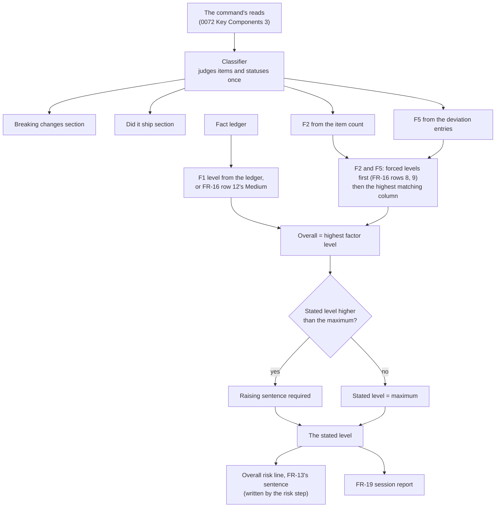
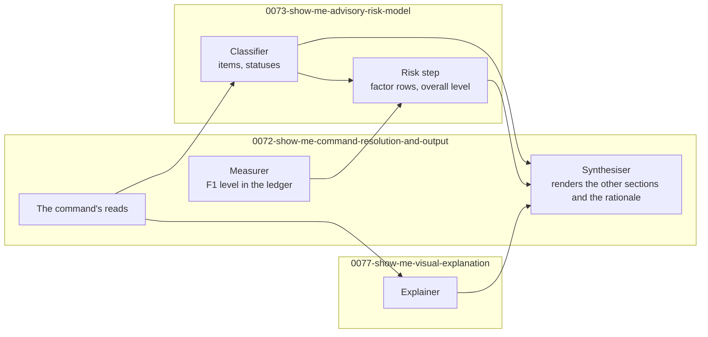

# 0073. The Advisory Risk Model for `/spec:show-me`

Date: 2026-09-19

## Status

Proposed

## Context

`/spec:show-me` writes one file that answers "what did we build, and what deserves a second look?".
Every other section presents evidence: counts, and judgements with their sources.
`## Risk assessment (advisory)` turns three unlike measurements into one word — `Low`, `Medium` or
`High` — and must then be trusted not to act on it. A risk word that is quietly averaged, that
changes what the command does, or that re-judges evidence the file already presented, looks
authoritative and is not.

### Terms

- **Classifier** — the stage that judges breaking-change items, requirement statuses and the work
  no requirement covers (FR-8 Part 3). Key Components 1 states its rule.
- **Factor** — one of F1, F2 and F5, each with a measured value and a level. FR-11 states the
  thresholds.
- **Forced level** — a factor level FR-16 assigns regardless of the thresholds. Key Components 3
  lists the three.
- **Measurer**, **Synthesiser**, **fact ledger**, **read log** — see
  [0072-show-me-command-resolution-and-output](0072-show-me-command-resolution-and-output.md),
  whose *Terms* block states each.

### Scope

**Parent requirement**: [specs/0037-show-me/requirements.md](../../specs/0037-show-me/requirements.md)

**In scope**:

- FR-7's and FR-8's judgements — which changes are breaking-change items, and each declared id's
  status — made once, by the Classifier (Key Components 1).
- FR-11 — the three factors, their inputs, and one mapping procedure that takes the highest
  matching column (Key Components 2 and 3).
- FR-12 — the overall level as the maximum, the raise with a reason, and no lowering (Key
  Components 4).
- FR-13 and the *Advisory* definition — the level's two sinks, and the rule that nothing branches on
  it (Key Components 5).
- FR-16 rows 8, 9 and 12 — their forced factor levels (Key Components 3).
- NFR-1 — which factor fields are judged (F2, F5, the overall level) and which is copied (F1).
- NFR-9 and AC-81 — what the FR-13 invariant check asserts. The check itself lives in the test
  script, which 0072 owns.

**Out of scope**:

- The ledger, the reads, the section shapes of `## Breaking changes` and `## Did it ship what it
  said?`, and the test script —
  [0072-show-me-command-resolution-and-output](0072-show-me-command-resolution-and-output.md).
- Diagrams — [0077-show-me-visual-explanation](0077-show-me-visual-explanation.md). The Explainer and
  the risk step exchange nothing: neither's output is an input to the other.
- The marked release-notes form that FR-7's catalogue comes from —
  [0078-spec-family-machine-readable-forms](0078-spec-family-machine-readable-forms.md).

### Where this ADR sits

| ADR | Decides |
| --- | --- |
| [0072-show-me-command-resolution-and-output](0072-show-me-command-resolution-and-output.md) | What the command is, how it resolves its target, what it measures and reads, and the shape of the file it writes |
| **[0073-show-me-advisory-risk-model](0073-show-me-advisory-risk-model.md)** *(this one)* | How the advisory risk level is computed, and how it stays advisory |
| [0077-show-me-visual-explanation](0077-show-me-visual-explanation.md) | When the command draws a diagram, what it may draw, and which stage may read source to draw it |
| [0078-spec-family-machine-readable-forms](0078-spec-family-machine-readable-forms.md) | The forms the `/spec` family writes so that a tool can read them, and the command that writes release notes in one of them |

The sentence that unifies all four: **every value a command states is counted by one tested script,
copied from a named source, or judged from evidence it can name, and no command writes outside what
it owns.**

### A risk word that could disagree with its own evidence

Each factor summarises evidence that another section of the same file presents in full:

| Factor | Evidence | Presented in |
| --- | --- | --- |
| F1 — product-code blast radius | files changed under `src/` | `## Blast radius` |
| F2 — breaking changes | the breaking-change items | `## Breaking changes` |
| F5 — requirement fidelity | the deviation entries | `## Did it ship what it said?` |

If the risk table derives F2 or F5 on its own, the same judgement is made twice, and two
applications of a judged rule to the same evidence can differ. The file could then list five
breaking changes and score F2 from six. Nothing would reveal the discrepancy, because both numbers
look like measurements.

### The forces

- **The factors are not commensurable.** "76 files under `src/`" and "one breaking change with no
  migration" are not quantities on one scale. Any arithmetic that combines them invents an exchange
  rate.
- **One factor is copied and two are judged.** NFR-1 makes F1 mechanical and F2 and F5
  judgement-derived. Only F1 can be identical between runs.
- **A factor must never disagree with its section.** AC-32 and AC-34 check each run's F2 and F5
  against the evidence cited in the same run's own sections.
- **Three rows of FR-16 override the thresholds.** A missing `requirements.md`, zero declared ids,
  and an undeterminable spec branch each force a factor to `Medium` (AC-16, AC-19, AC-43).
- **A level must never change behaviour.** FR-13 allows no difference between a `Low` run and a
  `High` run except the text written. One conditional would break that.
- **The invariant check must not fire on ordinary words.** A substring check for `if` matches inside
  `diff` (AC-81).

## Decision

**Judge each breaking-change item and requirement status once, in the Classifier; derive F2 and F5
from those judgements and copy F1 from the fact ledger; apply FR-16's forced levels before any
threshold; take the highest matching column for each factor and the maximum over the factors; and
confine every conditional that touches a level to one marked step.**

The Classifier's judgements feed two renderings: the sections that present the evidence, and the
factor rows that summarise it. The risk step computes the level from those rows and writes the
lines that set it. The level then appears in two places: the `**Overall risk: …**` line in
`show-me.md`, and FR-19's session report, which copies it. Nothing else in the command tests the
level.

### The mechanism, end to end

Four invariants read off the flowchart:

- **The sections and the factors share one source.** F2 and F5 are counts over what the Classifier
  judged, and the sections render the same judgements. The risk table cannot disagree with the
  sections above it.
- **F1 is never judged.** Its level comes from the ledger, or from FR-16 row 12 when the ledger has
  none, so the model applies no threshold to it.
- **Every test on the level is inside the risk step**: the diamond, and the two checks in Key
  Components 4. Each guards what is written, not what happens next. The Synthesiser adds the
  rationale around the lines the risk step wrote, and tests nothing.
- **The level leaves by two arrows, both renderings.** No edge leads from the level back into the
  procedure.

### Where the pieces live

The Explainer and the risk step have no edge between them: neither's output is an input to the
other, although both read the ledger. This ADR adds one stage and one marked step to the command file, and nothing to its front
matter or to `.claude/settings.json`.

### Key Components

The stage table is stated once, in
[0072-show-me-command-resolution-and-output](0072-show-me-command-resolution-and-output.md). This
ADR owns the Classifier's rule and the risk step.

#### 1. The Classifier

| Judges | From | Emits, per item |
| --- | --- | --- |
| Which changes are breaking-change items, and each item's classification set (FR-7) | ADR *Consequences* extracts, `requirements.md`, the `src/`-scoped diff, and the marked release-notes section when one was read | the item, its classification set, a one-sentence migration, and the evidence it came from |
| Each declared id's status (FR-8) | `requirements.md`, `tasks.md`, the ADR extracts and the diff | the id, its status, a one-sentence reason, its evidence, and its follow-up for `Deferred`, `Dropped` or `Withdrawn` |
| Work in `tasks.md` that no numbered requirement covers (FR-8 Part 3) | `tasks.md` and the declared ids | each piece of work, with the task id it came from |

Four rules bind it:

- **It reads only what the read log records.** Its inputs are the reads 0072 charges to the budget.
  It makes no read of its own and does not read source files; that right is the Explainer's.
- **It judges each thing once.** An item list or a status set is produced once per run, and every
  later use renders that result.
- **It follows the catalogue's boundaries when there is one.** When a marked section was read and
  its `#### Breaking changes` list has a bullet, each bullet is one item (FR-7's tie-break).
  Otherwise one item is one distinct public-API declaration change, or one *Consequences* bullet
  describing a behavioural break.
- **Every item and status carries its evidence.** An item names the catalogue bullet, ADR entry or
  diff hunk it came from. A status names a task id, a path or an ADR stem. This is what AC-32 and
  AC-34 check a run against.

It also tallies its own judgements: `{n}`, the number of breaking-change items, and the number of
ids with each status, which gives FR-8's `{k}` and Part 4's six terms. NFR-1 names these tallies as
judgement-derived, and they are the only numbers the Classifier emits. Every other number in
`show-me.md` comes from the ledger.

The declared-id set and `{total}` are not the Classifier's. They are ledger fields (0072). The
Classifier assigns a status to each id the ledger lists, and to no other id.

#### 2. Factor inputs

| Factor | Value | Level comes from |
| --- | --- | --- |
| F1 | files changed under `src/` | the ledger, as computed by the Measurer from FR-11's thresholds; FR-16 row 12's `Medium` when the ledger has none |
| F2 | `{n}`, the Classifier's item tally — the number FR-7's count line states | the mapping procedure (Key Components 3) |
| F5 | the deviation entries — every declared id the Classifier judged not `Shipped`, with its follow-up | the mapping procedure |

Each row states its measured value, not only its level. For example: `76 files under src/`,
`5 items`, and `2 deviation entries of 37 requirements: 1 Shipped with deviation, 1 Withdrawn with a
superseding requirement` (FR-11).

F3 and F4 are retired identifiers. They must never be reused, so that F5 keeps the one meaning it
has. A `show-me.md` with an `F3` or `F4` row does not conform (FR-11).

#### 3. The mapping procedure

One procedure serves all three factors. For F1 only step 1 can apply: its level comes from the
ledger unless FR-16 row 12 forces it. F2 and F5 go through every step.

1. **Forced level.** If FR-16 assigns this factor a level, take that level and evaluate no column.
2. **High.** Otherwise, if the factor's `High` condition holds over its whole body of evidence, the
   level is `High`.
3. **Medium.** Otherwise, if its `Medium` condition holds over its whole body of evidence, the level
   is `Medium`.
4. **Low.** Otherwise, the level is `Low`.

The forced levels:

| FR-16 row | Condition | Forced level |
| --- | --- | --- |
| 8 | `requirements.md` missing | F5 = `Medium` |
| 9 | `requirements.md` declares zero ids in the bold lead-in form | F5 = `Medium` |
| 12 | spec branch not determinable, so no diff and no F1 level in the ledger | F1 = `Medium` |

Step 1 comes first because FR-16's rows describe inputs, not evidence. Rows 8 and 9 leave no
deviation entries, so without step 1 F5's `Low` column would hold. Row 12 leaves F1 null in the
ledger, so its forced level is applied here as a constant.

Steps 2 to 4 test the whole body of evidence at once, and stop at the first column that holds. That
is FR-11's rule — when more than one column is satisfied collectively, the highest wins — made a
property of evaluation order. One `Deferred` entry with a follow-up alongside one `Dropped` entry
stating `no follow-up recorded` puts F5 at `High`, because the `High` condition holds somewhere in
the evidence. FR-11's mapping is total, so step 4 is always reachable and no factor is left without
a level.

#### 4. The overall level

The overall level is the maximum of the three factor levels, over `Low` < `Medium` < `High`. The
risk step may state a higher level, with one sentence naming what the factors miss. It may never
state a lower one.

The risk step writes the lines that set the level, and every instruction that tests it:

| Line | Written by |
| --- | --- |
| the factor table, one row per factor with its value and level | the risk step |
| the factor or factors whose level equals the stated maximum, handed to the Synthesiser as a list, not written as a line | the risk step |
| `**Overall risk: {level}**`, on its own line | the risk step |
| the rationale's first sentence, when the stated level is above the maximum: the raising sentence | the risk step |
| the rest of the rationale, so that it has two to five sentences in all and names at least the factor or factors that set the level | the Synthesiser |
| FR-13's sentence, below | the risk step |

The raising sentence is part of the rationale, as AC-23 requires, and counts toward its two to five
sentences. The Synthesiser names the factors that set the level from the risk step's list, and may
state a factor's level as a fact the table shows — "F1 is `High`" — so the instructions that write
the rationale compare no levels.

Before the risk step ends, still inside its markers, it checks the lines it wrote: the stated level
is not below the maximum, and a stated level above the maximum has a raising sentence (AC-23). The
check runs over the risk step's own lines, which exist by then, so nothing outside the markers has to
test a level. The Synthesiser then writes the rationale from the factor rows, and places the risk
step's lines in the section in the order above. FR-13's sentence is:

> This assessment is advisory only. It is not a merge gate; the merge decision stays with a human
> reviewer.

That sentence is a literal in the command file, not composed at run time.

#### 5. Advisory by construction

The level has exactly two sinks: the `**Overall risk: …**` line and FR-19's session report, which
copies that line's level and tests nothing. The
command file holds the whole of the risk step between two marker lines,
`<!-- show-me:risk-step:begin -->` and `<!-- show-me:risk-step:end -->`. Inside the markers,
conditionals test factor evidence, which is how a level is computed. Outside them, no instruction may
test a level.

The FR-13 invariant check, run by the test script, asserts exactly that:

> Outside the risk-step markers, no paragraph of `.claude/commands/spec/show-me.md` contains both a
> conditional keyword — `if`, `when`, `unless`, `else`, `otherwise` — and a level name — `Low`,
> `Medium`, `High` — where each is matched as a whole word, the keywords in any case and the level
> names as capitalised. The marked region, marker lines included, is removed first; the rest is
> split into paragraphs, each a run of lines between blank lines, so a conditional wrapped onto the
> line after its level name is still caught.

Whole-word matching is what keeps `diff` from matching `if`. Case-insensitive keywords catch
`When` at the start of a sentence. Capitalised level names keep ordinary prose such as "a low
cost" out of the check, and the command file writes a level only in its capitalised form. Outside
the markers the command file has little reason to name a level at all: the FR-19 report step refers
to "the overall level" and copies it. The test script proves the whole-word rule on a literal line
held in the test script itself, which contains `git diff` and `gh pr diff` and no conditional,
and must yield zero matches (AC-81). The check also fails if either marker is missing or appears
twice, so a deleted marker cannot switch the check off.

### Technology Choices

#### Why a maximum

The maximum is the only combining function over these levels that needs no exchange rate. It is
explainable in one sentence — the highest factor sets it — and it cannot average a `High` away. See
Alternative 1.

#### Why the level may be raised but not lowered

A raise costs a reviewer some attention. A lowering can cost them a defect. Requiring a stated
reason keeps the raise auditable.

#### Why the forced levels come before the columns

The alternative is a special case inside each factor's columns. FR-16's rows are conditions on
inputs — a file missing, a branch not found — and not evidence the columns weigh. Taking them first
keeps each column's condition exactly as FR-11 states it.

#### Why a marked step, not a keyword ban

The command file has to describe the mapping, and the mapping is conditionals over levels: "`High`
if four or more items". A check over the whole file would therefore fire on the procedure it
protects. The markers separate computing a level, which needs conditionals, from using a level,
which FR-13 forbids.

### Implementation Approach

Numbered in commit order. These steps follow the test script's harness,
[0072-show-me-command-resolution-and-output](0072-show-me-command-resolution-and-output.md)'s
Implementation Approach step 3, and form part of its step 10. The test-script rows come before the
command-file text they check.

1. **Behavioural.** The test script's FR-13 row, which fails until step 2 adds the markers: the paragraph check, the marker-count assertion
   (exactly one begin marker and one end marker, begin first), and the AC-81 literal line, which
   must yield zero matches. It runs against the command file as each later step changes it.
2. **Behavioural.** The risk-step markers in `.claude/commands/spec/show-me.md`, at Step 5 between
   the Classifier and the Synthesiser (see
   [0072-show-me-command-resolution-and-output](0072-show-me-command-resolution-and-output.md),
   Implementation Approach step 10).
3. **Behavioural.** Inside the markers: F1 copied from `f1_level`, or FR-16 row 12's `Medium` when
   it is null; the forced-level table; the mapping procedure for F2 and F5 over the Classifier's
   judgements and tallies; the factor table.
4. **Behavioural.** Inside the markers: the maximum, the raise and its sentence, the
   `**Overall risk: …**` line, FR-13's literal sentence, and the two checks over those lines.
5. **Behavioural.** Outside the markers: the Classifier's item list, statuses, Part 3 list and
   tallies, before the risk step; the Synthesiser's rationale after it; FR-19's report copying the
   level.

## Consequences

### Positive

- **The risk table cannot disagree with the file.** F2 and F5 count the Classifier's own
  judgements, and the sections render the same judgements.
- **F1 is reproducible.** The Measurer computes its level, and the model copies it (NFR-1).
- **The forced levels are total.** Every FR-16 row that forces a level is one row of one table, and
  the procedure applies them before any column.
- **One procedure, two uses.** A change to how "collectively" works cannot reach one factor and miss
  the other.
- **Advisory is checkable from outside a run.** The invariant check runs over the command file, with
  no false positive on `diff`.

### Negative

- **Three factors are a thin basis for one word.** A change that is large, breaking and faithful to
  its plan gets `High`, and the model has nothing else to say about it. The rationale carries more of
  the load.
- **F5 can dominate on a small change.** One `Dropped` requirement with no follow-up puts the whole
  assessment at `High`, even for two files. That is intended — an unrecorded gap is what should be
  surfaced — but a reader who expects the level to track size will be surprised.
- **The overall level can differ between runs.** F2 and F5 are judged, and they feed the maximum.
  NFR-1 acknowledges it; this design does not remove it.
- **The raise is not falsifiable.** The checks confirm that a raising sentence is present, not that
  it is true.
- **The risk step is policed by review, not by the check.** Inside the markers, conditionals are
  allowed, so an instruction there that acts on the level would pass the check.
- **Retired identifiers are a permanent cost.** Every reader of a factor table meets a numbering that
  skips F3 and F4.

### Risks and Mitigations

- **Risk: the Synthesiser re-counts breaking-change items while writing the rationale**, and states
  a number that differs from the table.
  *Mitigation*: the rationale renders the Classifier's rows. AC-34 checks every count against its
  cited evidence.
- **Risk: a later edit adds an action on the level** — "if `High`, also emit a warning line".
  *Mitigation*: outside the markers, the invariant check fails. Inside them, the step has one job,
  and the markers make it the one place a reviewer must read.
- **Risk: F3 or F4 is re-introduced** as a factor.
  *Mitigation*: FR-11 and Key Components 2 state the retirement as a rule, with its non-conformance
  consequence.
- **Risk: a forced level is missed** because FR-16 gains a row.
  *Mitigation*: the forced levels are one table here, and a new FR-16 row that sets a factor level
  is a change to that table.

## Alternatives Considered

### Alternative 1: A weighted or averaged risk score

Give the factors weights, map the levels to 1, 2 and 3, and report a composite.

**Rejected.** The factors are not commensurable, so any weight invents an exchange rate that nothing
in the requirements justifies. Two of the three factors are already judged, so weighting them
compounds their variance. Averaging also runs in the one direction FR-12 forbids: on the calibration
case, F1 `High` and F2 `High` beside a lower F5 average to something below `High`, which is the wrong
answer for a 76-file change carrying more than four breaking changes. The maximum needs only the
order `Low` < `Medium` < `High`.

### Alternative 2: No level, only prose about what deserves scrutiny

State the measurements and let the reader decide, with no `Low`, `Medium` or `High`.

**Rejected.** A single word does invite gate-like treatment, and three factors are a thin basis for
it. But the problem this command exists for is that "is this safe to merge?" was re-derived every
session with nothing stable to compare against. Prose that declines to conclude reproduces that
state. A level that is wrong can be argued with and improved. The raise-only rule and the advisory
construction guard against the level becoming a gate.

### Alternative 3: Factors for review findings and CI state

Add a factor for the pull request's open review findings and one for its CI rollup.

**Rejected on scope.** The pull request already presents its own review comments and its own checks,
and `/spec:review code` assesses the code. A summary that re-counts a review is a second review, and
one that copies a CI result can go stale without anything noticing. FR-18 forbids the queries these
factors would need.

### Alternative 4: Let the risk table derive F2 and F5 itself

Compute the table independently from the sections, in FR-5's print order.

**Rejected.** It makes the table a second opinion about the same evidence. Two applications of one
judged rule can differ, and the file would then state one item count in `## Breaking changes` and
score F2 from another. Judging once removes the possibility.

### Alternative 5: A substring check for conditionals near level names

Search the whole command file for `if`, `when` or `unless` followed by a level name.

**Rejected.** `if` matches inside `diff`, `classified` and `verify`, and the command file describes
diffs throughout, so the check is never quiet. It also fires on the mapping procedure itself. A check
that always fires is waived, which is the same as not having one.

## References

- Requirements: [specs/0037-show-me/requirements.md](../../specs/0037-show-me/requirements.md)
- Related ADRs:
  - [0072-show-me-command-resolution-and-output](0072-show-me-command-resolution-and-output.md) — the
    ledger, the Measurer's F1 level, the command's reads, the section shapes and the test script.
  - [0077-show-me-visual-explanation](0077-show-me-visual-explanation.md) — the Explainer, which
    exchanges nothing with the risk step.
  - [0078-spec-family-machine-readable-forms](0078-spec-family-machine-readable-forms.md) — the
    marked release-notes form whose `#### Breaking changes` list is FR-7's catalogue.
  - [0071-tdd-review-gear](0071-tdd-review-gear.md) — the other ADR that decides a `/spec:*`
    command's own behaviour rather than Brighter's runtime.
- Conventions and prior art in this repository:
  - [`.agent_instructions/adr_frontmatter.md`](../../.agent_instructions/adr_frontmatter.md) — tag
    taxonomy and the rule that an ADR's identity is its filename stem.
- External references: PR [#4282](https://github.com/BrighterCommand/Brighter/pull/4282) — spec 0036's
  pull request, the calibration case: 76 files under `src/`, and more than four breaking changes
  recorded in its ADRs' *Consequences* sections.
