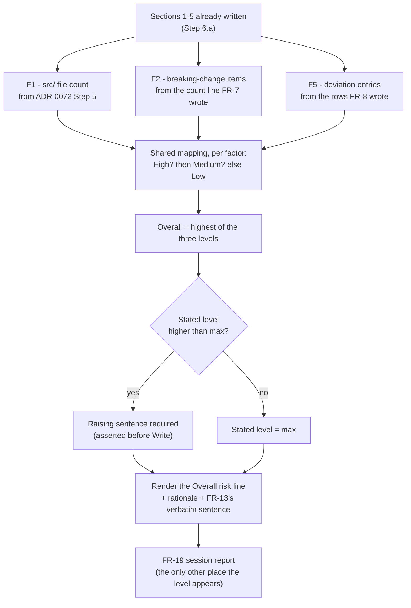
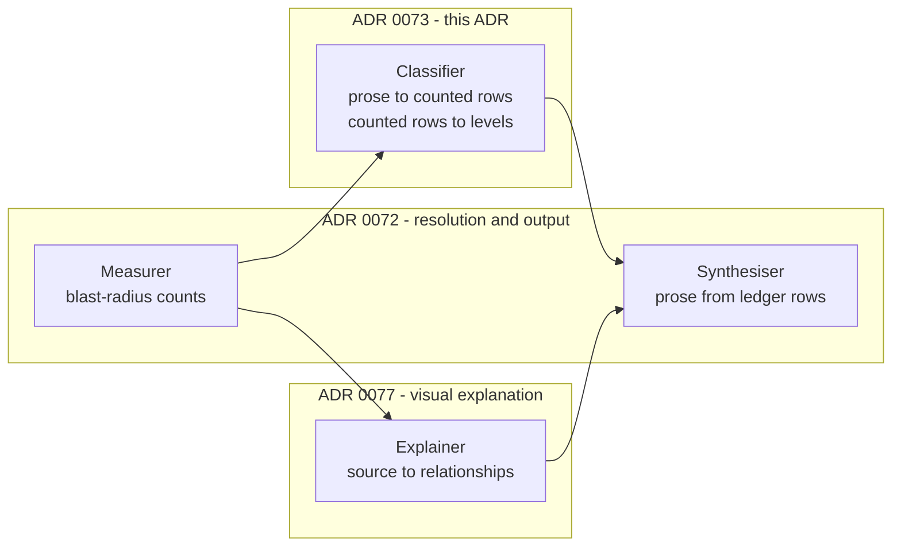

# 0073. The Advisory Risk Model for `/spec:show-me`

Date: 2026-09-19

## Status

Proposed

## Context

Spec 0037's `/spec:show-me` writes one file that answers "what did we build, and what deserves a
second look?". Seven of its eight sections report things the repository can be asked directly. The
eighth, `## Risk assessment (advisory)`, has to turn several unlike measurements into a single
`Low`/`Medium`/`High` word — and then be trusted not to act on it.

That word is the part most likely to be wrong in a way nobody notices. A risk read that is quietly
averaged, or that changes what the command does, or that re-judges evidence the document already
presented two pages earlier, is worse than no risk read at all: it looks authoritative and is not.

**Parent Requirement**: [specs/0037-show-me/requirements.md](../../specs/0037-show-me/requirements.md)

**Scope**: This ADR decides one thing — **how the advisory risk level is computed, and how it is kept
advisory by construction rather than by promise**. It discharges FR-11, FR-12, FR-13, NFR-1's
judgement enumeration for the factors, and the `Advisory` definition.

It does **not** decide command invocation, target/branch/PR resolution, the fact ledger or the output
file's structure — [ADR 0072](0072-show-me-command-resolution-and-output.md) owns those. It does not
decide how a diagram is triggered, drawn or attributed —
[ADR 0077](0077-show-me-visual-explanation.md) owns that, including the Explainer role.

### Where this ADR sits

| ADR | Decides |
| --- | --- |
| [0072](0072-show-me-command-resolution-and-output.md) | What the command is, how it resolves its target, and the shape of the file it writes |
| **[0073](0073-show-me-advisory-risk-model.md)** *(this one)* | How the advisory risk level is computed, and how it stays advisory |
| [0077](0077-show-me-visual-explanation.md) | When the command draws a diagram, what it may draw, and which stage may read code to draw it |

The sentence that unifies all three: **the command states only what it has measured, names what it
measured it from, and changes nothing.**

### This ADR was rescoped after implementation had begun

The version of this ADR accepted on 2026-09-19 was titled *Review-History Decomposition and the
Five-Factor Risk Model*, and the majority of it specified how to decompose a pull request's comment
history into per-round finding, severity and resolution tallies — feeding a fifth section line and
two of five risk factors, F3 (state of review findings) and F4 (the CI rollup).

That material was removed from the requirements on 2026-09-20, and is removed here. The reason was
not that it was wrong — it was calibrated against PR #4282 and worked — but that it was **the wrong
command's job**. The pull request already carries its own review comments and its own checks tab, and
`/spec:review code` already assesses the code properly rather than by counting comments. The framing
that settled it: this command is the end-of-sprint demo, not a review.

Two things follow, and both are load-bearing for a reader of the current document:

- **F3 and F4 are retired identifiers.** They must never be reused. `F5` keeps the one meaning it has
  ever had, in this ADR, in `requirements.md`, and in the implementation already built against it. A
  `show-me.md` containing an `F3` or `F4` row is non-conforming.
- **The Classifier stage survives the cut, and is better for it** — see Key Components 1.

### The forces

- **The factors are not commensurable.** "76 files changed under `src/`" and "one breaking change with
  no migration note" are not quantities on a shared scale. Any arithmetic that combines them invents
  an exchange rate nothing justifies.
- **Two of the three factors are judged, not counted.** NFR-1 names F2 and F5 as judgement-derived:
  deciding what constitutes one breaking-change item, and whether a requirement's status is a
  deviation, are readings of prose. Only F1 is a pure count.
- **The evidence has already been presented.** By the time the risk table is written, `## Breaking
  changes` has stated its item count and `## Did it ship what it said?` has stated its deviations. A
  factor that re-derives its own input can disagree with the section printed above it.
- **FR-13 forbids any behavioural difference between a `Low` result and a `High` one.** This is
  trivially satisfiable by writing careful prose and trivially violable by one `if`. It needs to be a
  property of the procedure's shape, not a rule someone remembers.
- **NFR-7 requires every claim to be attributable.** A level with no cited measurement is exactly the
  unattributable claim it forbids.

## Decision

**Compute each of three factors by one shared mapping procedure evaluated downward from `High` over
that factor's whole body of evidence; take their maximum as the overall level; permit the level to be
raised with a stated reason but never lowered; and write it into exactly two places, neither of which
is a condition.**

Each factor projects from evidence some earlier section already produced and cited, so the table is a
re-presentation of the document's own findings rather than a second opinion about them.

### The mechanism, end to end



Three invariants read directly off that shape. The factors flow **in** from sections already written,
so no factor re-judges its own evidence. The comparison at `G` is the **only** test the level is ever
subjected to, and it guards a writing decision, not a control-flow decision. And the level leaves by
exactly two arrows, both of which are renderings — there is no edge from the level back into the
procedure.

### Where the pieces live



Nothing new is introduced in the command's tool surface, its front matter, or
`.claude/settings.json`. This ADR adds one stage and one procedure, both inside the existing prompt file.

### Key Components

#### The procedure's stages, and the rule each one holds

The command is one prompt file, not a program, so these are named stages of a single ordered
procedure rather than components. Each name is shorthand for a rule:

| Stage | Where | The rule it holds |
| --- | --- | --- |
| Measurer | ADR 0072, Steps 3–5 | Produces every value NFR-1 requires identical between runs, and never paraphrases |
| Explainer | [ADR 0077](0077-show-me-visual-explanation.md), Step 5D | The only stage that may read source; draws nothing it has not read |
| Classifier | this ADR, Step 6.b | Reads only what the Measurer extracted, and never re-derives its own input |
| Synthesiser | ADR 0072, Step 6 | Writes all prose, runs no shell call, and counts nothing |

The distinction a reader would otherwise collapse: **the Synthesiser may not count, and the
Classifier may not write prose.** A factor level is a Classifier row; the sentence
explaining it is a Synthesiser rendering of that row. Keeping them apart is what makes "the rationale
matches the table" checkable instead of hoped for.

#### 1. The Classifier, retained and retightened

The Classifier was introduced by this ADR's previous version to hold work neither of ADR 0072's two
stages could take: its **output is numbers**, which looks like Measurer work, but its
**method is reading prose**, which looks like Synthesiser work. That seam did not close when review
history left the command's scope — it moved.

What the Classifier owns now is its cleanest expression:

| Judged input | Classifier output | Cited from |
| --- | --- | --- |
| `release_notes.md` bullets, ADR *Consequences* entries | the breaking-change item count (FR-7) | the catalogue bullet or ADR entry each item came from |
| declared requirement ids and their evidence | each non-`Shipped` id's status and follow-up (FR-8) | the requirement id and the evidence for its status |
| the two counts above, plus the Measurer's `src/` count | F1, F2 and F5's levels | the measured value, stated in the row |

Its contract is unchanged from the previous version, and deliberately so:

- **It may read only Measurer-produced extracts.** It never re-fetches and never works from a source
  the ledger does not already hold. This restriction was originally written to bound how much comment
  text the command pulled in; that pressure is gone, but the rule now costs nothing and keeps one stage
  honest, so it stays. The stage that genuinely needs to read source directly is the Explainer, and
  [ADR 0077](0077-show-me-visual-explanation.md) grants that right there — scoped to the stage that
  needs it, rather than widened across a stage that does not.
- **Every row it emits carries the rule it applied and the line it applied it to**, not just a value.
  A factor row is not `F2 | High`; it is
  `F2 | 14 items | High | release_notes.md "Scoped lifetime per pipeline", 14 bullets; 5 carrying combined source-and-binary markers`.
  That is what AC-34's "consistent with the evidence cited in the same run's own output" is checked
  against.
- **The Synthesiser still may not count.** FR-12's rationale sentences are a rendering of Classifier
  rows.

#### 2. Factor inputs, and who owns each

| Factor | Input | Computed by | Consumed here as |
|---|---|---|---|
| F1 | files changed under `src/` | ADR 0072 Step 5 (blast-radius bucket counts) | the `src/` bucket integer |
| F2 | breaking-change item count | ADR 0072 Step 6 (FR-7 synthesis) | the emitted `Total breaking-change items: {n}` line |
| F5 | requirement statuses | ADR 0072 Step 6 (FR-8 synthesis) | the deviation entries FR-8 wrote, plus each entry's follow-up text |

**The handoff rule, stated once: a factor mapping never re-derives its own input.** F2 reads the count
line FR-7 already wrote; F5 reads the deviation entries FR-8 already wrote. Re-partitioning
breaking-change items or re-judging a requirement status inside the risk table would judge the same
evidence twice and could disagree with the section printed two pages above it — which AC-34 would
catch as a claim not matching its input's actual content.

The consequence is a sequencing constraint: **the risk table is synthesised after the sections it
projects from**, even though FR-5 places it sixth. Step 6 therefore runs 6.a (sections 1–5), 6.b
(section 6), 6.c (sections 7–8), and assembly into FR-5's fixed order happens at Step 7, which ADR
0072 already defines as a single in-memory `Write`.

#### 3. The shared factor-mapping procedure

FR-11's general clause is the load-bearing one:

> When more than one of a factor's three column conditions is satisfied *collectively* by the evidence
> that factor measures — the full set of deviation entries for F5, the full item list for F2 — the
> factor takes the *highest* matching column (High beats Medium beats Low).

Implemented as **one procedure, three uses, no per-factor passes**:

> For factor F with evidence set E: evaluate F's **High** condition over the whole of E; if it holds,
> F is High and no further column is evaluated. Otherwise evaluate **Medium** over the whole of E;
> if it holds, F is Medium. Otherwise F is **Low**.

Evaluating downward from High and stopping at the first hit is equivalent to evaluating all three and
taking the maximum — FR-11's mapping is total by construction, so at least one column always holds —
but it is one pass, it cannot produce "no column matched", and it makes the "highest wins" rule a
property of evaluation order rather than a post-hoc comparison someone has to remember to perform.

The worked example requirements.md gives falls out unchanged: a `Deferred` entry with a recorded
follow-up alongside a `Dropped` entry stating `no follow-up recorded` → F5 High, because the High
condition holds somewhere in the evidence set even though a Medium condition also holds.

F1 and F2 are scalar counts over disjoint ranges, so the downward evaluation is vacuous for them. They
still go through it. One rule with two vacuous applications is cheaper to keep correct than one rule
with two exceptions.

#### 4. The overall level, and advisory-by-construction

FR-12's maximum is computed mechanically from the three Classifier-emitted levels over the ordering
`Low < Medium < High`. The Synthesiser may then raise it with an explicit one-sentence reason naming
what the factors miss, and may never lower it. Before Step 7's `Write`, two assertions run over the
assembled text: the stated level is ≥ the computed maximum, and if it is strictly greater, a raising
sentence is present (AC-23).

FR-13 is made structural rather than promised. The level is written into exactly two places — the
`**Overall risk: {…}**` line in `show-me.md`, and FR-19's session report — and the command file states
the invariant: **no step in the procedure may branch on the level.** `High` and `Low` are values that
get rendered, never conditions that get tested. That is what makes AC-25's "the only difference is the
text inside `show-me.md`" a property of the procedure's shape rather than a behaviour to remember, and
it is the same construction ADR 0072 used to make AC-7's byte-for-byte guarantee a property of step
ordering.

The invariant is checkable from outside the running command, which is the point:

```bash
grep -nE '(if|when|unless).*(High|Low|Medium)' .claude/commands/spec/show-me.md   # must be empty
```

The verbatim sentence FR-13 requires —
`This assessment is advisory only. It is not a merge gate; the merge decision stays with a human
reviewer.` — is a literal in the command file, not something composed at run time.

### Technology Choices

**Why a maximum rather than any combining function.** The maximum is the only function over these
three levels that needs no exchange rate between incommensurable factors, is explainable in one
sentence ("the highest factor sets it"), and cannot be gamed by averaging a `High` away. See
Alternatives 1 and 2.

**Why the level may be raised but not lowered.** Raising is the safe direction: it costs a reviewer
attention. Lowering costs them a defect. Requiring a stated reason for the raise keeps the asymmetry
auditable rather than merely permitted.

**No new tools, no new allow-list entry.** Every input this ADR consumes is already in the ledger by
the time Step 6.b runs. It adds no `gh` call, no `git` call, and therefore no change to
`.claude/commands/spec/show-me.md`'s front matter and none to `.claude/settings.json` — keeping Out of
Scope's "no change to the allow-list" intact. **This is a change from the previous version of this
ADR**, which needed `--json reviews` and `--json statusCheckRollup`; with review history and CI out of
scope, FR-18 now forbids those queries outright.

### Implementation Approach

#### Step 6.b — `## Risk assessment (advisory)` (FR-11, FR-12, FR-13)

1. **Structural.** Emit the factor table's three rows: factor, measured value, level. FR-11 requires
   the value, not just the level — `76 files under src/`, `14 items`, and F5's deviation summary
   (`2 deviation entries of 28 requirements: 1 Shipped with deviation, 1 Withdrawn with a superseding
   requirement`). Each cell is a Classifier row's evidence field, so NFR-7 holds by projection rather
   than by assertion, exactly as ADR 0072 made `## Inputs used` a projection of the ledger.
2. **Structural.** Apply the shared mapping (Key Components 3) to each of the three factors.
3. **Behavioural.** Take the maximum; run the two pre-`Write` assertions; emit
   `**Overall risk: {Low|Medium|High}**` on its own line, then 2–5 sentences of rationale referencing
   at least the factor(s) that set the level, then FR-13's verbatim sentence.

On the calibration case that is F1 `High` (76 files under `src/`), F2 `High` (14 breaking-change
items), F5 as measured from the reconciliation → **Overall risk: High**, set by F1 and F2 as the
maximum. Whatever F5 measures cannot lower it.

#### Step 8 — no change

ADR 0072's budget self-check and FR-19 report are unchanged. FR-12's rationale counts toward NFR-2's
400–2,000 words; the factor *table* does not, because NFR-2 excludes lines beginning with `|`.

## Consequences

### Positive

- **The risk table cannot disagree with the document that contains it.** Because every factor projects
  from a line an earlier section already wrote and cited, "the table matches the sections" is a
  property of the handoff rule rather than a consistency check someone has to run.
- **Advisory is structural.** With the level written to exactly two sinks and no step permitted to
  test it, FR-13's "a `High` result and a `Low` result differ only in the text written" is checkable
  with one `grep` over the command file, from outside a run.
- **The scope cut made the model smaller and the remaining factors sharper.** Three factors, all of
  which this document uniquely measures, replace five of which two duplicated the PR's own UI. There
  is now no factor whose value a reviewer could get more accurately by clicking the checks tab.
- **One mapping rule, three uses.** The general tie-break clause has one implementation, so a change
  to how "collectively" works cannot apply to two factors and miss the third.
- **The Classifier's rule got tighter as its job got smaller.** It reads only ledger extracts and
  emits only evidenced rows, and the work that needed broader read rights was separated out rather
  than accommodated by loosening this one.

### Negative

- **Three factors is a thin basis for a single word.** With F3 and F4 gone, a change can be large,
  breaking and faithful to plan — and the model has nothing else to say about it. The level is
  coarser than it was, and the rationale sentences now carry more of the load.
- **F5 can dominate for a reason a reviewer may not care about.** One `Dropped` requirement stating
  `no follow-up recorded` puts F5 at High, and the maximum then puts the whole assessment at High,
  even for a two-file change. This is intended (an unrecorded gap is exactly what should be surfaced)
  but it will produce `High` on small diffs, and a reader who expects the level to track size will
  find that surprising.
- **The sequencing constraint is invisible in the output.** FR-5 prints the risk section sixth, but it
  must be *computed* after sections seven and eight's inputs exist. An implementor reading the output
  order will get it wrong; only Step 6's 6.a/6.b/6.c split records the real dependency.
- **Retired identifiers are a permanent tax.** Every future reader of a factor table has to be told
  why the numbering skips 3 and 4, and the prohibition on reuse has to survive in both this ADR and
  `requirements.md` or the two will drift.
- **The raise is unfalsifiable.** "The factors miss something" plus one sentence is enough to move the
  level up. Nothing checks that the sentence is true, only that it is present.

### Risks and Mitigations

- **Risk: the Synthesiser recomputes a factor's input while writing the rationale** — re-counting
  breaking-change items in prose and stating a number that differs from the table.
  *Mitigation*: the handoff rule makes the count line FR-7 wrote the single source; AC-34 checks the
  rationale against the same run's own cited evidence, and the Classifier/Synthesiser split means a
  number appearing in prose that no Classifier row emitted is a visible violation, not a subtle one.
- **Risk: a future change adds a conditional on the level** — for example, "if `High`, also emit a
  warning line" — which would quietly end FR-13's guarantee.
  *Mitigation*: the `grep` in Key Components 4 is stated in the ADR, and is run as an acceptance check
  (AC-25's structural half) rather than left as advice.
- **Risk: `F3`/`F4` are resurrected by someone reading the previous version of this ADR** in git
  history, or reading the implementation built against it.
  *Mitigation*: the retirement is stated in both this ADR and FR-11, with the non-conformance
  consequence spelled out; the rescope note above tells a reader of the history why the material is
  gone rather than leaving them to assume it was lost.
- **Risk: the two pre-`Write` assertions are written as prose the model may skip** rather than as steps
  with observable output.
  *Mitigation*: they run over the *assembled* text immediately before the single `Write`, which is the
  one point where both the computed maximum and the stated level exist side by side.

## Alternatives Considered

### Alternative 1: A weighted or averaged risk score instead of max-of-factors

Give the factors weights, map `Low`/`Medium`/`High` to 1/2/3, and report a composite.

**Rejected, and this ADR owns the rejection rather than merely citing FR-12's.** Requirements states
the reason — "reproducible, explainable in one sentence, and cannot be gamed by averaging a `High`
away" — and the calibration case shows the shape of the failure: F1 High and F2 High alongside a
lower F5 averages to something defensible-looking and materially below High, which is the wrong answer
for a 76-file change to `src/` carrying fourteen breaking-change items. Two arguments of this ADR's
own: the factors are **not commensurable** — "76 files under `src/`" and "one breaking change with no
migration note" are not quantities on a shared scale, so any weighting invents an exchange rate that
nothing in the requirements justifies and that NFR-1 would then have to defend for stability across
runs on top of everything else. And **two of the three factors are already judged** (F2 and F5 per
NFR-1); multiplying judged values by invented weights compounds variance in the one direction —
downward — that FR-12 forbids. The maximum needs no exchange rate: only the ordering
`Low < Medium < High` the factor table already defines.

### Alternative 2: Drop the level entirely and write "what deserves scrutiny" as prose

State the same measurements in sentences and let the reader form their own view, with no
`Low`/`Medium`/`High` word at all.

**Rejected, though it was genuinely open during the rescope.** The argument for it is real: a single
word invites exactly the gate-like treatment FR-13 forbids, and three factors is a thin basis for one
(see Consequences). The argument against is the problem this command exists to solve. "Is this safe to
merge?" was being re-derived ad hoc every session precisely because there was nothing stable to
compare against; prose that carefully avoids committing to a level reproduces that state. A level that
is wrong is arguable and therefore improvable. Prose that declines to conclude is neither. The level
stays, with the raise/never-lower asymmetry and the advisory construction as the guards against it
hardening into a gate.

### Alternative 3: Keep F3 and F4, and accept the overlap with the PR's own UI

Retain the review-findings factor and the CI-rollup factor, on the grounds that having them in one
place alongside the other three is a convenience even if the data is available elsewhere.

**Rejected on scope, not on accuracy.** Both factors worked — F4's three-way
`.conclusion // .state // .status` fallback was calibrated against PR #4282's heterogeneous 28-entry
rollup, and F3's tallies matched a hand decomposition of the same PR. The objection is that a summary
which recounts a review is a second review, and this repository already has two things that own that
material properly: the pull request's own comments and checks tab, and `/spec:review code`. A
convenience that duplicates an authoritative source acquires a way to be *stale* that the source does
not have — a `show-me.md` written before the last CI run states a CI fact that is now false, with no
mechanism to notice. FR-18 now forbids the queries outright, so the overlap cannot be reintroduced by
accident.

### Alternative 4: Compute the risk table before the sections it projects from, in FR-5's print order

Synthesise sections 1–8 in the order they appear, and have the risk table derive F2 and F5 itself.

**Rejected because it makes the table a second opinion.** Deriving the breaking-change count inside
the risk table means partitioning the same catalogue twice, by the same judgement, on two occasions —
and two applications of a judged rule to the same evidence can differ. The document would then state
`14 items` in one section and score `High` from a different number in another, with nothing to reveal
the discrepancy. The 6.a/6.b/6.c split costs one paragraph of explanation and removes the possibility.

## References

- Requirements: [specs/0037-show-me/requirements.md](../../specs/0037-show-me/requirements.md)
- Related ADRs:
  - [ADR 0072: Target Resolution and Output Shape for /spec:show-me](0072-show-me-command-resolution-and-output.md) — the sibling ADR this one extends. Its Step 5 produces F1's input and its Step 6 produces F2's and F5's; its Measurer/Synthesiser vocabulary is the one the Classifier joins.
  - [ADR 0077: Visual Explanation in /spec:show-me](0077-show-me-visual-explanation.md) — the sibling that introduces the Explainer stage and grants it the direct source-read rights this ADR deliberately withholds from the Classifier.
  - [ADR 0071: Shiftable Review Gear for the TDD Approval Gate](0071-tdd-review-gear.md) — the only other ADR recording a decision about a `/spec:*` command's own behaviour rather than Brighter's runtime.
- Conventions and prior art in this repository:
  - [`.agent_instructions/adr_frontmatter.md`](../../.agent_instructions/adr_frontmatter.md) — tag taxonomy and the slug-is-identity rule.
- External references: PR [#4282](https://github.com/BrighterCommand/Brighter/pull/4282) — spec 0036's pull request, the calibration case. The figures this ADR retains from it (76 files changed under `src/`, 14 breaking-change items) were verified with `git` and `gh` while drafting. The review-history and CI figures the previous version of this ADR calibrated against the same PR are recorded in git history and are no longer part of this decision.
