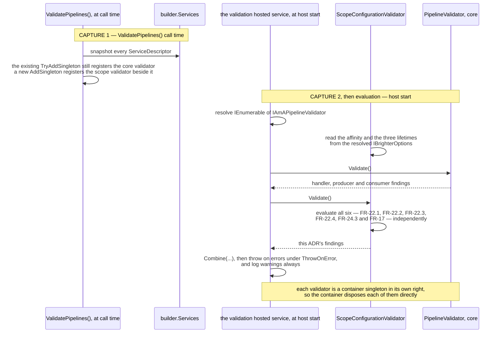
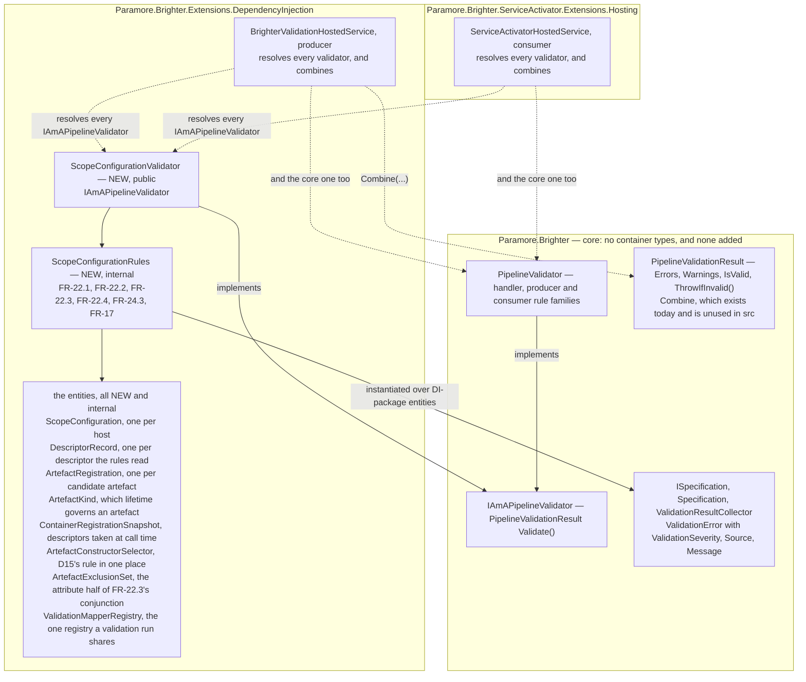
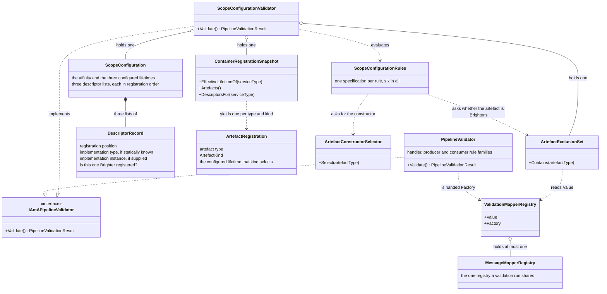
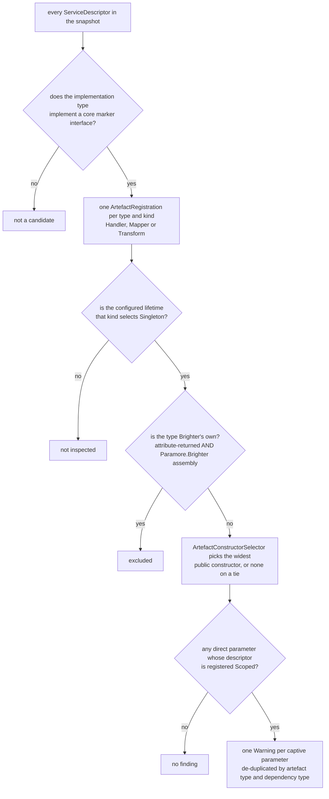

# 74. Where the scope-configuration rules are evaluated

Date: 2026-08-02

## Status

Proposed

## Context

Six configurations are expressible that an application almost certainly did not intend. Four of them become expressible with this work; two have been expressible for years. Every one of the six is silent at run time — the software starts, adopts nothing, and says nothing — and FR-22, FR-24.3 and FR-17 all require a report at startup instead.

No prior record decides **which component evaluates those rules, and how it reaches its inputs.** That is a real question rather than a placement detail. Every input the rules read is a container concept, and the component that runs Brighter's startup validation today lives in core, where no container concept may go.

### Scope

**Parent requirement**: [specs/0036-scoped-lifetime-per-pipeline/requirements.md](../../specs/0036-scoped-lifetime-per-pipeline/requirements.md)

This ADR decides one thing: **the six scope-configuration rules are evaluated in the DI package, by a validator registered beside the core one.** Two things are the core of it. It fixes **the evaluation site** for FR-22's four rules, FR-24.3's duplicate-provider rule and FR-17's repeated-opt-in rule. And it fixes **the plumbing that gets those rules their inputs**, which arrive at two deliberately different instants.

**In scope.** Each requirement below is discharged here by the named mechanism.

- **FR-22 — the four lifetime and opt-in rules are evaluated.** `ScopeConfigurationValidator` evaluates all four in the DI package, reads the configuration the factories read, and reports through the existing result path. The guards are **AC-27** and **AC-28** for the two lifetime errors, **AC-42** for the captive-dependency warning and **AC-50** for the defeated-opt-in error.
- **FR-24.3, the evaluation-site half — where the duplicate-provider rule runs.** The same validator, over the same call-time snapshot. ADR 0072 decides the registration model that makes a duplicate detectable; this ADR decides where the question is asked. The guard is **AC-32**.
- **FR-17, the evaluation-site half — where the repeated-opt-in rule runs, and what its message says.** The same validator, over the same snapshot. The guard is **AC-49**.
- **FR-25 — the guidance page.** `docs/guides/lifetimes-and-scoping.md` is declared here, and *Implementation Approach* step 7 maps each of its eleven clauses to the ADR whose substance it states. The page is scheduled here because this is the ADR whose errors are unactionable without it. The guards are **AC-25**, **AC-43** and **AC-44**.
- **NFR-9 — the truth table.** NFR-9 is discharged by writing the table, and the table is written on the guidance page. This ADR owns it.
- **NFR-1 — core gains no container type.** The rules live in the DI package, and the harvest loop that runs them is written there too, over core abstractions that are already public. The guard is **AC-22.3**'s source scan.

**Contributed to here, discharged elsewhere.**

- **FR-17 is split three ways across the set** — the model FR-13 also follows, one requirement divided across the siblings that each make part of it true. Its registration gesture is **ADR 0073's**, its write-through mechanism and precedence rule are **ADR 0076's**, and its repeated-call rule's evaluation site is this ADR's.
- **Two families of FR-25 clause come from ADR 0075** — the `Publish`-subscriber rows of the truth table, and FR-25.5's substance. ADR 0075 supplies them without being a second owner of FR-25, and says so in its own `Scope`.

**Out of scope.**

- **The rules themselves, and their severities.** Those are fixed by the requirements and by D5, D8, D9 and D15. They are restated below as inputs, not re-argued.
- **The registration model for `IAmAScopeProvider` — ADR 0072's.**
- **The three run-time `Warning` latches in `AmbientScopeDiagnostics` — ADR 0072's.** The boundary with ADR 0072 is exact: 0072 owns the run-time diagnostics a pipeline emits while asking for an ambient scope, and this ADR owns the start-time findings `ValidatePipelines()` produces about the configuration. They share no code and no state, and their message sets do not overlap.
- **The affinity option and its write-through — ADR 0076's.** This ADR reads what 0076 writes.
- **Making `ValidatePipelines()` mandatory or on by default — OOS-13**, which C-15 records as accepted.

This ADR **supersedes no prior ADR.** It extends the `ValidatePipelines()` machinery of `0053-pipeline-validation-at-startup` and `0064-validate-pipeline-assembly-and-provider-registration`. Both are cited by slug throughout, because the bare numbers are ambiguous: `docs/adr` holds three files numbered 0053, two numbered 0054 and two numbered 0064, and C-16 assigns the bare "ADR 0064" to the *other* one — `0064-pipeline-cache-type-key`.

### Where this ADR sits

Seven ADRs deliver the parent requirement, one decision each; the requirements constrain observable behaviour only and hand how it is implemented to design (C-13). This is the fifth, and it exists because the decisions around it made four wrong configurations newly expressible.

| ADR | Decides |
| --- | --- |
| 0070 | a transform pipeline takes one DI scope, carried **as a parameter** |
| 0071 | handler pipelines converge onto the **same handle**, carried on the object they already pass |
| 0072 | how a pipeline discovers an **ambient** DI scope the host owns |
| 0073 | the **ASP.NET Core package**, and the one line an application writes to opt in |
| **0074** *(this one)* | **where** the six scope-configuration rules are evaluated |
| 0075 | how a `Publish` subscriber and the consumer pump **suppress** adoption, for themselves and every pipeline created beneath them |
| 0076 | the **affinity option**, and how one setting reaches all four registration paths in any order |

The rule the first two state is **the per-pipeline object carries the DI scope**. This ADR neither creates such an object nor holds one. It reports, before any pipeline is built, on whether the configuration those objects will read is coherent.

What the siblings settled is what this ADR reads.

- **ADR 0072** fixed the registration model for `IAmAScopeProvider`: a plain `AddSingleton` on every path, never `TryAddSingleton`. Every duplicate descriptor therefore stays in the collection, while Microsoft's container resolves the last.
- **ADR 0076** fixed the opt-in as an affinity property on `IBrighterOptions`, defaulting to today's behaviour. It also fixed the override that carries a registration extension's argument onto whichever options object the four registration paths produce.
- **ADR 0073** ships the extension that supplies that argument.

Validation is therefore written last in *dependency order* — 0070, 0071, 0072, 0073 and 0076 all come before it — which is a different ordering from the numbering that makes it the fifth. It cannot be written earlier. Three of its six rules read values that exist only once ADR 0076 has put them there — FR-22.1, FR-22.2, and FR-22.3 for one of its two inputs — and three read the registration model that ADRs 0072, 0073 and 0076 fixed. Nothing here changes a lifetime, a scope or a pipeline.

ADR 0067's `Terms` block defines the two axes this ADR turns on, and this ADR does not restate it: Brighter's **configured lifetime** governs the artefact, the container's **registration lifetime** governs that artefact's dependencies, and `IServiceScope`, `ServiceProviderLifetimeScope` and `IAmALifetime` stay distinct. The rules below read both axes and never conflate them. FR-22.1 and FR-22.2 read configured lifetimes only; FR-22.3 reads a configured lifetime on one side and a registration lifetime on the other.

### The six silent configurations, and what each rule reads

Four of the six become expressible with this work:

- an opt-in that can never take effect, because nothing is `Scoped`;
- an opt-in that never reached the options object the factories read, because the application registered that object itself;
- two different ambient sources registered, of which only one is used;
- two opt-in calls that disagree about what was opted into.

Two are expressible today and go unreported:

- a set of lifetimes that shares dependencies across half a pipeline and not the other half;
- a process-lifetime artefact that requires a per-request one.

That second pair already works, which is what makes FR-22.2 a **compatibility break** rather than a new guard. *Consequences*, under *Negative*, prices it, and C-18 records it.

| Rule | Condition | Severity |
| --- | --- | --- |
| **FR-22.1** | `DefaultScopeAffinity` is `JoinAmbient` and **none** of `HandlerLifetime`, `MapperLifetime`, `TransformerLifetime` is `Scoped` — the opt-in is inert (D5) | **Error** |
| **FR-22.2** | discarding any of the three that is `Singleton`, the remainder is not uniform — `Transient` and `Scoped` are mixed. Under either affinity (D8) | **Error** |
| **FR-22.3** | an artefact whose **configured** lifetime is `Singleton` takes a direct constructor parameter whose **registration** lifetime is `Scoped` — a captive dependency (D9) | **Warning** |
| **FR-22.4** | an affinity override is registered, and the `IBrighterOptions` descriptor the container will resolve is not one Brighter's own registration produced — so the override was never applied and the opt-in is lost | **Error** |
| **FR-24.3** | the service collection holds `IAmAScopeProvider` descriptors for more than one distinct implementation type | **Warning** |
| **FR-17** | the service collection holds affinity-override descriptors carrying more than one distinct `ScopeAffinity` value — the registration extension was called twice with different affinities | **Warning** |

Every message names `docs/guides/lifetimes-and-scoping.md`, and the guidance page carries a troubleshooting entry keyed to each of the six. The criteria are **AC-43** for the literal path and **FR-25.10** for the entries.

Three properties of that set are load-bearing, and each follows from enumerating the set rather than from reading any one row.

**FR-22.1 and FR-22.2 are mutually exclusive by construction.** FR-22.2 fires only when the remainder contains `Scoped`. FR-22.1 fires only when nothing is `Scoped`. No host can receive both errors, so the two messages never contradict each other about what to do next.

**FR-22.1 asks "is none of them `Scoped`", not "are all of them `Transient`".** A `{Singleton, Singleton, Singleton}` triple under `JoinAmbient` is an inert opt-in, and it is an error. AC-27 exercises the all-`Transient` case, and the rule is wider than the case it is exercised by.

**The rules are evaluated independently, and no precedence may be invented among them.** The mutual exclusion above is a property of FR-22.1 and FR-22.2 alone, and it does not generalise. FR-22.4 in particular can fire alongside another rule. A host whose application-registered `IBrighterOptions` carries `JoinAmbient` over three `Transient` lifetimes trips FR-22.1 as well, and both findings are reported. This is where the set differs from ADR 0072's three run-time diagnostics, which are mutually exclusive on a given ask. AC-50's own host raises exactly one error, but for a reason particular to it rather than by rule ordering: the override having been defeated, the affinity the validator reads is the pre-registered object's `AlwaysNew`, so FR-22.1's `JoinAmbient` precondition simply fails.

The three lifetimes are a joint choice, so `{Scoped, Scoped, Transient}` is not a destination. FR-22.2's message must therefore list all three values and reach the decision guide on the guidance page. A message that says only "this is wrong" fails FR-25.9 and NFR-10.

### The forces

- **Core must gain no container type.** NFR-1's load-bearing clause is a *source-level* one: no file under `src/Paramore.Brighter/` may reference `ServiceLifetime`, `IServiceCollection`, `IServiceProvider` or `ServiceDescriptor`. Those types *compile* in core today, because `Microsoft.Extensions.DependencyInjection` is already on core's compile closure transitively through `Microsoft.Extensions.Logging`. A project-file check is therefore vacuous, and AC-22.3's source scan is the only real guard. That scan returns zero matches today. The durable reason is ADR 0014's: Brighter offers per-family factory interfaces rather than abstracting an IoC container.
- **Every rule reads a container concept.** FR-22.1 and FR-22.2 read `ServiceLifetime` directly. FR-22.4, FR-24.3 and FR-17 read `ServiceDescriptor`s. FR-22.3 reads both — a configured lifetime on one side, a registered one on the other. There is no framing in which the rules belong in core.
- **The evaluator today is in core.** `PipelineValidator` is at `src/Paramore.Brighter/Validation/PipelineValidator.cs:54`, and `IAmAPipelineValidator` is a core interface with a single `PipelineValidationResult Validate()`.
- **`PipelineValidator` has no access to `IBrighterOptions`.** Its nine constructor arguments carry a pipeline builder, publications, subscriptions, consumer specs, an inbox, an outbox, provider registrations, a mapper-registry factory and a transformer probe (`BrighterPipelineValidationExtensions.cs:91-93`). None of them carries a lifetime. Supplying the missing inputs is new work, and it is why this is an ADR.
- **The inputs must be read as the factories read them.** The five container-backed factories read the object `IBrighterOptions` resolves to (`ServiceProviderMapperFactory.cs:44`), not `IOptions<BrighterOptions>.Value`. Those are different objects on three of the four registration paths, because only one path runs an `IOptions` pipeline at all (C-12a). Validation must not pass a configuration the factories will ignore, nor fail one they would have honoured.
- **The only precedent for reading the container without resolving it does no constructor inspection.** `ServiceCollectionTransformerResolvabilityProbe` is a `HashSet<Type>` and a `Contains` (`:40-56`). It is a precedent for snapshot-and-query-without-resolving, and for nothing else. The constructor and lifetime walk FR-22.3 needs is new.
- **`ValidatePipelines()` is opt-in, and it snapshots at call time** (`BrighterPipelineValidationExtensions.cs:58`). C-15 makes the residual gaps explicit and accepted.
- **Both host shapes must fire, and the consumer one is not Brighter's to register.** `AddConsumers` sets `ConsumerOwnsValidation`, which makes `BrighterValidationHostedService.StartAsync` return immediately (`BrighterValidationHostedService.cs:73`). The consumer path therefore runs through `ServiceActivatorHostedService`, which nothing in `src` registers (D14). *Both host shapes, enumerated* walks all six combinations.
- **Errors and warnings must stay distinguishable.** Three of the six messages are errors and three are warnings, and a warning must never block startup whatever `ThrowOnError` says.

## Decision

**The six rules are evaluated by a second validator that the container package contributes, and both validation hosts resolve every registered validator and combine the results.**

The new validator implements the core validation interface, is registered alongside the core one inside `ValidatePipelines()`, and evaluates only its own six rules. It reads its lifetime and affinity inputs from the object `IBrighterOptions` resolves to at host start, and its registration inputs from a snapshot of the service collection taken at `ValidatePipelines()` call time. No type in `Paramore.Brighter` gains a container concept, and no core rule family is extended.

The seam is a **pull**, and it is the one the set already uses. An assembly that owns a concept contributes the rules for that concept, and nothing else has to know. `Paramore.Brighter.ServiceActivator` already supplies four `ISpecification<Subscription>` rules through the container today. That seam works because `Subscription` is a core type. This ADR's entity types cannot be core types, so the pull moves up one level — from specifications to validators. *Technology Choices* argues why, and cites the shipping example.

### The mechanism, end to end

The rules must run in the DI package, because every input they read is a container concept. The component that runs Brighter's startup validation lives in core. So the DI package adds a validator beside the core one, at the registration point the DI package already owns, and each host asks for all of them.

Both hosted services change once, from resolving one validator to resolving and combining every registered one. Nothing else in either host changes, and neither host knows what the new validator evaluates.

The inputs arrive at two deliberately different instants, and a validation run is a function of exactly those two.



Three things are readable off that diagram.

- **The descriptors are captured at call time**, because that is already what `ValidatePipelines()` does with its provider registrations and its transformer probe. C-15's "call it last" guidance depends on it.
- **The lifetimes and the affinity are read at host start**, because on three of the four registration paths the value does not exist until `IBrighterOptions` is resolved, and ADR 0076's override lands inside that resolution. Reading `IOptions<BrighterOptions>.Value` instead would read a different object on those three paths (C-12a). Validation would then pass configurations the factories will ignore, and fail ones they would have honoured.
- **Nothing has to cascade at shutdown.** The container tracks the instance each factory returns, and each factory returns a validator, so the container disposes both without either owning the other. The one object the two validators must share is the `MessageMapperRegistry`, and step 5a says how.

### Where the pieces live



**Reading the edges**, on the convention ADRs 0070 and 0071 use: a solid arrow is a compile-time reference or an ownership, and a dotted arrow is a runtime call or resolution.

Every solid arrow crossing into core runs from the DI package inward, which is the real reference direction — core names nothing here. The host edges are dotted because neither host references either validator's concrete type. Each host resolves `IEnumerable<IAmAPipelineValidator>` and combines what it is given, so adding a third validator later touches neither of them. That is the property this shape is chosen for.

There is one subgraph per assembly, so the two hosts sit in *different* boxes. `BrighterValidationHostedService` ships in the DI package, and `ServiceActivatorHostedService` in the hosting package that nothing in `src` registers (D14). **Neither host is in `Paramore.Brighter`**, which is why changing both leaves this ADR's "core gains nothing" claim intact.

### Key Components

#### The roles, and what each is responsible for



| Role | Type | Responsibilities | Responsibility classifier | Collaborators |
| --- | --- | --- | --- | --- |
| Container rule evaluation | `ScopeConfigurationValidator` (DI package) | Evaluates the container rule set over its two entity families and returns its own findings. Runs no other validator and owns none | **doing** | `ScopeConfigurationRules`, which it evaluates; the two entity families it evaluates them over; the host that resolves it |
| Shared validation registry | `ValidationMapperRegistry` (DI package) | Holds the single `MessageMapperRegistry` a validation run uses, so that the core validator and this one cannot build two. Drains that registry, and the mapper factory and DI scope it holds, when the container disposes it | **knowing**, **doing** | `ArtefactExclusionSet`, which takes its `Value`; `PipelineValidator`, which is handed its `Factory`; the container, which disposes it |
| Host configuration | `ScopeConfiguration` (DI package) | Holds the affinity and the three configured lifetimes as the factories see them. Holds three lists of `DescriptorRecord` — the ambient-source registrations, the affinity-override registrations and the `IBrighterOptions` registrations — each in registration order | **knowing** (information holder) | `DescriptorRecord`, which it is made of; the five rules that read it |
| Descriptor as the rules can read it | `DescriptorRecord` (DI package) | Pairs a descriptor with its registration position, with its implementation type where one is statically known, and with its `ImplementationInstance` where the descriptor supplies one. Records, on an `IBrighterOptions` entry, whether Brighter's own registration produced that descriptor | **knowing** (information holder) | `ScopeConfiguration`, which lists it; `ContainerRegistrationSnapshot`, which builds it |
| Artefact under test | `ArtefactRegistration` (DI package) | Holds one candidate artefact: its type, its `ArtefactKind`, and the configured lifetime that kind selects | **knowing** | `ArtefactKind`; `ContainerRegistrationSnapshot`, which builds it; FR-22.3's rule, which reads it |
| Registration snapshot | `ContainerRegistrationSnapshot` (DI package) | Holds the descriptors as they stood when `ValidatePipelines()` was called. Answers three questions without resolving anything, and it is the only role in this table that reads the service collection | **knowing**, **doing** | `builder.Services`, which it snapshots; `DescriptorRecord` and `ArtefactRegistration`, which it yields |
| Constructor choice | `ArtefactConstructorSelector` (DI package) | Applies D15's rule, and only D15's rule: the public constructor with the most parameters, and on a tie, none | **deciding** | FR-22.3's rule, its only caller; the `Type` it is asked about |
| Brighter's own artefacts | `ArtefactExclusionSet` (DI package) | Holds the set of artefact types returned by a `RequestHandlerAttribute` or `TransformAttribute` `GetHandlerType()`. Answers one question — is this type one Brighter put in the pipeline itself | **knowing** (information holder) | the reflection-only describe path it is built from; `ValidationMapperRegistry`, whose `Value` it takes; FR-22.3's rule |
| The rules | `ScopeConfigurationRules` (DI package) | Decides, for each of the six rules, whether one entity satisfies it, and what the finding says when it does not | **deciding** | `ScopeConfigurationValidator`, which evaluates them; the two entity families; `ArtefactConstructorSelector` and `ArtefactExclusionSet` |
| Finding | `ValidationError` (core) | Holds a severity, a source and a message. Unchanged | **knowing** | `PipelineValidationResult`, which collects it |
| Reporting | the two hosted services | Resolve every registered validator, `Combine` the results, then throw on errors under `ThrowOnError` and log warnings always | **doing** | every `IAmAPipelineValidator` the container holds; `PipelineValidationResult.Combine` |

The three questions `ContainerRegistrationSnapshot` answers are worth naming, because together they are everything the rules read from the service collection:

- **what lifetime is this service type registered with**, taking the last descriptor where there is more than one, which matches Microsoft's resolution (FR-22.3);
- **what artefacts are registered**, as one `ArtefactRegistration` per `(type, kind)` pair (FR-22.3);
- **what descriptors exist for this service type, in registration order**, as `DescriptorRecord`s (FR-24.3, FR-17 and FR-22.4).

The third question is what supplies `ScopeConfiguration`'s three descriptor lists. It is one query rather than three because those three rules ask the same questions of a descriptor. It is also why ADR 0076's `BrighterOptionsRegistration` needs no query of its own: 0076 registers it as an instance, so it arrives as the `ImplementationInstance` of a descriptor for its own service type.

##### Visibility: the validator is public, and the entities are not

Only `ScopeConfigurationValidator` is public, and the rest are `internal` to the DI package. Its constructor is therefore `internal` while the type is public, because C# forbids a public constructor whose parameter types are less accessible (CS0051), and the only call site is the registration delegate in the same assembly.

The fix is the constructor's accessibility rather than the entities'. The constructor names two internal types — `ContainerRegistrationSnapshot` and `ArtefactExclusionSet` — and widening them to satisfy a compiler rule would put two DI-package implementation types on the public surface for no caller's benefit. The rest are built inside the validator and never named on its signature. Only the validator is something an application can meaningfully name, and only because it is one of the implementations `IAmAPipelineValidator` now resolves to. ADR 0070 reaches the same answer for `ServiceProviderPipelineScope`.

#### The evaluation site: a second registration, and both hosts resolve every validator

`IAmAPipelineValidator` is registered `TryAddSingleton` today (`BrighterPipelineValidationExtensions.cs:71`), and both hosts consume exactly one instance. `BrighterValidationHostedService` takes it as a constructor parameter (`:60`), and `ServiceActivatorHostedService` resolves it with `GetService<IAmAPipelineValidator>()` (`:50`).

Composition is therefore not free. A plain `AddSingleton` alongside would leave Microsoft's container resolving the last descriptor, and the core validator's findings would silently disappear. **Making the seam a pull is what this ADR pays for, and it is a one-line change in each host.**

So `ValidatePipelines()` registers two validators, and each host asks for all of them:

```csharp
// the core validator, registered exactly as today
builder.Services.TryAddSingleton<IAmAPipelineValidator>(sp => new PipelineValidator(
    /* the first seven arguments exactly as today */,
    mapperRegistryFactory: sp.GetRequiredService<ValidationMapperRegistry>().Factory,
    transformerProbe: sp.GetService<IAmATransformerResolvabilityProbe>()));

// this ADR's validator, registered beside it — AddSingleton, not TryAdd, because
// TryAdd tests the service type and would never add a second implementation of it
builder.Services.AddSingleton<IAmAPipelineValidator>(sp => new ScopeConfigurationValidator(
    sp.GetRequiredService<IBrighterOptions>(),
    snapshot,                                     // captured from builder.Services, above the delegate
    ArtefactExclusionSet.Build(
        pipelineBuilder,
        sp.GetRequiredService<ValidationMapperRegistry>().Value,
        publications,
        subscriptions)));
```

and in each host, where one validator was resolved and run:

```csharp
var result = PipelineValidationResult.Combine(
    validators.Select(v => v.Validate()).ToArray());
```

##### `transformerProbe` is named rather than left to the placeholder

Dropping it is silent. It is `PipelineValidator`'s ninth and last parameter and it defaults to `null`, so a call that stops at `mapperRegistryFactory` still compiles. The wrap-transform rule is gated on `_mapperRegistry is not null && transformerProbe is not null` (`PipelineValidator.cs:139`), so that rule would simply stop running, and nothing would report its absence. The placeholder comment in the snippet above elides the first seven arguments; it must not be read as eliding the ninth. Today's call site supplies both (`BrighterPipelineValidationExtensions.cs:91-93`), and the rewritten one must keep supplying both.

##### What the exclusion set does when there is no registry

`ValidationMapperRegistry.Value` is null exactly when no mapper-registry builder was supplied (`BrighterPipelineValidationExtensions.cs:85-88`), which is a host with no mappers to describe. `ArtefactExclusionSet.Build` then produces the handler half only, because `PipelineBuilder<IRequest>.Describe()` needs no registry. The transform half is empty, which is correct rather than degraded: there are no mapper-declared transforms to exclude. FR-22.3 still evaluates, and still excludes Brighter's own handlers. `Factory` is null over the same condition, so the core validator gates its wrap-transform rule on exactly the null-ness it does today and this ADR adds no divergence.

##### Where a registry does exist, the exclusion set forces it

`Build` takes `.Value`, so the registry is constructed while the scope validator is being constructed, rather than on first rule use. That is the startup cost the *Negative* bullet records. What it does not change is *whether* the registry exists, which is the thing the core validator's behaviour turns on.

##### Three consequences of the second registration, and each is why it was chosen

- **A third validator costs nothing.** Neither host, neither existing validator and no core type has to change for one. `ServiceActivatorHostedService` is the reason to want that property: D14 records that nothing in `src` registers it, so every change there is exercised only by tests that register it explicitly, as AC-40 does. This shape makes that a one-time cost rather than a recurring one.
- **Each validator is disposed by the container directly.** Neither owns the other, so there is no cascade to state and no way to get it wrong. `ScopeConfigurationValidator` does not implement `IDisposable` at all.
- **The core validator stays untouched.** It gains no constructor parameter, no rule family and no entity type. AC-22.3's scan finds nothing new because there is nothing new in core to find.

⚠ **One thing does change for an application, and it is a break.** An application that registers its own `IAmAPipelineValidator` before calling `ValidatePipelines()` today replaces Brighter's validation wholesale, because of `TryAddSingleton`. Under a pull the registration is additive: the application's validator runs, and so does this ADR's, though the core one is still suppressed by the `TryAdd`. *Consequences*, under *Negative*, states it, and it is carried as a release-note item. Alternative 11 records the shape that would have preserved the old meaning, and why it was declined.

**Contract.**

| Member | Input | Output | Error conditions |
| --- | --- | --- | --- |
| `ScopeConfigurationValidator.Validate()` | none — every input is held from construction | a `PipelineValidationResult` carrying this ADR's six rules and nothing else. The host combines it with the core validator's | A rule-body exception is converted by `Specification<T>` into a `ValidationSeverity.Error` finding, as it is for every existing rule (`0064-validate-pipeline-assembly-and-provider-registration`). The rules add no bespoke `try`/`catch`. **Thread safety:** every input is captured at construction and never mutated, and at most one validation host calls this per host shape, so a repeated or concurrent call is safe and yields the same result |
| `ValidationMapperRegistry.Dispose()` | none | — | Disposes the `MessageMapperRegistry` it built, if it built one. Idempotent, and safe against `PipelineValidator` disposing the same instance, because `MessageMapperRegistry.Dispose()` claims disposal with a single `Interlocked.Exchange` (`MessageMapperRegistry.cs:360-362`) |

That thread-safety property is an invariant of this validator's construction, and it is *not* a discharge of NFR-4. NFR-4 is about beginning and releasing pipeline scopes, and about establishing and clearing ambient suppression, under concurrent pipelines. A start-time validator does neither, and ADR 0076 draws the same distinction for its singleton write. No acceptance criterion asserts a repeated `Validate()`, and none is owed, because nothing calls it twice.

##### `ScopeConfigurationValidator` has no `Dispose`

That is worth stating, because the obvious design has one. `PipelineValidator` implements `IDisposable`, and its `Dispose` (`:85`) drains the `MessageMapperRegistry` it may have built lazily, on the stated understanding that the container disposes the validator at shutdown. Under this shape the container returns and therefore tracks each validator, so the core one is disposed exactly as it is today. The one object the two validators share is held by `ValidationMapperRegistry`, which the container also tracks and disposes. Nothing needs to cascade into anything, which is one fewer ownership hop than a decorator would have had.

#### How the inputs reach the rules — two capture points, deliberately different

| Input | Read from | When | Why then |
| --- | --- | --- | --- |
| `DefaultScopeAffinity`, `HandlerLifetime`, `MapperLifetime`, `TransformerLifetime` | the object `IBrighterOptions` resolves to | at host start, from the built container | Per D18 the ASP.NET extension's affinity argument is written into Brighter's own `IBrighterOptions` registration, and therefore lands after every application options delegate. On three of the four paths there is no `IOptions` pipeline at all, so the value exists only once `IBrighterOptions` is resolved. Reading `IOptions<BrighterOptions>.Value` instead would read a different object on those three paths (C-12a) |
| every `ServiceDescriptor` | `builder.Services` | at `ValidatePipelines()` call time | C-15's snapshot semantics, and the same point at which `ValidationProviderRegistrations` (`:64-66`) and `ServiceCollectionTransformerResolvabilityProbe` (`:68-69`) are already captured. AC-32 requires `ValidatePipelines()` to be called after both provider registrations for the duplicate to be seen |

`GetRequiredService<IBrighterOptions>()` is safe on all four entry points. Each entry point routes through `BrighterHandlerBuilder`, which after ADR 0076 step 3 is the single site that registers `IBrighterOptions`. That step deletes the four per-path registrations — `AddBrighter(Action)` at `ServiceCollectionExtensions.cs:74`, `AddBrighter(Func)` at `:97`, `AddConsumers(Action)` at `ServiceActivator…/ServiceCollectionExtensions.cs:38` and `AddConsumers(Func)` at `:88` — so each entry point alone is a complete host.

All four therefore go through ADR 0076's `RegisterBrighterOptions`. That method spells the first-registration-wins rule out as an explicit guard plus `Add`, rather than calling `TryAddSingleton`, precisely so the descriptor it adds is one it can hand on for FR-22.4 to ask about. The *effect* is `TryAddSingleton`'s, and the FR-22.4 section below turns on the difference.

`IBrighterOptions` has `TryAddSingleton`'s first-wins effect on both sides, so in a mixed host the first registration wins (C-12). The validator reads whichever object that is:

- with `AddBrighter` before `AddConsumers(Action<ConsumersOptions>)` it reads the producer's `BrighterOptions`, which is what AC-40 requires;
- in the reverse order it reads the `ConsumersOptions` instance, and the producer's affinity and lifetimes are never seen — by the factories either.

**That is correct, not a defect.** The requirement is that validation reads the configuration the factories honour, including when that is the surprising object. The pre-existing `InvalidCastException` from `AddBrighter` before the `Func` overload of `AddConsumers` (`:89-90`) is C-12's, is untouched here, and already bites `ResolveSubscriptions`.

#### The six rules

Each rule is an `ISpecification<T>` built with the existing `Specification<T>` constructors and evaluated with `ValidationResultCollector<T>`. That is the machinery `0053-pipeline-validation-at-startup` established and `0064-validate-pipeline-assembly-and-provider-registration` extended, instantiated in the DI package over DI-package entity types. There are two entity families.

**Family 1 — `ScopeConfiguration`, exactly one per host.** It carries the affinity, the three configured lifetimes, the `IAmAScopeProvider` registrations, the affinity-override registrations and the `IBrighterOptions` registrations. Five rules evaluate it.

| Rule | Message must contain | `Source` |
| --- | --- | --- |
| FR-22.1 | the affinity setting; all three lifetimes **with their values**; that the opt-in has no effect; the guidance page | `"Brighter options"` |
| FR-22.2 | all three lifetimes with their values; that the mixed pair do not share pipeline-scoped dependencies; the guidance page | `"Brighter options"` |
| FR-22.4 | the affinity the override carries; that the resolved `IBrighterOptions` was supplied by the application rather than by Brighter, so the override was never applied; the remedy — configure Brighter's options through `AddBrighter`/`AddConsumers` rather than by registering `IBrighterOptions` directly; the guidance page | `"Brighter options registration"` |
| FR-24.3 | every registered implementation type; which one is effective (the **last** registered, matching Microsoft's resolution); the guidance page | `"Scope provider registration"` |
| FR-17 | every `ScopeAffinity` value registered; which is effective (the **last**, matching Microsoft's resolution); that the extension is called once and its argument is how an affinity is selected; the guidance page | `"Scope affinity registration"` |

**Family 2 — `ArtefactRegistration`, one per candidate artefact.** FR-22.3 evaluates it, and yields one `Warning` per captive parameter. The message names the artefact type, the `Scoped` service it requires, and the guidance page. `Source` is `$"{kind} '{artefactType.Name}'"`.

##### FR-24.3, over the family of descriptor shapes rather than the common one

A descriptor whose `ImplementationType` is statically known contributes that type. One registered by factory delegate or instance contributes its registration position, and its runtime type where `ImplementationInstance` supplies one.

Distinctness is over implementation types, so the *same* implementation type registered twice is not a finding — it is idempotent in effect, and AC-32's second branch pins that. Because Brighter registers no default provider (D11), the ASP.NET extension can never itself create a duplicate. Two application registrations are the only way to reach this rule.

##### FR-17 is the same rule shape over a different distinctness key

The two rules are complementary rather than overlapping. FR-24.3 asks whether two *different providers* were registered; FR-17 asks whether two *different affinities* were.

A host that calls ADR 0073's extension twice reaches only FR-17. Both calls register the same `HttpContextScopeProvider`, which FR-24.3 excludes in terms, and that exclusion is exactly why a sixth rule is needed rather than a wider fifth one. Distinctness here is over the `ScopeAffinity` **value**, so a repeat carrying the same affinity is not a finding. That mirrors FR-24.3's own exclusion and holds for the same reason, and AC-49's third branch pins it.

The values are read from the descriptors' `ImplementationInstance`. ADR 0073's extension registers ADR 0076's override as an instance, with a plain `AddSingleton`, precisely so that every call's descriptor survives for this rule to see.

**A descriptor from which no `ScopeAffinity` value can be read contributes nothing to the distinctness set.** FR-24.3's registration-position fallback is deliberately not borrowed here. FR-24.3's key is an implementation type, for which a position is a defensible "unknown, treat as distinct". This rule's key is a **value**, and two positions are always distinct, so the fallback would turn the idempotent repeat FR-17 exempts in terms into a `Warning` — which AC-49's third branch falsifies.

The uncomparable path is reachable. `ScopeAffinityOverride` is public in the DI package, and a third-party opt-in package registering it as `AddSingleton(sp => new ScopeAffinityOverride(x))` supplies no instance. The obligation that follows belongs to the registrar rather than to the rule: **an override registered by factory delegate cannot be compared, and therefore cannot be reported.** A package that wants its opt-in to be reportable registers an instance, as ADR 0073's does. Missing an uncomparable descriptor is the better failure, because reporting one as a conflicting affinity would be a finding about something never read.

This rule needs no new input. The descriptors are already in the `ValidatePipelines()`-time snapshot the other container rules read.

##### FR-22.4 is a rule about registrations, not about values

That is what makes it work in both orderings. Its condition has **two conjuncts**:

- an affinity override is present in the snapshot — the same descriptors FR-17 reads;
- **and** the `IBrighterOptions` descriptor Microsoft's container will resolve, which is the **last** one for that service type, is not one Brighter's own registration produced.

Three things follow, and an implementation could get any of them wrong while still satisfying the row above.

**It must not compare affinity values.** An override carrying `AlwaysNew` — the option's own default (FR-14) — is by value indistinguishable from an override that was never applied. A value comparison would therefore miss exactly the hosts that pass the default, and would make the rule's coverage depend on which affinity was chosen. FR-22.4 forbids the comparison in terms, and AC-50's identical-values branch is the falsifier.

**A record taken when Brighter's own `TryAddSingleton` runs is not sufficient on its own.** Such a record sees the *before* ordering, where an application registration already present makes the `TryAdd` a no-op. In the *after* ordering the `TryAdd` succeeds and Brighter's descriptor is genuinely in the collection — it simply is not the last one, so it never runs. Only the collection distinguishes those two cases, which is why the rule reads the snapshot it already takes for FR-24.3 and FR-17 rather than a flag. AC-50's after-ordering branch is that falsifier.

**What makes a descriptor "Brighter's" is ADR 0076's to say, not this ADR's.** Brighter registers `IBrighterOptions` from exactly one definition — 0076's `RegisterBrighterOptions`, which all four entry points call. That definition records the descriptor it adds as a `BrighterOptionsRegistration` **placed in the service collection**, so the record reaches this rule through the same call-time snapshot as every other container input, and nothing has to be resolved. This rule asks 0076's record whether the last descriptor is the recorded one. It does not attempt to recognise Brighter's registration by inspecting a delegate. The recorded value is absent in the before ordering and present-but-not-last in the after ordering, and both are the same finding.

**Like FR-24.3, this rule reads the snapshot and inherits its precondition:** `ValidatePipelines()` must be called after the registrations it is to see. In the natural fluent form, an application registration made after `AddBrighter` is also after the snapshot, so the rule would see nothing — the same silent loss it exists to break. AC-50's Given carries that constraint, and FR-25.10's guidance must state it, exactly as AC-32 does for the duplicate-provider rule.

**"Called last" has to mean something stronger than the fluent form, and AC-50's after-ordering branch is where that bites.** That branch is a plain `services.AddSingleton<IBrighterOptions>(...)`, which is the shape an application writes beside its other `services.Add*` calls. In a typical `Program.cs` those calls sit *after* the `AddBrighter(...).ValidatePipelines()` statement has already run and snapshotted. For the branch to be reachable at all, "called last" must mean holding the `IBrighterBuilder` and calling `ValidatePipelines()` as a separate statement after every other registration, rather than chaining it onto `AddBrighter`. FR-25.10's guidance says so in those terms. Where an application does not do that, this rule is defeated by the very shape it exists to catch. *Negative* and the risk table both record that, because the mitigation is guidance and guidance is weaker than a mechanism.

Two hosts the rule deliberately leaves silent are worth naming:

- an application that registers `IBrighterOptions` itself and never opts in. The override conjunct is what keeps that host silent, and it is not a hypothetical population — **125 files under `tests/` register `IBrighterOptions` themselves today**;
- a mixed host in which `IBrighterOptions` has `TryAddSingleton`'s effect on both sides. Whichever side won, it registered through `RegisterBrighterOptions`, so the last descriptor is Brighter's and the override was applied (C-12).

#### Captive-dependency detection: what it reads, and what it cannot see

FR-22.3 runs as a funnel, and each stage answers one question.



**Candidates come from the snapshot, not from the describe path.** A descriptor contributes a candidate when its implementation type implements one of the core, container-free marker interfaces:

- `IHandleRequests`/`IHandleRequestsAsync` — the Handler kind;
- `IAmAMessageMapper`/`IAmAMessageMapperAsync` — the Mapper kind;
- `IAmAMessageTransform`/`IAmAMessageTransformAsync` — the Transform kind.

That is exactly FR-22.3's "discovered by assembly scanning or registered explicitly", because all three registration builders register the artefact as its own service type at `ServiceLifetime.Transient` — `ServiceCollectionSubscriberRegistry.cs:63`, `:76`, `:90`, `:116`, `:130`, `:146`, `:160`; `ServiceCollectionMessageMapperRegistryBuilder.cs:80`, `:99`, `:116`, `:117`, `:127`, `:137`; and `ServiceCollectionTransformerRegistry.cs:56`.

**The kind selects the configured lifetime.** Handlers are governed by `HandlerLifetime`, mappers by `MapperLifetime` and transforms by `TransformerLifetime`, and only candidates whose governing lifetime is `Singleton` are inspected. This is why AC-42 moves the `Singleton` between kinds as it moves between cases: no single triple can serve a `Singleton` mapper and a `Singleton` transform at once.

A type presenting two kinds is evaluated under each. `ContainerRegistrationSnapshot` yields one `ArtefactRegistration` per `(type, kind)`, so such a type appears in the candidate list twice, once under each kind. Findings are then de-duplicated by (artefact type, dependency service type), so the type cannot be reported twice for one dependency. **The de-duplication is applied where the candidate list is built, not inside the rule.** FR-22.3's specification evaluates what it is handed and appends every failure, as every rule in this codebase does. Collapsing two identical findings belongs to the code that assembles the candidates and collects the results.

One registration per pair is also what keeps the entity legible, and every other statement of it in this ADR reads that way. An `ArtefactRegistration` carries a single `ArtefactKind` and the single configured lifetime that kind selects. That is what the roles table records, what the flowchart's *one per candidate artefact* means, and what makes the `Source` format well defined. A registration carrying a *set* of kinds would carry a set of governing lifetimes with it, and nothing here would then say which kind `Source` names, or how a rule reading "the" governing lifetime should behave when one kind is `Singleton` and another is not.

##### The exclusion is a conjunction, and the conjunction is the point

A candidate is Brighter's own — and excluded — when both of these hold:

- it is returned by a `RequestHandlerAttribute.GetHandlerType()` (`RequestHandlerAttribute.cs:91`, `public abstract`) or by a `TransformAttribute.GetHandlerType()` (the type is `TransformAttribute`; the file is `TransformAttributeBase.cs`, class at `:5`, member at `:17`);
- **and** it is defined in an assembly whose simple name is `Paramore.Brighter` or begins with `Paramore.Brighter.` — the trailing dot is part of the rule.

The attribute-returned set is read from the reflection-only describe path that already exists and instantiates nothing. `PipelineBuilder<IRequest>.Describe()` (`PipelineBuilder.cs:151`) yields every `PipelineStepDescription.HandlerType`. `TransformPipelineBuilder.DescribeTransforms(registry, requestType, includeAsync: true)` (`:270`) yields every `TransformStepDescription.TransformType`, for each request type reachable from the publications, the subscriptions and the registered handlers. A mapper reachable by none of those three is unreachable at run time as well, so nothing is lost.

Both halves are load-bearing, and AC-42 pins both.

- **Without the transform half**, `ClaimCheckTransformer` (`src/Paramore.Brighter/Transforms/Transformers/ClaimCheckTransformer.cs:62`, taking `IAmAStorageProvider` and `IAmAStorageProviderAsync`) would be warned against in any host that has registered it with `TransformerLifetime = Singleton` and an `AddScoped` storage provider. That is a Brighter type reported as the user's. Registration is what makes it a candidate at all: candidates come from the snapshot, and `AutoFromAssemblies` filters out every assembly whose name begins `Paramore.Brighter` (`ServiceCollectionBrighterBuilder.cs:118-122`), so an application using `[ClaimCheck]` registers the transform explicitly. The same filter bears on AC-42's prefix case, because a transform in `Paramore.Brighter.Extensions.Tests` is not auto-scanned either. Transforms never pass through `RequestHandlerAttribute`.
- **Without the prefix half**, a transform in an assembly named `Paramore.Brighter.Something` would not be excluded. No Brighter-shipped out-of-core transform can pin this. `JustSayingCompressionTransform` (`Paramore.Brighter.Transformers.JustSaying/JustSayingCompressionTransform.cs:34`) and `MassTransitTransform` (`:40`) are both parameterless, so a case built on either would raise no warning under an exact-name implementation and would prove nothing. AC-42 uses a transform in `Paramore.Brighter.Extensions.Tests` instead.

**Brighter's own attribute-driven handler decorators are excluded by this mechanism, not incidentally by being open generics.** `ExceptionPolicyHandlerAsync<>` is registered by `ServiceCollectionSubscriberRegistry` and would also be skipped by the open-generic rule below, so on that type the two paths are indistinguishable from outside. AC-42's `[UsePolicyAsync]` clause therefore does not pin which one ran: both yield no warning, and the clause asserts output only. The exclusion is applied first for a different reason. A Brighter attribute-returned handler that is *not* an open generic, and that takes a constructor dependency, would otherwise be reported as the application's. No such handler ships today, which is why no acceptance criterion can distinguish the two mechanisms. The ordering is chosen so that the rule stays correct if one ever does.

##### Constructor selection is D15's rule, and it lives in one object

`ArtefactConstructorSelector` returns the public constructor with the most parameters. Where two public constructors have the same parameter count it returns nothing, and the type is not inspected. A type with no public constructor, or with only a parameterless one, also yields nothing.

This is deliberately **not** Microsoft's selection. Microsoft's additionally requires the winner's parameter set to be a superset of every other resolvable candidate's, throws `InvalidOperationException` otherwise, and treats `IServiceProvider`, `IServiceScopeFactory` and `IEnumerable<T>` as resolvable with no descriptor.

The divergence is acceptable because the two selections answer different questions. Microsoft's selector answers *which constructor will I activate*, and it can only answer that for a type it is willing to activate. Brighter's rule answers *what does this type appear to require*, for a type nobody is going to activate — the whole value of the check is that it runs before anything is built. AC-42's final clause makes the divergence explicit and necessary: a mapper with two same-count constructors is not activatable by Microsoft's container at all, and the criterion asserts validation output while forbidding the mapper to be resolved. A rule that reproduced Microsoft's selection could not report on that type, because Microsoft's selection has no answer for it.

**Each parameter's lifetime** is the `ServiceLifetime` of its descriptor in the snapshot. Where the parameter type is a constructed generic with no descriptor of its own, the descriptor for its generic type definition is used. That is the descriptor Microsoft's container would resolve through, so it is a faithful reading of "the parameter's own descriptor" rather than a widening of the rule. Where more than one descriptor exists for a service type, the last is read, matching Microsoft's resolution and FR-24.3's last-wins.

##### Failure modes, enumerated and accepted

Three rows below can report *wrongly*, and each is marked as such: the snapshot-staleness row, the Brighter-mapper row and the unresolvable-parameter row. One more is neither wrong nor silent — on the superset row the warning is **moot**, because the type it warns about cannot be activated at all. The rest are silent misses, where the rule reports nothing it should have.

| Case | Outcome | Standing |
| --- | --- | --- |
| A registration made **after** `ValidatePipelines()` was called | invisible, and on one branch **wrong**: a mapper registered later is not a candidate at all, and a later `AddScoped<IOrderDbContext>()` makes a real captive dependency invisible — while a later registration that *changes* a service type's effective lifetime makes the snapshot's last-descriptor reading disagree with what the container will resolve, so a warning can be raised about a dependency that is no longer `Scoped`, or withheld about one that now is | C-15, and the reason the guidance is "call `ValidatePipelines()` last" |
| Open generic artefact type | not inspected — a parameter typed by a type parameter has no descriptor to read | Necessary; no meaningful reading exists |
| Artefact registered by factory delegate or instance | not a candidate — no statically known implementation type | C-20(ii), explicitly |
| Parameter with no descriptor, including `IServiceProvider`, `IServiceScopeFactory` and `IEnumerable<T>` | not a finding, per FR-22.3's "what is read for each parameter" | C-20(i)'s divergence from Microsoft's always-resolvable services |
| Transitive captivity — a `Singleton` artefact taking a `Transient` that itself takes a `Scoped` | not reported | C-20(ii), pinned by AC-42 |
| Two public constructors of equal parameter count | not inspected | D15, pinned by AC-42 |
| A widest constructor Microsoft's container would **not** select because its parameter set is not a superset of every other **resolvable** candidate's | the warning is **moot**, not wrong: Microsoft's container refuses to activate the type at all — `InvalidOperationException: … The following constructors are ambiguous` — so the host fails at first resolution whatever validation said. Brighter's finding is the earlier and more actionable of the two | C-20(i), which states the divergence in both directions. No acceptance criterion exercises it; AC-42's equal-count mapper is the same shape from the other side, and asserts validation output while forbidding the mapper to be resolved |
| A widest constructor Microsoft's container would **not** select because one of its parameters has no descriptor, so the container falls back to a narrower candidate | **would warn wrongly**, naming a `Scoped` parameter on a constructor the container never uses. This — not the superset row above — is the case in which "warns wrongly" is literally true | C-20(i)'s divergence, in the direction the superset row does not cover. No acceptance criterion exercises it. Distinct from the no-descriptor row above: the parameter with no descriptor is not itself a finding, and the finding is raised against a *different*, registered, `Scoped` parameter of the same constructor |
| An application type in a `Paramore.Brighter.*` assembly, returned by an attribute | excluded | C-20(iii), pinned by AC-42 |
| A Brighter-shipped **mapper** with constructor dependencies | **would be reported** — no mapper is returned by an attribute, so the exclusion cannot reach one | C-20(iv), pinned by AC-42's paired same-assembly mapper case. Latent today; Brighter ships no such mapper |

**Nothing is resolved and no provider is built.** The snapshot is the same technique `ServiceCollectionTransformerResolvabilityProbe` uses, extended from a membership test to a constructor and lifetime walk.

#### The result path is the existing one, and it already carries both severities

This was verified rather than assumed, because three of the six messages are warnings.

- `ValidationSeverity` has exactly `Error = 0` and `Warning = 1`. No third severity is needed and none is added.
- `PipelineValidationResult.IsValid` is `Errors.Count == 0` (`:45`), so warnings alone never make a result invalid, and `ThrowIfInvalid()` (`:52`) throws `PipelineValidationException` only when errors are present.
- `PipelineValidationResult.Combine` (`:64`) merges errors and warnings from several results. It exists and is unused in `src`, and this is the composition it was written for.
- `ThrowOnError` (`BrighterPipelineValidationOptions.cs:47`, default `true`) gates **errors only**, in both hosts. `BrighterValidationHostedService` throws at `:80` or logs errors at `:84`, and logs every warning at `:90-93` regardless. `ServiceActivatorHostedService` does the same at `:57`/`:61` and `:67-70`.

So FR-22.1, FR-22.2 and FR-22.4 fail startup under `throwOnError: true`, and log at `LogLevel.Error` under `throwOnError: false` (AC-27, AC-28, AC-50). FR-22.3, FR-24.3 and FR-17 log at `LogLevel.Warning` and never block (AC-42, AC-32, AC-49). A parallel result path would have had to reproduce all of that.

That split is why AC-50 is written in two halves rather than one. A criterion asserting an `Error` cannot also assert what the host does afterwards, because under the default `throwOnError: true` there is no afterwards. AC-27 and AC-28 have the same shape.

#### Both host shapes, enumerated

| Host | `ConsumerOwnsValidation` | Who validates | Fires? |
| --- | --- | --- | --- |
| Producer — `AddBrighter` only | false | `BrighterValidationHostedService` | Yes |
| Consumer — `AddConsumers`, hosting package registered | true (`:60` or `:127`) | `ServiceActivatorHostedService` (`:45-71`) | Yes |
| Consumer — `AddConsumers`, hosting package **not** registered | true | nobody — `BrighterValidationHostedService` returns at `:73` and nothing takes over | **No** (D14) |
| Mixed — `AddBrighter` then `AddConsumers(Action)`, **hosting package registered** | true | `ServiceActivatorHostedService`; reads the producer's options object (C-12 first-wins) | Yes |
| Mixed — `AddConsumers(Action)` then `AddBrighter`, **hosting package registered** | true | `ServiceActivatorHostedService`; reads the `ConsumersOptions` instance | Yes, against that object |
| Mixed — either order, hosting package **not** registered | true | nobody, exactly as row 3 | **No** (D14) |

Rows 1, 2, 4 and 5 fire because both hosts resolve every registered `IAmAPipelineValidator`, which now includes this ADR's.

Rows 3 and 6 are D14's accepted gap, and this ADR does not change it. `AddConsumers` sets `ConsumerOwnsValidation` and does **not** register the hosting service, so any host with that flag set — mixed or not — validates nothing unless the application adds the package. That precondition is what rows 2, 4 and 5 turn on, and it is stated rather than assumed. FR-25.10's guidance must tell consumer applications to register `ServiceActivatorHostedService`, and AC-40 registers it explicitly.

**FR-22.4 across the same six rows**, because it is the one rule whose subject is the `IBrighterOptions` registration those rows turn on. Rows 4 and 5 are the mixed hosts, where C-12's first-wins decides which Brighter registration survives — and either way it is a Brighter registration made through `RegisterBrighterOptions`, so the rule does not fire and the affinity is applied to whichever object won.

That point is worth stating in terms: the rule does not report "the surprising options object", which is C-12's pre-existing behaviour and is correct. It reports only that no Brighter registration is effective at all. Rows 1, 2, 4 and 5 therefore all report it when, and only when, the application registered `IBrighterOptions` itself and also opted in, which is what AC-50 exercises on all four entry points. Rows 3 and 6 report nothing, for the same reason they report nothing else: no validation host runs, so no rule of any kind is evaluated.

One consumer-host precondition is not this rule's, but it decides whether the rule is ever reached. On `AddConsumers(Func<…>)`, an application-registered `IBrighterOptions` that is not a `ConsumersOptions` throws `InvalidCastException` while the dispatcher is constructed (`ServiceActivator…/ServiceCollectionExtensions.cs:89-90`), before any validation host starts. The host then fails earlier, and with a worse message than this rule would have given. That is C-12's, it is untouched here, and it is why AC-50's two consumer hosts pre-register a `ConsumersOptions`.

#### Where each type is touched

| Assembly | Type | Change |
| --- | --- | --- |
| `Paramore.Brighter` | — | **no API change.** No new type, no changed signature, no new public API. `PipelineValidator.EvaluateSpecs` (`:152`) stays exactly where and as it is, `private static`. One XML doc comment is corrected — the row below — and a comment is not API |
| `Paramore.Brighter` | `PipelineValidator`, the `mapperRegistryFactory` XML doc (`:45-51`) | **comment amended**, and this is the whole of what this ADR changes in core. The two properties it sells the factory shape on — build-on-first-use, and "a caller cannot hand in a registry it still uses elsewhere and have it disposed underneath them" — do not hold of the arrangement step 5a builds. The amended text says the registry may be forced by the caller and shared with it, and that `MessageMapperRegistry.Dispose()`'s single `Interlocked.Exchange` (`:360-362`) is what makes the double ownership safe |
| `…DependencyInjection` | `ScopeConfigurationValidator` | **new**, public — `IAmAPipelineValidator` |
| `…DependencyInjection` | `ScopeConfiguration`, `DescriptorRecord`, `ArtefactRegistration`, `ArtefactKind`, `ContainerRegistrationSnapshot`, `ArtefactConstructorSelector`, `ScopeConfigurationRules`, `ArtefactExclusionSet`, `ValidationMapperRegistry` | **new**, internal |
| `…DependencyInjection` | `BrighterPipelineValidationExtensions.ValidatePipelines` (`:58`) | captures the descriptor snapshot beside the existing probe and provider-registration captures; registers `ValidationMapperRegistry`; the existing `TryAddSingleton` at `:71` still returns the core validator, and a new `AddSingleton` registers this ADR's beside it |
| `…DependencyInjection` | `BrighterValidationHostedService` (`:47`, `:60`, `:76`) | the field and constructor parameter become `IEnumerable<IAmAPipelineValidator>`; `StartAsync` combines their results before the existing throw-and-log block, which is untouched |
| `…ServiceActivator.Extensions.Hosting` | `ServiceActivatorHostedService` (`:50-53`) | `GetService<IAmAPipelineValidator>()` becomes `GetServices<…>()`, and the null guard becomes an empty-sequence guard; the throw-and-log block below it is untouched |

**Read but not changed, and belonging to a sibling:** ADR 0076's `RegisterBrighterOptions`, and the record it leaves of the `IBrighterOptions` descriptor it added, which FR-22.4 asks about. This ADR adds nothing to that record and defines nothing about it beyond the question it puts.

**Unchanged, and named so that the omission is not read as an oversight:** `IAmAPipelineValidator`; `PipelineValidationResult` and `PipelineValidationException`; `ValidationError` and `ValidationSeverity`; `PipelineValidator` itself, whose constructor, rules and disposal are all as today; `BrighterPipelineValidationOptions` and the `ValidatePipelines(enabled, throwOnError = true)` signature and defaults; every existing rule's severity, message and blocking behaviour; `ServiceCollectionTransformerResolvabilityProbe`; and `AmbientScopeDiagnostics`, which is ADR 0072's and shares nothing with this ADR. **The two hosted services are no longer on this list** — each takes one change, and the rows above say which.

### Technology Choices

**Why the rules are not `ISpecification<T>` families the core validator pulls in, and why the pull is of validators instead.**

Contributing rules to the core validator from another assembly is not the obstacle, because that seam exists and ships. `Paramore.Brighter.ServiceActivator` defines four `ISpecification<Subscription>` rules in `ConsumerValidationRules`, its DI package registers them (`ServiceActivator…/ServiceCollectionExtensions.cs:201-228`, from `RegisterConsumerValidationSpecs` at `:199`), and `ValidatePipelines()` harvests them with `sp.GetServices<ISpecification<Subscription>>()` and hands them to `PipelineValidator`'s existing `consumerSpecs` parameter (`BrighterPipelineValidationExtensions.cs:79`; `PipelineValidator.cs:58`). Rules already travel across assemblies.

What cannot travel is the **entity type**. Core declares the collection, so `IEnumerable<ISpecification<T>>` on a core signature obliges core's source to name `T`. `ISpecification<TData>` (`Specification.cs:35`) puts `TData` in both argument and return position, so it admits no variance, and there is no non-generic base to erase it through. Every `T` in the repository today is a core type for that reason: `HandlerPipelineDescription`, `Publication` and `Subscription` are all Brighter domain objects that already live in core, whoever writes the rules over them.

**This ADR's entities are the first that cannot be core types.** `ScopeConfiguration` and `ArtefactRegistration` carry `ServiceLifetime` and descriptor data, so putting them in core fails AC-22.3's scan. Mirroring `ServiceLifetime` as a core enum would *pass* the scan, because the scan names four identifiers and not a concept — which is precisely why the mirror is worse than an honest violation. Alternative 3 records why.

So the pull moves up one level. An assembly that owns a concept core cannot name contributes a whole validator for that concept, rather than specifications over it, and evaluates its own entity family behind that interface. `IAmAPipelineValidator` is the seam, because it is already core-defined, already implemented outside the assembly that declares it, and returns a `PipelineValidationResult` that names no entity type at all.

**Why a second registration rather than a decorator.**

A decorating validator composes without either host changing. That is a real saving, and it was the earlier choice here. It is given up for two reasons.

- **It is closed to extension where it matters.** Every later contributor of rules — a second container package, a transport package, an application — has to become another decorator wrapping the last. A chain of decorators has an order, an ownership graph and a disposal cascade that a flat list does not.
- **It inverts the responsibility.** A decorator is obliged to run *someone else's* validator correctly, so the ADR has to specify the cascade — `Dispose` into the inner one, or the mapper registry leaks — and an implementer who gets it wrong loses another component's findings silently.

Under a pull each validator answers for itself, the host owns the composition, and `PipelineValidationResult.Combine` (`:64`) is what performs it — a method that exists in core and is called nowhere in `src` today. The price is one change in each of the two hosted services, paid once. Alternative 1 records the decorator in full.

**Why the validator holds its inputs rather than reaching for them.**

The affinity and the three lifetimes are captured once, at construction, from the resolved `IBrighterOptions`. The descriptors are captured once, at `ValidatePipelines()` call time. Nothing is read lazily during `Validate()`, so the result of a validation run is a function of two well-defined instants, and an acceptance criterion can name both. That is what makes AC-32's ordering requirement testable at all.

It is worth being exact about what AC-45 does and does not buy here. AC-45 pins the affinity on the resolved `IBrighterOptions` across all four registration paths, and this ADR reads that same object by the same route. But no acceptance criterion asserts what the *validator* reads, and AC-27, AC-28, AC-40, AC-41 and AC-42 each use a single registration path. The input-source choice is therefore argued rather than pinned, and the risk table records that.

**Why one `DescriptorRecord` serves three service types, and why it is not named for any of them.**

`ScopeConfiguration` holds three descriptor lists — ambient sources, affinity overrides and `IBrighterOptions` registrations — and the three rules that read them ask the same questions of each: what is this descriptor's registration position, what implementation type does it statically name if any, and what instance does it carry if any.

One record answers all three. Naming it for any one of them — a *provider* registration, say — would read as a constraint the type does not have, and would give no hint of the Brighter-registration flag that FR-22.4's row hangs on the `IBrighterOptions` entries. `DescriptorRecord` names what it is: the subset of a `ServiceDescriptor` these rules can read without resolving anything. Three near-identical records would have made the three rules three shapes and bought nothing, because none of them wants a field the others do not.

**Why `ScopeConfiguration` and `ArtefactRegistration` are records rather than parameter lists.**

Three same-typed `ServiceLifetime` values in positional order is exactly the transposition hazard that `0064-validate-pipeline-assembly-and-provider-registration` introduced `ValidationProviderRegistrations` to avoid. Here it is worse: transposing `MapperLifetime` and `TransformerLifetime` produces a rule that still passes AC-41 and still fails AC-28, and nothing would catch it until AC-42's kind-varying cases.

**Why `ArtefactConstructorSelector` is its own object.**

D15's rule is a *deciding* responsibility with three cases — widest, tie, none — and AC-42 tests the first two. The third case, a type with no public constructor or only a parameterless one, has no acceptance criterion, and this ADR asserts it as intended behaviour: nothing is inspected and nothing is reported. Inlining the rule into the captive-dependency rule would make those cases reachable only through a built host.

**Why the harvest loop is not extracted to core, and this ADR's validator writes its own.**

The obvious move is to lift `PipelineValidator.EvaluateSpecs` (`:152`) into a shared type so that both validators use one implementation, and duplicating knowledge is normally the worse cost. That move is rejected here on a fact about this repository: **there is no `InternalsVisibleTo` anywhere, and that is a rule rather than an omission.**

A shared type in `Paramore.Brighter` called from `Paramore.Brighter.Extensions.DependencyInjection` would therefore have to be `public`. That is new, permanent public API on core's `netstandard2.0` surface, added for no reason an application would ever see, in the ADR whose whole claim is that core gains nothing. The signature would have to change too, because `EvaluateSpecs` fills a caller's `List<ValidationError>`, which is not a shape to publish.

The duplication that avoids it is small, and the pieces are already public. `ISpecification<T>`, `Specification<T>` and `ValidationResultCollector<T>` are all `public` in core, and only `Specification<T>.LastResults` is `internal` — which this loop does not touch. So `ScopeConfigurationValidator` evaluates its own two entity families over core's existing public abstractions, in about ten lines, and `PipelineValidator` keeps its private helper untouched. **The trade is two copies of a short loop, over different entity families, in exchange for no new core surface.** It is stated rather than assumed, because the general rule points the other way.

**Why the name is `ScopeConfigurationValidator`.**

The name is this ADR's to choose, because it is not one of C-11's working names. It is chosen over `LifetimeValidator` because the rule set is wider than lifetimes — three of the six are about registrations — and narrower than validation, the core validator being the other half. All six rules are about how a pipeline is scoped.

### Implementation Approach

1. **No structural change in core.** `PipelineValidator.EvaluateSpecs` (`:152`) is not extracted, not moved and not widened. This ADR changes no **code** in `Paramore.Brighter` at all. The single thing it changes there is one XML doc comment, on the `mapperRegistryFactory` parameter, for the reason step 5a gives. There is therefore no Tidy-First step to sequence ahead of the behavioural one: a comment amendment is neither structural nor behavioural, and it lands with the change that makes it true.
2. **The snapshot.** Add `ContainerRegistrationSnapshot`, built from `builder.Services` inside `ValidatePipelines()`, beside the existing `ValidationProviderRegistrations` computation (`:64-66`) and the transformer probe (`:68-69`). It answers **three queries**, and between them they are everything read from the collection:
   - the effective lifetime for a service type — the last descriptor, matching Microsoft's resolution;
   - the artefact candidates, with their kinds;
   - the `DescriptorRecord`s for a service type **in registration order**, carrying the implementation type where one is statically known, the registration position where none is, and the `ImplementationInstance` where the descriptor supplies one.

   The first two serve FR-22.3. The third supplies `ScopeConfiguration`'s three descriptor lists and serves FR-24.3, FR-17 and FR-22.4 — including ADR 0076's `BrighterOptionsRegistration`, which is an instance registration and so arrives as the `ImplementationInstance` of a descriptor for its own service type, rather than through a query of its own.
3. **The entities and the selector.** Add `ScopeConfiguration`, `DescriptorRecord`, `ArtefactRegistration`, `ArtefactKind` and `ArtefactConstructorSelector`. The selector is testable with a `Type` alone.
4. **The six rules.** `ScopeConfigurationRules` returns `ISpecification<ScopeConfiguration>` for FR-22.1, FR-22.2, FR-22.4, FR-24.3 and FR-17, and `ISpecification<ArtefactRegistration>` for FR-22.3. Use the collapsed `Specification<T>` constructor where a rule yields more than one finding. Rules do not catch, on `0064-validate-pipeline-assembly-and-provider-registration`'s precedent. They are evaluated as a set with no ordering between them, and more than one may yield a finding on one host.
5. **The validator.** `ScopeConfigurationValidator` evaluates both entity families over core's public `ISpecification<T>`, `Specification<T>` and `ValidationResultCollector<T>`, with its own harvest loop, and returns its own `PipelineValidationResult`. It runs nothing else and disposes nothing.

5a. **The exclusion set, and the four inputs it needs.** FR-22.3's exclusion is a conjunction over **two** attribute families, and neither half can be read from the descriptor snapshot. Both need the reflection-only describe path, and they need different inputs.

   - The handler half comes from `PipelineBuilder<IRequest>.Describe()` (`PipelineBuilder.cs:151`), an *instance* method on the builder the validation delegate already constructs (`BrighterPipelineValidationExtensions.cs:75`).
   - The transform half comes from `TransformPipelineBuilder.DescribeTransforms` (`:270`, `public static`), called with **`includeAsync: true`**.

   `includeAsync: true` is load-bearing. The two-argument overload at `:255` defaults it to `false`, under which a transform declared only on an async-resolved mapper never enters the set, and a Brighter-shipped transform reached only that way is warned against as the application's — the precise noise the conjunction exists to prevent.

   **Only the transform half is walked over request types**, and those come from the publications, the subscriptions and the registered handlers. The **handler half needs none of them**: `Describe()` is parameterless and enumerates the subscriber registry itself (`PipelineBuilder.cs:146-162`), so it consumes no publication and no subscription. An implementation that walks the handler half over publications and subscriptions produces an empty transform half in a host whose `ResolvePublications` returns `null` (`BrighterPipelineValidationExtensions.cs:135-142`, which it does when there is no `IAmAProducerRegistry`). It then warns against the very transform AC-42's `Paramore.Brighter.Extensions.Tests` clause asserts no warning for. The two readings are separable by a test, which is why this is stated once here rather than twice.

   So the signature is `ArtefactExclusionSet.Build(pipelineBuilder, registry, publications, subscriptions)`. `registry` is nullable because `ValidationMapperRegistry.Value` is (step 5b), and for no other reason: `PipelineValidator` gates its wrap-transform rule on the matching null-ness of `Factory` (`:139`), so forcing a non-null factory would run a rule in hosts where it does not run today. A null registry yields the handler half and an empty transform half, which is correct rather than degraded, because there are no mapper-declared transforms to exclude. The set makes the pass once and holds the result.

   The registry it uses is the **only** one the validation run has, and `ValidationMapperRegistry` is what makes that true. `PipelineValidator` takes a `Func<MessageMapperRegistry>?` and wraps it in a `Lazy` that it builds at most once, and only if the wrap-transform rule needs it (`:69-71`, `:139-140`). It is handed `ValidationMapperRegistry.Factory`, so its `Lazy` can only ever hand back the holder's instance. Two objects may then call `Dispose` on that instance — `PipelineValidator` if its rule ran (`:92-93`), and the holder unconditionally. That is safe by construction rather than by luck: `MessageMapperRegistry.Dispose()` claims with a single `Interlocked.Exchange` and returns on a second call (`:360-362`), a guard whose own comment says it exists so that an owner and the container can both dispose it.

   **That shape relaxes an ownership rule `PipelineValidator`'s own documentation states, so the comment is amended with it.** `PipelineValidator.cs:45-51` sells the `mapperRegistryFactory` parameter on two properties of the factory shape: that the validator invokes it "at most once — *lazily*, the first time a validation rule needs the registry", and that taking a factory rather than a live instance is what means "a caller cannot hand in a registry it still uses elsewhere and have it disposed underneath them". This design defeats both, though not in the same way.

   - **At most once survives.** The `Lazy` still guarantees it.
   - **What goes is *lazily, on first need*.** `ArtefactExclusionSet.Build` takes `ValidationMapperRegistry.Value`, so where a builder was supplied the registry is constructed while the scope validator is constructed, before any rule has asked for it. That is the fixed startup cost *Negative* records.
   - **And the registry is shared.** `PipelineValidator` is handed a factory over that same instance, so what its `Lazy` builds is the very object the exclusion set has already used, and more than one thing disposes it.

   It is still **safe**, but the guarantee has moved. It now rests on `MessageMapperRegistry.Dispose()` claiming with a single `Interlocked.Exchange` (`:360-362`) — a guard whose own remarks say it exists precisely so that an owner and the container can both dispose — and no longer on the factory shape the comment argues from.

   **So the comment is corrected rather than the design**, and that is the one thing this ADR changes in `Paramore.Brighter`. The amended text says that the registry may be forced by the caller and shared with it, and that the `Interlocked` claim is what makes the shared ownership safe. That qualifies step 1's "no structural change in core", and the qualification is exact: a comment is not API, so *Positive*'s "core gains nothing at all" and AC-22.3's source scan are both untouched. The sentence "no file under `src/Paramore.Brighter/` changes" would be false, and this ADR does not make it. *Where each type is touched* carries the amendment as its own row.

   **Each validator builds no registry of its own.** Alternative 12 records why, and what a second `MessageMapperRegistry` would cost.

5b. **The two hosts, and the shared registry.** `BrighterValidationHostedService`'s `IAmAPipelineValidator` field and constructor parameter (`:47`, `:60`) become `IEnumerable<IAmAPipelineValidator>`. `StartAsync` (`:71`, validating at `:76`) calls `PipelineValidationResult.Combine` over `Validate()` on each, before the existing throw-and-log block, which does not change. `ServiceActivatorHostedService` (`:50-54`) swaps `GetService` for `GetServices`, and its `!= null` guard for an empty-sequence one; its throw-and-log block does not change either. **An empty sequence must behave exactly as today's `null` did** — validate nothing, throw nothing — which is what makes the change safe in a host that never called `ValidatePipelines()`.

   `ValidationMapperRegistry` is registered in `ValidatePipelines()`, and it exists for one reason: two validators now need the **same** `MessageMapperRegistry`, and neither may build its own. It wraps a `Lazy<MessageMapperRegistry>?` — null exactly when no `ServiceCollectionMessageMapperRegistryBuilder` was registered — and exposes `Value` for the exclusion set and `Factory` for `PipelineValidator`'s existing `mapperRegistryFactory` parameter, both null over the same condition. It is `IDisposable`, and the container tracks it and drains the registry at shutdown.
6. **The wiring.** In `ValidatePipelines()`: register `ValidationMapperRegistry`, keep the existing `TryAddSingleton` returning the core validator, and add one `AddSingleton` returning this ADR's. Nothing else in the extension method moves.
7. **The documentation this ADR owes.** `docs/guides/lifetimes-and-scoping.md` gains a troubleshooting entry for each of the six messages (FR-25.10). `release_notes.md` gains **two** items in the single entry ADR 0070 step 7a catalogues:
   - C-18's compatibility note, which AC-24 carries;
   - the behavioural change that an application-supplied `IAmAPipelineValidator` no longer replaces Brighter's validation wholesale, because both hosts now resolve and combine every registered validator. No clause of AC-24 names that break in terms; its general clause — one item per breaking change this work introduces — is what carries it.

   Both are argued in this ADR's *Consequences*, under *Negative*, and step 7a carries a one-line pointer to each rather than a second copy.

**The guidance page FR-25 requires is a deliverable of this plan, and the table below is the map it is written from.** FR-25 requires a new page at `docs/guides/lifetimes-and-scoping.md` and enumerates eleven things it must contain. NFR-10 makes that page — not the messages — the acceptance bar for the whole opt-in, and AC-43 requires every message these six rules produce to name it. The page is scheduled here because this is the ADR whose errors are unactionable without it. Every clause's substance is already decided by one of the seven ADRs, so the page can be written and reviewed against the record without re-deciding anything.

| FR-25 clause | Where its substance is decided |
| --- | --- |
| 1 — the get/release cycle for `Transient`, `Scoped`, `Singleton` | ADR 0070 step 7 (transform pipelines) and ADR 0071 step 5 (handler pipelines), each a per-lifetime table; `0067-per-resolution-di-scope-for-transient-factory-instances` for `Transient`'s per-resolution scope |
| 2 — affinity applies to `Scoped` only (FR-21), and an inert opt-in is reported | ADR 0072's `ScopeAffinityPolicy` and adoption ladder for the first half; **this ADR's FR-22.1 rule** for the second |
| 3 — NFR-9's truth table | ADR 0072's adoption ladder supplies the *source* column for every outcome, and its *Artefact identity, restated for both affinities* supplies the identity rule; ADR 0075 supplies the `Publish`-subscriber and nested-pipeline rows. The table is the cross product of those rows with the three lifetimes and the two affinities — **NFR-9 is discharged by writing it, and this ADR is its owner** — and ADR 0075 supplies the substance of two row families without being a second owner, and says so in its own `Scope` |
| 4 — `IAmAScope` versus `IAmALifetime` (NFR-8) | ADR 0070's `IAmAScope` component entry, and ADR 0071's paragraph on `IAmALifetime` carrying two responsibilities |
| 5 — `Publish` subscribers, and pipelines nested inside them, cannot join the caller's transaction (C-4) | **ADR 0075**, which owns suppression and its three brackets. FR-25.5's substance is 0075's |
| 6 — the `MapperLifetime.Scoped` break and its migration (FR-20) | ADR 0070 step 7a, which also fixes that this is one `release_notes.md` entry rather than four |
| 7 — no mixing `Transient` with `Scoped`, `Singleton` excluded, enforced only under `ValidatePipelines()` | **this ADR's FR-22.2 rule**, and C-18's compatibility note in **this ADR's** step 7 |
| 8 — the captive-dependency hazard, and `ValidateScopes` as the complete check | **this ADR's** *Captive-dependency detection: what it reads, and what it cannot see* |
| 9 — the decision guide | **this ADR's FR-22.2 rule**, from which the passing set is derived — see below — with ADR 0072 for what adopting buys and ADR 0070 for what a per-pipeline scope is |
| 10 — validation only reaches you if you call it *and* a host runs, plus troubleshooting for the six messages | **this ADR's** *Both host shapes, enumerated* (D14's gap), and its six rule rows |
| 11 — the extension's affinity argument is the value (D18) | ADR 0076 step 4, with the three gestures themselves in ADR 0073 step 5 — and **this ADR's FR-22.4 rule** for the one thing that defeats it |

**Clause 9's table of passing configurations is derived, not authored.** FR-22.2's rule is *discard any of the three lifetimes that is `Singleton`, and the remainder must be uniform*. The configurations that pass are therefore exactly `{Transient, Transient, Transient}` and `{Scoped, Scoped, Scoped}`, and either with any subset of members replaced by `Singleton`, less those FR-22.1 then rejects under `JoinAmbient` because nothing remains `Scoped`. The guide states that set with the cost of each. It does not restate the rule, so if the rule ever changes the table follows from it rather than drifting against it.

## Consequences

### Positive

- **Core gains no *container* concept.** Not a type, not a parameter, not a reference. AC-22.3's source scan returns zero matches before the change and zero after, and clause 1 of AC-22 is unaffected because no core interface changes at all. Core gains **nothing at all** — not a container concept, and not a type: the harvest loop is written in the DI package over core abstractions that are already public, so this ADR adds no public API to a `netstandard2.0` assembly for a need no application can see.
- **Both host shapes fire, and validation is open to extension from here on.** Each host resolves every registered `IAmAPipelineValidator` and combines the results, so this ADR's rules reach the consumer path — where `MapperLifetime` and `TransformerLifetime` matter most — and the next package that owns rules of its own adds a registration and nothing else. The two host changes are paid once, by this ADR, rather than by each contributor after it.
- **The reporting path is the one that already works.** Errors block under `ThrowOnError` and log at `Error` without it; warnings log and never block, in both hosts. No new exception type, no new hosted service, no new severity, and no change to `ValidatePipelines(enabled, throwOnError = true)`.
- **The inputs are the ones the factories honour, on all four registration paths.** Reading the resolved `IBrighterOptions` rather than `IOptions<BrighterOptions>.Value` means validation cannot pass a configuration the factories will ignore, nor fail one they would have honoured. That is the failure mode C-12a describes and AC-45 asserts against.
- **Nothing is resolved and no application constructor runs.** The captive-dependency rule reads descriptors and reflects over constructors, so a `Singleton` mapper with a `Scoped` dependency is *reported* rather than *thrown* — which is the entire point of detecting it.
- **The rules are unit-testable without a host.** A `ServiceCollection`, an options object and a `Type` are enough for every clause of AC-42 except the two that assert host startup.
- **FR-22.1 and FR-22.2 cannot both fire**, so an application never receives those two errors together, prescribing different remedies for the same lifetimes. That mutual exclusion is theirs alone: FR-22.4 is also an `Error` and may accompany either, as *The six silent configurations, and what each rule reads* sets out.
- **The one failure mode that loses the whole opt-in silently now says so.** An application-registered `IBrighterOptions` defeats the write-through on every path and in either ordering. Until FR-22.4, the only symptom was software that opted in, adopted nothing and said nothing — the exact silence the whole rule set exists to break. The pattern is not exotic: 125 files under `tests/` register `IBrighterOptions` themselves.

### Negative

- **FR-22.2 is a compatibility break, and validating applications pay it.** An application that today sets `HandlerLifetime = Scoped` with `MapperLifetime = Transient` works, because the two simply do not share pipeline-scoped dependencies — and if it calls `ValidatePipelines()` it will now fail to start. The cost falls entirely on applications that opted into validation, which is a smaller set than "all applications" but is exactly the set that did the right thing. The remedy is to pick a conformant triple, and per C-18 many of these applications have never had to reason about lifetime at all, which is why NFR-10 makes the guidance page rather than the message the acceptance bar. It belongs in `release_notes.md` beside FR-20's break, in the single entry ADR 0070 step 7a catalogues, with a pointer to this bullet (AC-24).
- **An application that never calls `ValidatePipelines()` gets nothing.** It can opt into adoption, leave all three lifetimes `Transient`, adopt nothing at all under ADR 0072's `TransformerLifetime` veto, and receive no signal of any kind. C-15 records this and it is accepted. The mitigation is documentation — "call `ValidatePipelines()` last" — which is weaker than a mechanism.
- **A consumer host that never registers `ServiceActivatorHostedService` has no validation host at all.** `AddConsumers` sets `ConsumerOwnsValidation` and does not register the hosted service (D14), so however wrong the configuration, no FR-22 message is surfaced. This ADR does not change that, and deliberately does not fix it here.
- **Every rule that reads the collection sees only what was registered before the call, and this is the one place the rules can be wrong rather than merely silent.** This is C-15's snapshot semantics, inherited rather than introduced, and the only mitigation is the same one: call `ValidatePipelines()` last. The exposure differs by rule.
  - The duplicate-provider and repeated-opt-in rules miss a registration made after `ValidatePipelines()`. A provider registered after it is the one Microsoft's container will actually resolve.
  - **FR-22.4 is exposed worst of the three.** The registration it looks for is an application's own `services.AddSingleton<IBrighterOptions>(...)`, written beside the other `services.Add*` calls and therefore commonly after a fluent `AddBrighter(...).ValidatePipelines()` has already snapshotted. The rule that exists to break a silent loss is then silently lost itself.
  - The captive-dependency rule reads the same snapshot for *both* of its inputs, so a mapper registered later is not a candidate at all, and a later `AddScoped<IOrderDbContext>()` makes a real captive dependency invisible.
  - Worse, that rule reads the last descriptor for a service type, to match Microsoft's resolution. A later registration that changes a type's effective lifetime can therefore make the snapshot disagree with the built container in either direction — a warning raised about a dependency that is no longer `Scoped`, or withheld about one that now is.
- **The captive-dependency rule is bounded in four ways, all deliberate.** Two of the four can report *wrongly* — the constructor divergence (C-20(i), which says so in terms) and the mapper gap (C-20(iv), which is latent until Brighter ships a mapper with constructor dependencies) — and two are silent misses. Both wrong-report cases are the ones FR-25.8's guidance text has to prepare a reader for, because a warning naming a Brighter type, or naming a constructor the container never uses, is the one a reader cannot diagnose alone. The four bounds: the rule uses Brighter's constructor selection rather than Microsoft's; it reads direct parameters only, so transitive captivity is not reported; the `Paramore.Brighter.` assembly **prefix** over-excludes, so an application type in an assembly the application named `Paramore.Brighter.Something` is excluded too; and no mapper can be excluded by the mechanism at all, because the mechanism keys off attributes and no mapper is returned by one. AC-42 asserts each as intended, so none can be quietly "improved". The container's own `ValidateScopes` remains the complete check, and FR-25.8 requires the guidance page to say so.
- **FR-22.4's remedy is a change of registration shape, not a change of value.** An application that registers `IBrighterOptions` itself — to share one options object, or because a test host has always done it that way — cannot satisfy the rule by editing a lifetime. It has to move that configuration into `AddBrighter`/`AddConsumers`, or stop opting in. That is the only remedy there is, because the write-through has nowhere else to land (FR-17), but it is a larger ask than the other two errors make and the message has to be honest about it.
- **FR-22.4 is the one rule that depends on a sibling's implementation detail.** FR-22.1 and FR-22.2 read values, FR-22.3 reads values and descriptors, and FR-24.3 and FR-17 read descriptors anyone can enumerate. FR-22.4 asks ADR 0076's `RegisterBrighterOptions` a question only it can answer. The coupling is one query and it is stated in both ADRs. But a change to how Brighter registers `IBrighterOptions` that did not go through `RegisterBrighterOptions` would make this rule report a defeat that had not happened — a false `Error` that fails startup, which is the worst direction for a rule to be wrong in.
- **Registering your own `IAmAPipelineValidator` no longer replaces Brighter's validation.** Today `TryAddSingleton` means an application that registers its own before calling `ValidatePipelines()` gets its own and nothing else. Under a pull the hosts resolve every registered validator, so that application now also receives this ADR's six rules, and may fail startup on a configuration that started cleanly before. The core validator is still suppressed, so the escape hatch is narrowed rather than removed. There is a second-order change too: `GetService<IAmAPipelineValidator>()` now returns whichever descriptor is last rather than the only one, so a test that resolves the interface singly and casts to `PipelineValidator` breaks. Nothing in `src` does. It is a behavioural change, and one of this ADR's two items in ADR 0070 step 7a's single release-note entry, which points here for it.
- **A reflection failure in a warning rule can block startup.** `Specification<T>` converts an uncaught rule-body exception into a `ValidationSeverity.Error`, so a `TypeLoadException` while reading a constructor's parameter types would fail a host under `throwOnError: true` on account of a rule whose own severity is `Warning`. This is the behaviour of every existing rule (`0064-validate-pipeline-assembly-and-provider-registration`), and the rules deliberately add no bespoke guard. The exposure is bounded, because the artefact types are already materialised in a `ServiceDescriptor` and therefore already loaded.
- **Ten new types in the DI package, and none in core.** They are internal apart from the validator, and each corresponds to a responsibility an acceptance criterion tests separately — but it is real surface area for six rules, and the alternative of two or three larger objects would have been defensible. The tenth, `ValidationMapperRegistry`, exists only because two independently registered validators must not build two `MessageMapperRegistry` instances. A decorator would have got that for free, by holding one and passing a factory over it inward.
- **Startup cost grows with the artefact count, and every validating host pays the fixed part.** The `Describe()` pass for the exclusion set, and the `MessageMapperRegistry` it needs, are built in the scope validator's factory delegate. They therefore happen in every host that calls `ValidatePipelines()`, including the common one that has no `Singleton`-governed artefact at all and where FR-22.3 will find nothing to exclude. Deferring the pass until a `Singleton` candidate is found would avoid that, at the cost of the single-instant property the validator's inputs otherwise have; the fixed cost was taken instead. On top of it there is one constructor walk per `Singleton`-governed artefact and one dictionary lookup per parameter, bounded by registrations and run once, only when validation is enabled — but it forces the load of every artefact's constructor parameter types.
- **The migration cost, and who pays it.** An application that does not validate pays nothing. An application that validates and has a uniform triple pays nothing. An application that validates and mixes `Transient` with `Scoped` pays a failed startup and a joint lifetime decision it has not had to make before, and `docs/guides/lifetimes-and-scoping.md` is the whole of what it gets to make it with.

### Risks and Mitigations

| Risk | Mitigation |
| --- | --- |
| A host is upgraded, resolves `IAmAPipelineValidator` singly out of habit, and silently validates only half the rules | Both hosts are changed in this ADR and neither resolves singly any more (step 5b). The exposure is a *future* host or a hand-written one; the guidance page names the plural resolution as the contract, and the release-note item says what changed |
| A second `MessageMapperRegistry` is built for the exclusion set and leaks, along with the mapper factory's DI scope | There is one registry per validation run and `ValidationMapperRegistry` holds it: the scope validator takes its `Value` and `PipelineValidator` takes its `Factory`, so neither can construct another (step 5a). The container disposes the holder; double disposal is safe by `MessageMapperRegistry`'s own `Interlocked` guard (`:360-362`) |
| Validation reads a different configuration from the one the factories honour, passing a broken host or failing a working one | The one input is `IBrighterOptions`, resolved from the built container — the same object, by the same route, that `ServiceProviderMapperFactory.cs:44` reads. `IOptions<BrighterOptions>.Value` is never read. AC-45 pins that object's affinity on all four paths, which is the property this relies on; **no AC asserts the validator's input source directly**, and the ACs that exercise the rules each use one path, so this mitigation rests on the argument above rather than on a test |
| The defeated-opt-in error is itself defeated: the application's `IBrighterOptions` registration is made after `ValidatePipelines()`, so FR-22.4's second conjunct reads a snapshot that does not contain it and the host starts silently | FR-25.10's guidance only — "hold the builder and call `ValidatePipelines()` after every other registration", not chained onto `AddBrighter`. That is weaker than a mechanism, and no mechanism is available: a rule that reads the collection cannot see what is added after it reads. Stated in *Negative* as well, so it is not carried as a mitigation that works |
| A future rule is added to core "just this once" because it is convenient, and MEDI's transitive presence lets it compile | AC-22.3's source scan is the guard and returns zero today. The csproj check (AC-22 clause 2) cannot catch it and must not be relied on |
| A fifth `IBrighterOptions` registration path is added later and does not go through `RegisterBrighterOptions`, so FR-22.4 reports a defeat that never happened and fails a working host | The write-through has exactly one definition, and ADR 0076's own risk table already guards it for the opposite failure — a path that skips it loses the opt-in silently there, and raises a false `Error` here. The two symptoms are the same defect seen from two ends, and AC-45 enumerates all four paths positively while AC-50 enumerates them negatively |
| The captive-dependency rule warns against a Brighter type and is turned off wholesale | The exclusion is a mechanism, not a list, and it covers both attribute families. AC-42 pins `ClaimCheckTransformer` (the in-core, dependency-taking case) and a `Paramore.Brighter.Extensions.Tests` transform (the prefix case) |
| The exclusion is implemented as "assembly prefix" alone, silently excluding application mappers in `Paramore.Brighter.*` assemblies | AC-42's paired same-assembly cases — transform excluded, mapper reported — are the only construction that distinguishes the conjunction from the prefix alone, and they fail an implementation that drops the attribute half |
| FR-22.2's message tells a user their triple is wrong but not what a right one looks like | The message lists all three values and names the guidance page. AC-43 asserts the literal path in all six messages, and AC-44 walks each of the three lifetime messages to a concrete triple, and each of the three registration messages to a corrective registration action |
| A duplicate provider is reported but the effective one is not identified, so the remedy is guesswork | The message names the last-registered as effective, matching Microsoft's resolution of the service type, which ADR 0072's plain `AddSingleton` makes both true and observable |
| The consumer host silently validates nothing | D14 is stated as an accepted gap in this ADR, in FR-25.10's guidance, and in AC-40, which registers `ServiceActivatorHostedService` explicitly rather than assuming it |

## Alternatives Considered

**1. A decorating validator.** Have the DI package's validator wrap the core one. The existing `TryAddSingleton` factory (`BrighterPipelineValidationExtensions.cs:71`) would build `PipelineValidator` as it does today and return it inside a `ScopeConfigurationValidator` that runs it, combines the two results and cascades disposal into it. **This was the earlier decision here, and it is rejected on extension.** It composes with no host change at all, which is a genuine saving and is what recommended it, but it is closed to the next contributor: a second package with rules of its own has to wrap the decorator, and the one after that wraps them both — a chain with an order, an ownership graph and a disposal cascade, where a flat list has none. It also puts each validator in charge of running another component's, so the cascade has to be specified (`Dispose` into the inner one, or the mapper registry and its DI scope leak) and an implementer who gets it wrong loses someone else's findings silently. The chosen shape pays two one-line host changes once, and is open to extension thereafter. What the decorator got for free and the pull has to arrange is the shared `MessageMapperRegistry`; `ValidationMapperRegistry` is that arrangement, and it is the tenth new type.

**2. A validation spec the core validator consumes.** Widen `PipelineValidator`'s constructor with a new family, as `0064-validate-pipeline-assembly-and-provider-registration` did for the producer rules. **Rejected.** The entity type carries `ServiceLifetime`, so it lives either in core — which AC-22.3 forbids — or in the DI package, which would put a DI-package type on a core constructor and require core to reference the package.

**3. Put the rules in core and pass the lifetimes as core-typed values.** An `int` or a core enum mirroring `ServiceLifetime`, and the descriptors reduced to core-typed pairs. **Rejected by ADR 0014 and AC-22.3**, and rejected *more* firmly than a direct violation would be, which is the point worth recording. A mirror enum would pass the source scan, because the scan names four identifiers and not a concept. Core would then have to define what `Scoped` means with no container to define it against, and the seam would stop being implementable over Autofac or SimpleInjector on their own terms. NFR-7 asks that another container package express its own lifetimes, not that it translate them into Brighter's. Passing the scan is not the requirement; ADR 0014 is.

**4. A Roslyn analyzer instead of startup validation.** `Paramore.Brighter.Analyzer` exists, and `0054-roslyn-analyzer-extensions-for-pipeline-validation` [Proposed] already extends it with pipeline diagnostics. **Rejected on the concrete ground that most of its inputs are not statically visible.** The three lifetimes and `DefaultScopeAffinity` are values assigned at run time, and per D18 the affinity may be written by an extension in a package the analyzer never sees. The `IAmAScopeProvider` descriptor list is the result of executing registration code. FR-22.3 reads the registration lifetime of a parameter that may have been registered by any of a dozen `AddScoped` overloads inside a third-party library's own `AddX()` extension method. FR-22.4 is the same case again and worse: whether Brighter's own `IBrighterOptions` registration is the effective one is a property of a descriptor list built by executing registration code, and the application registration that defeats it may sit in an extension method in another assembly. An analyzer could catch a literal `MapperLifetime = ServiceLifetime.Scoped` beside a literal `HandlerLifetime = ServiceLifetime.Transient` in one method body, and nothing else — a fraction of FR-22.2, and none of FR-22.1, FR-22.3, FR-22.4, FR-24.3 or FR-17. It is complementary rather than alternative, and this ADR does not preclude it.

**5. Validate eagerly at `AddBrighter` time rather than in `ValidatePipelines()`.** **Rejected on three counts.** The affinity is not final at `AddBrighter` time: per D18 the extension's write lands after every application options delegate, and on three of the four paths there is no `IOptions` pipeline at all, so the value exists only once `IBrighterOptions` is resolved. The service collection is still being populated, so FR-24.3 would see a partial provider list and FR-22.3 a partial artefact set — precisely the staleness C-15 documents, made mandatory instead of opt-in. And it would fail startup for applications that never asked to be validated, which is a far larger break than C-18's and would contradict the `ValidatePipelines(enabled, throwOnError)` contract at `BrighterPipelineValidationExtensions.cs:58`. **That third count is not this ADR's to weigh in any case**: OOS-13 puts making `ValidatePipelines()` mandatory or on by default out of scope (C-15), so eager validation is excluded before its merits are reached. The counts above say why the exclusion is the right one rather than merely the one in force.

**6. Resolve the artefacts and inspect the instances.** Ask the container for each `Singleton` artefact and look at what it got. **Rejected on four counts, any one sufficient.** It runs application constructors at startup, which is exactly what `ValidatePipelines()` exists to avoid — `0064-validate-pipeline-assembly-and-provider-registration` rejected the same shortcut for the transformer probe and introduced `IAmATransformerResolvabilityProbe` instead. It throws in precisely the configuration the rule exists to warn about, because resolving a `Singleton` from the root provider with a `Scoped` dependency raises `InvalidOperationException` under `ValidateScopes`, converting a warning into a startup failure. It cannot see a constructor Microsoft's container would not select, which D15's tie case requires. And AC-42's final clause forbids it outright: the two-equal-constructor mapper is not activatable at all, and the criterion asserts validation output while stating that the mapper must not be resolved.

**7. A separate hosted service for the container rules.** Leave the core validator alone and add a `BrighterScopeValidationHostedService`. **Rejected.** It would have to reproduce the `ConsumerOwnsValidation` dance in both directions, because `BrighterValidationHostedService` is a no-op in consumer hosts and `ServiceActivatorHostedService` is registered by the application. It introduces an ordering question between two validation hosts that does not exist today. And it would report FR-22's errors through a second `PipelineValidationException`, so a host with findings from both would fail on whichever ran first. Several validators are fine; several *hosts* are not. That distinction is the whole of why the rules are pulled into the existing host rather than given one of their own: one result, one throw.

**8. Do nothing — document the six conditions instead of validating them.** **Rejected by FR-22 and D5**: an inert opt-in must be validated, never inferred and never silently ignored. It is the honest alternative, and it is weaker than it sounds. Under ADR 0072 a single `Transient` participant vetoes adoption for the whole pipeline, and all three lifetimes default to `Transient`, so the most likely outcome of a partial opt-in is software that works, adopts nothing, and says nothing. Validation is the only place that silence is broken.

**9. A named question interface, core-defined and implemented in the DI package.** This is the shape of `0064-validate-pipeline-assembly-and-provider-registration`'s `IAmATransformerResolvabilityProbe` (`src/Paramore.Brighter/Validation/IAmATransformerResolvabilityProbe.cs`, implemented by `ServiceCollectionTransformerResolvabilityProbe`). It is the precedent this ADR leans on elsewhere, so it has to be met rather than skipped. A lifetime analogue would be neither opaque nor a delegate bag, and core could name and test its rules. **Rejected on what the messages have to say, not on shape.** FR-22.1 and FR-22.2 require messages listing all three lifetimes with their values, so a `bool`-answering probe cannot supply the finding's own content. An interface that returned the three values would have to name a type for them, and that type is `ServiceLifetime` or a core mirror of it — alternative 3, rejected there and for stronger reasons. The probe precedent holds exactly where that ADR used it: for a yes/no question whose message needs nothing back.

**10. An opaque bag of pre-bound rules.** An `IEnumerable<Func<IEnumerable<ValidationError>>>` that the validator merely invokes. **Rejected, though it is genuinely tempting**, because it is this ADR's validator with the collaboration hidden inside a closure: the same objects, the same order, one fewer type. `PipelineValidator` would stop being able to say what it evaluates, and its rules would stop being ones core can name and test. The DI rules would then be constructed as delegates closing over `IBrighterOptions` and a snapshot, inside a factory delegate in `ValidatePipelines()` — which is where this ADR's validator is constructed anyway, minus the ability to unit-test the rule set without building a `PipelineBuilder`. A named validator per assembly keeps each one honest about what it evaluates.

**11. Preserve the old escape hatch exactly — register neither of Brighter's validators when a foreign descriptor is already present.** This would keep today's meaning, in which an application's own `IAmAPipelineValidator` replaces Brighter's validation wholesale. **Rejected.** A seam whose whole point is that registrations compose should not have a silent branch in which one registration cancels the others. The narrowing is stated in *Negative* and carried as a release-note item instead.

**12. Let each validator build a `MessageMapperRegistry` of its own.** This would remove `ValidationMapperRegistry`, the tenth new type. **Rejected.** A second `MessageMapperRegistry` brings its own mapper factories and its own DI scope, and nothing in the container tracks it. That hazard is the one thing the decorator shape got for free and this one has to arrange, and `ValidationMapperRegistry` is the whole of the arrangement.

## References

**Related ADRs — the other six of this set:**

- ADR 0070 [0070-per-pipeline-di-scope-for-mapper-and-transform-factories](0070-per-pipeline-di-scope-for-mapper-and-transform-factories.md) — a transform pipeline takes one DI scope, carried as a parameter
- ADR 0071 [0071-pipeline-scope-handle-for-handler-pipelines](0071-pipeline-scope-handle-for-handler-pipelines.md) — handler pipelines converge onto the same handle, carried on the object they already pass
- ADR 0072 [0072-ambient-scope-adoption-seam](0072-ambient-scope-adoption-seam.md) — how a pipeline discovers an ambient DI scope the host owns
- ADR 0073 [0073-aspnet-core-request-scope-package](0073-aspnet-core-request-scope-package.md) — the ASP.NET Core package, and the one line an application writes to opt in
- ADR 0075 [0075-publish-subscriber-scope-suppression](0075-publish-subscriber-scope-suppression.md) — how a `Publish` subscriber and the consumer pump suppress adoption, for themselves and every pipeline created beneath them
- ADR 0076 [0076-scope-affinity-option-and-write-through](0076-scope-affinity-option-and-write-through.md) — the affinity option, and how one setting reaches all four registration paths in any order

- Requirements: [specs/0036-scoped-lifetime-per-pipeline/requirements.md](../../specs/0036-scoped-lifetime-per-pipeline/requirements.md) — FR-14, FR-17, FR-20, FR-21, FR-22, FR-13 (as the model FR-17's division follows), FR-24.3, FR-25 (all eleven clauses; the clause-to-ADR map is in *Implementation Approach* step 7); NFR-1, NFR-7, NFR-8, NFR-9, NFR-10; C-4, C-11, C-12, C-12a, C-13, C-15, C-16, C-18, C-20; D5, D8, D9, D11, D14, D15, D18; OOS-13; AC-22, AC-24, AC-25 (the guidance-page criterion, whose per-row citation obligation step 7's truth table carries), AC-27, AC-28, AC-32, AC-40, AC-41, AC-42, AC-43, AC-44, AC-45, AC-49, AC-50. Named here only to be disclaimed: **NFR-4**, which the contract row on `ScopeConfigurationValidator.Validate()` explicitly does *not* claim to discharge
- Related ADRs (cited by slug — ADR numbers are not unique in this repo, C-16):
  - `0053-pipeline-validation-at-startup` [Accepted] — the `ISpecification<T>` rule families, `ValidationResultCollector<T>`, `ValidationError`, and the `throwOnError` semantics this ADR reuses without change
  - `0064-validate-pipeline-assembly-and-provider-registration` [Accepted] — the precedent for a `Warning` rule family, for reading the `IServiceCollection` without resolving it (`IAmATransformerResolvabilityProbe`), for threading new inputs through `ValidatePipelines()`, and for rules that do not catch their own exceptions
  - `0072-ambient-scope-adoption-seam` [Proposed] — the plain `AddSingleton` registration model that makes FR-24.3's duplicate detectable and the effective provider predictable; and `AmbientScopeDiagnostics`, the run-time latches this ADR does **not** own
  - `0076-scope-affinity-option-and-write-through` [Proposed] — the opt-in property `DefaultScopeAffinity` on `IBrighterOptions`/`BrighterOptions`, the override singleton by which an opt-in extension's argument reaches the resolved options object, and `RegisterBrighterOptions`, whose record of the descriptor it added is the one input FR-22.4's rule cannot derive for itself
  - `0073-aspnet-core-request-scope-package` [Proposed] — the ASP.NET package and the `AddBrighterRequestScope` extension whose repeated call this ADR's FR-17 rule reports on, and whose provider registration FR-24.3's rule reads
  - `0070-per-pipeline-di-scope-for-mapper-and-transform-factories` [Proposed] and `0071-pipeline-scope-handle-for-handler-pipelines` [Proposed] — the seam whose configuration these rules validate
  - `0067-per-resolution-di-scope-for-transient-factory-instances` [Accepted] — its `Terms` block defines the configured-lifetime and registration-lifetime axes FR-22.3 reads on opposite sides, and which this ADR references rather than restates
  - `0014-di-friendly-framework` [Accepted] — per-family factory interfaces rather than an IoC abstraction; the durable reason the rules cannot live in core
  - `0054-roslyn-analyzer-extensions-for-pipeline-validation` [Proposed] — the compile-time counterpart, and why it cannot substitute here
- External references:
  - [Dependency injection guidelines — scope validation and captive dependencies](https://learn.microsoft.com/en-us/dotnet/core/extensions/dependency-injection-guidelines)
  - Wirfs-Brock & McKean, *Object Design: Roles, Responsibilities, and Collaborations* — the knowing / doing / deciding vocabulary used in the roles table
