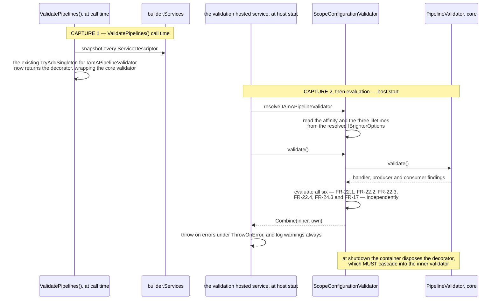
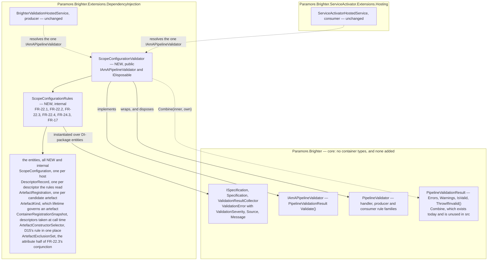

# 74. Where the scope-configuration rules are evaluated

Date: 2026-08-02

## Status

Proposed

## Context

Six configurations are expressible that an application almost certainly did not intend, and they do not all arrive the same way. **Four become expressible with this work**: an opt-in that can never take effect; an opt-in that never reached the options object the factories read, because the application registered that object itself; two different ambient sources registered, of which only one is used; and two opt-in calls disagreeing about what was opted into. **Two are expressible today and go unreported**: a set of lifetimes that shares dependencies across half a pipeline and not the other half, and a process-lifetime artefact that requires a per-request one. Each of the six is silent at run time — the software works, adopts nothing, and says nothing — and FR-22, FR-24.3 and FR-17 require each to be reported at startup instead. That the second pair already works is what makes FR-22.2 a **compatibility break** (C-18) rather than a new guard; *Consequences*, under *Negative*, prices it.

What no prior record decides is **which component evaluates those rules, and how it reaches its inputs.** That is a real question rather than a placement detail, because every one of those inputs is a container concept — three of the rules read service registrations, two read lifetime settings that only exist once the container is built, and one reads both — while the component that runs Brighter's startup validation today lives in core, where no container concept may go.

**Parent Requirement**: [specs/0036-scoped-lifetime-per-pipeline/requirements.md](../../specs/0036-scoped-lifetime-per-pipeline/requirements.md)

**Scope**: This ADR decides one thing — **the evaluation site for FR-22's four rules, FR-24.3's duplicate-provider rule and FR-17's repeated-opt-in rule, and the plumbing that gets their inputs to it**. It discharges FR-22 and the evaluation-site half of FR-24.3 and of FR-17. **It also discharges FR-25 — the guidance page — and NFR-9's truth table**, which is why the page is scheduled here: this is the ADR whose errors are unactionable without it. Every FR-25 clause is mapped to the ADR whose substance it states, in *Implementation Approach* step 7; ADR 0075 supplies the `Publish`-subscriber and nested-pipeline rows of the truth table, and FR-25.5's substance, without either being a second owner — the page and the table are written here. **FR-17 is split three ways across the set** — the model FR-13 also follows, one requirement divided across the siblings that each make part of it true: its registration gesture is ADR 0073's, its write-through mechanism and precedence rule are ADR 0076's, and the site at which its repeated-call rule is evaluated — and the message that rule produces — is this ADR's.

It does **not** decide the rules or their severities. Those are fixed by the requirements and by D5, D8, D9 and D15, and are restated below as inputs rather than re-argued. It does not decide the registration model for `IAmAScopeProvider` — ADR 0072's — nor the three runtime `Warning` latches in `AmbientScopeDiagnostics`. **The boundary with ADR 0072 is exact: 0072 owns the run-time diagnostics a pipeline emits while asking for an ambient; this ADR owns the start-time findings `ValidatePipelines()` produces about the configuration.** They share no code and no state, and the message sets do not overlap.

This ADR **supersedes no prior ADR.** It extends the `ValidatePipelines()` machinery of `0053-pipeline-validation-at-startup` and `0064-validate-pipeline-assembly-and-provider-registration`. Both are cited by slug throughout, here and at every later mention, because the bare numbers are ambiguous: `docs/adr` holds three files numbered 0053, two numbered 0054 and two numbered 0064, and C-16 assigns the bare "ADR 0064" to the *other* one — `0064-pipeline-cache-type-key`.

### Where this ADR sits

Seven ADRs deliver the parent requirement, one decision each. This is the fifth, and it exists because the decisions around it made four of those six wrong configurations expressible — and because the other two, expressible long before this work, have never been reported.

| ADR | Decides |
| --- | --- |
| 0070 | a transform pipeline takes one DI scope, carried **as a parameter** |
| 0071 | handler pipelines converge onto the **same handle**, carried on the object they already pass |
| 0072 | how a pipeline discovers an **ambient** DI scope the host owns |
| 0073 | the **ASP.NET Core package**, and the one line an application writes to opt in |
| **0074** *(this one)* | **where** the six scope-configuration rules are evaluated |
| 0075 | how a `Publish` subscriber **suppresses** adoption, for itself and everything nested beneath it |
| 0076 | the **affinity option**, and how one setting reaches all four registration paths in any order |

The rule the first two state is **the per-pipeline object carries the DI scope**. This ADR neither creates nor holds one: it reports, before any pipeline is built, on whether the configuration those objects will read is coherent.

What the siblings around it settled is what this one reads. ADR 0072 fixed the registration model for `IAmAScopeProvider` — a plain `AddSingleton` on every path, never `TryAddSingleton`, so every duplicate descriptor stays in the collection while Microsoft's container resolves the last. ADR 0076 fixed the opt-in as an affinity property on `IBrighterOptions`, defaulting to today's behaviour, together with the override that carries a registration extension's argument onto whichever options object the four registration paths produce, and ADR 0073 ships the extension that supplies it. Validation is therefore written last **in dependency order** of the six ADRs that shape a configuration — 0070, 0071, 0072, 0073 and 0076 ahead of it — which is a different ordering from the numbering that makes it the fifth. It cannot be written earlier: three of its six rules read values that only exist once 0076 has put them there — FR-22.1, FR-22.2 and, for one of its two inputs, FR-22.3 — and three read the registration model 0072, 0073 and 0076 fixed. Nothing here changes a lifetime, a scope or a pipeline.

ADR 0067's `Terms` block defines the two axes this ADR turns on — Brighter's **configured lifetime**, which governs the artefact, and the container's **registration lifetime**, which governs that artefact's dependencies — and keeps `IServiceScope`, `ServiceProviderLifetimeScope` and `IAmALifetime` distinct. This ADR does not restate it. The rules below read *both* axes and never conflate them: FR-22.1 and FR-22.2 read only configured lifetimes; FR-22.3 reads a configured lifetime on one side and a registration lifetime on the other.

### What the six rules need, and where those inputs live

| Rule | Condition | Severity |
| --- | --- | --- |
| **FR-22.1** | `DefaultScopeAffinity` is `JoinAmbient` and **none** of `HandlerLifetime`, `MapperLifetime`, `TransformerLifetime` is `Scoped` — the opt-in is inert (D5) | **Error** |
| **FR-22.2** | discarding any of the three that is `Singleton`, the remainder is not uniform — `Transient` and `Scoped` are mixed. Under either affinity (D8) | **Error** |
| **FR-22.3** | an artefact whose **configured** lifetime is `Singleton` takes a direct constructor parameter whose **registration** lifetime is `Scoped` — a captive dependency (D9) | **Warning** |
| **FR-22.4** | an affinity override is registered, and the `IBrighterOptions` descriptor the container will resolve is not one Brighter's own registration produced — so the override was never applied and the opt-in is lost | **Error** |
| **FR-24.3** | the service collection holds `IAmAScopeProvider` descriptors for more than one distinct implementation type | **Warning** |
| **FR-17** | the service collection holds affinity-override descriptors carrying more than one distinct `ScopeAffinity` value — the registration extension was called twice with different affinities | **Warning** |

Every message names `docs/guides/lifetimes-and-scoping.md` (AC-43), and FR-25.10 requires a troubleshooting entry keyed to each of the six.

Three properties of that set are load-bearing and follow from enumerating it rather than from reading any one row:

- **FR-22.1 and FR-22.2 are mutually exclusive by construction.** FR-22.2 fires only when the remainder contains `Scoped`; FR-22.1 fires only when nothing is `Scoped`. No host can receive both errors, so the two messages never contradict each other about what to do next.
- **FR-22.1 is "none is `Scoped`", not "all are `Transient`".** `{Singleton, Singleton, Singleton}` with `JoinAmbient` is an inert opt-in and is an error. AC-27 exercises the all-`Transient` case; the rule is wider than the case.
- **The rules are evaluated independently, and no precedence may be invented among them.** That mutual exclusion is a property of FR-22.1 and FR-22.2 alone; it does not generalise. FR-22.4 in particular can fire *with* another rule — a host whose application-registered `IBrighterOptions` carries `JoinAmbient` over three `Transient` lifetimes trips FR-22.1 as well, and both findings are reported. This is where the set differs from ADR 0072's three run-time diagnostics, which are mutually exclusive on a given ask. AC-50's own host raises exactly one error, but for a reason particular to it rather than by rule ordering: the override having been defeated, the affinity the validator reads is the pre-registered object's `AlwaysNew`, so FR-22.1's `JoinAmbient` precondition simply fails.

The three lifetimes are a **joint** choice. `{Scoped, Scoped, Transient}` is not a destination, so FR-22.2's message must list all three values and reach FR-25.9's decision guide (NFR-10) — a message that says only "this is wrong" fails the requirement.

### The forces

- **Core must gain no container types.** NFR-1's load-bearing clause is *source-level*: no file under `src/Paramore.Brighter/` may reference `ServiceLifetime`, `IServiceCollection`, `IServiceProvider` or `ServiceDescriptor`. Because `Microsoft.Extensions.DependencyInjection` is already on core's compile closure transitively through `Microsoft.Extensions.Logging`, those types **compile** in core today — a project-file check is vacuous and AC-22.3's source scan is the only real guard. Verified: that scan returns **zero** matches under `src/Paramore.Brighter/` today. The durable reason is ADR 0014's — Brighter offers per-family factory interfaces rather than abstracting an IoC container.
- **The rules are all container concepts.** FR-22.1 and FR-22.2 read `ServiceLifetime` directly; FR-22.4, FR-24.3 and FR-17 read `ServiceDescriptor`s; FR-22.3 reads both, a configured lifetime on one side and a registered one on the other. There is no framing in which they belong in core.
- **The evaluator today is in core.** `PipelineValidator` is `src/Paramore.Brighter/Validation/PipelineValidator.cs:54`, and `IAmAPipelineValidator` is a core interface with a single `PipelineValidationResult Validate()`.
- **`PipelineValidator` has no access to `IBrighterOptions`.** `BrighterPipelineValidationExtensions.cs:91-93` constructs it with a pipeline builder, publications, subscriptions, consumer specs, inbox, outbox, provider registrations, a mapper-registry factory and a transformer probe — and nothing that carries a lifetime. Supplying the missing inputs is new work, and is why this is an ADR.
- **The inputs must be read as the factories read them.** The five container-backed factories read the object `IBrighterOptions` resolves to (`ServiceProviderMapperFactory.cs:44`), **not** `IOptions<BrighterOptions>.Value` — which is a different object on three of the four registration paths, because only one of them runs an `IOptions` pipeline at all (C-12a; the four sites are enumerated under *How the inputs reach the rules*). Validation must not pass a configuration the factories will ignore, nor fail one they would have honoured.
- **The only precedent for reading the container without resolving it does no constructor inspection at all.** `ServiceCollectionTransformerResolvabilityProbe` (`:40-56`) is a `HashSet<Type>` and a `Contains`. It is a precedent for *snapshot-and-query-without-resolving* and for nothing else; the constructor and lifetime walk FR-22.3 needs is new.
- **`ValidatePipelines()` is opt-in and snapshots at call time** (`BrighterPipelineValidationExtensions.cs:58`; step 2 gives the existing capture points it joins). C-15 makes the residual gaps explicit and accepted.
- **Both host shapes must fire, and the consumer one is not Brighter's to register.** `AddConsumers` sets `ConsumerOwnsValidation`, which makes `BrighterValidationHostedService.StartAsync` return immediately (`BrighterValidationHostedService.cs:73`), so the consumer path runs through `ServiceActivatorHostedService` — which nothing in `src` registers (D14). Any change to that host would be exercised only where a test registers the hosting package itself. *Both host shapes, enumerated* below walks all six combinations with their citations.
- **Errors and warnings must stay distinguishable.** Three of the six messages are errors and three are warnings, and a warning must never block startup whatever `ThrowOnError` says.

## Decision

**The six rules are evaluated by a validator in the container package that decorates the core one, so the existing validation hosts fire it unchanged and neither of them knows.**

The shape that takes is a decorator rather than a second registration, because both hosts consume exactly one validator: the decorating validator implements the core validation interface, is what the existing registration inside `ValidatePipelines()` hands back, runs the core validator first and returns the two results combined. Its lifetime and affinity inputs are read from the object `IBrighterOptions` resolves to, at host start; its registration inputs are snapshotted from the service collection at `ValidatePipelines()` call time. No type in `Paramore.Brighter` gains a container concept, and no core rule family is extended. The types and signatures are under *Key Components*.

### The mechanism, end to end

The rules must run in the DI package, because every input they read is a container concept. The component that runs Brighter's startup validation lives in core, and both hosted services consume exactly **one** validator. So the DI package does not add a validator — it **wraps** the one that already exists, at the registration point it already owns, and returns the combined result. Neither hosted service changes, and neither knows.

The inputs arrive at two deliberately different instants, and a validation run is a function of exactly those two:



Why those two instants and not one. The descriptors are snapshotted at call time because that is what `ValidatePipelines()` already does with its provider registrations and its transformer probe, and because C-15's "call it last" guidance depends on it. The lifetimes and the affinity are read at host start because on three of the four registration paths the value does not exist until `IBrighterOptions` is resolved, and because ADR 0076's override lands inside that resolution. Reading `IOptions<BrighterOptions>.Value` instead would read a *different object* on three of the four paths (C-12a) — validation would then pass configurations the factories will ignore, and fail ones they would have honoured.

The last note on the diagram is easy to miss and expensive to get wrong: the container tracks only the instance a factory **returns**, so an inner validator created inside the delegate and not returned would never be disposed, and the `MessageMapperRegistry` it may have built lazily — with the mapper factory and any DI scope it holds — would live to process exit.

### Where the pieces live



**Reading the edges**, on the convention ADRs 0070 and 0071 use: a solid arrow is a compile-time reference or an ownership, a dotted arrow is a runtime call or resolution. Every solid arrow crossing into core runs from the DI package inward, which is the real reference direction — core names nothing here. The two host edges are dotted because the hosts do not reference the decorator at all: they resolve `IAmAPipelineValidator` and get it, which is the whole reason neither of them changes. One subgraph per assembly, so the two hosts sit in *different* boxes: `BrighterValidationHostedService` ships in the DI package and `ServiceActivatorHostedService` in the hosting package that nothing in `src` registers (D14).

### Key Components

#### The roles, and what each is responsible for

| Role | Type | Stereotype | Responsibility |
| --- | --- | --- | --- |
| Validation coordinator | `ScopeConfigurationValidator` (DI package) | **doing** | Runs the inner validator, evaluates the container rule set, combines the two results, and owns the inner validator's disposal |
| Host configuration | `ScopeConfiguration` (DI package) | **knowing** (information holder) | The affinity and the three configured lifetimes as the factories see them, plus the ambient-source registrations, the affinity-override registrations and the `IBrighterOptions` registrations, each list in registration order. All three lists are `DescriptorRecord`s — one type, because all three rules ask the same questions of a descriptor: it pairs a descriptor with its registration position and, where one is statically known, its implementation type; where none is, the position stands in for it, and where the descriptor supplies an `ImplementationInstance` the runtime value is carried too (which is how FR-17 reads the affinities). Each `IBrighterOptions` entry additionally carries whether that descriptor is one Brighter's own registration produced |
| Artefact under test | `ArtefactRegistration` (DI package) | **knowing** | One candidate artefact: its type, its `ArtefactKind` — handler, mapper or transform, which is what selects the governing configured lifetime — and that lifetime's value |
| Registration snapshot | `ContainerRegistrationSnapshot` (DI package) | **knowing** | The descriptors as they stood when `ValidatePipelines()` was called; answers "what lifetime is this service type registered with" and "what artefacts are registered" without resolving anything |
| Constructor choice | `ArtefactConstructorSelector` (DI package) | **deciding** | D15's rule, and only D15's rule: the public constructor with the most parameters; on a tie, none |
| Brighter's own artefacts | `ArtefactExclusionSet` (DI package) | **knowing** (information holder) | The set of artefact types returned by a `RequestHandlerAttribute` or `TransformAttribute` `GetHandlerType()`. It answers one question — is this type one Brighter put in the pipeline itself — and holds the attribute half of FR-22.3's conjunction |
| The rules | `ScopeConfigurationRules` (DI package) | **deciding** ×6 | Each rule decides whether one entity satisfies it, and what the finding says when it does not |
| Finding | `ValidationError` (core) | **knowing** | Severity, source, message — unchanged |
| Reporting | the two hosted services | **doing** | Throw on errors under `ThrowOnError`, log warnings always — unchanged |

`ScopeConfigurationValidator` is the only one of these that is public; the rest are `internal` to the DI package. **Its constructor is therefore `internal`, while the type is public** — C# forbids a public constructor whose parameter types are less accessible (CS0051), and the only call site is the registration delegate in the same assembly. The fix is the constructor's accessibility, not the entities': the constructor names **two** internal types — `ContainerRegistrationSnapshot` and `ArtefactExclusionSet` — and widening them to satisfy a compiler rule would put two DI-package implementation types on the public surface for no caller's benefit. The rest are built inside the validator and never named on its signature. Only the validator is something an application can meaningfully name, and only because it is what `IAmAPipelineValidator` now resolves to.

#### The evaluation site: a decorating validator, not a second registration

`IAmAPipelineValidator` is registered `TryAddSingleton` (`BrighterPipelineValidationExtensions.cs:71`), and **both** hosts consume exactly one instance: `BrighterValidationHostedService` takes it as a constructor parameter (`:60`) and `ServiceActivatorHostedService` resolves it with `GetService<IAmAPipelineValidator>()` (`:50`). Registering a second implementation with a plain `AddSingleton` therefore does not compose — Microsoft's container would resolve the last descriptor and the core validator's findings would silently disappear.

So the DI package composes at the point it already owns. The factory delegate at `:71-94` continues to build the core `PipelineValidator` exactly as it does today, and returns it wrapped:

```csharp
builder.Services.TryAddSingleton<IAmAPipelineValidator>(sp =>
{
    //mapperRegistryFactory is deliberately nullable and STAYS nullable: PipelineValidator turns a
    //null factory into a null _mapperRegistry, and uses that null-ness as the gate on the
    //wrap-transform rule. Forcing a non-null factory here would run that rule in hosts where it
    //does not run today. So the Lazy exists only when the builder does.
    var registry = mapperRegistryFactory is null
        ? null
        : new Lazy<MessageMapperRegistry>(mapperRegistryFactory);

    var inner = new PipelineValidator(
        /* the first seven arguments exactly as today */,
        mapperRegistryFactory: registry is null ? null : () => registry.Value,
        transformerProbe: sp.GetService<IAmATransformerResolvabilityProbe>());

    return new ScopeConfigurationValidator(
        inner,
        sp.GetRequiredService<IBrighterOptions>(),
        snapshot,                                     // captured from builder.Services, above the delegate
        ArtefactExclusionSet.Build(pipelineBuilder, registry?.Value, publications, subscriptions),
        registry);                                    // owned when non-null: disposed with the decorator
});
```

**`transformerProbe` is named rather than left to the placeholder, because dropping it is silent.** It is `PipelineValidator`'s ninth and last parameter and it defaults to `null`, so a call that stops at `mapperRegistryFactory` still compiles — and the wrap-transform rule is gated on `_mapperRegistry is not null && transformerProbe is not null` (`PipelineValidator.cs:139`), so the rule the comment above exists to protect would simply stop running. Today's call site supplies both (`BrighterPipelineValidationExtensions.cs:91-93`) and the decorator must keep supplying both.

**What the exclusion set does with no registry.** `mapperRegistryFactory` is null exactly when no mapper-registry builder was supplied (`BrighterPipelineValidationExtensions.cs:85-88`), which is a host with no mappers to describe. `ArtefactExclusionSet.Build` then produces the **handler half only** — `PipelineBuilder<IRequest>.Describe()` needs no registry — and the transform half is empty, which is correct rather than degraded: there are no mapper-declared transforms to exclude. FR-22.3 still evaluates, and still excludes Brighter's own handlers. This is the same null-ness the core validator gates its wrap-transform rule on, read the same way, so the decorator adds no divergence.

**And it does force the `Lazy` where one exists.** `Build` takes `registry?.Value`, so in a host that has a registry builder the registry is constructed during the factory delegate rather than on first use — the cost the *Negative* bullet on startup cost records. What it does not do is change *whether* the registry exists, which is the thing the core validator's behaviour turns on.

Three consequences of that shape, each of which is why it was chosen:

- **Neither hosted service changes.** Both host shapes fire, and the change is invisible to `ServiceActivatorHostedService` — which matters, because D14 records that nothing in `src` registers it, so a change there would be exercised only by tests that register it explicitly (AC-40 does).
- **`TryAddSingleton` keeps its meaning.** An application that registers its own `IAmAPipelineValidator` before calling `ValidatePipelines()` replaces Brighter's validation wholesale, exactly as today. That escape hatch now costs six more rules; it is unchanged in kind.
- **The core validator stays untouched.** No new constructor parameter, no new rule family, no new entity type in core. AC-22.3's scan finds nothing new because there is nothing new in core to find.

**Contract.**

| Member | Input | Output | Error conditions |
| --- | --- | --- | --- |
| `ScopeConfigurationValidator.Validate()` | none (all inputs held from construction) | a `PipelineValidationResult` combining the inner validator's findings with this ADR's six rules | Propagates whatever the inner validator propagates. A rule-body exception is converted by `Specification<T>` into a `ValidationSeverity.Error` finding, as it is for every existing rule (`0064-validate-pipeline-assembly-and-provider-registration`) — the rules add no bespoke `try`/`catch`. **Thread safety:** every input is captured at construction and never mutated, and the host table above establishes that at most one validation host calls this per host shape, so a repeated or concurrent call is safe and yields the same result. That is an invariant of this decorator's construction, **not** a discharge of NFR-4 — NFR-4 is about beginning and releasing pipeline scopes and establishing and clearing ambient suppression under concurrent pipelines, and a start-time validator is neither, the same distinction ADR 0076 draws for its singleton write. No acceptance criterion asserts a repeated `Validate()`, and none is owed: nothing calls it twice |
| `ScopeConfigurationValidator.Dispose()` | none | — | Disposes the inner `PipelineValidator` **and the `MessageMapperRegistry` this validator owns**. Idempotent, and safe against the inner validator disposing the same registry — `MessageMapperRegistry.cs:360-362` claims disposal with a single `Interlocked.Exchange` |

That last row is not incidental. `PipelineValidator` implements `IDisposable` and its `Dispose` (`:85`) drains the `MessageMapperRegistry` it may have built lazily, on the stated understanding that the container disposes the validator at shutdown. The container tracks only the instance a factory **returns**, so an inner validator created inside the delegate and not returned would never be disposed and the registry — with the mapper factory and any DI scope it holds — would live to process exit. The decorator must cascade, and that obligation is stated here rather than left to be discovered.

#### How the inputs reach the rules — two capture points, deliberately different

| Input | Read from | When | Why then |
| --- | --- | --- | --- |
| `DefaultScopeAffinity`, `HandlerLifetime`, `MapperLifetime`, `TransformerLifetime` | the object `IBrighterOptions` resolves to | at host start, from the built container | Per D18 the ASP.NET extension's affinity argument is written into Brighter's own `IBrighterOptions` registration and therefore lands after every application options delegate; and on three of four paths there is no `IOptions` pipeline at all, so the value only exists once `IBrighterOptions` is resolved. Reading `IOptions<BrighterOptions>.Value` instead would read a different object on three of the four paths (C-12a) |
| every `ServiceDescriptor` | `builder.Services` | at `ValidatePipelines()` call time | C-15's snapshot semantics, and the same point at which `ValidationProviderRegistrations` (`:64-66`) and `ServiceCollectionTransformerResolvabilityProbe` (`:68-69`) are already captured. AC-32 requires `ValidatePipelines()` to be called after both provider registrations for the duplicate to be seen |

`GetRequiredService<IBrighterOptions>()` is safe on all four entry points: each entry point routes through `BrighterHandlerBuilder`, which after ADR 0076 step 3 is the single site that registers `IBrighterOptions` — that step deletes the four per-path registrations, today at `AddBrighter(Action)` `ServiceCollectionExtensions.cs:74`, `AddBrighter(Func)` at `:97`, `AddConsumers(Action)` at `ServiceActivator…/ServiceCollectionExtensions.cs:38`, `AddConsumers(Func)` at `:88` — and all four route through `BrighterHandlerBuilder`, so each alone is a complete host. All four go through ADR 0076's `RegisterBrighterOptions`, which spells the first-registration-wins rule out as an explicit guard plus `Add` rather than calling `TryAddSingleton`, precisely so the descriptor it adds is one it can hand on for FR-22.4 to ask about; the *effect* is `TryAddSingleton`'s and the FR-22.4 section below turns on the difference.

`IBrighterOptions` has `TryAddSingleton`'s **first-wins effect** on both sides — after ADR 0076 through that step's explicit guard rather than through `TryAdd` itself — so in a mixed host the first registration wins (C-12). The validator reads whichever object that is. With `AddBrighter` before `AddConsumers(Action<ConsumersOptions>)` it reads the producer's `BrighterOptions`, which is what AC-40 requires; in the reverse order it reads the `ConsumersOptions` instance, and the producer's affinity and lifetimes are never seen — by the factories either. **That is correct, not a defect**: the requirement is that validation reads the configuration the factories honour, including when that is the surprising object. (The pre-existing `InvalidCastException` from `AddBrighter` before the `Func` overload of `AddConsumers` (`:89-90`) is C-12's, is untouched here, and already bites `ResolveSubscriptions`.)

#### The six rules

Each is an `ISpecification<T>` built with the existing `Specification<T>` constructors, evaluated with `ValidationResultCollector<T>` — the same machinery `0053-pipeline-validation-at-startup` established and `0064-validate-pipeline-assembly-and-provider-registration` extended, instantiated in the DI package over DI-package entity types. There are two entity families.

**Family 1 — `ScopeConfiguration`, exactly one per host.** Carries the affinity, the three configured lifetimes, the `IAmAScopeProvider` registrations, the affinity-override registrations and the `IBrighterOptions` registrations. Five rules evaluate it:

| Rule | Message must contain | `Source` |
| --- | --- | --- |
| FR-22.1 | the affinity setting; all three lifetimes **with their values**; that the opt-in has no effect; the guidance page | `"Brighter options"` |
| FR-22.2 | all three lifetimes with their values; that the mixed pair do not share pipeline-scoped dependencies; the guidance page | `"Brighter options"` |
| FR-22.4 | the affinity the override carries; that the resolved `IBrighterOptions` was supplied by the application rather than by Brighter, so the override was never applied; the remedy — configure Brighter's options through `AddBrighter`/`AddConsumers` rather than by registering `IBrighterOptions` directly; the guidance page | `"Brighter options registration"` |
| FR-24.3 | every registered implementation type; which one is effective (the **last** registered, matching Microsoft's resolution); the guidance page | `"Scope provider registration"` |
| FR-17 | every `ScopeAffinity` value registered; which is effective (the **last**, matching Microsoft's resolution); that the extension is called once and its argument is how an affinity is selected; the guidance page | `"Scope affinity registration"` |

FR-24.3's detail, stated over the family of descriptor shapes rather than the common one: a descriptor whose `ImplementationType` is statically known contributes that type; one registered by factory delegate or instance contributes its registration **position**, and its runtime type where `ImplementationInstance` supplies one. Distinctness is over implementation types, so the *same* implementation type registered twice is not a finding (AC-32's second branch) — it is idempotent in effect. Because Brighter registers no default provider (D11), the ASP.NET extension can never itself create a duplicate; two application registrations are the only way to reach this rule.

**FR-17 is the same rule shape over a different distinctness key, and the two are complementary rather than overlapping.** FR-24.3 asks whether two *different providers* were registered; FR-17 asks whether two *different affinities* were. A host that calls ADR 0073's extension twice reaches only the second: both calls register the same `HttpContextScopeProvider`, which FR-24.3 excludes in terms — the exclusion is exactly why a sixth rule is needed rather than a wider fifth one. Distinctness here is over the `ScopeAffinity` **value**, so a repeat carrying the same affinity is not a finding, mirroring FR-24.3's own exclusion and for the same reason (AC-49's third branch). The values are read from the descriptors' `ImplementationInstance` — ADR 0073's extension registers ADR 0076's override as an instance, with plain `AddSingleton` precisely so that every call's descriptor survives for this rule to see (FR-17). **A descriptor from which no `ScopeAffinity` value can be read contributes nothing to the distinctness set**, and FR-24.3's registration-position fallback is deliberately *not* borrowed here: FR-24.3's key is an implementation type, for which a position is a defensible "unknown, treat as distinct", but this rule's key is a **value**, and two positions are always distinct — so the fallback would turn the idempotent repeat FR-17 exempts in terms into a `Warning`, which AC-49's third branch falsifies. The path is reachable: `ScopeAffinityOverride` is public in the DI package, and a third-party opt-in package registering it as `AddSingleton(sp => new ScopeAffinityOverride(x))` supplies no instance. The obligation that follows belongs to the registrar rather than to the rule — **an override registered by factory delegate cannot be compared and therefore cannot be reported**, so a package that wants its opt-in to be reportable registers an instance, as ADR 0073's does. Missing an uncomparable descriptor is the better failure: reporting one as a conflicting affinity would be a finding about something never read. This rule needs no new input: the descriptors are already in the `ValidatePipelines()`-time snapshot the other container rule reads.

**FR-22.4 is a rule about registrations, not about values, and that is what makes it work in both orderings.** The condition has two conjuncts: an affinity override is present in the snapshot — the same descriptors FR-17 reads — **and** the `IBrighterOptions` descriptor Microsoft's container will resolve, which is the **last** one for that service type, is not one Brighter's own registration produced. Three things follow, each of which an implementation could get wrong while still satisfying the row above:

- **It must not compare affinity values.** An override carrying `AlwaysNew` — the option's own default (FR-14) — is by value indistinguishable from an override that was never applied, so a value comparison would miss exactly the hosts that pass the default and would make the rule's coverage depend on which affinity was chosen. FR-22.4 forbids it in terms, and AC-50's identical-values branch is the falsifier.
- **A record taken when Brighter's own `TryAddSingleton` runs is not sufficient on its own.** It sees the *before* ordering, where an application registration already present makes the `TryAdd` a no-op. In the *after* ordering the `TryAdd` succeeds and Brighter's descriptor is genuinely in the collection — it simply is not the last one, so it never runs. Only the collection distinguishes that case, which is why the rule reads the snapshot it already takes for FR-24.3 and FR-17 rather than a flag. AC-50's after-ordering branch is that falsifier.
- **What makes a descriptor "Brighter's" is ADR 0076's to say, not this ADR's.** Brighter registers `IBrighterOptions` from exactly one definition — 0076's `RegisterBrighterOptions`, which every one of the four entry points calls — and that definition records the descriptor it adds as a `BrighterOptionsRegistration` **placed in the service collection**, so it reaches this rule through the same call-time snapshot as every other container input and needs nothing resolved. This rule asks 0076's record whether the last descriptor is the recorded one; it does not attempt to recognise Brighter's registration by inspecting a delegate. The recorded value is absent in the before ordering and present-but-not-last in the after ordering, and both are the same finding.

**Like FR-24.3, this rule reads the snapshot and therefore inherits its precondition:** `ValidatePipelines()` must be called after the registrations it is to see. In the natural fluent form an application registration made after `AddBrighter` is also after the snapshot, so the rule would see nothing — the same silent loss it exists to break. AC-50's Given carries that constraint (`ValidatePipelines()` called last) and FR-25.10's guidance must state it, exactly as AC-32 does for the duplicate-provider rule.

**"Called last" has to mean something stronger than the fluent form, and AC-50's after-ordering branch is where that bites.** That branch is a plain `services.AddSingleton<IBrighterOptions>(...)` — the shape an application writes beside its other `services.Add*` calls, which in a typical `Program.cs` is *after* the `AddBrighter(...).ValidatePipelines()` statement has already run and snapshotted. For the branch to be reachable at all, "called last" must mean holding the `IBrighterBuilder` and calling `ValidatePipelines()` as a separate statement after every other registration, not chaining it onto `AddBrighter`. FR-25.10's guidance says so in those terms. Where an application does not, this rule is defeated by the very shape it exists to catch — recorded under *Negative* and in the risk table rather than argued away, because the mitigation is guidance and guidance is weaker than a mechanism.

Nothing here fires on an application that registers `IBrighterOptions` itself and never opts in: the override conjunct is what keeps that host silent, and it is not a hypothetical population — 125 files under `tests/` register `IBrighterOptions` themselves today. Nor does it fire in a mixed host merely because `IBrighterOptions` is `TryAddSingleton` on both sides: whichever side won, it registered through `RegisterBrighterOptions`, so the last descriptor is Brighter's and the override was applied (C-12).

**Family 2 — `ArtefactRegistration`, one per candidate artefact.** FR-22.3 evaluates it, and yields one `Warning` per captive parameter, naming the artefact type and the `Scoped` service it requires, plus the guidance page. `Source` is `$"{kind} '{artefactType.Name}'"`.

#### Captive-dependency detection: what it reads, and what it cannot see

**Candidates** come from the snapshot, not from the describe path. A descriptor contributes a candidate when its implementation type implements one of the core, container-free marker interfaces — `IHandleRequests`/`IHandleRequestsAsync` (Handler), `IAmAMessageMapper`/`IAmAMessageMapperAsync` (Mapper), `IAmAMessageTransform`/`IAmAMessageTransformAsync` (Transform). That is exactly FR-22.3's "discovered by assembly scanning or registered explicitly": all three registration builders register the artefact as its own service type at `ServiceLifetime.Transient` (`ServiceCollectionSubscriberRegistry.cs:63`, `:76`, `:90`, `:116`, `:130`, `:146`, `:160`; `ServiceCollectionMessageMapperRegistryBuilder.cs:80`, `:99`, `:116`, `:117`, `:127`, `:137`; `ServiceCollectionTransformerRegistry.cs:56`).

**The kind selects the configured lifetime.** Handlers are governed by `HandlerLifetime`, mappers by `MapperLifetime`, transforms by `TransformerLifetime`; only candidates whose governing lifetime is `Singleton` are inspected. This is why AC-42 moves the `Singleton` between kinds as it moves between cases: no single triple can serve a `Singleton` mapper and a `Singleton` transform at once. A type presenting two kinds is evaluated under each, and findings are de-duplicated by (artefact type, dependency service type) so it cannot be reported twice for one dependency. **`ContainerRegistrationSnapshot` yields one `ArtefactRegistration` per `(type, kind)`, so such a type appears in the candidate list twice — once under each kind — and the de-duplication is applied where that list is built rather than inside the rule.** FR-22.3's specification evaluates what it is handed and appends every failure, as every rule in this codebase does; collapsing two identical findings belongs to the code that assembles the candidates and collects the results, not to the specification.

One registration per pair is also what keeps the entity legible, and every other statement of it in this ADR already reads that way: it carries a **single** `ArtefactKind` and the single configured lifetime that kind selects, which is what the roles table above records, what the flowchart's *one per candidate artefact* means, and what makes the `Source` format `$"{kind} '{artefactType.Name}'"` well defined. A registration carrying a *set* of kinds would carry a set of governing lifetimes with it, and nothing here would say which kind `Source` names, or how a rule reading "the" governing lifetime should behave when one of them is `Singleton` and another is not.

**Exclusion is a conjunction, and the conjunction is the point.** A candidate is Brighter's own — and excluded — when it is **both** returned by a `RequestHandlerAttribute.GetHandlerType()` (`RequestHandlerAttribute.cs:91`, `public abstract`) or a `TransformAttribute.GetHandlerType()` (the type is `TransformAttribute`; the file is `TransformAttributeBase.cs`, class `:5`, member `:17`) **and** defined in an assembly whose simple name is `Paramore.Brighter` or begins with `Paramore.Brighter.` — the trailing dot is part of the rule.

The attribute-returned set is read from the reflection-only describe path that already exists and instantiates nothing: `PipelineBuilder<IRequest>.Describe()` (`PipelineBuilder.cs:151`) yields every `PipelineStepDescription.HandlerType`, and `TransformPipelineBuilder.DescribeTransforms(registry, requestType, includeAsync: true)` (`:270`) yields every `TransformStepDescription.TransformType` for each request type reachable from the publications, the subscriptions, and the registered handlers. A mapper reachable by none of those three is unreachable at run time as well, so nothing is lost.

Both halves are load-bearing, and both are pinned by AC-42:

- Without the transform half, `ClaimCheckTransformer` (`src/Paramore.Brighter/Transforms/Transformers/ClaimCheckTransformer.cs:62`, taking `IAmAStorageProvider` and `IAmAStorageProviderAsync`) would be warned against in any host **that has registered it** with `TransformerLifetime = Singleton` and an `AddScoped` storage provider — a Brighter type reported as the user's. Registration is what makes it a candidate at all: candidates come from the snapshot, and `AutoFromAssemblies` (`ServiceCollectionBrighterBuilder.cs:118-122`) filters out every assembly whose name begins `Paramore.Brighter`, so an application using `[ClaimCheck]` registers the transform explicitly. The same filter bears on AC-42's prefix case — a transform in `Paramore.Brighter.Extensions.Tests` is not auto-scanned either, so that test registers explicitly too. Transforms never pass through `RequestHandlerAttribute`.
- Without the prefix half, a transform in an assembly named `Paramore.Brighter.Something` would not be excluded. No Brighter-shipped out-of-core transform can pin this: `JustSayingCompressionTransform` (`Paramore.Brighter.Transformers.JustSaying/JustSayingCompressionTransform.cs:34`) and `MassTransitTransform` (`:40`) are both parameterless, so a case built on either would raise no warning under an exact-name implementation and would prove nothing. AC-42 uses a transform in `Paramore.Brighter.Extensions.Tests` instead.

Note that Brighter's own attribute-driven handler decorators are excluded **by this mechanism**, not incidentally by being open generics. `ExceptionPolicyHandlerAsync<>` is registered by `ServiceCollectionSubscriberRegistry` and would also be skipped by the open-generic rule below, so **on that type the two paths are indistinguishable from outside** and AC-42's `[UsePolicyAsync]` clause does not pin which one ran — both yield no warning, and the clause asserts output only. The exclusion is applied first for a different reason: a Brighter attribute-returned handler that is *not* an open generic, and that takes a constructor dependency, would otherwise be reported as the application's. No such handler ships today, which is why no AC can distinguish the two mechanisms; the ordering is chosen so the rule stays correct if one ever does.

**Constructor selection is D15's rule and lives in one object.** `ArtefactConstructorSelector` returns the public constructor with the most parameters; where two public constructors have the same parameter count, it returns nothing and the type is not inspected. A type with no public constructor, or with only a parameterless one, yields nothing.

This is deliberately **not** Microsoft's selection, which additionally requires the winner's parameter set to be a superset of every other resolvable candidate's — throwing `InvalidOperationException` otherwise — and which treats `IServiceProvider`, `IServiceScopeFactory` and `IEnumerable<T>` as resolvable with no descriptor. The divergence is acceptable, and the reason is that the two are answering different questions. Microsoft's selector answers *which constructor will I activate*, and it can only answer it for a type it is willing to activate at all. Brighter's rule answers *what does this type appear to require*, for a type nobody is going to activate — the whole value of the check is that it runs before anything is built. AC-42's final clause makes the divergence explicit and necessary: a mapper with two same-count constructors is not activatable by Microsoft's container at all, and the AC asserts validation output while forbidding the mapper to be resolved. A rule that reproduced Microsoft's selection could not report on that type, because Microsoft's selection has no answer for it.

**Each parameter's lifetime** is the `ServiceLifetime` of its descriptor in the snapshot. Where the parameter type is a constructed generic with no descriptor of its own, the descriptor for its generic type definition is used — that is the descriptor Microsoft's container would resolve through, so it is a faithful reading of "the parameter's own descriptor" rather than a widening of the rule. Where more than one descriptor exists for a service type, the **last** is read, matching Microsoft's resolution and FR-24.3's last-wins.

**Failure modes, enumerated and accepted.** **Three** rows can report *wrongly* — the snapshot-staleness row, the Brighter-mapper row and the unresolvable-parameter row below — and each is marked as such. One more is neither: on the superset row the warning is **moot**, because the type it warns about cannot be activated at all. The rest are silent misses, where the rule reports nothing it should have.

| Case | Outcome | Standing |
| --- | --- | --- |
| A registration made **after** `ValidatePipelines()` was called | invisible, and on one branch **wrong**: a mapper registered later is not a candidate at all, and a later `AddScoped<IOrderDbContext>()` makes a real captive dependency invisible — while a later registration that *changes* a service type's effective lifetime makes the snapshot's last-descriptor reading disagree with what the container will resolve, so a warning can be raised about a dependency that is no longer `Scoped`, or withheld about one that now is | C-15, and the reason the guidance is "call `ValidatePipelines()` last" |
| Open generic artefact type | not inspected — a parameter typed by a type parameter has no descriptor to read | Necessary; no meaningful reading exists |
| Artefact registered by factory delegate or instance | not a candidate — no statically known implementation type | C-20(ii), explicitly |
| Parameter with no descriptor, including `IServiceProvider`, `IServiceScopeFactory` and `IEnumerable<T>` | not a finding, per FR-22.3's "what is read for each parameter" | C-20(i)'s divergence from Microsoft's always-resolvable services |
| Transitive captivity — a `Singleton` artefact taking a `Transient` that itself takes a `Scoped` | not reported | C-20(ii), pinned by AC-42 |
| Two public constructors of equal parameter count | not inspected | D15, pinned by AC-42 |
| A widest constructor Microsoft's container would **not** select because its parameter set is not a superset of every other **resolvable** candidate's | the warning is **moot**, not wrong: Microsoft's container refuses to activate the type at all — `InvalidOperationException: … The following constructors are ambiguous` — so the host fails at first resolution whatever validation said. Brighter's finding is the earlier and more actionable of the two | C-20(i), which states the divergence in both directions. No acceptance criterion exercises it; AC-42's equal-count mapper is the same shape from the other side, and asserts validation output while forbidding the mapper to be resolved |
| A widest constructor Microsoft's container would **not** select because one of its parameters has no descriptor, so the container falls back to a narrower candidate | **would warn wrongly**, naming a `Scoped` parameter on a constructor the container never uses. This — not the superset row above — is the case in which "warns wrongly" is literally true | C-20(i)'s divergence, in the direction the superset row does not cover. No acceptance criterion exercises it. Distinct from the no-descriptor row above: the parameter with no descriptor is not itself a finding, and the finding is raised against a *different*, registered, `Scoped` parameter of the same constructor |
| An application type in a `Paramore.Brighter.*` assembly, returned by an attribute | excluded | C-20(iii), pinned by AC-42 |
| A Brighter-shipped **mapper** with constructor dependencies | **would be reported** — no mapper is returned by an attribute, so the exclusion cannot reach one | C-20(iv), pinned by AC-42's paired same-assembly mapper case. Latent today; Brighter ships no such mapper |

**Nothing is resolved and no provider is built.** The snapshot is the same technique `ServiceCollectionTransformerResolvabilityProbe` uses, extended from a membership test to a constructor and lifetime walk.

#### The result path is the existing one, and it already carries both severities

Verified rather than assumed, because three of the six messages are warnings:

- `ValidationSeverity` has exactly `Error = 0` and `Warning = 1`. No third severity is needed and none is added.
- `PipelineValidationResult.IsValid` is `Errors.Count == 0` (`:45`) — warnings alone never make a result invalid — and `ThrowIfInvalid()` (`:52`) throws `PipelineValidationException` only when errors are present.
- `PipelineValidationResult.Combine` (`:64`) merges errors and warnings from several results. It exists and is unused in `src`; this is the composition it was written for.
- `ThrowOnError` (`BrighterPipelineValidationOptions.cs:47`, default `true`) gates **errors only**, in both hosts: `BrighterValidationHostedService` throws at `:80` or logs errors at `:84`, and logs every warning at `:90-93` regardless; `ServiceActivatorHostedService` does the same at `:57`/`:61` and `:67-70`.

So FR-22.1, FR-22.2 and FR-22.4 fail startup under `throwOnError: true` and log at `LogLevel.Error` under `throwOnError: false` (AC-27, AC-28, AC-50), while FR-22.3, FR-24.3 and FR-17 log at `LogLevel.Warning` and never block (AC-42, AC-32, AC-49). A parallel result path would have had to reproduce all of that.

That split is why AC-50 is written in two halves rather than one: an Acceptance Criterion asserting an `Error` cannot also assert what the host does afterwards, because under the default `throwOnError: true` there is no afterwards. AC-27 and AC-28 are the same shape.

#### Both host shapes, enumerated

| Host | `ConsumerOwnsValidation` | Who validates | Fires? |
| --- | --- | --- | --- |
| Producer — `AddBrighter` only | false | `BrighterValidationHostedService` | Yes |
| Consumer — `AddConsumers`, hosting package registered | true (`:60` or `:127`) | `ServiceActivatorHostedService` (`:45-71`) | Yes |
| Consumer — `AddConsumers`, hosting package **not** registered | true | nobody — `BrighterValidationHostedService` returns at `:73` and nothing takes over | **No** (D14) |
| Mixed — `AddBrighter` then `AddConsumers(Action)`, **hosting package registered** | true | `ServiceActivatorHostedService`; reads the producer's options object (C-12 first-wins) | Yes |
| Mixed — `AddConsumers(Action)` then `AddBrighter`, **hosting package registered** | true | `ServiceActivatorHostedService`; reads the `ConsumersOptions` instance | Yes, against that object |
| Mixed — either order, hosting package **not** registered | true | nobody, exactly as row 3 | **No** (D14) |

Rows 1, 2, 4 and 5 fire because both hosts resolve the same `IAmAPipelineValidator`, which is now the decorator. Rows 3 and 6 are D14's accepted gap, unchanged by this ADR: `AddConsumers` sets `ConsumerOwnsValidation` and does **not** register the hosting service, so any host with that flag set — mixed or not — validates nothing unless the application adds the package. That precondition is what rows 2, 4 and 5 turn on, and it is stated rather than assumed. FR-25.10's guidance must tell consumer applications to register `ServiceActivatorHostedService`, and AC-40 registers it explicitly.

**FR-22.4 across the same six rows, because it is the one rule whose subject is the `IBrighterOptions` registration those rows turn on.** Rows 4 and 5 are the mixed hosts, where C-12's first-wins decides *which* Brighter registration survives — and either way it is a Brighter registration, made through `RegisterBrighterOptions`, so the rule does not fire and the affinity is applied to whichever object won. That is the point worth stating explicitly: the rule does not report "the surprising options object", which is C-12's pre-existing behaviour and correct; it reports only that no Brighter registration is effective at all. Rows 1, 2, 4 and 5 therefore all report it when, and only when, the application registered `IBrighterOptions` itself and also opted in — which is what AC-50 exercises on all four entry points. Rows 3 and 6 report nothing, for the same reason they report nothing else: no validation host runs, so no rule of any kind is evaluated.

One consumer-host precondition is not this rule's but decides whether it is ever reached: on `AddConsumers(Func<…>)` an application-registered `IBrighterOptions` that is not a `ConsumersOptions` throws `InvalidCastException` while the dispatcher is constructed (`ServiceActivator…/ServiceCollectionExtensions.cs:89-90`), before any validation host starts, so the host fails earlier and with a worse message than this rule would have given. That is C-12's, untouched here, and it is why AC-50's two consumer hosts pre-register a `ConsumersOptions`.

#### Where each type is touched

| Assembly | Type | Change |
| --- | --- | --- |
| `Paramore.Brighter` | — | **no API change.** No new type, no changed signature, no new public API. `PipelineValidator.EvaluateSpecs` (`:152`) stays exactly where and as it is, `private static`. One XML doc comment is corrected — the row below — and a comment is not API |
| `Paramore.Brighter` | `PipelineValidator`, the `mapperRegistryFactory` XML doc (`:45-51`) | **comment amended**, and this is the whole of what this ADR changes in core. The two properties it sells the factory shape on — build-on-first-use, and "a caller cannot hand in a registry it still uses elsewhere and have it disposed underneath them" — do not hold of the arrangement step 5a builds. The amended text says the registry may be forced by the caller and shared with it, and that `MessageMapperRegistry.Dispose()`'s single `Interlocked.Exchange` (`:360-362`) is what makes the double ownership safe |
| `…DependencyInjection` | `ScopeConfigurationValidator` | **new**, public — `IAmAPipelineValidator`, `IDisposable` |
| `…DependencyInjection` | `ScopeConfiguration`, `DescriptorRecord`, `ArtefactRegistration`, `ArtefactKind`, `ContainerRegistrationSnapshot`, `ArtefactConstructorSelector`, `ScopeConfigurationRules`, `ArtefactExclusionSet` | **new**, internal |
| `…DependencyInjection` | `BrighterPipelineValidationExtensions.ValidatePipelines` (`:58`) | captures the descriptor snapshot beside the existing probe and provider-registration captures; the factory at `:71` returns the decorator |

Read but not changed, and belonging to a sibling: ADR 0076's `RegisterBrighterOptions` and the record it leaves of the `IBrighterOptions` descriptor it added, which FR-22.4 asks about. This ADR adds nothing to it and defines nothing about it beyond the question it puts.

Unchanged, and named so the omission is not read as an oversight: `IAmAPipelineValidator`; `PipelineValidationResult` and `PipelineValidationException`; `ValidationError` and `ValidationSeverity`; `BrighterValidationHostedService`; `ServiceActivatorHostedService`; `BrighterPipelineValidationOptions` and the `ValidatePipelines(enabled, throwOnError = true)` signature and defaults; every existing rule's severity, message and blocking behaviour; `ServiceCollectionTransformerResolvabilityProbe`; and `AmbientScopeDiagnostics`, which is ADR 0072's and shares nothing with this.

### Technology Choices

**Why the rules are not `ISpecification<T>` families inside the core validator.** They could be, if their entity type lived in core — and their entity type carries `ServiceLifetime`. Putting it there fails AC-22.3's scan; mirroring `ServiceLifetime` as a core enum would *pass* the scan, because the scan names four identifiers and not a concept, and that is precisely why the mirror is worse than an honest violation. Core would then have to define what `Scoped` means with no container to define it against, and every future container package would have to map its own lifetimes onto Brighter's mirror rather than the other way round — the opposite of what NFR-7 and ADR 0014 ask for.

**Why the decorator holds its inputs rather than reaching for them.** The affinity and the three lifetimes are captured once, at construction, from the resolved `IBrighterOptions`; the descriptors once, at `ValidatePipelines()` call time. Nothing is read lazily during `Validate()`, so the result of a validation run is a function of two well-defined instants, both of which an Acceptance Criterion can name. That is what makes AC-32's ordering requirement testable at all. It is worth being exact about what AC-45 does and does not buy here: it pins the affinity on the **resolved `IBrighterOptions`** across all four registration paths, and this ADR reads that same object by the same route — but no Acceptance Criterion asserts what the *validator* reads, and AC-27, AC-28, AC-40, AC-41 and AC-42 each use a single registration path. The input-source choice is therefore argued, not pinned; the risk table records it.

**Why one `DescriptorRecord` serves three service types, and why it is not named for any of them.** `ScopeConfiguration` holds three descriptor lists — ambient sources, affinity overrides and `IBrighterOptions` registrations — and the three rules that read them ask the same questions of each: what is this descriptor's registration position, what implementation type does it statically name if any, and what instance does it carry if any. One record answers all three, so naming it for any one of them — a *provider* registration, say — would read as a constraint the type does not have, and would give no hint of the Brighter-registration flag FR-22.4's row hangs on the `IBrighterOptions` entries. `DescriptorRecord` names what it is: the subset of a `ServiceDescriptor` these rules can read without resolving anything. The alternative — three near-identical records — would have made the three rules three shapes and bought nothing, since none of them wants a field the others do not.

**Why `ScopeConfiguration` and `ArtefactRegistration` are records rather than parameter lists.** Three same-typed `ServiceLifetime` values in positional order is exactly the transposition hazard `0064-validate-pipeline-assembly-and-provider-registration` introduced `ValidationProviderRegistrations` to avoid, and here it is worse: transposing `MapperLifetime` and `TransformerLifetime` produces a rule that still passes AC-41 and still fails AC-28, and would be caught by nothing until AC-42's kind-varying cases.

**Why `ArtefactConstructorSelector` is its own object.** D15's rule is a *deciding* responsibility with three cases — widest, tie, none — and AC-42 tests the first two. The third, a type with no public constructor or only a parameterless one, has no acceptance criterion and is asserted here as intended behaviour: nothing is inspected and nothing is reported. Inlining it into the captive-dependency rule would make those cases reachable only through a built host.

**Why the harvest loop is NOT extracted to core, and the decorator writes its own.** The obvious move is to lift `PipelineValidator.EvaluateSpecs` (`:152`) into a shared type so both validators use one implementation, and duplicating knowledge is normally the worse cost. It is rejected here on a fact about this repository: **there is no `InternalsVisibleTo`, anywhere, and that is a rule rather than an omission.** A shared type in `Paramore.Brighter` called from `Paramore.Brighter.Extensions.DependencyInjection` would therefore have to be **`public`** — new, permanent public API on core's `netstandard2.0` surface, added for no reason an application would ever see, in the ADR whose whole claim is that core gains nothing. The signature would have to change too: `EvaluateSpecs` fills a caller's `List<ValidationError>`, which is not a shape to publish.

The duplication that avoids it is small and the pieces are already public: `ISpecification<T>`, `Specification<T>` and `ValidationResultCollector<T>` are all `public` in core, and only `Specification<T>.LastResults` is `internal` — which this loop does not touch. So `ScopeConfigurationValidator` evaluates its own two entity families over core's existing public abstractions, in about ten lines, and `PipelineValidator` keeps its private helper untouched. Two copies of a short loop, over different entity families, in exchange for no new core surface. **The trade is stated rather than assumed, because the general rule points the other way.**

**Naming.** `ScopeConfigurationValidator` is this ADR's name to choose — it is not one of C-11's working names. It is chosen over `LifetimeValidator` because the rule set is wider than lifetimes (three of the six are about registrations) and narrower than validation (the core validator is the other half), and all six rules are about how a pipeline is scoped.

### Implementation Approach

1. **No structural change in core.** `PipelineValidator.EvaluateSpecs` (`:152`) is not extracted, not moved and not widened — see *Technology Choices*. This ADR changes no **code** in `Paramore.Brighter` at all; the single thing it changes there is one XML doc comment, on the `mapperRegistryFactory` parameter, for the reason step 5a gives. So there is no Tidy-First step to sequence ahead of the behavioural one — a comment amendment is neither structural nor behavioural, and it lands with the change that makes it true.
2. **The snapshot.** Add `ContainerRegistrationSnapshot`, built from `builder.Services` inside `ValidatePipelines()` beside the existing `ValidationProviderRegistrations` computation (`:64-66`) and the transformer probe (`:68-69`). Two queries: the lifetime for a service type, and the artefact candidates with their kinds.
3. **The entities and the selector.** `ScopeConfiguration`, `DescriptorRecord`, `ArtefactRegistration`, `ArtefactKind`, `ArtefactConstructorSelector`. The selector is testable with a `Type` alone.
4. **The six rules.** `ScopeConfigurationRules` returns `ISpecification<ScopeConfiguration>` for FR-22.1, FR-22.2, FR-22.4, FR-24.3 and FR-17, and `ISpecification<ArtefactRegistration>` for FR-22.3, using the collapsed `Specification<T>` constructor where a rule yields more than one finding. Rules do not catch — `0064-validate-pipeline-assembly-and-provider-registration`'s precedent. They are evaluated as a set with no ordering between them; more than one may yield a finding on one host.
5. **The decorator.** `ScopeConfigurationValidator` runs the inner validator, evaluates both entity families over core's public `ISpecification<T>`/`Specification<T>`/`ValidationResultCollector<T>` with its own harvest loop, returns `PipelineValidationResult.Combine(...)`, and disposes the inner validator.

5a. **The exclusion set, and the four inputs it actually needs.** FR-22.3's exclusion is a conjunction over **two** attribute families, and neither half can be read from the descriptor snapshot — both need the reflection-only describe path, and they need different inputs. The **handler** half comes from `PipelineBuilder<IRequest>.Describe()` (`PipelineBuilder.cs:151`), an *instance* method on the builder the validation delegate already constructs (`BrighterPipelineValidationExtensions.cs:75`); the **transform** half from `TransformPipelineBuilder.DescribeTransforms` (`:270`, `public static`), called with **`includeAsync: true`** — the two-argument overload at `:255` defaults it to `false`, under which a transform declared only on an async-resolved mapper never enters the set and a Brighter-shipped transform reached only that way is warned against as the application's, which is the precise noise the conjunction exists to prevent. **Only the transform half is walked over request types**, and they come from the publications, the subscriptions and the registered handlers — the same three sources the *Captive-dependency detection* section names. **The handler half needs none**: `Describe()` is parameterless and enumerates the subscriber registry itself (`PipelineBuilder.cs:146-162`), so it consumes no publication and no subscription. An implementation that walks the handler half over publications and subscriptions produces an empty transform half in a host whose `ResolvePublications` returns `null` (`BrighterPipelineValidationExtensions.cs:135-142`, which it does when there is no `IAmAProducerRegistry`) — and then warns against the very transform AC-42's `Paramore.Brighter.Extensions.Tests` clause asserts no warning for. The two readings are separable by a test, which is why this is stated once here rather than twice.

So the signature is `ArtefactExclusionSet.Build(pipelineBuilder, registry, publications, subscriptions)`, with `registry` **nullable** because `mapperRegistryFactory` is (step 2) and for no other reason: `PipelineValidator` gates its wrap-transform rule on that null-ness (`:139`), so forcing a non-null factory would run a rule in hosts where it does not run today. A null registry yields the handler half and an empty transform half, which is correct rather than degraded — there are no mapper-declared transforms to exclude. It makes the pass once and holds the resulting set.

   The registry it uses is the **only** one the validation run has, and the DI package owns it. `PipelineValidator` takes a `Func<MessageMapperRegistry>?` and wraps it in a `Lazy` that it builds at most once, only if the wrap-transform rule needs it (`:69-71`, `:139-140`). The delegate therefore constructs the `Lazy` itself and passes `() => registry.Value` inward, so the inner validator's `Lazy` can only ever hand back this instance. Both objects may call `Dispose` on it — the inner does if its rule ran (`:92-93`), the decorator does unconditionally — and that is safe by construction, not by luck: `MessageMapperRegistry.Dispose()` claims with a single `Interlocked.Exchange` and returns on a second call (`:360-362`), a guard whose own comment says it exists so that an owner and the container can both dispose it.

   **That shape deliberately relaxes an ownership rule `PipelineValidator`'s own documentation states, so the comment has to be amended with it.** `PipelineValidator.cs:45-51` sells the `mapperRegistryFactory` parameter on two properties of the **factory shape** — that the validator invokes it "at most once — *lazily*, the first time a validation rule needs the registry", and that taking a factory rather than a live instance is what means "a caller cannot hand in a registry it still uses elsewhere and have it disposed underneath them". This design defeats both, though not both in the same way. **At most once survives** — the `Lazy` still guarantees it. What goes is *lazily, on first need*: `ArtefactExclusionSet.Build` takes `registry?.Value`, so where a builder was supplied the registry is constructed **during the factory delegate**, before any rule has asked for it — the fixed startup cost *Negative* records. And the delegate passes `() => registry.Value` inward, so the instance the inner validator's `Lazy` builds is the very one the decorator holds and has already used for the exclusion set: both objects own it, and both dispose it. It is still **safe**, but the guarantee has moved. It now rests on `MessageMapperRegistry.Dispose()` claiming with a single `Interlocked.Exchange` (`:360-362`) — a guard whose own remarks say it exists precisely so an owner and the container can both dispose — and no longer on the factory shape the comment argues from.

   **So the comment is corrected rather than the design**, and it is the one thing this ADR changes in `Paramore.Brighter`: the amended text says that the registry may be forced by the caller and shared with it, and that the `Interlocked` claim is what makes the double ownership safe. That qualifies step 1's "no structural change in core", and the qualification is exact — a comment is not API, so *Positive*'s "core gains nothing at all" and AC-22.3's source scan are both untouched, but the sentence "no file under `src/Paramore.Brighter/` changes" would be false and is not made. *Where each type is touched* carries the amendment as its own row.

   The alternative — building the exclusion set from a registry of the decorator's own — was rejected for the reason this ADR already gives against letting the inner validator go undisposed: a second `MessageMapperRegistry` brings its own mapper factories and its own DI scope, and nothing in the container tracks it.
6. **The wiring.** One change in `ValidatePipelines()`: return the decorator from the existing `TryAddSingleton` factory. Nothing else in the extension method moves.
7. **The documentation this ADR owes.** `docs/guides/lifetimes-and-scoping.md` gains a troubleshooting entry for each of the six messages (FR-25.10), and `release_notes.md` gains **two** items in the single entry ADR 0070 step 7a catalogues — C-18's compatibility note (AC-24), and the behavioural change that `IAmAPipelineValidator` now resolves to the decorator rather than to `PipelineValidator` — the second carried by ADR 0070 step 7a's superset rule, not by AC-24, whose four clauses do not reach it. Both are argued in this ADR's *Consequences*, under *Negative*, and step 7a carries a one-line pointer to each rather than a second copy.

**The guidance page FR-25 requires is a deliverable of this plan, and this is the map it is written from.** FR-25 requires a new page at `docs/guides/lifetimes-and-scoping.md` and enumerates eleven things it must contain; NFR-10 makes that page — not the messages — the acceptance bar for the whole opt-in, and every message these six rules produce is required to name it (AC-43). It is scheduled here because this is the ADR whose errors are unactionable without it. Every clause's substance is already decided by one of the seven, so the page can be written and reviewed against the record without re-deciding anything:

| FR-25 clause | Where its substance is decided |
| --- | --- |
| 1 — the get/release cycle for `Transient`, `Scoped`, `Singleton` | ADR 0070 step 7 (transform pipelines) and ADR 0071 step 5 (handler pipelines), each a per-lifetime table; `0067-per-resolution-di-scope-for-transient-factory-instances` for `Transient`'s per-resolution scope |
| 2 — affinity applies to `Scoped` only (FR-21), and an inert opt-in is reported | ADR 0072's `ScopeAffinityPolicy` and adoption ladder for the first half; **this ADR's FR-22.1 rule** for the second |
| 3 — NFR-9's truth table | ADR 0072's adoption ladder supplies the *source* column for every outcome, and its *Artefact identity, restated for both affinities* supplies the identity rule; ADR 0075 supplies the `Publish`-subscriber and nested-pipeline rows. The table is the cross product of those rows with the three lifetimes and the two affinities — **NFR-9 is discharged by writing it, and this ADR is its owner** — ADR 0075 supplies the substance of two row families without being a second owner, and says so in its own `Scope` |
| 4 — `IAmAScope` versus `IAmALifetime` (NFR-8) | ADR 0070's `IAmAScope` component entry, and ADR 0071's paragraph on `IAmALifetime` carrying two responsibilities |
| 5 — `Publish` subscribers, and pipelines nested inside them, cannot join the caller's transaction (C-4) | **ADR 0075**, which owns suppression and its two brackets |
| 6 — the `MapperLifetime.Scoped` break and its migration (FR-20) | ADR 0070 step 7a, which also fixes that this is one `release_notes.md` entry rather than four |
| 7 — no mixing `Transient` with `Scoped`, `Singleton` excluded, enforced only under `ValidatePipelines()` | **this ADR's FR-22.2 rule**, and C-18's compatibility note in **this ADR's** step 7 |
| 8 — the captive-dependency hazard, and `ValidateScopes` as the complete check | **this ADR's** *Captive-dependency detection: what it reads, and what it cannot see* |
| 9 — the decision guide | **this ADR's FR-22.2 rule**, from which the passing set is derived — see below — with ADR 0072 for what adopting buys and ADR 0070 for what a per-pipeline scope is |
| 10 — validation only reaches you if you call it *and* a host runs, plus troubleshooting for the six messages | **this ADR's** *Both host shapes, enumerated* (D14's gap), and its six rule rows |
| 11 — the extension's affinity argument is the value (D18) | ADR 0076 step 4, with the three gestures themselves in ADR 0073 step 5 — and **this ADR's FR-22.4 rule** for the one thing that defeats it |

**Clause 9's table of passing configurations is derived, not authored.** FR-22.2's rule is *discard any of the three lifetimes that is `Singleton`; the remainder must be uniform* — so the configurations that pass are exactly `{Transient, Transient, Transient}`, `{Scoped, Scoped, Scoped}`, and either with any subset of members replaced by `Singleton`, less those FR-22.1 then rejects under `JoinAmbient` because nothing remains `Scoped`. The guide states that set with the cost of each; it does not restate the rule, and if the rule ever changes the table follows from it rather than drifting against it.

## Consequences

### Positive

- **Core gains no *container* concept.** Not a type, not a parameter, not a reference. AC-22.3's source scan returns zero matches before the change and zero after, and clause 1 of AC-22 is unaffected because no core interface changes at all. Core gains **nothing at all** — not a container concept, and not a type: the harvest loop is written in the DI package over core abstractions that are already public, so this ADR adds no public API to a `netstandard2.0` assembly for a need no application can see.
- **Both host shapes fire without either being touched.** The decorator is what `IAmAPipelineValidator` resolves to, so `BrighterValidationHostedService` and `ServiceActivatorHostedService` both pick it up unchanged — including the consumer path, which is where `MapperLifetime` and `TransformerLifetime` matter most and where a change would have been exercised only by tests that register the hosting package themselves.
- **The reporting path is the one that already works.** Errors block under `ThrowOnError` and log at `Error` without it; warnings log and never block, in both hosts. No new exception type, no new hosted service, no new severity, no change to `ValidatePipelines(enabled, throwOnError = true)`.
- **The inputs are the ones the factories honour, on all four registration paths.** Reading the resolved `IBrighterOptions` rather than `IOptions<BrighterOptions>.Value` means validation cannot pass a configuration the factories will ignore or fail one they would have honoured — the failure mode C-12a describes and AC-45 asserts against.
- **Nothing is resolved and no application constructor runs.** The captive-dependency rule reads descriptors and reflects over constructors; a `Singleton` mapper with a `Scoped` dependency is *reported*, not *thrown*, which is the entire point of detecting it.
- **The rules are unit-testable without a host.** A `ServiceCollection`, an options object and a `Type` are enough for every clause of AC-42 except the two that assert host startup.
- **FR-22.1 and FR-22.2 cannot both fire**, so an application never receives *those two* errors together, prescribing different remedies for the same lifetimes. That mutual exclusion is theirs alone: FR-22.4 is also an `Error` and may accompany either, as *What the six rules need, and where those inputs live* sets out.
- **The one failure mode that loses the whole opt-in silently now says so.** An application-registered `IBrighterOptions` defeats the write-through on every path and in either ordering, and until FR-22.4 the only symptom was software that opted in, adopted nothing and said nothing — the exact silence the whole rule set exists to break. The pattern is not exotic: 125 files under `tests/` register `IBrighterOptions` themselves.

### Negative

- **FR-22.2 is a compatibility break, and validating applications pay it.** An application that today sets, say, `HandlerLifetime = Scoped` with `MapperLifetime = Transient` works — the two simply do not share pipeline-scoped dependencies — and if it calls `ValidatePipelines()` it will now fail to start. The cost falls entirely on applications that opted into validation, which is a smaller set than "all applications" but is exactly the set that did the right thing. The remedy is to pick a conformant triple, and per C-18 many of these applications have never had to reason about lifetime at all — which is why NFR-10 makes the guidance page, not the message, the acceptance bar. It belongs in `release_notes.md` beside FR-20's break, in the single entry ADR 0070 step 7a catalogues with a pointer to this bullet (AC-24).
- **An application that never calls `ValidatePipelines()` gets nothing.** It can opt into adoption, leave all three lifetimes `Transient`, adopt nothing at all (ADR 0072's `TransformerLifetime` veto) and receive no signal of any kind. C-15 records this and it is accepted; the mitigation is documentation ("call `ValidatePipelines()` last"), which is weaker than a mechanism.
- **A consumer host that never registers `ServiceActivatorHostedService` has no validation host at all.** `AddConsumers` sets `ConsumerOwnsValidation` and does not register the hosted service (D14), so however wrong the configuration, no FR-22 message is surfaced. Unchanged by this work and deliberately not fixed here.
- **Every rule that reads the collection sees only what was registered before the call, and this is the one place the rules can be wrong rather than merely silent.** The duplicate-provider and repeated-opt-in rules miss a registration made after `ValidatePipelines()` — and a provider registered after it is the one Microsoft's container will actually resolve. **FR-22.4 is exposed worst of the three**, because the registration it looks for is an application's own `services.AddSingleton<IBrighterOptions>(...)`, written beside the other `services.Add*` calls and therefore commonly after a fluent `AddBrighter(...).ValidatePipelines()` has already snapshotted: the rule that exists to break a silent loss is then silently lost itself. The captive-dependency rule reads the same snapshot for *both* of its inputs, so a mapper registered later is not a candidate at all, and a later `AddScoped<IOrderDbContext>()` makes a real captive dependency invisible. Worse, because the rule reads the **last** descriptor for a service type to match Microsoft's resolution, a later registration that changes a type's effective lifetime can make the snapshot disagree with the built container in either direction: a warning raised about a dependency that is no longer `Scoped`, or withheld about one that now is. This is C-15's snapshot semantics, inherited rather than introduced, and the only mitigation is the same one: call `ValidatePipelines()` last.
- **The captive-dependency rule is bounded in four ways, all deliberate. Two of the four can report *wrongly* — the constructor divergence (C-20(i), which says so in terms) and the mapper gap (C-20(iv), which is latent until Brighter ships a mapper with constructor dependencies) — and two are silent misses.** Both wrong-report cases are the ones FR-25.8's guidance text has to prepare a reader for, because a warning naming a Brighter type or a constructor the container never uses is the one a reader cannot diagnose alone. It uses Brighter's constructor selection rather than Microsoft's; it reads direct parameters only, so transitive captivity is not reported; the `Paramore.Brighter.` assembly **prefix** over-excludes, so an application type in an assembly the application named `Paramore.Brighter.Something` is excluded too; and no mapper can be excluded by the mechanism at all, because the mechanism keys off attributes and no mapper is returned by one. Each is asserted as intended by AC-42, so none can be quietly "improved". The container's own `ValidateScopes` remains the complete check, and FR-25.8 requires the guidance page to say so.
- **FR-22.4's remedy is a change of registration shape, not a change of value.** An application that registers `IBrighterOptions` itself — to share one options object, or because a test host has always done it that way — cannot satisfy the rule by editing a lifetime; it has to move that configuration into `AddBrighter`/`AddConsumers`, or stop opting in. That is the only remedy there is, because the write-through has nowhere else to land (FR-17), but it is a larger ask than the other two errors make and the message has to be honest about it.
- **This is the one rule that depends on a sibling's implementation detail.** FR-22.1 and FR-22.2 read values, FR-22.3 reads values and descriptors, and FR-24.3 and FR-17 read descriptors anyone can enumerate; FR-22.4 asks ADR 0076's `RegisterBrighterOptions` a question only it can answer. The coupling is one query and it is stated in both ADRs, but a change to how Brighter registers `IBrighterOptions` that did not go through `RegisterBrighterOptions` would make this rule report a defeat that had not happened — a false `Error` that fails startup, which is the worst direction for a rule to be wrong in.
- **`IAmAPipelineValidator` no longer resolves to `PipelineValidator`.** It resolves to the `ScopeConfigurationValidator` that decorates it, so a test or application that resolves the interface and casts to the concrete type breaks. Nothing in `src` does, and nothing about the validation *result* changes; what changes is what the container hands back. It is a behavioural change and one of this ADR's two items in ADR 0070 step 7a's single release-note entry, which points here for it.
- **A reflection failure in a warning rule can block startup.** `Specification<T>` converts an uncaught rule-body exception into a `ValidationSeverity.Error`, so a `TypeLoadException` while reading a constructor's parameter types would fail a host under `throwOnError: true` on account of a rule whose own severity is Warning. This is the behaviour of every existing rule (`0064-validate-pipeline-assembly-and-provider-registration`) and the rules deliberately add no bespoke guard; the exposure is bounded by the artefact types already being materialised in a `ServiceDescriptor`, and therefore already loaded.
- **Nine new types in the DI package, and none in core.** They are internal apart from the validator, and each corresponds to a responsibility an Acceptance Criterion tests separately — but it is real surface area for six rules, and the alternative of two or three larger objects would have been defensible.
- **Startup cost grows with the artefact count, and every validating host pays the fixed part.** The `Describe()` pass for the exclusion set and the `MessageMapperRegistry` it needs are built in the factory delegate, so they happen in every host that calls `ValidatePipelines()` — including the common one that has no `Singleton`-governed artefact at all and where FR-22.3 will find nothing to exclude. Deferring the pass until a `Singleton` candidate is actually found would avoid that, at the cost of the single-instant property the decorator's inputs otherwise have; the fixed cost was taken instead. On top of it: one constructor walk per `Singleton`-governed artefact and one dictionary lookup per parameter, bounded by registrations, run once, only when validation is enabled — but it forces the load of every artefact's constructor parameter types.
- **The migration cost, and who pays it.** An application that does not validate pays nothing. An application that validates and has a uniform triple pays nothing. An application that validates and mixes `Transient` with `Scoped` pays a failed startup and a joint lifetime decision it has not had to make before, and `docs/guides/lifetimes-and-scoping.md` is the whole of what it gets to make it with.

### Risks and Mitigations

| Risk | Mitigation |
| --- | --- |
| The inner `PipelineValidator` is never disposed, so its lazily built `MessageMapperRegistry` and the mapper factory's DI scope live to process exit | The decorator implements `IDisposable` and cascades. This is stated in its contract rather than left implicit, because the container tracks only the instance the factory returns |
| A second `MessageMapperRegistry` is built for the exclusion set and leaks, reproducing the row above one line down | There is one registry per validation run and the DI package owns it: the delegate builds the `Lazy` and passes `() => registry.Value` into `PipelineValidator`'s existing factory parameter, so the inner validator cannot construct another (step 5a). Double disposal is safe by `MessageMapperRegistry`'s own `Interlocked` guard (`:360-362`) |
| Validation reads a different configuration from the one the factories honour, passing a broken host or failing a working one | The one input is `IBrighterOptions`, resolved from the built container — the same object, by the same route, that `ServiceProviderMapperFactory.cs:44` reads. `IOptions<BrighterOptions>.Value` is never read. AC-45 pins that object's affinity on all four paths, which is the property this relies on; **no AC asserts the validator's input source directly**, and the ACs that exercise the rules each use one path, so this mitigation rests on the argument above rather than on a test |
| The defeated-opt-in error is itself defeated: the application's `IBrighterOptions` registration is made after `ValidatePipelines()`, so FR-22.4's second conjunct reads a snapshot that does not contain it and the host starts silently | FR-25.10's guidance only — "hold the builder and call `ValidatePipelines()` after every other registration", not chained onto `AddBrighter`. That is weaker than a mechanism, and no mechanism is available: a rule that reads the collection cannot see what is added after it reads. Stated in *Negative* as well, so it is not carried as a mitigation that works |
| A future rule is added to core "just this once" because it is convenient, and MEDI's transitive presence lets it compile | AC-22.3's source scan is the guard and returns zero today. The csproj check (AC-22 clause 2) cannot catch it and must not be relied on |
| A fifth `IBrighterOptions` registration path is added later and does not go through `RegisterBrighterOptions`, so FR-22.4 reports a defeat that never happened and fails a working host | The write-through has exactly one definition and ADR 0076's own risk table already guards it for the opposite failure — a path that skips it loses the opt-in silently there, and raises a false `Error` here. The two symptoms are the same defect seen from two ends, and AC-45 enumerates all four paths positively while AC-50 enumerates them negatively |
| The captive-dependency rule warns against a Brighter type and is turned off wholesale | The exclusion is a mechanism, not a list, and covers both attribute families. AC-42 pins `ClaimCheckTransformer` (the in-core, dependency-taking case) and a `Paramore.Brighter.Extensions.Tests` transform (the prefix case) |
| The exclusion is implemented as "assembly prefix" alone, silently excluding application mappers in `Paramore.Brighter.*` assemblies | AC-42's paired same-assembly cases — transform excluded, mapper reported — are the only construction that distinguishes the conjunction from the prefix alone, and they fail an implementation that drops the attribute half |
| FR-22.2's message tells a user their triple is wrong but not what a right one looks like | The message lists all three values and names the guidance page; AC-43 asserts the literal path in all six messages, and AC-44 walks each of the three lifetime messages to a concrete triple and each of the three registration messages to a corrective registration action |
| A duplicate provider is reported but the effective one is not identified, so the remedy is guesswork | The message names the last-registered as effective, matching Microsoft's resolution of the service type, which ADR 0072's plain `AddSingleton` makes both true and observable |
| The consumer host silently validates nothing | D14 is stated as an accepted gap in this ADR, in FR-25.10's guidance, and in AC-40, which registers `ServiceActivatorHostedService` explicitly rather than assuming it |

## Alternatives Considered

**1. A second `IAmAPipelineValidator` contributed by the DI package.** Register the container rules as their own validator with a plain `AddSingleton`, alongside the core one. **Rejected on mechanism first and meaning second.** `IAmAPipelineValidator` is registered `TryAddSingleton` (`BrighterPipelineValidationExtensions.cs:71`) and both hosts consume exactly one — `BrighterValidationHostedService` by constructor parameter (`:60`), `ServiceActivatorHostedService` by `GetService` (`:50`) — so two registrations do not compose; Microsoft's container resolves the last and the core validator's findings vanish. Making it compose means changing both hosted services to `GetServices<IAmAPipelineValidator>()` and `PipelineValidationResult.Combine`, in two packages, one of which (`ServiceActivatorHostedService`) is registered nowhere in `src`, so the consumer half of the change would be exercised only where a test registers the hosting package. It also changes what the `TryAddSingleton` escape hatch means: an application that supplies its own validator today replaces Brighter's validation entirely, and under `GetServices` it would additively receive Brighter's as well. The decorator gets the same composition with one registration and no host changes.

**2. A validation spec the core validator consumes.** Widen `PipelineValidator`'s constructor with a new family, as `0064-validate-pipeline-assembly-and-provider-registration` did for the producer rules. **Rejected.** The entity type carries `ServiceLifetime`, so it lives either in core — which AC-22.3 forbids — or in the DI package, which would put a DI-package type on a core constructor and require core to reference the package.

Two container-free shapes remain, and the first is the precedent this ADR leans on elsewhere, so it has to be met rather than skipped. **A named question interface, core-defined and implemented in the DI package** — the shape of `0064-validate-pipeline-assembly-and-provider-registration`'s `IAmATransformerResolvabilityProbe` (`src/Paramore.Brighter/Validation/IAmATransformerResolvabilityProbe.cs`, implemented by `ServiceCollectionTransformerResolvabilityProbe`). A lifetime analogue would be neither opaque nor a delegate bag, and core could name and test its rules. It fails on what the messages have to say, not on shape: FR-22.1 and FR-22.2 require messages listing **all three lifetimes with their values**, so a `bool`-answering probe cannot supply the finding's own content, and an interface that returns the three values has to name a type for them — which is `ServiceLifetime`, or a core mirror of it, which is alternative 3 and is rejected there and for stronger reasons. The probe precedent holds exactly where that ADR used it, for a yes/no question whose message needs nothing back.

The second is opaque: an `IEnumerable<Func<IEnumerable<ValidationError>>>` of pre-bound rules the validator merely invokes. That is genuinely tempting and it is the decorator with the collaboration hidden inside a closure: the same objects, the same order, one fewer type — but `PipelineValidator` stops being able to say what it evaluates, and its rules stop being ones core can name and test. The DI rules would then be constructed as delegates closing over `IBrighterOptions` and a snapshot inside the factory delegate at `:71`, which is where the decorator is constructed anyway, minus the ability to unit-test the rule set without building a `PipelineBuilder`. The decorator keeps each validator honest about what it evaluates.

**3. Put the rules in core and pass the lifetimes as core-typed values.** An `int` or a core enum mirroring `ServiceLifetime`, and the descriptors reduced to core-typed pairs. **Rejected by ADR 0014 and AC-22.3** — and rejected *more* firmly than a direct violation would be, which is the point worth recording. A mirror enum would pass the source scan, because the scan names four identifiers and not a concept. Core would then have to define what `Scoped` means with no container to define it against, and the seam would stop being implementable over Autofac or SimpleInjector on their own terms: NFR-7 asks that another container package express its own lifetimes, not that it translate them into Brighter's. Passing the scan is not the requirement; ADR 0014 is.

**4. A Roslyn analyzer instead of startup validation.** `Paramore.Brighter.Analyzer` exists and `0054-roslyn-analyzer-extensions-for-pipeline-validation` [Proposed] already extends it with pipeline diagnostics. **Rejected on the concrete ground that most of its inputs are not statically visible.** The three lifetimes and `DefaultScopeAffinity` are values assigned at run time, and per D18 the affinity may be written by an extension in a package the analyzer never sees; the `IAmAScopeProvider` descriptor list is the result of executing registration code; and FR-22.3 reads the registration lifetime of a parameter that may have been registered by any of a dozen `AddScoped` overloads inside a third-party library's own `AddX()` extension method. FR-22.4 is the same case again, and worse: whether Brighter's own `IBrighterOptions` registration is the effective one is a property of a descriptor list built by executing registration code, and the application registration that defeats it may sit in an extension method in another assembly. An analyzer could catch a literal `MapperLifetime = ServiceLifetime.Scoped` beside a literal `HandlerLifetime = ServiceLifetime.Transient` in one method body and nothing else — a fraction of FR-22.2 and none of FR-22.1, FR-22.3, FR-22.4, FR-24.3 or FR-17. It is complementary, not alternative, and this ADR does not preclude it.

**5. Validate eagerly at `AddBrighter` time rather than in `ValidatePipelines()`.** **Rejected on three counts.** The affinity is not final at `AddBrighter` time — per D18 the extension's write lands after every application options delegate, and on three of the four paths there is no `IOptions` pipeline at all, so the value only exists once `IBrighterOptions` is resolved. The service collection is still being populated, so FR-24.3 would see a partial provider list and FR-22.3 a partial artefact set — precisely the staleness C-15 documents, made mandatory instead of opt-in. And it would fail startup for applications that never asked to be validated, which is a far larger break than C-18's and would contradict the `ValidatePipelines(enabled, throwOnError)` contract at `BrighterPipelineValidationExtensions.cs:58`.

**6. Resolve the artefacts and inspect the instances.** Ask the container for each `Singleton` artefact and look at what it got. **Rejected on four counts, any one sufficient.** It runs application constructors at startup, which is exactly what `ValidatePipelines()` exists to avoid — `0064-validate-pipeline-assembly-and-provider-registration` rejected the same shortcut for the transformer probe and introduced `IAmATransformerResolvabilityProbe` instead. It throws in precisely the configuration the rule exists to warn about: resolving a `Singleton` from the root provider with a `Scoped` dependency raises `InvalidOperationException` under `ValidateScopes`, converting a warning into a startup failure. It cannot see a constructor Microsoft's container would not select, which D15's tie case requires. And AC-42's final clause forbids it outright — the two-equal-constructor mapper is not activatable at all, and the AC asserts validation output while stating that the mapper must not be resolved.

**7. A separate hosted service for the container rules.** Leave the core validator alone and add a `BrighterScopeValidationHostedService`. **Rejected.** It would have to reproduce the `ConsumerOwnsValidation` dance in both directions, because `BrighterValidationHostedService` is a no-op in consumer hosts and `ServiceActivatorHostedService` is registered by the application; it introduces an ordering question between two validation hosts that does not exist today; and it would report FR-22's errors through a second `PipelineValidationException`, so a host with findings from both would fail on whichever ran first. One validator, one result, one throw.

**8. Do nothing — document the six conditions instead of validating them.** **Rejected by FR-22 and D5**: an inert opt-in must be *validated*, never inferred and never silently ignored. It is the honest alternative, and it is weaker than it sounds — under ADR 0072 a single `Transient` participant vetoes adoption for the whole pipeline, and all three lifetimes default to `Transient`, so the most likely outcome of a partial opt-in is software that works, adopts nothing, and says nothing. Validation is the only place that silence is broken.

## References

**Related ADRs — the other six of this set:**

- ADR 0070 [0070-per-pipeline-di-scope-for-mapper-and-transform-factories](0070-per-pipeline-di-scope-for-mapper-and-transform-factories.md) — a transform pipeline takes one DI scope, carried as a parameter
- ADR 0071 [0071-pipeline-scope-handle-for-handler-pipelines](0071-pipeline-scope-handle-for-handler-pipelines.md) — handler pipelines converge onto the same handle, carried on the object they already pass
- ADR 0072 [0072-ambient-scope-adoption-seam](0072-ambient-scope-adoption-seam.md) — how a pipeline discovers an ambient DI scope the host owns
- ADR 0073 [0073-aspnet-core-request-scope-package](0073-aspnet-core-request-scope-package.md) — the ASP.NET Core package, and the one line an application writes to opt in
- ADR 0075 [0075-publish-subscriber-scope-suppression](0075-publish-subscriber-scope-suppression.md) — how a `Publish` subscriber suppresses adoption, for itself and everything nested beneath it
- ADR 0076 [0076-scope-affinity-option-and-write-through](0076-scope-affinity-option-and-write-through.md) — the affinity option, and how one setting reaches all four registration paths in any order

- Requirements: [specs/0036-scoped-lifetime-per-pipeline/requirements.md](../../specs/0036-scoped-lifetime-per-pipeline/requirements.md) — FR-14, FR-17, FR-20, FR-21, FR-22, FR-13 (as the model FR-17's division follows), FR-24.3, FR-25 (all eleven clauses; the clause-to-ADR map is in *Implementation Approach* step 7); NFR-1, NFR-7, NFR-8, NFR-9, NFR-10; C-4, C-11, C-12, C-12a, C-15, C-16, C-18, C-20; D5, D8, D9, D11, D14, D15, D18; AC-22, AC-24, AC-25 (the guidance-page criterion, whose per-row citation obligation step 7's truth table carries), AC-27, AC-28, AC-32, AC-40, AC-41, AC-42, AC-43, AC-44, AC-45, AC-49, AC-50. Named here only to be disclaimed: **NFR-4**, which the contract row on `ScopeConfigurationValidator.Validate()` explicitly does *not* claim to discharge
- Related ADRs (cited by slug — ADR numbers are not unique in this repo, C-16):
  - `0053-pipeline-validation-at-startup` [Accepted] — the `ISpecification<T>` rule families, `ValidationResultCollector<T>`, `ValidationError`, and the `throwOnError` semantics this ADR reuses without change
  - `0064-validate-pipeline-assembly-and-provider-registration` [Accepted] — the precedent for a `Warning` rule family, for reading the `IServiceCollection` without resolving it (`IAmATransformerResolvabilityProbe`), for threading new inputs through `ValidatePipelines()`, and for rules that do not catch their own exceptions
  - `0072-ambient-scope-adoption-seam` [Proposed] — the plain `AddSingleton` registration model that makes FR-24.3's duplicate detectable and the effective provider predictable; and `AmbientScopeDiagnostics`, the run-time latches this ADR does **not** own
  - `0076-scope-affinity-option-and-write-through` [Proposed] — the opt-in property `DefaultScopeAffinity` on `IBrighterOptions`/`BrighterOptions`, the override singleton by which an opt-in extension's argument reaches the resolved options object, and `RegisterBrighterOptions`, whose record of the descriptor it added is the one input FR-22.4's rule cannot derive for itself
  - `0073-aspnet-core-request-scope-package` [Proposed] — the ASP.NET package and the `AddBrighterRequestScope` extension whose repeated call this ADR's FR-17 rule reports on, and whose provider registration FR-24.3's rule reads
  - `0070-per-pipeline-di-scope-for-mapper-and-transform-factories` [Proposed] and `0071-pipeline-scope-handle-for-handler-pipelines` [Proposed] — the seam whose configuration these rules validate
  - `0067-per-resolution-di-scope-for-transient-factory-instances` [Accepted] — its `Terms` block defines the configured-lifetime and registration-lifetime axes FR-22.3 reads on opposite sides, and which this ADR references rather than restates
  - `0014-di-friendly-framework` [Accepted] — per-family factory interfaces rather than an IoC abstraction; the durable reason the rules cannot live in core
  - `0054-roslyn-analyzer-extensions-for-pipeline-validation` [Proposed] — the compile-time counterpart, and why it cannot substitute here
- External references:
  - [Dependency injection guidelines — scope validation and captive dependencies](https://learn.microsoft.com/en-us/dotnet/core/extensions/dependency-injection-guidelines)
  - Wirfs-Brock & McKean, *Object Design: Roles, Responsibilities, and Collaborations* — the knowing / doing / deciding vocabulary used in the roles table
