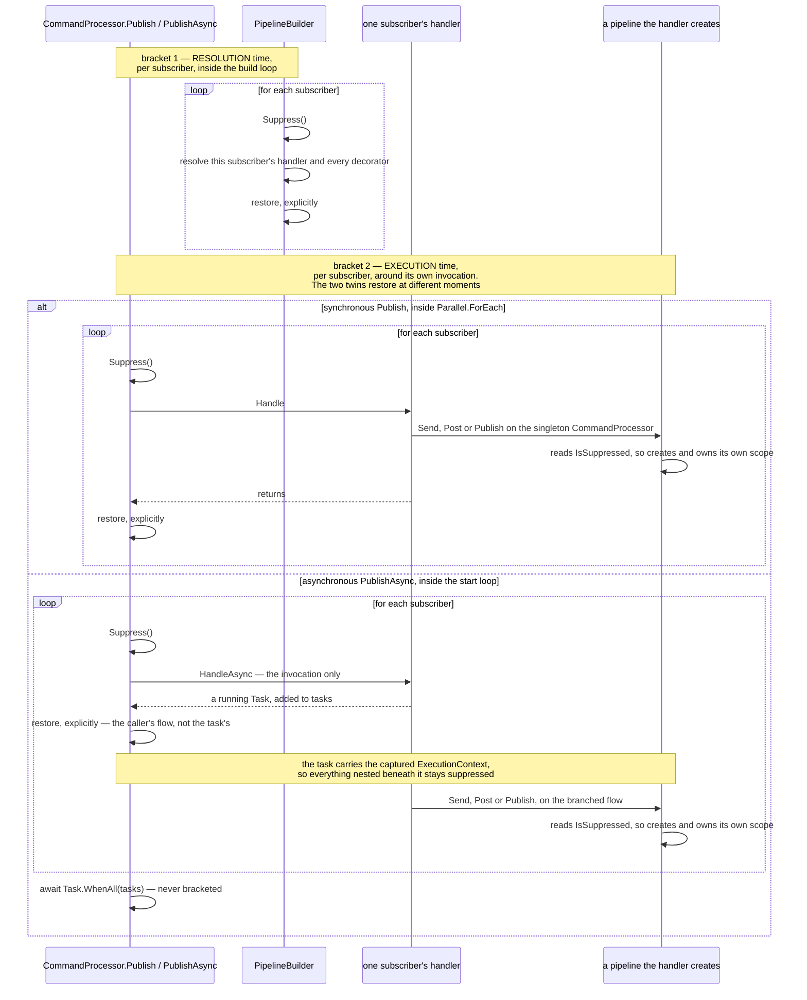
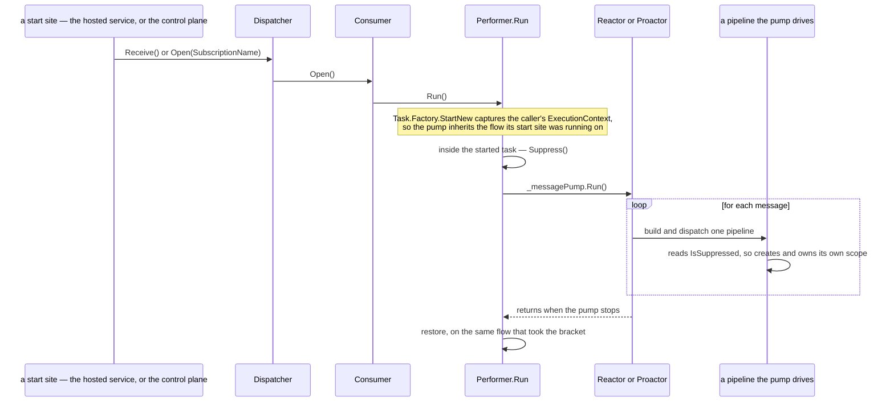
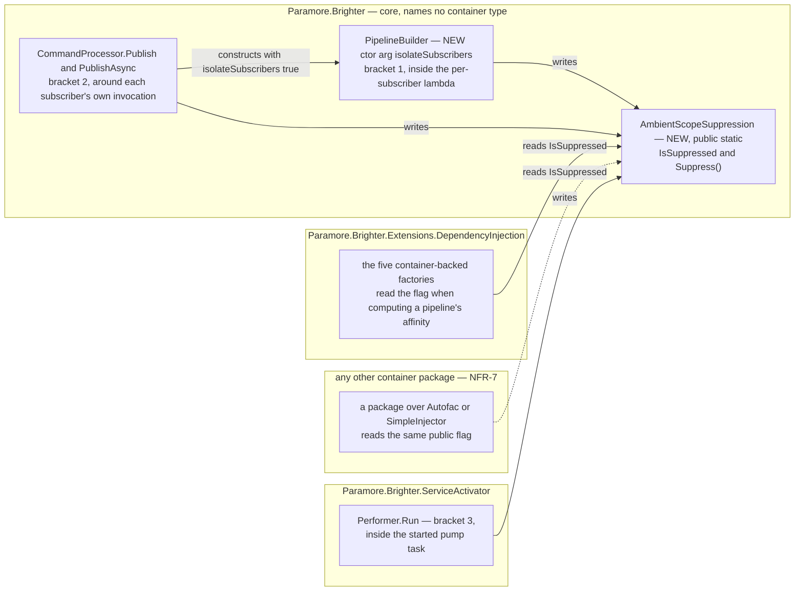

# 75. Suppressing ambient scope adoption for `Publish` subscribers and the consumer pump

Date: 2026-08-03

## Status

Accepted

## Context

ADR 0039 (`0039-scoping-dependencies-inline-with-lifetime-scope` — four ADRs carry that number, C-16) gives every `Publish` subscriber its own DI scope. One subscriber's dependencies are never another's. ADR 0072 then lets a pipeline adopt a DI scope the host already owns. Left unqualified, that would put every subscriber of a publish back into the caller's single scope and undo the isolation entirely.

FR-8 requires subscribers to stay isolated whatever the affinity says. Neither sibling decides *how* a subscriber turns adoption off. The hard part is not the subscriber's own pipeline. It is the pipelines the subscriber's handler creates at dispatch time, which Brighter never sees.

### Terms

This ADR is written throughout in terms of where **brackets** go, so the word is fixed here. A bracket is a `using` block that turns suppression on for exactly the region it encloses and puts it back to whatever it was on the way out:

```csharp
using (AmbientScopeSuppression.Suppress()) { … }
```

`Suppress()` captures the flag's current value on the current logical flow, sets it to `true`, and returns an `IDisposable` whose disposal restores the value it captured. *Taking* a bracket is calling `Suppress()`; *the* bracket is that disposable, and by extension the region it covers. A bracket is therefore **two** `AsyncLocal` writes — the set and the restore — rather than one. *Consequences* records what that costs.

Three properties of a bracket matter throughout. Each is specified further down rather than here.

- **Its reach is one logical flow.** The flag is `AsyncLocal`-backed, so anything started inside a bracket inherits the suppressed state. That is how a pipeline the subscriber's handler creates through the singleton `CommandProcessor` is reached at all, since no argument path runs to it.
- **Brackets nest, provided they are disposed innermost-first.** Disposal restores the value that bracket *captured* rather than writing `false`, so an inner bracket leaves an outer one intact. The proviso is the whole subject of *Two misuse modes* under *Key Components*.
- **Its extent is the unit the requirement is written over.** A bracket around the whole build loop suppresses the same set of resolutions and is still wrong, because its extent is no longer one subscriber's. That is why FR-9(a) rejects it, and why *Technology Choices* and Alternative 5 return to it.

Three brackets are named below and the numbering recurs throughout: bracket 1 at resolution time (step 3), bracket 2 at execution time (step 4), and bracket 3 on the consumer pump's own flow (step 4a). That third one is taken once per pump thread for the life of the process, not once per message.

Five more words carry the argument and are not re-explained where they are used. ADR 0072 owns the machinery behind the first four; these entries are only what a reader needs to follow this ADR.

- **Flow**, or *logical flow*. What an `AsyncLocal` value propagates along: one execution context together with everything started from it, including tasks and their continuations. It is not a thread. A flow can move between threads, and one thread can carry different flows in turn.
- **Ambient scope**, and **adoption**. An ambient scope is one a pipeline finds on its flow instead of being handed, an ASP.NET Core request scope being the worked case. *Adoption* is a pipeline using that scope instead of creating one of its own. Suppression stops adoption; it is not a kind of it.
- **Affinity**, and **`AlwaysNew`**. Affinity is the `ScopeAffinity` value a pipeline asks with. `AlwaysNew` means *do not adopt an ambient; create and own a scope*, and `JoinAmbient` is its opposite. ADR 0072 defines both values and the policy that computes them.
- **The ladder**, and **the ask**. ADR 0072's adoption protocol is a numbered ladder of outcomes, and this ADR names its rows by number. The *ask* is the single call a pipeline makes to the ambient source at the point that protocol reaches it.
- **The twins.** Brighter's synchronous and asynchronous pairs — `Publish` and `PublishAsync`, `Build` and `BuildAsync`. This ADR specifies them separately wherever their `ExecutionContext` behaviour differs, which is most places.

### Scope

**Parent requirement**: [specs/0036-scoped-lifetime-per-pipeline/requirements.md](../../specs/0036-scoped-lifetime-per-pipeline/requirements.md)

This ADR decides one thing: **where suppression hangs, and where its brackets go.**

**In scope.** Each requirement below is discharged here by the named mechanism.

- **FR-8 — a `Publish` subscriber never adopts the caller's ambient scope.** The two subscriber brackets establish suppression around each subscriber's resolution and around its execution. The guards are **AC-11**, **AC-12**, **AC-39** and **AC-47**.
- **FR-9 — a subscriber needs two brackets, and neither substitutes for the other.** Bracket 1 sits inside `PipelineBuilder`'s per-subscriber build lambda. Bracket 2 sits around that subscriber's own `Handle`/`HandleAsync`. The guards are **AC-11** for the resolution-time bracket and **AC-12**, **AC-39** and **AC-47** for the execution-time one.
- **FR-27.3 — suppression is a subscriber property, not a consequence of affinity.** The two subscriber brackets sit on the subscriber path and nowhere else, so a `Send` never suppresses and a subscriber suppresses even when its own pipeline takes no scope. The guard is **AC-47**.
- **NFR-4's suppression half — concurrent subscribers do not interfere, and nothing is left on the caller's flow.** `AsyncLocal` confines the bit to one logical flow, and every bracket restores explicitly rather than relying on `ExecutionContext` to unwind it. The guards are **AC-12** and **AC-39**. NFR-4's other half is about beginning and releasing pipeline scopes, and is ADRs 0070's, 0071's and 0072's.
- **NFR-3 for the change this ADR makes to `Paramore.Brighter.ServiceActivator`.** The pump-flow bracket of step 4a calls a `Paramore.Brighter` type across the single project reference that assembly already holds, so it gains no package reference and no container dependency. ADRs 0070 and 0071 each state the same of their own change to that assembly; the guard is **AC-22.2**.

**Contributed to here, discharged elsewhere.** Each of these has exactly one owner, and the owner is not this ADR.

- **FR-25.5 and NFR-9's `Publish`-subscriber and nested-pipeline rows.** *Implementation Approach* step 7 writes their substance. **ADR 0074** declares the guidance page, writes the truth table and maps every FR-25 clause to its source, so FR-25 and NFR-9 each have one owner and it is ADR 0074.
- **FR-19's consumer-side inertness.** The pump-flow bracket of step 4a is the mechanism that makes it true. **ADR 0072 discharges FR-19** and names this bracket as what makes it hold. One flag serves the subscriber case and the pump case, because both ask the same question — *may a pipeline created on this flow adopt?* — once of a subscriber and once of a pump thread.
- **NFR-7 — a container package Brighter does not ship must be able to honour FR-8.** That is why the flag is public and names nothing container-specific, and it is the force behind the whole of *Technology Choices*. The non-preclusion clause is discharged by the seam's shape and belongs to ADR 0072, guarded by **AC-35**.

**Out of scope.**

- **How a pipeline discovers or adopts an ambient scope — ADR 0072's.** That ADR owns the ladder, the hand-off role and the affinity policy. Suppression meets the ladder at exactly one line, the affinity computation, and changes nothing else about it.
- **FR-27.1 and FR-27.2 — ADR 0072's.** That ADR discharges both and leaves FR-27.3 here.
- **The opt-in property — ADR 0076's.**
- **The package that registers an ambient source — ADR 0073's.**
- **Where any rule is validated — ADR 0074's.** A suppressed subscriber is correct configuration rather than a fault, so nothing here is reportable.

This ADR **supersedes no prior ADR.** It protects ADR 0039's decision rather than reopening it (D0c).

### Where this ADR sits

Seven ADRs deliver the parent requirement; the requirements constrain observable behaviour only and hand how it is implemented to design (C-13). This is the sixth, and the only one whose subject is a pipeline Brighter did not build.

| ADR | Decides |
| --- | --- |
| 0070 | a transform pipeline takes one DI scope, carried **as a parameter** |
| 0071 | handler pipelines converge onto the **same handle**, carried on the object they already pass |
| 0072 | how a pipeline discovers an **ambient** DI scope the host owns |
| 0073 | the **ASP.NET Core package**, and the one line an application writes to opt in |
| 0074 | **where** the scope-configuration rules are evaluated |
| **0075** *(this one)* | how a `Publish` subscriber and the consumer pump **suppress** adoption, for themselves and every pipeline created beneath them |
| 0076 | the **affinity option**, and how one setting reaches all four registration paths in any order |

The rule the first two state is **the per-pipeline object carries the DI scope**, and this ADR is the one place it does not reach: the pipeline that must be suppressed has no per-pipeline object yet, because it does not exist when the decision to suppress it is taken.

ADR 0067's `Terms` block defines the two axes used throughout, and its preamble names this set as ADRs 0070–0076: Brighter's *configured lifetime*, which governs the artefact, and the container's *registration lifetime*, which governs the dependencies — and keeps `IServiceScope`, `ServiceProviderLifetimeScope` and `IAmALifetime` distinct. This ADR does not restate it. Per NFR-8, "lifetime scope" is not used for anything introduced here.

### What a subscriber must stop, and what it cannot reach

Three kinds of pipeline come into being during one `Publish`. They differ in the two properties that decide the mechanism: whether Brighter holds a reference to the pipeline at the moment suppression must apply, and when that moment is.

| Pipeline created during one `Publish` | Built by | Brighter holds a reference? | When |
| --- | --- | --- | --- |
| a subscriber's own handler pipeline | `PipelineBuilder`, eagerly, per subscriber | **yes** — it is building it | before any handler runs |
| a nested `Send` or `Publish` the subscriber's handler issues | `PipelineBuilder`, through the singleton `CommandProcessor`, from user code | **no** | while that handler runs |
| a transform pipeline for a `Post` the subscriber's handler issues | `TransformPipelineBuilder`, from user code | **no** | while that handler runs |

Two consequences fall out of the table, and together they fix the whole design.

**The mechanism cannot be an argument.** Two of the three rows are pipelines core did not build. User code reaches them through the singleton `IAmACommandProcessor` (ADR 0033) and is under no obligation to forward anything. Threading a decision to them would mean a new parameter on every public dispatch method, permanently, to serve a case that arises only inside `Publish`. What the three rows do share is the logical flow they are created on, and that flow is the only thing available to name them all.

**One bracket cannot cover both moments.** Row 1 happens during the build, before any subscriber's handler runs. Rows 2 and 3 happen during dispatch. A bracket placed at dispatch is too late for row 1, because every subscriber's handler and decorator has already been resolved from the caller's unsuppressed ambient. A bracket placed at build time is over before rows 2 and 3 exist. Hence FR-9's two brackets, neither substituting for the other.

### The forces

- **FR-8 is unconditional.** Every subscriber of a publish is isolated, whatever its configured lifetimes and whatever affinity the host opted into. No configuration permits a subscriber to join the caller's scope, so suppression is never conditional on anything a subscriber knows about itself.
- **FR-27.3 forecloses the obvious home.** A subscriber whose pipeline has no `Scoped` participant takes no pipeline scope at all, so it never asks the ambient source. It must still suppress, because a pipeline nested inside it may be `Scoped` (AC-47). Suppression therefore cannot be an argument to, or a return value of, the ambient query.
- **The pipeline that must be suppressed is one core did not build and holds no reference to.** A nested `Send`, `Post` or `Publish` issued from inside a subscriber's `Handle`/`HandleAsync` goes through the singleton `IAmACommandProcessor` (ADR 0033) from user code. No argument path runs from the subscriber's bracket to that pipeline's scope acquisition.
- **`Publish` runs its subscribers concurrently, and the two paths differ.** `PublishAsync` starts every subscriber on the caller's flow and awaits them together. The synchronous `Publish` dispatches through `Parallel.ForEach` (`CommandProcessor.cs:481`), which captures and restores `ExecutionContext` per **worker task** rather than per body invocation, so one worker running a range of subscribers carries an `AsyncLocal` write from one body into the next. The mechanism has to be correct under both.
- **Both builds are eager and per subscriber, on the caller's own thread.** `PipelineBuilder` resolves each subscriber's handler and every decorator inside a per-subscriber lambda (`PipelineBuilder.cs:187-198`). A bracket can therefore sit inside the loop, and FR-9(a) requires it to sit there — around each subscriber's own iteration rather than around the loop as a whole.
- **A container package Brighter does not ship must be able to honour FR-8** (NFR-7). Per-subscriber isolation cannot be a privilege of Microsoft's container, so whatever carries suppression has to be readable from an assembly Brighter has never heard of.
- **NFR-4 — nothing may be left on the caller's flow.** Once either publish returns, a `Send` or a `Post` the caller issues next must adopt exactly as it would have before the publish.
- **ADR 0039 is the decision being protected, not reopened** (D0c). Suppression exists so that adoption cannot quietly repeal a scoping decision taken three ADRs earlier.

## Decision

**A `Publish` subscriber and the consumer pump both suppress ambient scope adoption — for their own pipelines and for every pipeline created beneath them — through a public, `AsyncLocal`-backed `AmbientScopeSuppression` flag in core, bracketed three times: once around each subscriber's resolution inside the build loop, once around that subscriber's own `Handle`/`HandleAsync` invocation, and once around the pump's own flow, with the restore written explicitly on each.**

A consumer pipeline then creates and owns its scope because Brighter said so, rather than because a pump thread happened to be started outside a request.

The flag carries one bit along a logical flow, and one place reads it: the line where a pipeline computes the affinity it will ask the ambient source with. Everything else about adoption belongs to ADR 0072 and is untouched. The two subscriber brackets are lexical and per subscriber, and neither is ever placed around the whole loop. The third is lexical too, and its unit is one pump thread rather than one subscriber.

### The mechanism, end to end

The first diagram is the **publish** mechanism — brackets 1 and 2, which is what FR-8 and FR-9 are written over.



Three invariants are readable off that diagram. The second is drawn rather than implied: every bracket sits inside a `loop for each subscriber`, on both twins, and only `await Task.WhenAll(tasks)` falls outside one.

**Neither bracket substitutes for the other.** Bracket 1 alone leaves a nested pipeline free to adopt. Bracket 2 alone is too late, because every subscriber's handler has already been resolved from the caller's unsuppressed ambient before any of them runs. AC-11 and AC-12 fail on an execution-time bracket alone.

**Neither bracket is ever placed around the whole loop.** A loop-level bracket would not share a scope — `GetSyncInstanceScope()` runs once per iteration, and suppression is one bit that has no bearing on how many scopes are created. A loop-level bracket is rejected for two other reasons. A bracket whose extent is the whole loop no longer has the extent of the unit FR-9(a) is written over. And it is the placement that invites a later reader to give the loop one scope, which would undo ADR 0039. *Technology Choices* and Alternative 5 return to it.

**The restores are explicit** on both brackets and on both publish paths, rather than inherited from `ExecutionContext`. Step 5 says why that is a statement about the code rather than a hope about `Parallel.ForEach`.

#### The pump-flow bracket

The third bracket runs on a separate flow with no subscriber in it. That flow shares none of the first diagram's participants, so it is drawn on its own. *Implementation Approach* step 4a specifies it.



The bracket is taken and disposed on the flow it suppresses, which is why the `Dispatcher`'s own flow is never written to.

#### Where suppression meets adoption

Where this meets adoption is one line. ADR 0072's protocol computes a pipeline's affinity before it asks anything, and that computation is the single point at which suppression bites:

> `affinity = AmbientScopeSuppression.IsSuppressed ? AlwaysNew : the policy over the whole participating set`

The five container-backed factories that read the flag are the mapper, transformer and handler factories in `Paramore.Brighter.Extensions.DependencyInjection`, which ADR 0072 names individually.

A suppressed pipeline reaches the same *outcome* a host with no provider registered reaches: it creates and owns its own DI scope, exactly as today. It reaches that outcome by a different path. The ask is still made, carrying `AlwaysNew`, because D16 makes the ask unconditional so that the decision is observable (AC-13). Suppression adds no outcome to the ladder. It selects one that already exists.

### Where the pieces live



The flag is the only thing that crosses an assembly boundary, and it names no container type. That is why it can live in core at all, and why a package Brighter does not ship can honour FR-8 on the same terms as the one it does.

It crosses in both directions. The DI package and any third-party package **read** it. `Paramore.Brighter.ServiceActivator` **writes** it. That second direction is why `Suppress()` cannot be `internal`, and Alternative 3a states it as the design-forced half of its rejection.

### Key Components

#### The roles, and what each is responsible for

| Role | Type | Responsibilities | Responsibility classifier | Collaborators |
| --- | --- | --- | --- | --- |
| Suppression state | `AmbientScopeSuppression` (core) | Carries one bit along a logical flow — *no pipeline created on this flow may adopt an ambient scope*. Hands out the bracket that sets and restores that bit | knowing | `AsyncLocal<bool>`; the three brackets that write it; the five container-backed factories that read it |
| Resolution-time bracket | `PipelineBuilder<TRequest>` (core) | Establishes and restores suppression around each subscriber's own artefact resolution, inside the build loop | doing | `AmbientScopeSuppression`; `CommandProcessor`, which constructs it with `isolateSubscribers: true`; the handler factory it resolves through |
| Execution-time bracket | `CommandProcessor.Publish` / `PublishAsync` (core) | Establishes and restores suppression around each subscriber's own `Handle`/`HandleAsync`, so pipelines that subscriber creates at dispatch are covered | doing | `AmbientScopeSuppression`; `PipelineBuilder`; the subscriber's own handler |
| Pump-flow bracket | `Performer` (`Paramore.Brighter.ServiceActivator`) | Establishes suppression on the pump thread's own flow inside the task it starts, and restores it when the pump stops, so nothing the pump drives can adopt whatever flow the pump was started from | doing | `AmbientScopeSuppression`; `IAmAMessagePump`, whose `Run()` it is the only caller of in `src/` |
| Suppression reader | the five container-backed factories (DI package) | Read the flag at the one point a pipeline's affinity is computed, and take the created-and-owned path when it is set | deciding | `AmbientScopeSuppression`; ADR 0072's affinity policy and ambient query |

`AmbientScopeSuppression` is deliberately **not an injected** role. It is a static holder rather than an interface anyone is handed, and that is a decision, not an omission: Alternative 9 gives the reasons. *Technology Choices* prices the shape it takes instead, and *Consequences* records its cost.

#### `AmbientScopeSuppression` — where suppression hangs (new, core, public, static)

```csharp
namespace Paramore.Brighter
{
    /// <summary>
    /// Suppresses ambient scope adoption for the current logical flow and every flow started from
    /// it. A pipeline created while suppression is in force creates and owns its own DI scope,
    /// whatever the configured affinity. Established by Brighter around each Publish subscriber's
    /// resolution and around its execution; public so that a host, or a container package Brighter
    /// does not ship, can honour the same rule.
    /// </summary>
    public static class AmbientScopeSuppression
    {
        public static bool IsSuppressed { get; }
        public static IDisposable Suppress();
    }
}
```

**Contract.**

| Member | Input | Output | Error conditions |
| --- | --- | --- | --- |
| `IsSuppressed` | none | `true` when a suppression bracket is in force on this flow | Cannot throw. A reader outside any bracket sees `false` |
| `Suppress()` | none | a bracket that restores the value it captured when disposed, so lexically nested brackets nest correctly | Cannot throw. Disposing a bracket twice is a no-op. Failing to dispose leaves the flow suppressed for the rest of its life. Disposing brackets **out of order** is the second misuse mode described below |
| the bracket's `Dispose()`, **on the flow that took it** | none | the value captured when the bracket was taken is restored on **this** flow | The bracket must be disposed on the logical flow that created it. Disposing it on another flow is the first misuse mode described below |

Backed by `AsyncLocal<bool>`. Core writes it and the container package reads it. The flag is **public for both read and write**, deliberately, and *Consequences* records the cost.

**Two misuse modes, both reachable only from a caller of the public mutator.** Brighter's own three brackets are lexical and always disposed innermost-first, so no Brighter code path reaches either.

- **Disposing a bracket on a flow other than the one that took it.** This is the likeliest misuse of a public mutator, and it is exactly the shape of the background-job case *Technology Choices* offers. The disposal writes the captured value into the *disposing* flow and leaves the originating flow suppressed for its remaining lifetime. **The implementation does not detect it.** An `AsyncLocal<bool>` cannot tell the two flows apart, and a detector would cost every bracket a flow identity to serve a caller error Brighter's own lexical brackets cannot make.
- **Disposing brackets out of order.** The outer bracket's captured value is restored while an inner bracket is still live, which clears suppression early. When the inner bracket is then disposed, it restores the value *it* captured, so the flow is left suppressed for the rest of its life with every bracket disposed.

**The two failure directions are not symmetric, and that asymmetry is why the shape is acceptable.** A bracket that is leaked or never disposed leaves suppression *on*, which produces today's create-and-own behaviour rather than unintended sharing of a caller's scope. Only out-of-order disposal by a caller of the public API can clear suppression early, and even that ends with suppression *on* once the inner bracket restores its own captured value.

#### Where each type is touched

| Assembly | Type | Change |
| --- | --- | --- |
| `Paramore.Brighter` | `AmbientScopeSuppression` | **new** |
| `Paramore.Brighter` | `PipelineBuilder<TRequest>` | a defaulted constructor argument `bool isolateSubscribers = false` on the two dispatch constructors (`:59`, `:76`), and the resolution-time bracket inside both build-loop bodies (`:187-198` sync, `:232-244` async) |
| `Paramore.Brighter` | `CommandProcessor` | `Publish` (`:472`) and `PublishAsync` (`:575`) construct the builder with `isolateSubscribers: true`; the execution-time bracket around `handleRequests.Handle(@event)` (`:489`) inside the `Parallel.ForEach` body (`:481-497`) and around the `HandleAsync` **invocation** inside the start loop (`:596`) |
| `Paramore.Brighter.ServiceActivator` | `Performer` | the pump-flow bracket inside the task `Run()` starts (`Performer.cs:62-69`), around the `_messagePump.Run()` call it already makes. No signature changes |
| `…DependencyInjection` | the five container-backed factories | one read of `IsSuppressed`, specified **here** and landing in **this ADR's commit**, at the line ADR 0072's protocol calls step 3 — the affinity computation. The type and the code that reads it arrive together, so ADR 0072's commit never references a type that does not yet exist; that ADR's touched row and its step 3 say the same from the other end |

**Unchanged, and named so the omission is not read as an oversight.**

- the describe-only `PipelineBuilder` constructor (`:92`), which serves validation and diagnostics and builds nothing that could adopt
- `PipelineBuilder.Dispose()` (`:269-270`), so D10's release timing is preserved by construction
- `Send` (`:317`) and `SendAsync` (`:394`), which construct the builder with the default and therefore never suppress (FR-27.3, AC-47's first branch)
- the two validation-time construction sites (`BrighterPipelineValidationExtensions.cs:75`, `:116`), likewise
- `IAmAPipelineBuilder<TRequest>` and `IAmAnAsyncPipelineBuilder<TRequest>`, whose signatures do not change
- every interface ADRs 0070 and 0071 changed, and `RequestContext`
- **the pump itself**, which still publishes nothing ambient (D0b, OOS-1). Step 4a says why the bracket goes in `Performer` and not in the pump

### Technology Choices

#### Why suppression is ambient state, when ADR 0070 removed all of it

ADR 0070 rejected an `AsyncLocal` carrying a *scope*, and rightly. A scope is a resource with an owner and an end, invisible coupling around it leaves FR-5's failed-build release nowhere to live, and it is not implementable over a non-Microsoft container. Suppression is a different kind of thing. It carries one bit, owns no resource, needs no end beyond its own lexical bracket, and can be honoured by any container package because it names nothing container-specific. Suppression also has no alternative: two of the three pipelines it must reach are ones core did not build and holds no reference to. It is the only ambient mechanism in the design, and it is the only part of the design with no parameter path available to it.

**And the requirements drew that line before this ADR did.** OOS-2 puts a general `AsyncLocal`-based `IAmAScopeProvider` for non-ASP.NET hosts out of scope — an ambient *source*, by which an arbitrary caller publishes a scope for Brighter to adopt. D6 then partially amends OOS-2: an `AsyncLocal` **suppression** flag, scoped to a `Publish` subscriber's execution and carrying no service provider, *is* in scope, because FR-8 requires it. Suppression is not adoption and does not deliver OOS-2's capability. So the reconciliation with ADR 0070's *Technology Choices*, under *No ambient state anywhere*, is the requirements' own rather than this ADR's invention. What ADR 0070 rejected is what OOS-2 still excludes, and the one bit this ADR adds is exactly what OOS-2's amendment admits.

#### Why the holder is public for read *and* write

Three grounds hold it open, and the first two are forced rather than chosen.

- **NFR-7 forces the public read.** A container package Brighter does not ship must be able to honour FR-8, and an `internal` flag would make per-subscriber isolation a privilege of Microsoft's container. `internal` plus `InternalsVisibleTo` is not available, because this repository uses that attribute nowhere.
- **This design's own shape forces the public write.** The pump-flow bracket of step 4a is taken in `Paramore.Brighter.ServiceActivator`, a different assembly from the one the flag lives in. An `internal` `Suppress()` would leave FR-19's invariant unimplementable by Brighter itself. Alternative 3a states that as the design-forced ground it is.
- **A host use case comes with it.** A host, or a third-party integration, can suppress adoption around its own work without waiting for a Brighter release. The worked case is a background job started from a request whose `HttpContext` still flows: take and dispose the bracket on the **starting** flow, around the call that starts the job — `using (AmbientScopeSuppression.Suppress()) { StartBackgroundJob(); }` — so the job's captured `ExecutionContext` carries suppression and the starting flow restores. That is bracket 2's async shape, and it is the recipe rather than the misuse.

The honest cost is in *Consequences*: FR-8 becomes an invariant core **asserts** rather than one no caller can defeat.

#### Why a constructor argument on `PipelineBuilder` rather than a parameter on `Build`

Whether subscribers are isolated is a property of the *call site* rather than of a build. A builder constructed by `Publish` always isolates, and one constructed by `Send` never does. The builder is already constructed per call site, so those sites are the natural place to say which kind of build this is. A parameter on `Build`/`BuildAsync` would instead put a flag on `IAmAPipelineBuilder<TRequest>` and `IAmAnAsyncPipelineBuilder<TRequest>`, which are both `internal` and both otherwise untouched by this work.

**And the class chosen instead is itself public, so this is a break.** `PipelineBuilder<TRequest>` is public and so are all three of its constructors, which step 2 cites individually. Adding a defaulted parameter to two of them is source-compatible but **binary-breaking**, because a default argument is compiled into the call site and an already-built assembly binds to a constructor that no longer exists.

The break is taken rather than avoided. An added *overload* carrying the flag would avoid it, and Alternative 6 gives the reasons for declining that.

What is taken is real and small. It is the same **shape** as the six transform-pipeline constructors ADR 0070 step 5 changes — binary-breaking, source-compatible — rather than the source-and-binary break carried by the nine interface signatures the set changes. It goes in the same `release_notes.md` entry (ADR 0070 step 7a), which names all nine. **No clause of AC-24 names this constructor note in terms**; its general clause — one item per breaking change this work introduces — is what asks for it, so an omission fails the criterion rather than going undetected.

#### Why the bracket goes inside the per-subscriber lambda and not around the loop

Around the loop, every subscriber would resolve under one suppression bracket, which is correct. The same placement is the one that tempts a reader into giving the whole loop one pipeline scope, and ADR 0039 requires one scope per subscriber. Inside the lambda the bracket has exactly the extent of one subscriber's resolution, which is the unit FR-8 is written over, and it reads the same way as the execution-time bracket.

### Implementation Approach

#### 1. The core type

Add `AmbientScopeSuppression` to `src/Paramore.Brighter/`, backed by a private `static readonly AsyncLocal<bool>`. `Suppress()` captures the current value, sets `true`, and returns a bracket whose `Dispose` restores the captured value and is idempotent. It names no container type, so the source-level guard AC-22.3 runs returns nothing new.

`Suppress()` is `public`, and its XML documentation carries the intent that its accessibility cannot. A `<remarks>` block states that it is **not intended for direct application use**, and that Brighter's own three brackets — the two publish brackets and the pump-flow bracket of step 4a — are the only callers within Brighter. It says why the member is public: `Paramore.Brighter.ServiceActivator`, a container package honouring FR-8 (NFR-7), and Brighter's own tests all live in separate assemblies and cannot use `InternalsVisibleTo`, a mechanism this repository does not use. `ServiceCollectionExtensions.BrighterHandlerBuilder` already establishes that convention for a public member an application is not meant to call. The `<remarks>` must also state the two misuse modes from the contract table, because a caller who reaches this member is exactly the caller who can trip them.

#### 2. `PipelineBuilder` learns which kind of build it is

The class is `public` (`PipelineBuilder.cs:37`) and so are all three of its constructors. The two internal builder interfaces a `Build` parameter would have touched instead are `IAmAPipelineBuilder.cs:36` and `IAmAnAsyncPipelineBuilder.cs:37`.

Add a defaulted `bool isolateSubscribers = false` to the two dispatch constructors (`:59` sync, `:76` async). The describe-only constructor (`:92`) does not take it, because it resolves nothing and can adopt nothing. `CommandProcessor.Publish` (`:472`) and `PublishAsync` (`:575`) pass `true`. `Send` (`:317`) and `SendAsync` (`:394`) keep the default, so a `Send` never suppresses. The two validation-time construction sites (`BrighterPipelineValidationExtensions.cs:75`, `:116`) are unaffected either way, because both use the describe-only constructor, which has no such parameter to keep or pass.

#### 3. Bracket 1 — resolution time, per subscriber, inside the build loop

In both twins the per-subscriber lambda is `observerTypes.Each(observer => { … })` — `Build` at `:187-198`, `BuildAsync` at `:232-244`. When `isolateSubscribers` is set, the bracket wraps the body of that lambda: the `GetSyncInstanceScope()` / `GetAsyncInstanceScope()` call, the handler `Create`, and `BuildPipeline` / `BuildAsyncPipeline` with the decorator resolution inside it. That body is where the subscriber's artefacts and their container-`Scoped` dependencies are actually resolved.

#### 4. Bracket 2 — execution time, around that subscriber's own invocation

The twins differ and must be written differently.

- **Sync `Publish`** — inside the `Parallel.ForEach` body (`:481-497`), around `handleRequests.Handle(@event)` (`:489`), restored on every exit path of the body.
- **Async `PublishAsync`** — around the **invocation** of `handleRequests.HandleAsync(@event, cancellationToken)` inside the start loop (`:596`), never around `Task.WhenAll` (`:601`).

FR-9(b) permits a second shape on the async path — a bracket around the subscriber's own *task* rather than its invocation — and **it is not taken**. Alternative 7 gives the reason.

The invocation-only bracket reaches the same observable because the bracket is live when the async method is called. The `ExecutionContext` the state machine captures therefore carries suppression into every continuation. Disposing the bracket immediately afterwards restores the **caller's** flow without touching the running task's, because an `AsyncLocal` write in one flow does not propagate back to a flow that has already branched.

Bracketing `Task.WhenAll` instead would suppress **nothing in any subscriber at any point in its life**, not merely its synchronous prefix. By then every subscriber's task has branched, and a write made after a flow has branched does not reach it. It would also leave the caller's own flow suppressed for the duration of the await, though not past the publish (step 5a). Alternative 5 states the same from the other end.

This bracket is what AC-47's second branch needs. A subscriber whose own pipeline has no `Scoped` participant takes no pipeline scope and asks nothing, yet a `Post` its handler issues at dispatch time must not adopt.

#### 4a. Bracket 3 — the consumer pump's own flow, so FR-19 is an invariant rather than an assumption

Take the bracket **inside the task `Performer.Run()` starts** (`Performer.cs:62-69`), around the `_messagePump.Run()` call it already makes:

```csharp
return Task.Factory.StartNew(
    () =>
    {
        using var suppression = AmbientScopeSuppression.Suppress();
        _messagePump.Run();
    },
    CancellationToken.None,
    TaskCreationOptions.LongRunning,
    TaskScheduler.Default);
```

**Why the bracket exists at all.** C-14 *assumed* a pump thread carried no usable ambient `HttpContext`, and FR-19's inertness rested on that assumption — which is why C-14 now states the invariant this bracket delivers instead. The assumption was about the flow a pump is **started on** rather than about the pump. `Consumer.Open()` starts every pump through `Performer.Run()` (`Consumer.cs:112`), whose `Task.Factory.StartNew` captures `ExecutionContext` (`Performer.cs:62-69`), so a pump inherits the flow its start site was running on.

Consumers are started from more than one site: the hosted service at startup (`ServiceActivatorHostedService.cs:74`), and the control plane's own API for a process that already hosts a `Dispatcher` (`ConfigurationCommandHandler.cs:73`, `:85`), which runs inside a handler pipeline. **No start site may pass a request scope to a consumer.** Starting a `Dispatcher` from inside a live request is **erroneous use of the library** rather than a configuration this design supports, and the bracket is not a licence for it. The bracket is what stops FR-19 depending on the flow those start sites were called on.

Were a pump started on such a flow, `IHttpContextAccessor` being `AsyncLocal`-backed, every consumer pipeline it drives would resolve from one request's scope for the life of the process. That is an FR-19 violation in resolution and identity, not in logging, and FR-23 does not govern it, because the ambient is live rather than stale.

**Two things the bracket buys with no misuse involved.**

- **A mixed host gives the consumer side an affinity nobody chose for consumers**, because both roles read one `IBrighterOptions`, which *Why configuration cannot do this and a flow property can* below sets out. Unbracketed, that consumer ask carries `JoinAmbient`, reaches ladder row 7 and emits FR-24.2's latched `Warning`. Bracketed, it carries `AlwaysNew`, reaches row 6 and emits nothing, which is what AC-20 asserts.
- **NFR-7 obliges this design not to preclude container packages Brighter has never heard of**, and such a package's ambient source need not key on `HttpContext` at all. So *a pump thread carries no usable ambient* is not a property any provider owes. ADR 0073 owns C-14 and now records that this bracket is what closes it.

**Why configuration cannot do this and a flow property can.** The apparent fix is to have `ScopeAffinityPolicy` compute `AlwaysNew` on the consumer side, and it has nothing to compute that from. Brighter's factories read **one `IBrighterOptions` for the whole host**, and nothing on it says which side is asking; in a mixed host that object is whichever side won the `TryAddSingleton` (C-12), so the consumer side reads an affinity chosen for the producer. Suppression is not subject to that limit, because suppression is a property of the **flow the pipeline was created on**, and the pump thread's flow is exactly the thing that distinguishes the two sides.

**Why `Performer` and not the pump.** C-2 and OOS-5 name `Reactor`, `Proactor`, `Dispatcher`, `DispatchBuilder` and `ConsumerFactory` and forbid changing them, and `Run()` is implemented on `Reactor.cs:95` and `Proactor.cs:95`. The pump's own entry point is therefore closed to this work.

`Performer` is not one of those five named types. Its stated responsibility is *"abstracts the thread that runs a message pump"* (`Performer.cs:31-32`), which is the flow boundary rather than the pump, and it is the only caller of `IAmAMessagePump.Run()` in `src/`. The pump itself is untouched and still publishes no per-message ambient (D0b, OOS-1). What changes is the flow the pump is started on. `PipelineBuilder` already gets this same reading against C-2, which likewise covers five named types rather than every type on the path.

**Why inside the started task rather than around `StartNew`.** Both placements reach the pump, because a bracket taken around `StartNew` would be captured into the started task's `ExecutionContext`, which is bracket 2's async shape. Inside the task is preferred because the bracket is then **taken and disposed on the flow it suppresses**. It ends when the pump stops, no flow is left suppressed with no bracket to dispose on it, and the `Dispatcher`'s own flow is never written to. It also does not depend on context flow through `Task.Factory.StartNew`, so it is correct however the pump is started.

**What this makes true.** A consumer pipeline's affinity is `AlwaysNew` unconditionally. Its ask therefore carries `AlwaysNew`, ADR 0073's provider returns nothing on an `AlwaysNew` ask (D16), and ladder row 6 gives it a scope it creates and owns, **with no diagnostic**. FR-19's inertness stops depending on the flow the pump was started on, and AC-55 is the criterion over it.

A conforming provider therefore emits nothing at all on the consumer side, and the FR-23 route is never reached, because nothing stale is ever offered. A **non**-conforming provider that returns an ambient for an `AlwaysNew` ask still trips FR-24.4's once-per-container `Warning`, exactly as it does for a suppressed subscriber (step 6). That is the one entry FR-19 admits.

#### 5. Why an omitted restore on the synchronous path would not be observable

`Parallel.ForEach` partitions the source and gives each worker task a range. `ExecutionContext` is captured and restored per **worker task** rather than per body invocation, so an `AsyncLocal` write in subscriber 1's body is still current when the same worker calls the body for subscriber 2.

That leak is real, and the design does not assume it away — it writes the restore. Three reasons, which have to hold together, are why an implementation that omitted it would still pass every test:

- **Every subscriber must be suppressed anyway.** FR-8 makes suppression unconditional for every subscriber of a publish, whatever its lifetimes. A leaked `true` sets exactly the value subscriber 2's own bracket sets one instruction later. No state a subscriber body needs has `IsSuppressed` as `false`, so no observation can distinguish a leaking implementation from a correct one. That is why no Acceptance Criterion asserts against it, and why AC-39 says so explicitly.
- **The only alternative reading is foreclosed.** OOS-14 denies that a nested pipeline ever re-enters its parent subscriber's scope. So "subscriber 2 should have seen its own suppression rather than subscriber 1's" is not a distinction with an observable behind it, because both readings mean *create your own scope*.
- **The leak cannot escape the publish.** A worker task ends when the `Parallel.ForEach` ends, and the thread pool restores a fresh `ExecutionContext` per work item, so nothing survives onto **unrelated** work. That is probe-confirmed.

**Work a subscriber's handler deliberately branches is the exception, and it is by design.** A `Task` started under a live bracket captures the suppressed context and stays suppressed for its whole life, because the bracket is disposed on the publish's flow rather than on the branch. That is D6's direction — the branch is nested beneath a subscriber and must not adopt — and it fails toward isolation, which is why it is accepted rather than corrected.

**The shape that exposes the caller's flow is bracket 1's, not bracket 2's.** An unrestored write inside a `Parallel.ForEach` **body** does not reach the caller, because the runtime captures and restores `ExecutionContext` per *replica*, including the replica it inlines on the calling thread. So the cross-body leak described above is real while the caller-flow leak is not. On the synchronous twin, bracket 1 is where the caller's flow is genuinely exposed: its loop is `observerTypes.Each(observer => …)`, a plain synchronous `foreach` (`Extensions/Each.cs:39-45`) with no `ExecutionContext` boundary of any kind, running on the calling thread throughout, inside a `Publish` that is itself a plain `void` method. A bracket placed *around* the `Parallel.ForEach` rather than inside it would expose the caller's flow for the same reason, which is why Alternative 5 is rejected. **AC-39's leak clauses detect exactly this**: a `Send` and a `Post` issued by the controller after the synchronous publish returns must resolve from the request scope.

#### 5a. The exposure is not symmetric between the twins, and the asymmetry is the runtime's

An `async` method is itself an `ExecutionContext` boundary: `AsyncMethodBuilderCore.Start` saves the calling thread's context before the state machine's first `MoveNext` and restores it in a `finally`. `CommandProcessor.PublishAsync` (`:559`) is `async` and `Publish` (`:458`) is a plain `void`.

So **no `AsyncLocal` write made anywhere inside `PublishAsync` can reach its caller's flow, restored or not** — not bracket 1's inside the synchronous `BuildAsync`, and not bracket 2's in the start loop. On the synchronous `Publish` there is no such boundary, and an unrestored write does reach the caller. This is established by probe rather than by argument.

**The restores are written explicitly on both brackets and on both publish paths.** What they are load-bearing *for* differs, and this table is the difference:

| Path | Bracket 1 — resolution time | Bracket 2 — execution time |
| --- | --- | --- |
| synchronous `Publish` | **load-bearing.** Nothing else would restore it, and the caller observes what it leaves behind | **defence in depth.** The runtime restores `ExecutionContext` per replica, including the one inlined on the calling thread, so an unrestored write does not reach the caller. It does leak from one body to the next on a shared worker, which step 5's three bullets bound |
| asynchronous `PublishAsync` | **defence in depth.** The `async` boundary already protects the caller | **defence in depth.** The `async` boundary already protects the caller |

Both async restores are written anyway, for two reasons. Relying on a lowering detail of the C# compiler for a correctness property is a worse bargain than two `finally` blocks. And a future refactor that made `PublishAsync` synchronous up to its first `await` in some other way would silently remove the protection.

A reader who believes the async restores are what save the caller — or that the `Parallel.ForEach` restore is — has the mechanism backwards, and will place the next bracket by the wrong rule.

#### 6. Where this meets adoption

ADR 0072's `CreatePipelineScope()` protocol reads `IsSuppressed` once, at the line that computes the pipeline's affinity, and substitutes `AlwaysNew` when the flag is set. Nothing else in that protocol changes, and **no outcome is added to its ladder** — suppression selects one that already exists.

**Two things that are easy to over-state, and that an implementor must not.**

- **The ask is still made.** D16 makes the ask unconditional for any pipeline with a `Scoped` participant, so a suppressed subscriber still calls `GetAmbient(AlwaysNew)` and a recording provider still sees that decision. AC-13 counts five decisions across a `Send`, a three-subscriber `Publish` and a `Post`, three of them the subscribers'. That is the difference from a host with **no provider registered**, where ladder row 3 makes no call at all: the *outcome* matches and the *path* does not. An implementor who skips the ask fails AC-13 and AC-46.
- **Suppression does not silence diagnostics.** It adds none, and a suppressed pipeline reaches ladder rows 5 and 6 like any other `AlwaysNew` pipeline. A non-conforming provider that returns an ambient for an `AlwaysNew` ask therefore still trips FR-24.4's once-per-container `Warning`, which is exactly what AC-11 pins — its only `AlwaysNew` asks being the two suppressed subscribers'.

#### 7. The documentation this ADR owes

Two pieces of `docs/guides/lifetimes-and-scoping.md` come from here. ADR 0074 declares the page, holds the clause-to-source map, and names this ADR as the source of both pieces.

- **FR-25.5.** An in-process `Publish` subscriber, and every pipeline nested inside one, cannot join the caller's transaction. That is FR-8 working as specified rather than a defect, and the outbox is the answer (C-4, D6, AC-36).
- **NFR-9's truth table — the `Publish`-subscriber and nested-pipeline rows.** A subscriber's pipeline never resolves from the ambient, whatever the affinity. Under `Scoped` it resolves from a scope Brighter created for it; under `Transient` from ADR 0067's per-resolution scope; under `Singleton` from the root provider, which sits outside both affinities (ADR 0072). The same holds for anything the subscriber's handler creates while it runs.

Both are written from this ADR's *What a subscriber must stop, and what it cannot reach* table and its two subscriber brackets. Neither re-decides anything.

## Consequences

### Positive

- **ADR 0039's per-subscriber isolation survives adoption.** A feature that would otherwise have quietly repealed a scoping decision taken three ADRs earlier is bounded by one bit, and the boundary is written where the decision it protects lives.
- **The unreachable pipelines are reached.** A nested `Send`, `Post` or `Publish` issued from user code inside a subscriber's handler is suppressed without any signature change to `IAmACommandProcessor`, which is the only mechanism available for a pipeline core did not build (ADR 0033, C-5).
- **The failure direction is toward isolation.** A leaked or undisposed bracket produces today's create-and-own behaviour, never unintended sharing of a caller's scope.
- **A container package Brighter does not ship can honour FR-8** on exactly the same terms as the one it does, because the flag is public and names nothing container-specific (NFR-7).
- **FR-19's inertness stops being an assumption and becomes an invariant.** C-14 took a pump thread to carry no usable ambient, which is a property of the flow the pump was started on rather than of the pump. The pump-flow bracket makes the consumer side own its scope whatever that flow carries and whatever an ambient source offers.
- **Core stays container-agnostic** (ADR 0014). The one new core type names no container type, and the source-level guard AC-22.3 runs finds nothing new.
- **Release timing is unchanged.** `PipelineBuilder.Dispose()` (`:269-270`) still drains every subscriber's scope together at end of publish, and nothing here tightens it (D10, AC-10).

#### What suppression costs

An `AsyncLocal` set allocates even when it writes the value the flag already holds, so a bracket taken inside another bracket is not free either.

**On the producer side, suppression costs nothing when nothing is published.** A publish costs four `AsyncLocal` writes per subscriber: two brackets, each a set *and* an explicit restore, because this ADR writes both rather than inheriting either from `ExecutionContext` (step 5). No bracket is established on that side outside a publish. `IsSuppressed` is one `AsyncLocal` read per pipeline that takes a pipeline scope, and a read allocates nothing.

On the **consumer** side the *when nothing is published* qualifier buys little. Every `MT_EVENT` message dispatches through `Publish`/`PublishAsync` (`Reactor.cs:406`, `Proactor.cs:130`), so under sustained consumption those four writes per subscriber sit on the consumer hot path. Each write is an `AsyncLocal` set, which allocates an `ExecutionContext`, and that allocation grows with the number of `AsyncLocal` values already live on the flow. Measured on `net10.0`, a full `Suppress()`/`Dispose()` bracket costs **216 bytes** with none live and **248** with one — and a traced host always has at least one, because `Activity.Current` is `AsyncLocal`-backed and Brighter's tracer sets it per message. So a subscriber pays two brackets, four `ExecutionContext` allocations and 432 to 496 bytes per message, and more in a host carrying ambient values of its own. The cost is bounded by subscribers per message and does not grow with message count, but it is not free there.

The pump-flow bracket is priced differently: **one bracket per pump thread for the life of the process**, a set and a restore rather than a cost per message. The same flag serves it as serves the subscribers.

### Negative

- **The design is no longer free of per-flow state.** ADR 0070 introduces none of its own, and this ADR puts one bit back. It is one bit rather than a resource, its brackets are lexical, and its failure mode is benign. A reader now has `ExecutionContext` semantics to hold in mind on the `Publish` paths, and has to understand the synchronous path's `Parallel.ForEach` behaviour to see why the restore is explicit.
- **Two construction sites in `CommandProcessor` gain an argument**, and the meaning of a `PipelineBuilder` now depends on a boolean set at construction. A reader of `Build` has to look at the constructor to know whether subscribers are isolated.
- **`Paramore.Brighter.ServiceActivator` acquires a dependency on a core type it did not name before.** The pump flow is now something this design writes to. A reader of `Performer` — whose subject is threads rather than dependency injection — has to reach ADR 0072 to see why a `using` there decides what a handler's dependency resolves from. The bracket is one line and its `<remarks>` can point at this ADR, but the coupling is real and did not exist before.
- **In-process `Publish` subscribers still cannot join a caller's transaction**, and under D6 neither can pipelines nested inside them. OOS-10 puts both out of scope in exactly those two terms: a subscriber, or anything nested inside one, adopting an ambient scope (FR-8, D6), and an in-process subscriber joining the caller's transaction (C-4). Neither is a gap this ADR left, and both are FR-8 working as specified rather than a defect. It is also the limitation applications most often expect not to exist, so it has to be stated plainly in `docs/guides/lifetimes-and-scoping.md` (FR-25.5), and the outbox is the answer (C-4).

#### Core gains a public static with a public mutator

`AmbientScopeSuppression.Suppress()` is called from a second assembly by Brighter itself. `Performer` (`Paramore.Brighter.ServiceActivator`) takes the pump-flow bracket, so the public mutator is no longer public *only* for NFR-7 and for tests: an `internal` mutator would leave step 4a unimplementable. That removes the argument for narrowing the member later (Alternative 3a), and with it the option of ever taking the surface back.

It is also callable by anyone, so FR-8's per-subscriber isolation becomes an invariant core **asserts** rather than one no caller can defeat. A caller who takes a bracket and leaks it suppresses adoption for the rest of that logical flow, and nothing detects it. A caller who disposes brackets out of order can clear suppression while an inner bracket is still live. Neither misuse is reachable from Brighter's own code, because all three of its brackets are lexical and disposed innermost-first, and the leaked-bracket direction is benign. Both are nonetheless real properties of a public mutator rather than hypotheticals.

#### `PipelineBuilder<TRequest>` is public, and the two constructors that change are public

The two call sites that pass `isolateSubscribers: true` are in `CommandProcessor`. The two dispatch constructors are called at four sites in `CommandProcessor` — the touched table carries the lines — and at **48** sites in `tests/`, every one of which recompiles unchanged. Of **69** `PipelineBuilder` constructions in `tests/`, the other **21** use the describe-only constructor, which does not change.

The change is source-compatible and **binary-breaking** for any assembly compiled against the three-argument signature and not rebuilt, because a default argument is baked into the call site. That is a break on public surface, not an internal edit. It belongs in the same `release_notes.md` entry as the interface breaks (ADR 0070 step 7a), which catalogues it with a one-line pointer to this bullet. AC-24's general clause is what holds it there; no clause of AC-24 enumerates this break. The alternative — an added overload rather than a defaulted parameter — is Alternative 6, and it was declined.

#### Three brackets, five places to get wrong

None of the five is redundant, so none covers for a mistake in another. They sit in three files, two assemblies and five shapes:

| Bracket | Site | Shape |
| --- | --- | --- |
| 1 — resolution time | `PipelineBuilder.Build` (`:187-198`) | a lambda body |
| 1 — resolution time | `PipelineBuilder.BuildAsync` (`:232-244`) | a second lambda body |
| 2 — execution time | `CommandProcessor.Publish` (`:481-497`) | a `Parallel.ForEach` body |
| 2 — execution time | `CommandProcessor.PublishAsync` (`:596`) | an async start loop |
| 3 — pump flow | `Performer.Run` (`Performer.cs:62-69`) | a long-running task body |

### Risks and Mitigations

| Risk | Mitigation |
| --- | --- |
| Suppression leaks past `Publish` and a later `Send` or `Post` in the same request silently fails to adopt | Both publish brackets restore explicitly on every exit path — normal return, exception, cancellation — rather than relying on `ExecutionContext`. **AC-39's leak clauses are the ones that can actually fail**, because AC-39 is written over the synchronous `Publish`, which is a plain `void` method with no boundary of its own. AC-12's counterpart clause reads after an `async` publish has completed, by which point the runtime has already restored the caller's context, so AC-12 guards a regression the async runtime prevents rather than one this design could introduce (step 5a) |
| A subscriber's handler is resolved before suppression is established, so it adopts the caller's ambient | The resolution-time bracket is inside the per-subscriber lambda in both build loops, around the `Create` and the decorator resolution — not around the loop, and not at dispatch. AC-11 and AC-12 fail on an execution-time bracket alone, by construction |
| The two subscriber brackets drift apart as the publish paths change | Both are specified against the same unit, one subscriber, and each is pinned by its own criteria. Bracket 1 is pinned by **AC-11**, whose closing note says in terms that AC-11 fails unless FR-9's resolution-time bracket is implemented and that an execution-time bracket alone cannot make it pass. Bracket 2 is pinned by **AC-12**, **AC-39** and **AC-47's second branch**, where the subscriber takes no pipeline scope at all so suppression can only come from the execution-time bracket. A bracket removed from either path fails a test rather than degrading quietly |
| A third-party container package ignores the flag and adopts anyway | Nothing prevents it. The flag is a contract a package honours rather than a gate Brighter enforces — the same trade NFR-7 makes everywhere else in this design |
| An application takes a bracket of its own and never disposes it | Adoption stops for that flow and the application silently gets today's behaviour. Documented under FR-25, and the direction is toward isolation rather than sharing |
| A redundant bracket is added — a third one per subscriber, or one per resolution rather than per subscriber — and the added allocation goes unnoticed | Nothing measures it. AC-23 counts pipeline scopes begun and released and cannot observe an allocation, and no requirement bounds this cost: NFR-5 bounds memory attributable to Brighter scopes, NFR-6 bounds scope begin and release per pipeline, and a suppression bracket is neither. A bracket in the wrong *place* fails AC-11, AC-12, AC-39 or AC-47; a redundant one in the right place fails nothing, because every observation of `IsSuppressed` reads the same value either way. Guarded by review only |
| The pump-flow bracket is dropped, or moved out of `Performer` into the pump, and a consumer pipeline adopts whatever ambient the flow that started the `Dispatcher` carries — for the life of the process | The bracket is the only thing standing between the consumer side and an FR-19 violation in resolution and identity, and moving it into `Reactor` or `Proactor` is closed by C-2 in any case. **AC-55 asserts it**, over a `Dispatcher` started from inside a live request — the case the bracket guards, and not AC-20's host, whose pump threads carry no `HttpContext` |

## Alternatives Considered

**1. Do nothing — let subscribers adopt.** Suppression exists only because ADR 0072 exists; without adoption there is nothing to suppress. **Rejected by FR-8.** Every subscriber of a publish would resolve from the caller's request scope, so ADR 0039's per-subscriber isolation would be repealed by a feature that never mentions it. A subscriber would appear to join the caller's transaction while the outbox — the actual answer (C-4) — went unused. The failure would be silent and would only show under concurrency.

**2. Suppression as an argument to, or a return value of, the ambient query.** `GetAmbient(affinity, isSubscriber)`, or an ambient object that carries "and suppress beneath me". **Rejected by FR-27.3, precisely.** A `Publish` subscriber whose pipeline has no `Scoped` participating factory takes no pipeline scope under FR-27.1, so it never calls the ambient query at all. It must still suppress, because a pipeline nested inside it may be `Scoped`. AC-47's second branch is exactly that configuration, and no mechanism living on the ambient query can satisfy it. The same argument kills making suppression a third `ScopeAffinity` value: affinity is a property of a pipeline that is taking a scope, and suppression is a property of a subscriber whether or not it takes one.

**3. Suppression as `internal` plus `InternalsVisibleTo`.** Keeps the flag out of core's public surface and makes FR-8 undefeatable by user code. **Rejected on a rule rather than a preference: this repository does not use `InternalsVisibleTo`, anywhere, without exception.** Even if it did, the attribute would have to name every container package that must honour FR-8, which is a list Brighter does not control. NFR-7 requires the design not to *preclude* implementations over Autofac or SimpleInjector from an assembly Brighter has never heard of, and such a package cannot honour per-subscriber isolation if it cannot read the flag.

**3a. Public read, `internal` write.** The narrower option, and the one that makes FR-8 undefeatable while still satisfying the NFR-7 read. **It satisfies NFR-7 completely** — NFR-7 needs a public *read*, and this ADR everywhere else defines the NFR-7 case as reading the flag. **Rejected on three grounds, the first of them design-forced rather than a preference.**

- **It makes step 4a unimplementable.** `AmbientScopeSuppression` lives in `src/Paramore.Brighter/` (step 1) and the consumer pump is started from `src/Paramore.Brighter.ServiceActivator/Performer.cs`, **a different assembly**. This repository uses `InternalsVisibleTo` nowhere — the single grep hit is a *comment*, `SpannerBoxMigrationRunner.cs:131` — so an `internal` `Suppress()` is unreachable from Brighter's own pump, and the pump-flow bracket that makes FR-19 an invariant cannot be written at all. That is not a convention argument. It is this design requiring the write from a second assembly of Brighter's own.
- **It puts Brighter's own tests out of reach**, for the same mechanical reason: they too live in separate assemblies. The brackets are precisely the mechanism most in need of direct testing, since their misuse modes are invisible through the public dispatch API. Testability alone is not a reason to widen a surface where a seam already exists, but here it coincides with the other two grounds rather than competing with them.
- **The host write use case is real rather than hypothetical.** *Technology Choices* gives it with a worked recipe: a background job started from a request whose `HttpContext` still flows, bracketed on the starting flow around the call that starts the job. A host cannot write that against an `internal` mutator either.

**The public write is therefore a deliberate trade and is recorded as one.** FR-8 becomes an invariant core **asserts** rather than one no caller can defeat. What that buys is a member Brighter's own pump can call across an assembly boundary, that Brighter's own tests can reach, and that a container package Brighter does not ship can use. The intent is carried where a caller will see it. `Suppress()`'s XML documentation states in `<remarks>` that it is **not intended for direct application use**, and that it exists for Brighter's own tests and for container packages honouring FR-8. `ServiceCollectionExtensions.BrighterHandlerBuilder` already uses that convention for a public member an application is not meant to call. That is a weaker guarantee than a compiler-enforced one, and *Consequences* prices it.

**4. Reuse `RequestContext` to carry suppression.** `RequestContext.Bag` (`RequestContext.cs:61`) already carries application state across the pipeline, so a subscriber could set a key in its own copy. **Rejected — it cannot reach.** The pipelines suppression must reach are those a subscriber's handler creates by calling `Send`, `Post` or `Publish` on the singleton `CommandProcessor`, and those calls take an *optional* `RequestContext` that user code is under no obligation to pass. Where it is omitted, `InitRequestContext` makes a fresh one, so suppression would hold only for handlers that happened to forward the context. FR-8 would become a documentation request rather than an invariant. `PipelineBuilder` also copies the context per subscriber, so the resolution-time bracket would be reasoning about which copy it is writing to. `RequestContext` carries application state along a request; suppression is a property of the flow, and the flow is what `AsyncLocal` names.

**5. One bracket around the whole build loop, and one around the whole dispatch.** Two brackets instead of two per subscriber, and much less code. **Rejected on both halves.**

Around the build loop it is *behaviourally* adequate, because every subscriber resolves suppressed either way. It is **rejected outright by FR-9(a)**, which requires suppression to be established around each subscriber's own iteration of the build. That settles it. The reasons behind the requirement are these: the bracket's extent stops matching the unit FR-8 is written over, and it is the placement that invites giving the whole loop one pipeline scope, which is ADR 0039 undone.

Around the dispatch it is wrong outright on the async path, for one reason rather than two. A bracket around `Task.WhenAll` (`CommandProcessor.cs:601`) is established **after every subscriber's task has already branched from the caller's flow**, and a write made after a flow has branched does not reach it. That bracket therefore suppresses **no subscriber at any point in its life**, not merely during its synchronous prefix: every resolution a subscriber makes and every nested `Send`, `Post` or `Publish` it issues is unsuppressed, before its first `await` and after it alike. This is **probe-confirmed on `net10.0`** — three subscribers started unbracketed and then awaited under one bracket observe `IsSuppressed` as `false` in their synchronous prefix and after every subsequent `await`, while the caller's own flow inside the bracket observes `true`. AC-12's resolution-time and nested-`SendAsync` clauses both detect it.

What that bracket would *not* do is leave the caller's own flow suppressed after the publish, because `PublishAsync` is an `async` method and the runtime restores its caller's `ExecutionContext` regardless (step 5a). The rejection rests on the first harm alone — the whole of each subscriber's life, rather than its prefix — since the caller-flow harm does not arise on the async path and AC-12's clauses do not detect it. The extent matters: a reader who takes the harm to be the prefix concludes that suppression established after a task has branched reaches that task once its prefix is over, which is the mechanism backwards.

**6. An added overload on `PipelineBuilder` rather than a defaulted parameter.** Two constructors per dispatch shape, the new one carrying `isolateSubscribers`, so no existing call site rebinds and the binary break disappears. **Rejected for what it leaves behind.** Nothing in either signature would say which of the two a caller should pick, and the old one would remain the one a reader finds first. *Technology Choices* prices the break it avoids: source-compatible and binary-breaking, the same shape as the six transform-pipeline constructors ADR 0070 step 5 changes, and release-noted in the same entry.

**7. A bracket around each subscriber's own task on the async path, rather than around its invocation.** FR-9(b) permits it. **Rejected on cost for no observable gain.** An async wrapper per subscriber costs an extra state machine and an extra frame on every handler's stack, and it reaches the same observable: the invocation-only bracket is live when the state machine captures its context, so every continuation runs suppressed. Step 4 states the mechanism.

**8. Detect a bracket disposed on the wrong flow.** The contract table's first misuse mode is undetectable as specified, and a flow identity carried alongside the bit would detect it. **Rejected on cost against reach.** An `AsyncLocal<bool>` cannot tell two flows apart, so every bracket would have to carry a flow identity. That cost falls on every subscriber of every publish — the consumer hot path — to serve a caller error that Brighter's own lexical brackets cannot make. The misuse also fails toward isolation, which is the benign direction.

**9. An injected suppression role rather than a static holder.** An interface a container hands out, in keeping with the rest of this design. **Rejected because the writers are not resolved from a container.** The role would have to reach `CommandProcessor.Publish`, `CommandProcessor.PublishAsync` and `PipelineBuilder`, none of which is container-resolved, and `Performer`, which is not either. A third-party container package could not read it without Brighter handing the package an instance, which is the coupling NFR-7 exists to avoid. *Key Components* records the shape as a decision rather than an omission.

## References

**Related ADRs — the other six of this set:**

- ADR 0070 [0070-per-pipeline-di-scope-for-mapper-and-transform-factories](0070-per-pipeline-di-scope-for-mapper-and-transform-factories.md) — a transform pipeline takes one DI scope, carried as a parameter
- ADR 0071 [0071-pipeline-scope-handle-for-handler-pipelines](0071-pipeline-scope-handle-for-handler-pipelines.md) — handler pipelines converge onto the same handle, carried on the object they already pass
- ADR 0072 [0072-ambient-scope-adoption-seam](0072-ambient-scope-adoption-seam.md) — how a pipeline discovers an ambient DI scope the host owns
- ADR 0073 [0073-aspnet-core-request-scope-package](0073-aspnet-core-request-scope-package.md) — the ASP.NET Core package, and the one line an application writes to opt in
- ADR 0074 [0074-lifetime-validation-evaluation-site](0074-lifetime-validation-evaluation-site.md) — where the scope-configuration rules are evaluated
- ADR 0076 [0076-scope-affinity-option-and-write-through](0076-scope-affinity-option-and-write-through.md) — the affinity option, and how one setting reaches all four registration paths in any order

- Requirements: [specs/0036-scoped-lifetime-per-pipeline/requirements.md](../../specs/0036-scoped-lifetime-per-pipeline/requirements.md) — FR-5, FR-8, FR-9, **FR-19** (its mechanism, supplied here and discharged by ADR 0072), FR-24.2, FR-24.4, FR-25 (clause .5), FR-27.1, FR-27.2, FR-27.3; NFR-3, NFR-4, NFR-7, NFR-8, NFR-9 (its `Publish`-subscriber and nested-pipeline rows); C-2, C-4, C-5, C-12, C-13, **C-14**, C-16; D0b, D0c, D6, D10, D16; OOS-1, **OOS-2** (its D6 amendment, which is what licenses this ADR's mechanism), OOS-5, OOS-10, OOS-14; AC-10, AC-11, AC-12, AC-13, **AC-20**, AC-22.2 (NFR-3's mechanical guard) and AC-22.3, **AC-23** (named to record what it does *not* measure — *Risks and Mitigations*); AC-24, AC-35, AC-36, AC-39, AC-46, AC-47, **AC-55** (the criterion for the pump-flow bracket)
- Related ADRs (cited by slug — ADR numbers are not unique in this repo, C-16):
  - `0072-ambient-scope-adoption-seam` [Proposed] — how a pipeline discovers and adopts an ambient DI scope. Its affinity computation is the one line this ADR's flag is read at, and its ladder is unchanged by suppression
  - `0070-per-pipeline-di-scope-for-mapper-and-transform-factories` [Proposed] — the transform pipeline takes one DI scope, carried as a parameter; it removed all per-flow state from the design, and *Technology Choices* says why this ADR puts one bit back
  - `0071-pipeline-scope-handle-for-handler-pipelines` [Proposed] — handler pipelines converge onto the same handle, which is why a subscriber's pipeline has one place to be suppressed rather than two
  - `0039-scoping-dependencies-inline-with-lifetime-scope` [Proposed] — a DI scope per registered subscriber on `Publish`; the decision this ADR exists to protect, not reopened (D0c)
  - `0033-lifetime-of-command-processor-and-mediator` [Proposed] — the `CommandProcessor` is a singleton, which is why a nested pipeline cannot be reached by an argument; not reopened (C-5)
  - `0014-di-friendly-framework` [Accepted] — per-family factory interfaces rather than abstracting an IoC container; the durable reason the flag names no container type and is public
  - `0067-per-resolution-di-scope-for-transient-factory-instances` [Accepted] — its `Terms` block defines the configured-lifetime and registration-lifetime axes this ADR uses and does not restate
- External references:
  - [`AsyncLocal<T>` and `ExecutionContext` flow](https://learn.microsoft.com/en-us/dotnet/api/system.threading.asynclocal-1) — the flow semantics all three brackets rely on
  - [`Parallel.ForEach` — partitioning and per-worker execution](https://learn.microsoft.com/en-us/dotnet/api/system.threading.tasks.parallel.foreach) — why `ExecutionContext` is restored per worker task rather than per body invocation, and therefore why the restore is explicit
