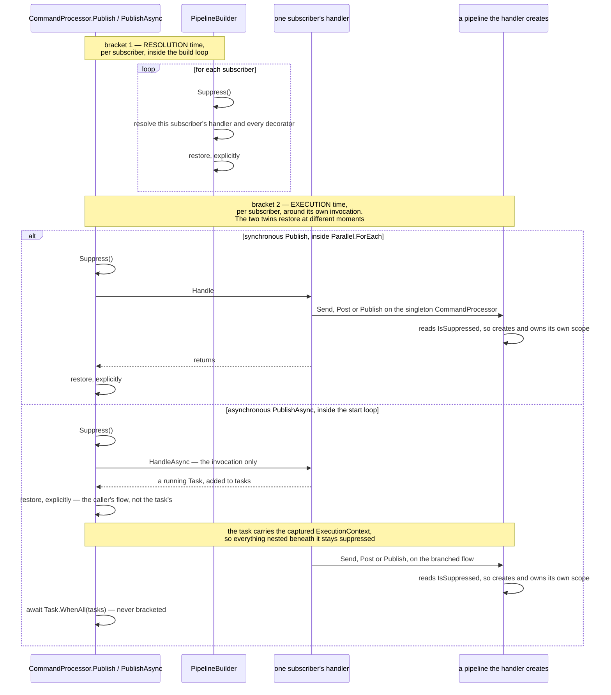
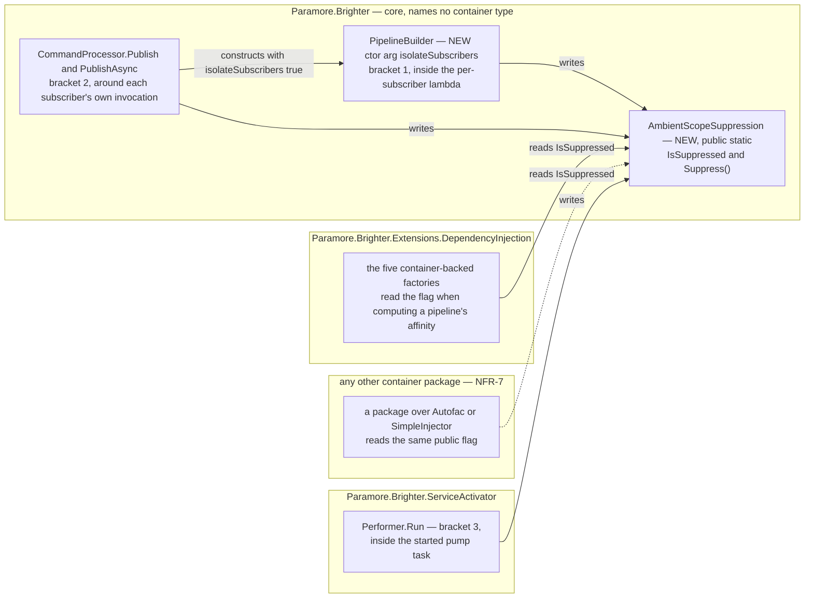

# 75. Suppressing ambient scope adoption beneath a `Publish` subscriber

Date: 2026-08-03

## Status

Proposed

## Context

ADR 0039 (`0039-scoping-dependencies-inline-with-lifetime-scope` — four ADRs carry that number, C-16) gives every `Publish` subscriber its own DI scope, so one subscriber's dependencies are never another's. ADR 0072 lets a pipeline adopt a DI scope the host already owns, which — left unqualified — would put every subscriber of a publish back into the caller's single scope and undo that isolation entirely.

FR-8 requires subscribers to stay isolated whatever the affinity says. What neither sibling decided is **how a subscriber turns adoption off** — not only for its own pipeline, but for the pipelines its handler creates at dispatch time, which Brighter never sees.

**Parent Requirement**: [specs/0036-scoped-lifetime-per-pipeline/requirements.md](../../specs/0036-scoped-lifetime-per-pipeline/requirements.md)

**Scope**: This ADR decides **where suppression hangs and where its brackets go**. It discharges FR-8, FR-9 and **FR-27.3** — that suppression is a subscriber property rather than a consequence of affinity, which is exactly what placing the two subscriber brackets on the subscriber path and nowhere else delivers — and it **supplies the substance of FR-25.5 and of NFR-9's `Publish`-subscriber and nested-pipeline rows** (step 7). It does not discharge them: ADR 0074 declares the guidance page, writes the truth table and maps every FR-25 clause to its source, so FR-25 and NFR-9 each have exactly one owner and it is not this ADR. It serves NFR-4. ADR 0072 discharges FR-27.1 and FR-27.2 and leaves this one here.

It also **supplies the mechanism for FR-19's consumer-side inertness** — the third bracket of step 4a — without discharging FR-19 either: **ADR 0072 discharges FR-19** and now names this bracket as what makes it true, in the same shape ADR 0074 owns FR-25 while this ADR supplies two of its clauses. The same flag serves both, because both are the same question — *may a pipeline created on this flow adopt?* — asked once of a subscriber and once of a pump thread.

It does **not** decide how a pipeline discovers or adopts an ambient scope — that is ADR 0072, which owns the ladder, the hand-off role and the affinity policy. Suppression meets that ladder at exactly one line, the affinity computation, and this ADR changes nothing else about it. It does not decide the opt-in property (ADR 0076) or the package that registers an ambient source (ADR 0073), nor where any rule is validated (ADR 0074): a suppressed subscriber is correct configuration, not a fault, and nothing here is reportable.

This ADR **supersedes no prior ADR.** It protects ADR 0039's decision rather than reopening it (D0c).

### Where this ADR sits

Seven ADRs deliver the parent requirement, one decision each. This is the sixth, and the only one whose subject is a pipeline Brighter did not build.

| ADR | Decides |
| --- | --- |
| 0070 | a transform pipeline takes one DI scope, carried **as a parameter** |
| 0071 | handler pipelines converge onto the **same handle**, carried on the object they already pass |
| 0072 | how a pipeline discovers an **ambient** DI scope the host owns |
| 0073 | the **ASP.NET Core package**, and the one line an application writes to opt in |
| 0074 | **where** the six scope-configuration rules are evaluated |
| **0075** *(this one)* | how a `Publish` subscriber **suppresses** adoption, for itself and everything nested beneath it |
| 0076 | the **affinity option**, and how one setting reaches all four registration paths in any order |

The rule the first two state is **the per-pipeline object carries the DI scope**, and this ADR is the one place it does not reach: the pipeline that must be suppressed has no per-pipeline object yet, because it does not exist when the decision to suppress it is taken.

ADR 0067's `Terms` block defines the two axes used throughout, and its preamble names this set as ADRs 0070–0076: Brighter's *configured lifetime*, which governs the artefact, and the container's *registration lifetime*, which governs the dependencies — and keeps `IServiceScope`, `ServiceProviderLifetimeScope` and `IAmALifetime` distinct. This ADR does not restate it. Per NFR-8, "lifetime scope" is not used for anything introduced here.

### What a subscriber must stop, and what it cannot reach

Three kinds of pipeline come into being during one `Publish`, and they differ in the two properties that decide the mechanism: whether Brighter holds a reference to the pipeline at the moment suppression must apply, and when that moment is.

| Pipeline created during one `Publish` | Built by | Brighter holds a reference? | When |
| --- | --- | --- | --- |
| a subscriber's own handler pipeline | `PipelineBuilder`, eagerly, per subscriber | **yes** — it is building it | before any handler runs |
| a nested `Send` or `Publish` the subscriber's handler issues | `PipelineBuilder`, through the singleton `CommandProcessor`, from user code | **no** | while that handler runs |
| a transform pipeline for a `Post` the subscriber's handler issues | `TransformPipelineBuilder`, from user code | **no** | while that handler runs |

Two consequences fall straight out of the table, and together they fix the whole design.

**The mechanism cannot be an argument.** Two of the three rows are pipelines core did not build, reached through the singleton `IAmACommandProcessor` (ADR 0033) from user code that is under no obligation to forward anything. Threading a decision to them would mean a new parameter on every public dispatch method, permanently, to serve a case that arises only inside `Publish`. What the three rows *do* share is the logical flow they are created on, and that is the only thing available to name them all.

**One bracket cannot cover both moments.** Row 1 happens during the build, before any subscriber's handler runs; rows 2 and 3 happen during dispatch. A bracket placed at dispatch is too late for row 1 — every subscriber's handler and decorator has already been resolved from the caller's unsuppressed ambient. A bracket placed at build time is over before rows 2 and 3 exist. Hence FR-9's two brackets, neither substituting for the other.

### The forces

- **FR-8 is unconditional.** Every subscriber of a publish is isolated, irrespective of its configured lifetimes and irrespective of the affinity the host opted into. There is no configuration in which a subscriber is permitted to join the caller's scope, so suppression is never conditional on anything a subscriber knows about itself.
- **FR-27.3 forecloses the obvious home.** A subscriber whose pipeline has no `Scoped` participant takes no pipeline scope at all and therefore never asks the ambient source — yet it must still suppress, because a pipeline nested inside it may be `Scoped` (AC-47). Suppression cannot be an argument to, or a return value of, the ambient query.
- **The pipeline that must be suppressed is one core did not build and holds no reference to.** A nested `Send`, `Post` or `Publish` issued from inside a subscriber's `Handle`/`HandleAsync` goes through the singleton `IAmACommandProcessor` (ADR 0033) from user code. There is no argument path from the subscriber's bracket to that pipeline's scope acquisition.
- **`Publish` runs its subscribers concurrently, and the two paths differ.** `PublishAsync` starts every subscriber on the caller's flow and awaits them together; the synchronous `Publish` dispatches through `Parallel.ForEach` (`CommandProcessor.cs:481`), which captures and restores `ExecutionContext` per **worker task** rather than per body invocation — so one worker running a range of subscribers carries an `AsyncLocal` write from one body into the next. The mechanism has to be correct under both.
- **Both builds are eager and per subscriber, on the caller's own thread.** `PipelineBuilder` resolves each subscriber's handler and every decorator inside a per-subscriber lambda (`PipelineBuilder.cs:187-198`), so there is a place inside the loop where a bracket can sit — and FR-9(a) requires it to sit there, around **each subscriber's own iteration**, rather than around the loop as a whole.
- **A container package Brighter does not ship must be able to honour FR-8** (NFR-7). Per-subscriber isolation cannot be a privilege of Microsoft's container: whatever carries suppression has to be readable from an assembly Brighter has never heard of.
- **NFR-4 — nothing may be left on the caller's flow.** Once either publish returns, a `Send` or a `Post` the caller issues next must adopt exactly as it would have before the publish.
- **ADR 0039 is the decision being protected, not reopened** (D0c). Suppression exists so that adoption cannot quietly repeal a scoping decision taken three ADRs earlier.

## Decision

**A `Publish` subscriber suppresses ambient scope adoption — for its own pipeline and for every pipeline created beneath it — through a public, `AsyncLocal`-backed `AmbientScopeSuppression` flag in core, bracketed twice per subscriber: once around that subscriber's resolution inside the build loop, and once around its own `Handle`/`HandleAsync` invocation, with the restore written explicitly on both.**

**And the same flag takes a third bracket, around the consumer pump's own flow**, so that a consumer pipeline creates and owns its scope because Brighter said so rather than because a pump thread happened to be started outside a request.

The flag carries one bit along a logical flow, and it is read at exactly one place: the line where a pipeline computes the affinity it will ask the ambient source with. Everything else about adoption is ADR 0072's and is untouched. The two subscriber brackets are lexical and per subscriber; neither is ever placed around the whole loop. The third is lexical too, and its unit is one pump thread rather than one subscriber.

### The mechanism, end to end

The diagram is the **publish** mechanism — brackets 1 and 2, which is what FR-8 and FR-9 are written over. The pump bracket is a separate flow with no subscriber in it and is specified in *Implementation Approach* step 4a; it is not drawn here because it shares none of this diagram's participants.



Two invariants are readable off the diagram, and a third is a rule about placement that the diagram shows the *consequence* of rather than the rule itself. Each is load-bearing.

**Neither bracket substitutes for the other.** Bracket 1 alone leaves a nested pipeline free to adopt. Bracket 2 alone is too late — every subscriber's handler has already been resolved from the caller's unsuppressed ambient before any of them runs, which is what AC-11 and AC-12 fail on.

**Neither is ever placed around the whole loop.** Not because a loop-level bracket would share a scope — it would not; `GetSyncInstanceScope()` runs once per iteration and suppression is one bit that has no bearing on how many scopes are created — but because a bracket whose extent is the whole loop no longer has the extent of the unit FR-9(a) is written over, and because it is the placement that *invites* a later reader to give the loop one scope, which would undo ADR 0039. *Technology Choices* and Alternative 5 make the same argument at length.

**The restores are explicit**, on both brackets and on both publish paths, rather than inherited from `ExecutionContext`. *Implementation Approach* step 5 says why that is a statement about the code rather than a hope about `Parallel.ForEach`.

Where this meets adoption is one line. ADR 0072's protocol computes a pipeline's affinity before it asks anything, and that computation is the single point at which suppression bites:

> `affinity = AmbientScopeSuppression.IsSuppressed ? AlwaysNew : the policy over the whole participating set`

`AlwaysNew` is the `ScopeAffinity` value ADR 0072 defines, meaning *do not adopt an ambient; create and own a scope*; the policy that computes the other case is 0072's too, and the five container-backed factories that read it are the mapper, transformer and handler factories in `Paramore.Brighter.Extensions.DependencyInjection` (0072 names them individually).

A suppressed pipeline therefore reaches the same *outcome* a host with no provider registered reaches — it creates and owns its own DI scope, exactly as today — by a different path: the ask is still made, carrying `AlwaysNew`, because D16 makes it unconditional so that the decision is observable (AC-13). Suppression adds no outcome to the ladder; it selects one that already exists.

### Where the pieces live



The flag is the only thing that crosses an assembly boundary, and it names no container type — which is why it can live in core at all and why a package Brighter does not ship can honour FR-8 on the same terms as the one it does. **It crosses in both directions**: the DI package and any third-party package **read** it, and `Paramore.Brighter.ServiceActivator` **writes** it. That second direction is why `Suppress()` cannot be `internal` — Alternative 3a states it as the design-forced half of its rejection.

### Key Components

#### The roles, and what each is responsible for

| Role | Type | Stereotype | Responsibility |
| --- | --- | --- | --- |
| Suppression state | `AmbientScopeSuppression` (core) | **knowing** | Carries one bit along a logical flow — *no pipeline created on this flow may adopt an ambient scope* — and hands out the bracket that sets and restores it |
| Resolution-time bracket | `PipelineBuilder<TRequest>` (core) | **doing** | Establishes and restores suppression around each subscriber's own artefact resolution, inside the build loop |
| Execution-time bracket | `CommandProcessor.Publish` / `PublishAsync` (core) | **doing** | Establishes and restores suppression around each subscriber's own `Handle`/`HandleAsync`, so pipelines that subscriber creates at dispatch are covered |
| Pump-flow bracket | `Performer` (`Paramore.Brighter.ServiceActivator`) | **doing** | Establishes suppression on the pump thread's own flow inside the task it starts, and restores it when the pump stops, so nothing the pump drives can adopt whatever flow the pump was started from |
| Suppression reader | the five container-backed factories (DI package) | **deciding** | Read the flag at the one point a pipeline's affinity is computed, and take the created-and-owned path when it is set |

`AmbientScopeSuppression` is deliberately **not an injected** role — it is a static holder, not an interface anyone is handed. That is a decision rather than an omission: an injected role would have to reach the same two dispatch methods and the same builder, none of which is resolved from a container, and it would not be readable by the third-party container package NFR-7 requires the design not to preclude. The cost of the shape is under *Technology Choices* and again under *Consequences*.

#### `AmbientScopeSuppression` — where suppression hangs (new, core, public, static)

```csharp
namespace Paramore.Brighter
{
    /// <summary>
    /// Suppresses ambient scope adoption for the current logical flow and every flow started from
    /// it. A pipeline created while suppression is in force creates and owns its own DI scope,
    /// whatever the configured affinity. Established by Brighter around each Publish subscriber's
    /// resolution and around its execution; public so that a host, or a container package Brighter
    /// does not ship, can honour the same rule.
    /// </summary>
    public static class AmbientScopeSuppression
    {
        public static bool IsSuppressed { get; }
        public static IDisposable Suppress();
    }
}
```

**Contract.**

| Member | Input | Output | Error conditions |
| --- | --- | --- | --- |
| `IsSuppressed` | none | `true` when a suppression bracket is in force on this flow | Cannot throw. A reader outside any bracket sees `false` |
| the bracket's `Dispose()`, **on the flow that took it** | none | the value captured when the bracket was taken is restored on **this** flow | The bracket must be disposed on the logical flow that created it. Disposing it on another — the likeliest misuse of a public mutator, and exactly the shape of the "background job started from a request whose `HttpContext` still flows" case *Technology Choices* offers — writes the captured value into the *disposing* flow and leaves the originating flow suppressed for its remaining lifetime. **The implementation does not detect it**: an `AsyncLocal<bool>` cannot tell the two flows apart, and a detector would cost every bracket a flow identity to serve a caller error Brighter's own brackets, being lexical, cannot make |
| `Suppress()` | none | a bracket that restores the value it captured when disposed, so lexically nested brackets nest correctly | Cannot throw. Disposing a bracket twice is a no-op. Disposing brackets **out of order** restores the outer bracket's captured value while an inner one is still live, which clears suppression early — and then, when the inner bracket is disposed, restores the value *it* captured, leaving the flow suppressed for the rest of its life with every bracket disposed. Both halves are reachable only from a caller of the public mutator; Brighter's own brackets are lexical and always disposed innermost-first. The residue falls in the benign direction described below. Failing to dispose leaves the flow suppressed for the rest of its life |

Backed by `AsyncLocal<bool>`. Core writes it; the container package reads it. It is **public for both read and write**, deliberately, and the cost is recorded in *Consequences*.

The two failure directions are not symmetric, and that asymmetry is why the shape is acceptable. A bracket that is leaked or never disposed leaves suppression *on*, which produces today's create-and-own behaviour — never unintended sharing of a caller's scope. Only out-of-order disposal by a caller of the public API can clear it early — and even that ends with suppression *on* rather than off, once the inner bracket restores its own captured value. No Brighter code path does either.

#### Where each type is touched

| Assembly | Type | Change |
| --- | --- | --- |
| `Paramore.Brighter` | `AmbientScopeSuppression` | **new** |
| `Paramore.Brighter` | `PipelineBuilder<TRequest>` | a defaulted constructor argument `bool isolateSubscribers = false` on the two dispatch constructors (`:59`, `:76`), and the resolution-time bracket inside both build-loop bodies (`:187-198` sync, `:232-244` async) |
| `Paramore.Brighter` | `CommandProcessor` | `Publish` (`:472`) and `PublishAsync` (`:575`) construct the builder with `isolateSubscribers: true`; the execution-time bracket around `handleRequests.Handle(@event)` (`:489`) inside the `Parallel.ForEach` body (`:481-497`) and around the `HandleAsync` **invocation** inside the start loop (`:596`) |
| `Paramore.Brighter.ServiceActivator` | `Performer` | the pump-flow bracket inside the task `Run()` starts (`Performer.cs:62-69`), around the `_messagePump.Run()` call it already makes. No signature changes |
| `…DependencyInjection` | the five container-backed factories | one read of `IsSuppressed`, specified **here** and landing in **this ADR's commit**, at the line ADR 0072's protocol calls step 3 — the affinity computation. The type and the code that reads it arrive together, so ADR 0072's commit never references a type that does not yet exist; 0072's touched row and its step 3 say the same from the other end |

Unchanged, and named so the omission is not read as an oversight: the describe-only `PipelineBuilder` constructor (`:92`), which serves validation and diagnostics and builds nothing that could adopt; `PipelineBuilder.Dispose()` (`:269-270`), so D10's release timing is preserved by construction; `Send` (`:317`) and `SendAsync` (`:394`), which construct the builder with the default and therefore never suppress (FR-27.3, AC-47's first branch); the two validation-time construction sites (`BrighterPipelineValidationExtensions.cs:75`, `:116`), likewise; `IAmAPipelineBuilder<TRequest>` and `IAmAnAsyncPipelineBuilder<TRequest>`, whose signatures do not change; every interface ADRs 0070 and 0071 changed; `RequestContext`; and **the pump itself**, which still publishes nothing ambient (D0b, OOS-1) — step 4a says why the bracket goes in `Performer` and not in it.

### Technology Choices

**Why suppression is ambient state, when ADR 0070 removed all of it.** ADR 0070 rejected an `AsyncLocal` carrying a *scope*, and rightly: a scope is a resource with an owner and an end, invisible coupling around it means FR-5's failed-build release has nowhere to live, and it is not implementable over a non-Microsoft container. Suppression is a different kind of thing. It carries one bit, owns no resource, needs no end beyond its own lexical bracket, and can be honoured by any container package because it names nothing container-specific. And it has no alternative: two of the three pipelines it must reach are ones core did not build and holds no reference to. It is the only ambient mechanism in the design, and it is the only part of the design with no parameter path available to it.

**Why the holder is public for read *and* write.** It must be public rather than `internal` plus `InternalsVisibleTo` because a container package Brighter does not ship must be able to honour FR-8 too (NFR-7) — an `internal` flag would make per-subscriber isolation a privilege of Microsoft's container. The *write* is forced independently, by this design's own shape: the pump-flow bracket of step 4a is taken in `Paramore.Brighter.ServiceActivator`, a different assembly from the one the flag lives in, and this repository uses `InternalsVisibleTo` nowhere — so an `internal` `Suppress()` would leave FR-19's invariant unimplementable by Brighter itself. Alternative 3a states that as the design-forced ground it is. Beyond that it buys something real: a host, or a third-party integration, can suppress adoption around its own work — a background job started from a request whose `HttpContext` still flows, for instance — taken and disposed on the **starting** flow, around the call that starts the job (`using (AmbientScopeSuppression.Suppress()) { StartBackgroundJob(); }`), so the job's captured `ExecutionContext` carries suppression and the starting flow restores; that is bracket 2's async shape, and it is the recipe rather than the misuse — without waiting for a Brighter release. The honest cost is stated in *Consequences*: FR-8 becomes an invariant core **asserts** rather than one no caller can defeat.

**Why a constructor argument on `PipelineBuilder` rather than a parameter on `Build`.** Whether subscribers are isolated is a property of the *call site*, not of a build: a builder constructed by `Publish` always isolates and one constructed by `Send` never does. The builder is already constructed per call site, so those sites are the natural place to say which kind of build this is — and a parameter on `Build`/`BuildAsync` would put a flag on `IAmAPipelineBuilder<TRequest>` and `IAmAnAsyncPipelineBuilder<TRequest>`, which are both `internal` and both otherwise untouched by this work.

**And the class chosen instead is itself public, so this is a break.** `PipelineBuilder<TRequest>` is public and so are all three of its constructors — step 2 cites each — so adding a defaulted parameter to two of them is source-compatible but **binary-breaking**: a default argument is compiled into the call site, so an already-built assembly binds to a constructor that no longer exists. An added *overload* carrying the flag would avoid it, and is rejected for what it leaves behind — two constructors per dispatch shape, differing by one boolean, with nothing in either signature saying which a caller should pick, and the old one remaining the one a reader finds first. The break is real and small, it is the same **shape** as the six transform-pipeline constructors ADR 0070 step 5 changes — binary-breaking, source-compatible — rather than the source-and-binary break the eight interface signatures carry, and it goes in the same `release_notes.md` entry (ADR 0070 step 7a). **AC-24 does not reach it** — that criterion enumerates the `MapperLifetime` break, C-18's mixing break, FR-22.2's joint consequence and the six factory interfaces whose signatures changed, so nothing detects the omission of this constructor note. Step 7a carries it because the ledger is written as a superset of AC-24, not because AC-24 asks for it.

**Why the bracket goes inside the per-subscriber lambda and not around the loop.** Around the loop, every subscriber would resolve under one suppression bracket — which is correct — but the same placement is the one that tempts a reader into giving the whole loop one pipeline scope, and ADR 0039 requires one per subscriber. Inside the lambda the bracket has exactly the extent of one subscriber's resolution, which is the unit FR-8 is written over, and it reads the same way as the execution-time bracket.

### Implementation Approach

**1. The core type.** Add `AmbientScopeSuppression` to `src/Paramore.Brighter/`, backed by a private `static readonly AsyncLocal<bool>`. `Suppress()` captures the current value, sets `true`, and returns a bracket whose `Dispose` restores the captured value and is idempotent. It names no container type, so the source-level guard AC-22.3 runs returns nothing new.

`Suppress()` is `public`, and its XML documentation carries the intent that its accessibility cannot: a `<remarks>` block stating that it is **not intended for direct application use**, that Brighter's own three brackets — the two publish brackets and the pump-flow bracket of step 4a — are the only callers within Brighter, and that it is public so `Paramore.Brighter.ServiceActivator`, a container package honouring FR-8 (NFR-7), and Brighter's own tests — all of which live in separate assemblies and cannot use `InternalsVisibleTo`, a mechanism this repository does not use — can reach it. `ServiceCollectionExtensions.BrighterHandlerBuilder` already establishes that convention for a public member an application is not meant to call. The `<remarks>` must also state the two misuse modes below, because a caller who reaches this member is exactly the caller who can trip them.

**2. `PipelineBuilder` learns which kind of build it is.** The class is `public` (`PipelineBuilder.cs:37`) and so are all three of its constructors; the two internal builder interfaces a `Build` parameter would have touched instead are `IAmAPipelineBuilder.cs:36` and `IAmAnAsyncPipelineBuilder.cs:37`. Add a defaulted `bool isolateSubscribers = false` to the two dispatch constructors (`:59` sync, `:76` async). The describe-only constructor (`:92`) does not take it — it resolves nothing and can adopt nothing. `CommandProcessor.Publish` (`:472`) and `PublishAsync` (`:575`) pass `true`; `Send` (`:317`) and `SendAsync` (`:394`) keep the default, so a `Send` never suppresses. The two validation-time construction sites (`BrighterPipelineValidationExtensions.cs:75`, `:116`) are not affected either way — both use the describe-only constructor, which has no such parameter to keep or pass.

**3. Bracket 1 — resolution time, per subscriber, inside the build loop.** In both twins the per-subscriber lambda is `observerTypes.Each(observer => { … })` — `Build` at `:187-198`, `BuildAsync` at `:232-244`. When `isolateSubscribers` is set, the bracket wraps the body of that lambda: the `GetSyncInstanceScope()` / `GetAsyncInstanceScope()` call, the handler `Create`, and `BuildPipeline` / `BuildAsyncPipeline` with the decorator resolution inside it. That is where the subscriber's artefacts and their container-`Scoped` dependencies are actually resolved.

**4. Bracket 2 — execution time, around that subscriber's own invocation.** The twins differ and must be written differently.

- **Sync `Publish`** — inside the `Parallel.ForEach` body (`:481-497`), around `handleRequests.Handle(@event)` (`:489`), restored on every exit path of the body.
- **Async `PublishAsync`** — around the **invocation** of `handleRequests.HandleAsync(@event, cancellationToken)` inside the start loop (`:596`), never around `Task.WhenAll` (`:601`). **FR-9(b) permits a second shape — a bracket around the subscriber's own *task* rather than its invocation — and it is not taken**: an async wrapper per subscriber costs an extra state machine and an extra frame on every handler's stack, and reaches the same observable, because the invocation-only bracket is live when the state machine captures its context and every continuation therefore runs suppressed. The bracket is live when the async method is called, so the `ExecutionContext` its state machine captures carries suppression into every continuation; disposing the bracket immediately afterwards restores the **caller's** flow without touching the running task's, because an `AsyncLocal` write in one flow does not propagate back to a flow that has already branched. Bracketing `Task.WhenAll` instead would suppress nothing during the synchronous prefix of each handler and would leave the caller's flow suppressed for the duration of the publish.

This bracket is what AC-47's second branch needs: a subscriber whose own pipeline has no `Scoped` participant takes no pipeline scope and asks nothing, yet a `Post` its handler issues at dispatch time must not adopt.

**4a. Bracket 3 — the consumer pump's own flow, so FR-19 is an invariant rather than an assumption.** Take the bracket **inside the task `Performer.Run()` starts** (`Performer.cs:62-69`), around the `_messagePump.Run()` call it already makes:

```csharp
return Task.Factory.StartNew(
    () =>
    {
        using var suppression = AmbientScopeSuppression.Suppress();
        _messagePump.Run();
    },
    CancellationToken.None,
    TaskCreationOptions.LongRunning,
    TaskScheduler.Default);
```

**Why the bracket exists at all.** C-14 *assumes* a pump thread carries no usable ambient `HttpContext`, and FR-19's inertness rests on that assumption. It is an assumption rather than an invariant, and it does not hold: `IHttpContextAccessor` is `AsyncLocal`-backed, so a `Dispatcher` started from inside a **live** request sees a non-null `HttpContext` whose `RequestServices` is that request's scope. ADR 0072's usability probe then **passes** and the ask lands on ladder row 10 — *borrowed* — which is an FR-19 violation in resolution and identity, not in logging, and which FR-23 does not govern because the ambient is live rather than stale. Every consumer pipeline on that pump would resolve from one request's scope for the life of the process. ADR 0073 owns C-14 and now records that this bracket is what closes it.

**Why configuration cannot do this and a flow property can.** The apparent fix — have `ScopeAffinityPolicy` compute `AlwaysNew` on the consumer side — has nothing to compute it from. In a mixed host on the `Action` overload, `IBrighterOptions` and `IAmConsumerOptions` name **the same `ConsumersOptions` instance** (ADR 0076's stated residue), so one object carries both roles' affinity and no reader can tell which side is asking. Suppression is not subject to that: it is a property of the **flow the pipeline was created on**, and the pump thread's flow is exactly the thing that distinguishes the two sides.

**Why `Performer` and not the pump.** C-2 and OOS-5 name `Reactor`, `Proactor`, `Dispatcher`, `DispatchBuilder` and `ConsumerFactory` and forbid changing them, and `Run()` is implemented on `Reactor.cs:95` and `Proactor.cs:95` — so the pump's own entry point is closed to this work. `Performer` is not one of those five: its stated responsibility is *"abstracts the thread that runs a message pump"* (`Performer.cs:31-32`), which is the flow boundary rather than the pump, and it is the only caller of `IAmAMessagePump.Run()` in `src/`. The pump itself is untouched and still publishes no per-message ambient (D0b, OOS-1); what changes is the flow it is started on. This is the same reading `PipelineBuilder` already gets against C-2, which likewise covers five named types and not every type on the path.

**Why inside the started task rather than around `StartNew`.** Both reach the pump — a bracket taken around `StartNew` would be captured into the started task's `ExecutionContext`, which is bracket 2's async shape. Inside the task is preferred because the bracket is then **taken and disposed on the flow it suppresses**: it ends when the pump stops, no flow is left suppressed with no bracket to dispose on it, and the caller's flow — the `Dispatcher`'s — is never written to at all. It also does not depend on context flow through `Task.Factory.StartNew`, so it is correct however the pump is started.

**What this makes true.** A consumer pipeline's affinity is `AlwaysNew` unconditionally, so its ask carries `AlwaysNew`, ADR 0073's provider returns nothing on an `AlwaysNew` ask (D16), and ladder row 6 gives it a scope it creates and owns — **with no diagnostic**. FR-19's inertness stops being contingent on operator discipline about where a `Dispatcher` is started. ⚠ **It is stronger than FR-19 as currently written**, which permits up to two log entries on the consumer side and routes the `Dispatcher`-started-from-a-request case to FR-23; under this bracket a conforming provider emits **none**, and the FR-23 route is not reached because nothing stale is ever offered. FR-19, AC-20 and C-14 are owed the corresponding correction, and it is carried in the requirements true-up rather than here. A **non**-conforming provider that returns an ambient for an `AlwaysNew` ask still trips FR-24.4's once-per-container `Warning`, exactly as it does for a suppressed subscriber (step 6).

**5. Why an omitted restore on the synchronous path would not be observable.** `Parallel.ForEach` partitions the source and gives each worker task a range; `ExecutionContext` is captured and restored per **worker task**, not per body invocation. So an `AsyncLocal` write in subscriber 1's body is still current when the same worker calls the body for subscriber 2. Without an explicit restore that leak is real, and the design does not assume it away — it writes the restore, and the three bounds below are why an implementation that omitted it would still pass every test — it is bounded and unobservable, for three reasons that have to hold together:

- **Every subscriber must be suppressed anyway.** FR-8 makes suppression unconditional for every subscriber of a publish, irrespective of its lifetimes. A leaked `true` sets exactly the value subscriber 2's own bracket sets one instruction later. There is no state a subscriber body needs in which `IsSuppressed` is `false`, so no observation can distinguish a leaking implementation from a correct one — which is why no Acceptance Criterion asserts against it, and why AC-39 says so explicitly.
- **The only alternative reading is foreclosed.** OOS-14 denies that a nested pipeline ever re-enters its parent subscriber's scope, so "subscriber 2 should have seen its own suppression rather than subscriber 1's" is not a distinction with an observable behind it — both mean *create your own scope*.
- **The leak cannot escape the publish, and the shape that would let it is bracket 1's, not bracket 2's.** A worker task ends when the `Parallel.ForEach` ends, and the thread pool restores a fresh `ExecutionContext` per work item, so nothing survives onto **unrelated** work — probe-confirmed. **Work a subscriber's handler deliberately branches is the exception, and it is by design**: a `Task` started under a live bracket captures the suppressed context and stays suppressed for its whole life, because the bracket is disposed on the publish's flow and not on the branch. That is D6's direction — the branch is nested beneath a subscriber and must not adopt — and it fails toward isolation, which is why it is accepted rather than corrected. Nor does an unrestored write inside a `Parallel.ForEach` **body** reach the caller: the runtime captures and restores `ExecutionContext` per *replica*, including the replica it inlines on the calling thread, so the cross-body leak described above is real while the caller-flow leak is not. **On the synchronous twin, bracket 1 is where the caller's flow is genuinely exposed**, because its loop is `observerTypes.Each(observer => …)` — a plain synchronous `foreach` (`Extensions/Each.cs:39-45`) with no `ExecutionContext` boundary of any kind — and it runs on the calling thread throughout, inside a `Publish` that is itself a plain `void` method. A bracket placed *around* the `Parallel.ForEach` rather than inside it would expose the caller's flow for the same reason, which is why alternative 5 is rejected. **AC-39's leak clauses detect exactly this**: a `Send` and a `Post` issued by the controller after the synchronous publish returns must resolve from the request scope.

**5a. The exposure is not symmetric between the twins, and the asymmetry is the runtime's, not the design's.** An `async` method is itself an `ExecutionContext` boundary: `AsyncMethodBuilderCore.Start` saves the calling thread's context before the state machine's first `MoveNext` and restores it in a `finally`. `CommandProcessor.PublishAsync` (`:559`) is `async`; `Publish` (`:458`) is a plain `void`. So **no `AsyncLocal` write made anywhere inside `PublishAsync` can reach its caller's flow, restored or not** — not bracket 1's inside the synchronous `BuildAsync`, and not bracket 2's in the start loop. On the synchronous `Publish` there is no such boundary and an unrestored write does reach the caller. This is established by probe, not by argument: an `async` method is itself an `ExecutionContext` boundary.

The conclusion is that **the restores are written explicitly on both brackets and on both publish paths**, but what they are load-bearing *for* differs:

- **Synchronous `Publish`.** Bracket 1's restore is load-bearing — nothing else would restore it, and the caller observes what it leaves behind. Bracket 2's is defence in depth: an unrestored write inside a `Parallel.ForEach` body does not reach the caller, because the runtime restores `ExecutionContext` per replica including the one inlined on the calling thread, but it does leak from one body to the next on a shared worker, which is what 5's three bullets bound.
- **Asynchronous `PublishAsync`.** Both restores are defence in depth and symmetry with the synchronous twin. The runtime's own boundary already protects the caller, and the design does not rely on that: the restores are written anyway, because relying on a lowering detail of the C# compiler for a correctness property is a worse bargain than two `finally` blocks, and because a future refactor that made `PublishAsync` synchronous up to its first `await` in some other way would silently remove the protection.

Stating which is which matters, because a reader who believes the async restores are what save the caller — or that the `Parallel.ForEach` restore is — has the mechanism backwards and will place the next bracket by the wrong rule.

**6. Where this meets adoption.** ADR 0072's `CreatePipelineScope()` protocol reads `IsSuppressed` once, at the line that computes the pipeline's affinity, and substitutes `AlwaysNew` when it is set. Nothing else in that protocol changes and **no outcome is added to its ladder** — suppression selects one that already exists.

**Two things that are easy to over-state, and that an implementor must not.** First, **the ask is still made.** D16 makes it unconditional for any pipeline with a `Scoped` participant, so a suppressed subscriber still calls `GetAmbient(AlwaysNew)`, and a recording provider still sees that decision — AC-13 counts five decisions across a `Send`, a three-subscriber `Publish` and a `Post`, three of them the subscribers'. That is the difference from a host with **no provider registered**, where ladder row 3 makes no call at all: the *outcome* matches, the *path* does not, and an implementor who skips the ask fails AC-13 and AC-46. Second, **suppression does not silence diagnostics.** It adds none, but a suppressed pipeline reaches ladder rows 5 and 6 like any other `AlwaysNew` pipeline, so a non-conforming provider that returns an ambient for an `AlwaysNew` ask still trips FR-24.4's once-per-container `Warning` — which is exactly what AC-11 pins, its only `AlwaysNew` asks being the two suppressed subscribers'.

**7. The documentation this ADR owes.** Two pieces of `docs/guides/lifetimes-and-scoping.md` come from here, and ADR 0074 — which declares the page and holds the clause-to-source map — names this ADR as the source of both. **FR-25.5**: that an in-process `Publish` subscriber, and every pipeline nested inside one, cannot join the caller's transaction, that this is FR-8 working as specified rather than a defect, and that the outbox is the answer (C-4, D6, AC-36). **NFR-9's truth table**: the `Publish`-subscriber and nested-pipeline **rows** — for each of the three configured lifetimes and both affinities, the source a subscriber's pipeline resolves from is its own scope and never the ambient, and the same holds for anything the subscriber's handler creates while it runs. Both are written from this ADR's *What a subscriber must stop, and what it cannot reach* table and its two brackets; neither re-decides anything.

## Consequences

### Positive

- **ADR 0039's per-subscriber isolation survives adoption.** A feature that would otherwise have quietly repealed a scoping decision taken three ADRs earlier is bounded by one bit, and the boundary is written where the decision it protects lives.
- **The unreachable pipelines are reached.** A nested `Send`, `Post` or `Publish` issued from user code inside a subscriber's handler is suppressed without any signature change to `IAmACommandProcessor`, which is the only mechanism available for a pipeline core did not build (ADR 0033, C-5).
- **Suppression costs nothing when nothing is published, and two `AsyncLocal` writes per subscriber when something is.** `IsSuppressed` is one `AsyncLocal` read per pipeline that takes a pipeline scope, and no bracket is ever established outside a publish. On the **consumer** side that qualifier matters: every `MT_EVENT` message dispatches through `Publish`/`PublishAsync` (`Reactor.cs:406`, `Proactor.cs:130`), so under sustained consumption the two writes per subscriber are on the hot path AC-23 measures. Each is an `AsyncLocal` set, which allocates an `ExecutionContext`; it is bounded by subscribers per message and does not grow with message count, so NFR-5 and NFR-6 hold — but it is not free there.
- **The failure direction is toward isolation.** A leaked or undisposed bracket produces today's create-and-own behaviour, never unintended sharing of a caller's scope.
- **A container package Brighter does not ship can honour FR-8** on exactly the same terms as the one it does, because the flag is public and names nothing container-specific (NFR-7).
- **FR-19's inertness stops being an assumption and becomes an invariant.** C-14 took a pump thread to carry no usable ambient; a `Dispatcher` started from inside a live request falsifies that, and the pump-flow bracket closes it whatever the operator does. The cost is **one bracket per pump thread for the life of the process** — a set and a restore, not per message — so it is invisible to AC-23's measurement, and the same flag serves it as serves the subscribers.
- **Core stays container-agnostic** (ADR 0014). The one new core type names no container type, and the source-level guard AC-22.3 runs finds nothing new.
- **Release timing is unchanged.** `PipelineBuilder.Dispose()` (`:269-270`) still drains every subscriber's scope together at end of publish; nothing here tightens it (D10, AC-10).

### Negative

- **Core gains a public static with a public mutator.** `AmbientScopeSuppression.Suppress()` is callable by anyone, so FR-8's per-subscriber isolation becomes an invariant core **asserts** rather than one no caller can defeat. A caller who takes a bracket and leaks it suppresses adoption for the rest of that logical flow, and nothing detects it; a caller who disposes brackets out of order can clear suppression while an inner bracket is still live. Neither misuse is reachable from Brighter's own code — all three of its brackets are lexical and disposed innermost-first — and the leaked-bracket direction is benign; but they are real properties of a public mutator, not hypotheticals. ⚠ **`Suppress()` is now called from a second assembly by Brighter itself.** `Performer` (`Paramore.Brighter.ServiceActivator`) takes the pump-flow bracket, so the public mutator is no longer public *only* for NFR-7 and for tests: an `internal` mutator would leave step 4a unimplementable. That removes the argument for narrowing it later (Alternative 3a) and correspondingly removes the option of ever taking the surface back.
- **The design is no longer free of per-flow state.** ADR 0070 removed all of it and listed "no hidden state" as a positive; this ADR puts one bit back. It is one bit rather than a resource, its brackets are lexical, and its failure mode is benign — but a reader now has `ExecutionContext` semantics to hold in mind on the `Publish` paths, and the synchronous path's `Parallel.ForEach` behaviour has to be understood to see why the restore is explicit.
- **Two construction sites in `CommandProcessor` gain an argument**, and the meaning of a `PipelineBuilder` now depends on a boolean set at construction. A reader of `Build` has to look at the constructor to know whether subscribers are isolated.
- **`PipelineBuilder<TRequest>` is a public type and the two constructors that change are public.** The two call sites that pass `isolateSubscribers: true` are in `CommandProcessor`; the two dispatch constructors are called at four sites in `CommandProcessor` — the touched table carries the lines — and at **48** in `tests/`, every one of which recompiles unchanged — of 69 `PipelineBuilder` constructions there, the other 21 use the describe-only constructor, which does not change. The change is source-compatible and **binary-breaking** for any assembly compiled against the three-argument signature and not rebuilt, because a default argument is baked into the call site. That is a break on public surface, not an internal edit, and it belongs in the same `release_notes.md` entry as the interface breaks (ADR 0070 step 7a), which catalogues it with a one-line pointer to this bullet — held there by that ledger's superset rule rather than by AC-24, which does not enumerate it. The alternative — an added overload rather than a defaulted parameter — was declined in *Technology Choices*.
- **Three brackets, five places to get wrong** — the resolution-time bracket in each of `PipelineBuilder`'s two build loops, the execution-time bracket in each of `CommandProcessor`'s two dispatch paths, and the pump-flow bracket in `Performer` — in three files, three assemblies and five shapes: a lambda body, a second lambda body, a `Parallel.ForEach` body, an async start loop and a long-running task body. None is redundant, so none covers for a mistake in another.
- **`Paramore.Brighter.ServiceActivator` acquires a dependency on a core type it did not name before.** The pump flow is now something this design writes to, and a reader of `Performer` — whose subject is threads, not dependency injection — has to reach ADR 0072 to see why a `using` there decides what a handler's dependency resolves from. The bracket is one line and its `<remarks>` can point at this ADR, but the coupling is real and did not exist before.
- **In-process `Publish` subscribers still cannot join a caller's transaction**, and under D6 neither can pipelines nested inside them. That is FR-8 working as specified rather than a defect, but it is the limitation applications most often expect not to exist, and the outbox is the answer (C-4). It has to be stated plainly in `docs/guides/lifetimes-and-scoping.md` (FR-25.5).

### Risks and Mitigations

| Risk | Mitigation |
| --- | --- |
| Suppression leaks past `Publish` and a later `Send` or `Post` in the same request silently fails to adopt | Both publish brackets restore explicitly on every exit path — normal return, exception, cancellation — rather than relying on `ExecutionContext`. **AC-39's leak clauses are the ones that can actually fail**, because it is written over the synchronous `Publish`, which is a plain `void` method and has no boundary of its own. AC-12's counterpart clause reads after an `async` publish has completed, by which point the runtime has already restored the caller's context, so it guards a regression the async runtime prevents rather than one this design could introduce (step 5a) |
| A subscriber's handler is resolved before suppression is established, so it adopts the caller's ambient | The resolution-time bracket is inside the per-subscriber lambda in both build loops, around the `Create` and the decorator resolution — not around the loop, and not at dispatch. AC-11 and AC-12 fail on an execution-time bracket alone, by construction |
| The two brackets drift apart as the publish paths change | They are specified against the same unit — one subscriber — and both are asserted by the same criteria. The two are covered by different criteria and both are pinned: bracket 1 by **AC-11**, whose closing note says in terms that it fails unless FR-9's resolution-time bracket is implemented and that an execution-time bracket alone cannot make it pass; bracket 2 by **AC-12** and **AC-39**, and by **AC-47's second branch**, where the subscriber takes no pipeline scope at all so suppression can only come from the execution-time bracket. A bracket removed from either path fails a test rather than degrading quietly |
| A third-party container package ignores the flag and adopts anyway | Nothing prevents it, and the ADR says so. The flag is a contract a package honours, not a gate Brighter enforces — the same trade NFR-7 makes everywhere else in this design |
| An application takes a bracket of its own and never disposes it | Adoption stops for that flow and the application silently gets today's behaviour. Documented under FR-25, and the direction is toward isolation rather than sharing |
| The pump-flow bracket is dropped, or moved out of `Performer` into the pump, and a `Dispatcher` started from inside a live request adopts that request's scope for the life of the process | The bracket is the only thing standing between that host and an FR-19 violation in resolution and identity, and moving it into `Reactor` or `Proactor` is closed by C-2 in any case. ⚠ **No acceptance criterion asserts it today** — AC-20 is written over a host whose pump threads carry no `HttpContext`, which is C-14's assumed case rather than its falsified one. The criterion is owed and is carried in the requirements true-up alongside FR-19's and AC-20's own corrections; until it exists this is guarded by review only, and this row says so rather than implying otherwise |

## Alternatives Considered

**1. Do nothing — let subscribers adopt.** Suppression exists only because ADR 0072 exists; without adoption there is nothing to suppress. **Rejected by FR-8, and it is worth saying what doing nothing would cost:** every subscriber of a publish would resolve from the caller's request scope, so ADR 0039's per-subscriber isolation would be repealed by a feature that never mentions it, and a subscriber would appear to join the caller's transaction while the outbox — the actual answer (C-4) — went unused. The failure would be silent and would only show under concurrency.

**2. Suppression as an argument to, or a return value of, the ambient query.** `GetAmbient(affinity, isSubscriber)`, or an ambient object that carries "and suppress beneath me". **Rejected by FR-27.3, precisely.** A `Publish` subscriber whose pipeline has **no `Scoped` participating factory** takes no pipeline scope under FR-27.1 and therefore never calls the ambient query at all — yet it must still suppress, because a pipeline nested inside it may be `Scoped`. AC-47's second branch is exactly that configuration and is unsatisfiable by any mechanism that lives on the ambient query. The same argument kills making suppression a third `ScopeAffinity` value: affinity is a property of a pipeline that is taking a scope, and suppression is a property of a subscriber whether or not it takes one.

**3. Suppression as `internal` plus `InternalsVisibleTo`.** Keeps the flag out of core's public surface and makes FR-8 undefeatable by user code. **Rejected, and on a rule rather than a preference: this repository does not use `InternalsVisibleTo`, anywhere, without exception.** Even if it did, the attribute would have to name every container package that must honour FR-8, which is a list Brighter does not control — NFR-7 requires the design not to *preclude* implementations over Autofac or SimpleInjector from an assembly Brighter has never heard of, and such a package cannot honour per-subscriber isolation if it cannot read the flag.

**3a. Public read, `internal` write.** The narrower option, and the one that makes FR-8 undefeatable while still satisfying the NFR-7 read. **It satisfies NFR-7 completely** — NFR-7 needs a public *read*, and this ADR everywhere else defines the NFR-7 case as reading the flag. It is rejected on three grounds, and the first of them is design-forced rather than a preference.

**It makes step 4a unimplementable.** `AmbientScopeSuppression` lives in `src/Paramore.Brighter/` (step 1) and the consumer pump is started from `src/Paramore.Brighter.ServiceActivator/Performer.cs` — **a different assembly**. This repository uses `InternalsVisibleTo` nowhere (the single grep hit is a *comment*, `SpannerBoxMigrationRunner.cs:131`), so an `internal` `Suppress()` is unreachable from Brighter's own pump, and the pump-flow bracket that makes FR-19 an invariant cannot be written at all. That is not a convention argument; it is this design requiring the write from a second assembly of Brighter's own.

**It puts Brighter's own tests out of reach**, for the same mechanical reason: they too live in separate assemblies, and the brackets are precisely the mechanism most in need of direct testing, since their misuse modes (the contract table above) are invisible through the public dispatch API. Testability alone is not a reason to widen a surface where a seam already exists — but here it coincides with the other two grounds rather than competing with them.

**And the host write use case is real, not hypothetical.** *Technology Choices* above gives it with a worked recipe: a background job started from a request whose `HttpContext` still flows, bracketed on the starting flow around the call that starts the job. A host cannot write that against an `internal` mutator either.

**The public write is therefore a deliberate trade and is recorded as one.** FR-8 becomes an invariant core **asserts** rather than one no caller can defeat, in exchange for a member Brighter's own pump can call across an assembly boundary, that Brighter's own tests can reach, and that a container package Brighter does not ship can use. The intent is carried where a caller will see it: `Suppress()`'s XML documentation states in `<remarks>` that it is **not intended for direct application use** and exists for Brighter's own tests and for container packages honouring FR-8 — the same convention `ServiceCollectionExtensions.BrighterHandlerBuilder` already uses for a public member an application is not meant to call. That is a weaker guarantee than a compiler-enforced one, and *Consequences* says so rather than arguing it away.

**4. Reuse `RequestContext` to carry suppression.** `RequestContext.Bag` (`RequestContext.cs:61`) already carries application state across the pipeline, so a subscriber could set a key in its own copy. **Rejected — it cannot reach.** The pipelines suppression must reach are those a subscriber's handler creates by calling `Send`, `Post` or `Publish` on the singleton `CommandProcessor`, and those calls take an *optional* `RequestContext` that user code is under no obligation to pass — where it is omitted, `InitRequestContext` makes a fresh one. Suppression would then hold only for handlers that happened to forward the context, making FR-8 a documentation request rather than an invariant. `PipelineBuilder` also copies the context per subscriber, so the resolution-time bracket would be reasoning about which copy it is writing to. `RequestContext` carries application state along a request; suppression is a property of the flow, and the flow is what `AsyncLocal` names.

**5. One bracket around the whole build loop, and one around the whole dispatch.** Two brackets instead of two per subscriber, and much less code. **Rejected on both halves.** Around the build loop it is *behaviourally* adequate — every subscriber resolves suppressed either way — and it is **rejected outright by FR-9(a)**, which requires suppression to be established around *each subscriber's own iteration* of the build. That settles it; the reasons behind the requirement are what is worth keeping in mind — the bracket's extent stops matching the unit FR-8 is written over, and it is the placement that invites giving the whole loop one pipeline scope, which is ADR 0039 undone. Around the dispatch it is wrong outright on the async path, for one reason and not two: a bracket around `Task.WhenAll` (`CommandProcessor.cs:601`) is established **after every handler's synchronous prefix has already run**, so the resolutions and the dispatch-time `Post`s that prefix issues are unsuppressed — which AC-12's nested-`SendAsync` and resolution-time clauses do detect. What it would *not* do is leave the caller's own flow suppressed after the publish: `PublishAsync` is an `async` method and the runtime restores its caller's `ExecutionContext` regardless (step 5a). The rejection rests on the synchronous-prefix harm alone; the caller-flow harm does not arise on the async path, and AC-12's clauses do not detect it.

## References

**Related ADRs — the other six of this set:**

- ADR 0070 [0070-per-pipeline-di-scope-for-mapper-and-transform-factories](0070-per-pipeline-di-scope-for-mapper-and-transform-factories.md) — a transform pipeline takes one DI scope, carried as a parameter
- ADR 0071 [0071-pipeline-scope-handle-for-handler-pipelines](0071-pipeline-scope-handle-for-handler-pipelines.md) — handler pipelines converge onto the same handle, carried on the object they already pass
- ADR 0072 [0072-ambient-scope-adoption-seam](0072-ambient-scope-adoption-seam.md) — how a pipeline discovers an ambient DI scope the host owns
- ADR 0073 [0073-aspnet-core-request-scope-package](0073-aspnet-core-request-scope-package.md) — the ASP.NET Core package, and the one line an application writes to opt in
- ADR 0074 [0074-lifetime-validation-evaluation-site](0074-lifetime-validation-evaluation-site.md) — where the six scope-configuration rules are evaluated
- ADR 0076 [0076-scope-affinity-option-and-write-through](0076-scope-affinity-option-and-write-through.md) — the affinity option, and how one setting reaches all four registration paths in any order

- Requirements: [specs/0036-scoped-lifetime-per-pipeline/requirements.md](../../specs/0036-scoped-lifetime-per-pipeline/requirements.md) — FR-5, FR-8, FR-9, **FR-19** (its mechanism, supplied here and discharged by ADR 0072), FR-24.2, FR-24.4, FR-25 (clause .5), FR-27.1, FR-27.2, FR-27.3, NFR-4, NFR-7, NFR-8, NFR-9 (its `Publish`-subscriber and nested-pipeline rows), C-2, C-4, C-5, **C-14**, C-16, D0b, D0c, D6, D10, D16, OOS-1, OOS-5, OOS-14; AC-10, AC-11, AC-12, AC-13, **AC-20**, AC-22.3, **AC-23**, AC-24, AC-36, AC-39, AC-46, AC-47
- Related ADRs (cited by slug — ADR numbers are not unique in this repo, C-16):
  - `0072-ambient-scope-adoption-seam` [Proposed] — how a pipeline discovers and adopts an ambient DI scope. Its affinity computation is the one line this ADR's flag is read at, and its ladder is unchanged by suppression
  - `0070-per-pipeline-di-scope-for-mapper-and-transform-factories` [Proposed] — the transform pipeline takes one DI scope, carried as a parameter; it removed all per-flow state from the design, and *Technology Choices* says why this ADR puts one bit back
  - `0071-pipeline-scope-handle-for-handler-pipelines` [Proposed] — handler pipelines converge onto the same handle, which is why a subscriber's pipeline has one place to be suppressed rather than two
  - `0039-scoping-dependencies-inline-with-lifetime-scope` [Proposed] — a DI scope per registered subscriber on `Publish`; the decision this ADR exists to protect, not reopened (D0c)
  - `0033-lifetime-of-command-processor-and-mediator` [Proposed] — the `CommandProcessor` is a singleton, which is why a nested pipeline cannot be reached by an argument; not reopened (C-5)
  - `0014-di-friendly-framework` [Accepted] — per-family factory interfaces rather than abstracting an IoC container; the durable reason the flag names no container type and is public
  - `0067-per-resolution-di-scope-for-transient-factory-instances` [Accepted] — its `Terms` block defines the configured-lifetime and registration-lifetime axes this ADR uses and does not restate
- External references:
  - [`AsyncLocal<T>` and `ExecutionContext` flow](https://learn.microsoft.com/en-us/dotnet/api/system.threading.asynclocal-1) — the flow semantics both brackets rely on
  - [`Parallel.ForEach` — partitioning and per-worker execution](https://learn.microsoft.com/en-us/dotnet/api/system.threading.tasks.parallel.foreach) — why `ExecutionContext` is restored per worker task rather than per body invocation, and therefore why the restore is explicit
