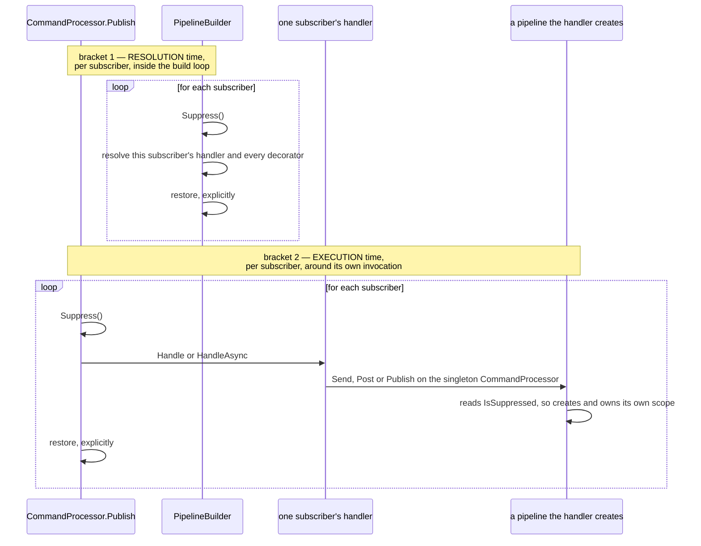
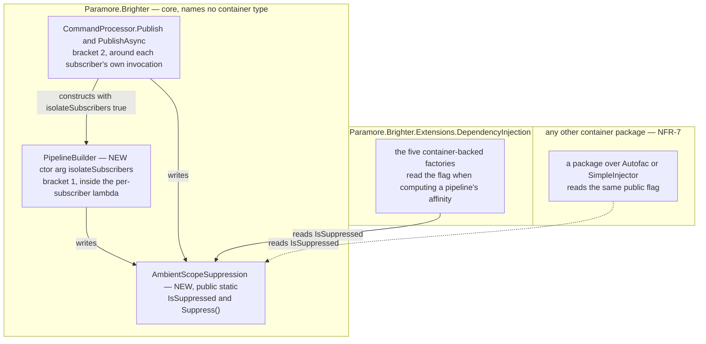

# 75. Suppressing ambient scope adoption beneath a `Publish` subscriber

Date: 2026-08-03

## Status

Proposed

## Context

ADR 0039 gives every `Publish` subscriber its own DI scope, so one subscriber's dependencies are never another's. ADR 0072 lets a pipeline adopt a DI scope the host already owns, which — left unqualified — would put every subscriber of a publish back into the caller's single scope and undo that isolation entirely.

FR-8 requires subscribers to stay isolated whatever the affinity says. What neither sibling decided is **how a subscriber turns adoption off** — not only for its own pipeline, but for the pipelines its handler creates at dispatch time, which Brighter never sees.

**Parent Requirement**: [specs/0036-scoped-lifetime-per-pipeline/requirements.md](../../specs/0036-scoped-lifetime-per-pipeline/requirements.md)

**Scope**: This ADR decides **where suppression hangs and where its brackets go**. It discharges FR-8 and FR-9, and serves FR-27.3 and NFR-4.

It does **not** decide how a pipeline discovers or adopts an ambient scope — that is ADR 0072, which owns the ladder, the hand-off role and the affinity policy. Suppression meets that ladder at exactly one line, the affinity computation, and this ADR changes nothing else about it. It does not decide the opt-in property (ADR 0076) or the package that registers an ambient source (ADR 0073), nor where any rule is validated (ADR 0074): a suppressed subscriber is correct configuration, not a fault, and nothing here is reportable.

This ADR **supersedes no prior ADR.** It protects ADR 0039's decision rather than reopening it (D0c).

### Where this ADR sits

Seven ADRs deliver the parent requirement, one decision each. This is the sixth, and the only one whose subject is a pipeline Brighter did not build.

| ADR | Decides |
| --- | --- |
| 0070 | a transform pipeline takes one DI scope, carried **as a parameter** |
| 0071 | handler pipelines converge onto the **same handle**, carried on the object they already pass |
| 0072 | how a pipeline discovers an **ambient** DI scope the host owns |
| 0073 | the **ASP.NET Core package**, and the one line an application writes to opt in |
| 0074 | **where** the six scope-configuration rules are evaluated |
| **0075** *(this one)* | how a `Publish` subscriber **suppresses** adoption, for itself and everything nested beneath it |
| 0076 | the **affinity option**, and how one setting reaches all four registration paths in any order |

The rule the first two state is **the per-pipeline object carries the DI scope**, and this ADR is the one place it does not reach: the pipeline that must be suppressed has no per-pipeline object yet, because it does not exist when the decision to suppress it is taken.

ADR 0067's `Terms` block defines the two axes used throughout — Brighter's *configured lifetime*, which governs the artefact, and the container's *registration lifetime*, which governs the dependencies — and keeps `IServiceScope`, `ServiceProviderLifetimeScope` and `IAmALifetime` distinct. This ADR does not restate it. Per NFR-8, "lifetime scope" is not used for anything introduced here.

### What a subscriber must stop, and what it cannot reach

Three kinds of pipeline come into being during one `Publish`, and they differ in the two properties that decide the mechanism: whether Brighter holds a reference to the pipeline at the moment suppression must apply, and when that moment is.

| Pipeline created during one `Publish` | Built by | Brighter holds a reference? | When |
| --- | --- | --- | --- |
| a subscriber's own handler pipeline | `PipelineBuilder`, eagerly, per subscriber | **yes** — it is building it | before any handler runs |
| a nested `Send` or `Publish` the subscriber's handler issues | `PipelineBuilder`, through the singleton `CommandProcessor`, from user code | **no** | while that handler runs |
| a transform pipeline for a `Post` the subscriber's handler issues | `TransformPipelineBuilder`, from user code | **no** | while that handler runs |

Two consequences fall straight out of the table, and together they fix the whole design.

**The mechanism cannot be an argument.** Two of the three rows are pipelines core did not build, reached through the singleton `IAmACommandProcessor` (ADR 0033) from user code that is under no obligation to forward anything. Threading a decision to them would mean a new parameter on every public dispatch method, permanently, to serve a case that arises only inside `Publish`. What the three rows *do* share is the logical flow they are created on, and that is the only thing available to name them all.

**One bracket cannot cover both moments.** Row 1 happens during the build, before any subscriber's handler runs; rows 2 and 3 happen during dispatch. A bracket placed at dispatch is too late for row 1 — every subscriber's handler and decorator has already been resolved from the caller's unsuppressed ambient. A bracket placed at build time is over before rows 2 and 3 exist. Hence FR-9's two brackets, neither substituting for the other.

### The forces

- **FR-8 is unconditional.** Every subscriber of a publish is isolated, irrespective of its configured lifetimes and irrespective of the affinity the host opted into. There is no configuration in which a subscriber is permitted to join the caller's scope, so suppression is never conditional on anything a subscriber knows about itself.
- **FR-27.3 forecloses the obvious home.** A subscriber whose pipeline has no `Scoped` participant takes no pipeline scope at all and therefore never asks the ambient source — yet it must still suppress, because a pipeline nested inside it may be `Scoped` (AC-47). Suppression cannot be an argument to, or a return value of, the ambient query.
- **The pipeline that must be suppressed is one core did not build and holds no reference to.** A nested `Send`, `Post` or `Publish` issued from inside a subscriber's `Handle`/`HandleAsync` goes through the singleton `IAmACommandProcessor` (ADR 0033) from user code. There is no argument path from the subscriber's bracket to that pipeline's scope acquisition.
- **`Publish` runs its subscribers concurrently, and the two paths differ.** `PublishAsync` starts every subscriber on the caller's flow and awaits them together; the synchronous `Publish` dispatches through `Parallel.ForEach` (`CommandProcessor.cs:481`), which captures and restores `ExecutionContext` per **worker task** rather than per body invocation — so one worker running a range of subscribers carries an `AsyncLocal` write from one body into the next. The mechanism has to be correct under both.
- **Both builds are eager and per subscriber, on the caller's own thread.** `PipelineBuilder` resolves each subscriber's handler and every decorator inside a per-subscriber lambda (`PipelineBuilder.cs:187-198`), so there is a place inside the loop where a bracket can sit — and a bracket around the loop would give every subscriber one shared scope, which is ADR 0039 undone.
- **A container package Brighter does not ship must be able to honour FR-8** (NFR-7). Per-subscriber isolation cannot be a privilege of Microsoft's container: whatever carries suppression has to be readable from an assembly Brighter has never heard of.
- **NFR-4 — nothing may be left on the caller's flow.** Once either publish returns, a `Send` or a `Post` the caller issues next must adopt exactly as it would have before the publish.
- **ADR 0039 is the decision being protected, not reopened** (D0c). Suppression exists so that adoption cannot quietly repeal a scoping decision taken three ADRs earlier.

## Decision

**A `Publish` subscriber suppresses ambient scope adoption — for its own pipeline and for every pipeline created beneath it — through a public, `AsyncLocal`-backed `AmbientScopeSuppression` flag in core, bracketed twice per subscriber: once around that subscriber's resolution inside the build loop, and once around its own `Handle`/`HandleAsync` invocation, with the restore written explicitly on both.**

The flag carries one bit along a logical flow, and it is read at exactly one place: the line where a pipeline computes the affinity it will ask the ambient source with. Everything else about adoption is ADR 0072's and is untouched. The two brackets are lexical and per subscriber; neither is ever placed around the whole loop.

### The mechanism, end to end



Three invariants are readable off the diagram, and each is load-bearing.

**Neither bracket substitutes for the other.** Bracket 1 alone leaves a nested pipeline free to adopt. Bracket 2 alone is too late — every subscriber's handler has already been resolved from the caller's unsuppressed ambient before any of them runs, which is what AC-11 and AC-12 fail on.

**Neither is ever placed around the whole loop**, which would give every subscriber one shared scope and undo ADR 0039 — the decision this ADR exists to protect.

**The restores are explicit**, on both brackets and on both publish paths, rather than inherited from `ExecutionContext`. *Implementation Approach* step 5 says why that is a statement about the code rather than a hope about `Parallel.ForEach`.

Where this meets adoption is one line. ADR 0072's protocol computes a pipeline's affinity before it asks anything, and that computation is the single point at which suppression bites:

> `affinity = AmbientScopeSuppression.IsSuppressed ? AlwaysNew : the policy over the whole participating set`

A suppressed pipeline therefore takes the path it would have taken with no provider registered at all: it creates and owns its own DI scope, exactly as today. Suppression adds no outcome to the ladder — it selects one that already exists.

### Where the pieces live



The flag is the only thing that crosses the assembly boundary, in one direction, and it names no container type — which is why it can live in core at all and why a package Brighter does not ship can honour FR-8 on the same terms as the one it does.

### Key Components

#### The roles, and what each is responsible for

| Role | Type | Stereotype | Responsibility |
| --- | --- | --- | --- |
| Suppression state | `AmbientScopeSuppression` (core) | **knowing**, with a bracketing verb | Carries one bit along a logical flow: *no pipeline created on this flow may adopt an ambient scope* |
| Resolution-time bracket | `PipelineBuilder<TRequest>` (core) | **doing** | Establishes and restores suppression around each subscriber's own artefact resolution, inside the build loop |
| Execution-time bracket | `CommandProcessor.Publish` / `PublishAsync` (core) | **doing** | Establishes and restores suppression around each subscriber's own `Handle`/`HandleAsync`, so pipelines that subscriber creates at dispatch are covered |
| Suppression reader | the five container-backed factories (DI package) | **deciding** | Read the flag at the one point a pipeline's affinity is computed, and take the created-and-owned path when it is set |

`AmbientScopeSuppression` is deliberately **not** a role — it is a static holder, not an interface anyone is handed. That is a decision rather than an omission: an injected role would have to reach the same two dispatch methods and the same builder, none of which is resolved from a container, and it would not be readable by the third-party container package NFR-7 requires. The cost of the shape is under *Technology Choices* and again under *Consequences*.

#### `AmbientScopeSuppression` — where suppression hangs (new, core, public, static)

```csharp
namespace Paramore.Brighter
{
    /// <summary>
    /// Suppresses ambient scope adoption for the current logical flow and every flow started from
    /// it. A pipeline created while suppression is in force creates and owns its own DI scope,
    /// whatever the configured affinity. Established by Brighter around each Publish subscriber's
    /// resolution and around its execution; public so that a host, or a container package Brighter
    /// does not ship, can honour the same rule.
    /// </summary>
    public static class AmbientScopeSuppression
    {
        public static bool IsSuppressed { get; }
        public static IDisposable Suppress();
    }
}
```

**Contract.**

| Member | Input | Output | Error conditions |
| --- | --- | --- | --- |
| `IsSuppressed` | none | `true` when a suppression bracket is in force on this flow | Cannot throw. A reader outside any bracket sees `false` |
| `Suppress()` | none | a bracket that restores the value it captured when disposed, so lexically nested brackets nest correctly | Cannot throw. Disposing a bracket twice is a no-op. Disposing brackets **out of order** restores the outer bracket's captured value while an inner one is still live, which can clear suppression early; Brighter's own brackets are lexical and always disposed innermost-first, so this is reachable only from a caller of the public mutator. Failing to dispose leaves the flow suppressed for the rest of its life |

Backed by `AsyncLocal<bool>`. Core writes it; the container package reads it. It is **public for both read and write**, deliberately, and the cost is recorded in *Consequences*.

The two failure directions are not symmetric, and that asymmetry is why the shape is acceptable. A bracket that is leaked or never disposed leaves suppression *on*, which produces today's create-and-own behaviour — never unintended sharing of a caller's scope. Only out-of-order disposal by a caller of the public API can clear it early, and no Brighter code path does that.

#### Where each type is touched

| Assembly | Type | Change |
| --- | --- | --- |
| `Paramore.Brighter` | `AmbientScopeSuppression` | **new** |
| `Paramore.Brighter` | `PipelineBuilder<TRequest>` | a defaulted constructor argument `bool isolateSubscribers = false` on the two dispatch constructors (`:59`, `:76`), and the resolution-time bracket inside both build-loop bodies (`:187-198` sync, `:232-244` async) |
| `Paramore.Brighter` | `CommandProcessor` | `Publish` (`:472`) and `PublishAsync` (`:575`) construct the builder with `isolateSubscribers: true`; the execution-time bracket around `Handle` inside the `Parallel.ForEach` body (`:481`) and around the `HandleAsync` **invocation** inside the start loop (`:596`) |
| `…DependencyInjection` | the five container-backed factories | one read of `IsSuppressed` at the affinity computation, specified by ADR 0072 |

Unchanged, and named so the omission is not read as an oversight: the describe-only `PipelineBuilder` constructor (`:92`), which serves validation and diagnostics and builds nothing that could adopt; `PipelineBuilder.Dispose()` (`:269-270`), so D10's release timing is preserved by construction; `Send` (`:317`) and `SendAsync` (`:394`), which construct the builder with the default and therefore never suppress (FR-27.3, AC-47's first branch); the two validation-time construction sites (`BrighterPipelineValidationExtensions.cs:75`, `:116`), likewise; `IAmAPipelineBuilder<TRequest>` and `IAmAnAsyncPipelineBuilder<TRequest>`, whose signatures do not change; every interface ADRs 0070 and 0071 changed; `RequestContext`; and the pump, which publishes nothing ambient and takes no bracket (D0b, C-2).

### Technology Choices

**Why suppression is ambient state, when ADR 0070 removed all of it.** ADR 0070 rejected an `AsyncLocal` carrying a *scope*, and rightly: a scope is a resource with an owner and an end, invisible coupling around it means FR-5's failed-build release has nowhere to live, and it is not implementable over a non-Microsoft container. Suppression is a different kind of thing. It carries one bit, owns no resource, needs no end beyond its own lexical bracket, and can be honoured by any container package because it names nothing container-specific. And it has no alternative: two of the three pipelines it must reach are ones core did not build and holds no reference to. It is the only ambient mechanism in the design, and it is the only part of the design with no parameter path available to it.

**Why the holder is public for read *and* write.** It must be public rather than `internal` plus `InternalsVisibleTo` because a container package Brighter does not ship must be able to honour FR-8 too (NFR-7) — an `internal` flag would make per-subscriber isolation a privilege of Microsoft's container. Once it is public to read, making `Suppress()` public as well costs little and buys something real: a host, or a third-party integration, can suppress adoption around its own work — a background job started from a request whose `HttpContext` still flows, for instance — without waiting for a Brighter release. The honest cost is stated in *Consequences*: FR-8 becomes an invariant core **asserts** rather than one no caller can defeat.

**Why a constructor argument on `PipelineBuilder` rather than a parameter on `Build`.** Whether subscribers are isolated is a property of the *call site*, not of a build: a builder constructed by `Publish` always isolates and one constructed by `Send` never does. The builder is already constructed per call site, so those sites are the natural place to say which kind of build this is — and a parameter on `Build`/`BuildAsync` would put a flag on `IAmAPipelineBuilder<TRequest>` and `IAmAnAsyncPipelineBuilder<TRequest>`, which are both `internal` (`IAmAPipelineBuilder.cs:36`, `IAmAnAsyncPipelineBuilder.cs:37`) and both otherwise untouched by this work.

**And the class chosen instead is itself public, so this is a break.** `PipelineBuilder<TRequest>` is `public` (`PipelineBuilder.cs:37`) and so are all three of its constructors (`:59`, `:76`, `:92`), so adding a defaulted parameter to two of them is source-compatible but **binary-breaking**: a default argument is compiled into the call site, so an already-built assembly binds to a constructor that no longer exists. An added *overload* carrying the flag would avoid it, and is rejected for what it leaves behind — two constructors per dispatch shape, differing by one boolean, with nothing in either signature saying which a caller should pick, and the old one remaining the one a reader finds first. The break is real and small, it is the same kind of break the eight interface signatures of ADRs 0070 and 0071 already carry into this release, and it goes in the same `release_notes.md` entry (ADR 0070 step 7a, AC-24).

**Why the bracket goes inside the per-subscriber lambda and not around the loop.** Around the loop, every subscriber would resolve under one suppression bracket — which is correct — but the same placement is the one that tempts a reader into giving the whole loop one pipeline scope, and ADR 0039 requires one per subscriber. Inside the lambda the bracket has exactly the extent of one subscriber's resolution, which is the unit FR-8 is written over, and it reads the same way as the execution-time bracket.

### Implementation Approach

**1. The core type.** Add `AmbientScopeSuppression` to `src/Paramore.Brighter/`, backed by a private `static readonly AsyncLocal<bool>`. `Suppress()` captures the current value, sets `true`, and returns a bracket whose `Dispose` restores the captured value and is idempotent. It names no container type, so the source-level guard AC-22.3 runs returns nothing new.

**2. `PipelineBuilder` learns which kind of build it is.** Add a defaulted `bool isolateSubscribers = false` to the two dispatch constructors (`:59` sync, `:76` async). The describe-only constructor (`:92`) does not take it — it resolves nothing and can adopt nothing. `CommandProcessor.Publish` (`:472`) and `PublishAsync` (`:575`) pass `true`; `Send` (`:317`), `SendAsync` (`:394`) and the two validation-time construction sites (`BrighterPipelineValidationExtensions.cs:75`, `:116`) keep the default, so a `Send` never suppresses.

**3. Bracket 1 — resolution time, per subscriber, inside the build loop.** In both twins the per-subscriber lambda is `observerTypes.Each(observer => { … })` — `Build` at `:187-198`, `BuildAsync` at `:232-244`. When `isolateSubscribers` is set, the bracket wraps the body of that lambda: the `GetSyncInstanceScope()` / `GetAsyncInstanceScope()` call, the handler `Create`, and `BuildPipeline` / `BuildAsyncPipeline` with the decorator resolution inside it. That is where the subscriber's artefacts and their container-`Scoped` dependencies are actually resolved.

**4. Bracket 2 — execution time, around that subscriber's own invocation.** The twins differ and must be written differently.

- **Sync `Publish`** — inside the `Parallel.ForEach` body (`:481`), around `handleRequests.Handle(@event)`, restored on every exit path of the body.
- **Async `PublishAsync`** — around the **invocation** of `handleRequests.HandleAsync(@event, cancellationToken)` inside the start loop (`:596`), never around `Task.WhenAll` (`:601`). The bracket is live when the async method is called, so the `ExecutionContext` its state machine captures carries suppression into every continuation; disposing the bracket immediately afterwards restores the **caller's** flow without touching the running task's, because an `AsyncLocal` write in one flow does not propagate back to a flow that has already branched. Bracketing `Task.WhenAll` instead would suppress nothing during the synchronous prefix of each handler and would leave the caller's flow suppressed for the duration of the publish.

This bracket is what AC-47's second branch needs: a subscriber whose own pipeline has no `Scoped` participant takes no pipeline scope and asks nothing, yet a `Post` its handler issues at dispatch time must not adopt.

**5. Why the cross-subscriber leak on the synchronous path is not observable.** `Parallel.ForEach` partitions the source and gives each worker task a range; `ExecutionContext` is captured and restored per **worker task**, not per body invocation. So an `AsyncLocal` write in subscriber 1's body is still current when the same worker calls the body for subscriber 2. That leak is real and the design does not assume it away — it is bounded and unobservable, for three reasons that have to hold together:

- **Every subscriber must be suppressed anyway.** FR-8 makes suppression unconditional for every subscriber of a publish, irrespective of its lifetimes. A leaked `true` sets exactly the value subscriber 2's own bracket sets one instruction later. There is no state a subscriber body needs in which `IsSuppressed` is `false`, so no observation can distinguish a leaking implementation from a correct one — which is why no Acceptance Criterion asserts against it, and why AC-39 says so explicitly.
- **The only alternative reading is foreclosed.** OOS-14 denies that a nested pipeline ever re-enters its parent subscriber's scope, so "subscriber 2 should have seen its own suppression rather than subscriber 1's" is not a distinction with an observable behind it — both mean *create your own scope*.
- **The leak cannot escape the publish.** A worker task ends when the `Parallel.ForEach` ends, and the thread pool restores a fresh `ExecutionContext` per work item, so nothing survives onto unrelated work. The one place a leak *is* observable is the caller's own flow — `Parallel.ForEach` may inline bodies on the calling thread, and the build loop runs on the calling thread throughout — and that is precisely what the **explicit** restore on both brackets prevents, and what AC-12's and AC-39's final clauses detect: a `Send` and a `Post` issued by the controller after the publish returns must resolve from the request scope.

The conclusion is that the restore must be explicit rather than inherited from `ExecutionContext`, on both brackets and on both publish paths. That is a statement about *why* the code is written the way it is, not a hope about how `Parallel.ForEach` behaves.

**6. Where this meets adoption.** ADR 0072's `CreatePipelineScope()` protocol reads `IsSuppressed` once, at the line that computes the pipeline's affinity, and substitutes `AlwaysNew` when it is set. Nothing else in that protocol changes, no outcome is added to its ladder, and no diagnostic is emitted — a suppressed pipeline is indistinguishable from one in a host that registered no ambient source, which is the behaviour that already exists.

## Consequences

### Positive

- **ADR 0039's per-subscriber isolation survives adoption.** A feature that would otherwise have quietly repealed a scoping decision taken three ADRs earlier is bounded by one bit, and the boundary is written where the decision it protects lives.
- **The unreachable pipelines are reached.** A nested `Send`, `Post` or `Publish` issued from user code inside a subscriber's handler is suppressed without any signature change to `IAmACommandProcessor`, which is the only mechanism available for a pipeline core did not build (ADR 0033, C-5).
- **Suppression costs nothing when nothing is published.** `IsSuppressed` is one `AsyncLocal` read per pipeline that takes a pipeline scope, and no bracket is ever established outside a publish.
- **The failure direction is toward isolation.** A leaked or undisposed bracket produces today's create-and-own behaviour, never unintended sharing of a caller's scope.
- **A container package Brighter does not ship can honour FR-8** on exactly the same terms as the one it does, because the flag is public and names nothing container-specific (NFR-7).
- **Core stays container-agnostic** (ADR 0014). The one new core type names no container type, and the source-level guard AC-22.3 runs finds nothing new.
- **Release timing is unchanged.** `PipelineBuilder.Dispose()` (`:269-270`) still drains every subscriber's scope together at end of publish; nothing here tightens it (D10, AC-10).

### Negative

- **Core gains a public static with a public mutator.** `AmbientScopeSuppression.Suppress()` is callable by anyone, so FR-8's per-subscriber isolation becomes an invariant core **asserts** rather than one no caller can defeat. A caller who takes a bracket and leaks it suppresses adoption for the rest of that logical flow, and nothing detects it; a caller who disposes brackets out of order can clear suppression while an inner bracket is still live. Neither is reachable from Brighter's own code, and the leaked-bracket direction is benign — but they are real properties of a public mutator, not hypotheticals.
- **The design is no longer free of per-flow state.** ADR 0070 removed all of it and listed "no hidden state" as a positive; this ADR puts one bit back. It is one bit rather than a resource, its brackets are lexical, and its failure mode is benign — but a reader now has `ExecutionContext` semantics to hold in mind on the `Publish` paths, and the synchronous path's `Parallel.ForEach` behaviour has to be understood to see why the restore is explicit.
- **Two construction sites in `CommandProcessor` gain an argument**, and the meaning of a `PipelineBuilder` now depends on a boolean set at construction. A reader of `Build` has to look at the constructor to know whether subscribers are isolated.
- **`PipelineBuilder<TRequest>` is a public type and the two constructors that change are public.** The two call sites inside `CommandProcessor` are the only ones in this repository, but the change is source-compatible and **binary-breaking** for any assembly compiled against the three-argument signature and not rebuilt, because a default argument is baked into the call site. That is a break on public surface, not an internal edit, and it belongs in the same `release_notes.md` entry as the interface breaks (ADR 0070 step 7a, AC-24). The alternative — an added overload rather than a defaulted parameter — was declined in *Technology Choices*.
- **Two brackets are two places to get wrong**, and they are in different files with different shapes — one inside a lambda in `PipelineBuilder`, one inside a `Parallel.ForEach` body and one inside an async start loop in `CommandProcessor`. Neither is redundant, so neither covers for a mistake in the other.
- **In-process `Publish` subscribers still cannot join a caller's transaction**, and under D6 neither can pipelines nested inside them. That is FR-8 working as specified rather than a defect, but it is the limitation applications most often expect not to exist, and the outbox is the answer (C-4). It has to be stated plainly in `docs/guides/lifetimes-and-scoping.md` (FR-25.5).

### Risks and Mitigations

| Risk | Mitigation |
| --- | --- |
| Suppression leaks past `Publish` and a later `Send` or `Post` in the same request silently fails to adopt | Both brackets restore explicitly on every exit path — normal return, exception, cancellation — rather than relying on `ExecutionContext`. AC-12 and AC-39 each assert a `Send` **and** a `Post` from the controller after the publish resolving from the request scope; those are the clauses that can actually fail |
| A subscriber's handler is resolved before suppression is established, so it adopts the caller's ambient | The resolution-time bracket is inside the per-subscriber lambda in both build loops, around the `Create` and the decorator resolution — not around the loop, and not at dispatch. AC-11 and AC-12 fail on an execution-time bracket alone, by construction |
| The two brackets drift apart as the publish paths change | They are specified against the same unit — one subscriber — and both are asserted by the same criteria. AC-47's two branches exercise a subscriber that takes a pipeline scope and one that does not, so a bracket removed from either path fails a test rather than degrading quietly |
| A third-party container package ignores the flag and adopts anyway | Nothing prevents it, and the ADR says so. The flag is a contract a package honours, not a gate Brighter enforces — the same trade NFR-7 makes everywhere else in this design |
| An application takes a bracket of its own and never disposes it | Adoption stops for that flow and the application silently gets today's behaviour. Documented under FR-25, and the direction is toward isolation rather than sharing |

## Alternatives Considered

**1. Do nothing — let subscribers adopt.** Suppression exists only because ADR 0072 exists; without adoption there is nothing to suppress. **Rejected by FR-8, and it is worth saying what doing nothing would cost:** every subscriber of a publish would resolve from the caller's request scope, so ADR 0039's per-subscriber isolation would be repealed by a feature that never mentions it, and a subscriber would appear to join the caller's transaction while the outbox — the actual answer (C-4) — went unused. The failure would be silent and would only show under concurrency.

**2. Suppression as an argument to, or a return value of, the ambient query.** `GetAmbient(affinity, isSubscriber)`, or an ambient object that carries "and suppress beneath me". **Rejected by FR-27.3, precisely.** A `Publish` subscriber whose pipeline has **no `Scoped` participating factory** takes no pipeline scope under FR-27.1 and therefore never calls the ambient query at all — yet it must still suppress, because a pipeline nested inside it may be `Scoped`. AC-47's second branch is exactly that configuration and is unsatisfiable by any mechanism that lives on the ambient query. The same argument kills making suppression a third `ScopeAffinity` value: affinity is a property of a pipeline that is taking a scope, and suppression is a property of a subscriber whether or not it takes one.

**3. Suppression as `internal` plus `InternalsVisibleTo`.** Keeps the flag out of core's public surface and makes FR-8 undefeatable by user code. **Rejected.** `InternalsVisibleTo` would have to name every container package that must honour FR-8, which is a list Brighter does not control: NFR-7 requires the seam to be implementable over Autofac or SimpleInjector from an assembly Brighter has never heard of, and such a package cannot honour per-subscriber isolation if it cannot read the flag. Public read alone was considered and is the narrower option, but it makes the type asymmetric — readable by anyone, writable only by Brighter — for a guarantee that a leaked bracket already breaks from inside. The public write is a deliberate trade, recorded in *Consequences* rather than argued away.

**4. Reuse `RequestContext` to carry suppression.** `RequestContext.Bag` (`RequestContext.cs:61`) already carries application state across the pipeline, so a subscriber could set a key in its own copy. **Rejected — it cannot reach.** The pipelines suppression must reach are those a subscriber's handler creates by calling `Send`, `Post` or `Publish` on the singleton `CommandProcessor`, and those calls take an *optional* `RequestContext` that user code is under no obligation to pass — where it is omitted, `InitRequestContext` makes a fresh one. Suppression would then hold only for handlers that happened to forward the context, making FR-8 a documentation request rather than an invariant. `PipelineBuilder` also copies the context per subscriber, so the resolution-time bracket would be reasoning about which copy it is writing to. `RequestContext` carries application state along a request; suppression is a property of the flow, and the flow is what `AsyncLocal` names.

**5. One bracket around the whole build loop, and one around the whole dispatch.** Two brackets instead of two per subscriber, and much less code. **Rejected on both halves.** Around the build loop it is *behaviourally* adequate — every subscriber resolves suppressed either way — but it is the placement that invites giving the whole loop one pipeline scope, which is ADR 0039 undone, and it no longer has the extent of the unit FR-8 is written over. Around the dispatch it is wrong outright on the async path: a bracket around `Task.WhenAll` (`CommandProcessor.cs:601`) is established *after* every handler's synchronous prefix has already run, and leaves the caller's own flow suppressed for the duration of the publish, which is what AC-12's final clause detects.

## References

- Requirements: [specs/0036-scoped-lifetime-per-pipeline/requirements.md](../../specs/0036-scoped-lifetime-per-pipeline/requirements.md) — FR-8, FR-9, FR-25.5, FR-27.1, FR-27.3, NFR-4, NFR-7, NFR-8, C-2, C-4, C-5, C-13, D0b, D0c, D6, D10, D16, OOS-14
- Related ADRs (cited by slug — ADR numbers are not unique in this repo, C-16):
  - `0072-ambient-scope-adoption-seam` [Proposed] — how a pipeline discovers and adopts an ambient DI scope. Its affinity computation is the one line this ADR's flag is read at, and its ladder is unchanged by suppression
  - `0070-per-pipeline-di-scope-for-mapper-and-transform-factories` [Proposed] — the transform pipeline takes one DI scope, carried as a parameter; it removed all per-flow state from the design, and *Technology Choices* says why this ADR puts one bit back
  - `0071-pipeline-scope-handle-for-handler-pipelines` [Proposed] — handler pipelines converge onto the same handle, which is why a subscriber's pipeline has one place to be suppressed rather than two
  - `0039-scoping-dependencies-inline-with-lifetime-scope` [Proposed] — a DI scope per registered subscriber on `Publish`; the decision this ADR exists to protect, not reopened (D0c)
  - `0033-lifetime-of-command-processor-and-mediator` [Proposed] — the `CommandProcessor` is a singleton, which is why a nested pipeline cannot be reached by an argument; not reopened (C-5)
  - `0014-di-friendly-framework` [Accepted] — per-family factory interfaces rather than abstracting an IoC container; the durable reason the flag names no container type and is public
  - `0067-per-resolution-di-scope-for-transient-factory-instances` [Accepted] — its `Terms` block defines the configured-lifetime and registration-lifetime axes this ADR uses and does not restate
- External references:
  - [`AsyncLocal<T>` and `ExecutionContext` flow](https://learn.microsoft.com/en-us/dotnet/api/system.threading.asynclocal-1) — the flow semantics both brackets rely on
  - [`Parallel.ForEach` — partitioning and per-worker execution](https://learn.microsoft.com/en-us/dotnet/api/system.threading.tasks.parallel.foreach) — why `ExecutionContext` is restored per worker task rather than per body invocation, and therefore why the restore is explicit
