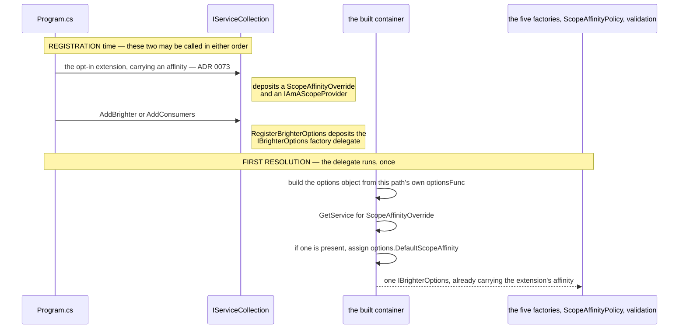
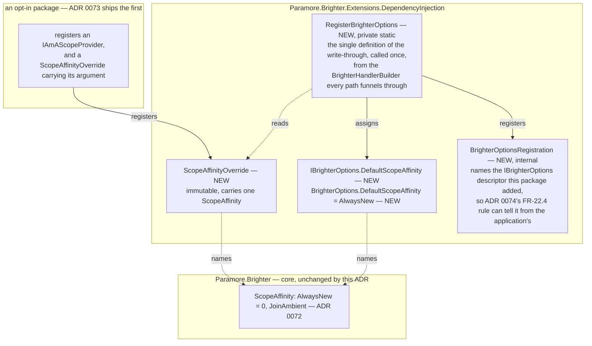
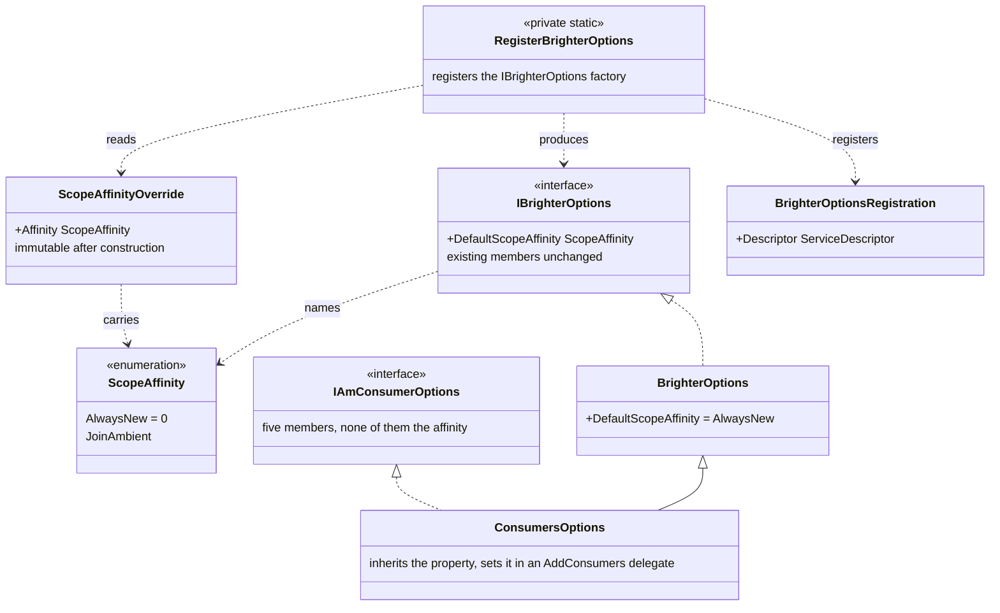

# 76. The affinity option, and how one setting reaches all four registration paths in any order

Date: 2026-08-03

## Status

Proposed

## Context

An application has no way to say that it wants Brighter's pipelines to join the DI scope its host already owns. There is no setting to turn on. A package that ships an opt-in gesture has no way to make one take effect, because Brighter reads its configuration from an object that is built four different ways, and three of those ways produce nothing at all at the moment the gesture is made.

ADR 0072 built the machinery that consumes such a setting: a pipeline asks an `IAmAScopeProvider` once, carrying a `ScopeAffinity` computed from `IBrighterOptions`, and then either borrows the scope it is offered or creates its own as today. Everything in that machinery is settled except its input. **Nothing yet puts a `ScopeAffinity` on `IBrighterOptions`.** The hard half of supplying one is not the property. It is delivering a value to an object that four registration paths produce differently, in whatever order an application calls them, from a package that knows about none of them.

### Scope

**Parent requirement**: [specs/0036-scoped-lifetime-per-pipeline/requirements.md](../../specs/0036-scoped-lifetime-per-pipeline/requirements.md)

This ADR decides two things: **the opt-in property on `IBrighterOptions`, and the mechanism that carries an opt-in gesture's affinity argument to the object `IBrighterOptions` resolves to, on every registration path and in every order.**

**In scope.** Each item below is discharged here by the named mechanism.

- **FR-14 — one flag governs scope affinity for both pipeline kinds.** `IBrighterOptions` and `BrighterOptions` gain `ScopeAffinity DefaultScopeAffinity`, a plain non-nullable property with no "unset" value. The guards are **AC-45** and **AC-48**.
- **FR-15's normative clause — the default affinity is `AlwaysNew`.** `BrighterOptions.DefaultScopeAffinity` initialises to `ScopeAffinity.AlwaysNew`, so an application that changes nothing behaves exactly as it does today. **ADR 0073 discharges FR-15's package-inertness half** and names this clause as belonging here. The guard is **AC-45**.
- **The write-through half of FR-17 — an opt-in gesture's argument reaches whichever options object a registration path produces, and wins.** The gesture registers an immutable `ScopeAffinityOverride`; `RegisterBrighterOptions` reads that override inside the factory that produces the options object; D18's precedence follows from where the read happens. The guards are **AC-45**, **AC-48** and **AC-50**. **FR-17's registration gesture is ADR 0073's**, and the evaluation site of **FR-17's repeated-call rule is ADR 0074's**.
- **Untagged scope: the record that tells Brighter's `IBrighterOptions` registration from an application's.** `BrighterOptionsRegistration` names the descriptor this package added. No requirement asks for the type by name. FR-22.4 asks the question it answers, and ADR 0074 evaluates the rule.

It serves FR-16, FR-18, FR-19, FR-20, FR-21, FR-22, FR-23, FR-25.11, NFR-1, NFR-4 and NFR-7. Each of those is discharged elsewhere, by the mechanism that makes it true: FR-16, FR-18, FR-19 and FR-23 by ADR 0072, and FR-20 by ADR 0070.

**Contributed to here, discharged elsewhere.** Two requirements are worth separating out, because a reader auditing coverage should land on the mechanism rather than on the option.

- **FR-19 — the flag is inert on the consumer side.** The mechanism is the pump publishing no per-message ambient (D0b, C-2, **ADR 0072**). What this ADR contributes is that `ConsumersOptions` inherits the property and can set it, so the inertness is a property of a flag that was *set* rather than of one nobody could reach. It also contributes the documentation obligation FR-25.11 places on the guidance page.
- **FR-21 — affinity applies to `Scoped` only.** The mechanism is **ADR 0072's** `ScopeAffinityPolicy` and the five container-backed factories. What this ADR contributes is the property they read and its `AlwaysNew` default.

**Out of scope.**

- **The ASP.NET package, the registration extension that is the opt-in gesture, and that extension's name and signature — ADR 0073's.** That ADR is this mechanism's first caller.
- **Where FR-22's validation rules are evaluated — ADR 0074's.**
- **The adoption seam itself — ADR 0072's**, the transform-pipeline scope — **ADR 0070's**, and handler-pipeline convergence — **ADR 0071's**. None of the three is reopened here.
- **Lifetimes and validation rules.** This ADR changes no lifetime and adds no validation rule.

This ADR **supersedes no prior ADR.** It completes the 0070–0072 sequence on the configuration side.

### Where this ADR sits

Seven ADRs deliver the parent requirement, one decision each; the requirements constrain observable behaviour only and hand how it is implemented to design (C-13). This is the seventh, and the only one whose whole subject is a single value arriving intact.

| ADR | Decides |
| --- | --- |
| 0070 | a transform pipeline takes one DI scope, carried **as a parameter** |
| 0071 | handler pipelines converge onto the **same handle**, carried on the object they already pass |
| 0072 | how a pipeline discovers an **ambient** DI scope the host owns |
| 0073 | the **ASP.NET Core package**, and the one line an application writes to opt in |
| 0074 | **where** the six scope-configuration rules are evaluated |
| 0075 | how a `Publish` subscriber and the consumer pump **suppress** adoption, for themselves and every pipeline created beneath them |
| **0076** *(this one)* | the **affinity option**, and how one setting reaches all four registration paths in any order |

The rule the first two state is **the per-pipeline object carries the DI scope**. This ADR does not touch that object. It decides only what a pipeline's affinity *is* before ADR 0072's seam consults it. From an application's side the whole of the opt-in is one line in `Program.cs` (ADR 0073), and the work here is making that line land on four registration paths that behave differently and can be called in any order.

ADR 0067's `Terms` block defines the two axes used throughout — Brighter's *configured lifetime*, which governs the artefact, and the container's *registration lifetime*, which governs the dependencies. This ADR does not restate it. Per NFR-8, "lifetime scope" is not used for anything introduced here.

### The four registration paths, and what each does with `IBrighterOptions`

There is no `AddServiceActivator`; the consumer entry point is `AddConsumers`. All four entry points route through `ServiceCollectionExtensions.BrighterHandlerBuilder`, which registers `IAmACommandProcessor`, so each one alone is a complete Brighter host.

| Entry point | `IBrighterOptions` registration | Registration form | Runs `IOptions`? |
| --- | --- | --- | --- |
| `AddBrighter(Action<BrighterOptions>)` (`Extensions.DependencyInjection/ServiceCollectionExtensions.cs:61`) | `:74` | factory delegate over `IOptions<BrighterOptions>.Value` | **yes** — `AddOptions<BrighterOptions>()` `:69`, `Configure(configure)` `:71` |
| `AddBrighter(Func<IServiceProvider, BrighterOptions>)` (`:88`) | `:97` | factory delegate — the application's own `Func` | no |
| `AddConsumers(Action<ConsumersOptions>)` (`ServiceActivator.Extensions.DependencyInjection/ServiceCollectionExtensions.cs:29`) | `:38` | **a pre-built instance** — `new ConsumersOptions()` `:36`, `configure?.Invoke(options)` `:37` | no |
| `AddConsumers(Func<IServiceProvider, ConsumersOptions>)` (`:78`) | `:88` | factory delegate — the application's own `Func` | no |

Four sites, in two assemblies, and every one of them uses `TryAddSingleton`. In a mixed producer-plus-consumer host the **first** registration wins (C-12). Three consequences follow, and all three are load-bearing here.

- A `services.Configure<BrighterOptions>(...)` contributed by a later package reaches the object the factories read on **one** path. On the other three it reaches nothing at all, because those three run no `IOptions` pipeline (C-12a). An opt-in built that way fails **silently and totally** on three of the four.
- `ConsumersOptions : BrighterOptions` (`ConsumersOptions.cs:10`). The `IOptions` machinery keys on the closed generic type, so a `PostConfigure<BrighterOptions>` would not reach a `ConsumersOptions` even on a consumer path that did run an options pipeline.
- Whichever registration wins the `TryAdd` produces the object every reader sees: the five container-backed factories, ADR 0072's `ScopeAffinityPolicy`, and ADR 0074's validation. The affinity must therefore be applied at **every** one of the four sites, not at the one an ADR author happens to be looking at.

### The forces

- **AC-45 asserts the value on the *resolved* `IBrighterOptions`, on all four paths.** It does not assert it on `IOptions<BrighterOptions>.Value`, which C-12a shows is a different object on three of them. Its **third** clause starts each host from a **non-default** affinity and then passes the opposite value to the extension, so an implementation that silently drops the argument fails the clause. AC-45 says nothing about where the extension call sits relative to the Brighter registration; AC-48 pins that, and the risk table records what each of the two criteria buys.
- **AC-48 forbids an ordering rule in as many words**: *"the same holds with the extension call placed before `AddBrighter` as well as after it — the rule is not an ordering rule (C-10)."* Any mechanism that needs the opt-in gesture to run after the Brighter registration is disqualified by that clause alone.
- **D13 fixes the argument and D18 fixes precedence.** The opt-in extension takes the affinity as an explicit argument defaulting to `JoinAmbient` (ADR 0073). The argument **is** the value, and it wins unconditionally. An application opts out by passing `AlwaysNew`, or by not calling the extension.
- **No sentinel, and none may be introduced** (FR-17). The option stays a plain non-nullable value (FR-14). One consequence follows directly: "the application assigned `AlwaysNew`" and "the application left the default" are indistinguishable. That is why assigning the option alongside the extension is a **documented** configuration error (FR-25.11) rather than a validated one.
- **D2 — one flag governs both pipeline kinds.** There is no way to opt handler pipelines in and transform pipelines out.
- **D5 and FR-21 — affinity applies to `Scoped` only.** `Transient` and `Singleton` are unaffected under either setting. An inert opt-in is validated, never inferred and never silently corrected; *where* it is validated is ADR 0074's.
- **NFR-7 — a package Brighter does not ship must be able to use the mechanism.** ADR 0073's ASP.NET extension is the first caller. An `AsyncLocal`-backed provider for console hosts must be able to be the second, with no privileged access.

## Decision

**The opt-in gesture does not write the affinity onto the options object. It deposits the value in the service collection, and the one place that does hold the options object — the factory that produces it — picks the value up.**

That decision takes two parts. The options interface gains an affinity property whose default is exactly today's behaviour, so no existing host changes. The four registration sites that produce the options object are brought onto one shared definition of that production, so the deposited value is picked up on every path. Because the pick-up happens inside the producer, it necessarily runs after every application-supplied options delegate — which is what makes the rule hold in any registration order, without an ordering rule. The names and signatures are under *Key Components*.

### The mechanism, end to end

The deposit and the pick-up happen at two different moments, so there is no ordering to get right.



Two invariants are readable off that diagram, and the design rests on both.

**The extension writes last, because it writes from inside.** The assignment happens inside the producer, so it runs after every application-supplied delegate has contributed: after `Configure` on the `IOptions` path, after `configure.Invoke(options)` on the consumer `Action` path, and after the application's `Func` has returned on both `Func` paths. D18 is satisfied by construction rather than by an ordering rule.

**The deposit needs no options object to exist.** An opt-in gesture in a leaf package would otherwise have to set a value on an object that exists at registration time on only **one** of the four paths — `AddConsumers(Action<ConsumersOptions>)`, which constructs it at `:36`. On the other three the object does not exist yet and will not until the container is built.

All four entry points funnel through the same definition, which is what makes the rule true on every path rather than on the one an author happened to be looking at:


### Where the pieces live



The dependency direction is fixed, and it is the whole of NFR-2: an opt-in package depends on the DI package, the DI package depends on core, and neither of the lower two ever depends upward.

### Key Components

#### The roles, and what each is responsible for

| Role | Type | Responsibilities | Responsibility classifier | Collaborators |
| --- | --- | --- | --- | --- |
| The affinity override | `ScopeAffinityOverride` (DI package) | Carries one value — the affinity the opt-in gesture selected. It decides nothing and does nothing. It exists so that the value has a type and a place to sit in the collection | knowing | `ScopeAffinity` (core); the opt-in package that registers it; `RegisterBrighterOptions`, which reads it; ADR 0074's validation, which reads its descriptor |
| The options object | `BrighterOptions` / `ConsumersOptions` behind `IBrighterOptions` | Holds the configuration every reader takes: the five container-backed factories, `ScopeAffinityPolicy` (ADR 0072), and validation (ADR 0074) | knowing | `ScopeAffinity`; `RegisterBrighterOptions`, which produces it and assigns the affinity onto it; its five readers |
| The options registration | `RegisterBrighterOptions` (DI package) | Produces the options object the calling path supplied. Applies the override to that object before any reader can see it. Records which `IBrighterOptions` descriptor is Brighter's own | doing | `BrighterHandlerBuilder`, its one caller; the calling path's `optionsFunc`; `ScopeAffinityOverride`; `BrighterOptionsRegistration` |
| The registration record | `BrighterOptionsRegistration` (DI package) | Names the `IBrighterOptions` descriptor this package added, and nothing else. It exists so that ADR 0074's FR-22.4 rule can ask whether the descriptor the container will resolve is Brighter's own — without resolving anything, and without comparing affinity values | knowing | `RegisterBrighterOptions`, its only writer; ADR 0074's validator, its only reader; the `ServiceDescriptor` it names |

The division that matters is between the **override** and the **options object**. The override knows what the application asked for. The options object is what every reader reads. Keeping them as two roles rather than one is what makes the mechanism order-independent: the override can be registered before the options object exists, because the override is not the options object.

#### The types this ADR adds, and the one it changes



Two edges in that diagram carry an argument each. `ConsumersOptions` inherits from `BrighterOptions`, which is why the property needs no separate work on the consumer paths — and, in the opposite direction, why `PostConfigure<BrighterOptions>` cannot reach a `ConsumersOptions` (alternative 4). `IAmConsumerOptions` does not extend `IBrighterOptions`, which is why the residue described further down cannot be observed through that interface.

#### The opt-in property (change, DI package, public)

```csharp
namespace Paramore.Brighter.Extensions.DependencyInjection
{
    public class BrighterOptions : IBrighterOptions
    {
        /// <summary>
        /// Selects whether a Scoped pipeline creates its own DI scope or joins an ambient DI scope the
        /// host already owns, where an ambient source offers one. Applies to Scoped handlers, mappers
        /// and transforms only: Transient and Singleton are unaffected under either setting (FR-21).
        /// Defaults to AlwaysNew, which is exactly today's behaviour.
        /// </summary>
        public ScopeAffinity DefaultScopeAffinity { get; set; } = ScopeAffinity.AlwaysNew;

        // ...existing members unchanged
    }

    public interface IBrighterOptions
    {
        ScopeAffinity DefaultScopeAffinity { get; set; }

        // ...existing members unchanged
    }
}
```

**Contract.**

| Member | Input | Output | Error conditions |
| --- | --- | --- | --- |
| `DefaultScopeAffinity` | a `ScopeAffinity`; the property is non-nullable and has no "unset" value (FR-14, FR-17) | the affinity every pipeline in this host starts from, before `ScopeAffinityPolicy` narrows it over the participating set (FR-27.2) and before `Publish` suppression forces `AlwaysNew` (FR-8) | Cannot throw. An out-of-range enum value — a cast integer, which a plain non-nullable enum property on a public options surface cannot prevent — degrades to `AlwaysNew`. That degradation is an **obligation this ADR places on ADR 0072**, not an accident of an implementation: every reader of a `ScopeAffinity` tests for `JoinAmbient` positively, rather than testing for `AlwaysNew` and treating everything else as adoption, so an unrecognised value fails safe. ADR 0072 states the same rule on `ScopeAffinityPolicy`'s contract. Setting this property while also calling the registration extension is a configuration error whose outcome is the extension's value — documented (FR-25.11), not validated |

Four things about this shape.

**It is a `ScopeAffinity`, not a `bool`.** D13 already fixes the registration extension's argument as a `ScopeAffinity`, and D4 fixes the enum's name and its two values. A `bool AdoptAmbientScope` would give one concept two spellings a line apart. The `bool` is a genuine alternative with a genuine advantage; alternative 2 records that advantage and the four costs that outweigh it.

**`ConsumersOptions : BrighterOptions`** (`ConsumersOptions.cs:10`), so both consumer paths inherit the property with no separate work. The affinity is settable in an `AddConsumers` delegate exactly as it is in an `AddBrighter` one.

FR-19 makes that setting inert on the consumer side: every consumer pipeline creates and owns its scope, and the only permitted difference is at most two latched `Warning` entries for the life of the host. The inertness is about *pump-driven* pipelines. A `Send` issued from a controller in a host registered through `AddConsumers` is a producer-side pipeline and does adopt, which is what AC-45's **ambient-adoption clause** exercises on the two `AddConsumers` paths.

**Adding a member to `IBrighterOptions` is a source and binary break for any hand-rolled implementation**, and `netstandard2.0` has no default interface member to absorb it. The blast radius is stated rather than assumed. A repository-wide search for implementations of `IBrighterOptions` finds **exactly one** in `src/` — `BrighterOptions` (`BrighterOptions.cs:9`) — and **none** in `tests/`, where every test that needs one constructs a `BrighterOptions`. Nothing in this repository breaks.

An application that implemented the interface by hand does break, and that break is recorded in `release_notes.md`. No clause of AC-24 names an options-interface member; its general clause — one item per breaking change this work introduces — is what carries it. Step 7a enumerates the whole entry: this break, FR-20's behavioural break, FR-22.2's compatibility break, and the eight factory, registry and handler interface signatures ADRs 0070 and 0071 change (C-18, NFR-1(c), AC-24).

**It is not a compatibility flag.** `IsolateTransientHandlerScope` (`BrighterOptions.cs:37`) exists to restore pre-#4254 behaviour, and is documented as a fallback for code that cannot move to `Scoped`; D3 rules out any equivalent flag for the `MapperLifetime.Scoped` break. `DefaultScopeAffinity` selects a *feature*. The two properties do not interact: `IsolateTransientHandlerScope` governs `Transient` handlers only, and FR-21 confines affinity to `Scoped`, so their domains do not intersect at any lifetime.

#### `BrighterOptionsRegistration` — the record ADR 0074 reads (new, DI package, internal)

```csharp
internal sealed class BrighterOptionsRegistration(ServiceDescriptor descriptor)
{
    public ServiceDescriptor Descriptor { get; } = descriptor;
}
```

It carries no affinity and no options object. It carries only the identity of the `IBrighterOptions` descriptor `RegisterBrighterOptions` added. **Identity is reference equality against the descriptor object `services.Add` received**, which survives the snapshot ADR 0074's validator takes, because that snapshot copies the *list* and not the descriptors in it.

So the record answers **one of FR-22.4's two conjuncts** — is the last `IBrighterOptions` descriptor the one Brighter registered? — and answers it without resolving anything. **The other conjunct is not this ADR's to answer, and it is the one that bounds the rule's population.** FR-22.4 fires only where an affinity override is *also* registered. ADR 0074's *The six rules* reads that conjunct from the override descriptors themselves, which are the same descriptors FR-17's repeated-opt-in rule reads. A host that registers its own `IBrighterOptions` and never opts in loses nothing and is never reported.

The type is declared here rather than in ADR 0074 because only `RegisterBrighterOptions` writes it. ADR 0074 states that it defines nothing about this type beyond the question the FR-22.4 rule puts to it. That rule is the one place where a wrong answer produces a **false `Error` that fails startup**, so the readable surface belongs where the writer is.

#### `ScopeAffinityOverride` — the value the extension carries (new, DI package, public)

```csharp
namespace Paramore.Brighter.Extensions.DependencyInjection
{
    /// <summary>
    /// The scope affinity selected by an opt-in registration extension. Registering one of these is how
    /// a package that knows nothing about Brighter's registration paths sets the default affinity on
    /// whichever options object IBrighterOptions resolves to, in any registration order. It wins over
    /// any affinity the application assigned itself (D18).
    /// </summary>
    /// <remarks>
    /// Register it as a constructed instance under a plain AddSingleton — services.AddSingleton(new
    /// ScopeAffinityOverride(affinity)). Never TryAdd*, which would make the first call win the affinity
    /// while the last call wins the provider, and never a factory delegate, whose descriptor carries no
    /// instance for validation to read an affinity from.
    /// </remarks>
    public sealed class ScopeAffinityOverride
    {
        public ScopeAffinityOverride(ScopeAffinity affinity) => Affinity = affinity;

        public ScopeAffinity Affinity { get; }
    }
}
```

**Contract.**

| Member | Input | Output | Error conditions |
| --- | --- | --- | --- |
| `Affinity` | none | the affinity the opt-in gesture selected | Cannot throw. Immutable after construction, so a reader cannot observe the affinity changing between the moment `IBrighterOptions` is built and the moment a pipeline reads it |
| *(the type as a service)* | resolved with `GetService`, never `GetRequiredService` | `null` where no extension was called — the ordinary case for every host that does not opt in | Absence is not an error; absence is the default configuration (FR-15) |
| *(its registration form)* | — | a plain `AddSingleton` of a **constructed instance**: `services.AddSingleton(new ScopeAffinityOverride(affinity))` | **Both halves are obligations on the registrar rather than preferences, and a package Brighter does not ship is as bound by them as ADR 0073's extension is.** `TryAdd*` is wrong because the provider registered beside the override goes in under a plain `AddSingleton`: the first call would win the affinity while the last won the provider, and the second call's descriptor would not be in the collection for FR-17's repeat rule to see. A **factory delegate** is wrong because that rule reads affinity *values* off descriptors without resolving anything, and a `sp => new ScopeAffinityOverride(a)` descriptor supplies no `ImplementationInstance`. Such an override still works, but it becomes invisible to validation (ADR 0074) |

**The type lives in the DI package and is public.** Core may name no container type, and this type exists only to be a service in a Microsoft service collection. It names only `ScopeAffinity`, a core type, so it adds nothing to core's compile closure and the AC-22.3 source-level guard is untouched. It is public because an opt-in package is a separate assembly, and NFR-7 anticipates ambient sources Brighter does not ship. `InternalsVisibleTo` would serve the first caller and no other; alternative 8 records why that is not enough.

**It is a type rather than a bare `ScopeAffinity` registered as a service.** The wrapper names the role; alternative 10 records what registering the enum itself would cost.

#### `RegisterBrighterOptions` — where the override is applied (new, DI package, private static)

It is called from **one** place: `BrighterHandlerBuilder`, which every registration path already funnels through.

```csharp
// Paramore.Brighter.Extensions.DependencyInjection.ServiceCollectionExtensions
public static IBrighterBuilder BrighterHandlerBuilder(          // :142, existing
    IServiceCollection services,
    Func<IServiceProvider, BrighterOptions> optionsFunc)
{
    RegisterBrighterOptions(services, optionsFunc);             // NEW, and the only call
    ... existing body, unchanged ...
}

private static void RegisterBrighterOptions(
    IServiceCollection services,
    Func<IServiceProvider, BrighterOptions> optionsFunc)
{
    if (services is null) throw new ArgumentNullException(nameof(services));
    if (optionsFunc is null) throw new ArgumentNullException(nameof(optionsFunc));

    //TryAddSingleton spelled out, because the descriptor we add has to be one we can hand on:
    //ADR 0074's FR-22.4 rule asks whether the effective IBrighterOptions descriptor is this one.
    //ServiceKey is part of the test because that is what TryAdd itself matches on — without it,
    //a host with a KEYED IBrighterOptions would get no Brighter registration at all.
    if (services.Any(d => d.ServiceType == typeof(IBrighterOptions) && d.ServiceKey is null))
        return;

    var descriptor = ServiceDescriptor.Singleton<IBrighterOptions>(sp =>
    {
        var options = optionsFunc(sp)
            ?? throw new InvalidOperationException("The Brighter options factory returned null.");
        var over = sp.GetService<ScopeAffinityOverride>();
        if (over is not null)
            options.DefaultScopeAffinity = over.Affinity;   // D18: the extension wins
        return options;
    });

    services.Add(descriptor);
    services.AddSingleton(new BrighterOptionsRegistration(descriptor));
}
```

**Why the single funnel, and not four call sites.** `BrighterHandlerBuilder` registers `IAmACommandProcessor`, so **calling it is what makes a registration path a Brighter host**. A fifth path cannot exist without calling it, which is a stronger guarantee than four sites kept in step by discipline.

`BrighterHandlerBuilder` already accepts the `Func<IServiceProvider, BrighterOptions>` the write-through needs, and **does not use it today**: the parameter is declared at `:144`, documented at `:140`, and referenced nowhere in the body. That is the only reason `AddBrighter(Action)`'s circular lambda at `:77-79` has been harmless, and this ADR corrects that lambda to the factory `:74` uses today. ADR 0072 chose the same funnel for `ScopedArtefactCache` and `AmbientScopeDiagnostics`, so the set now answers "register one thing on every path" one way rather than two.

The funnel costs one thing. `BrighterHandlerBuilder` is `public` (`:119`, `:142`), so a caller invoking it directly now gets an `IBrighterOptions` registration it did not get before. No such caller exists in `src/`, `tests/` or `samples/` — the only callers are the four paths — and the added registration is the one such a caller would have had to make by hand anyway. It is not a break worth a release-note line, and step 7a does not gain one. **`RegisterBrighterOptions` is therefore `private`**, not public: nothing outside its class calls it, the ServiceActivator DI package reaches it through `BrighterHandlerBuilder` as it already does, and the "DON'T CALL THIS DIRECTLY" wart a public helper would need does not arise.

**The `ServiceKey` clause is load-bearing and must not be simplified away.** `TryAdd` matches on `ServiceType` **and** `ServiceKey`, so a guard testing `ServiceType` alone is not `TryAddSingleton` and does not preserve today's behaviour.

A host with a keyed `IBrighterOptions` — a multi-tenant registration, a test fixture — works today, because `TryAddSingleton` sees no *unkeyed* descriptor and registers Brighter's. Under a `ServiceType`-only guard that host would get **no descriptor at all**, and the failure would not surface where the mistake was made. `BrighterHandlerBuilder` resolves nothing; its body opens with *"DO NOT build intermediate provider - defer all resolution"* (`:146`). `GetRequiredService<IBrighterOptions>()` would therefore throw at the **first resolution** instead — from `BuildCommandProcessor` (`:708`), and from the `IAmARequestContextFactory` and `IAmAFeatureSwitchRegistry` delegates `BrighterHandlerBuilder` defers (`:161`, `:169`). That is the same deferral the contract below states for this method's own `optionsFunc`. And where such a host had also opted in — FR-22.4's first conjunct — ADR 0074's rule would additionally report an `Error` against an application that did nothing wrong.

**Contract.**

| Member | Input | Output | Error conditions |
| --- | --- | --- | --- |
| `RegisterBrighterOptions(services, optionsFunc)` | the collection, and the calling path's own options factory, as handed to `BrighterHandlerBuilder` | nothing. On return the collection holds an `IBrighterOptions` descriptor that applies the override, and a `BrighterOptionsRegistration` naming it — **or**, where an *unkeyed* `IBrighterOptions` was already registered, neither, and the collection is unchanged | Throws `ArgumentNullException` on a null `services` or a null `optionsFunc`; the method is `private` with one caller, so those guards assert an invariant rather than defend a public surface. Beyond them it does not throw: `optionsFunc` is invoked at first resolution, not here, so an exception it raises surfaces where the container resolves `IBrighterOptions` — exactly as today's `TryAddSingleton` delegate does |
| the registered `IBrighterOptions` factory | the built provider | this path's options object, with `DefaultScopeAffinity` set from `ScopeAffinityOverride` if one is registered, and otherwise untouched | Whatever `optionsFunc` raises. A `null` **return** from `optionsFunc` raises `InvalidOperationException`: today MS DI raises its own error on a null-returning factory, but this delegate would dereference first whenever an override is registered, turning that error into a `NullReferenceException` from inside Brighter. The guard restores the failure *shape* — the same exception type, at the same point, on resolution. The message does not name the calling path and cannot: `optionsFunc` is an anonymous delegate by the time it arrives, and no existing MS DI message names one either. `GetService<ScopeAffinityOverride>()` returns `null` when no extension registered one, which is the ordinary no-opt-in case and not an error |
| `BrighterOptionsRegistration` | the descriptor this method added | a snapshot-readable record of *which* `IBrighterOptions` descriptor is Brighter's own | none — it is an immutable instance registration, read by ADR 0074 without resolving anything |

`BrighterOptionsRegistration` is `internal` to this package: only `RegisterBrighterOptions` writes it, only ADR 0074's validator reads it, and both live in this assembly. It carries the descriptor identity and nothing else, because the question it answers is about the *registration*. An implementation that answered that question by comparing affinity values would be the one FR-22.4 forbids.

**Every one of the four registration sites stops registering `IBrighterOptions`**, and each keeps handing `BrighterHandlerBuilder` its own `optionsFunc` — which is now read rather than discarded. This is the family the rule is stated over, and each member is stated:

| Site | Today | After |
| --- | --- | --- |
| `Extensions.DependencyInjection/ServiceCollectionExtensions.cs:74` | `TryAddSingleton<IBrighterOptions>(sp => sp.GetRequiredService<IOptions<BrighterOptions>>().Value)` | **deleted.** The `AddOptions`/`Configure` pair at `:69-71` is unchanged; the `BrighterHandlerBuilder` call at `:77-79` **is corrected** — it passes a lambda that resolves `IBrighterOptions` to build `IBrighterOptions`, which is harmless only while the parameter is ignored. It becomes `sp => sp.GetRequiredService<IOptions<BrighterOptions>>().Value`, the factory `:74` supplies today |
| `Extensions.DependencyInjection/ServiceCollectionExtensions.cs:97` | `TryAddSingleton<IBrighterOptions>(configure)` | **deleted.** `:98-100` already passes `configure` to `BrighterHandlerBuilder`, so it is unchanged |
| `ServiceActivator.Extensions.DependencyInjection/ServiceCollectionExtensions.cs:38` | `TryAddSingleton<IBrighterOptions>(options)` — **the one instance registration** | **deleted**, which also disposes of the instance-to-delegate change this ADR would otherwise have to make here. `:39`'s `TryAddSingleton<IAmConsumerOptions>(options)` stays an **instance** registration — see below. `:64`'s `BrighterHandlerBuilder(services, options)` is unchanged and reaches the `:119` overload, which already forwards `_ => options` |
| `ServiceActivator.Extensions.DependencyInjection/ServiceCollectionExtensions.cs:88` | `TryAddSingleton<IBrighterOptions>(configure)` | **deleted.** `:89-90`'s `IAmConsumerOptions` cast is unchanged, and `:131-133` already passes `sp => configure(sp)` to `BrighterHandlerBuilder` |

Three details of that table are behavioural, and each is stated rather than glossed.

**One site converts a pre-built instance into a factory delegate, and that is a real change with a null effect today.** MS DI does not dispose an instance the developer registered. It does dispose whatever a factory delegate returns, if the returned object is `IDisposable`. Neither `BrighterOptions` nor `ConsumersOptions` implements `IDisposable`, and neither `IBrighterOptions` nor `IAmConsumerOptions` extends it, so nothing changes today. The change becomes live the day either options type gains a disposable member, and that is worth knowing.

What the delegate does *not* defer is construction. `new ConsumersOptions()` and `configure?.Invoke(options)` still run at `:36-37`, at registration time, because `:45` onwards reads `options.InboxConfiguration` to decide which inbox descriptors to add. Only the override's application is deferred to first resolution.

**`IAmConsumerOptions` on the `Action` path stays an instance registration, deliberately.** The obvious tidy would make `:39` mirror `:89-90`'s `sp => (IAmConsumerOptions)sp.GetRequiredService<IBrighterOptions>()`, so that both service types route through one point. It would also import the `Func` overload's defect onto the `Action` path, and alternative 11 records why the asymmetry is kept instead.

**The residue is smaller than it first looks, and it is worth being exact about, because "the two registrations disagree" would be a serious objection if it were true.** On the `Action` path both service types name the *same* `ConsumersOptions` instance, and only the `IBrighterOptions` factory applies the override. So between a first resolution of `IAmConsumerOptions` and a first resolution of `IBrighterOptions`, that object's `DefaultScopeAffinity` still holds whatever the application set.

That state is **not reachable through the `IAmConsumerOptions` contract**. `IAmConsumerOptions` is a *core* interface (`src/Paramore.Brighter/IAmConsumerOptions.cs:7`) with five members — `DefaultChannelFactory`, `InboxConfiguration`, `Subscriptions`, `InstrumentationOptions`, `ShutdownTimeout` — and the affinity sits on `IBrighterOptions`, a DI-package interface that `IAmConsumerOptions` does not extend. Observing the discrepancy would require a downcast to `ConsumersOptions` or to `IBrighterOptions`. No consumer of `IAmConsumerOptions` in `src` or `tests` does that, and every one of them reads only members of `IAmConsumerOptions` itself. The choice is therefore between spreading a known crash and tolerating a state the interface cannot express.

#### What defeats the write-through

**One thing defeats the write-through entirely, and it is reported rather than absorbed.** The override is applied only inside the descriptor *this method* registers. An application that registers `IBrighterOptions` itself therefore takes the opt-in away, in either of two placements.

| The application registers its own `IBrighterOptions` | What Brighter's guard does | Which descriptor the container resolves | What the readers get | What FR-22.4 sees |
| --- | --- | --- | --- | --- |
| **before** `AddBrighter`/`AddConsumers` | finds the service present and returns, so Brighter contributes no descriptor at all | the application's — Brighter registered none | the application's affinity; the factory that applies the override never exists | no `BrighterOptionsRegistration`: the record is absent |
| **after**, with a plain `AddSingleton` that never contests the `TryAdd` | registers Brighter's descriptor as usual | the application's, because Microsoft's container resolves a service type to the **last** descriptor — the same rule FR-24.3 relies on for `IAmAScopeProvider` | the application's affinity; Brighter's factory is never invoked | a `BrighterOptionsRegistration` naming a descriptor that is present but not last |

Either way the object the factories read is one Brighter never produced. The affinity the extension carried is lost, and it is lost on **all four** paths, in **either** ordering, and at **any** placement of the extension call — including the extension-before-`AddBrighter` ordering AC-48 requires to work.

The pattern is not exotic: 125 files under `tests/` register `IBrighterOptions` themselves today. **None of them is reported**, because none of them opts in, which is FR-22.4's first conjunct and the reason the diagnosis costs those hosts nothing.

**That is a limit of the mechanism rather than a defect in it, and no version of this ADR removes it.** Two ways of removing it were considered and rejected: registering `IBrighterOptions` with a plain `AddSingleton` so that Brighter always wins (alternative 9), and writing to whatever object `IBrighterOptions` happens to resolve to, which FR-17 ¶3 bans because an application's options object is the application's.

**So the limit is diagnosed instead.** It is `Error` under **FR-22.4**, evaluated by ADR 0074, whose condition has **two conjuncts**: an affinity override is registered, **and** the effective `IBrighterOptions` descriptor is not the one this method added. Only the second conjunct is a question about this ADR's mechanism, and it is the one the rule puts to the `BrighterOptionsRegistration` above; the first keeps the host that never opted in out of the rule's reach. Answering that question is the only reason this method holds a reference to its own descriptor. Both placements give the same answer, as the table's last column shows. AC-50 pins the diagnosis on all four paths, and AC-45 pins the positive case on the same four.

**In a mixed host the first registration wins, and it applies the override by construction.** Both assemblies reach `IBrighterOptions` through the same `BrighterHandlerBuilder`. Whichever entry point runs first registers; the second finds the descriptor present and returns. The guard's semantics and today's `TryAddSingleton` semantics are the same.

Because there is only one registration site, the descriptor that survives is necessarily one that applies the override. There is no second implementation for it to be the wrong half of. A host where `AddConsumers(Action)` registers first gets the affinity on its `ConsumersOptions`; a host where `AddBrighter` registers first gets it on its `BrighterOptions`. In both, that object is the one the factories read, and the losing side's options object never receives the override and is never read for affinity.

Applying the override at only one of the two assemblies' sites would have made the opt-in depend on which entry point registered first — the order-dependence FR-17 rules out on every path. **AC-48 is not what catches that.** The ordering AC-48 pins is the extension call's, not the two entry points', and no criterion exercises a mixed host in both orderings, because AC-20 fixes one. What carries the mixed host is the single registration site.

#### Where each type is touched

| Assembly | Type | Change |
| --- | --- | --- |
| `…DependencyInjection` | `IBrighterOptions` | gains `ScopeAffinity DefaultScopeAffinity { get; set; }`. One implementation repo-wide, none in `tests/`, so nothing in this repository breaks — but it is public surface and a release-note break (ADR 0070 step 7a) |
| `…DependencyInjection` | `BrighterOptions` (`:9`) | implements the new member, defaulting to `ScopeAffinity.AlwaysNew` (FR-14, FR-15) |
| `…DependencyInjection` | `ConsumersOptions` | inherits the member; settable there, and inert on the consumer side (FR-19, D0b) |
| `…DependencyInjection` | `ScopeAffinityOverride` | **new**, public — the immutable value an opt-in gesture deposits |
| `…DependencyInjection` | `BrighterOptionsRegistration` | **new**, internal — names the `IBrighterOptions` descriptor this package added, so ADR 0074's FR-22.4 rule can ask which one is Brighter's |
| `…DependencyInjection` | `ServiceCollectionExtensions.RegisterBrighterOptions` | **new**, private static, called once — from `BrighterHandlerBuilder` (`:142`), which is where the write-through now happens |
| `…DependencyInjection` | `ServiceCollectionExtensions` (`:74`, `:97`) | both `TryAddSingleton<IBrighterOptions>` sites are **deleted**; `BrighterHandlerBuilder` (`:142`) registers instead, reading the `optionsFunc` it already receives at `:144` and today ignores. `:77-79`'s lambda is corrected |
| `Paramore.Brighter.ServiceActivator.Extensions.DependencyInjection` | `ServiceActivatorServiceCollectionExtensions` (`ServiceCollectionExtensions.cs:38`, `:88`) | the same. `:38` is the one pre-built **instance** registration and becomes a factory delegate |

Unchanged, and named so that the omissions are not read as oversights:

- **`:39`'s `TryAddSingleton<IAmConsumerOptions>(options)` stays an instance registration**, deliberately, so that the `Func` path's `InvalidCastException` (`:89-90`) is not imported onto the one consumer path that lacks it. `:89-90` itself is untouched.
- The five container-backed factories keep reading `IBrighterOptions` exactly as they do today, and gain nothing.
- `Paramore.Brighter` gains no member and no type, so NFR-1's source-level guard is untouched.
- `IAmConsumerOptions` (`src/Paramore.Brighter/IAmConsumerOptions.cs:7`) keeps its five members.
- `AddOptions<BrighterOptions>()` and the `Configure` pair (`:69-71`) are unchanged, and so is every `BrighterHandlerBuilder` call site.
- No lifetime property moves.

### Technology Choices

**Why the override is read inside Brighter's own `IBrighterOptions` factory, rather than written from the extension.** The extension runs at registration time, on a collection, and cannot see the object it needs to write to. On two of the four paths — both `Func` overloads — the application's own delegate produces that object at first resolution. On `AddBrighter(Action<BrighterOptions>)` the `IOptions` pipeline produces it, also at first resolution. Only `AddConsumers(Action<ConsumersOptions>)` holds the object at registration time, and holds it only as a descriptor's `ImplementationInstance`. Inverting the direction removes the problem entirely: the extension deposits a value, and the one place that *does* hold the object picks the value up. Neither half needs to know when the other ran.

**Why the inversion necessarily satisfies D18.** The assignment happens inside the factory delegate that produces the options object, and that delegate runs after every application-supplied delegate has contributed to it: after `Configure(configure)` on the `IOptions` path, after `configure.Invoke(options)` on the consumer `Action` path, and after the application's `Func` has returned on both `Func` paths. There is no ordering to get right, because there is no ordering. The extension wins because it writes last, and it writes last because it writes from inside the producer.

**Why the value is applied to the options object rather than read at each use site.** AC-45's first Then asserts the affinity *on the resolved `IBrighterOptions`*, so a design in which the factories consult `ScopeAffinityOverride` directly and never write through fails that clause outright (alternative 5). A second reason matters more in the long run: ADR 0074's validation must read the configuration **as the factories see it**, and ADR 0072's `ScopeAffinityPolicy` reads `IBrighterOptions`. One source of truth for four readers is the point of having an options object at all.

**Why `GetService` and not `GetRequiredService`.** No override registered is the ordinary configuration — every host that has not opted in, which is every host that exists today. Absence must be silent (FR-15), so the read must tolerate it. This matches how the factories already read `IBrighterOptions` itself: `ServiceProviderMapperFactory.cs:44` uses `GetService` and falls back to a default, and the other four container-backed factories make the same `GetService` call.

**What thread safety this design does and does not claim.** MS DI creates a singleton once, under its own lock, so the write to `DefaultScopeAffinity` happens exactly once and completes before any caller holds the reference **the `IBrighterOptions` factory returns**. That is MS DI's own guarantee about singleton construction. It is not NFR-4's guarantee, which is about pipeline scopes and ambient suppression under concurrent pipelines.

The guarantee is narrower than "nobody can see the object half-configured". On the consumer `Action` path a reader that reaches the *same object* by another route can: `IAmConsumerOptions` and `IBrighterOptions` name one `ConsumersOptions` instance, and only the `IBrighterOptions` factory applies the override. Between a first resolution of the one and a first resolution of the other, that object still holds whatever the application set — the residue described under *Key Components*. No pipeline reads affinity by that route. A diagnostic dump could.

### Implementation Approach

**1. Add the property.** `ScopeAffinity DefaultScopeAffinity { get; set; }` on `IBrighterOptions`, and `= ScopeAffinity.AlwaysNew` on `BrighterOptions`. This step depends on ADR 0072 having added `ScopeAffinity` to core; until then the DI package cannot name the enum, and nothing else in this ADR compiles.

**2. Add `ScopeAffinityOverride`** to the DI package, `BrighterOptionsRegistration` beside it, and `RegisterBrighterOptions` to `ServiceCollectionExtensions` beside `BrighterHandlerBuilder`.

**3. Call it from `BrighterHandlerBuilder` (`:142`) and delete the four site registrations, in one commit.** `:74`, `:97`, and the ServiceActivator package's `:38` and `:88` stop registering `IBrighterOptions`. `:77-79`'s circular `optionsFunc` lambda is corrected to `sp => sp.GetRequiredService<IOptions<BrighterOptions>>().Value`. Doing half of this leaves a path registering `IBrighterOptions` *before* `BrighterHandlerBuilder` runs, which wins the guard and silently drops the override on that path — the failure mode FR-17 exists to prevent. The ServiceActivator package's `:39` and `:89-90` are explicitly *not* touched.

**4. Documentation.** FR-25.11 requires the guidance page to state that assigning `DefaultScopeAffinity` while calling the opt-in extension is a configuration error whose outcome is the extension's value, in any order and on any path, and that validation does **not** report it. The three gestures themselves are ADR 0073's. `release_notes.md` gains the `IBrighterOptions` member, in the same entry as the other breaks ADR 0070 step 7a lists (C-18, AC-24).

**5. What this leaves to ADR 0074.** Where FR-22's four rules, FR-24.3's duplicate-provider rule and FR-17's repeated-opt-in rule are evaluated. This ADR fixes what those rules read and decides no evaluation site. They read `DefaultScopeAffinity` on the object `IBrighterOptions` resolves to, with the override already applied; the `ScopeAffinityOverride` descriptors as they stand in the collection; and, for FR-22.4, the `BrighterOptionsRegistration` naming the descriptor this package added.

It adds no rule against the *other* FR-17 configuration error, deliberately. An application that assigns `DefaultScopeAffinity` while also calling the extension is indistinguishable from the ordinary opt-in without the sentinel FR-17 bans, and a rule comparing values would fire on every default host that called the extension. The repeated call is detectable precisely because it needs no sentinel: two differing affinity *values* are visible in the collection whether or not either was explicitly assigned.

## Consequences

### Positive

- **Order-independence is structural, not tested-in.** The mechanism has no ordering to get wrong: the extension writes to the collection, and the options factory reads from the container. AC-48's before-ordering clause and AC-45's four-path clause pass for the same reason.
- **One definition of the write-through, one call site.** `RegisterBrighterOptions` holds the knowledge once, and is invoked from the one method every registration path already funnels through. A fifth registration path cannot omit it, because calling `BrighterHandlerBuilder` is what makes a path a Brighter host, and a reviewer can see at a glance whether the write-through ran.
- **The default is exactly today's behaviour.** `AlwaysNew` is the property's default and `ScopeAffinity.AlwaysNew` is `0`, so a `BrighterOptions` that nobody configured — and any options object any path produces — adopts nothing (FR-15).
- **Core gains nothing.** Every type here is in the DI package. NFR-1's source-level clause is untouched.
- **The mechanism is implementable off ASP.NET.** `ScopeAffinityOverride` names only `ScopeAffinity`, so an `AsyncLocal`-backed provider package for console hosts registers its provider and its override in exactly the same two lines (NFR-7).
- **`Transient` and `Singleton` are untouched** under either setting (FR-21). An application that opts in and leaves the lifetimes at their `Transient` defaults gets identical behaviour to today — reported by validation, never silently corrected (D5).

### Negative

- **`IBrighterOptions` gains a member, which is a source and binary break** for any application that implemented the interface by hand. `netstandard2.0` has no default interface member to absorb it. Nothing in this repository implements it — one implementation in `src/`, none in `tests/` — but "we could not find one" is not "there is none". This is one more item for the single `release_notes.md` entry ADR 0070 step 7a catalogues, beside FR-20's behavioural break, FR-22.2's compatibility break and the eight factory, registry and handler interface signatures ADRs 0070 and 0071 change. **The migration is one line** — add the property and default it to `AlwaysNew` — and it is stated here, because step 7a carries a pointer to this bullet rather than a second copy of it.
- **Four registration sites change, and one of them changes shape.** The ServiceActivator `Action` overload's `IBrighterOptions` registration stops being an instance and becomes a delegate. It is inert today, because neither options type is `IDisposable`, but it moves the object from "the container will never dispose this" to "the container will dispose this if it ever becomes disposable". That is a latent behaviour change parked in the code for someone to trip over later.
- **The write mutates an object the application may still hold — and on one path an object the framework owns.** On the two `Func` paths and the consumer `Action` path the application constructs the options object itself, and after the host is built its own reference reads back the extension's affinity rather than the one it set. On the fourth path — `AddBrighter(Action<BrighterOptions>)` — the object written is `IOptions<BrighterOptions>.Value` (`ServiceCollectionExtensions.cs:69-75`), a singleton the options machinery owns and hands to **anyone** resolving `IOptions<BrighterOptions>`, not only to Brighter. A `PostConfigure`-style reader or a diagnostic dump there observes the application's value or the extension's, depending on whether `IBrighterOptions` has been resolved yet. `IOptionsSnapshot` and `IOptionsMonitor` do **not** share that object: `AddOptions()` gives the first a **scoped** `OptionsManager<T>` with its own `OptionsCache<T>`, and the second an `OptionsMonitor<T>` over the separate `IOptionsMonitorCache<T>`, so each builds its own instance and those readers see the application's value and never the extension's. That is arguably the worse inconsistency of the two, and it is worth stating rather than leaving to be found. It is D18 working as specified on all four paths, and it will still surprise someone.
- **The consumer `Action` path keeps two registrations of one object, and only one of them applies the override.** Routing `IAmConsumerOptions` through `IBrighterOptions` would unify them, and would import the `Func` overload's `InvalidCastException` onto the one consumer path that does not have it, so the asymmetry is kept deliberately (alternative 11). It is unobservable rather than harmless: `IAmConsumerOptions` has no affinity member, so nothing holding only that interface can see the difference. What is genuinely paid is legibility. A reader of `:38-39` now sees two adjacent registrations of the same instance that behave differently, and the reason sits in this ADR rather than at the call site. A comment at `:39` is the mitigation, and a comment is a weak one.
- **A repeated opt-in is still a configuration error, and validation is the only thing that says so.** Both halves resolve to the last call, so the host is at least coherent. But an application that calls the extension twice with different affinities gets one of them silently, unless it calls `ValidatePipelines()` **and** runs a validation host (C-15, D14). The warning FR-17 requires costs a rule in ADR 0074 and a troubleshooting entry on the guidance page (FR-25.10).
- **The configuration error FR-17 names is genuinely unreportable.** An application that assigns `DefaultScopeAffinity = AlwaysNew` and calls the opt-in extension silently gets `JoinAmbient`. With no sentinel that host is indistinguishable from the ordinary opt-in on a default host, so no validation rule can catch it without firing on every correct opt-in. The only mitigation is documentation (FR-25.11), and documentation is a weaker mitigation than a rule.
- **An application that registers `IBrighterOptions` itself defeats the opt-in entirely, and no version of this mechanism can serve it.** The override is applied inside Brighter's own descriptor, so a registration that wins the `TryAdd` (placed before) or wins resolution as the last descriptor (placed after) leaves the factories reading an object this package never produced. The affinity is lost on all four paths, in either ordering, at any placement of the extension call. The mitigation is a diagnosis rather than a fix — FR-22.4's `Error` in ADR 0074, for which this ADR carries `BrighterOptionsRegistration` — and a diagnosis is a weaker mitigation than working code. It also imposes a real remedy on the application: move the configuration into `AddBrighter`/`AddConsumers`, which for a test host that has always registered its own options is a change of shape rather than of value.
- **C-15's residual gap is untouched, and this ADR widens what falls into it.** An application that opts in, leaves every lifetime `Transient` and never calls `ValidatePipelines()` gets no signal at all: nothing adopts, nothing warns, and the one-line opt-in it added does nothing. Accepted, and it is the strongest argument for FR-25's decision guide.

### Risks and Mitigations

| Risk | Mitigation |
| --- | --- |
| A fifth registration path is added later and does not apply the override, so the opt-in fails silently on it | It cannot. `RegisterBrighterOptions` is called from `BrighterHandlerBuilder`, and a path that does not call `BrighterHandlerBuilder` registers no `IAmACommandProcessor` and is therefore not a Brighter host. AC-45 still enumerates all four existing paths |
| The extension is called before `AddBrighter` and the affinity is lost | The mechanism has no ordering: the override is a service rather than a mutation of a descriptor, and the pick-up runs inside the producer at first resolution. **AC-48's second clause pins that ordering, on `AddBrighter(Action<BrighterOptions>)` alone** — one of the four paths. It is falsifiable against an implementation that drops the extension's argument, but not for the reason a reader might expect: its host starts from `AlwaysNew`, which is this property's own default, so what makes it bite is its `Then`, which asserts `JoinAmbient` — a value only the argument can produce. **AC-45 pins no ordering between the extension call and the Brighter registration at all**: its `Given` never says where the extension call sits, and the ordering its third clause fixes is the application's own *assignment* against the extension's *argument*, from a non-default starting value. So the before-ordering is exercised on **one** path and holds on the other three **by construction**: ordering here is a property of the write-through rather than of the registration path, all four funnel through `BrighterHandlerBuilder` into `RegisterBrighterOptions`, and that method registers one factory that reads `ScopeAffinityOverride` at resolution time — so a four-path-by-two-ordering cross-product would run the same code four times. AC-45 pins that the write-through reaches the resolved object on all four paths; AC-48 pins that ordering is irrelevant to it. The residue is stated rather than offered as coverage: identical code exercised four times is an argument, not a test |
| A mixed host applies the override to the losing options object | All four *paths* route through the one site, so whichever entry point registers first carries the override — the guard's first-wins semantics are `TryAddSingleton`'s. **AC-20**'s mixed-host configuration states which entry point registers first and which `AddConsumers` overload it uses, per C-12 — the `Action` overload specifically, because the `Func` one throws `InvalidCastException` in that ordering |
| An application registers `IBrighterOptions` itself, the write-through never runs, and the opt-in is lost silently | It is not silent. `BrighterOptionsRegistration` names the descriptor this package added, and ADR 0074's FR-22.4 rule raises an `Error` where an affinity override is registered **and** the effective descriptor is not that one — in both orderings, and without comparing affinity values, which would miss a host that passed the default. AC-50 pins all four paths and both orderings |
| An application sets the affinity itself and gets the extension's value without knowing | Documented in `docs/guides/lifetimes-and-scoping.md` (FR-25.11) with the correct gesture for each of the three intents, and pinned in both directions by AC-48, so the rule cannot drift to "the more permissive value wins" |
| Adding a member to `IBrighterOptions` breaks a downstream implementation nobody knew about | The break and its migration — add the property, default it to `AlwaysNew`, a one-line change — are stated in *Consequences*, under *Negative*, and ADR 0070 step 7a's single entry catalogues it with a pointer there, which AC-24's general clause requires even though no clause of it names an options-interface member |

## Alternatives Considered

**1. Do nothing — no opt-in property and no write-through.** ADRs 0070 and 0071 close the actual defects. ADR 0072's seam would then exist with no configured affinity to consult, so every pipeline would compute `AlwaysNew` and no ambient could ever be adopted. **Rejected**, but it is the honest alternative and what it costs is worth naming: FR-16's case — a Brighter handler and the controller that called it resolving the same `DbContext`, and a Darker query handler in the same action resolving it too — is the reason the specification was raised, and it is unreachable without a way to say yes.

**2. A `bool AdoptAmbientScope` instead of a `ScopeAffinity` property.** **Rejected.** Its advantage is real and is the reason C-9 left it open: at the setting site `AdoptAmbientScope = true` reads as the yes/no question an application author is actually answering, where `DefaultScopeAffinity = ScopeAffinity.JoinAmbient` reads as jargon. But D13 fixes the extension's argument as a `ScopeAffinity` and D4 fixes the enum, so a `bool` gives one concept two spellings a line apart, forces the guidance page to teach the mapping, and makes the FR-22.1 error message name a setting whose spelling differs from the gesture that produced it. It also forecloses a third affinity without a breaking change.

**3. Descriptor rewriting — find the existing `IBrighterOptions` descriptor and wrap it.** The extension locates the `ServiceDescriptor` for `IBrighterOptions` in the collection, removes it, and re-adds one whose factory calls the original and then assigns the affinity. No new service type, and no change to any of the four registration sites. **Rejected, and this is the obvious approach that AC-48 kills.** On the before-ordering — the extension called before `AddBrighter` or `AddConsumers` — there is no descriptor to find, so the extension does nothing and the opt-in is lost. AC-48's second clause asserts that ordering explicitly.

A variant that registers a marker and rewrites on first resolution is not available either: MS DI freezes the collection when the provider is built, and there is no callback between the last registration and that build. AC-48's before-ordering is decisive on its own, and no second objection is offered. The one that suggests itself — that on the consumer `Action` path the same instance is registered as `IAmConsumerOptions`, so touching one service type touches the object behind another — is true of the chosen design too, which mutates that same instance and argues under *Technology Choices* that doing so is benign. An objection that does not distinguish the two is not a reason to prefer either.

**4. Bring all four paths onto `IOptions` and use `PostConfigure`.** FR-17 names this as the other candidate, so it is rejected on what the three non-`IOptions` paths actually do rather than on a strawman. Four concrete costs, each verified in the source.

*(i)* `ConsumersOptions : BrighterOptions` and the `IOptions` machinery keys on the closed generic type, so `PostConfigure<BrighterOptions>` does not reach a `ConsumersOptions` at all. The extension would have to post-configure `BrighterOptions` **and** `ConsumersOptions` **and** every options type a future package derives — an open-ended set a leaf package cannot know.

*(ii)* `AddConsumers(Action<ConsumersOptions>)` reads `options.InboxConfiguration` at registration time to decide which inbox descriptors to add (`:45` onwards). An options object resolved lazily through `IOptions` does not exist at that point, so each of those registration-time decisions would have to become a deferred delegate — a substantial behavioural change to the consumer registration path, made in service of a naming-adjacent feature.

*(iii)* Both `Func` overloads hand the application an `IServiceProvider` and take back an options object it constructed. That contract is not expressible as `Configure<TOptions>(Action<TOptions>)`. Approximating it needs a member-wise copy of `BrighterOptions` that must be maintained against every future property, and it breaks reference identity for an application that holds the object it returned.

*(iv)* It is a much larger change to the most load-bearing registration code in the repository, and it delivers nothing the override delivers. The override is order-independent on all four paths today, at the cost of one new type and one new method.

**5. The factories read `ScopeAffinityOverride` directly, with no write-through.** `ScopeAffinityPolicy` takes both `IBrighterOptions` and an optional `ScopeAffinityOverride`, and prefers the override. No change to any registration site at all. **Rejected on AC-45 clause 1**: that clause asserts that the affinity on the *resolved* `IBrighterOptions` is the extension's value, and under this design the resolved options object still carries whatever the application set. A second reason matters more in the long run: ADR 0074's validation must read the configuration as the factories see it, so it would need the same two-input rule, and the option would have two sources of truth that a third reader could combine differently. One object every reader reads is the whole point of `IBrighterOptions`.

**6. A sentinel — `ScopeAffinity? DefaultScopeAffinity`, so "explicitly set" is distinguishable.** It would let validation report FR-17's configuration error instead of documenting it, and would let precedence be decided rather than declared. **Rejected — banned by FR-17, and the ban is right.** A nullable affinity makes the property a tri-state that every reader must collapse: the five factories, `ScopeAffinityPolicy`, and validation would each have to spell "null means `AlwaysNew`", and one of them getting it wrong is a silent adoption bug. It also exposes "unset" on a public options surface, inviting an application to assign `null` meaning "let the extension decide" — which is already what happens when it assigns nothing.

**The ban is FR-17's alone, and the alternative is well-formed rather than ill-formed.** C-9 leaves the property's *type* open along with its name and default expression — the same latitude alternative 2 exercises — and FR-14 gives the shape only provisionally, saying so in the same sentence. So nothing in FR-14 forecloses a nullable affinity. What forecloses it is FR-17's sentinel ban, and the two grounds above are why that ban is right rather than merely binding. The price of the ban is that FR-17's configuration error is documented rather than validated, and that price is paid explicitly in *Consequences*.

**7. An ordering rule — "call the extension last".** Drop the override, require the extension to be called after the Brighter registration, and have it mutate the options object directly. **Rejected by C-10, and it could not have been made to work.** Concretely, on each of the four paths: on `AddBrighter(Action<BrighterOptions>)` a `PostConfigure` genuinely does land after the application's delegate, so that path alone is satisfiable; on both `Func` paths no options object exists at registration time, because it is produced at first resolution, so there is nothing to mutate when the extension runs; on `AddConsumers(Action<ConsumersOptions>)` the object exists but only as a descriptor's `ImplementationInstance`, reachable solely by descriptor archaeology, which is alternative 3. One path out of four. Beyond that, an ordering rule is a rule an application gets wrong silently — the opt-in simply does nothing — and it makes registration order semantically significant in a codebase where `TryAdd` already makes it significant in a different and unrelated way (C-12).

**8. Keep `ScopeAffinityOverride` internal and grant `InternalsVisibleTo` to the ASP.NET package.** The override would then be an implementation detail of two assemblies Brighter ships, and the DI package's public surface would not grow. **Rejected on NFR-7.** The mechanism must be usable by a package Brighter does not ship, and an `InternalsVisibleTo` list can only name packages Brighter knows about. ADR 0073's extension is the first caller and an `AsyncLocal`-backed provider for console hosts must be able to be the second, with no privileged access. ADR 0075 rejects `InternalsVisibleTo` for suppression on the same ground.

**9. Register `IBrighterOptions` with a plain `AddSingleton`, so that Brighter always wins.** Brighter's descriptor would then be the last one for that service type on the before-ordering, and the write-through would run even where the application registered its own options object. **Rejected, and it is wrong twice over.** It would silently discard an application's deliberate registration, which is the opposite of what FR-17 ¶3 protects. And on the after-ordering it would not win anyway, because the application's plain `AddSingleton` is then the last descriptor. It trades a diagnosable limit for an undiagnosable one.

**10. Register the affinity as a bare `ScopeAffinity` service, with no wrapper type.** The extension would call `services.AddSingleton(affinity)` and `RegisterBrighterOptions` would call `GetService(typeof(ScopeAffinity))`. **Rejected as primitive obsession.** An enum registered as a service type names nothing, collides with any other use of the same enum as a service, and cannot be told apart from a default value. The wrapper names the role, and the role is what a reader of the collection needs to see.

**11. Route `IAmConsumerOptions` through `IBrighterOptions` on the consumer `Action` path.** `:39` would become `sp => (IAmConsumerOptions)sp.GetRequiredService<IBrighterOptions>()`, mirroring `:89-90`, so that both service types resolve through one point and the residue described under *Key Components* disappears. **Rejected: it imports a crash to remove a state nothing can observe.** In a mixed host with `AddBrighter` first, `IBrighterOptions` resolves to a `BrighterOptions`, which is not an `IAmConsumerOptions`, so the cast throws `InvalidCastException`. That defect is pre-existing on the `Func` overload and is not caused here, and the `Action` overload is the one every mixed-host Acceptance Criterion is required to use precisely because it does not have the defect. Leaving `:39` alone keeps it that way.

## References

**Related ADRs — the other six of this set:**

- ADR 0070 [0070-per-pipeline-di-scope-for-mapper-and-transform-factories](0070-per-pipeline-di-scope-for-mapper-and-transform-factories.md) — a transform pipeline takes one DI scope, carried as a parameter
- ADR 0071 [0071-pipeline-scope-handle-for-handler-pipelines](0071-pipeline-scope-handle-for-handler-pipelines.md) — handler pipelines converge onto the same handle, carried on the object they already pass
- ADR 0072 [0072-ambient-scope-adoption-seam](0072-ambient-scope-adoption-seam.md) — how a pipeline discovers an ambient DI scope the host owns
- ADR 0073 [0073-aspnet-core-request-scope-package](0073-aspnet-core-request-scope-package.md) — the ASP.NET Core package, and the one line an application writes to opt in
- ADR 0074 [0074-lifetime-validation-evaluation-site](0074-lifetime-validation-evaluation-site.md) — where the six scope-configuration rules are evaluated
- ADR 0075 [0075-publish-subscriber-scope-suppression](0075-publish-subscriber-scope-suppression.md) — how a `Publish` subscriber and the consumer pump suppress adoption, for themselves and every pipeline created beneath them

- Requirements: [specs/0036-scoped-lifetime-per-pipeline/requirements.md](../../specs/0036-scoped-lifetime-per-pipeline/requirements.md) — FR-8, FR-14, FR-15, FR-16, FR-17, FR-18, FR-19, FR-20, FR-21, FR-22, FR-23, FR-24.3, FR-25.10, FR-25.11, FR-27; NFR-1, NFR-2, NFR-4, NFR-7, NFR-8; C-2, C-9, C-10, C-12, C-12a, C-13, C-15, C-16, C-18; D0b, D2, D3, D4, D5, D13, D14, D18; AC-20, AC-22, AC-24, AC-45, AC-48, AC-50
- Related ADRs (cited by slug — ADR numbers are not unique in this repo, C-16):
  - `0073-aspnet-core-request-scope-package` [Proposed] — the first caller of this mechanism: the ASP.NET package, and the `AddBrighterRequestScope` extension whose argument this ADR carries to the options object
  - `0072-ambient-scope-adoption-seam` [Proposed] — the seam this option feeds: `IAmAScopeProvider`, `ScopeAffinity`, `ScopeAffinityPolicy`, and the positive `JoinAmbient` test that makes an out-of-range value fail safe
  - `0074-lifetime-validation-evaluation-site` [Proposed] — where the rules that read this option and these descriptors are evaluated, including FR-22.4's, which reports the one thing that defeats this ADR's write-through
  - `0071-pipeline-scope-handle-for-handler-pipelines` [Proposed] — handler pipelines reach their DI scope through the same handle, which is why one option governs both pipeline kinds (D2)
  - `0070-per-pipeline-di-scope-for-mapper-and-transform-factories` [Proposed] — the transform pipeline's single DI scope, and the release-note entry this ADR's interface break joins
  - `0075-publish-subscriber-scope-suppression` [Proposed] — why a mechanism another package must be able to use is public rather than `InternalsVisibleTo`
  - `0014-di-friendly-framework` [Accepted] — per-family factory interfaces rather than an IoC container abstraction
  - `0067-per-resolution-di-scope-for-transient-factory-instances` [Accepted] — `IsolateTransientHandlerScope` and the `Transient` per-resolution scope this option does not interact with; its `Terms` block defines the two lifetime axes used here
  - `0053-pipeline-validation-at-startup` [Accepted] and `0064-validate-pipeline-assembly-and-provider-registration` [Accepted] — the `ValidatePipelines()` machinery that ADR 0074 will read this option from
  - `0033-lifetime-of-command-processor-and-mediator` [Proposed] — the `CommandProcessor` is a singleton; not reopened
- External references:
  - [Options pattern in .NET](https://learn.microsoft.com/en-us/dotnet/core/extensions/options) — `Configure`, `PostConfigure` and the closed-generic keying that rules out alternative 4
  - [Dependency injection in .NET — service disposal](https://learn.microsoft.com/en-us/dotnet/core/extensions/dependency-injection#disposal-of-services) — why an instance registration and a factory registration differ on disposal
  - Wirfs-Brock & McKean, *Object Design: Roles, Responsibilities, and Collaborations* — the role/stereotype vocabulary separating the affinity override (knowing) from the options registration (doing)
