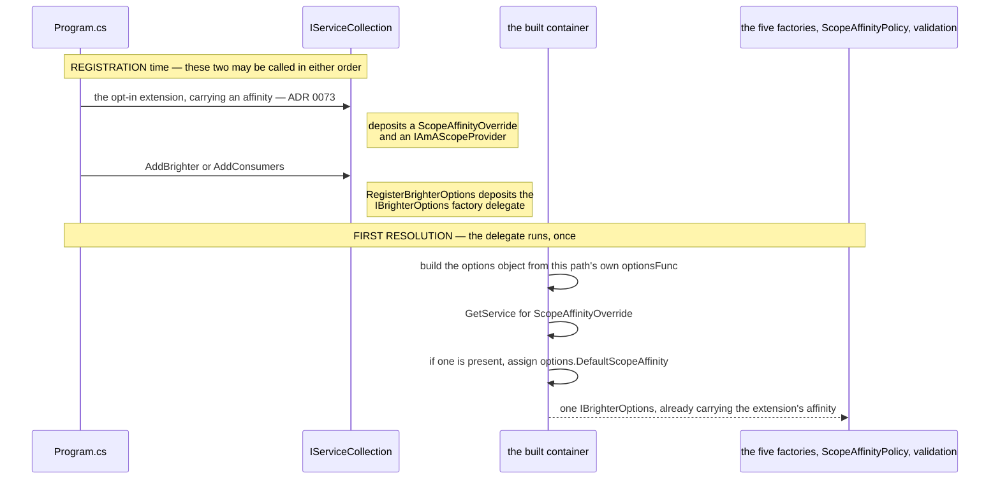
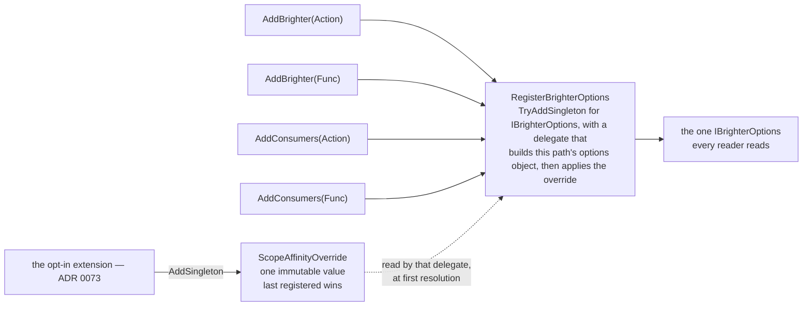
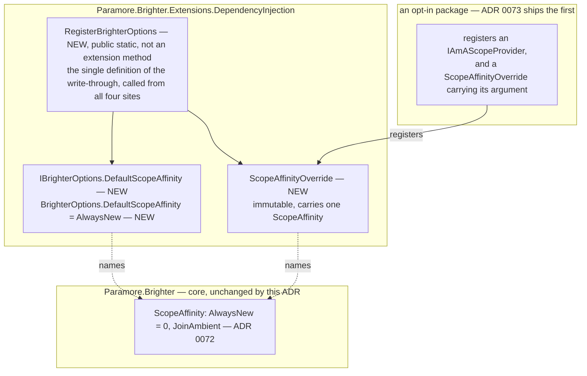

# 76. The affinity option, and how one setting reaches all four registration paths in any order

Date: 2026-08-03

## Status

Proposed

## Context

ADR 0072 built the seam. A pipeline that takes a pipeline scope asks an `IAmAScopeProvider` exactly once, carrying a `ScopeAffinity` that `ScopeAffinityPolicy` computes from `IBrighterOptions`, and either borrows the ambient the provider offers or creates and owns a scope as it does today. Everything in that mechanism is settled except its input: **nothing yet puts a `ScopeAffinity` on `IBrighterOptions`.**

That is this ADR, and the hard half of it is not the property. Brighter's five container-backed factories read `IBrighterOptions` (`ServiceProviderMapperFactory.cs:44`, and the same two lines in the other four), and `IBrighterOptions` is registered on **four** separate registration paths, only one of which runs an `IOptions` pipeline. An opt-in gesture in a package that knows about none of them — ADR 0073's ASP.NET extension is the first, and NFR-7 anticipates others — has to reach the object all four produce, in any registration order. Getting that wrong makes the opt-in fail silently and totally on three of the four.

**Parent Requirement**: [specs/0036-scoped-lifetime-per-pipeline/requirements.md](../../specs/0036-scoped-lifetime-per-pipeline/requirements.md)

**Scope**: This ADR decides **the opt-in property on `IBrighterOptions`, and the mechanism by which an opt-in gesture's affinity argument reaches the object `IBrighterOptions` resolves to on every registration path in every order.** It discharges FR-14 and FR-17, and serves FR-16, FR-18, FR-19, FR-20, FR-21, FR-22, FR-23, FR-25.11, NFR-1, NFR-4 and NFR-7.

**FR-19 and FR-21 are served here, not discharged here**, and the distinction is worth making because a reader auditing coverage should land on the mechanism rather than on the option. FR-21 — affinity applies to `Scoped` only — is delivered by ADR 0072's `ScopeAffinityPolicy` and the five container-backed factories; what this ADR contributes is the property they read and its `AlwaysNew` default. FR-19 — the flag is inert on the consumer side — is delivered by the pump publishing no per-message ambient (D0b, C-2, ADR 0072); what this ADR contributes is that the property is inherited by `ConsumersOptions` and settable there, so the inertness is a property of a *set* flag rather than of an unreachable one, plus the documentation obligation FR-25.11 places on the guidance page.

It does **not** decide the ASP.NET package, the registration extension that is the opt-in gesture, or that extension's name and signature — that is ADR 0073, which is this mechanism's first caller. It does not decide where FR-22's validation rules are evaluated — that is ADR 0074. It does not reopen ADR 0072's seam, ADR 0070's transform-pipeline scope or ADR 0071's handler convergence. It changes no lifetime, and it adds no validation rule.

This ADR **supersedes no prior ADR.** It completes the 0070–0072 sequence on the configuration side.

### Where this ADR sits

Seven ADRs deliver the parent requirement, one decision each. This is the seventh, and the only one whose whole subject is a single value arriving intact.

| ADR | Decides |
| --- | --- |
| 0070 | a transform pipeline takes one DI scope, carried **as a parameter** |
| 0071 | handler pipelines converge onto the **same handle**, carried on the object they already pass |
| 0072 | how a pipeline discovers an **ambient** DI scope the host owns |
| 0073 | the **ASP.NET Core package**, and the one line an application writes to opt in |
| 0074 | **where** the six scope-configuration rules are evaluated |
| 0075 | how a `Publish` subscriber **suppresses** adoption, for itself and everything nested beneath it |
| **0076** *(this one)* | the **affinity option**, and how one setting reaches all four registration paths in any order |

The rule the first two state is **the per-pipeline object carries the DI scope**. This ADR does not touch that object at all: it decides only what a pipeline's affinity *is* before ADR 0072's seam consults it. The whole of the opt-in, from an application's side, is one line in `Program.cs` (ADR 0073), and the work here is making that line land on four registration paths that behave differently and can be called in any order.

ADR 0067's `Terms` block defines the two axes used throughout — Brighter's *configured lifetime*, which governs the artefact, and the container's *registration lifetime*, which governs the dependencies. This ADR does not restate it. Per NFR-8, "lifetime scope" is not used for anything introduced here.

### The four registration paths, and what each does with `IBrighterOptions`

There is no `AddServiceActivator`; the consumer entry point is `AddConsumers`. All four route through `ServiceCollectionExtensions.BrighterHandlerBuilder`, which registers `IAmACommandProcessor`, so each alone is a complete Brighter host.

| Entry point | `IBrighterOptions` registration | Registration form | Runs `IOptions`? |
| --- | --- | --- | --- |
| `AddBrighter(Action<BrighterOptions>)` (`Extensions.DependencyInjection/ServiceCollectionExtensions.cs:61`) | `:74` | factory delegate over `IOptions<BrighterOptions>.Value` | **yes** — `AddOptions<BrighterOptions>()` `:69`, `Configure(configure)` `:71` |
| `AddBrighter(Func<IServiceProvider, BrighterOptions>)` (`:88`) | `:97` | factory delegate — the application's own `Func` | no |
| `AddConsumers(Action<ConsumersOptions>)` (`ServiceActivator.Extensions.DependencyInjection/ServiceCollectionExtensions.cs:29`) | `:38` | **a pre-built instance** — `new ConsumersOptions()` `:36`, `configure?.Invoke(options)` `:37` | no |
| `AddConsumers(Func<IServiceProvider, ConsumersOptions>)` (`:78`) | `:88` | factory delegate — the application's own `Func` | no |

Four sites, in two assemblies, and every one of them uses `TryAddSingleton`, so in a mixed producer-plus-consumer host the **first** registration wins (C-12). Three consequences follow and all three are load-bearing here.

- A `services.Configure<BrighterOptions>(...)` contributed by a later package reaches the object the factories read on **one** path. On the other three it reaches nothing at all, because no `IOptions` pipeline exists on them.
- `ConsumersOptions : BrighterOptions` (`ConsumersOptions.cs:10`). The `IOptions` machinery keys on the closed generic type, so a `PostConfigure<BrighterOptions>` would not reach a `ConsumersOptions` even if the consumer paths did run an options pipeline.
- Whichever registration wins the `TryAdd` is the object every reader sees — the five factories, ADR 0072's `ScopeAffinityPolicy`, and ADR 0074's validation. So the affinity must be applied at **every** one of the four sites, not at the one an ADR author happens to be looking at.

### The forces

- **AC-45 asserts the value on the *resolved* `IBrighterOptions`, on all four paths.** Not on `IOptions<BrighterOptions>.Value`, which C-12a shows is a different object on three of them. Its second clause starts each host from a **non-default** affinity and then passes the opposite value to the extension, so an implementation that silently drops the argument fails.
- **AC-48 forbids an ordering rule in as many words**: *"the same holds with the extension call placed before `AddBrighter` as well as after it — the rule is not an ordering rule (C-10)."* Any mechanism that needs the opt-in gesture to run after the Brighter registration is disqualified by that clause alone.
- **D13 fixes the argument, D18 fixes precedence.** The opt-in extension takes the affinity as an explicit argument defaulting to `JoinAmbient` (ADR 0073); the argument **is** the value and wins unconditionally. Opting out means passing `AlwaysNew`, or not calling the extension.
- **No sentinel, and none may be introduced** (FR-17). The option stays a plain non-nullable value (FR-14). The direct consequence is that "the application assigned `AlwaysNew`" and "the application left the default" are indistinguishable, which is why assigning the option alongside the extension is a **documented** configuration error (FR-25.11) rather than a validated one.
- **D2 — one flag governs both pipeline kinds.** There is no way to opt handler pipelines in and transform pipelines out.
- **D5 / FR-21 — affinity applies to `Scoped` only.** `Transient` and `Singleton` are unaffected under either setting. An inert opt-in is validated, never inferred and never silently corrected — but *where* is ADR 0074's.
- **NFR-7 — the mechanism must be usable by a package Brighter does not ship.** ADR 0073's ASP.NET extension is the first caller; an `AsyncLocal`-backed provider for console hosts must be able to be the second, with no privileged access.

## Decision

**The opt-in gesture does not write the affinity onto the options object; it deposits the value in the service collection, and the one place that does have the options object — the factory that produces it — picks the value up.**

The shape that takes is two parts. The options interface gains an affinity property whose default is exactly today's behaviour, so every existing host is unaffected. And the four registration sites that produce the options object are brought onto one shared definition of that production, so the deposited value is picked up on every path. Because the pick-up happens inside the producer, it necessarily runs after every application-supplied options delegate, which is what makes the rule hold in any registration order without an ordering rule. The names and signatures are under *Key Components*.

### The mechanism, end to end

The problem is that an opt-in gesture in a leaf package has to set a value on an object that, on two of the four registration paths, does not exist yet and will not until the container is built. The answer is to stop trying to write to it: the two halves happen at two different moments, so there is no ordering to get right.



Because the assignment happens *inside* the producer, it necessarily runs after every application-supplied delegate has contributed — after `Configure` on the `IOptions` path, after `configure.Invoke(options)` on the consumer `Action` path, after the application's `Func` has returned on both `Func` paths. That is D18 satisfied by construction rather than by an ordering rule: the extension wins because it writes last, and it writes last because it writes from inside.

All four entry points funnel through the same definition, which is what makes the rule true on every path rather than on the one an author happened to be looking at:



### Where the pieces live



The dependency direction is fixed and is the whole of NFR-2: an opt-in package depends on the DI package, the DI package depends on core, and neither of the lower two ever depends upward.

### Key Components

#### The roles, and what each is responsible for

| Role | Type | Stereotype | Responsibility |
| --- | --- | --- | --- |
| The affinity override | `ScopeAffinityOverride` (DI package) | **knowing** (information holder) | Carries one value — the affinity the opt-in gesture selected. It decides nothing and does nothing; it exists so the value has a type and a place to sit in the collection |
| The options object | `BrighterOptions` / `ConsumersOptions` behind `IBrighterOptions` | **knowing** | The single object every reader takes configuration from: the five factories, `ScopeAffinityPolicy` (ADR 0072), and validation (ADR 0074) |
| The options registration | `RegisterBrighterOptions` (DI package) | **doing** | Produces the options object each path supplies and applies the override to it before anyone can read it |

The division that matters is between the **override** and the **options object**. The override knows what the application asked for; the options object is what every reader reads. Keeping them as two roles rather than one is what makes the mechanism order-independent: the override can be registered before the options object exists, because it is not the options object.

#### The opt-in property (change, DI package, public)

```csharp
namespace Paramore.Brighter.Extensions.DependencyInjection
{
    public class BrighterOptions : IBrighterOptions
    {
        /// <summary>
        /// Selects whether a Scoped pipeline creates its own DI scope or joins an ambient DI scope the
        /// host already owns, where an ambient source offers one. Applies to Scoped handlers, mappers
        /// and transforms only: Transient and Singleton are unaffected under either setting (FR-21).
        /// Defaults to AlwaysNew, which is exactly today's behaviour.
        /// </summary>
        public ScopeAffinity DefaultScopeAffinity { get; set; } = ScopeAffinity.AlwaysNew;

        // ...existing members unchanged
    }

    public interface IBrighterOptions
    {
        ScopeAffinity DefaultScopeAffinity { get; set; }

        // ...existing members unchanged
    }
}
```

**Contract.**

| Member | Input | Output | Error conditions |
| --- | --- | --- | --- |
| `DefaultScopeAffinity` | a `ScopeAffinity`; the property is non-nullable and has no "unset" value (FR-14, FR-17) | the affinity every pipeline in this host starts from, before `ScopeAffinityPolicy` narrows it over the participating set (FR-27.2) and before `Publish` suppression forces `AlwaysNew` (FR-8) | Cannot throw. An out-of-range enum value — a cast integer, which a plain non-nullable enum property on a public options surface cannot prevent — degrades to `AlwaysNew`. That is an **obligation this ADR places on ADR 0072**, not an accident of its implementation: every reader of a `ScopeAffinity` tests for `JoinAmbient` positively rather than testing for `AlwaysNew` and treating everything else as adoption, so an unrecognised value fails safe. ADR 0072 states the same rule on `ScopeAffinityPolicy`'s contract. Setting this property while also calling the registration extension is a configuration error whose outcome is the extension's value — documented (FR-25.11), not validated |

Four things about this shape.

**It is a `ScopeAffinity`, not a `bool`.** D13 already fixes the registration extension's argument as a `ScopeAffinity`, and D4 fixes the enum's name and its two values. A `bool AdoptAmbientScope` would give one concept two spellings — `AdoptAmbientScope = true` at the setting site and `ScopeAffinity.JoinAmbient` at the extension call one line away — and the guidance page (FR-25.11) would have to teach the mapping between them. It would also close the door on a third affinity without a breaking change. The `bool` is a genuine alternative with a genuine advantage, recorded below.

**`ConsumersOptions : BrighterOptions`** (`ConsumersOptions.cs:10`), so both consumer paths inherit the property with no separate work, and the affinity is settable in an `AddConsumers` delegate exactly as it is in an `AddBrighter` one. FR-19 makes the setting inert on the consumer side — every consumer pipeline creates and owns its scope, and the only permitted difference is at most two latched `Warning` entries for the life of the host. That inertness is about *pump-driven* pipelines: a `Send` issued from a controller in a host registered through `AddConsumers` is a producer-side pipeline and does adopt, which is what AC-45's second clause exercises on the two `AddConsumers` paths.

**Adding a member to `IBrighterOptions` is a source and binary break for any hand-rolled implementation**, and `netstandard2.0` has no default interface member to absorb it. The blast radius is small and is stated rather than assumed: a repository-wide search for implementations of `IBrighterOptions` finds **exactly one** in `src/` — `BrighterOptions` (`BrighterOptions.cs:9`) — and **none** in `tests/`; every test that needs one constructs a `BrighterOptions`. Nothing in the repository breaks. An application that implemented the interface by hand does, and that is a further break to record in `release_notes.md` alongside FR-20's behavioural break, FR-22.2's compatibility break and the eight factory, registry and handler interface signatures ADRs 0070 and 0071 change (C-18, NFR-1(c), AC-24). ADR 0070 step 7a enumerates the whole entry.

**It is not a compatibility flag.** `IsolateTransientHandlerScope` (`BrighterOptions.cs:37`) exists to restore pre-#4254 behaviour and is documented as a fallback for code that cannot move to `Scoped`; D3 rules out any equivalent flag for the `MapperLifetime.Scoped` break. `DefaultScopeAffinity` selects a *feature*. The two do not interact: `IsolateTransientHandlerScope` governs `Transient` handlers only, and FR-21 confines affinity to `Scoped`, so their domains do not intersect at any lifetime.

#### `ScopeAffinityOverride` — the value the extension carries (new, DI package, public)

```csharp
namespace Paramore.Brighter.Extensions.DependencyInjection
{
    /// <summary>
    /// The scope affinity selected by an opt-in registration extension. Registering one of these is how
    /// a package that knows nothing about Brighter's registration paths sets the default affinity on
    /// whichever options object IBrighterOptions resolves to, in any registration order. It wins over
    /// any affinity the application assigned itself (D18).
    /// </summary>
    public sealed class ScopeAffinityOverride
    {
        public ScopeAffinityOverride(ScopeAffinity affinity) => Affinity = affinity;

        public ScopeAffinity Affinity { get; }
    }
}
```

**Contract.**

| Member | Input | Output | Error conditions |
| --- | --- | --- | --- |
| `Affinity` | none | the affinity the opt-in gesture selected | Cannot throw. Immutable after construction, so a reader cannot observe it changing between the moment `IBrighterOptions` is built and the moment a pipeline reads it |
| *(the type as a service)* | resolved with `GetService`, never `GetRequiredService` | `null` where no extension was called — the ordinary case for every host that does not opt in | Absence is not an error; it is the default configuration (FR-15) |

It lives in the DI package, not core: core may name no container type and this type exists only to be a service in a Microsoft service collection, but it names only `ScopeAffinity`, a core type, so it adds nothing to core's compile closure and the AC-22.3 source-level guard is untouched. It is public because an opt-in package is a separate assembly; `InternalsVisibleTo` was rejected for the reason ADR 0075 gives about suppression — the mechanism must be available to a package Brighter does not ship, since NFR-7 anticipates other ambient sources.

It is a type rather than a bare `ScopeAffinity` registered as a service because registering an enum as a service type is the primitive-obsession failure: `GetService(typeof(ScopeAffinity))` names nothing, collides with any other use of the enum as a service, and cannot be told apart from a default value. The wrapper names the role.

#### `RegisterBrighterOptions` — where the override is applied (new, DI package, public static, not an extension method)

```csharp
// Paramore.Brighter.Extensions.DependencyInjection.ServiceCollectionExtensions
// Public so that the ServiceActivator DI package can call it. DON'T CALL THIS DIRECTLY.
public static void RegisterBrighterOptions(
    IServiceCollection services,
    Func<IServiceProvider, BrighterOptions> optionsFunc)
{
    services.TryAddSingleton<IBrighterOptions>(sp =>
    {
        var options = optionsFunc(sp);
        var over = sp.GetService<ScopeAffinityOverride>();
        if (over is not null)
            options.DefaultScopeAffinity = over.Affinity;   // D18: the extension wins
        return options;
    });
}
```

It is declared like `BrighterHandlerBuilder` (`:119`, `:142`) — public, not an extension method, carrying a "DON'T CALL THIS DIRECTLY" doc comment — so it does not appear in IntelliSense on `services.` beside `AddBrighter`, but is reachable from the ServiceActivator DI package, which already calls `ServiceCollectionExtensions.BrighterHandlerBuilder` across the assembly boundary.

**Every one of the four registration sites is rewritten to call it**, and each keeps its own `optionsFunc`. This is the family the rule is stated over, and each member is stated:

| Site | Today | After |
| --- | --- | --- |
| `Extensions.DependencyInjection/ServiceCollectionExtensions.cs:74` | `TryAddSingleton<IBrighterOptions>(sp => sp.GetRequiredService<IOptions<BrighterOptions>>().Value)` | `RegisterBrighterOptions(services, sp => sp.GetRequiredService<IOptions<BrighterOptions>>().Value)`. The `AddOptions`/`Configure` pair at `:69-71` and the `BrighterHandlerBuilder` call at `:77-79` are unchanged |
| `Extensions.DependencyInjection/ServiceCollectionExtensions.cs:97` | `TryAddSingleton<IBrighterOptions>(configure)` | `RegisterBrighterOptions(services, configure)`. `:98-100` unchanged |
| `ServiceActivator.Extensions.DependencyInjection/ServiceCollectionExtensions.cs:38` | `TryAddSingleton<IBrighterOptions>(options)` — **the one instance registration** | `RegisterBrighterOptions(services, _ => options)`. `:39`'s `TryAddSingleton<IAmConsumerOptions>(options)` stays an **instance** registration — see below. `:64`'s `BrighterHandlerBuilder(services, options)` unchanged |
| `ServiceActivator.Extensions.DependencyInjection/ServiceCollectionExtensions.cs:88` | `TryAddSingleton<IBrighterOptions>(configure)` | `RegisterBrighterOptions(services, configure)`. `:89-90`'s `IAmConsumerOptions` cast and `:131-133`'s `BrighterHandlerBuilder` unchanged |

Three details of that table are behavioural and must be stated, not glossed.

**One site converts a pre-built instance into a factory delegate, and that is a real change with a null effect here.** MS DI does not dispose an instance the developer registered; it does dispose whatever a factory delegate returns, if it is `IDisposable`. Neither `BrighterOptions` nor `ConsumersOptions` implements `IDisposable`, and neither `IBrighterOptions` nor `IAmConsumerOptions` extends it, so nothing changes today. It becomes live the day either options type gains a disposable member, and that is worth knowing. What the delegate does *not* defer is construction: `new ConsumersOptions()` and `configure?.Invoke(options)` still run at `:36-37`, at registration time, because `:45` onwards reads `options.InboxConfiguration` to decide which inbox descriptors to add. Only the override's application is deferred to first resolution.

**`IAmConsumerOptions` on the `Action` path stays an instance registration, deliberately.** The obvious tidy — make `:39` mirror `:89-90`'s `sp => (IAmConsumerOptions)sp.GetRequiredService<IBrighterOptions>()` so both service types route through one point — would import the `Func` overload's defect onto the `Action` path. In a mixed host with `AddBrighter` first, `IBrighterOptions` resolves to a `BrighterOptions`, which is not an `IAmConsumerOptions`, and the cast throws `InvalidCastException` (`:89-90`). That is pre-existing and not caused here, and the `Action` overload is the one every mixed-host Acceptance Criterion is required to use precisely because it does not have it. Leaving `:39` alone keeps it that way.

**The residue is smaller than it first looks, and it is worth being exact about, because "the two registrations disagree" would be a serious objection if it were true.** On the `Action` path both service types name the *same* `ConsumersOptions` instance, and only the `IBrighterOptions` factory applies the override — so between a first resolution of `IAmConsumerOptions` and a first resolution of `IBrighterOptions`, that object's `DefaultScopeAffinity` still holds whatever the application set. That state is **not reachable through the `IAmConsumerOptions` contract**: `IAmConsumerOptions` is a *core* interface (`src/Paramore.Brighter/IAmConsumerOptions.cs:7`) with five members — `DefaultChannelFactory`, `InboxConfiguration`, `Subscriptions`, `InstrumentationOptions`, `ShutdownTimeout` — and the affinity is on `IBrighterOptions`, which is a DI-package interface it does not extend. Observing the discrepancy would require downcasting to `ConsumersOptions` or `IBrighterOptions`; no consumer of `IAmConsumerOptions` in `src` or `tests` does that, and every one of them reads only subscriptions, the channel factory or the inbox. So the choice is between spreading a known crash and tolerating a state that the interface cannot express.

**In a mixed host the winner of the `TryAdd` applies the override, and both sides now do.** `IBrighterOptions` is `TryAddSingleton` in both assemblies, so first registration wins, whichever it is. Because all four sites route through `RegisterBrighterOptions`, whichever descriptor survives applies the override. A host where `AddConsumers(Action)` registers first gets the affinity on its `ConsumersOptions`; a host where `AddBrighter` registers first gets it on its `BrighterOptions`; in both, that is the object the factories read. The losing side's options object never receives the override and is never read for affinity. Applying it at only one of the two assemblies' sites would have made the opt-in depend on registration order in exactly the way AC-48 forbids.

### Technology Choices

**Why the override is read inside Brighter's own `IBrighterOptions` factory, rather than written from the extension.** The extension runs at registration time, on a collection, and cannot see the object it needs to write to — on two of the four paths that object does not exist yet and will not until first resolution; on a third it exists only as a descriptor's `ImplementationInstance`; on the fourth it is produced by the `IOptions` pipeline. Inverting the direction removes the problem entirely: the extension deposits a value, and the one place that *does* have the object — the factory that produces it — picks the value up. Neither half needs to know when the other ran.

**Why this necessarily satisfies D18.** The assignment happens inside the factory delegate that produces the options object, which by construction runs after every application-supplied delegate has contributed to it: after `Configure(configure)` on the `IOptions` path, after `configure.Invoke(options)` on the consumer `Action` path, and after the application's `Func` has returned on both `Func` paths. There is no ordering to get right because there is no ordering: the extension wins because it writes last, and it writes last because it writes from inside the producer.

**Why the value is applied to the options object rather than read at each use site.** AC-45's first Then asserts the affinity *on the resolved `IBrighterOptions`*, so a design in which the factories consult `ScopeAffinityOverride` directly and never write through fails it outright. There is a deeper reason to prefer write-through: ADR 0074's validation must read the configuration **as the factories see it**, and ADR 0072's `ScopeAffinityPolicy` reads `IBrighterOptions`. One source of truth for four readers is the point of having an options object at all.

**Why `GetService` and not `GetRequiredService`.** No override registered is the ordinary configuration — every host that has not opted in, which is every host that exists today. Absence must be silent (FR-15), so the read must tolerate it. This matches how the factories already read `IBrighterOptions` itself: `ServiceProviderMapperFactory.cs:44` uses `GetService` and falls back to a default.

**Thread safety.** MS DI creates a singleton once, under its own lock, so the write to `DefaultScopeAffinity` happens exactly once and completes before any caller holds the reference **the `IBrighterOptions` factory returns** (NFR-4). That is the guarantee, and it is narrower than "nobody can see it half-configured": on the consumer `Action` path a reader that reaches the *same object* by another route can. `IAmConsumerOptions` and `IBrighterOptions` name one `ConsumersOptions` instance, and only the `IBrighterOptions` factory applies the override, so between a first resolution of the one and a first resolution of the other that object still holds whatever the application set — the residue described above. No pipeline reads affinity by that route; a diagnostic dump could.

### Implementation Approach

**1. Add the property.** `ScopeAffinity DefaultScopeAffinity { get; set; }` on `IBrighterOptions` and `= ScopeAffinity.AlwaysNew` on `BrighterOptions`. This depends on ADR 0072 having added `ScopeAffinity` to core; until then the DI package cannot name it. Nothing else in this ADR compiles before that.

**2. Add `ScopeAffinityOverride`** to the DI package, and `RegisterBrighterOptions` to `ServiceCollectionExtensions` beside `BrighterHandlerBuilder`.

**3. Move all four registration sites onto it, in one commit.** `:74`, `:97`, and the ServiceActivator package's `:38` and `:88`. Partial adoption gives a host whose opt-in works on some entry points and not others, which is the failure mode FR-17 exists to prevent. The ServiceActivator package's `:39` and `:89-90` are explicitly *not* touched.

**4. Documentation.** FR-25.11 requires the guidance page to state that assigning `DefaultScopeAffinity` while calling the opt-in extension is a configuration error whose outcome is the extension's value, in any order and on any path, and that it is **not** reported by validation. The three gestures themselves are ADR 0073's. `release_notes.md` gains the `IBrighterOptions` member, in the same entry as the other breaks ADR 0070 step 7a lists (C-18, AC-24).

**5. What this leaves to ADR 0074.** Where FR-22's rules, FR-24.3's duplicate-provider rule and FR-17's repeated-opt-in rule are evaluated. This ADR fixes what they read — `DefaultScopeAffinity` on the object `IBrighterOptions` resolves to, with the override already applied, and the `ScopeAffinityOverride` descriptors as they stand in the collection — and decides no evaluation site. It adds no rule against the *other* FR-17 configuration error, deliberately: an application that assigns `DefaultScopeAffinity` while also calling the extension is indistinguishable from the ordinary opt-in without the sentinel FR-17 bans, and a rule comparing values would fire on every default host that called the extension. The repeated call is detectable precisely because it needs no sentinel — two differing affinity *values* are visible in the collection whether or not either was explicitly assigned.

## Consequences

### Positive

- **Order-independence is structural, not tested-in.** The mechanism has no ordering to get wrong: the extension writes to the collection, the options factory reads from the container. AC-48's before-ordering clause and AC-45's four-path clause pass for the same reason.
- **One definition of the write-through, four call sites.** `RegisterBrighterOptions` holds the knowledge once. A fifth registration path added later gets the behaviour by calling it, and a reviewer can see at a glance whether it did.
- **The default is exactly today's behaviour.** `AlwaysNew` is the property's default and `ScopeAffinity.AlwaysNew` is `0`, so a `BrighterOptions` that nobody configured, and any options object produced by any path, adopts nothing (FR-15).
- **Core gains nothing.** Every type here is in the DI package. NFR-1's source-level clause is untouched.
- **The mechanism is implementable off ASP.NET.** `ScopeAffinityOverride` names only `ScopeAffinity`, so an `AsyncLocal`-backed provider package for console hosts registers its provider and its override in exactly the same two lines (NFR-7).
- **`Transient` and `Singleton` are untouched** under either setting (FR-21). An application that opts in and leaves the lifetimes at their `Transient` defaults gets identical behaviour to today — reported by validation, never silently corrected (D5).

### Negative

- **`IBrighterOptions` gains a member, which is a source and binary break** for any application that implemented it by hand. There is no default interface member on `netstandard2.0` to absorb it. Nothing in this repository implements it — one implementation in `src/`, none in `tests/` — but "we could not find one" is not "there is none", and this is one more item for the single `release_notes.md` entry ADR 0070 step 7a enumerates, beside FR-20's behavioural break, FR-22.2's compatibility break and the eight factory, registry and handler interface signatures ADRs 0070 and 0071 change.
- **Four registration sites change, and one of them changes shape.** The ServiceActivator `Action` overload's `IBrighterOptions` registration stops being an instance and becomes a delegate. It is inert today because neither options type is `IDisposable`, but it moves the object from "the container will never dispose this" to "the container will dispose this if it ever becomes disposable". That is a latent behaviour change parked in the code for someone to trip over later.
- **The write mutates an object the application may still hold — and on one path an object the framework owns.** On the two `Func` paths and the consumer `Action` path the application constructs the options object itself; after the host is built, its own reference reads back the extension's affinity, not the one it set. On the fourth path — `AddBrighter(Action<BrighterOptions>)` — the object written is `IOptions<BrighterOptions>.Value` (`ServiceCollectionExtensions.cs:69-75`), a singleton the options machinery owns and hands to **anyone** resolving `IOptions`, `IOptionsSnapshot` or `IOptionsMonitor`, not only to Brighter. A `PostConfigure`-style reader or a diagnostic dump there observes the application's value or the extension's depending on whether `IBrighterOptions` has been resolved yet. That is D18 working as specified on all four, and it will still surprise someone.
- **The consumer `Action` path keeps two registrations of one object, and only one of them applies the override.** Routing `IAmConsumerOptions` through `IBrighterOptions` would unify them, and would import the `Func` overload's `InvalidCastException` onto the one consumer path that does not have it — so the asymmetry is kept deliberately. It is unobservable rather than harmless: `IAmConsumerOptions` has no affinity member, so nothing that holds only that interface can see the difference. What is genuinely paid is legibility. A reader of `:38-39` now sees two adjacent registrations of the same instance that behave differently, and the reason is in this ADR rather than at the call site; a comment at `:39` is the mitigation, and a comment is a weak one.
- **A repeated opt-in is still a configuration error, and validation is the only thing that says so.** Both halves resolve to the last call, so the host is at least coherent — but an application that calls the extension twice with different affinities gets one of them silently unless it calls `ValidatePipelines()` **and** runs a validation host (C-15, D14). The warning FR-17 requires costs a rule in ADR 0074 and a troubleshooting entry on the guidance page (FR-25.10).
- **The configuration error FR-17 names is genuinely unreportable.** An application that assigns `DefaultScopeAffinity = AlwaysNew` and calls the opt-in extension silently gets `JoinAmbient`. With no sentinel it is indistinguishable from the ordinary opt-in on a default host, so no validation rule can catch it without firing on every correct opt-in. The only mitigation is documentation (FR-25.11), and documentation is a weaker mitigation than a rule.
- **C-15's residual gap is untouched and this ADR widens what falls into it.** An application that opts in, leaves every lifetime `Transient` and never calls `ValidatePipelines()` gets no signal at all: nothing adopts, nothing warns, and the one-line opt-in it added does nothing. Accepted, and it is the strongest argument for FR-25's decision guide.

### Risks and Mitigations

| Risk | Mitigation |
| --- | --- |
| A fifth registration path is added later and does not apply the override, so the opt-in fails silently on it | The write-through has exactly one definition, `RegisterBrighterOptions`, and the four existing sites are its only callers. AC-45 enumerates all four; a fifth path would need a fifth clause, and the absence of one is visible |
| The extension is called before `AddBrighter` and the affinity is lost | The mechanism has no ordering: the override is a service, not a mutation of a descriptor. AC-48's second clause and AC-45's four-path clause both assert the before-ordering, and both start from a non-default affinity so a dropped argument fails them |
| A mixed host applies the override to the losing options object | All four sites apply it, so whichever `TryAdd` wins carries it. AC-43's mixed-host configuration states which entry point registers first and which `AddConsumers` overload is used, per C-12 |
| An application sets the affinity itself and gets the extension's value without knowing | Documented in `docs/guides/lifetimes-and-scoping.md` (FR-25.11) with the correct gesture for each of the three intents, and pinned in both directions by AC-48 so the rule cannot drift to "the more permissive value wins" |
| Adding a member to `IBrighterOptions` breaks a downstream implementation nobody knew about | The break is stated in `release_notes.md` with the migration — add the property, default it to `AlwaysNew` — which is a one-line change (AC-24) |

## Alternatives Considered

**1. Do nothing — no opt-in property and no write-through.** ADRs 0070 and 0071 close the actual defects; ADR 0072's seam would then exist with no configured affinity to consult, so every pipeline would compute `AlwaysNew` and no ambient could ever be adopted. **Rejected**, but it is the honest alternative and it is worth naming what it costs: FR-16's case — a Brighter handler and the controller that called it resolving the same `DbContext`, and a Darker query handler in the same action resolving it too — is the reason the specification was raised, and it is unreachable without a way to say yes.

**2. A `bool AdoptAmbientScope` instead of a `ScopeAffinity` property.** **Rejected.** Its advantage is real and is the reason C-9 left it open: at the setting site `AdoptAmbientScope = true` reads as the yes/no question the user is actually answering, where `DefaultScopeAffinity = ScopeAffinity.JoinAmbient` reads as jargon. But D13 fixes the extension's argument as a `ScopeAffinity` and D4 fixes the enum, so a `bool` gives one concept two spellings a line apart, forces the guidance page to teach the mapping, and makes the FR-22.1 error message name a setting whose spelling differs from the gesture that produced it. It also forecloses a third affinity without a breaking change.

**3. Descriptor rewriting — find the existing `IBrighterOptions` descriptor and wrap it.** The extension locates the `ServiceDescriptor` for `IBrighterOptions` in the collection, removes it, and re-adds one whose factory calls the original and then assigns the affinity. No new service type, no change to any of the four registration sites. **Rejected, and this is the obvious approach that AC-48 kills.** On the before-ordering — the extension called before `AddBrighter` or `AddConsumers` — there is no descriptor to find, so the extension does nothing and the opt-in is lost. AC-48's second clause asserts that ordering explicitly. A variant that registers a marker and rewrites on first resolution is not available either: MS DI freezes the collection when the provider is built, and there is no callback between the last registration and that build. A second, independent objection: on the consumer `Action` path the descriptor's `ImplementationInstance` is also registered as `IAmConsumerOptions`, so rewriting one service type quietly changes the object behind another.

**4. Bring all four paths onto `IOptions` and use `PostConfigure`.** FR-17 names this as the other candidate, so it is rejected on what the three non-`IOptions` paths actually do, not on a strawman. Four concrete costs, each verified in the source. *(i)* `ConsumersOptions : BrighterOptions` and the `IOptions` machinery keys on the closed generic type, so `PostConfigure<BrighterOptions>` does not reach a `ConsumersOptions` at all; the extension would have to post-configure `BrighterOptions` **and** `ConsumersOptions` **and** every options type a future package derives — an open-ended set a leaf package cannot know. *(ii)* `AddConsumers(Action<ConsumersOptions>)` reads `options.InboxConfiguration` at registration time to decide which inbox descriptors to add (`:45` onwards); an options object resolved lazily through `IOptions` does not exist at that point, so those registration-time decisions would each have to become a deferred delegate — a substantial behavioural change to the consumer registration path, made in service of a naming-adjacent feature. *(iii)* Both `Func` overloads hand the application an `IServiceProvider` and take back an options object it constructed. That contract is not expressible as `Configure<TOptions>(Action<TOptions>)`; approximating it needs a member-wise copy of `BrighterOptions` that must be maintained against every future property, and it breaks reference identity for an application that holds the object it returned. *(iv)* It is a much larger change to the most load-bearing registration code in the repository, delivering nothing the override delivers — the override is order-independent on all four paths today, at the cost of one new type and one new method.

**5. The factories read `ScopeAffinityOverride` directly, with no write-through.** `ScopeAffinityPolicy` takes both `IBrighterOptions` and an optional `ScopeAffinityOverride`, and prefers the override. No change to any registration site at all. **Rejected on AC-45 clause 1**: it asserts that the affinity on the *resolved* `IBrighterOptions` is the extension's value, and under this design the resolved options object still carries whatever the application set. There is a second reason that matters more in the long run: ADR 0074's validation must read the configuration as the factories see it, so it would need the same two-input rule, and the option would have two sources of truth that a third reader could combine differently. One object every reader reads is the whole point of `IBrighterOptions`.

**6. A sentinel — `ScopeAffinity? DefaultScopeAffinity`, so "explicitly set" is distinguishable.** It would let validation report FR-17's configuration error instead of documenting it, and would let precedence be decided rather than declared. **Rejected — banned by FR-17, and the ban is right.** A nullable affinity makes the property a tri-state that every reader must collapse: the five factories, `ScopeAffinityPolicy`, and validation would each have to spell "null means `AlwaysNew`", and one of them getting it wrong is a silent adoption bug. It also exposes "unset" on a public options surface, inviting an application to assign `null` meaning "let the extension decide" — which is already what happens when it assigns nothing. And FR-14 requires a plain non-nullable value, precisely so that partially-initialised construction cannot produce an ambiguous state. The price of the ban is that FR-17's configuration error is documented rather than validated, and that price is paid explicitly in *Consequences*.

**7. An ordering rule — "call the extension last".** Drop the override; require the extension to be called after the Brighter registration and have it mutate the options object directly. **Rejected by C-10, and it could not have been made to work.** Concretely, on each of the four paths: on `AddBrighter(Action<BrighterOptions>)` a `PostConfigure` genuinely does land after the application's delegate, so this path alone is satisfiable; on both `Func` paths no options object exists at registration time — it is produced at first resolution — so there is nothing to mutate when the extension runs; on `AddConsumers(Action<ConsumersOptions>)` the object exists but only as a descriptor's `ImplementationInstance`, reachable solely by descriptor archaeology, which is alternative 3. One path out of four. Beyond that, an ordering rule is a rule an application gets wrong silently — the opt-in simply does nothing — and it makes registration order semantically significant in a codebase where `TryAdd` already makes it significant in a different and unrelated way (C-12).

## References

- Requirements: [specs/0036-scoped-lifetime-per-pipeline/requirements.md](../../specs/0036-scoped-lifetime-per-pipeline/requirements.md) — FR-8, FR-14, FR-15, FR-16, FR-17, FR-18, FR-19, FR-20, FR-21, FR-22, FR-23, FR-25.10, FR-25.11, FR-27; NFR-1, NFR-2, NFR-4, NFR-7, NFR-8; C-2, C-9, C-10, C-12, C-12a, C-15, C-18; D0b, D1, D2, D3, D4, D5, D13, D14, D18; AC-14, AC-22, AC-24, AC-43, AC-45, AC-48, AC-49
- Related ADRs (cited by slug — ADR numbers are not unique in this repo, C-16):
  - `0073-aspnet-core-request-scope-package` [Proposed] — the first caller of this mechanism: the ASP.NET package, and the `AddBrighterRequestScope` extension whose argument this ADR carries to the options object
  - `0072-ambient-scope-adoption-seam` [Proposed] — the seam this option feeds: `IAmAScopeProvider`, `ScopeAffinity`, `ScopeAffinityPolicy`, and the positive `JoinAmbient` test that makes an out-of-range value fail safe
  - `0074-lifetime-validation-evaluation-site` [Proposed] — where the rules that read this option and these descriptors are evaluated
  - `0071-pipeline-scope-handle-for-handler-pipelines` [Proposed] — handler pipelines reach their DI scope through the same handle, which is why one option governs both pipeline kinds (D2)
  - `0070-per-pipeline-di-scope-for-mapper-and-transform-factories` [Proposed] — the transform pipeline's single DI scope, and the release-note entry this ADR's interface break joins
  - `0075-publish-subscriber-scope-suppression` [Proposed] — why a mechanism another package must be able to use is public rather than `InternalsVisibleTo`
  - `0014-di-friendly-framework` [Accepted] — per-family factory interfaces rather than an IoC container abstraction
  - `0067-per-resolution-di-scope-for-transient-factory-instances` [Accepted] — `IsolateTransientHandlerScope` and the `Transient` per-resolution scope this option does not interact with; its `Terms` block defines the two lifetime axes used here
  - `0053-pipeline-validation-at-startup` [Accepted] and `0064-validate-pipeline-assembly-and-provider-registration` [Accepted] — the `ValidatePipelines()` machinery that ADR 0074 will read this option from
  - `0033-lifetime-of-command-processor-and-mediator` [Proposed] — the `CommandProcessor` is a singleton; not reopened
- External references:
  - [Options pattern in .NET](https://learn.microsoft.com/en-us/dotnet/core/extensions/options) — `Configure`, `PostConfigure` and the closed-generic keying that rules out alternative 4
  - [Dependency injection in .NET — service disposal](https://learn.microsoft.com/en-us/dotnet/core/extensions/dependency-injection#disposal-of-services) — why an instance registration and a factory registration differ on disposal
  - Wirfs-Brock & McKean, *Object Design: Roles, Responsibilities, and Collaborations* — the role/stereotype vocabulary separating the affinity override (knowing) from the options registration (doing)
