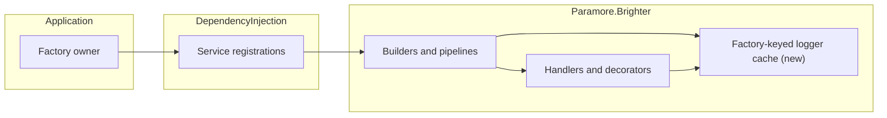

# 77. Require application-owned logging

Date: 2026-09-28

## Status

Proposed for V11. Supersedes only the logging dependency decisions in ADRs 0057 and 0064.

## Context

Multiple Brighter applications can share one process. A mutable global logger factory lets one application redirect another application's logs. Disposing the most recently registered factory can then break logging in an unrelated application.

### Scope

- Replace global logging dependencies throughout Brighter.
- Require explicit logging configuration, including manually constructed transports and stores.
- Preserve existing logger categories and avoid repeated factory work on message paths.
- Keep pipeline lifetime and factory ownership rules from ADR 0070.

### One application can redirect another application's logs

| Operation | Global factory | Application-owned factory |
| --- | --- | --- |
| Configure application B | Changes logging for A | A retains its own factory |
| Dispose application A | May invalidate B's logging | Only A's logging is disposed |
| Omit logging configuration | May silently lose diagnostics | Configuration fails explicitly |

### The forces

- Missing logging must be visible during configuration.
- A generic host already owns a logger factory.
- Applications construct many transport and store objects before building the host.
- Existing log-level filters depend on category names.
- Repeated handler construction must not repeatedly create the same category logger.

## Decision

**Require application-owned logging dependencies and remove the mutable global factory.**

Builders and dependency injection pass the factory through the object graph. Components retain loggers from that factory. A deliberate no-op factory remains an application choice.

### The mechanism, end to end

| Stage | Action | Failure |
| --- | --- | --- |
| Configure application | Register or construct a factory | Missing registration reports setup guidance |
| Build processor or dispatcher | Complete the logging stage | Concrete builders also validate at runtime |
| Construct pipeline | Configure every handler and decorator | Null factory identifies the argument |
| Execute manual chain | Configure each handler explicitly | Unconfigured relay reports ConfigureLogging guidance |
| Dispose application | Owner disposes its factory | Other applications retain their own loggers |

### Where the pieces live

### Key Components

#### The roles, and what each is responsible for

| Role | Type | Responsibilities | Responsibility classifier | Collaborators |
| --- | --- | --- | --- | --- |
| Factory owner | Host or application | Configure and dispose logging | doing | ILoggerFactory |
| Configuration validator | Fluent builders | Require a factory before Build | deciding | Application |
| Pipeline configurator | PipelineBuilder | Configure every handler | doing | RequestHandler |
| Logger reuse | BrighterLoggerFactoryExtensions | Cache category loggers with weak factory keys | knowing | ILoggerFactory |
| Log emitter | Handler or transport | Emit through its own logger | doing | ILogger |

#### Public contracts

| Member | Input | Output | Error conditions |
| --- | --- | --- | --- |
| ConfigureLogging | Non-null factory | Next builder stage | Null argument |
| Handler ConfigureLogging | Non-null factory | Configured relay logging | Null argument |
| Build | Complete configuration | Processor or dispatcher | Missing dependency |

#### Where each type is touched

| Assembly | Type | Change |
| --- | --- | --- |
| Core | Builders, handlers, pipelines | Explicit factory flow |
| ServiceActivator | Dispatcher and pumps | Explicit factory flow |
| Integrations | Transports, stores, schedulers | Required logger dependencies |

Factory disposal remains the application's responsibility. Message handling and pipeline ownership remain unchanged.

### Technology Choices

#### Why factories and typed loggers coexist

A component that creates children needs a factory. A leaf created by dependency injection can accept ILogger of its own type. Internal helpers can receive pre-created loggers with their original category.

#### Why loggers are cached by factory

A ConditionalWeakTable retains one lazy logger per factory and category. Concurrent pipelines share the logger without repeatedly calling CreateLogger. Weak factory keys avoid extending the lifetime of an application container. Lifetime helpers receive the owning factory's pre-created logger rather than resolving logging on every message.

#### Why the pump keeps constructor parameters

The protected MessagePump constructor retains its existing dependencies and adds the required logger factory. A parameter object would impose another public API migration unrelated to logging; the extra constructor argument is intentional.

#### Why categories remain stable

Fixing historical category names would change filtering independently of factory ownership. This migration preserves those names, including the async transform builder's historical category.

#### Why no implicit fallback exists

A no-op default would let upgrades silently lose diagnostics. Callers can explicitly choose NullLoggerFactory or NullLogger when suppression is intended.

### Implementation Approach

1. Restore unrelated formatting and clarify sample logging expressions.
2. Thread required dependencies and expose explicit handler configuration.
3. Require the fluent logging stage and validate direct construction paths.
4. Reuse category loggers within their owning factory and measure a decorated pipeline.
5. Add regression coverage and update migration documentation.

## Consequences

### Positive

Applications retain independent logging. Missing configuration fails clearly. Log filters keep their existing categories.

### Negative

Public constructor signatures and builder interfaces break source and binary compatibility. Applications must update manually constructed components as well as dependency injection registration.

### Risks and Mitigations

A custom handler factory can omit relay logging configuration. PipelineBuilder configures all pipeline participants; direct chains have a public configuration method and documented failure mode.

## Alternatives Considered

Keeping the global factory preserves cross-application interference. An implicit no-op fallback avoids compilation failures but hides missing diagnostics. Renaming all logger categories combines two independent migrations and breaks existing filters.

## References

- [Logging benchmark](../benchmarks/instance-scoped-logging.md)
- [Migration guide](../guides/instance-scoped-logging.md)
- [ADR 0057](0057-box-schema-versioning-and-migrations.md)
- [ADR 0064](0064-pipeline-cache-type-key.md)
- [ADR 0070](0070-per-pipeline-di-scope-for-mapper-and-transform-factories.md)
