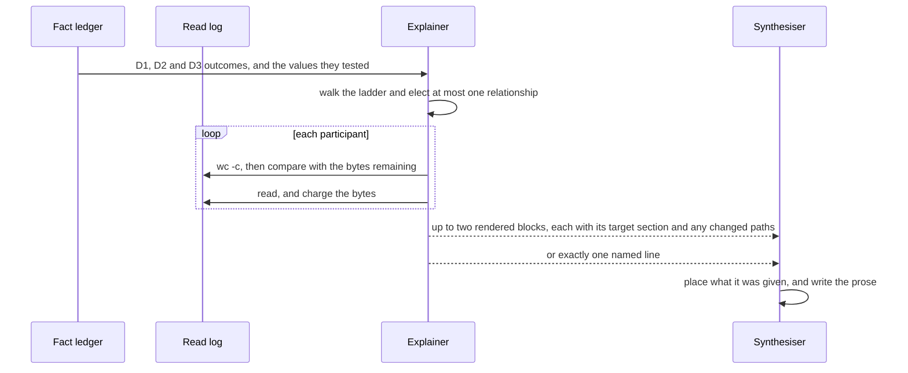
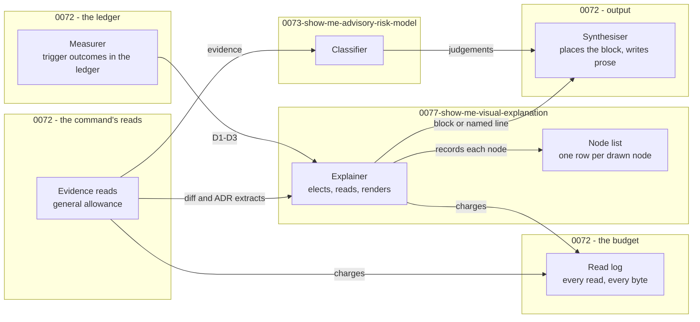

# 0077. Visual Explanation in `/spec:show-me`

Date: 2026-09-20

## Status

Accepted

## Context

Prose is bad at shape. Spec 0036's change touches 76 files under `src/` across six project
directories: a scope created in one project, adopted in another and disposed in a third. A reader
understands that faster from a picture than from the paragraph that describes it. But a picture is
also the fastest way for `/spec:show-me` to mislead. A diagram is read before the prose that
qualifies it, and nothing in a box-and-arrow sketch shows which boxes the command actually opened.

### Terms

- **Diagram** — `requirements.md` § *Definitions* states it, including which fenced blocks are not
  diagrams.
- **Explainer** — the stage that elects a relationship, reads source to draw it, and renders it. Key
  Components 1 states its rule.
- **Participant** — a file the Explainer reads to draw one relationship. Key Components 2 states how
  participants are chosen and paid for.
- **Node list** — the Explainer's record of every node it draws and the source that licenses it. Key
  Components 3 states it. It is not the fact ledger.
- **Reserve**, **read log**, **fact ledger** — see
  [0072-show-me-command-resolution-and-output](0072-show-me-command-resolution-and-output.md), whose
  *Terms* block states each.

### Scope

**Parent requirement**: [specs/0037-show-me/requirements.md](../../specs/0037-show-me/requirements.md)

**In scope**:

- FR-6 (a) — the trigger, read from the ledger (Key Components 4).
- FR-6 (b) — the raise and the stand-down, as rows of the decision ladder.
- FR-6 (c) — format by kind of relationship, and attribution of every node (Key Components 3).
- FR-6 (d) — the caps, checked over the assembled text before the `Write`.
- FR-6 (e) — the five named lines, and which ladder row emits each.
- FR-6 (f), NFR-3's reserve — which reads may spend the reserve, and the affordability rule for each
  read (Key Components 2).
- FR-14's optional tree — its placement, its `(unchanged)` nodes, and its tie to the path list (Key
  Components 5).
- FR-15's diagram rows — one `## Inputs used` row per source file the Explainer read.
- FR-16 row 12's diagram effect — the no-diff line.
- NFR-1 — which diagram fields are judged.
- NFR-7's diagram half — every node attributable to a listed input.

**Out of scope**:

- The ledger, the byte budget's size, the reserve's size, the command's other reads, and the
  `## Inputs used` table itself —
  [0072-show-me-command-resolution-and-output](0072-show-me-command-resolution-and-output.md).
- The risk level — [0073-show-me-advisory-risk-model](0073-show-me-advisory-risk-model.md). The risk
  step and the Explainer exchange nothing: neither's output is an input to the other.
- D1, D2 and D3's thresholds. FR-6 (a) states them and the measurement script implements them. This
  ADR re-decides neither.

### Where this ADR sits

| ADR | Decides |
| --- | --- |
| [0072-show-me-command-resolution-and-output](0072-show-me-command-resolution-and-output.md) | What the command is, how it resolves its target, what it measures and reads, and the shape of the file it writes |
| [0073-show-me-advisory-risk-model](0073-show-me-advisory-risk-model.md) | How the advisory risk level is computed, and how it stays advisory |
| **[0077-show-me-visual-explanation](0077-show-me-visual-explanation.md)** *(this one)* | When the command draws a diagram, what it may draw, and which stage may read source to draw it |
| [0078-spec-family-machine-readable-forms](0078-spec-family-machine-readable-forms.md) | The forms the `/spec` family writes so that a tool can read them, and the command that writes release notes in one of them |

The sentence that unifies all four: **every value a command states is counted by one tested script,
copied from a named source, or judged from evidence it can name, and no command writes outside what
it owns.**

### A picture that claims more than was read

The failure this ADR prevents is a diagram whose nodes the command never opened:

| What the command has | What it can truthfully draw |
| --- | --- |
| a list of changed paths | which files changed, and where each sits in the tree |
| the `src/`-scoped diff | which declarations changed, in which files |
| an ADR's *Consequences* extract | the components the ADR names |
| a source file read in full, or its relevant extract | which types that file declares, and what they call |

Only the last row carries a call relationship. A call flow drawn from the first three rows is a
guess that looks like a fact, and FR-6 (c) forbids it.

### The forces

- **A picture is mandatory when a test fires.** A fired test that produces neither a diagram nor a
  defined line does not conform (FR-6 (a), (e)).
- **Drawing truthfully needs source.** No other stage reads source files, and FR-6 (c) forbids
  drawing a structure the command has not read.
- **The budget is bytes, shared, and per run.** Diagram reads may spend what the rest of the run
  left, plus a reserve of 100,000 bytes that only they may spend. Two diagrams share that one reserve
  (FR-6 (f), NFR-3).
- **A wrong picture costs more than no picture.** A reader trusts a diagram faster than a sentence,
  and NFR-7 forbids asserting structure without evidence.
- **Two sections may carry a diagram, and they must agree.** `## What changed and why` and
  `## Where to look first` each allow one, and FR-14's path list must match a tree drawn there.
- **The trigger is mechanical and the drawing is judged.** NFR-1 fixes which may vary between runs.

## Decision

**Give source reads to one stage, the Explainer, and make every outcome either a fully attributed
diagram or exactly one named line.**

The Explainer takes the trigger from the ledger and elects at most one relationship for
`## What changed and why`. It probes every file before reading it against what the budget has left,
and it abandons a relationship it cannot complete rather than draw part of it. The Explainer runs in
the main agent, after the command's other reads and before the Classifier and
the Synthesiser. It hands over what Key Components 1 calls its output: at most two rendered blocks,
or a named line in place of the first. The Synthesiser places what it was given and draws nothing
itself.

### The mechanism, end to end

Six situations, tested in order. The first that applies decides the outcome for
`## What changed and why`.

| # | Situation | The Explainer | `## What changed and why` carries |
| --- | --- | --- | --- |
| 1 | The ledger's trigger fields are null, because no spec diff was measured | evaluates nothing, reads nothing | the no-diff line |
| 2 | No test fired, and the Explainer does not raise | reads nothing | the no-trigger line |
| 3 | A test fired, but the evidence does not cohere into one relationship — seen before reading, or found on reading | stands down; reads already made stay charged | the stand-down line |
| 4 | A relationship is elected — because a test fired, or as a raise with its one-sentence reason — and cannot be completed: a file it needs cannot be afforded, or, for a raise, reading shows no relationship after all | abandons the relationship; reads already made stay charged | after a fired test, the budget line; after a raise, the no-trigger line |
| 5 | A test fired, and the only relationship worth drawing is the path tree among three to seven changed files a reviewer should open first | reads, renders the tree, targets `## Where to look first` | the placed-elsewhere line |
| 6 | Any other elected relationship that could be afforded, including every raise | reads, renders the block | the diagram, plus the raise's reason when it was a raise |

The five named lines, quoted from FR-6 (e):

- **the no-trigger line**: `No diagram: {a} files changed under src/ across {b} director{y|ies}, {c}
  changed public API declaration lines, {d} ADRs — no structural relationship to draw.`
- **the stand-down line**: `No diagram: {which test(s)} fired, but {one-sentence reason the evidence
  does not cohere into a relationship}.`
- **the placed-elsewhere line**: `No diagram here: the change's shape is drawn as a path tree in ##
  Where to look first.`
- **the budget line**: `No diagram: the read budget was exhausted before the relationship could be
  read accurately.`
- **the no-diff line**: `No diagram: spec branch not determinable, so no change could be drawn.`

The values `{a}` to `{d}` in the no-trigger line are the ledger's, copied: `{a}` from the `src/`
bucket's file count, `{b}` from `src_subdirectory_count`, `{c}` from `public_api_lines` and `{d}`
from `adr_resolved_count`.

Three properties read off the ladder:

- **Every row ends in output.** Each row names exactly one diagram or one line, so the command never
  draws nothing and says nothing.
- **Nothing is drawn in part.** Rows 3 and 4 are the only ways out once reading has started, and
  neither draws. Reads already made stay in the read log and in `## Inputs used`.
- **The cheap outcomes stay cheap.** Rows 1 and 2 read nothing, and neither does row 3 when the
  stand-down is decided before reading.

A raise counts as exercised only when it draws, which is how AC-57 reads it, and a raise always
targets `## What changed and why` (row 6). A raise the Explainer abandons — because a file cannot
be afforded, or because reading shows no relationship after all — therefore leaves the no-trigger
line's condition true: no test fired, and no raise was exercised. The budget line and the
stand-down line both report a fired test, so neither applies to a raise.

### Where the pieces live

Two arrows carry this ADR's argument. The command's reads and the Explainer's reads both charge one
read log, which is why there is one budget. The Explainer renders its block only from the node list,
which is why a node with no recorded source cannot be drawn. What the Synthesiser receives is the
Explainer's output, as Key Components 1 states it. The node list stays in the run's transcript as
the attribution record. This ADR adds one stage to the command file. The front-matter entries it
relies on — `grep`, `wc`, `tail`, `head` and `git ls-files` — are all in 0072's `allowed-tools`;
nothing is added to `.claude/settings.json`.

### Key Components

The stage table is stated once, in
[0072-show-me-command-resolution-and-output](0072-show-me-command-resolution-and-output.md). This
ADR owns the Explainer's rule.

#### 1. The Explainer

| Input | Output |
| --- | --- |
| The ledger's D1, D2 and D3 outcomes and the values they tested; the `src/`-scoped diff and ADR extracts already in the read log | for `## What changed and why`, one rendered block or one named line; for `## Where to look first`, at most one rendered block — the row-5 tree or the optional diagram. Each block comes with its target section, and a block for `## Where to look first` comes with the three to seven changed paths it draws, from which the Synthesiser writes FR-14's list. The node list is kept as the attribution record |

Its rule: **it is the only stage that reads source files, and it draws nothing it has not read.** A
source file here is any file whose content the command opens only to draw a picture — a whole file
under `src/`, or an extract of one. The diff and the ADR extracts are the command's reads, made for
every section, and the Explainer uses them without reading them again.

Which relationship to draw is judged, and so is the format of a box-and-arrow sketch (NFR-1). There
is no mechanical ranking of candidate files: the ledger carries no per-file counts, and a ranking
the model computed would be a mechanically countable value, which 0072's seam leaves to the script.
The Explainer chooses its anchor from the diff it has read, and names it in the node list.

#### 2. Participants, and how each is paid for

A participant is a file the relationship needs: a changed file in the spec diff, a file an ADR
extract names, or a file a participant already read names. Every participant passes
`git ls-files --error-unmatch` before it is read, so an untracked path cannot become a node.

The Explainer spends in this order:

1. **Probe the known set first.** Before its first read, it runs `wc -c` on every participant it can
   already name, and plans which to read whole and which to extract. `wc -c` is free, so planning
   costs nothing. The probe alone never abandons a relationship, because an extract may fit where
   the whole file does not.
2. **Probe each file before reading it.** A participant found while reading — a caller named in a
   file already read — is probed before it is opened.
3. **Read whole, or extract, or abandon.** A file that fits is read whole. A file that does not fit
   is read by targeted extraction of the members the relationship needs, recorded as
   `used (targeted extraction)`. If not even the extract fits, the relationship is abandoned.

Every Explainer read follows 0072's window rule. These files are not in the ledger, so their windows
are unplanned: each is sized with `wc -c` before it is read, halved until it fits 25,000 bytes, and
charged the bytes it brought in. An extraction is located by a `grep -n -F` for the literal member
names the relationship needs, never by a pattern. That `grep` is itself an unplanned window, sized
first and charged its output, and the lines it finds are then read as windows.

The bytes remaining are whatever the general allowance has left plus the reserve. Only the
Explainer's reads may spend the reserve. When a run draws a second diagram — the optional tree in
`## Where to look first` — it spends from the same remainder, so the two share one reserve (AC-63).

Every read the Explainer makes is charged to the read log. Each source file it reads, in however
many windows, gets one `## Inputs used` row, whether or not a diagram is drawn from it (FR-15).

#### 3. Attribution by projection

Before rendering, the Explainer writes one node-list row per node. The row names the node and the
source that licenses it, which is exactly one of:

| Source | Licenses a node that names |
| --- | --- |
| a path in the spec diff | that file |
| a declaration line in the `src/`-scoped diff | the type or member that line declares |
| an ADR stem from `.adr-list` | a component or type the ADR's extract names |
| a path in the read log, read by the Explainer | that file — marked `(unchanged)` when it is not in the spec diff — or a type or member read in it |

The block is rendered from the node list, so a node with no row cannot be drawn. A diff path alone
licenses only a node naming the **file**. A type or member node needs a declaration line in the
diff, an Explainer read, or an ADR. A call between two nodes needs a read that shows the call. A node
that names a path is written only if the path is tracked in git (FR-17). A tree node that is not in
the spec diff is marked `(unchanged)` (FR-14).

What can be checked from the written file alone is the caps, the block-or-line exclusivity, and that
every path-shaped label is tracked. Whether a node label names a type the command opened is not
decidable by a pattern over free text; the node list, in the run's transcript, answers it, which is
where AC-34 and AC-56 look.

#### 4. The trigger

The measurement script records, as ledger fields, whether each of D1, D2 and D3 fired and the values
each tested. When no diff was measured, those fields are null, and ladder row 1 applies without
evaluating anything (AC-61). On spec 0036 all three fire: 76 files under `src/` across six
subdirectories, 131 changed public API declaration lines, and seven resolved ADRs.

The Explainer never re-evaluates a test. Whether a test fired is mechanical and identical between
runs (NFR-1). What the Explainer judges begins after that: whether the evidence coheres (row 3),
whether to raise (row 4 or 6), and what to draw.

#### 5. Placement, and the tie to FR-14's path list

The Explainer decides placement before the Synthesiser writes anything. When it elects the path tree
(row 5), it fixes the tree's node set, and the Synthesiser draws FR-14's three to seven paths from
the tree's changed nodes. The dependency runs one way: the Explainer cannot wait for a path list that
does not exist yet, and the Synthesiser cannot be handed a tree of files its list omits. The
Explainer therefore elects a tree only with three to seven changed nodes, which is FR-14's three-to-seven range for
the path list; a list of fewer than three paths gets no tree. A relationship among more changed files is drawn at a coarser grain, or in
`## What changed and why` under row 6. Unchanged nodes, marked `(unchanged)`, do not count toward
the range.

When the main diagram sits in `## What changed and why` (row 6), the Explainer may also draw
`## Where to look first`'s optional diagram: a tree or sketch of how the listed paths relate, by
containment or by which file calls which (FR-14). It chooses three to seven changed paths, draws
the diagram over them, and hands them over with it, so FR-14's list and the diagram name the same
files. It draws from what it has already read or can still afford. Not drawing it needs no line,
and the Synthesiser then chooses FR-14's paths itself.

After any other row, `## Where to look first` carries no second diagram. Rows 2 and 3 have just
stated that the change has no relationship worth drawing, and a picture beside that line would
contradict it. Row 4 abandoned its relationship, for want of budget or, after a raise, because
reading showed none. Row 5's tree already occupies the section, and row 1 has no diff to draw from.

#### 6. The caps, checked before the `Write`

Over the assembled text, before the one `Write`, the command confirms that:

- there are at most two fenced blocks, and each is a diagram;
- each block is at most 40 lines including its fences, and no line exceeds 100 characters;
- `## What changed and why` holds exactly one of a block or a named line;
- every path-shaped node label is tracked in git.

These are checks on the command's own output, not measurements, so they sit on the command's side of
0072's seam. They are a model-checked target, not a guarantee. 0072's defect table shows the model
can miscount, and nothing mechanical backs these four checks. A rendered Mermaid block also follows
`.agent_instructions/documentation.md`'s trap list: no `;` inside a `sequenceDiagram`, no `<` or `>`
in a label, no HTML entities, and quoted labels where a label carries a comma, colon or parenthesis.

#### Where each artefact is touched

| Path | Change |
| --- | --- |
| `.claude/commands/spec/show-me.md` | The Explainer step, the ladder and the five named lines, the node-list row shape, and the pre-`Write` checks |

Deliberately unchanged: the measurement script, whose trigger fields and `adr_resolved_count` are
0072's, and the test script, which has no diagram row because a diagram is judged.

### Technology Choices

#### Why the Explainer runs inline rather than in a sub-agent

- **The budget must be observable to be enforced.** The read log is the budget. A sub-agent's reads
  happen in its own context, so the main agent would receive a reported total where it needs the
  log itself (AC-63).
- **A sub-agent is one-shot.** It cannot ask how many bytes remain at the moment a participant turns
  out to be larger than expected.
- **Delegation saves nothing.** The budget is per run, so the same files are read either way, one
  context further from the node list that has to attribute them.

#### Why the format follows the relationship

FR-6 (c) fixes two of three cases: a sequence, call flow or lifecycle is a Mermaid block, and a file,
type or namespace hierarchy is an ASCII tree in a plain fenced block. Only a box-and-arrow sketch is
a choice. The rule holds in both sections: whichever section carries a diagram, the kind of
relationship decides its format. A call flow among FR-14's paths is a Mermaid block, a tree shows
containment only, and a box-and-arrow sketch of which file uses which may take either form.

#### Why affordability is per read, with a free first probe

The participant set is not fully known before reading, because a file can name a caller. A single
up-front test would therefore either forbid those callers or promise more than it can check. Probing
every file before it is opened keeps FR-6 (f)'s rule — never open a file the remaining bytes will not
cover — and the first probe over the known set lets the Explainer plan whole reads and extracts
before it spends anything.

#### Why the caps are not re-derived

FR-6 (d) states them, and NFR-2 already excludes fenced lines from the word count, so a diagram costs
no prose budget. The worst case — two blocks of 40 lines at 100 columns — is the case the checks are
written against.

### Implementation Approach

Numbered in commit order, in the command file.

1. **Behavioural.** State the ladder, the five named lines quoted outside any table, and the node-list
   row shape in the command file.
2. **Behavioural.** The Explainer step: read the trigger fields from the ledger; walk the ladder;
   probe, read or extract, charge the read log; write the node list; render; record the target
   section.
3. **Behavioural.** Placement: the Synthesiser places each block or the line, and writes FR-14's
   paths from the changed paths handed over with a block for `## Where to look first`, when there
   is one.
4. **Behavioural.** One `## Inputs used` row per source file the Explainer read, with its mark.
5. **Behavioural.** The pre-`Write` checks in Key Components 6.

## Consequences

### Positive

- **Every outcome is defined.** Each ladder row ends in a diagram or a quoted line.
- **A partial diagram cannot exist.** Abandonment draws nothing, and every read already made stays
  visible in `## Inputs used`.
- **The budget is one log, not a second allowance.** The Explainer spends from what the run left
  plus the reserve, so two diagrams cannot exceed one reserve.
- **Attribution is a projection.** A node exists only as a node-list row with a source.
- **The trigger costs nothing and cannot drift.** The script evaluates it once, and the model copies
  the outcome.
- **The read right is scoped.** One stage reads source files, and it cannot set a risk level.

### Negative

- **Attribution is not checkable from the file alone.** The type question needs the node list in the
  transcript.
- **The caps are checked by the model.** Line counts and line widths are counted over the model's
  own output, with no mechanical backstop, and a miscount can ship a block over 40 lines or 100
  columns.
- **The Explainer can starve nothing but itself.** It runs after the command's other reads, so it
  spends only what they left. On a spec larger than spec 0036, that can be little more than the
  reserve.
- **Electing the tree narrows the path list.** A file the tree leaves out cannot be the reviewer's
  first stop.
- **Two runs may draw different pictures.** NFR-1 names the relationship, its contents and the sketch
  format as judged.
- **A 40-line cap on a large change forces a coarse grain.** A box labelled with a project name
  claims more than the one file read inside it.
- **The command emits Mermaid it never renders.** A block that fails to parse reaches the reader as a
  wall of text.

### Risks and Mitigations

- **Risk: a type node is drawn from a filename** without the file being read.
  *Mitigation*: the node list admits three sources, and a diff path licenses only a file node.
- **Risk: a later edit gives diagrams their own allowance.**
  *Mitigation*: FR-6 (f) and NFR-3 state one per-run budget, AC-63 tests it, and the read log has no
  second column to spend from.
- **Risk: a named line is chosen by its position in a list** rather than by its condition.
  *Mitigation*: the ladder names each line by condition, and the command file quotes them by name.
  AC-57, AC-58, AC-61, AC-64 and AC-65 assert the text.
- **Risk: a Mermaid block fails to render on GitHub.**
  *Mitigation*: the trap list is a rendering rule in the command file, not advice.
- **Risk: the tree and FR-14's path list drift apart** in a later edit.
  *Mitigation*: the list is drawn from the tree's nodes, and the pre-`Write` checks run where both
  exist.

## Alternatives Considered

### Alternative 1: Delegate the Explainer to a sub-agent

Hand the trigger and the diff to a sub-agent, let it read source in its own context, and have it
return a block and a node list.

**Rejected, though the case for it is real.** Reading source is the most context-hungry work in the
command, and sub-agents exist for that shape of work. But the read log is a shared budget, and a
sub-agent's reads are invisible to the agent that owns it. A sub-agent is also one-shot, so it cannot
consult the remaining bytes when a participant grows. And delegation saves nothing, because the
budget is per run.

### Alternative 2: Let the Classifier read source and draw

Give the diagram to the Classifier, since it already turns evidence into structured judgements.

**Rejected on least privilege.** The Classifier's judgements set the risk level. Granting it source
reads would put the one stage that reads code in charge of the headline level. With the right on the
Explainer, the stage that reads source cannot change a level, and the stage that sets a level does
not read source.

### Alternative 3: Let the Synthesiser draw while it writes

Treat a diagram as part of writing the section, with no separate stage.

**Rejected because placement must be settled before writing starts.** When the tree is elected, it
fixes FR-14's path list, so the decision must precede the section that prints that list. A separate
stage also gives the reserve exactly one spender, which keeps the rule "only diagram reads spend the
reserve" a property of which stage is reading.

### Alternative 4: Draw from the diff alone

Build the picture from changed paths, line counts and declaration lines, and read no source.

**Rejected because it produces confident fiction.** A path list carries containment and nothing
else. Which file calls which, and in what order, cannot be recovered from a path, and FR-6 (c)
forbids drawing structure the command has not read. The honest cheap option already exists: ladder
row 2 states the four measured values and draws nothing.

### Alternative 5: A mechanical ranking of candidate files

Rank changed `src/` files by their public API declaration lines, then by changed lines, and anchor
the relationship on the first.

**Rejected.** The ledger carries no per-file counts, so the model would compute the ranking itself,
and a count over the diff is mechanically countable, which 0072's seam leaves to the script. Moving
it into the script would add a per-file list to a ledger designed to carry none. The ranking also
made only the anchor stable, never the drawing, and the drawing is judged either way.

### Alternative 6: A separate budget for diagram reads

**Rejected.** NFR-3 states one budget for the run, and AC-63 asks for the total across both diagrams
with no per-diagram allowance. Two budgets make the true ceiling a sum that no criterion states.

### Alternative 7: No visual capability

Write the relationship as a sentence and let a reader open the files.

**Rejected.** It costs nothing and cannot draw anything false. But it gives up what the section is
weakest at: six project directories and 131 changed declaration lines do not fit in a paragraph a
reader can hold. What this ADR keeps from the alternative is its discipline — draw only when a stated
test fires or a stated reason raises, draw only what was read, and never omit the line that says why
there is no picture.

## References

- Requirements: [specs/0037-show-me/requirements.md](../../specs/0037-show-me/requirements.md) — FR-6's
  `##### Visual explanation` (a)–(f), FR-14, FR-15, FR-16 row 12, FR-17, NFR-1, NFR-3, NFR-7, and the
  *Diagram* definition.
- Related ADRs:
  - [0072-show-me-command-resolution-and-output](0072-show-me-command-resolution-and-output.md) — the
    ledger's trigger fields, the budget and reserve, the read log, and the stage table.
  - [0073-show-me-advisory-risk-model](0073-show-me-advisory-risk-model.md) — the Classifier, which does
    not read source files.
  - [0078-spec-family-machine-readable-forms](0078-spec-family-machine-readable-forms.md) — the fourth
    ADR of the set, which this one does not depend on.
  - [0071-tdd-review-gear](0071-tdd-review-gear.md) — the other ADR that decides a `/spec:*` command's
    own behaviour rather than Brighter's runtime.
- Conventions and prior art in this repository:
  - [`.agent_instructions/documentation.md`](../../.agent_instructions/documentation.md) —
    § *Diagrams in ADRs*, whose Mermaid trap list the command applies to the blocks it emits.
  - [`.claude/commands/spec/README.md`](../../.claude/commands/spec/README.md) — the sub-agent policy,
    including that a sub-agent starts with a clean context and is one-shot.
- External references: PR [#4282](https://github.com/BrighterCommand/Brighter/pull/4282) — spec 0036's
  pull request, the calibration case: 76 files under `src/` across six subdirectories, 131 changed
  public API declaration lines, and seven resolved ADRs.
