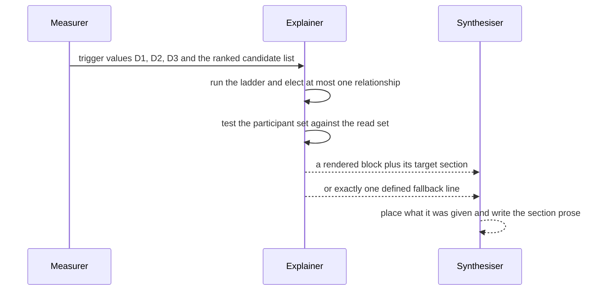
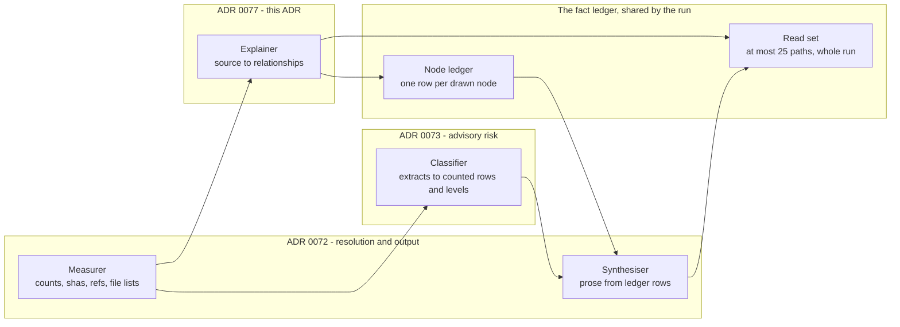

# 0077. Visual Explanation in `/spec:show-me`

Date: 2026-09-20

## Status

Proposed

## Context

Spec 0037's `/spec:show-me` writes one file that answers "what did we build, and what deserves a
second look?". Prose is bad at shape. A reader who wants to know how a change is arranged reads a
picture faster than the paragraph that describes it, and spec 0036's change touches 76 files under
`src/` across six project directories.

A picture is also the fastest way for the command to lie. A diagram looks authoritative, it is read
before the prose that qualifies it, and nothing in a box-and-arrow sketch tells a reader which boxes
the command actually opened. Drawing a call flow truthfully means reading the code that makes the
call — and every stage the sibling ADRs define is forbidden to do that.

**Parent Requirement**: [specs/0037-show-me/requirements.md](../../specs/0037-show-me/requirements.md)

**Scope**: This ADR decides one thing — **when `/spec:show-me` draws a diagram, what it may draw, and
which stage may read source code in order to draw it truthfully**. It discharges FR-6's
`##### Visual explanation` in full, FR-14's optional-tree clause, the `Diagram` definition, NFR-3's
per-run budget sentence, NFR-7's diagram half, and FR-15's one-row-per-file-read obligation.

It does **not** decide command invocation, target resolution, the fact ledger or the output file's
structure — [ADR 0072](0072-show-me-command-resolution-and-output.md) owns those. It does not decide
the advisory risk level or the Classifier's contract —
[ADR 0073](0073-show-me-advisory-risk-model.md) owns those.

### Terms

Written as pointers, because the content already exists and a second statement of it would drift:

- **Diagram** — `requirements.md`'s Definitions table states it, including which fenced blocks are
  not diagrams.
- **Public API declaration line**, **Immediate subdirectory of `src/`** — the same table states both,
  with the exact POSIX pattern outside the table.
- **Read set** — Key Components 2 states it.
- **Participant set** — Key Components 3 states it.
- **Node ledger** — Key Components 4 states it.

### Where this ADR sits

| ADR | Decides |
| --- | --- |
| [0072](0072-show-me-command-resolution-and-output.md) | What the command is, how it resolves its target, and the shape of the file it writes |
| [0073](0073-show-me-advisory-risk-model.md) | How the advisory risk level is computed, and how it stays advisory |
| **[0077](0077-show-me-visual-explanation.md)** *(this one)* | When the command draws a diagram, what it may draw, and which stage may read code to draw it |

The sentence that unifies all three: **the command states only what it has measured, names what it
measured it from, and changes nothing.**

### Why this decision is not part of ADR 0073

ADR 0073 decides how a level is computed and kept advisory. This ADR decides what a picture may
claim. The two questions share a document only by accident of both living inside one prompt file.

The separation is load-bearing for one reason. Drawing needs a read right that scoring does not.
ADR 0073 keeps the Classifier on Measurer-produced extracts and defers the direct-source-read right
here, so the relaxation lands on the one stage that needs it. Folding the drawing rules into ADR 0073
would have made the risk ADR the owner of a read-right relaxation, and a future reader loosening the
Classifier would find the justification for it filed under the Classifier's own heading.

### The forces

- **The picture is mandatory when a test fires.** FR-6 (a) names three trigger tests, and a fired
  test that produces neither a diagram nor a defined line is non-conforming.
- **Drawing truthfully needs source.** A `--name-only` file list carries no call relationship, and
  FR-6 (c) forbids drawing a structure the command has not read.
- **No existing stage may read source.** The Measurer emits counts, the Classifier is confined to
  extracts, and the Synthesiser takes the ledger in and puts prose out.
- **The read budget is small and shared.** NFR-3 allows 25 full file reads for the whole run, and
  `requirements.md` and `## Where to look first` already draw on the same 25.
- **A wrong picture costs more than no picture.** A reader trusts a diagram faster than a sentence,
  and NFR-7 forbids asserting structure the command has no evidence for.
- **Two sections may carry a diagram.** `## What changed and why` and `## Where to look first` each
  permit one, and the two placements must stay consistent with each other.
- **The trigger is mechanical and the drawing is judged.** NFR-1 fixes which of the two may vary
  between runs, and the design has to keep them apart.

Requirements behind these forces: FR-6 (a), FR-6 (c), FR-6 (d), FR-6 (f), FR-14, FR-15, NFR-1,
NFR-3, NFR-7.

## Decision

**Add one stage, the Explainer, as the only stage permitted to read source directly; let it elect at
most one relationship per section from a mechanically ranked candidate list; make it prove the whole
relationship is affordable against a single shared per-run read set before its first read; and have
it render either a diagram or exactly one of FR-6 (e)'s defined lines.**

The Explainer runs inline in the main agent as a new step between measurement and synthesis. It
produces a rendered fenced block and the section that block belongs in, or a fallback line and its
parameters. The Synthesiser then places what it was given, and writes no diagram of its own.

### The mechanism, end to end

Seven situations, evaluated in this order, each with one defined output. The ladder is the whole of
FR-6 (a), (b), (e) and (f):

| # | Situation, tested in this order | The Explainer does | `## What changed and why` carries |
| --- | --- | --- | --- |
| 1 | Step 3 recorded the spec branch as not determinable | evaluates no trigger test and reads nothing | `No diagram: spec branch not determinable, so no change could be drawn.` |
| 2 | D1, D2 and D3 all fail, and the Explainer does not raise | reads nothing | `No diagram: {a} files changed under src/ across {b} director{y\|ies}, {c} changed public API declaration lines, {d} ADRs — no structural relationship to draw.` |
| 3 | D1, D2 and D3 all fail, and the Explainer raises under FR-6 (b) | states its one-sentence reason, then continues at row 5 | the diagram, plus that reason |
| 4 | A test fired, but its evidence does not cohere into one relationship | stands down and reads nothing | `No diagram: {which test(s)} fired, but {one-sentence reason the evidence does not cohere into a relationship}.` |
| 5 | A relationship is elected, and its unread participants outnumber the read set's remaining places | abandons the relationship before its first read | `No diagram: the read budget was exhausted before the relationship could be read accurately.` |
| 6 | The elected relationship is the path tree among at least three changed reviewer-start files | reads, renders the tree, and targets `## Where to look first` | `No diagram here: the change's shape is drawn as a path tree in ## Where to look first.` |
| 7 | Any other elected, affordable relationship | reads, renders the block, and targets `## What changed and why` | the diagram, and no `No diagram` line |

Three properties read off the ladder. Every row terminates in output, so there is no path on which the
command draws nothing and says nothing. Row 5 is tested before any read happens, so a partial picture
has no way to exist. Rows 1, 2 and 4 spend no budget at all, so the cheap outcomes stay cheap.

Where each row sits in the run:



The Explainer sits after measurement because all three trigger values are Measurer output. It sits
before synthesis because ADR 0072 forbids a new read during Step 6, and a diagram needs reads.

### Where the pieces live



Two arrows carry this ADR's whole argument. The Explainer and the Synthesiser both charge the same
read set, which is why there is one budget. The Synthesiser reaches a diagram's contents only through
the node ledger, which is why a node with no recorded source cannot be drawn.

Nothing new is introduced in the command's tool surface, its front matter, or `.claude/settings.json`.
This ADR adds one stage and two ledger projections, all inside the existing prompt file.

### Key Components

#### The procedure's stages, and the rule each one holds

The command is one prompt file, not a program, so these are named stages of a single ordered
procedure rather than components. The names matter only because each carries a rule the stage after
it depends on:

| Stage | Where | The rule it holds |
| --- | --- | --- |
| Measurer | ADR 0072, Steps 3–5 | Produces every value NFR-1 requires identical between runs, and never paraphrases |
| Explainer | this ADR, Step 5D | The only stage that may read source; draws nothing it has not read |
| Classifier | ADR 0073, Step 6.b | Reads only what the Measurer extracted, and never re-derives its own input |
| Synthesiser | ADR 0072, Step 6 | Writes all prose, runs no shell call, and counts nothing |

The Explainer passes nothing to the Classifier and takes nothing from it. A level and a picture share
no input and no output, and saying so keeps a later reader from wiring them together.

#### 1. Why the reading stage is separate from the other three

Drawing needs a capability no other stage has, and giving it to one of them would cost that stage the
rule it exists to hold:

- **The Measurer** produces counts, shas, refs and file lists. A relationship is none of those, and
  ADR 0072 forbids it to paraphrase — which is exactly what reading source to find a call flow is.
- **The Classifier** applies a stated rule to an extract and yields a level. No stated rule turns a
  file list into a call flow, and ADR 0073 confines it to extracts on purpose.
- **The Synthesiser** takes the ledger in and puts prose out, with no new reads during Step 6. A
  diagram is neither prose nor ledger-derived, and drawing one needs the reads that rule forbids.

So the reading happens in its own stage, before synthesis begins. Which relationship it draws, and in
which format for a box-and-arrow sketch, are judged rather than mechanical — NFR-1 says so, and this
ADR does not claim otherwise.

#### 2. The read set — one budget, expressed as a cardinality

The run holds one set of paths read in full. Its members are ledger rows. The budget rule is
`|read set| ≤ 25`, and that is the whole of it.

- **Re-reading is free.** A path already in the set costs nothing to read again, because adding a
  member that is present does not change a set's size. The Explainer and `## Where to look first`
  therefore share their overlap rather than paying twice for it.
- **The order of spend is stated**: `requirements.md` at Step 5, then the Explainer's participants at
  Step 5D, then `## Where to look first`'s on-demand reads at Step 6.
- **Targeted ADR extraction is excluded**, exactly as NFR-3 states and ADR 0072's budget table already
  records.
- **`PROMPT.md` and its companions stay outside the projection.** ADR 0072 gives them no ledger row so
  they cannot surface in `## Inputs used`. A read of one still occupies a place in the read set,
  because NFR-3 counts files read in full, not files cited.

Expressing the budget as a set's cardinality is the same move ADR 0072 made with `other` as a bucket
complement: the arithmetic an acceptance test checks becomes an identity rather than a counter someone
has to remember to increment. AC-63 asks for the total across the whole run, including both diagrams,
and the set answers that question directly.

**There is no second budget and no per-diagram allowance.** A run drawing two diagrams reads at most
25 files in full.

#### 3. Selection — a mechanical ranking, a judged relationship, an affordability test

The Explainer chooses files in three stages, and only the middle one is judged.

**The candidate ranking.** One `awk` pass over the elected diff produces one line per changed file
under `src/`, carrying that file's count of changed public API declaration lines. The executing model
orders the list by three keys, which together make the order total:

1. changed public API declaration lines, descending;
2. changed lines from `--numstat`, descending;
3. path, ascending in byte order.

The list is at most a few dozen short lines, and ordering it in the model rather than in a pipeline
follows ADR 0072's precedent for the spec-name match: `sort` is not in the granted tool surface, and a
shell pipeline that needs quoting discipline is the kind of detail that rots. On spec 0036 the ranking
puts `src/Paramore.Brighter/HandlerLifetimeScope.cs` first with eleven changed declaration lines,
ahead of `src/Paramore.Brighter.Extensions.DependencyInjection/ScopeConfigurationRules.cs` with seven.

**The participant set.** The highest-ranked candidate is the anchor. The Explainer names, before it
reads anything, the complete set of files the relationship needs. Membership is bounded: a participant
is a changed file in the spec diff, or a file named by an ADR extract already in the ledger, or a file
named by a participant already read. Every participant passes
`git ls-files --error-unmatch {path}` before it is read, which puts FR-17's tracking test ahead of the
read instead of only ahead of the write, and keeps an untracked path out of a diagram node by
construction.

**The affordability test.** The Explainer compares the participants it has not already read against
the read set's remaining places. If they do not fit, it abandons the relationship and emits the budget
line. It does not start reading and then stop, and it does not re-scope the relationship to fit what
is left. Checking before the spend is what makes ladder row 5 a guarantee rather than an intention.

#### 4. Attribution, made checkable by projection

FR-6 (c) requires that a diagram never name a type the command has not read. The mechanism is the one
ADR 0072 used for `## Inputs used`: make the output a projection of a ledger, so an unattributed claim
has nowhere to appear.

The Explainer emits a **node ledger** row per node before the block is rendered, in the ledger's
existing five-column shape, whose source column is one of exactly three things:

| Source | Meaning |
| --- | --- |
| a spec diff path | the node names a file the diff changed |
| an ADR slug | the node names a type or component an `.adr-list` ADR's extract names |
| a read-set path | the node names a type the Explainer read in that file |

The block is rendered from the node ledger, so a node with no row cannot be drawn. Every read-set
member then projects into `## Inputs used` as its own row, which discharges FR-15's one-row-per-source
-file obligation and lets AC-63's count be taken from the written file rather than from the transcript.

Two checks run over the written file, and both are mechanical:

```bash
grep -c '^```' specs/{dir}/show-me.md                                        # 0, 2 or 4 — at most two diagrams
awk '/^```/{if(!b){s=NR;b=1}else{print NR-s+1;b=0}}' specs/{dir}/show-me.md  # each ≤ 40
awk '/^```/{i=!i;next} i && length($0)>100 {c++} END{print c+0}' specs/{dir}/show-me.md  # must be 0
```

The fence-count check is only valid because the `Diagram` definition forbids a fenced block that is
not drawing a relationship, so a log excerpt or a command cannot appear and inflate the count.

**Attribution itself is not reducible to one `grep`.** ADR 0073 could reduce FR-13 to a single pattern
because it was searching for a conditional in a known vocabulary. A diagram's node labels are free
text, so no regex over `show-me.md` decides whether a label names a type the command opened. What is
checkable from the file alone is the caps, the exclusivity of block-or-line, and the tracked status of
every path-shaped label. The type question is answered by the node ledger in the transcript, which is
where AC-34 already looks.

#### 5. Where the trigger is evaluated, and how two placements stay consistent

The trigger is evaluated at the end of measurement, in a new **Step 5D**, because all three tests read
values the Measurer has already produced:

| Test | Input | Produced by |
| --- | --- | --- |
| D1 | files changed under `src/`, and distinct immediate subdirectories of `src/` | Step 5 blast radius |
| D2 | changed public API declaration lines | Step 5 blast radius |
| D3 | `.adr-list` entries that resolved to a file | Step 5 ADR resolution |

Deciding the trigger therefore costs no measurement, and two runs over the same tree reach the same
decision, which is what NFR-1 requires of the firing itself. On spec 0036 all three fire: 76 files
across six subdirectories, 131 changed declaration lines, and seven resolved ADRs.

Ladder row 1 is tested first and short-circuits the rest. When no diff was measured the trigger tests
are not evaluated at all, which is what AC-61 asks for.

**Placement is decided at Step 5D, not at Step 6.** `## What changed and why` carries the diagram
unless the only drawable relationship is the path tree among the reviewer's starting files. When the
Explainer elects the tree, it fixes the tree's node set at Step 5D, and the Synthesiser draws FR-14's
3–7 paths from that tree's changed nodes at Step 6. The dependency runs one way only. The Explainer
cannot wait for a list the Synthesiser has not written, and the Synthesiser cannot be handed a picture
of files its list omits. The Explainer therefore never elects a tree with fewer than three changed
nodes, because FR-14's floor is three paths.

This is the same shape ADR 0073 found for the risk table: **print order is not computation order.**
`## Where to look first` is printed seventh and its path list is now constrained by a decision taken
before the first section was written.

**Each fallback line is identified by its condition, never by its position.** FR-16 row 12, FR-6 (b)
and FR-6 (f) each cite a line in FR-6 (e) by ordinal, and the three ordinals do not agree with the
order of (e)'s list. AC-58, AC-61 and AC-65 quote the line text instead, so the text is the identifier
that holds. The ladder table above quotes each line in full for that reason.

### Technology Choices

#### Why the Explainer runs inline rather than in a sub-agent

Reading source to understand structure is the most context-hungry work in the command, which is the
real case for delegation. It is rejected on three counts, and the first is specific to this ADR:

- **A shared budget must be observable to be enforced.** The read set is the budget. A sub-agent's
  reads happen in its own context, so the main agent would receive a reported count rather than a set
  it holds. AC-63 asks for the total files read across the entire run, and a reported number is an
  assertion where a set is a measurement.
- **A sub-agent is one-shot.** `.claude/commands/spec/README.md` records that it runs to completion
  and returns, so it cannot ask how many places are left when its participant set turns out larger
  than it assumed. The affordability test in Key Components 3 needs the remaining count at the moment
  of the decision.
- **Delegation saves no budget.** The same participants are read either way, because the cap is per
  run. Delegation moves where the reads land and adds a summarisation layer the main agent cannot
  check, which is precisely what the node ledger exists to avoid.

Both siblings reached the same answer on their own evidence, so the command stays a single-agent
procedure throughout.

#### Why the format follows the relationship, not the author

FR-6 (c) fixes two of the three cases: a sequence, call flow or lifecycle is a Mermaid block, and a
file, type or namespace hierarchy is a plain fenced ASCII tree. Only a box-and-arrow sketch is a
choice, and NFR-1 names that one choice as judged. This ADR re-decides none of it. The rule it does
add is the consequence: a relationship that needs a call edge is a Mermaid block in
`## What changed and why`, so the FR-14 tree never becomes the place a call flow hides.

#### Why the caps are not re-derived

FR-6 (d) states at most two diagrams, each at most 40 lines including its fences and at most 100
characters per line. NFR-2 excludes fenced lines from the word count, so a diagram costs no prose
budget. The worst case is therefore two blocks of 40 lines at 100 columns — 80 lines and about 8,000
characters — and that is the figure the caps check is written against, not a typical diagram.

#### No new tools and no allow-list change

`Read`, `Grep`, `Glob`, `Bash(git diff:*)`, `Bash(git ls-files:*)` and `Bash(awk:*)` are already in
the command file's front matter. The Explainer needs nothing else, so Out of Scope's "no change to
`.claude/settings.json`'s allow-list" is intact, as it is for both siblings.

### Implementation Approach

#### Step 5 — two additions to blast radius (structural)

1. **Structural.** Emit the distinct immediate-subdirectory count, which D1's second clause and
   NFR-1 both require and which the command file does not currently compute:

   ```bash
   FILES | awk -F/ '$1=="src" && NF>2 {s[$2]=1} END {n=0; for (k in s) n++; print n}'
   ```

   The `NF>2` guard is what makes `src/Directory.Build.props` count toward files under `src/` while
   contributing no subdirectory, which is AC-67's case and the only such file in the repository.
2. **Structural.** Emit the per-file public API declaration-line list that feeds the candidate
   ranking, as one `awk` pass tracking the current file from the `+++ b/` header — the same shape the
   command file already uses for the PR diff source.

#### Step 5D — trigger, election and reads (behavioural)

3. **Behavioural.** Walk the ladder in its stated order. Row 1 first, then rows 2 and 3, then row 4,
   then row 5, then rows 6 and 7.
4. **Behavioural.** On election, name the participant set, run `git ls-files --error-unmatch` over each
   member, test affordability against the read set, and only then read.
5. **Behavioural.** Emit one node-ledger row per node, then render the block, then record its target
   section. Apply `.agent_instructions/documentation.md`'s mermaid trap list to the rendered block:
   no `;` in a `sequenceDiagram`, no `<` or `>` in a label, no HTML entities, and quoted labels where
   a label carries a comma, colon or parenthesis.

#### Step 6 — placement only (structural)

6. **Structural.** `## What changed and why` carries the block, or exactly one fallback line quoted
   verbatim from the ladder. It never carries both and never carries neither.
7. **Structural.** When the Explainer targeted `## Where to look first`, the Synthesiser draws its 3–7
   paths from the tree's changed nodes, marks every node absent from the spec diff `(unchanged)`, and
   writes the ordering and the ≤ 25-word reasons. The tree consumes no path slot.
8. **Structural.** `## Inputs used` gains one row per read-set member, carrying why the file was read.

#### Step 7 — assertions before the single `Write` (behavioural)

9. **Behavioural.** Over the assembled text, assert: at most two fenced blocks; each at most 40 lines
   and 100 columns; `## What changed and why` holds exactly one of a fenced block or a fallback line;
   every path-shaped node label is tracked in git; every read-set member has an `## Inputs used` row.

#### Step 8 — no change

10. NFR-2's word count already excludes every line from an opening fence through its closing fence, so
    a diagram moves no counted word. The budget self-check is untouched.

## Consequences

### Positive

- **Every refusal produces defined output.** The ladder has seven rows, each terminating in a diagram
  or a quoted line, so there is no path on which the command draws nothing and explains nothing.
- **A partial diagram cannot exist.** Affordability is tested before the first read, so budget
  exhaustion is discovered while the cost of stopping is zero.
- **The budget is one identity, not two counters.** `|read set| ≤ 25` answers AC-63 directly, makes
  overlapping reads free, and leaves no place for a per-diagram allowance to be reintroduced.
- **Attribution is a projection.** A node is drawn only from a node-ledger row, and every file read
  appears in `## Inputs used`, so an unattributed symbol has nowhere to come from.
- **The trigger costs nothing and cannot drift.** All three tests read values `## Blast radius` and
  `## Inputs used` already publish, so the firing decision is reproducible and visible in the same
  document that depends on it.
- **The read right is scoped to the stage that needs it.** The Classifier keeps its narrow rule, and
  a future reader asking why one stage may read source finds the answer under that stage.
- **The tool surface is unchanged.** No new `gh` verb, no new `git` subcommand, no settings edit.

### Negative

- **Attribution is not checkable with one `grep`.** ADR 0073 reduced FR-13 to a single pattern over
  the command file. The type-attribution rule needs the node ledger in the transcript, so the
  strongest external check on the file alone is the caps and the tracked-path test.
- **The Explainer can starve `## Where to look first`.** It spends before the Synthesiser's on-demand
  reads, and a participant set of twenty leaves four places once `requirements.md` is paid for. The
  overlap between the two candidate sets makes this rare rather than impossible.
- **Electing the tree narrows a judged selection.** When the Explainer targets `## Where to look
  first`, FR-14's paths come from the tree's changed nodes rather than from the whole diff, so a file
  the Explainer left out cannot be the reviewer's first stop.
- **The affordability test is conservative.** It refuses a relationship it could have drawn at a
  coarser grain, because re-scoping to fit the remaining budget would make the picture a function of
  how much budget was left rather than of the change.
- **Two runs may draw different pictures.** NFR-1 names the relationship choice, the diagram's
  contents and the sketch format as judged. The ranking makes the anchor stable; it does not make the
  drawing stable.
- **A 40-line cap on a 517-file change forces coarse grain.** The coarser a diagram, the more each box
  asserts, and a box labelled with a project name claims more than the one file the command read in
  it.
- **The command emits Mermaid it never renders.** A block that fails to parse reaches the reader as a
  fenced wall of text, and nothing in the run detects it.

### Risks and Mitigations

- **Risk: a node is named from a path rather than from a read** — the Explainer infers a type name from
  a filename and draws it without opening the file.
  *Mitigation*: the node ledger's source column admits exactly three sources, and a diff path licenses
  a node that names the **file**, not a node that names a type inside it. A type node requires a
  read-set path or an ADR slug.
- **Risk: a future edit reintroduces a separate diagram allowance**, reviving a defect NFR-3 was
  written to close.
  *Mitigation*: NFR-3 states the per-run rule, AC-63 tests it, and the budget is expressed as a set's
  cardinality, so a second allowance would have to introduce a second set to exist.
- **Risk: the ordinal cross-references to FR-6 (e) are followed instead of the line text**, and a run
  emits the stand-down line where the budget line was owed.
  *Mitigation*: this ADR quotes all five lines by condition in the ladder, and the command file is to
  quote them the same way. AC-58, AC-61 and AC-65 assert the text.
- **Risk: a read happens outside the read set** — a convenience `Read` during Step 6 that no ledger row
  records — and the budget silently over-runs.
  *Mitigation*: ADR 0072 already forbids a new read during Step 6, `## Inputs used` is a projection of
  the read set, and a file read with no row is a visible inconsistency rather than a hidden one.
- **Risk: a Mermaid block fails to render on GitHub** after passing review as text.
  *Mitigation*: the command file carries `.agent_instructions/documentation.md`'s trap list — no `;`
  inside a `sequenceDiagram`, no angle brackets in a label, no HTML entities, quoted labels — as a
  rendering rule rather than as advice.
- **Risk: the tree's node set and FR-14's path list drift apart** across a later edit to either
  section.
  *Mitigation*: the Step 7 assertions run over the assembled text, which is the one point where the
  tree and the list both exist.

## Alternatives Considered

### Alternative 1: Delegate the Explainer to a sub-agent

Hand the trigger values and the candidate ranking to a `Plan` sub-agent, let it read source in its own
context, and have it return a rendered block plus a node list.

**Rejected, and the case for it is real.** Reading source to understand structure is the most
context-hungry work in the command, and the sub-agent convention in
`.claude/commands/spec/README.md` exists for exactly that shape of work. Three arguments defeat it.
The read set is a shared resource and a sub-agent's reads are invisible to the agent that owns it, so
AC-63's whole-run total becomes a number the sub-agent reports rather than a set the run holds. A
sub-agent is one-shot, so it cannot consult the remaining budget at the moment it sizes its
participant set. And delegation saves nothing, because the cap is per run: the same files are read,
one context further from the ledger that has to attribute them. ADR 0072 rejected delegation for
synthesis and ADR 0073 needed none; the command stays single-agent throughout.

### Alternative 2: Widen the Classifier's rule instead of adding a stage

Let the Classifier read source directly and give it the diagram as a third output, on the grounds
that it already turns evidence into structured rows.

**Rejected on least privilege.** The Classifier does one thing: it applies a stated rule to an extract
and yields a level. No stated rule turns a file list into a call flow, so the diagram would be a
second, unlike job inside one stage, and the stage would no longer have a rule that can be checked in
a sentence. The read right is the sharper objection. ADR 0073 keeps the Classifier on
Measurer-produced extracts, and widening it would grant source reads to the one stage whose output
moves the headline risk level. Keeping the relaxation on the Explainer means the stage that reads
source cannot change a level, and the stage that sets a level cannot read source.

### Alternative 3: Let the Synthesiser draw the diagram as part of writing the section

Treat a diagram as another rendering of the ledger and leave it where the prose is written, adding no
stage at all.

**Rejected because the contract does not stretch.** ADR 0072 fixes the Synthesiser as ledger in, prose
out, with no shell call and no new read during Step 6. A diagram is neither prose nor ledger-derived,
and drawing one needs reads that step forbids. Relaxing Step 6 to permit reads would also undo the
property that makes NFR-1's mechanical fields trustworthy — that no value appearing in the output was
produced after synthesis began.

### Alternative 4: Draw from the diff alone and never read source

Build the picture from `--name-only`, `--numstat` and the public API declaration lines, so the
capability costs no read budget at all.

**Rejected because it produces confident fiction.** A file list carries containment and nothing else.
Which file calls which, in what order, and what the lifecycle is are not recoverable from a path, and
FR-6 (c) forbids drawing a structure the command has not read. The failure mode is the expensive one:
a diagram that is cheap, plausible and wrong, in the section a reader reads first. The honest cheap
option already exists and is ladder row 2 — state the four measured values and draw nothing.

### Alternative 5: Give diagram reads their own budget

Let the Explainer spend a separate allowance so a large diagram cannot consume the reads the rest of
the run needs.

**Rejected because it multiplies the worst case and defeats the check.** NFR-3 states one cap for the
run, and AC-63 asks for the total across both diagrams with no per-diagram allowance applied. Two
budgets make the true ceiling `25 + n`, which no acceptance criterion states and no reviewer expects.
The problem it was meant to solve — the Explainer starving `## Where to look first` — is answered by
the stated order of spend and by the overlap between the two candidate sets, and it is recorded as a
negative consequence rather than bought off with a second number.

### Alternative 6: Drop the visual capability and state the shape in prose

Write the relationship as a sentence, keep FR-6 at 150–600 words, and let a reader open the files.

**Rejected, and it is the honest do-nothing option.** It costs no read budget, no new stage and no
attribution machinery, and it cannot draw anything false. It also gives up the thing the section is
weakest at. Six project directories and 131 changed declaration lines do not fit in a paragraph a
reader can hold, and the sentence that tries becomes the noun stack that
`.agent_instructions/documentation.md` warns against. FR-6 already made the trade in the other
direction. What this ADR takes from the alternative is its discipline: the picture is drawn only when
a stated test fires, only from what the command has read, and never in place of the line that says why
there is no picture.

## References

- Requirements: [specs/0037-show-me/requirements.md](../../specs/0037-show-me/requirements.md) — FR-6's
  `##### Visual explanation` (a)–(f), FR-14's optional tree, FR-15, FR-16 rows 12 and 13, FR-17,
  NFR-1, NFR-3, NFR-7, and the `Diagram`, `Public API declaration line` and
  `Immediate subdirectory of src/` definitions.
- Related ADRs:
  - [ADR 0072: Target Resolution and Output Shape for /spec:show-me](0072-show-me-command-resolution-and-output.md)
    — the fact ledger, the Measurer/Synthesiser split, Step 5's 25-read budget table, and the
    projection pattern this ADR reuses for the node ledger.
  - [ADR 0073: The Advisory Risk Model for /spec:show-me](0073-show-me-advisory-risk-model.md) — the
    Classifier, whose extracts-only contract this ADR deliberately leaves narrow, and the
    print-order-is-not-computation-order sequencing this ADR applies to placement.
  - [ADR 0071: Shiftable Review Gear for the TDD Approval Gate](0071-tdd-review-gear.md) — the only
    other ADR recording a decision about a `/spec:*` command's own behaviour rather than Brighter's
    runtime.
- Conventions and prior art in this repository:
  - [`.agent_instructions/documentation.md`](../../.agent_instructions/documentation.md) —
    § *Diagrams in ADRs*, whose mermaid trap list the command file applies to the blocks it emits.
  - [`.claude/commands/spec/show-me.md`](../../.claude/commands/spec/show-me.md) — the prompt file this
    ADR extends: its stage table, its fact-ledger row shape, and its Step 5 extraction pipelines.
  - [`.claude/commands/spec/README.md`](../../.claude/commands/spec/README.md) — the sub-agent policy,
    including that a sub-agent starts with a clean context and is one-shot.
  - [`.agent_instructions/adr_frontmatter.md`](../../.agent_instructions/adr_frontmatter.md) — tag
    taxonomy and the slug-is-identity rule that forbids a bare ADR number anywhere in `show-me.md`.
- External references: PR [#4282](https://github.com/BrighterCommand/Brighter/pull/4282) — spec 0036's
  pull request, the calibration case. The figures this ADR uses from its branch — 76 files changed
  under `src/`, six distinct immediate subdirectories of `src/`, 131 changed public API declaration
  lines, seven resolved ADRs, and the candidate ranking's first two entries — were measured with `git`
  while drafting.
