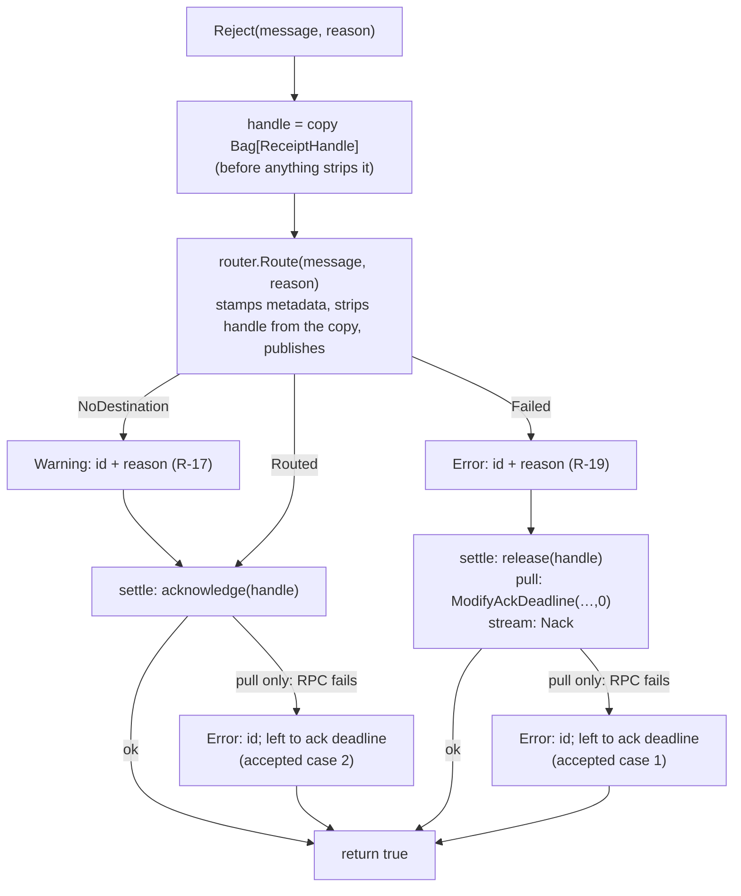

# 78. GCP Rejection Routing and DLQ Channel Creation

Date: 2026-09-24

## Status

Accepted

## Context

**Parent Requirement**: [specs/0037-delivery-count-and-rejection-routing/requirements.md](../../specs/0037-delivery-count-and-rejection-routing/requirements.md)

**Scope**: This ADR covers Groups D–E, R-15 to R-21, together with NFR-5 and the parts of NFR-3 and NFR-8 those requirements touch. It decides three things:

- how a GCP `Reject` routes a message and settles the original, on each consumer and in each variant;
- how the two failures a broker cannot produce on demand are evidenced;
- how channel creation tolerates missing project-IAM rights.

It does not re-decide the delivery-count contract. That belongs to sibling ADR `0077-delivery-count-contract`. The routing here honours 0077's constraints (0077 §"Deferred to ADR 0078"):

- The routed copy stamps the keys named by 0077's core `RejectionMetadataKeyNames`, with `rejectionReason = "None"` for a null reason and no `rejectionMessage` in that case.
- The routed copy carries `HandledCount` (`Parser.cs:307`).
- The routed copy does not re-publish `googclient_deliveryattempt`, which 0077 adds to `Parser.s_ignoreHeaders` (`Parser.cs:12`).

R-15 is shared with 0077. 0077 relies on the result, and this ADR decides how it is done.

**The problem.** Today GCP ignores the rejection reason: both consumers acknowledge and discard.

- The pull `Reject` acks with `client.Acknowledge` (`GcpPullMessageConsumer.cs:288`). If there is no handle it returns `false` (`:278-281`). If the ack fails it rethrows (`:290-293`), and an exception out of `Reject` stops the performer (R-19's ADR input, `Reactor.cs:373` / `Proactor.cs:408`).
- The stream `Reject` calls `Accepted()` (`GcpPubSubStreamMessageConsumer.cs:84-94`).

Three things are also missing:

- `GcpPubSubSubscription` has no way to name a Brighter-managed destination. Its `DeadLetter` property (`GcpPubSubSubscription.cs:75`) configures Pub/Sub's native policy.
- A DLQ-backed channel cannot be created without project-IAM rights. On the emulator, the Resource Manager call in `UpdateIAmRoleForDeadLetterAsync` (`GcpPubSubMessageGateway.cs:477`, called at `:235`) and in `UpdateIAmRoleForSubscriptionAsync` (`:527`, called at `:251`) hard-fails channel creation.
- As a result, R-21's local emulator bar and A-6/AC-43 cannot be reached.

**Settled inputs, taken as given:**

- Republish-based requeue is excluded (C-12, NFR-3).
- R-19's outcome is settled. A failed routing publish is logged at Error, the message is released by the consumer's own requeue call, and `Reject` returns `true`. Only `DeadLetterPolicy.MaxDeliveryAttempts` bounds the resulting loop. It is unbounded where no policy applies, and that is accepted.
- Delivery to the destination is at-least-once.
- The R-28 discriminator is `rejectionReason` in `Header.Bag` (0077).

## Decision

### Architecture Overview

GCP adopts the Brighter-managed rejection routing of `0047-message-rejection-routing-strategy`, following the lazy-producer precedent of `0038-aws-sqs-dlq-direct-send` / `SqsMessageConsumer`. There is **one deliberate refinement**: GCP never acknowledges a message whose routing publish failed. It releases the message instead.

The routing logic lives in **one GCP-internal collaborator**, `GcpRejectionRouter`, which both consumers use. Each consumer keeps only what differs between them: the **type of its receipt handle** and **how it settles the original**.



`Reject` **always returns `true`** and **nothing escapes it**:

- `true` means "settled by this call", so the pump never acknowledges afterwards. `false` would fall through to the ack and discard the message (`Reactor.cs:320` → `:367`, `Proactor.cs:354` → `:402`).
- Every broker and producer call inside `Reject` is caught at the point it is made, and turned into a log line and an outcome.

### Key Components

| Role (RDD stereotype) | Type | Knows | Does | Decides |
|---|---|---|---|---|
| Information holder | `GcpPubSubSubscription` / `<T>` (public, changed) | `DeadLetterRoutingKey`, `InvalidMessageRoutingKey` (via `IUseBrighterDeadLetterSupport` / `IUseBrighterInvalidMessageSupport`); `MakeChannels`; existing `DeadLetter` policy, unchanged | — | — |
| Structurer | `GcpPubSubConsumerFactory.CreateAsync` (`GcpPubSubConsumerFactory.cs:69`) | the subscription | passes the routing keys and `MakeChannels` to both consumers (`:83`, `:99`) | — |
| Service provider | `GcpRejectionRouter` (new, **internal**, one per consumer instance; not thread-safe, which is sound because each performer has its own consumer — `GcpPubSubConsumerFactory.cs:83`, `:97-99` — so `Reject` is never called concurrently on one instance) | routing keys, `MakeChannels`, connection, project (from the consumer's `SubscriptionName`), `TimeProvider` | stamps metadata on the routed copy, strips `ReceiptHandle`, creates the destination producer lazily and publishes | the route (`Unacceptable` → invalid, falling back to DLQ; `DeliveryError`/`None`/null → DLQ); logs R-17's Warning and R-19's Error |
| Coordinator | `GcpPullMessageConsumer`, `GcpPubSubStreamMessageConsumer` (public, changed) | its receipt-handle type | copies the handle, calls the router, settles the original | ack or release, depending on the router's outcome |
| Service provider | `GcpIamCallTolerance` (new, **public**) | the tolerated set `{Unimplemented, PermissionDenied, Unauthenticated}` | runs one IAM step; logs R-20's five-element Warning | tolerate (abandon the helper) or let the exception propagate |

**Why the router has no interface, and why it is internal.** It has one implementation and no optionality. The design principles say an internal class gets an interface only when there is optionality. Users configure routing through the subscription, as on every other Brighter-managed transport.

Because a public consumer constructor cannot take an internal type, the consumers take routing primitives and build the router themselves. This mirrors `SqsMessageConsumer`'s constructor (`deadLetterRoutingKey`, `invalidMessageRoutingKey`, `makeChannels`).

**Router contract** (internal):

```csharp
internal enum RoutingOutcome { NoDestination, Routed, Failed }

internal sealed class GcpRejectionRouter : IDisposable, IAsyncDisposable
{
    RoutingOutcome Route(Message message, MessageRejectionReason? reason);                       // sync: producer.Send
    Task<RoutingOutcome> RouteAsync(Message message, MessageRejectionReason? reason, CancellationToken ct); // async: producer.SendAsync
}
```

- **Input:** a message whose handle the caller has **already copied**. The router mutates the message in place, as SQS's `RefreshMetadata` does (`SqsMessageConsumer.cs:496-513`):
  - `originalTopic` = `Header.Topic`
  - `originalMessageType`
  - `rejectionReason` = the enum name, or `"None"` when `reason` is null (0077)
  - `rejectionMessage`, only when a non-empty description was supplied
  - `rejectionTimestamp` = `timeProvider.GetUtcNow().ToString("o")`
  - `Bag.Remove("ReceiptHandle")`
  - `Header.Topic` = the destination

  The keys use the camelCase convention that SQS and RocketMQ already use.
- **Output:**
  - `NoDestination`: no routing key applies to this reason. The router has logged a Warning naming the message id and the reason.
  - `Routed`: the publish completed.
  - `Failed`: producer creation or the publish threw. The router has logged an Error naming the message id and the reason.
- **Error conditions:** the router **never throws**. It catches `Exception` around producer creation and publish only. That breadth is deliberate, because R-19 forbids anything escaping `Reject`. NFR-5's ban on `catch (Exception)` covers the IAM path (R-20), not this one.
- **Lazy producer:** the router builds a `GcpPublication` with:
  - `Topic` = the routing key
  - `MakeChannels` = the subscription's `MakeChannels`
  - `TopicAttributes.ProjectId` = the subscription's project
  - `EnableMessageOrdering = true`

  It then calls `GcpPubSubMessageProducerFactory.Create`/`CreateAsync` (`GcpPubSubMessageProducerFactory.cs:50`, `EnsureTopicExistAsync` at `:69`), so it reuses existing topic handling rather than duplicating it.
  - **Ordering is always enabled.** A copy that carries a partition key is published with an `OrderingKey` (`Parser.cs:296`), and Pub/Sub refuses that unless the publisher enables ordering (the harness records this at `GcpPullMessageGatewayProvider.cs:98-102`). Messages without a key are unaffected.
  - **Only success is cached.** SQS uses `Lazy<T>` and caches a `null` from a failed creation (`SqsMessageConsumer.cs:104`, `:455-475`). GCP does not: after a `Failed` outcome the router disposes and discards its cached producer — the disposal is inside the same guarded region, so a throw is logged and the reference dropped; `Route` uses `Dispose`, `RouteAsync` uses `DisposeAsync` — and the next `Reject` builds it again. Two reasons:
    - A released message comes back, so a later attempt should be able to succeed once the topic exists.
    - An ordering-enabled `PublisherClient` pauses an ordering key after a failed publish. A fresh client clears that pause.
  - **Divergence from SQS:** a failed producer creation is `Failed`, not "no destination". SQS turns a creation failure into a `null` producer, which then leads to "no channels configured" and a delete. On GCP a configured destination is never treated as absent.

### Reject composition, per consumer (R-16, R-17, R-18, R-19 — the ADR MUST)

Both consumers **copy the handle first**. The router's `Bag.Remove` therefore cannot stop the original from being settled, avoiding the trap SQS escapes only by copying at `:257`. Both consumers settle the original **through private helpers that take the handle**, never through their public `Requeue` or `Acknowledge`:

- The pull `Requeue` swallows exceptions and returns `false` (`GcpPullMessageConsumer.cs:354-358`, async `:394-398`).
- The stream `Requeue` returns `true` having done nothing when there is no handle (`GcpPubSubStreamMessageConsumer.cs:219-222`).
- The stream `Acknowledge` returns silently when there is no handle (`:34-37`).

As a Tidy-First structural step, the existing bodies of `Acknowledge`/`Requeue` are extracted into those helpers, and the public methods keep their current contracts.

**`GcpPullMessageConsumer` — sync `Reject` and async `RejectAsync`, same shape, sync calls with sync and async with async (NFR-8).** The sync path is not wrapped in `BrighterAsyncContext.Run`. Producer creation and `Send` each run their own context one after the other, never nested, which avoids the nesting deadlock noted at `SqsMessageConsumer.cs:462-465`.

| Router outcome | Settle call (the handle is the `ackId` string) | If the settle RPC throws |
|---|---|---|
| `Routed` | `Acknowledge` (replaces today's `:288`) | Error naming the message id. The message stays leased until its ack deadline; the destination may hold a duplicate. **Accepted case 2** (R-16) |
| `NoDestination` | `Acknowledge` | as above (R-17) |
| `Failed` | `ModifyAckDeadline(…, 0)`, the same call `Requeue` makes (`:349`, async `:384`) | Error naming the message id; returns at its ack deadline. **Accepted case 1** (R-19) |

`GetOrCreateSubscriberServiceApiClient`/`CreateSubscriberServiceApiClientAsync` are called **inside** the helper's `try`, so a client-construction failure is handled like an RPC failure. Every row returns `true`.

**`GcpPubSubStreamMessageConsumer` — sync `Reject`; `RejectAsync` becomes genuinely async (`RouteAsync`) in place of today's `Task.FromResult(Reject(...))` (`:104-106`).** The handle is the `GcpStreamMessage` instance.

| Router outcome | Settle call |
|---|---|
| `Routed`, `NoDestination` | `handle.Accepted()` |
| `Failed` | `handle.Reject()`, the Nack `Requeue` already issues (`:224`) |

Both settle calls are `TaskCompletionSource.TrySetResult` (`GcpStreamConsumer.cs:124-127`, `:133-136`). They are local and **cannot fail**, so neither accepted case can arise on the stream consumer. The Nack also frees the flow-control slot, so a failed routing never stalls the stream (R-19, R-13).

**Missing receipt handle (both consumers).** The router still runs, so a configured destination still receives the message and nothing is discarded. The consumer then logs an Error that the original cannot be settled, and returns `true`.

This case is unreachable by construction: both parsers always set the handle (`Parser.cs:78`, `:130`). The path is defensive only, so that a message which somehow lacks one neither discards a configured destination nor escapes `Reject`.

**NFR-3.** The requeue path is untouched. On `Reject`, the settle call (ack, or a release that **replaces** the ack) is the one call the path already made. The only addition is the routing publish, which R-16 requires and which is not a requeue round trip. After that, a producer is created on first use, and again after each `Failed` outcome, plus `EnsureTopicExistAsync` once per process under `Validate`/`Create`.

### The destination producer's `makeChannels` (AC-18, AC-43)

**Decided: the destination producer inherits the subscription's `MakeChannels`**, as SQS does (`SqsMessageConsumer.cs:460`, `:482`). Under each setting, the producer behaves as follows:

- **`Create`:** the topic is created on the first `Reject`.
- **`Validate`:** a missing topic throws `InvalidOperationException` at producer creation (`GcpPubSubMessageGateway.cs:53-61`), giving `Failed`.
- **`Assume`:** no check is made (`:36-40`), and the publish fails, giving `Failed`.

The conformance subscriptions use `OnMissingChannel.Create` (for example `When_rejecting_message_should_include_metadata.cs` passes it to `CreateSubscription`). Under inheritance, a Create-configured subscription would create AC-18's missing topic, so **AC-18's Given is set up with two subscription objects**:

1. A **provisioning** subscription that differs from the subscription under test only in `makeChannels: Create` and `SubscriptionMode.Pull` on every configuration. Because `Assume` sets nothing on the broker, it carries every broker-side attribute the scenario relies on (`AckDeadlineSeconds`, `EnableMessageOrdering`, and AC-43's `DeadLetterPolicy`). `SubscriptionMode.Pull` is used so that on the Stream configurations it starts no competing streaming pull (`GcpPubSubConsumerFactory.cs:89-95`); subscription creation does not depend on the mode. It creates the source topic and subscription and, for AC-43, the `DeadLetterPolicy` topic and its subscription (`GcpPubSubMessageGateway.cs:220-236`). It **does not** create the `deadLetterRoutingKey` topic, because the destination producer is lazy and nothing creates it at channel creation.
2. The **subscription under test**: the configuration's own subscription, keeping its own `SubscriptionMode`, with `makeChannels: OnMissingChannel.Assume`. `EnsureSubscriptionExistsAsync` returns immediately (`:188-192`). The inherited `Assume` producer publishes to the missing topic, the publish fails, and the topic still does not exist afterwards.

AC-43 uses the same two-object Given.

### Evidence for the two failures a broker cannot produce on demand (the ADR MUST)

These are R-19's failed release and the failed acknowledgement under R-16/R-17. They can occur only on `GcpPullMessageConsumer`; the stream settle calls cannot fail (above).

**Decided (user decision): a test-only gRPC fault-injecting interceptor, supplied through the existing `GcpMessagingGatewayConnection.SubscriptionManagerConfiguration`** (`GcpMessagingGatewayConnection.cs:40`). No production seam is added.

- **Why it reaches the calls.** Every pull RPC, including `Acknowledge` (`GcpPullMessageConsumer.cs:285/288`, `:315/317`) and `ModifyAckDeadline` (`:344/349`, `:379/384`), goes through the connection's one cached `SubscriberServiceApiClient`. That client is built in `GetOrCreateSubscriberServiceApiClient`/`CreateSubscriberServiceApiClientAsync` (`:117`, `:144`), which invoke the hook at `:127`/`:154`.
- **How it is wired (verified in the resolved packages).** The test's hook must:
  - set `builder.Credential = null`, because the connection pre-sets it (`GcpMessagingGatewayConnection.cs:126`/`:153`), and Gax 4.13.1's `ClientBuilderBase.Validate` rejects `CallInvoker` together with `Credential`, `Endpoint`, `ChannelCredentials` and the other credential options ("CallInvoker cannot be specified with credentials s…", verified in the `Google.Api.Gax.Grpc` 4.13.1 IL);
  - leave `EmulatorDetection` at `None`, because with `EmulatorOrProduction` and `PUBSUB_EMULATOR_HOST` set, `SubscriberServiceApiClientBuilder.MaybeCreateEmulatorClientBuilder` (Google.Cloud.PubSub.V1 3.36.0 IL) builds a **new** builder that copies only `Settings`, `ChannelPoolDisabled` and `ChannelOptions` and sets `Endpoint` and insecure `ChannelCredentials`, which would silently drop the injected invoker;
  - set `builder.CallInvoker = GrpcChannel.ForAddress("http://" + PUBSUB_EMULATOR_HOST, { Credentials = ChannelCredentials.Insecure }).Intercept(faults)`, using `Grpc.Net.Client` 2.71.0 and `Grpc.Core.Api` 2.80.0, both already in the test project's assets.

  So the invoker is **not** usable alongside emulator detection. It **replaces** emulator detection, and points at the same emulator.
- **What the interceptor does.** `faults` is a `Grpc.Core.Interceptors.Interceptor` that overrides `BlockingUnaryCall` and `AsyncUnaryCall`. When armed for `/google.pubsub.v1.Subscriber/Acknowledge` or `/…/ModifyAckDeadline`, it throws `RpcException(StatusCode.FailedPrecondition)`. Every other call passes through.

  The code must not be `Unavailable`. That is the only retriable code for both methods (`SubscriberServiceApiSettings.AcknowledgeSettings`/`ModifyAckDeadlineSettings`, 60 s timeout, 3.36.0 XML doc), so injecting it would be retried for up to 60 s instead of failing.
- **Scenarios**, on `GCP / Pull` and `GCP / PullOrdering`, sync and async, `AckDeadlineSeconds: 10`:
  - (a) destination configured and existing, `Acknowledge` armed;
  - (b) no destination, `Acknowledge` armed;
  - (c) AC-18's missing-topic Given, `ModifyAckDeadline` armed.

  Each asserts:
  - `Reject` returns `true` and does not throw;
  - an Error names the message id;
  - after disarming, the message is redelivered once its deadline lapses, so it was not discarded;
  - in (a), the destination holds the copy.
- **Why this is not a mock (C-10).** Every call reaches the real emulator. Only the result of two RPCs is replaced, on demand.
- **Status.** These tests are the evidence, not an AC. The record is checked at design review; the evidence is produced at implementation and recorded under the spec's manual-gate list.
- **Evidence (2026-09-28).** `GcpFaultInjectingInterceptor` (`tests/Paramore.Brighter.Gcp.Tests/MessagingGateway/Pull/GcpFaultInjectingInterceptor.cs`) implements the interceptor described above, wired exactly as specified through `GcpMessagingGatewayConnection.SubscriptionManagerConfiguration` (`Credential = null`, `EmulatorDetection` left at `None`, `CallInvoker = GrpcChannel.ForAddress(...).Intercept(faults)`), with a fired-counter asserted `> 0` in every scenario. `Grpc.Net.Client` 2.71.0 and `Grpc.Core.Api` 2.80.0 resolved transitively as expected; no new `PackageReference` was needed. The three scenarios run on both `GCP / Pull` and `GCP / PullOrdering`, sync and async — 12 tests in total, all observed RED against the unfixed consumer (an unhandled `RpcException` escaped `Reject`/`RejectAsync`) and GREEN after the fix:
  - `tests/Paramore.Brighter.Gcp.Tests/MessagingGateway/Pull/When_a_gcp_pull_settle_call_fails_should_return_true_and_leave_message_redeliverable.cs` (`GcpPullSettleCallFailureTests`, sync/Reactor) — 6 tests.
  - `tests/Paramore.Brighter.Gcp.Tests/MessagingGateway/Pull/When_a_gcp_pull_settle_call_fails_should_return_true_and_leave_message_redeliverable_async.cs` (`GcpPullSettleCallFailureAsyncTests`, async/Proactor) — 6 tests.

  The fix (`GcpPullMessageConsumer.cs`, `Reject`/`RejectAsync`): the release call on the `Failed` outcome is now wrapped in `try`/`catch` alongside the already-existing `try`/`catch` around the ack call, and neither catch rethrows any more — both log `Log.RejectError` naming the message id and fall through to `return true`. `Reject`/`RejectAsync` all 12 GREEN; no other test in the GCP Pull suite regressed.

### IAM tolerance (R-20, NFR-5)

**`GcpIamCallTolerance` is public** because it is used by production code (both IAM helpers), AC-21 must exercise it directly, and the project does not use `InternalsVisibleTo` (`.agent_instructions/testing.md:109-111`). Alternative 6 rejects a public type used *only* by tests; this one is not. Its contract:

```csharp
public sealed class GcpIamCallTolerance(ILogger? logger = null)   // defaults to ApplicationLogging
{
    // Runs one IAM RPC. Returns (true, result) on success; (false, default) when tolerated, after one Warning.
    // Any RpcException outside the tolerated set, and any other exception, propagates unchanged
    // (exception filter: `catch (RpcException ex) when (IsTolerated(ex.StatusCode))` — never caught otherwise).
    public Task<(bool completed, T? result)> TryCallAsync<T>(IamStep step, Func<Task<T>> rpc);

    // Resource Manager client construction only. Catches System.InvalidOperationException and nothing else.
    public Task<ProjectsClient?> TryCreateProjectsClientAsync(IamStep step, Func<Task<ProjectsClient>> create);

    public static bool IsTolerated(StatusCode code);   // Unimplemented | PermissionDenied | Unauthenticated
}
public sealed record IamStep(string Helper, string Rpc, string Resource);
```

**Where it is applied.** Both helpers use it in the same way. Each step that returns `false` ends the helper with `return`:

- `CreateProjectsClientAsync` (`GcpPubSubMessageGateway.cs:484`, `:536`), through `TryCreateProjectsClientAsync`;
- `GetProjectAsync` (`:485`, `:537`), which abandons the whole helper so that no null member reaches the binding;
- `GetIamPolicyAsync` (`:497`, `:548`), which means `SetIamPolicyAsync` is not called;
- `SetIamPolicyAsync` (`:518`, `:570`), which ends the helper.

This is R-20's rule that the unit of tolerance is the helper. The other helper still runs, subscription creation is unaffected, and nothing outside these calls is wrapped.

**The Warning.** It has one template, which carries the five elements:

`"{Helper} abandoned: {Rpc} on {Resource} failed with {Status}; native dead-lettering may be inactive"`

For the construction case, `{Rpc}` reads `construct ProjectsClient` and `{Status}` reads `InvalidOperationException`. In the ordinary case the tolerated condition fails for both helpers alike, so exactly two Warnings are logged (AC-20).

**NFR-5: the exception caught on Resource Manager client construction is `System.InvalidOperationException`.**

- **Where verified.** `CreateProjectsClientAsync` (`GcpMessagingGatewayConnection.cs:173-192`) builds `new ProjectsClientBuilder { Credential = Credential }` and calls `BuildAsync()`. When `Credential` is null, that resolves Application Default Credentials through `DefaultCredentialProvider` in Google.Apis.Auth 1.73.0, the version resolved for this project. In that assembly's IL, `CreateDefaultCredentialAsync` throws `newobj System.InvalidOperationException::.ctor(string)` with "Your default credentials were not found…". A bad `GOOGLE_APPLICATION_CREDENTIALS` file also throws `InvalidOperationException(string, Exception)` ("Error reading credential file from location…").
- **Known widening.** Gax's `ClientBuilderBase.Validate` also throws `InvalidOperationException` for an inconsistent builder (4.13.1 XML doc), so a misconfigured `ProjectsClientConfiguration` would be tolerated too. That is accepted under Risks. The catch is scoped to the one construction call, and the Warning carries the exception message. NFR-5's "a tolerated failure never widens" is met in its stated sense — the subscription is still created and no other call is affected; the catch type is the narrowest one the construction call can be named to throw.

**R-21.** With this tolerance, a DLQ-backed channel is creatable on the emulator:

- Members unset: `GetProjectAsync` reaches real GCP with the harness's `"mock"` access token (`Helper/GatewayFactory.cs:13-22`) and is refused with `Unauthenticated`, as spec 0036 measured. This case therefore needs outbound network: offline, `GetProjectAsync` fails with `Unavailable`, which is not tolerated, and the members-set mitigation below cannot apply because AC-20's first Given requires members unset. Where ADC does not resolve and `Credential` is null, construction throws `InvalidOperationException`. Both are tolerated.
- Members set (C-11): `GetIamPolicyAsync` on the emulator returns `Unimplemented`, which is tolerated.

That unblocks A-6/AC-43 and 0077's AC-39. All GCP verification runs locally against `docker-compose-gcp.yaml`.

### Technology Choices

- No new packages in production. The test project uses `Grpc.Net.Client`/`Grpc.Core.Api`, which it already references transitively.
- `Grpc.Core.StatusCode` is used for the tolerance filter.
- The destination producer reuses `GcpPubSubMessageProducerFactory` and `GcpMessageProducer`.

### Implementation Approach

The order follows Tidy First: structural changes before behavioural ones.

1. **Structural:** extract the pull consumer's private ack and release helpers (sync and async) from `Acknowledge`/`Requeue`, with no change in behaviour.
2. **R-15 (AC-14):** add `RoutingKey? deadLetterRoutingKey = null, RoutingKey? invalidMessageRoutingKey = null` at the **end** of both `GcpPubSubSubscription` constructors (`:113`, `:164`), and implement the two interfaces with `{ get; set; }` properties, as `SqsSubscription` does (`:47`, `:52`). The existing `DeadLetter` stays as it is.
3. Add `GcpRejectionRouter` and the consumer constructor parameters, and wire them in `GcpPubSubConsumerFactory.CreateAsync`. Consumers dispose the router.
4. Compose `Reject`/`RejectAsync` on both consumers (AC-15, AC-16, AC-17, AC-18; NFR-8).
5. **Harness:**
   - the providers pass the routing keys to the Brighter route instead of mapping `deadLetterRoutingKey` onto `DeadLetterPolicy` (`GcpPullMessageGatewayProvider.cs:136-164` today). Wherever a routing key is passed they **also** keep a `DeadLetterPolicy { MaxDeliveryAttempts = 5 }` (0077 step 7), on a separately named native topic `{deadLetterRoutingKey}.native`, so FR-23 keeps its delivery counter (A-1) and AC-18's two topics stay distinct. The native policy's subscription is named `{deadLetterRoutingKey}.native` too, so it cannot collide with the reading subscription in the per-name creation cache (`GcpPubSubMessageGateway.cs:201-205`). A subscription given no routing key is unchanged;
   - they pre-provision each destination topic **with a reading subscription** before `Reject`, and `GetMessageFromDeadLetterQueue(Async)` reads the one on `{deadLetterRoutingKey}`, not `subscription.DeadLetter` (AC-9/AC-43's native read keeps `DeadLetter.Subscription`);
   - they implement `GetMessageFromInvalidChannelAsync`;
   - they fill the generated harness record `RejectionMetadataKeys` (empty today, `:363-370`) — a test type, distinct from 0077's core `RejectionMetadataKeyNames`;
   - they add the two-subscription Given for AC-18 and AC-43.
6. **R-20 (AC-20, AC-21):** add `GcpIamCallTolerance` and apply it in both helpers.
7. **AC-43:** after R-20, and after 0077's GCP parser work.
8. **Fault-injection evidence tests** (manual gate).

## Consequences

### Positive

- GCP no longer silently discards rejected messages. It routes by reason, with 0047's metadata and 0077's discriminator.
- `Reject` can no longer stop a performer. Before this change, a failed pull ack rethrew.
- A failed routing publish keeps the message in play and frees the stream's flow-control slot.
- One router holds the routing knowledge for both consumers, so there is no duplication. The consumers differ only in how they settle.
- There is no production test seam. The evidence runs locally against the emulator.
- DLQ-backed channels are creatable without project-IAM rights and on the emulator. Genuine misconfiguration still fails, because `NotFound`, `InvalidArgument` and every other status still propagate.

### Negative

- **Behaviour change.** A subscription with no routing keys now logs a Warning on every `Reject` (R-17). The pull `Reject` with no handle returns `true` instead of `false`. A failed pull ack is logged rather than thrown.
- **GCP and SQS diverge** on a failed destination send. SQS deletes the source (`SqsMessageConsumer.cs:307-316`); GCP releases it. SQS is not changed here: the requirements record that question as a separate issue, raised as [#4415](https://github.com/BrighterCommand/Brighter/issues/4415).
- This is also a **deliberate refinement of 0047**, which acknowledges "after attempted production" (0047 §Error Handling for DLQ Production Failures). GCP does not acknowledge after a failed publish.
- **An unbounded loop is possible.** With no `DeadLetterPolicy`, or with tolerated-missing forwarding bindings, a deterministic publish failure loops for as long as it fails and logs an Error each time. This is accepted in R-19. 0077's R-11 channel-creation Warning flags a subscription that has no `DeadLetterPolicy`.
- **Duplicates are possible** in the destination after a failed pull ack (at-least-once delivery).
- **The public constructors change.** New optional parameters are source-compatible, but callers compiled against the old signatures must recompile.
- **A topic with no subscription drops messages.** A `Create`-mode destination producer creates a topic but no subscription, and Pub/Sub discards messages published to a topic that has no subscriptions. Brighter cannot see this without an extra call. It must be documented, and the harness pre-provisions a reading subscription.

### Risks and Mitigations

| Risk | Mitigation |
|---|---|
| `InvalidOperationException` from `ProjectsClientBuilder.Validate`, caused by an inconsistent `ProjectsClientConfiguration`, is tolerated as if it were a credential failure | The catch is scoped to the single construction call. The Warning carries the exception message. The subscription is still created, and native forwarding is flagged as possibly inactive. |
| Offline machine: `GetProjectAsync` fails with `Unavailable`, which is not tolerated, so channel creation fails | Set `PublisherMember`/`SubscriberMember` (C-11). Then no Resource Manager call is issued, and the emulator returns only `Unimplemented`. |
| A publish to a missing topic under `Assume` does not fail promptly, or fails with a code other than expected | AC-18 proves it on every configuration. The router treats **any** exception as `Failed`. |
| An ordering key paused after a failed publish blocks later routing | The cached producer is discarded after every `Failed` outcome. |
| `EnsureTopicExistAsync` adds to its static "seen" cache before `Validate` passes (`GcpPubSubMessageGateway.cs:45-48`), so a second attempt skips validation | This is existing behaviour, and the outcome is unchanged: the publish then fails and the message is released. |
| Under `EmulatorOrProduction`, the injected invoker is silently dropped and the evidence test passes vacuously | The test asserts that the armed fault fired, using a counter on the interceptor. |
| Unverified at design, to be confirmed at implementation: an emulator publish to a missing topic fails promptly with an `RpcException`; an ordering-enabled `PublisherClient` pauses a key after a failed publish; disposing a producer after a failed publish (`GcpMessageProducer.Dispose`, sync-over-async, `GcpMessageProducer.cs:141-143`) completes promptly; the `GrpcChannel.ForAddress(...).Intercept(...)` wiring passes `Validate` at runtime; the Gax path from `ProjectsClientBuilder.BuildAsync` to `DefaultCredentialProvider` (the throw site and type were checked in Auth 1.73.0 IL) | Each is exercised by AC-18, the evidence tests or AC-21; a refutation amends this ADR with a dated note. |

## Alternatives Considered

1. **Acknowledge (delete) on a failed send, as SQS does.** Rejected. R-19 chooses preservation over a bounded loss, and GCP has no current behaviour on that path to keep.
2. **Leave the message to its ack deadline on failure** (return `true` without releasing it). Rejected:
   - On the stream consumer, the lease is extended and the flow-control slot is held, which stalls the subscription (R-13).
   - On the pull consumer, redelivery waits for the deadline, which contradicts R-19's "prompt" release.
3. **Reuse the public `Requeue`/`Acknowledge` inside `Reject`.** Rejected. Their results mislead: pull returns `false` after swallowing an error, and stream returns `true` having done nothing. Stream `Acknowledge` also returns silently with no handle.
4. **Return `false` on failure.** Rejected. The pump then acknowledges, which discards the message.
5. **Duplicate the routing in each consumer.** Rejected. It duplicates knowledge across four methods, and the consumers differ only in settlement.
6. **A production seam for fault injection** (an injectable subscriber-operations role). Rejected. It adds a public type used only by tests, whereas `SubscriptionManagerConfiguration` already exists and Brighter does not use `InternalsVisibleTo`.
7. **A separate `makeChannels` for the destination producer.** Rejected. It adds a new public setting with no user need, it departs from the SQS precedent, and AC-18 can be reached with `Assume`.
8. **Provision a subscription on each destination topic at channel creation.** Rejected for now. It would invent a naming, retention and ack-deadline policy for a subscription that belongs to whoever consumes the DLQ. It is recorded as the mitigation to adopt if users report routed messages dropped by subscriptionless topics.
9. **`catch (Exception)` for IAM, or per-RPC tolerance.** The first is forbidden by NFR-5 and would mask `NotFound` and similar statuses. The second would carry a null member into the binding (`:506-511`).
10. **Republish-based requeue.** Excluded by C-12 and NFR-3.

## References

- Requirements: [specs/0037-delivery-count-and-rejection-routing/requirements.md](../../specs/0037-delivery-count-and-rejection-routing/requirements.md): R-15 to R-21, NFR-3, NFR-5, NFR-8, A-6; AC-14 to AC-18, AC-20, AC-21, AC-43; the manual-gate list and "Assertable, but not writable until the ADR exists".
- Related ADRs:
  - `0077-delivery-count-contract`: sibling. Its constraints on this ADR are honoured.
  - `0047-message-rejection-routing-strategy`: routing and metadata; refined here for GCP's failure path.
  - `0038-aws-sqs-dlq-direct-send`: the lazy direct-send producer precedent. Its SQS failure branch is unchanged.
  - `0039-redis-dlq-brighter-managed`, `0040-mssql-dlq-brighter-managed`, `0041-postgres-dlq-brighter-managed`, `0042-rocketmq-dlq-brighter-managed`, `0043-mqtt-dlq-brighter-managed`, `0045-provide-dlq-where-missing`: sibling Brighter-managed DLQ adoptions.
  - Supersedes none.
- External references:
  - Google.Cloud.PubSub.V1 3.36.0: `SubscriberServiceApiClientBuilder.MaybeCreateEmulatorClientBuilder`; `SubscriberServiceApiSettings.AcknowledgeSettings`/`ModifyAckDeadlineSettings` (retriable: `Unavailable`).
  - Google.Api.Gax.Grpc 4.13.1: `ClientBuilderBase.CallInvoker`, `Validate`.
  - Google.Apis.Auth 1.73.0: `DefaultCredentialProvider.CreateDefaultCredentialAsync` throws `InvalidOperationException`.
  - Google.Cloud.ResourceManager.V3 2.6.0.
  - Grpc.Core.Api 2.80.0: `Grpc.Core.Interceptors.Interceptor`.
