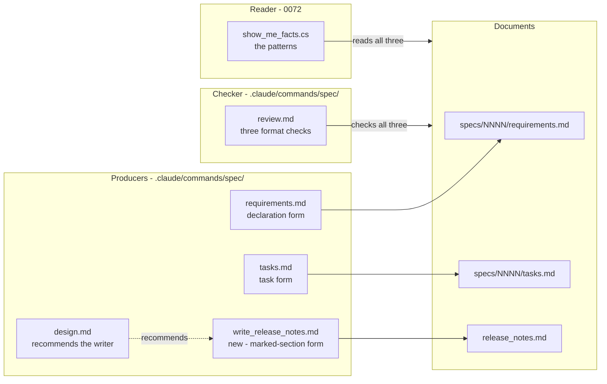

# 0078. Machine-Readable Forms in the `/spec` Family

Date: 2026-09-25

## Status

Proposed

## Context

`/spec:show-me` recognises three things in the documents the `/spec` family writes: a declared
requirement, a task's type, and a spec's release-notes section. It recognises each by a fixed
pattern. The commands that write those documents never state the form the pattern expects, so the
forms drift, and a drifted form is not an error — it is silently counted as something else.

### Terms

- **Form** — what a producing command writes, shown by example: a declaration line, a task line, a
  release-notes section. This ADR owns the three forms.
- **Pattern** — how the reader recognises a form. `requirements.md` § *Definitions* states each
  pattern, and the measurement script implements each once, as
  [0072-show-me-command-resolution-and-output](0072-show-me-command-resolution-and-output.md)
  decides.
- **Marked release-notes section**, **marker line** — `requirements.md` § *Definitions* states both,
  including what counts as a heading and where a section ends. Key Components 4 gives the full form.
- **Producer** — a command that writes a form: `/spec:requirements`, `/spec:tasks` and
  `/spec:write_release_notes`.

### Scope

**Parent requirement**: [specs/0037-show-me/requirements.md](../../specs/0037-show-me/requirements.md)

**In scope**:

- FR-22 — the declaration form prescribed by `/spec:requirements`, the task form prescribed by
  `/spec:tasks`, and the two format checks in `/spec:review` (Key Components 1–3; AC-86, AC-87,
  AC-88).
- FR-23 — the marked release-notes form, the new `/spec:write_release_notes` command, the
  `/spec:design` step and the `/spec:review` design check (Key Components 3–6; AC-89, AC-90, AC-91,
  AC-95).
- NFR-6 — the conventions the new command file and the five amendments follow.
- C-2 — the established task style, which the task form makes normative.
- *Out of Scope*'s migration boundary — existing documents are not rewritten, and unmarked sections
  are neither marked nor inferred.

**Out of scope**:

- The patterns, where they are implemented, and how the measurement script reads each form,
  including the `{m}` count —
  [0072-show-me-command-resolution-and-output](0072-show-me-command-resolution-and-output.md).
- How `/spec:show-me` judges breaking-change items from a marked section —
  [0073-show-me-advisory-risk-model](0073-show-me-advisory-risk-model.md).
- The CI review workflow, which gains nothing.

### Where this ADR sits

| ADR | Decides |
| --- | --- |
| [0072-show-me-command-resolution-and-output](0072-show-me-command-resolution-and-output.md) | What the command is, how it resolves its target, what it measures and reads, and the shape of the file it writes |
| [0073-show-me-advisory-risk-model](0073-show-me-advisory-risk-model.md) | How the advisory risk level is computed, and how it stays advisory |
| [0077-show-me-visual-explanation](0077-show-me-visual-explanation.md) | When the command draws a diagram, what it may draw, and which stage may read source to draw it |
| **[0078-spec-family-machine-readable-forms](0078-spec-family-machine-readable-forms.md)** *(this one)* | The forms the `/spec` family writes so that a tool can read them, and the command that writes release notes in one of them |

The sentence that unifies all four: **every value a command states is counted by one tested script,
copied from a named source, or judged from evidence it can name, and no command writes outside what
it owns.**

### A form with a reader and no writer

| Form | Read by | Written today by | What drift does |
| --- | --- | --- | --- |
| Requirement declaration | the declared-id pattern | `/spec:requirements`, which asks for numbered FRs but prescribes no form | A heading or numbered-list declaration is not counted, and FR-16 row 9 reports no ids in the bold lead-in form |
| Task lead-in | the task-type tag pattern | `/spec:tasks`, which templates only `TEST + IMPLEMENT` | This spec's own `tasks.md` drifted to `**T1.1 — STRUCTURAL:`, which counts as `untagged` |
| Release-notes section | the marked-section count and `{m}` | hand, with no spec identifier | No tool can find a spec's section, and `release_notes.md` already holds two sections from two specs numbered 0027 |

In each row the failure is quiet. A count comes out lower, or a section comes out absent, and
nothing reports a malformed document.

### The forces

- **The reader and its writers must change together.** A pattern changed without its producer, or a
  producer without its pattern, recreates the drift (FR-22, FR-23).
- **A pattern is written once.** FR-21 forbids transcribing a pattern into a command file, because
  prose escaping changes a pattern's meaning. A producer needs a form its reader can copy, and that
  is an example line.
- **The amendments are additive.** No existing section or criterion of an amended command file is
  removed, renumbered or reworded (AC-88, AC-91).
- **Existing documents are settled.** Specs and release notes written before this ADR are not
  rewritten (*Out of Scope*).
- **Spec ids are not unique.** Two directories can share `NNNN`, so a section's owner must be named
  by the full directory name (C-1).
- **Release notes are written at design time.** The need appears when an ADR's *Consequences* record
  a break, often after a design review (FR-23).
- **Nothing may be inferred.** Deciding which spec an unmarked section belongs to would turn a
  literal fact into a judgement (FR-23, NFR-1).

## Decision

**Prescribe each form where it is written and check it where it is reviewed, by example and never by
pattern; and give the marked release-notes form one writer, `/spec:write_release_notes`, which
replaces its own section in place and stops without writing whenever proceeding would mean guessing
whose section a section is.**

`/spec:requirements` and `/spec:tasks` state their forms in words and by example. `/spec:review`
flags a document that departs from them. `/spec:write_release_notes` writes a spec's release-notes
section in the marked form, and `/spec:design` and `/spec:review` call for it when a design breaks
something.

### The mechanism, end to end

Where each form is prescribed, checked and read:

| Form | Prescribed by | Checked by | Read by |
| --- | --- | --- | --- |
| Requirement declaration | `/spec:requirements` | `/spec:review`, *Requirements Review Criteria* | the measurement script's declared-id pattern |
| Task lead-in | `/spec:tasks` | `/spec:review`, *Tasks Review Criteria* | the measurement script's task-type tag pattern |
| Marked release-notes section | `/spec:write_release_notes`, called for by `/spec:design` | `/spec:review`, *Design (ADR) Review Criteria* | the measurement script's marked-section count and `{m}` |

`/spec:write_release_notes` evaluates its situations in this order. The first that applies decides
the outcome:

| # | Situation | Outcome |
| --- | --- | --- |
| 1 | FR-1's or FR-2's resolution fails | stops with that rule's message, naming `/spec:write_release_notes` |
| 2 | `release_notes.md` does not exist | stops; the file is never created |
| 3 | `release_notes.md` has no `##` heading | stops |
| 4 | The target has neither a non-empty `.adr-list` nor a `requirements.md` | stops: nothing to derive items from |
| 5 | More than one section is marked for the target | stops, names each section, and asks the user to delete all but one |
| 6 | The target's marked section sits under a later `##` heading than the first | stops: released notes are not rewritten |
| 7 | A `###` heading under the first `##` heading contains `(spec {NNNN}` for the target's id and is not followed by a marker line | stops, names the heading, and asks the user to delete that section or mark it by hand (Key Components 5) |
| 8 | The target's marked section sits under the first `##` heading | replaces that section in place, keeping its title |
| 9 | None of the above | inserts a new marked section directly under the first `##` heading |

Three invariants read off the ladder:

- **Every stop writes nothing.** Rows 1 to 7 leave `release_notes.md` byte-for-byte unchanged, and so
  does a write at row 8 or 9 that fails, because an exact-match edit either applies whole or not at
  all (Key Components 5).
- **At most one section per spec is ever written.** Row 5 stops on two, row 8 replaces the one, and
  row 9 writes one only when none exists.
- **The command never decides ownership.** A section is the target's only when its marker names the
  target's full directory name. An unmarked heading that might be the target's stops the command
  rather than being claimed or duplicated (row 7). A section marked for another directory — even one
  sharing the target's id — is not the target's, and is left unchanged like any other line.

### Where the pieces live



Each form has exactly one producing command. The checker and the reader take all three documents and
only read them. Nothing in
this ADR touches `src/`, `tests/` or `.claude/settings.json`.

### Key Components

#### 1. The requirement declaration form

`/spec:requirements` requires that every numbered requirement is declared by a bold lead-in at the
start of a line, optionally as a list item. Its template shows:

```markdown
**FR-3 — The command resolves its target deterministically.**
- **NFR-1 — Mechanical fields are deterministic.**
**FR-27.3 — A sub-numbered clause folds into FR-27.**
```

It also gives the placeholder `**FR-{n} — {title}.**`, and states that a heading declaration
(`#### FR-{n}: …`) or a numbered-list declaration (`1. **FR-{n}`) is not recognised by
`/spec:show-me`. The forms that are not recognised are shown only with placeholders, so every
example with a concrete number is a correct one, and each matches the declared-id pattern when that
pattern is run over the file (AC-86).

#### 2. The task form

`/spec:tasks` requires that every task checkbox opens its bold lead-in with exactly one of the four
tags, followed immediately by a colon, with any task id after the colon. Its template gives one line
per tag:

```markdown
- [ ] **TEST + IMPLEMENT: T1.1 — …**
- [ ] **STRUCTURAL: T1.2 — …**
- [ ] **PROJECT: T1.3 — …**
- [ ] **DOC: T1.4 — …**
```

The drifted form, `- [ ] **T1.1 — STRUCTURAL: …**`, is added to the file's existing *DO NOT Format
Tasks Like This* block, which is the one place a non-conforming line may appear. Every example line
outside that block matches the task-type tag pattern (AC-87).

#### 3. The review checks

`/spec:review` gains three checks, one in each criteria list. Each is additive (AC-88, AC-91).

| Criteria list | Finding |
| --- | --- |
| *Requirements Review Criteria* | A numbered requirement declared in any form other than the bold lead-in |
| *Tasks Review Criteria* | A task checkbox whose lead-in does not open with one of the four tags and a colon |
| *Design (ADR) Review Criteria* | An ADR set that records a breaking change while `release_notes.md` has no section marked for the spec; the recommendation is to run `/spec:write_release_notes` |

#### 4. The marked release-notes section form

A section for spec `0099-example-change`, whose `.issue-number` is `1234`, looks like this:

```markdown
## Master

### Example change (spec 0099, #1234)
<!-- spec: 0099-example-change -->

A short paragraph, for a user of the library, saying what changed.

#### Breaking changes

- `IAmAnExample` gains `Describe()`; implementers must add it. *(source and binary)*
- `ExampleOptions.Timeout` now defaults to 30 seconds, not infinite. *(behavioural)*

#### Usage

Free text that no tool counts.
```

The rules:

- **The heading** is `### {title} (spec {NNNN}{, #issue})`. The issue part appears only when
  `.issue-number` exists. The title is written from the spec's problem statement. On a replacement,
  the existing title is kept: the heading text before its first ` (spec `, or the whole heading text
  when there is none.
- **The marker line** is the very next line, `<!-- spec: {full directory name} -->`. It renders as
  nothing, and it names the full directory because spec ids are not unique.
- **The summary** is one short paragraph for a user of the library.
- **`#### Breaking changes`** is followed by one top-level `- ` bullet per breaking-change item —
  what breaks, its classification set in italics and parentheses, and the migration — or by the
  single line `No breaking changes.`
- **Further `####` subsections** are optional free text.

The items come from the ADRs' *Consequences* sections and `requirements.md`, or from
`requirements.md` alone when `.adr-list` is missing or empty. They are judged, not extracted.

##### Who marks a section

`/spec:write_release_notes` writes the marker on every section it writes,
and never adds one to an existing section. A person may add one by hand, beneath the heading of a
hand-written section. Either way, a marked section belongs to the command from then on: its next run
replaces the body in this form and keeps only the title.

#### 5. `/spec:write_release_notes`

A new command file, `.claude/commands/spec/write_release_notes.md`, with the family's front matter:
`allowed-tools`, `description` and `argument-hint: [spec-id]`. It resolves its target by FR-1's and
FR-2's rules, naming itself in their stop messages. FR-3 does not apply: it runs at design time,
long before a spec is finished.

| Step | Does |
| --- | --- |
| 1 | Resolve the target (ladder row 1) |
| 2 | Read `release_notes.md` and find its `##` and `###` headings, ignoring any `#` line inside a fenced block (rows 2, 3) |
| 3 | Check the target has something to derive items from (row 4) |
| 4 | Find every section marked for the target, and every unmarked `###` heading under the first `##` that contains `(spec {NNNN}` (rows 5–7) |
| 5 | Judge the breaking-change items and write the section in the form of Key Components 4 |
| 6 | Replace the marked section (row 8), or insert the new one directly after the first `##` heading line (row 9) |

The write is an exact-match `Edit`, never a whole-file `Write`. A replacement's old text is the whole
marked section, which the marker makes unique. An insertion is anchored on the first `##` heading
line. An exact-match edit leaves every other byte unchanged, which is what AC-89 and AC-90 assert.
The command writes that one file and nothing else, and does not stage or commit.

##### The stop at row 7

Adding a section would duplicate notes written by hand, and editing an
unmarked section is forbidden. So the command stops, names the heading it found, and asks the user
either to delete that section, or to add a marker line beneath its heading naming the spec directory
it belongs to — which may be another spec that shares the id — and re-run. The message says what
marking means: the next run replaces the section's body and keeps only its title, so hand-written
text meant to survive must be moved out first (AC-95). The match is on the id alone, so an unmarked
section from a different spec sharing the id also stops the command. That is deliberate: the user,
not the command, decides whose section it is.

##### The first `##` heading is taken to be the unreleased one

Nothing in `release_notes.md` marks a
heading as released, so the command does not check. Keeping the unreleased heading first is the
release process's job.

#### 6. The `/spec:design` step

`/spec:design` gains one step. When an ADR it writes or amends records, in its *Consequences*, a
change that breaks an existing behaviour or interface, it tells the user so and recommends running
`/spec:write_release_notes`. It does not run the command itself (AC-91).

#### Where each file is touched

| Path | Change |
| --- | --- |
| `.claude/commands/spec/requirements.md` | Adds the declaration form and its examples |
| `.claude/commands/spec/tasks.md` | Adds a template line for each tag, and the drifted form to *DO NOT Format Tasks Like This* |
| `.claude/commands/spec/review.md` | Adds one check to each of three criteria lists |
| `.claude/commands/spec/design.md` | Adds the breaking-change step |
| `.claude/commands/spec/write_release_notes.md` | New |
| `.claude/commands/spec/README.md` | Catalogues `/spec:write_release_notes` |

Deliberately unchanged: every existing `requirements.md` and `tasks.md` under `specs/` other than
this spec's own `tasks.md` when it is next revised; every existing section of `release_notes.md`;
every existing step and criterion of the four amended command files; and the patterns, which live in
`requirements.md` and the measurement script.

### Technology Choices

#### Why forms are given by example, not by pattern

A pattern in a command file is prose, and prose escaping changes a pattern's meaning: that is how a
declared-id count once returned 0 against a correct 28. A producer's reader — a model drafting a
document — needs a line it can copy. So each producer gives example lines, and the acceptance
criteria check those examples against the one implemented pattern (AC-86, AC-87). The pattern and the
examples can then disagree only in a way a test sees.

#### Why an HTML comment as the marker

It renders as nothing, so the published release notes are unchanged in appearance. It is a literal
string, compared after trimming whitespace, so no pattern is needed to find it. And it carries the
full directory name, which is unique where the id is not.

#### Why stop instead of inferring or migrating

Inferring whose section an unmarked heading is would make a mechanical fact — "this spec has a
section" — a judgement, and two runs could disagree. Migrating existing sections would rewrite
settled, user-facing text. Stopping costs the user one hand edit and keeps every decision about
ownership with a person.

#### Why an exact-match edit

`release_notes.md` is a large, hand-maintained file. A whole-file `Write` would require the model to
reproduce every byte outside the section, and any slip would change a released note. An exact-match
`Edit` changes only the bytes it names.

#### Why no sub-agent

The command writes one section of one file, and its stops depend on reading that file exactly. A
sub-agent would have to be handed the file or re-read it, and the edit must be made by the agent
that holds the file's content. `/spec:status`, `/spec:gear` and `/spec:show-me` make the same choice.

### Implementation Approach

Numbered in commit order. Each amendment changes how a command behaves, so each is a behavioural
commit of its own, checked by the acceptance criterion named on it.

1. **Behavioural.** `/spec:requirements`: the declaration form and examples (AC-86).
2. **Behavioural.** `/spec:tasks`: the four template lines and the drifted form in the *DO NOT* block
   (AC-87).
3. **Behavioural.** `/spec:review`: the requirements and tasks checks (AC-88).
4. **Behavioural.** `/spec:write_release_notes`: the ladder, the form, the exact-match edit, and each
   stop's message (AC-89, AC-90, AC-95).
5. **Behavioural.** `/spec:design`: the breaking-change step. `/spec:review`: the design check
   (AC-91).
6. **Documentation.** The README catalogue entry.
7. **Documentation.** This spec's own `tasks.md`, re-tagged tag-first when it is next revised.

## Consequences

### Positive

- **A drifted form becomes a review finding**, not a quiet miscount.
- **One pattern, many examples.** The patterns stay in one place, and the examples are tested
  against them.
- **A spec's release notes are findable.** A marker names the full directory, so `/spec:show-me` can
  count a section and its breaking changes without a judgement.
- **Re-running is safe.** A design that changes after its notes were written gets its one section
  replaced, not a second one.
- **Nothing settled is rewritten.** Existing specs and notes are untouched.

### Negative

- **Existing release-notes sections stay invisible to `/spec:show-me`.** Spec 0036's hand-written
  section carries no marker, so `/spec:show-me` reports it absent (FR-16 row 5) until a person marks
  it. This is accepted in place of inference.
- **Existing specs keep their legacy forms.** A spec declaring ids as headings still gets FR-16
  row 9's line.
- **Row 7 stops on a shared id.** An unmarked section from a different spec with the same `NNNN`
  stops the command until someone marks or removes it.
- **The command trusts the first `##` heading.** If a release is cut without a new unreleased heading
  first, the command writes under the released one.
- **Marking hands a section's body to the command.** A person who marks a hand-written section loses
  its body on the next run unless they moved the text they wanted out first. The stop message says so.

### Risks and Mitigations

- **Risk: a producer's example drifts from the pattern.**
  *Mitigation*: AC-86 and AC-87 run the pattern over each amended file.
- **Risk: an amendment rewords an existing criterion** while adding its own.
  *Mitigation*: AC-88 and AC-91 assert that no other criterion or step changed.
- **Risk: the insertion anchor is not unique**, because the first `##` heading's text appears
  elsewhere in the file.
  *Mitigation*: an exact-match `Edit` fails on a non-unique anchor rather than editing the wrong
  place. The command reports the failure and `release_notes.md` is unchanged. This is a failed
  write, not one of FR-23's stops, and it needs no ladder row.
- **Risk: a hand-added marker names the wrong directory.**
  *Mitigation*: none in tooling. The marker is a literal the person chose, and `/spec:show-me` trusts
  it. `/spec:review`'s design check will still flag the spec that is missing its section.

## Alternatives Considered

### Alternative 1: Infer a section's spec from its heading

Treat any `###` heading containing `(spec {NNNN}` as that spec's section.

**Rejected.** Spec ids are not unique, and existing headings do not identify their spec
consistently. Two runs could attribute a section differently, which would turn a mechanical fact
into a judgement (NFR-1).

### Alternative 2: Migrate existing release-notes sections

Mark every existing section with the spec it describes.

**Rejected.** Each marking is a judgement about settled, user-facing text, and FR-23 hands a marked
section's body to the command. Marking remains available to a person, one section at a time.

### Alternative 3: A release-notes file per spec

Write each spec's notes to `specs/NNNN-name/release-notes.md` and assemble `release_notes.md` from
them.

**Rejected.** `release_notes.md` is the catalogue users read, and hand-written sections from specs
and non-spec changes sit side by side in it. A second source per spec would split the catalogue and
need an assembly step that nothing in the repository runs.

### Alternative 4: Put the patterns in the producers

State each pattern in `/spec:requirements` and `/spec:tasks` so a producer can check its own output.

**Rejected.** It transcribes a pattern into prose, which FR-21 forbids because that is how the
declared-id defect happened. The example lines serve the producer, and the acceptance criteria
tie them to the one pattern.

### Alternative 5: Accept either tag position in tasks

Recognise `**T1.1 — STRUCTURAL:` as well as `**STRUCTURAL: T1.1 —`.

**Rejected.** Two forms mean a looser pattern that matches tag words in more places, and they keep
the drift alive. C-2's established style is tag first, and one form is simpler to prescribe and check.

### Alternative 6: Resolve the row 7 case interactively

Ask the user, in the session, whether an unmarked heading is the target's, and mark it on a yes.

**Rejected.** Marking hands the section's body to the command, and the next run replaces it. A person
should make that decision by editing the file, with the consequence stated, rather than by answering
a prompt mid-run.

## References

- Requirements: [specs/0037-show-me/requirements.md](../../specs/0037-show-me/requirements.md) — FR-22,
  FR-23, the *Marked release-notes section* definition, C-1, C-2, NFR-6, and AC-86 to AC-91 and AC-95.
- Related ADRs:
  - [0072-show-me-command-resolution-and-output](0072-show-me-command-resolution-and-output.md) — the
    patterns' one implementation, and how the measurement script reads each form.
  - [0073-show-me-advisory-risk-model](0073-show-me-advisory-risk-model.md) — how a marked section's
    breaking-change list serves as FR-7's catalogue.
  - [0077-show-me-visual-explanation](0077-show-me-visual-explanation.md) — the third ADR of the
    `/spec:show-me` set, which this one does not depend on.
  - [0071-tdd-review-gear](0071-tdd-review-gear.md) — the other ADR that decides a `/spec:*`
    command's own behaviour rather than Brighter's runtime.
- Conventions and prior art in this repository:
  - [`.claude/commands/spec/requirements.md`](../../.claude/commands/spec/requirements.md),
    [`tasks.md`](../../.claude/commands/spec/tasks.md),
    [`review.md`](../../.claude/commands/spec/review.md),
    [`design.md`](../../.claude/commands/spec/design.md) — the four command files amended.
  - [`release_notes.md`](../../release_notes.md) — the catalogue the marked form lives in.
