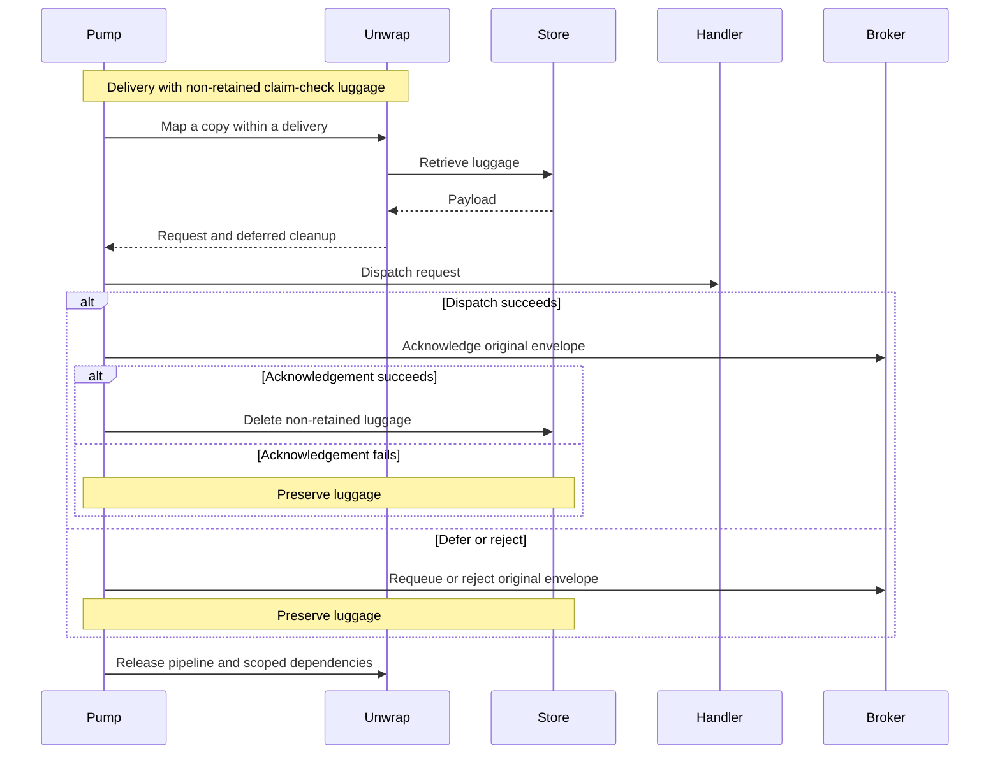
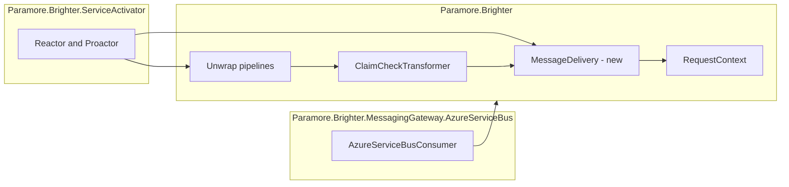

# 79. Clean up claim-check luggage after final acknowledgement

Date: 2026-10-02

## Status

Proposed

## Context

Claim retrieval currently expands the same message that a pump later requeues. Deferral can therefore exceed a broker's size limit. Retrieval also deletes non-retained luggage before the handler runs, leaving the original claim unusable when delivery fails.

### Terms

- Claim and luggage follow [ADR 0003](0003-use-claim-check-for-large-messages.md).
- Final acknowledgement is the acknowledgement after successful handler dispatch. A transport acknowledgement performed while requeueing does not complete consumption.

### Scope

In scope:

- Preserve the received envelope while mapping in Reactor and Proactor.
- Defer non-retained luggage deletion until successful dispatch and final acknowledgement.
- Keep the unwrap pipeline and its scoped dependencies alive when claim-check cleanup is pending; otherwise release it before dispatch.
- Propagate Azure Service Bus acknowledgement failures so the pump can preserve luggage.

Out of scope:

- Storage expiry and orphan collection remain storage concerns described by ADR 0003.
- DI scope creation and ownership remain governed by [ADR 0070](0070-per-pipeline-di-scope-for-mapper-and-transform-factories.md).
- This change does not introduce a transaction between the broker and luggage store.

### Deferral must preserve a usable claim

| Delivery outcome | Required envelope | Non-retained luggage |
| --- | --- | --- |
| Handler defers | Original compact claim | Keep |
| Requeue fails | Original compact claim | Keep |
| Nack, rejection or mapping failure | Original compact claim | Keep for redelivery or replay |
| Final acknowledgement fails | Original compact claim | Keep |
| Dispatch and final acknowledgement succeed | Original envelope acknowledged | Delete after acknowledgement |

With retention enabled, luggage survives every outcome. Standalone unwrapping continues to delete immediately when retention is disabled.

### The forces

- Requeue may republish a message instead of releasing a broker lock.
- Acknowledging a requeue does not mean that the claimed payload has been consumed.
- Scoped storage dependencies cannot be used after their pipeline is disposed.
- Existing standalone callers have no broker acknowledgement boundary.
- The existing header Copy method resets retry metadata and omits CloudEvents fields; changing its established behavior would widen this fix.

## Decision

**A pump preserves its received envelope and deletes non-retained luggage only after successful dispatch and final acknowledgement.**

A delivery object associates cleanup with the request context. The unwrap pipeline uses a separate message envelope, and the pump retains that pipeline until delivery ends only if claim-check cleanup is pending. Pipelines without pending cleanup, including retained claims, are released before the handler begins, preserving the ordinary transform-scope contract.

### The mechanism, end to end

Cleanup never runs merely because requeue acknowledged its source message. Disposal runs on every exit, including mapper, transport and handler failures.

### Where the pieces live

### Key Components

#### The roles, and what each is responsible for

| Role | Type | Responsibilities | Responsibility classifier | Collaborators |
| --- | --- | --- | --- | --- |
| Delivery cleanup | MessageDelivery | Associate pending deletion with one delivery; run or discard cleanup | knowing, doing | RequestContext, ClaimCheckTransformer |
| Outcome handling | Reactor, Proactor | Settle the original envelope; complete successful delivery; release the pipeline | deciding, doing | MessageDelivery, channels |
| Payload retrieval | ClaimCheckTransformer | Retrieve luggage; register deletion or delete immediately for standalone use | doing | MessageDelivery, storage providers |
| Envelope isolation | UnwrapPipeline, UnwrapPipelineAsync | Give transforms and mapper an independent envelope during delivery | doing | Message, MessageHeader |

#### Delivery contract

| Member | Input | Output | Error conditions |
| --- | --- | --- | --- |
| Constructor | RequestContext | Active delivery | Rejects null or an already active delivery |
| HasPendingCleanup | Unwrapping complete | Whether the pipeline must remain alive for cleanup | None |
| Complete / CompleteAsync | Confirmed successful dispatch and final acknowledgement | Attempts pending deletions once | Logs storage failures; does not retry an acknowledged message |
| Dispose | Any delivery outcome | Removes association and discards pending cleanup | Does not delete luggage |

MessageDelivery is public because ServiceActivator and core transforms coordinate across an assembly boundary. The public HasPendingCleanup property lets the pumps preserve the usual scope boundary when no cleanup needs the scope. Cleanup registration and the context association remain internal. Tests exercise pumps rather than exposing implementation helpers.

#### Where each type is touched

| Assembly | Type | Change |
| --- | --- | --- |
| Core | MessageDelivery, RequestContext | Track cleanup per delivery without copying it into other contexts |
| Core | Message, MessageHeader | Internal copies preserve metadata, header comparer and persistence |
| Core | Unwrap pipelines | Copy only when a delivery is active |
| Core | ClaimCheckTransformer | Register cleanup during delivery; use asynchronous deletion on the async path |
| ServiceActivator | Reactor, Proactor | Retain pipelines with pending cleanup until settlement; release others before dispatch |
| Azure Service Bus | AzureServiceBusConsumer | Rethrow logged acknowledgement failures |

The public MessageHeader.Copy behavior, storage interfaces, retention default and standalone unwrap semantics remain unchanged.

### Technology Choices

#### Why a context association?

The context already crosses the transform boundary. An internal typed association avoids string keys in its public bag and avoids serializing callbacks during scheduling.

#### Why preserve the existing header copy behavior?

An internal copy retains every header field and creates independent bag, content type and baggage containers. Arbitrary objects inside the bag remain shared. Body bytes remain read-only memory; the body object itself is separate.

### Implementation Approach

1. Add public-pump regression tests and Service Bus acknowledgement tests. Prove metadata and retention guards with temporary production mutations.
2. Add the delivery association, envelope copies and deferred cleanup in core. Extend pipeline lifetime through settlement in both pumps only when cleanup is pending.
3. Propagate Service Bus acknowledgement exceptions, including aggregate-wrapped failures.
4. Run targeted tests and full affected suites. Record results and infrastructure limits in the bugfix record.

## Consequences

### Positive

- Deferral republishes a compact, usable claim.
- Rejection and failed settlement preserve payloads for recovery.
- Cleanup can safely access scoped storage dependencies.

### Negative

- Mapper and transform scopes with pending claim-check cleanup remain alive during handler dispatch and settlement. Other scopes still end before dispatch.
- Envelope copying adds allocations per pump delivery.
- Service Bus acknowledgement failures now propagate to callers that previously observed a normal return.

### Risks and Mitigations

- A crash after acknowledgement but before deletion can leave orphan luggage. Store expiry or operator cleanup must handle that window.
- Storage deletion failure also leaves luggage. The delivery logs the failure and continues because the broker message has already been acknowledged.
- A transport that suppresses acknowledgement failures cannot provide this cleanup guarantee. This change corrects the demonstrated Service Bus case.
- Retained, rejected or failed deliveries can accumulate luggage. Existing storage retention policies remain necessary.

## Alternatives Considered

- Copy only: prevents oversized requeue but leaves a dangling claim after immediate deletion.
- Always retain luggage: preserves retries but silently changes the retention contract and leaks successful deliveries.
- Delete during pipeline disposal: disposal also runs after deferral and failure, so it cannot establish consumption success.
- Re-store on requeue: adds storage writes and still loses luggage if processing ends before the requeue path can restore it.

## References

- [Issue 4480](https://github.com/BrighterCommand/Brighter/issues/4480)
- [Bugfix record](../../bugfixes/0046-claim-check-requeue/bugfix.md)
- [ADR 0003: Claim check](0003-use-claim-check-for-large-messages.md)
- [ADR 0070: Pipeline scopes](0070-per-pipeline-di-scope-for-mapper-and-transform-factories.md)
- [ADR 0075: Pump scope suppression](0075-publish-and-pump-scope-suppression.md)
