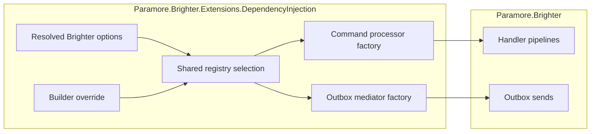

# 80. Share resilience registry between handlers and producers

Date: 2026-10-05

## Status

Proposed

## Context

Brighter accepts resilience registries through its options and its builder.
Handlers read the options registry, while outbox producers previously read a separate builder registry.
A custom handler pipeline could be missing, or a configured outbox retry could silently be ignored.
Supplied registries can also omit built-in pipelines, causing startup errors or a missing request-reply pipeline on the first call.

### Scope

Parent requirement: [Issue #4367](https://github.com/BrighterCommand/Brighter/issues/4367).

In scope:

- Share one registry across handlers and outbox producers.
- Support both options and builder configuration.
- Resolve deferred options before selecting the registry.
- Cover both producer overloads and both consumer registration paths.
- Supply missing outbox and request-reply defaults while preserving configured pipelines.

Out of scope:

- Changing the obsolete Polly policy registry.
- Changing transport implementations.
- Changing the standalone command processor builder or its validation.

### Custom pipelines must reach every component

| Configuration | Previous handlers | Previous outbox producers |
|---|---|---|
| Options registry supplied | Custom registry | Separate defaults |
| Builder registry supplied | Separate defaults | Custom registry |
| No registry supplied | Defaults | Separate defaults |

The two properties describe configuration entry points for the same runtime dependency.
Selecting a registry during registration would lose deferred options and later builder assignments.

### The forces

- Existing public configuration properties must continue to work.
- Options factories can depend on services registered after Brighter.
- The options pattern permits configuration through `PostConfigure`.
- Singleton components must share the same registry regardless of resolution order.
- Container disposal must not introduce ownership of a supplied Polly registry.

## Decision

**Resolve one resilience registry per service provider and share it between handlers and outbox producers.**

An internal container service selects the registry after resolving Brighter options.
An explicit builder value takes precedence over the options value.
The selected registry is written to the options and retained by the private service.
Brighter adds missing default pipelines to this registry through `AddBrighterDefault()`.

### The mechanism, end to end

| Priority | Condition at first resolution | Selected registry |
|---|---|---|
| 1 | Builder registry supplied | Builder registry |
| 2 | Options registry supplied | Options registry |
| 3 | Neither supplied | New registry with Brighter defaults |

Both component factories resolve the private singleton.
The first resolution evaluates the options factory and reads the current builder assignment.
Subsequent resolutions receive the same selected registry.
Configure the builder before resolving Brighter services.
Defaults are added before either component factory receives the registry.
`TryAddBuilder` preserves existing pipelines under the built-in names.
The DI-created command processor therefore has both outbox and request-reply pipelines available.

### Where the pieces live

### Key Components

#### The roles, and what each is responsible for

| Role | Type | Responsibilities | Responsibility classifier | Collaborators |
|---|---|---|---|---|
| Shared registry selection | `BrighterResiliencePipelineRegistry` | Select and retain the registry; add missing defaults; publish it through options | Deciding, knowing, doing | `IBrighterOptions`, builder registry |
| Container registration | `ServiceCollectionExtensions` | Register the singleton; supply it to both component factories | Doing | Builder, service provider |

#### Shared registry contract

| Member | Input | Output | Error conditions |
|---|---|---|---|
| Constructor | Resolved options and optional builder registry | One selected registry with required defaults; options reference the same registry | Options factory errors propagate through DI |
| Registry | None | Selected Polly registry | None |

#### Where each type is touched

| Assembly | Type | Change |
|---|---|---|
| Extensions.DependencyInjection | `BrighterResiliencePipelineRegistry` | New internal singleton |
| Extensions.DependencyInjection | `ServiceCollectionExtensions` | Shared selection feeds both component factories |
| Extensions.DependencyInjection | `IBrighterBuilder`, `IBrighterOptions` | Document precedence and configuration timing |

Public signatures, legacy policies, custom pipeline contents, and transport code remain unchanged.

### Technology Choices

#### Why select through a private singleton?

DI serializes singleton creation and preserves the selected instance across component resolution.
The private wrapper does not implement disposal, so it does not claim ownership of supplied registries.

#### Why does the builder override options?

An explicit builder assignment is an override applied after initial registration.
Keeping that override explicit avoids creating defaults on the builder that accidentally hide options configuration.

### Implementation Approach

1. Add regression cases for builder-configured handler retries and options-configured outbox retries.
   Cover conflicting configuration, deferred options, producer overloads, `PostConfigure`, and component resolution order.
2. Register the shared selection through the existing registration paths.
3. Resolve the selection in both component factories.
4. Add missing default pipelines after selection, and verify custom pipelines retain their identity.
5. Update XML documentation and run the affected regression suites.

## Consequences

### Positive

- Custom pipeline configuration reaches both handlers and outbox producers.
- Deferred options and both producer overloads use the same resolution path.
- Component resolution order cannot produce separate default registries.
- Missing built-in pipelines cannot cause startup or first-call failures in the DI configuration paths.

### Negative

- Configuring different registries through both entry points no longer creates separate handler and producer behavior.
- Builder assignments after the shared singleton resolves do not replace its registry.
- Supplied registries receive registrations for missing built-in pipelines.

### Risks and Mitigations

- A builder override can replace an options registry. XML documentation states the precedence.
- Filling defaults must preserve tuned policies. Regression tests check configured pipeline identity and custom outbox retries.

## Alternatives Considered

- Keep separate registries and clarify documentation: leaves the documented sharing behavior unavailable.
- Copy options into the builder during registration: cannot support deferred options without resolving services prematurely.
- Resolve the Polly registry directly as a DI singleton: introduces container disposal ownership for supplied instances.
- Require applications to add all defaults themselves: preserves the missing-pipeline failures reported in the issue discussion.

## References

- [Issue #4367](https://github.com/BrighterCommand/Brighter/issues/4367)
- [Maintainer agreement on sharing](https://github.com/BrighterCommand/Brighter/issues/4367#issuecomment-5979228318)
- [Missing defaults and request-reply pipeline discussion](https://github.com/BrighterCommand/Brighter/issues/4367#issuecomment-5992760100)
