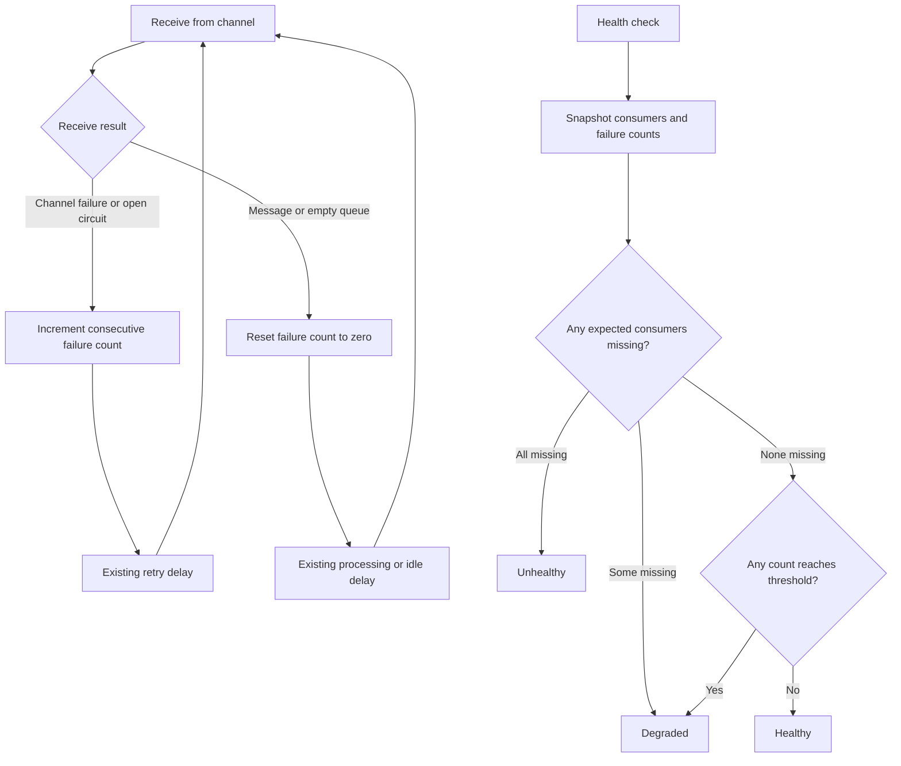
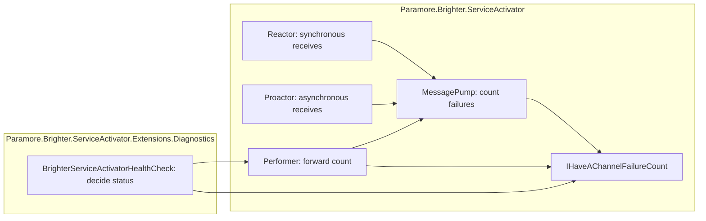

# 81. Report persistent channel failures in health checks

Date: 2026-10-07

## Status

Proposed

## Context

A consumer can keep running while every attempt to receive from its channel fails.
The health check counts consumers, so it reports Healthy during a complete loss of message reception.
Monitoring needs to distinguish a running consumer from one that can receive messages.

### Scope

**Parent requirement:** [Brighter issue 4547](https://github.com/BrighterCommand/Brighter/issues/4547).

**In scope**

- Track consecutive channel failures in synchronous and asynchronous message pumps.
- Include open circuit breakers in the receive failure count.
- Report Degraded after a configurable positive threshold, with the affected subscription and consumer.
- Clear failures on successful receives, including empty queues.
- Preserve consumer-count health checks and custom pump compatibility.

**Out of scope**

- Recreate deleted broker queues or subscriptions.
- Probe brokers from the health endpoint.
- Diagnose handler, mapper, acknowledgement, or requeue failures.
- Detect hung receive calls that neither return nor throw.

### Running consumers can still fail to receive

| Situation | Consumer count | Receive result | Health |
|-----------|----------------|----------------|--------|
| Working or idle channel | Expected | Message or empty queue | Healthy |
| Short failure burst | Expected | Failures below threshold | Healthy |
| Persistent channel failure | Expected | Consecutive failures reach threshold | Degraded |
| Some consumers missing | Below expected, above zero | Any | Degraded |
| All expected consumers missing | Zero | No receive attempts | Unhealthy |

Channel failures already trigger retries in each pump. The health check observes that retrying pump without stopping it.
An empty queue is a successful receive: it demonstrates channel access without requiring business traffic.

### The forces

- Health checks and message pumps run on different threads.
- Transports already communicate receive failures through `ChannelFailureException`.
- Existing custom pumps and performers implement public interfaces that must remain compatible.
- Diagnostics is optional; the Service Activator must not depend on ASP.NET health-check types.
- Failure delays and broker retries differ, so a failure count does not guarantee a fixed detection time.

## Decision

**Report Degraded when a running consumer reaches a configurable number of consecutive channel failures.**

The default threshold is three failures. Both pump types record failures in their existing receive exception paths.
Successful receives clear the count. Diagnostics reads it through an optional capability exposed by the performer.

### The mechanism, end to end



The count saturates at the largest integer, so a long outage cannot wrap it into a healthy value.
Atomic writes and reads make it available while the pump runs. Each pump remains the sole writer of its count.
Snapshots prevent the consumer list from changing between availability checks and diagnostic descriptions.

### Where the pieces live



### Key Components

#### The roles, and what each is responsible for

| Role | Type | Responsibilities | Responsibility classifier | Collaborators |
|------|------|------------------|---------------------------|---------------|
| Receive failure observer | MessagePump | Record failures and clear them after success | knowing, doing | Reactor, Proactor |
| Failure-count capability | IHaveAChannelFailureCount | Expose a count that can be read concurrently | knowing | MessagePump, Performer |
| Pump supervisor | Performer | Forward the pump's count, or zero for an unsupported custom pump | knowing | IAmAMessagePump |
| Health policy | BrighterServiceActivatorHealthCheck | Compare availability and failures with configured expectations | deciding | IDispatcher, IHaveAChannelFailureCount |

#### Failure-count contract

| Member | Input | Output | Error conditions |
|--------|-------|--------|------------------|
| ConsecutiveChannelFailures | None | Non-negative consecutive receive failure count | None |
| RecordChannelFailure | None | Count increases, saturating at the maximum integer | None |
| ResetChannelFailures | None | Count becomes zero | None |

#### Health-check contract

| Member | Input | Output | Error conditions |
|--------|-------|--------|------------------|
| Existing constructor | Dispatcher | Check with threshold three | Existing dispatcher requirements |
| Threshold constructor | Dispatcher, positive integer | Check with the requested threshold | Non-positive threshold throws ArgumentOutOfRangeException |
| CheckHealthAsync | Health-check context | Healthy, Degraded, or Unhealthy with a description | Existing dispatcher requirements |

#### Where each type is touched

| Assembly | Type | Change |
|----------|------|--------|
| ServiceActivator | MessagePump | Store count and expose the optional capability |
| ServiceActivator | Reactor, Proactor | Record receive failures and clear them after success |
| ServiceActivator | Performer | Forward the optional capability |
| Diagnostics | BrighterServiceActivatorHealthCheck | Apply failure threshold and describe affected consumers |

Existing pump, performer, consumer, and dispatcher interfaces retain their members.
Broker implementations, retry policies, and handler dispatch remain unchanged.

### Technology Choices

#### An optional capability preserves compatibility

Adding mandatory members to the existing interfaces would require custom implementations to change.
The optional interface lets built-in pumps report failures without imposing that requirement.
Custom pumps can opt in; unsupported pumps retain the existing consumer-count health behavior.

#### A failure count avoids an additional clock policy

The pump already observes every failure. A count adds a small amount of state and a clear reset rule.
A time-based threshold would need timestamps, clock configuration, and decisions about slow or outstanding receives.
The detection time remains dependent on receive latency and retry delays.

#### Diagnostics owns the threshold

The pump reports observations. The health check decides how many failures imply degraded health.
Two checks can use different thresholds without changing the pump's retry behavior.
The existing one-argument constructor remains available for source and binary compatibility.

### Implementation Approach

1. Add the optional failure-count interface in the Service Activator assembly.
2. Track failures in both receive exception branches, and reset after a non-null receive before message processing.
3. Forward the count through the existing performer.
4. Snapshot consumers in the health check and apply the threshold alongside availability checks.
5. Exercise the DI-created dispatcher with in-memory failing I/O for both pump types.
6. Verify recovery, threshold boundaries, circuit failures, and the affected projects' regression suites.

The implementation lives in `MessagePump.cs`, `Reactor.cs`, `Proactor.cs`, and `Performer.cs` in the Service Activator project.
The optional capability is `IHaveAChannelFailureCount.cs` in the same project.
The policy lives in `HealthChecks/BrighterServiceActivatorHealthCheck.cs` in the Diagnostics project.

ASP.NET Core maps Degraded to HTTP 200 by default. Applications using HTTP readiness probes must map Degraded to a failing response:

```csharp
app.MapHealthChecks("/health/ready", new HealthCheckOptions
{
    ResultStatusCodes =
    {
        [HealthStatus.Degraded] = StatusCodes.Status503ServiceUnavailable
    }
});
```

`HealthCheckOptions` is in `Microsoft.AspNetCore.Diagnostics.HealthChecks`, `HealthStatus` in `Microsoft.Extensions.Diagnostics.HealthChecks`,
and `StatusCodes` in `Microsoft.AspNetCore.Http`. The initializer preserves the default mappings for Healthy and Unhealthy.
The host application owns endpoint configuration; this check returns the requested Degraded status.

## Consequences

### Positive

- A consumer that repeatedly cannot receive no longer reports Healthy indefinitely.
- Idle channels recover to Healthy without requiring a message to arrive.
- The change applies to transports that report channel failures through the shared pump path.
- Health descriptions identify the consumer, subscription, and failure count.

### Negative

- A failure count provides no fixed detection deadline across transports.
- Custom pumps must opt in to receive failure reporting.
- A blocked receive call cannot update the failure count until it returns or throws.

### Risks and Mitigations

- Transient outages can change readiness. The default permits two failures, and callers can increase the threshold.
- Monitoring may observe state immediately before recovery. A later check observes the cleared count; checks perform no broker I/O.
- Health policy differs from retry policy. Degraded health leaves consumers running so they can recover.
- HTTP probes still succeed with ASP.NET Core's default status mapping. Applications must configure the readiness endpoint as shown above.

## Alternatives Considered

- **Keep consumer-count checks only:** preserves the misleading Healthy response during sustained receive failures.
- **Stop pumps on repeated failures:** prevents the existing retry loop from recovering and changes consumer lifecycle behavior.
- **Probe each broker from health checks:** adds network traffic, transport-specific logic, and permission requirements.
- **Recreate deleted Azure entities:** addresses one recovery mechanism, but does not report permission errors or other transport outages.
- **Use a time threshold:** can express a duration, but needs additional state and clock policy beyond the observed failure count.

## References

- [Issue 4547](https://github.com/BrighterCommand/Brighter/issues/4547)
- [Reactor and Proactor](0023-reactor-and-nonblocking-io.md)
- [Health checks documentation](https://brightercommand.gitbook.io/paramore-brighter-documentation/health-checks-and-observability/healthchecks)
- [ASP.NET Core health-check HTTP status configuration](https://learn.microsoft.com/en-us/aspnet/core/host-and-deploy/health-checks?view=aspnetcore-10.0#customize-the-http-status-code)
