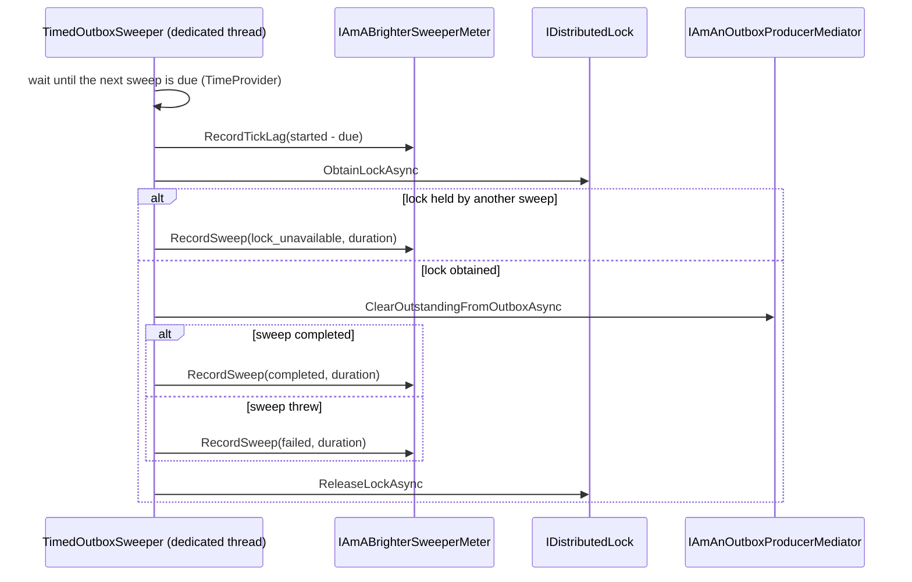
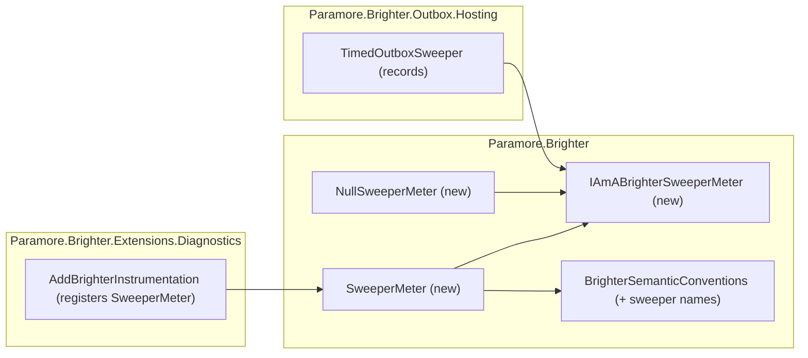

# 81. TimedOutboxSweeper health metrics

Date: 2026-10-08

## Status

Accepted

## Context

`TimedOutboxSweeper` re-sends outbox messages that were never confirmed as dispatched. When the
sweeper stops running, or runs late, messages wait in the outbox. With the `InMemoryOutbox`, those
messages are lost if the process restarts. Today an operator cannot see that this is happening.
The only signals are log lines, and the sweep's trace span, which production sampling usually drops.

### Scope

- **Parent issue**: [#4560](https://github.com/BrighterCommand/Brighter/issues/4560). The bugfix
  record is `bugfixes/0052-timed-outbox-sweeper-starvation/bugfix.md`.
- **In scope**
  - Three instruments that report the sweeper's own health: how late each sweep starts, how long
    each sweep takes, and how each sweep ends.
  - The role that records them, its default no-op implementation, and how it is registered.
- **Out of scope**
  - How many messages a sweep found or cleared. Draft PR #4484 (proposed ADR "Outbox metrics")
    counts cleared messages with a `clear_source` of `sweeper`. This ADR does not count messages
    again.
  - Thread-pool health (queue length, thread count). The .NET `System.Runtime` meter already
    publishes those. Brighter documents how to turn it on, and does not re-export it.
  - How the sweeper schedules its sweeps. The #4560 bugfix moves sweeps onto a dedicated thread.
    This ADR only defines what the sweeper measures on that schedule.
  - The outstanding-message check. Issue #4554 owns it.

### Silent stalls

| What went wrong | What an operator sees today |
| --- | --- |
| Blocked pool threads delay each sweep by seconds (measured 3–4.5 s on a 1 s interval) | Nothing, unless they compare log timestamps by hand |
| One sweep hangs on a slow broker, and every later tick gives up because the lock is held | A Warning log line on every tick |
| A sweep throws | An Error log line. Before #4560, the process crashed |
| The sweeper never starts, or starts once and stops (for example, `TimerInterval = 0`) | Nothing |

In each of these cases, the outbox grows and nothing in the metrics shows why.

### The forces

- Sweeper health must be visible when tracing is off or unsampled. Metrics derived from spans
  (ADR 0022) do not meet that need.
- The sweeper must not depend on OpenTelemetry. `Paramore.Brighter.Outbox.Hosting` must work when
  no metrics are configured.
- Attribute cardinality must stay fixed and small. The sweeper runs every few seconds in every
  process.
- Names follow ADR 0010. A Brighter-specific instrument uses the `paramore.brighter.*` prefix, as
  `paramore.brighter.circuit_breaker.trips` does.
- These metrics must not duplicate the outbox metrics that #4484 proposes.

## Decision

**`TimedOutboxSweeper` records three instruments directly, through an `IAmABrighterSweeperMeter`
role: tick lag, sweep duration, and a count of sweeps by outcome.**

The sweeper owns its schedule, so the sweeper is the only type that knows when a sweep was due and
when it started. The sweeper calls a small meter role at three points in each sweep. When metrics
are not configured, a no-op implementation keeps the cost at almost nothing.

### The mechanism, end to end



Three invariants follow from this sequence:

- **Every sweep is measured exactly once.** That includes a sweep that gives up because the lock is
  held, and a sweep that throws. The outcome counter therefore counts every sweep the sweeper
  started.
- **Tick lag is measured before any I/O.** A slow broker therefore shows up in sweep duration, not
  in tick lag. High tick lag means the sweeper could not start on time. With a dedicated thread,
  that points at CPU throttling rather than the thread pool.
- **The due time comes from the schedule, not from the previous sweep.** If one sweep overruns, the
  lag on the next sweep shows it.

### Where the pieces live



`TimedOutboxSweeper` depends only on the role. `AddBrighterInstrumentation` registers the real
meter. When that call is absent, the sweeper uses `NullSweeperMeter`.

### Key Components

#### The roles, and what each is responsible for

| Role | Type | Responsibilities | Responsibility classifier | Collaborators |
| --- | --- | --- | --- | --- |
| Records sweeper health | `IAmABrighterSweeperMeter` (Paramore.Brighter) | Accepts a tick lag; accepts a sweep's outcome and duration | doing | `TimedOutboxSweeper` |
| Publishes sweeper instruments | `SweeperMeter` (Paramore.Brighter) | Owns the three instruments on the `Paramore.Brighter` meter; maps an outcome to its attribute value | knowing, doing | `IMeterFactory`, `BrighterSemanticConventions` |
| Records nothing | `NullSweeperMeter` (Paramore.Brighter) | Satisfies the role at no cost when metrics are not configured | doing | none |
| Measures its own sweeps | `TimedOutboxSweeper` (Outbox.Hosting) | Knows when each sweep was due and when it started; classifies each sweep's outcome | knowing, deciding | `IAmABrighterSweeperMeter`, `TimeProvider` |

The split that matters: the sweeper **decides** what happened, and the meter only **records** it.
The meter holds no schedule state, so a second sweeper type could reuse it unchanged.

#### `IAmABrighterSweeperMeter`

```csharp
public interface IAmABrighterSweeperMeter
{
    void RecordTickLag(TimeSpan lag);
    void RecordSweep(SweepOutcome outcome, TimeSpan duration);
}

public enum SweepOutcome { Completed, Failed, LockUnavailable }
```

| Member | Input | Output | Error conditions |
| --- | --- | --- | --- |
| `RecordTickLag` | Time from when the sweep was due to when it started. A negative value is recorded as zero | none | Never throws |
| `RecordSweep` | How the sweep ended, and how long it took | none | Never throws. A metrics failure must not fail a sweep |

#### The instruments

All three instruments are on the existing `Paramore.Brighter` meter (`BrighterSemanticConventions.MeterName`).

| Instrument | Type | Unit | Attributes |
| --- | --- | --- | --- |
| `paramore.brighter.outbox_sweeper.tick.lag` | `Histogram<double>` | `s` | none |
| `paramore.brighter.outbox_sweeper.sweep.duration` | `Histogram<double>` | `s` | `paramore.brighter.outbox_sweeper.outcome` |
| `paramore.brighter.outbox_sweeper.sweeps` | `Counter<long>` | `{sweep}` | `paramore.brighter.outbox_sweeper.outcome` |

`paramore.brighter.outbox_sweeper.outcome` takes one of three values: `completed`, `failed` or
`lock_unavailable`.

#### Where each type is touched

| Assembly | Type | Change |
| --- | --- | --- |
| Paramore.Brighter | `IAmABrighterSweeperMeter`, `SweepOutcome`, `SweeperMeter`, `NullSweeperMeter` | New |
| Paramore.Brighter | `BrighterSemanticConventions` | New constants for the instrument and attribute names |
| Paramore.Brighter.Outbox.Hosting | `TimedOutboxSweeper` | New optional constructor parameter `IAmABrighterSweeperMeter? meter = null`; records at the three points above |
| Paramore.Brighter.Extensions.Diagnostics | `BrighterMetricsBuilderExtensions` | `TryAddSingleton<IAmABrighterSweeperMeter, SweeperMeter>()` |

The following stay **unchanged**:

- `IAmABrighterMessagingMeter`, `IAmABrighterDbMeter` and `BrighterMetricsFromTracesProcessor`.
- The sweeper's log lines, which remain for operators who read logs.
- `OutboxProducerMediator`, because the sweeper measures the call, not what happens inside it.
- `TimedOutboxArchiver`. It could adopt the same role later, but this ADR does not change it.

### Technology Choices

#### Why record directly instead of deriving from spans?

The span-derived pattern (ADR 0022) only produces a metric when a span is recorded. Sweeper spans
are high-volume and low-value, so production sampling drops most of them. A stall is visible only
if every sweep is measured. Direct instruments measure every sweep whatever the sampling is.

#### Why a role and a null object instead of a nullable `Meter`?

`TimedOutboxSweeper` must not reference OpenTelemetry. A null object also removes a null check from
every recording point. A test can supply the real `SweeperMeter` with an `IMeterFactory` and read
the values with a `MeterListener`. The test then needs no OpenTelemetry pipeline.

#### Why three outcomes and no more?

These three outcomes are the ones that need different responses. `failed` means read the logs.
`lock_unavailable` means a sweep is overrunning or hung. `completed` is the baseline. A sweep that
the mediator skipped internally is still `completed` from the sweeper's point of view. That case
can only happen with a second caller of `ClearOutstandingFromOutboxAsync`.

### Implementation Approach

1. **Structural:** add the names to `BrighterSemanticConventions`. Add `IAmABrighterSweeperMeter`,
   `SweepOutcome` and `NullSweeperMeter`. Add the optional parameter to the `TimedOutboxSweeper`
   constructor and default it to `NullSweeperMeter`. No behaviour changes.
2. **Behavioural, test first:** add `SweeperMeter` and record the outcome and duration of each
   sweep. The tests use a `MeterListener` over an `IMeterFactory` from `ServiceCollection.AddMetrics()`.
3. **Behavioural, test first:** record tick lag. This step depends on the #4560 scheduling change,
   which gives the sweeper a due time to measure against.
4. **Behavioural:** register `SweeperMeter` in `AddBrighterInstrumentation` (`BrighterMetricsBuilderExtensions.cs:38`).
5. **Docs:** add a sweeper section to the observability guide. It covers the three instruments,
   suggested alerts, and turning on the .NET `System.Runtime` meter for thread-pool queue length
   and thread count.

## Consequences

### Positive

- An operator can alert on a stalled or late sweeper. Two examples: no `completed` sweeps for N
  intervals, or tick-lag p99 above the interval.
- The instruments separate a slow broker (high sweep duration) from a starved process (high tick
  lag). It took several experiments to tell those apart for #4560.
- Every recording point is cheap when metrics are not configured.

### Negative

- Brighter gains a third meter role next to `IAmABrighterMessagingMeter` and `IAmABrighterDbMeter`.
  The draft outbox meter in #4484 would make a fourth. Merging the outbox meter and the sweeper
  meter later would break the source of anyone who implements the role.
- The constructor of `TimedOutboxSweeper` grows again. Callers who construct the sweeper by hand get
  no metrics unless they pass a meter.

### Risks and Mitigations

| Risk | Mitigation |
| --- | --- |
| The names conflict with the outbox metrics in #4484 | Both use the `paramore.brighter.` prefix, and this ADR uses the `outbox_sweeper` segment. Neither counts messages twice. The #4484 review should cross-reference this ADR |
| A meter failure breaks sweeping | The role's contract says it never throws. The sweeper records outside the lock and inside its catch-all. A test checks that a throwing meter does not stop sweeps |
| Tick lag is misread when the sweeper is stopped | The sweeper records lag only for sweeps it starts, never for the wait that `StopAsync` cancels |

## Alternatives Considered

**1. Derive the metrics from sweeper spans (ADR 0022).** This needs no new role.
**Rejected because** sampling drops the spans, so a stall would be invisible exactly when it
matters.

**2. Add the instruments to the outbox meter proposed in #4484.** This gives one meter for the outbox.
**Rejected because** #4484 is a draft with open naming questions. Sweeper health and outbox volume
also answer different questions. A later ADR can merge the two meters once #4484 lands.

**3. Expose only the thread-pool runtime metrics.** This needs no Brighter change.
**Rejected because** those metrics show the cause (a starved pool) but not the effect on Brighter
(a late or stalled sweeper). Delays not caused by the pool, such as a hung sweep or CPU throttling,
would not show at all.

**4. Do nothing and rely on logs.** **Rejected because** the logs report each event but give no
rate or latency, and most log pipelines sample or drop Information lines.

## References

- Issue: [#4560](https://github.com/BrighterCommand/Brighter/issues/4560). Bugfix record
  `bugfixes/0052-timed-outbox-sweeper-starvation/bugfix.md`
- Related ADRs:
  - [ADR 0010: Brighter OpenTelemetry Semantic Conventions](0010-brighter-semantic-conventions.md),
    which supplies the naming rules
  - [ADR 0022: Generate Metrics from Traces](0022-generate-metrics-from-traces.md), the pattern this
    ADR does not use
  - [ADR 0039: OpenTelemetry Builder Extension](0039-opentelemetry-builder-extension.md), which
    supplies the registration point
  - [ADR 0028: Support Circuit Breaking for Topics in Outbox Sweeper](0028-support-circuit-breaking-of-topics.md),
    which also changes the sweeper
- Related work: draft PR [#4484](https://github.com/BrighterCommand/Brighter/pull/4484), outbox
  metrics; issue [#4554](https://github.com/BrighterCommand/Brighter/issues/4554), the outstanding-message check
- External: [.NET runtime metrics (`System.Runtime` meter)](https://learn.microsoft.com/dotnet/core/diagnostics/built-in-metrics-runtime)
