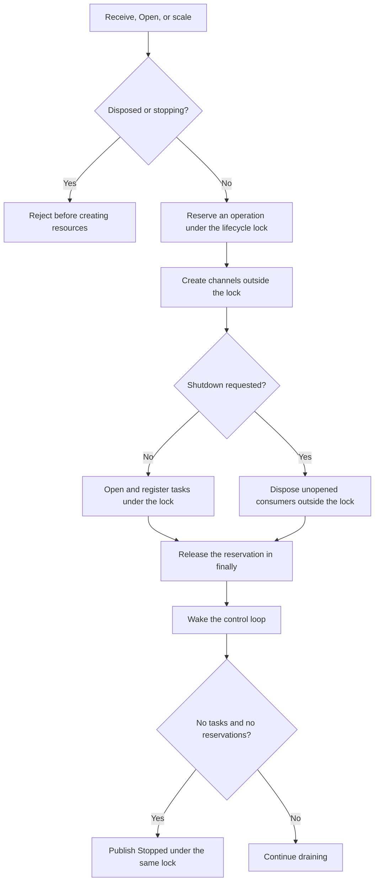
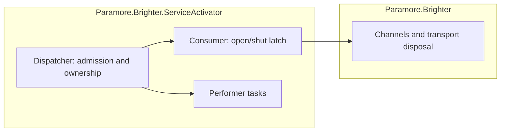

# 83. Coordinate Dispatcher startup and shutdown

## Context

A Dispatcher owns channels as soon as it creates their consumers, before any performer task exists.
Previously, cleanup depended on completed tasks. A consumer shut before opening therefore leaked,
and a concurrent dynamic open could register its task after the control loop had already stopped.

### Scope

- Parent requirement: [issue 4541](https://github.com/BrighterCommand/Brighter/issues/4541).
- In scope: coordinate receive, dynamic opening, scaling, task registration, and whole-Dispatcher shutdown.
- In scope: clean up consumers without tasks, contain disposal failures, and preserve restart after shutdown.
- In scope: release consumers already created when a later channel factory call fails.
- Out of scope: cancel transport factories that block indefinitely, or redesign how competing per-subscription scaling requests are reconciled.

### Shutdown can overtake an accepted operation

| Ordering | Previous result | Required result |
|---|---|---|
| Shut before Open | No task, so no cleanup | Dispose and remove the consumer |
| End during channel creation | End could complete before the consumer existed | Drain the accepted operation, disposing the late consumer |
| Final task completes during registration | Control loop could stop before the new task was registered | Check pending operations and tasks together |
| Open during shutdown | A new performer could escape the shutdown snapshot | Reject the operation before allocating resources |

The channel and consumer dictionaries protect individual accesses. They do not make these lifecycle
decisions atomic. Waiting only for registered tasks cannot account for resources under construction.

### The forces

- Channel factories and transport disposal may block; they must not hold the lifecycle lock.
- Shutdown must account for work it already accepted, including work without a task.
- Receive must return after its batch has opened or been retired by a concurrent shutdown.
- Restart after an awaited End must remain possible; a disposed Dispatcher must not restart.
- A failed cleanup must not prevent the remaining resources from being retired.

## Decision

**Count accepted consumer operations and coordinate admission, task registration, and control-loop exit under one lifecycle lock.**

The control loop starts when the first operation is accepted. It stays alive while either registered
tasks or accepted operations remain. End closes admission and stops the published consumers; an
accepted operation that finishes creating consumers afterward disposes them without running them.

### The mechanism, end to end

No accepted operation can register a task after its run has stopped. Shutdown does not complete
until cleanup of unstarted consumers has finished. The control loop waits for tasks and disposes
completed consumers outside the lock, so those actions cannot block admission decisions.

### Where the pieces live

### Key Components

#### The roles, and what each is responsible for

| Role | Type | Responsibilities | Responsibility classifier | Collaborators |
|---|---|---|---|---|
| Lifecycle owner | Dispatcher | Admit operations, track ownership, and complete shutdown | Deciding, doing | Consumer, performer tasks |
| Startup latch | Consumer | Honor a shut request before starting a performer | Deciding | Performer |
| Resource boundary | Channel / ChannelAsync | Release the transport consumer | Doing | Transport implementation |

| Member | Input | Output | Error conditions |
|---|---|---|---|
| Receive / Open / SetActivePerformers | Subscription operation | Opened consumers, or retired consumers if End intervened | InvalidOperationException while stopping; ObjectDisposedException after disposal; creation errors propagate |
| End | Shutdown request | Task covering accepted operations and performers | A blocked factory or performer still requires the caller's timeout policy |
| Dispose / DisposeAsync | Final teardown | Drained performers, then owned factories | Existing ShutdownTimeout bounds the drain |

#### Where each type is touched

| Assembly | Type | Change |
|---|---|---|
| ServiceActivator | Dispatcher | Reservation count, short lifecycle lock, and fault-tolerant cleanup |
| ServiceActivator | IDispatcher | Document admission and shutdown guarantees |
| Core.Tests | Dispatcher lifecycle tests | Gated in-memory channel creation, failure, disposal, and restart cases |

Consumer's latch, transport APIs, and the public Dispatcher state enumeration are unchanged.
DS_RUNNING describes an active run, including accepted consumers still being created.

### Technology Choices

#### Why a monitor and operation count?

The existing control loop already uses a dedicated thread. A monitor lets that thread wait when
only channel creation remains and wake when an operation publishes a task or completes. All exit
decisions use the same lock as admission; no polling interval or additional public state is needed.

### Implementation Approach

1. Reserve each consumer operation before allocating channels. Release the reservation in finally.
2. Open and register tasks together; retire consumers whose latch prevented startup.
3. Let End reject new operations and let the control loop wait for reservations as well as tasks.
4. Retire completed tasks before disposal and observe performer faults, preserving the cleanup
   behavior from [PR 4561](https://github.com/BrighterCommand/Brighter/pull/4561).
5. Test channel creation paused across End, rejected admission, disposal failures, and restart.

## Consequences

### Positive

- Shutdown covers resources that have no performer task yet.
- Late task registration cannot leave a stopped Dispatcher with an unretired consumer.
- Creation and cleanup failures do not strand accepted-operation reservations.

### Negative

- Callers that race opening or scaling with End must now await shutdown and retry afterward.
- The control thread may remain waiting while a transport factory is blocked.

### Risks and Mitigations

- A lifecycle lock around external I/O could deadlock. Factories, disposal, and task waits stay outside it.
- A lost reservation would hang shutdown. Every accepted operation releases its count in finally.
- A passing stress run alone cannot prove the ordering. Regression tests pause channel creation
  explicitly; stress runs separately exercise the publication and task-registration window.

## Alternatives Considered

- Only skip null tasks and dispose unopened consumers: fixes the original leak but leaves the
  control-loop exit race reproduced during review.
- Hold a single lock through channel creation and shutdown: prevents timely End calls and risks
  deadlock with transport callbacks.
- Keep the startup handshake alone: protects Receive's return but does not cover dynamic additions
  or channels still being created when shutdown begins.

## References

- [Issue 4541](https://github.com/BrighterCommand/Brighter/issues/4541)
- [Original startup fix, PR 4081](https://github.com/BrighterCommand/Brighter/pull/4081)
- [Disposal failure handling, PR 4561](https://github.com/BrighterCommand/Brighter/pull/4561)
