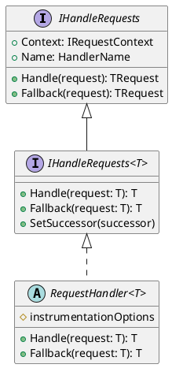
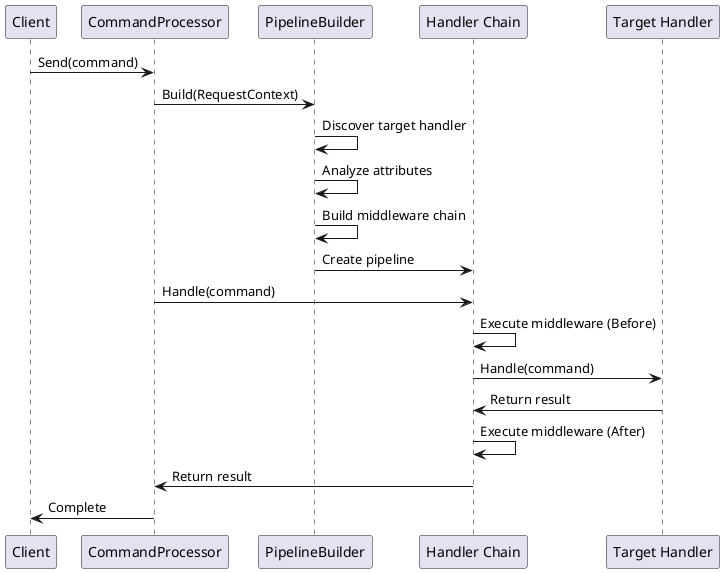
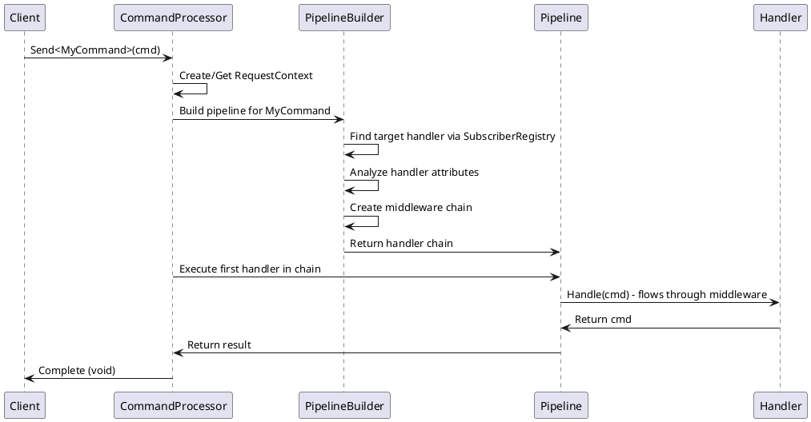
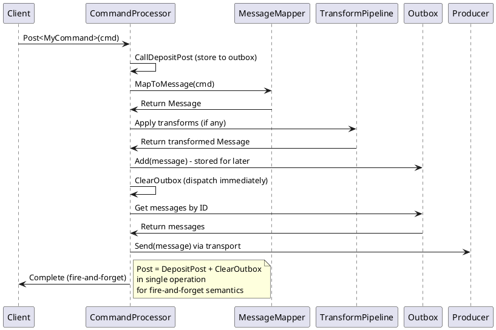
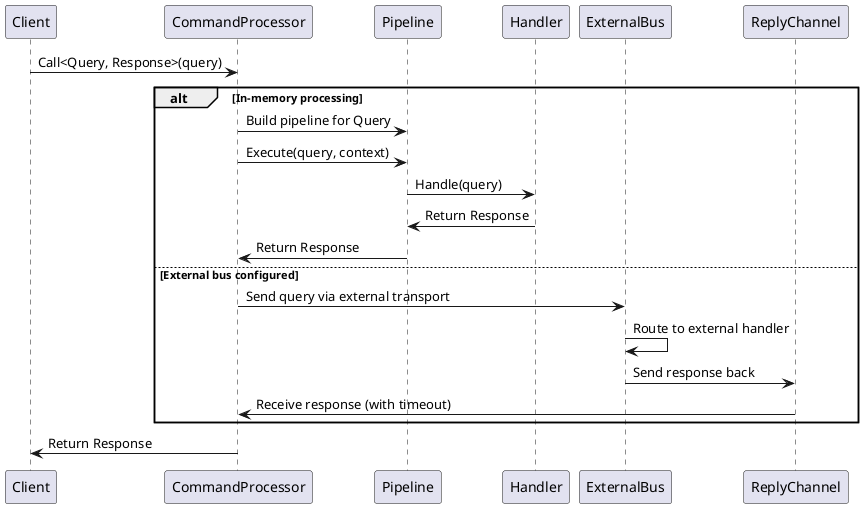
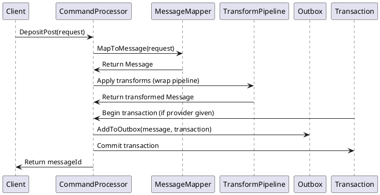
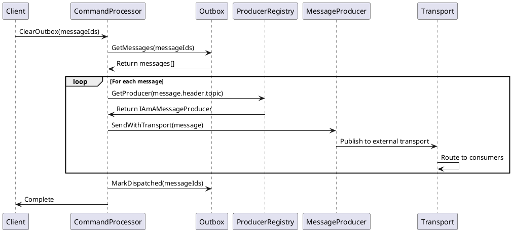
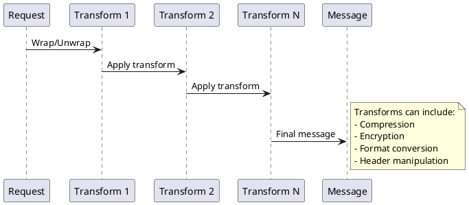
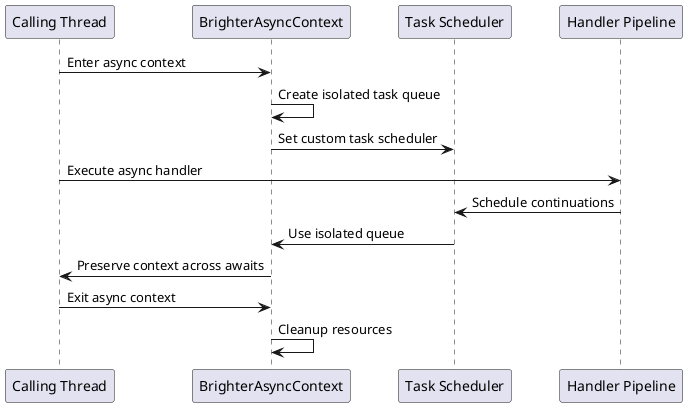
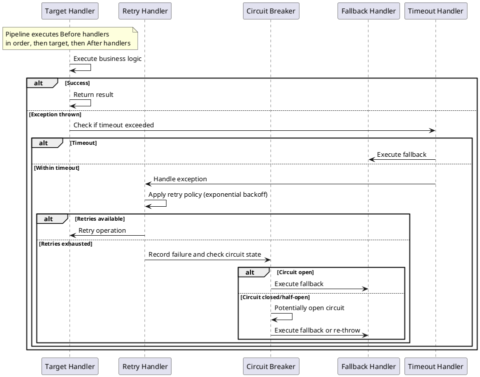

# Paramore.Brighter Core Architecture Guide

## Overview

This guide documents the internal architecture of the Paramore.Brighter core assembly, focusing on how the CommandProcessor works "under the hood" to help new contributors understand the design and implementation decisions.

Paramore.Brighter implements the **Command Dispatcher** and **Command Processor** design patterns to provide a framework for:
- In-memory command/event processing with pipelines
- Asynchronous messaging via external transports (Task Queue pattern)
- Cross-cutting concerns through middleware (logging, retries, circuit breakers, etc.)
- Transactional messaging through the Outbox pattern

## Core Design Principles

### 1. Request-Response Foundation
At its heart, Brighter treats everything as a request that flows through a pipeline:
- **Commands** - Point-to-point imperative instructions (`Send`)
- **Events** - Pub-sub notifications (`Publish`) 
- **RPC** - Request-reply synchronous calls (`Call`)
- **Messages** - Asynchronous task queue operations (`Post` and `Clear`)

### 2. Pipeline-Driven Architecture
Every request flows through a pipeline of handlers:
- Target handler contains business logic
- Middleware handlers provide cross-cutting concerns
- Handlers are chained together using the Chain of Responsibility pattern
- The pipeline is built dynamically based on attributes placed on a handler

### 3. Separation of Direct vs. Bus
- **Direct** - Direct handler invocation for local processing
- **Bus** - Message-based communication via transports (RabbitMQ, AWS SQS, etc.)
- **Outbox pattern** - Ensures transactional consistency for external messaging
- **Inbox pattern** - Deduplicates messages for external messaging

## Core Components

### CommandProcessor
The `CommandProcessor` class serves as the central orchestrator, implementing both the Command Dispatcher and Command Processor patterns.

**Key responsibilities:**
- Route requests to appropriate handlers
- Build and execute handler pipelines  
- Manage external bus operations (Post/ClearOutbox)
- Handle request/reply messaging
- Provide instrumentation and telemetry hooks

**Core dispatch methods:**
```csharp
// Point-to-point command
void Send<T>(T command) where T : class, IRequest

// Pub-sub event  
void Publish<T>(T @event) where T : class, IRequest

// Synchronous request-reply
TResponse Call<T, TResponse>(T query) where T : class, ICall<TResponse>

// Asynchronous via external queue
void Post<T>(T request) where T : class, IRequest
```

### Handler Interface Hierarchy



**IHandleRequests** - Base non-generic interface for pipeline management
**IHandleRequests&lt;T&gt;** - Generic interface for typed request handling  
**RequestHandler&lt;T&gt;** - Abstract base class providing common pipeline functionality

## Pipeline Construction and Execution

### Pipeline Builder
The `PipelineBuilder<T>` constructs handler chains dynamically:

1. **Target Handler Discovery** - Uses `IAmASubscriberRegistry` to find the handler type for the request
2. **Attribute Analysis** - Reflects on the handler method to find `RequestHandlerAttribute` decorations
3. **Pipeline Assembly** - Creates a chain based on attribute ordering and timing
4. **Handler Instantiation** - Uses `IAmAHandlerFactory` to create handler instances

### Pipeline Flow Diagram



### Middleware Attribute System
Handlers use attributes to declaratively add middleware to their pipeline:

```csharp
public class MyCommandHandler: RequestHandler<MyCommand>
{
    [RequestLogging(1, HandlerTiming.Before)]
    [Retry(2, HandlerTiming.Before)] 
    [CircuitBreaker(3, HandlerTiming.Before)]
    public override MyCommand Handle(MyCommand command)
    {
        // Business logic here
        return base.Handle(command);
    }
}
```

**Attribute Properties:**
- **Step** - Execution order within timing group
- **Timing** - Before/After target handler execution
- **InitializerParams** - Pass configuration from attribute to handler instance

### Request Context Flow
`RequestContext` flows through the entire pipeline:
- Created by `IAmARequestContextFactory` 
- Passed between middleware handlers
- Contains telemetry information, user context, etc.
- Can be provided externally or created internally

## Dispatch Mechanisms Deep Dive

### Send - Command Dispatch


**Implementation Details:**
```csharp
public void Send<T>(T command, RequestContext? requestContext = null) 
    where T : class, IRequest
{
    // Validate dependencies
    if (_handlerFactorySync == null)
        throw new InvalidOperationException("No handler factory defined.");

    // Create telemetry span
    var span = _tracer?.CreateSpan(CommandProcessorSpanOperation.Send, command, 
        requestContext?.Span, options: _instrumentationOptions);
    var context = InitRequestContext(span, requestContext);

    using var builder = new PipelineBuilder<T>(_subscriberRegistry, 
        _handlerFactorySync, _inboxConfiguration);
    
    // Build the handler chain with middleware
    var handlerChain = builder.Build(context);
    
    // Ensure exactly one handler for commands (point-to-point)
    AssertValidSendPipeline(command, handlerChain.Count());
    
    // Execute the pipeline
    handlerChain.First().Handle(command);
}
```

**Characteristics:**
- Synchronous execution
- Single target handler (point-to-point) - validated by `AssertValidSendPipeline`
- In-memory processing only
- Pipeline with middleware support
- Telemetry integration with OpenTelemetry spans

### Publish - Event Dispatch
```plantuml
@startuml
participant Client
participant CommandProcessor as CP
participant PipelineBuilder as PB
participant "Handler 1" as H1
participant "Handler 2" as H2
participant "Handler N" as HN

Client -> CP: Publish<MyEvent>(evt)
CP -> CP: Find all handlers for MyEvent via SubscriberRegistry
CP -> PB: Build pipeline for each handler
par Parallel Execution
  CP -> H1: Handle(evt) via pipeline
and
  CP -> H2: Handle(evt) via pipeline
and
  CP -> HN: Handle(evt) via pipeline
end
CP -> CP: Collect any exceptions
CP -> Client: Complete or throw AggregateException
note right: Each handler executes\nin parallel with its own\nmiddleware pipeline
@enduml
```

**Implementation Details:**
```csharp
public void Publish<T>(T @event, RequestContext? requestContext = null) 
    where T : class, IRequest
{
    // Create telemetry tracking for all handlers
    var handlerSpans = new ConcurrentDictionary<string, Activity>();
    var exceptions = new ConcurrentBag<Exception>();
    
    // Build separate pipeline for each handler
    using var builder = new PipelineBuilder<T>(_subscriberRegistry, 
        _handlerFactorySync, _inboxConfiguration);
    var handlerChain = builder.Build(context);

    // Execute all handlers in parallel
    Parallel.ForEach(handlerChain, (handleRequests) =>
    {
        try
        {
            var handlerName = handleRequests.Name.ToString();
            handlerSpans[handlerName] = _tracer?.CreateSpan(
                CommandProcessorSpanOperation.Publish, @event, span);
            handleRequests.Handle(@event);
        }
        catch (Exception e)
        {
            exceptions.Add(e); // Collect but don't stop other handlers
        }
    });

    // Throw aggregate exception if any handlers failed
    if (exceptions.Any())
    {
        throw new AggregateException(
            "Failed to publish to one more handlers successfully", 
            exceptions);
    }
}
```

**Characteristics:**
- Multiple handlers (pub-sub pattern)
- Parallel execution using `Parallel.ForEach`
- Exception aggregation - failures don't stop other handlers
- Each handler gets its own pipeline with middleware
- In-memory processing only
- Telemetry spans are linked across all handlers

### Post - Asynchronous Messaging


**Implementation Details:**
```csharp
public void Post<TRequest>(TRequest request, RequestContext? requestContext = null, 
    Dictionary<string, object>? args = null) where TRequest: class, IRequest
{
    // Post is implemented as immediate DepositPost + ClearOutbox
    var messageId = CallDepositPost(request, null, requestContext, args, null, s_transactionType);
    ClearOutbox([messageId], requestContext, args);
}

// The actual deposit implementation:
private Id CallDepositPost<TRequest>(TRequest request, ...)
{
    // 1. Map request to message
    var message = GetMessageMapper<TRequest>().MapToMessage(request);
    
    // 2. Apply any configured transforms 
    message = ApplyTransforms(message);
    
    // 3. Store in outbox (transactionally if transaction provider given)
    var messageId = AddToOutbox(message, transactionProvider);
    
    return messageId;
}
```

**Characteristics:**
- Asynchronous/fire-and-forget - doesn't wait for processing
- Message transformation via `IAmAMessageMapper<T>`
- Outbox pattern for reliability and transactional consistency
- Supports external transports (RabbitMQ, SQS, etc.)
- Transform pipeline for compression, encryption, and other operations.
- Immediate dispatch (combines DepositPost + ClearOutbox)

### Call - RPC Pattern  


**Implementation Details:**
The Call operation supports a blocking RPC-style interaction:

```csharp
// Similar to Post but returns a response
TResponse? result = commandProcessor.Call<MyQuery, MyResponse>(query);

// External call setup requires reply channels
var replyChannelFactory = // Configure reply channel factory
var commandProcessor = CommandProcessorBuilder.With()
    .RequestReplyQueues(replyChannelFactory, replySubscriptions)
    .Build();
```

**Characteristics:**
- Synchronous request-reply pattern
- Returns typed response (`TResponse`)
- Can work in-memory or via external bus
- Timeout support for external calls to prevent blocking
- Reply channel management for external scenarios
- Supports same middleware pipeline as Send/Publish

## Outbox Pattern Implementation

The Outbox pattern ensures transactional consistency between your domain changes and message publishing. Brighter implements this through two separate operations that can be used together or independently.

### DepositPost Operation
The `DepositPost` method implements the first phase of the Outbox pattern:



**Implementation Flow:**
1. **Message Mapping** - Convert domain object to transport message via `IAmAMessageMapper<T>`
2. **Transform Pipeline** - Apply any configured transforms (e.g., compression, encryption, etc.)
3. **Transactional Storage** - Store message in outbox within the same transaction as domain changes
4. **Return Message ID** - Client gets ID for later use with `ClearOutbox`

**Key Implementation Details:**
```csharp
public Id DepositPost<TRequest>(TRequest request, 
    IAmABoxTransactionProvider<TTransaction>? transactionProvider,
    RequestContext? requestContext = null,
    Dictionary<string, object>? args = null) where TRequest : class, IRequest
{
    // Find message mapper for request type
    var mapper = GetMessageMapper<TRequest>();
    var message = mapper.MapToMessage(request);
    
    // Apply transform pipeline (WrapWith attributes)
    message = ApplyTransformPipeline(message, request);
    
    // Add to outbox within transaction scope
    AddToOutbox(message, transactionProvider, batchId);
    
    return message.Id;
}
```

**Bulk Operations:**
Brighter supports bulk `DepositPost` for efficiency:
- Batches multiple requests into a single outbox transaction
- Reduces database round trips
- Maintains transactional consistency across the entire batch

### ClearOutbox Operation
The `ClearOutbox` method implements the second phase - actual message dispatch:



**Implementation Details:**
```csharp
public void ClearOutbox(Id[] ids, RequestContext? requestContext = null,
    Dictionary<string, object>? args = null)
{
    // Delegate to the outbox mediator, which handles:
    // 1. Retrieve messages fromthe  outbox by ID
    // 2. Route each message to the appropriate producer
    // 3. Send via external transport
    // 4. Mark as dispatched on success
    s_mediator!.ClearOutbox(ids, context, args);
}
```

**Key aspects:**
- **Message Retrieval** - Gets specific messages by ID from the Outbox
- **Producer Selection** - Routes to the appropriate producer based on message topic/type
- **Transport Dispatch** - Sends via configured external transport (RabbitMQ, SQS, etc.)
- **State Management** - Marks messages as dispatched to prevent re-sending
- **Error Handling** - Failed messages remain in the outbox for retry

### Transactional Integration

**Database Transaction Example:**
```csharp
// Within your application service/command handler:
using var transaction = transactionProvider.BeginTransaction();
try
{
    // 1. Modify your domain entities
    customer.UpdateEmail(newEmail);
    dbContext.SaveChanges();
    
    // 2. Store outbound events in the same transaction
    var @event = new CustomerEmailChanged(customer.Id, newEmail);
    var messageId = commandProcessor.DepositPost(@event, transactionProvider);
    
    // 3. Commit both changes atomically
    transaction.Commit();
    
    // 4. Dispatch events after a successful commit
    commandProcessor.ClearOutbox([messageId]);
}
catch
{
    transaction.Rollback();
    throw;
}
```

### Outbox Sweeper Pattern

For high-reliability scenarios, implement an outbox sweeper that periodically processes undispatched messages:

```csharp
// Background service that runs periodically
public class OutboxSweeper : BackgroundService
{
    protected override async Task ExecuteAsync(CancellationToken stoppingToken)
    {
        while (!stoppingToken.IsCancellationRequested)
        {
            var undispatchedMessages = await outbox.GetUndispatchedMessages();
            if (undispatchedMessages.Any())
            {
                await commandProcessor.ClearOutboxAsync(
                    undispatchedMessages.Select(m => m.Id));
            }
            await Task.Delay(TimeSpan.FromSeconds(30), stoppingToken);
        }
    }
}
```

**Benefits:**
- **Guarantees delivery** - Messages won't be lost even if ClearOutbox fails
- **Handles transient failures** - Automatic retry of failed dispatches
- **Operational resilience** - System recovers from temporary outages

## Message Transformation Pipeline

### Transform Chain Architecture
Messages can be transformed as they flow through the system:



**Transform Types:**
- **WrapWith** - Outbound message transformation
- **UnwrapWith** - Inbound message transformation  
- **Configurable pipeline** - Applied based on message metadata

### Message Mapper Registry
The `MessageMapperRegistry` provides bi-directional mapping:

```csharp
public interface IAmAMessageMapper<T> where T : class, IRequest
{
    Message MapToMessage(T request);
    T MapToRequest(Message message);
}
```

**Responsibilities:**
- Convert between domain objects and wire format
- Handle serialization/deserialization
- Set message headers (topic, correlation ID, etc.)
- Support for async operations

## Synchronization Context

### BrighterSynchronizationContext
Brighter provides a custom `SynchronizationContext` to control task scheduling and prevent common async pitfalls:

```csharp
public class BrighterSynchronizationContext : SynchronizationContext
{
    private readonly BrighterAsyncContext _asyncContext;
    
    // Controls how async continuations are scheduled
    // Prevents deadlocks in certain hosting scenarios
    // Integrates with BrighterAsyncContext for task isolation
}
```

**Key Implementation Details:**
```csharp
public override void Post(SendOrPostCallback callback, object? state)
{
    // Schedules work to run asynchronously on task pool
    _asyncContext.TaskQueue.Enqueue(new ContextMessage(callback, state));
}

public override void Send(SendOrPostCallback callback, object? state)
{
    // Executes work synchronously on current thread
    // Used for immediate execution scenarios
    callback(state);
}
```

### Async Context Management
The `BrighterAsyncContext` provides logical execution boundaries:



**Key features:**
- **Task isolation** - Prevents cross-contamination between handler executions
- **Deadlock prevention** - Avoids blocking on async operations in sync contexts
- **Context preservation** - Maintains logical call context across async boundaries
- **Resource management** - Ensures proper cleanup of async resources
- **Integration** - Works with ASP.NET Core and other hosting models

### Usage Patterns

#### 1. Handler Context Isolation
```csharp
public class AsyncCommandHandler : RequestHandlerAsync<MyCommand>
{
    public override async Task<MyCommand> HandleAsync(MyCommand command, 
        CancellationToken cancellationToken = default)
    {
        // Async operations automatically use BrighterSynchronizationContext
        await SomeAsyncOperation();
        
        // Context is preserved across awaits
        var userId = Context.Bag["UserId"]; // Still available
        
        return await base.HandleAsync(command, cancellationToken);
    }
}
```

#### 2. Custom Async Context Factory
```csharp
public class CustomRequestContextFactory : IAmARequestContextFactory
{
    public RequestContext Create()
    {
        var context = new RequestContext();
        
        // Set custom synchronization context
        SynchronizationContext.SetSynchronizationContext(
            new BrighterSynchronizationContext(new BrighterAsyncContext()));
            
        return context;
    }
}
```

### Integration with ASP.NET Core
Brighter's synchronization context integrates seamlessly with ASP.NET Core:

```csharp
// In startup configuration
services.AddBrighter(options =>
{
    // Brighter automatically configures sync context
    // to work with ASP.NET Core's context
})
.UseCustomSynchronizationContext(); // Optional: override default behavior
```

**Benefits in web scenarios:**
- Prevents deadlocks when mixing sync/async code
- Maintains HTTP context across handler execution
- Proper cleanup of request-scoped resources
- Compatible with dependency injection scopes

## Request Context and Telemetry

### Request Context Factory
The `IAmARequestContextFactory` creates request contexts:

```csharp
public interface IAmARequestContextFactory  
{
    RequestContext Create();
}
```

**Context Contents:**
- **Correlation ID** - Links related operations
- **Telemetry data** - OpenTelemetry traces and spans
- **User context** - Authentication/authorization info
- **Custom properties** - Application-specific data

### Instrumentation Integration
Brighter integrates with OpenTelemetry:
- **Spans** - Created for each handler execution
- **Metrics** - Handler execution times, error rates
- **Logs** - Structured logging with correlation
- **Propagation** - Context flows across service boundaries

## Error Handling and Resilience

### Exception Handling Strategy


### Built-in Resilience Handlers
Brighter provides several built-in middleware handlers for quality-of-service concerns:

#### 1. Retry Handler (`UsePolicyAttribute`)
```csharp
[UsePolicy("RetryPolicy", 1)]
public override MyCommand Handle(MyCommand command)
{
    // This handler will be wrapped with retry logic
    return base.Handle(command);
}
```

**Implementation:**
- Uses Polly for retry policies
- Supports exponential backoff, jitter
- Configurable retry count and delay
- Can handle specific exception types

#### 2. Circuit Breaker Handler
```csharp
[UsePolicy("CircuitBreakerPolicy", 2)]
public override MyCommand Handle(MyCommand command)
{
    // Protected by circuit breaker
    return base.Handle(command);
}
```

**States:**
- **Closed** - Normal operation, exceptions tracked
- **Open** - Fast-fail mode, calls routed to fallback
- **Half-Open** - Testing mode, limited calls allowed

#### 3. Timeout Handler (`TimeoutPolicyAttribute`)
```csharp
[TimeoutPolicy(30000, 1)] // 30 second timeout
public override MyCommand Handle(MyCommand command)
{
    // Will timeout if execution exceeds 30 seconds
    return base.Handle(command);
}
```

#### 4. Fallback Handler (`FallbackPolicyAttribute`)
```csharp
[FallbackPolicy("FallbackPolicy", 3)]
public override MyCommand Handle(MyCommand command)
{
    // Has fallback behavior for failures
    return base.Handle(command);
}

public override MyCommand Fallback(MyCommand command)
{
    // Graceful degradation logic here
    return command;
}
```

### Custom Middleware Development

**Creating Custom Attributes:**
```csharp
[AttributeUsage(AttributeTargets.Method)]
public class LoggingAttribute : RequestHandlerAttribute
{
    public LoggingAttribute(int step) : base(step, HandlerTiming.Before) { }
    
    public override Type GetHandlerType()
    {
        return typeof(LoggingHandler<>);
    }
    
    public override object[] InitializerParams()
    {
        return new object[] { LogLevel.Information };
    }
}
```

**Custom Handler Implementation:**
```csharp
public class LoggingHandler<T> : RequestHandler<T> where T : class, IRequest
{
    private readonly ILogger _logger;
    private readonly LogLevel _logLevel;
    
    public LoggingHandler(ILogger logger, LogLevel logLevel)
    {
        _logger = logger;
        _logLevel = logLevel;
    }
    
    public override T Handle(T request)
    {
        _logger.Log(_logLevel, "Handling request {RequestType} with ID {RequestId}", 
            typeof(T).Name, request.Id);
            
        var result = base.Handle(request); // Call next in pipeline
        
        _logger.Log(_logLevel, "Completed request {RequestType} with ID {RequestId}",
            typeof(T).Name, request.Id);
            
        return result;
    }
}

## Configuration and Dependency Injection

### CommandProcessor Builder
The `CommandProcessorBuilder` provides fluent configuration:

```csharp
var commandProcessor = CommandProcessorBuilder.With()
    .Handlers(new HandlerConfiguration(subscriberRegistry, handlerFactory))
    .Policies(policyRegistry)
    .ExternalBus(externalBusConfiguration)
    .RequestContextFactory(requestContextFactory)
    .InboxConfiguration(inboxConfig)
    .Build();
```

### Dependency Injection Integration
Brighter integrates with .NET's dependency injection:
- Handler lifetime management
- Scoped dependencies within handlers
- Transactional resource coordination
- Configuration binding

## Testing and Observability

### Pipeline Tracing
The `PipelineTracer` enables pipeline introspection for both debugging and testing:

```csharp
public interface IAmAPipelineTracer
{
    void AddDetail(string detail);
}

// Usage in testing:
var tracer = new PipelineTracer();
pipeline.DescribePath(tracer);
var pipelineDescription = tracer.ToString();

// Verify pipeline composition
Assert.Contains("RetryHandler", pipelineDescription);
Assert.Contains("MyBusinessHandler", pipelineDescription);
```

**Capabilities:**
- Pipeline composition visualization
- Handler execution order verification
- Middleware configuration validation
- Performance profiling hooks

### Testing Strategies

#### 1. Unit Testing Handlers
Test individual handlers in isolation:

```csharp
[Test]
public void When_Handling_Valid_Command_Should_Process_Successfully()
{
    // Arrange
    var handler = new CreateCustomerHandler(mockRepository.Object);
    var command = new CreateCustomerCommand("John", "john@example.com");
    
    // Act
    var result = handler.Handle(command);
    
    // Assert
    Assert.That(result.Id, Is.EqualTo(command.Id));
    mockRepository.Verify(r => r.Save(It.IsAny<Customer>()), Times.Once);
}
```

#### 2. Integration Testing with Test Doubles
Use Brighter's test infrastructure for integration scenarios:

```csharp
[Test]
public void When_Sending_Command_Should_Execute_Pipeline()
{
    // Arrange
    var registry = new SubscriberRegistry();
    registry.Register<CreateCustomerCommand, CreateCustomerHandler>();
    
    var handlerFactory = new SimpleHandlerFactory();
    var commandProcessor = CommandProcessorBuilder.With()
        .Handlers(new HandlerConfiguration(registry, handlerFactory))
        .DefaultPolicy()
        .NoExternalBus()
        .RequestContextFactory(new InMemoryRequestContextFactory())
        .Build();
    
    var command = new CreateCustomerCommand("John", "john@example.com");
    
    // Act & Assert
    Assert.DoesNotThrow(() => commandProcessor.Send(command));
}
```

#### 3. Testing Message Publishing
Verify message publishing behavior:

```csharp
[Test]
public void When_Publishing_Event_Should_Store_In_Outbox()
{
    // Arrange
    var fakeOutbox = new InMemoryOutbox();
    var commandProcessor = CommandProcessorBuilder.With()
        .Handlers(handlerConfiguration)
        .ExternalBus(new ExternalBusConfiguration(
            new FakeMessageProducer(), 
            new InMemoryMessageMapperRegistry(),
            fakeOutbox))
        .Build();
    
    var @event = new CustomerCreated(Guid.NewGuid(), "John");
    
    // Act
    var messageId = commandProcessor.DepositPost(@event);
    
    // Assert
    var storedMessage = fakeOutbox.Get(messageId);
    Assert.That(storedMessage, Is.Not.Null);
    Assert.That(storedMessage.Header.Topic, Is.EqualTo("CustomerCreated"));
}
```

#### 4. Testing Pipeline Middleware
Verify middleware execution and ordering:

```csharp
[Test]
public void When_Handler_Has_Attributes_Should_Build_Correct_Pipeline()
{
    // Arrange
    var registry = new SubscriberRegistry();
    registry.Register<TestCommand, TestHandlerWithAttributes>();
    
    var builder = new PipelineBuilder<TestCommand>(registry, handlerFactory);
    
    // Act
    var pipeline = builder.Build(new RequestContext());
    
    // Assert pipeline composition
    var tracer = new PipelineTracer();
    pipeline.First().DescribePath(tracer);
    
    var description = tracer.ToString();
    Assert.That(description, Contains.Substring("LoggingHandler"));
    Assert.That(description, Contains.Substring("RetryHandler"));
    Assert.That(description, Contains.Substring("TestHandlerWithAttributes"));
}
```

### Test Double Support
Brighter provides several test doubles for different scenarios:

#### InMemoryBus
For testing without external dependencies:
```csharp
var commandProcessor = CommandProcessorBuilder.With()
    .Handlers(handlerConfiguration)
    .DefaultPolicy()
    .NoExternalBus() // Uses in-memory bus
    .Build();
```

#### FakeMessageProducer
For verifying message production:
```csharp
var fakeProducer = new FakeMessageProducer();
var sentMessages = fakeProducer.SentMessages; // Inspect what was sent
```

#### InMemoryOutbox
For testing outbox behavior:
```csharp
var inMemoryOutbox = new InMemoryOutbox();
// Can inspect stored messages, simulate failures, etc.
```

#### SimpleHandlerFactory
For basic handler instantiation:
```csharp
var handlerFactory = new SimpleHandlerFactory();
// Automatically creates handler instances with parameterless constructors
```

### Testing Async Operations
For async handler testing:

```csharp
[Test]
public async Task When_Sending_Command_Async_Should_Complete()
{
    // Arrange
    var commandProcessor = BuildAsyncCommandProcessor();
    var command = new AsyncCommand();
    
    // Act & Assert
    await Assert.DoesNotThrowAsync(async () => 
        await commandProcessor.SendAsync(command));
}
```

### Performance Testing
Use telemetry for performance verification:

```csharp
[Test]
public void When_Processing_Commands_Should_Meet_Performance_Targets()
{
    // Arrange
    var stopwatch = Stopwatch.StartNew();
    var commandProcessor = BuildCommandProcessor();
    
    // Act
    for (int i = 0; i < 1000; i++)
    {
        commandProcessor.Send(new TestCommand());
    }
    stopwatch.Stop();
    
    // Assert
    Assert.That(stopwatch.ElapsedMilliseconds, Is.LessThan(5000));
}

## Best Practices for Contributors

### Handler Development
1. **Inherit from RequestHandler&lt;T&gt;** - Provides pipeline integration and boilerplate code
2. **Use attributes for middleware** - Declarative cross-cutting concerns are easier to understand and maintain
3. **Call base.Handle()** - Ensures pipeline continuation and proper middleware execution
4. **Implement Fallback()** - Provides graceful degradation for resilience
5. **Make handlers stateless** - Enables safe concurrent execution and better testability
6. **Handle cancellation tokens** - Support cancellation in async handlers for better resource management

**Example of well-structured handler:**
```csharp
public class ProcessOrderHandler : RequestHandler<ProcessOrderCommand>
{
    private readonly IOrderRepository _repository;
    private readonly ILogger<ProcessOrderHandler> _logger;

    public ProcessOrderHandler(IOrderRepository repository, 
        ILogger<ProcessOrderHandler> logger)
    {
        _repository = repository;
        _logger = logger;
    }

    [RequestLogging(1, HandlerTiming.Before)]
    [Retry("OrderProcessingRetryPolicy", 2)]
    [Timeout(30000, 3)]
    public override ProcessOrderCommand Handle(ProcessOrderCommand command)
    {
        var order = _repository.GetById(command.OrderId);
        if (order == null)
        {
            throw new OrderNotFoundException(command.OrderId);
        }

        order.Process();
        _repository.Save(order);

        _logger.LogInformation("Processed order {OrderId}", command.OrderId);
        
        return base.Handle(command); // Essential for pipeline continuation
    }

    public override ProcessOrderCommand Fallback(ProcessOrderCommand command)
    {
        _logger.LogWarning("Failed to process order {OrderId}, marking for manual review", 
            command.OrderId);
        
        // Graceful degradation logic
        _repository.MarkForManualReview(command.OrderId);
        return command;
    }
}
```

### Pipeline Design
1. **Keep middleware focused** - Single responsibility principle applies to handlers too
2. **Order attributes carefully** - Consider timing and dependencies between middleware
3. **Handle exceptions appropriately** - Don't swallow important errors, let them bubble up
4. **Use RequestContext for shared state** - Avoid static dependencies and global state
5. **Test pipeline composition** - Verify middleware interactions and execution order

**Attribute ordering example:**
```csharp
[RequestLogging(1, HandlerTiming.Before)]      // Log entry
[Validation(2, HandlerTiming.Before)]          // Validate input  
[Retry("RetryPolicy", 3, HandlerTiming.Before)] // Retry on failure
[Timeout(30000, 4, HandlerTiming.Before)]      // Timeout protection
[CircuitBreaker("CBPolicy", 5, HandlerTiming.Before)] // Circuit breaker
// Business logic here
[RequestLogging(1, HandlerTiming.After)]       // Log completion
public override MyCommand Handle(MyCommand command) { ... }
```

### Message Design
1. **Implement IAmAMessageMapper&lt;T&gt;** - Enable external bus usage and proper serialization
2. **Design for evolution** - Version message schemas to support backward compatibility
3. **Keep messages immutable** - Avoid state mutation for better concurrency safety
4. **Use meaningful correlation IDs** - Enable distributed tracing and debugging
5. **Consider message size** - Impact on transport performance and reliability

**Message mapper example:**
```csharp
public class CustomerCreatedMessageMapper : IAmAMessageMapper<CustomerCreated>
{
    public Message MapToMessage(CustomerCreated request)
    {
        var header = new MessageHeader(
            messageId: request.Id,
            topic: "customer.created.v1", // Versioned topic
            messageType: MessageType.MT_EVENT,
            correlationId: request.CorrelationId,
            timestamp: DateTime.UtcNow);

        var body = new MessageBody(JsonSerializer.Serialize(new
        {
            CustomerId = request.CustomerId,
            Name = request.Name,
            Email = request.Email,
            CreatedAt = request.CreatedAt
        }));

        return new Message(header, body);
    }

    public CustomerCreated MapToRequest(Message message)
    {
        var data = JsonSerializer.Deserialize<dynamic>(message.Body.Value);
        return new CustomerCreated(
            data.CustomerId,
            data.Name, 
            data.Email,
            data.CreatedAt)
        {
            Id = message.Id,
            CorrelationId = message.Header.CorrelationId
        };
    }
}
```

### Performance Considerations
1. **Use async handlers for I/O operations** - Don't block threads unnecessarily
2. **Leverage bulk operations** - Use `DepositPost` with arrays for efficiency
3. **Configure connection pooling** - For database and message transport connections
4. **Monitor pipeline performance** - Use telemetry to identify bottlenecks
5. **Consider handler lifetime** - Singleton vs scoped vs transient based on use case

### Security Best Practices
1. **Validate input thoroughly** - Use validation attributes or custom middleware
2. **Sanitize output** - Especially for logging and error messages
3. **Handle sensitive data carefully** - Don't log credentials or PII
4. **Use secure transport configurations** - TLS for external messaging
5. **Implement proper authorization** - Check permissions in handlers

### Testing Strategy
1. **Unit test handlers in isolation** - Mock dependencies and focus on business logic
2. **Integration test pipelines** - Verify middleware interactions
3. **Test message mapping** - Ensure serialization round-trips work correctly
4. **Performance test under load** - Validate throughput and latency requirements
5. **Test failure scenarios** - Verify error handling and resilience patterns

### Debugging Tips
1. **Use PipelineTracer** - Understand pipeline composition during development
2. **Enable detailed logging** - Configure appropriate log levels for debugging
3. **Leverage telemetry** - Use OpenTelemetry traces to follow request flow
4. **Test with realistic data** - Use production-like scenarios in testing
5. **Monitor resource usage** - Watch for memory leaks and connection exhaustion

This guide provides the foundational understanding needed to contribute effectively to the Paramore.Brighter codebase by explaining how the core components work together to implement the Command Processor pattern with robust error handling, observability, and extensibility.
