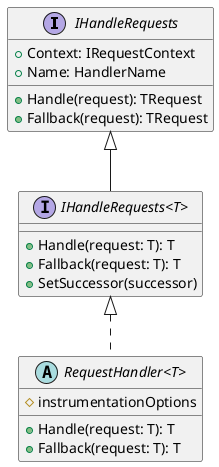
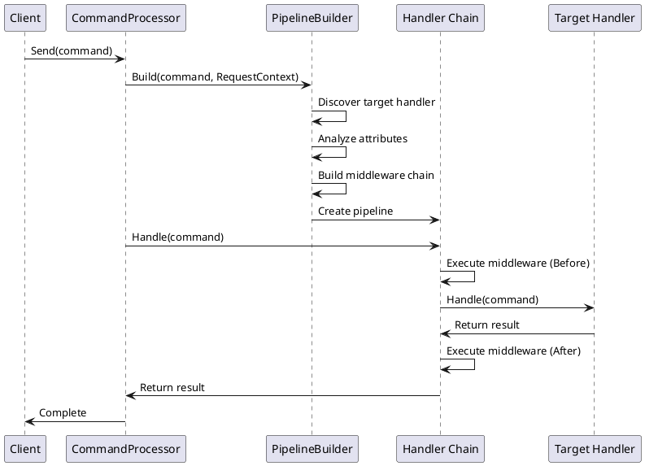
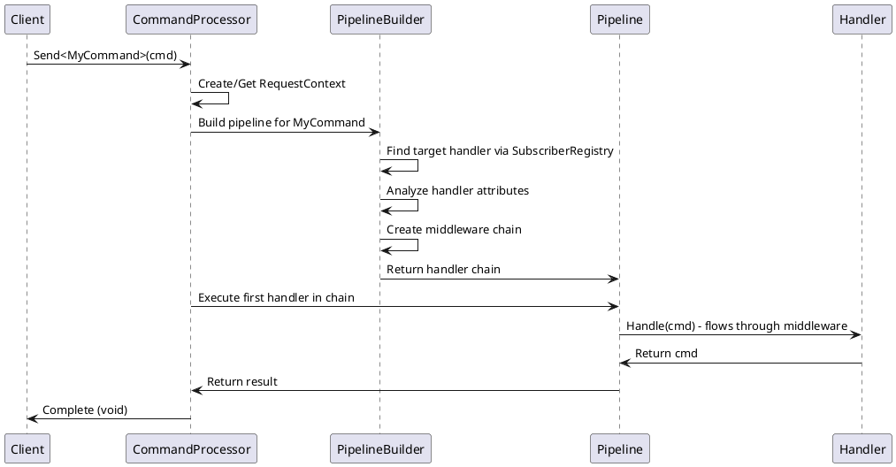
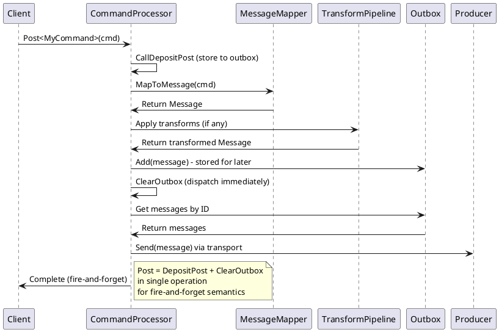
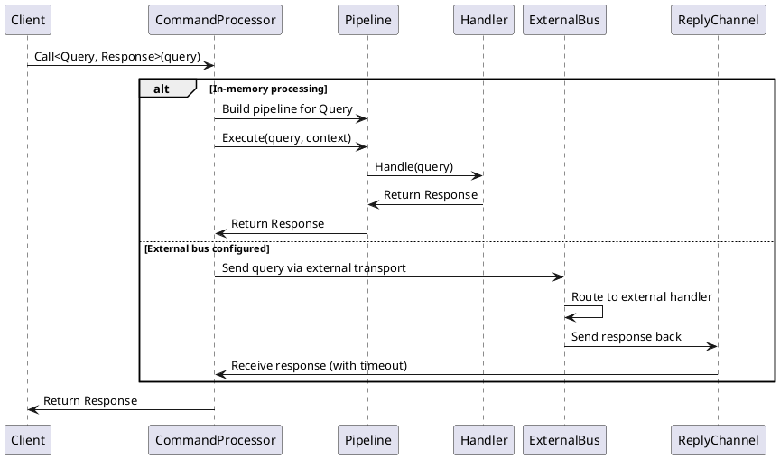
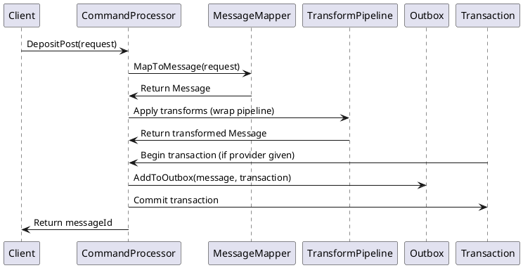
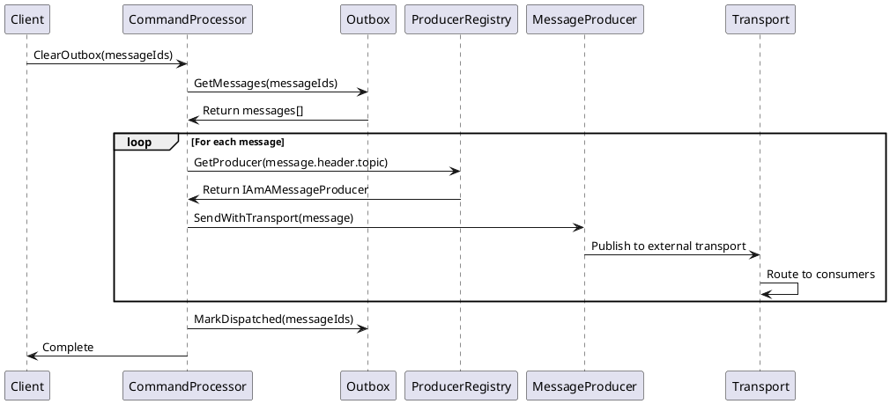
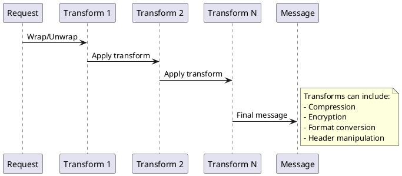
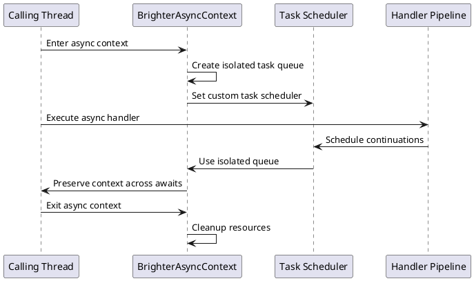
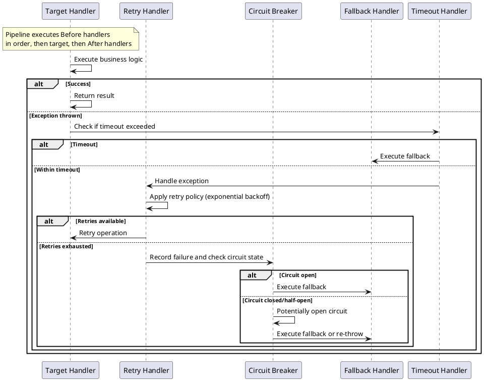

# Paramore.Brighter Core Architecture Guide

## Overview

This guide documents the internal architecture of the Paramore.Brighter core assembly, focusing on how the CommandProcessor works "under the hood" to help new contributors understand the design and implementation decisions.

Paramore.Brighter implements the **Command Dispatcher** and **Command Processor** design patterns to provide a framework for:
- In-memory command/event processing with pipelines
- Asynchronous messaging via external transports (Task Queue pattern)
- Cross-cutting concerns through middleware (logging, retries, circuit breakers, etc.)
- Transactional messaging through the Outbox pattern

## Core Design Principles

### 1. Request-Response Foundation
At its heart, Brighter treats everything as a request that flows through a pipeline:
- **Commands** - Point-to-point imperative instructions (`Send`)
- **Events** - Pub-sub notifications (`Publish`) 
- **RPC** - Request-reply synchronous calls (`Call`)
- **Messages** - Asynchronous task queue operations (`Post` and `Clear`)

### 2. Pipeline-Driven Architecture
Every request flows through a pipeline of handlers:
- Target handler contains business logic
- Middleware handlers provide cross-cutting concerns
- Handlers are chained together using the Chain of Responsibility pattern
- The pipeline is built dynamically based on attributes placed on a handler

### 3. Separation of Direct vs. Bus
- **Direct** - Direct handler invocation for local processing
- **Bus** - Message-based communication via transports (RabbitMQ, AWS SQS, etc.)
- **Outbox pattern** - Ensures transactional consistency for external messaging
- **Inbox pattern** - Deduplicates messages for external messaging

## Core Components

### CommandProcessor
The `CommandProcessor` class serves as the central orchestrator, implementing both the Command Dispatcher and Command Processor patterns.

**Key responsibilities:**
- Route requests to appropriate handlers
- Build and execute handler pipelines  
- Manage external bus operations (Post/ClearOutbox)
- Handle request/reply messaging
- Provide instrumentation and telemetry hooks

**Core dispatch methods** — *signatures, not a pasteable example*:
```csharp
// Point-to-point command
void Send<TRequest>(TRequest command, RequestContext? requestContext = null)
    where TRequest : class, IRequest

// Pub-sub event  
void Publish<TRequest>(TRequest @event, RequestContext? requestContext = null)
    where TRequest : class, IRequest

// Synchronous request-reply
TResponse? Call<T, TResponse>(T request, RequestContext? requestContext = null, TimeSpan? timeOut = null)
    where T : class, ICall where TResponse : class, IResponse

// Asynchronous via external queue
void Post<TRequest>(TRequest request, RequestContext? requestContext = null,
    Dictionary<string, object>? args = null)
    where TRequest : class, IRequest
```

Those are the four immediate overloads in full, rather than abridged, because the optional
parameter they share is the one worth knowing about: **`requestContext` is how you pass your own
`RequestContext` through the pipeline** instead of letting the processor create one per call.
`Send`, `Publish` and `Post` each have two scheduled overloads besides — one taking a
`DateTimeOffset at` and one a `TimeSpan delay`, both returning the scheduled job's id, and each
with an async twin.

`Send`, `Publish` and `Post` each have an `…Async` counterpart taking `bool
continueOnCapturedContext` and a `CancellationToken` (`CommandProcessor.SendAsync`, `PublishAsync`,
`PostAsync`).
**`Call` does not.** There is no `CallAsync` on `CommandProcessor` or `IAmACommandProcessor`: it
blocks by design, which is what the `timeOut` parameter is for.

### Handler Interface Hierarchy


```plantuml
@startuml
interface IHandleRequests {
  +Context: IRequestContext
  +Name: HandlerName
  +Handle(request): TRequest
  +Fallback(request): TRequest
}

interface "IHandleRequests<T>" {
  +Handle(request: T): T
  +Fallback(request: T): T
  +SetSuccessor(successor)
}

abstract class "RequestHandler<T>" {
  +Handle(request: T): T
  +Fallback(request: T): T
  #instrumentationOptions
}

IHandleRequests <|-- "IHandleRequests<T>"
"IHandleRequests<T>" <|.. "RequestHandler<T>"
@enduml
```

**IHandleRequests** - Base non-generic interface for pipeline management
**IHandleRequests&lt;T&gt;** - Generic interface for typed request handling  
**RequestHandler&lt;T&gt;** - Abstract base class providing common pipeline functionality

## Pipeline Construction and Execution

### Pipeline Builder
The `PipelineBuilder<T>` constructs handler chains dynamically:

1. **Target Handler Discovery** - Uses `IAmASubscriberRegistry` to find the handler type for the request
2. **Attribute Analysis** - Reflects on the handler method to find `RequestHandlerAttribute` decorations
3. **Pipeline Assembly** - Creates a chain based on attribute ordering and timing
4. **Handler Instantiation** - Uses `IAmAHandlerFactory` to create handler instances

### Pipeline Flow Diagram


```plantuml
@startuml
participant Client
participant CommandProcessor as CP
participant PipelineBuilder as PB
participant "Handler Chain" as HC
participant "Target Handler" as TH

Client -> CP: Send(command)
CP -> PB: Build(command, RequestContext)
PB -> PB: Discover target handler
PB -> PB: Analyze attributes
PB -> PB: Build middleware chain
PB -> HC: Create pipeline
CP -> HC: Handle(command)
HC -> HC: Execute middleware (Before)
HC -> TH: Handle(command)
TH -> HC: Return result
HC -> HC: Execute middleware (After)
HC -> CP: Return result
CP -> Client: Complete
@enduml
```

### Middleware Attribute System
Handlers use attributes to declaratively add middleware to their pipeline:

```csharp
public class MyCommandHandler: RequestHandler<MyCommand>
{
    [RequestLogging(step: 1, timing: HandlerTiming.Before)]
    [UseResiliencePipeline("MyCommandPipeline", step: 2)]
    public override MyCommand Handle(MyCommand command)
    {
        // Business logic here
        return base.Handle(command);
    }
}
```

There is no `[Retry]`, `[CircuitBreaker]` or `[Timeout]` attribute, and there is no attribute
per strategy. Retry, circuit breaker and timeout are *strategies composed inside one Polly v8
resilience pipeline*, and `[UseResiliencePipeline]` names that pipeline by key —
`Context.ResiliencePipeline` is where it is resolved from, and
`ResilienceExceptionPolicyHandler<>` is the middleware it contributes.

Set `UseTypePipeline = true` on the attribute to scope the lookup by handler type as well as by
key, which is what you want when each handler needs its own circuit breaker rather than sharing
one.

**The older form still works and you will meet it in existing code**: `[UsePolicy(key, step)]`
reads Polly v7 policies from `Context.Policies`, and `[TimeoutPolicy(ms, step)]` wraps the
handler in a timeout. Both are `[Obsolete]`, so pasting either gives you `CS0618`; both are
still live, and `[UsePolicy]` takes a `string[]` overload because an attribute cannot be applied
twice. Prefer the pipeline in new code.

**Attribute Properties:**
- **Step** - Execution order within timing group
- **Timing** - Before/After target handler execution
- **InitializerParams** - Pass configuration from attribute to handler instance

### Request Context Flow
`RequestContext` flows through the entire pipeline:
- Created by `IAmARequestContextFactory` 
- Passed between middleware handlers
- Contains telemetry information, user context, etc.
- Can be provided externally or created internally

## Dispatch Mechanisms Deep Dive

### Send - Command Dispatch

```plantuml
@startuml
participant Client
participant CommandProcessor as CP
participant PipelineBuilder as PB
participant Pipeline as P
participant Handler as H

Client -> CP: Send<MyCommand>(cmd)
CP -> CP: Create/Get RequestContext
CP -> PB: Build pipeline for MyCommand
PB -> PB: Find target handler via SubscriberRegistry
PB -> PB: Analyze handler attributes
PB -> PB: Create middleware chain
PB -> P: Return handler chain
CP -> P: Execute first handler in chain
P -> H: Handle(cmd) - flows through middleware
H -> P: Return cmd
P -> CP: Return result
CP -> Client: Complete (void)
@enduml
```

**Implementation Details:**
```csharp
public void Send<T>(T command, RequestContext? requestContext = null) 
    where T : class, IRequest
{
    // Validate dependencies
    if (_handlerFactorySync == null)
        throw new InvalidOperationException("No handler factory defined.");

    // Create telemetry span
    var span = _tracer?.CreateSpan(CommandProcessorSpanOperation.Send, command, 
        requestContext?.Span, options: _instrumentationOptions);
    var context = InitRequestContext(span, requestContext);

    using var builder = new PipelineBuilder<T>(_subscriberRegistry, 
        _handlerFactorySync, _inboxConfiguration);
    
    // Build the handler chain with middleware
    var handlerChain = builder.Build(command, context);
    
    // Ensure exactly one handler for commands (point-to-point)
    AssertValidSendPipeline(command, handlerChain.Count());
    
    // Execute the pipeline
    handlerChain.First().Handle(command);
}
```

**Characteristics:**
- Synchronous execution
- Single target handler (point-to-point) - validated by `AssertValidSendPipeline`
- In-memory processing only
- Pipeline with middleware support
- Telemetry integration with OpenTelemetry spans

### Publish - Event Dispatch
```plantuml
@startuml
participant Client
participant CommandProcessor as CP
participant PipelineBuilder as PB
participant "Handler 1" as H1
participant "Handler 2" as H2
participant "Handler N" as HN

Client -> CP: Publish<MyEvent>(evt)
CP -> CP: Find all handlers for MyEvent via SubscriberRegistry
CP -> PB: Build pipeline for each handler
par Parallel Execution
  CP -> H1: Handle(evt) via pipeline
and
  CP -> H2: Handle(evt) via pipeline
and
  CP -> HN: Handle(evt) via pipeline
end
CP -> CP: Collect any exceptions
CP -> Client: Complete or throw AggregateException
note right: Each handler executes\nin parallel with its own\nmiddleware pipeline
@enduml
```

**Implementation Details:**
```csharp
public void Publish<T>(T @event, RequestContext? requestContext = null) 
    where T : class, IRequest
{
    // Create telemetry tracking for all handlers
    var handlerSpans = new ConcurrentDictionary<string, Activity>();
    var exceptions = new ConcurrentBag<Exception>();
    
    // Build separate pipeline for each handler
    using var builder = new PipelineBuilder<T>(_subscriberRegistry, 
        _handlerFactorySync, _inboxConfiguration);
    var handlerChain = builder.Build(@event, context);

    // Execute all handlers in parallel
    Parallel.ForEach(handlerChain, (handleRequests) =>
    {
        try
        {
            var handlerName = handleRequests.Name.ToString();
            handlerSpans[handlerName] = _tracer?.CreateSpan(
                CommandProcessorSpanOperation.Publish, @event, span);
            handleRequests.Handle(@event);
        }
        catch (Exception e)
        {
            exceptions.Add(e); // Collect but don't stop other handlers
        }
    });

    // Throw aggregate exception if any handlers failed
    if (exceptions.Any())
    {
        throw new AggregateException(
            "Failed to publish to one more handlers successfully", 
            exceptions);
    }
}
```

**Characteristics:**
- Multiple handlers (pub-sub pattern)
- Parallel execution using `Parallel.ForEach`
- Exception aggregation - failures don't stop other handlers
- Each handler gets its own pipeline with middleware
- In-memory processing only
- Telemetry spans are linked across all handlers

### Post - Asynchronous Messaging

```plantuml
@startuml
participant Client
participant CommandProcessor as CP
participant MessageMapper as MM
participant TransformPipeline as TP
participant Outbox as OB
participant Producer as P

Client -> CP: Post<MyCommand>(cmd)
CP -> CP: CallDepositPost (store to outbox)
CP -> MM: MapToMessage(cmd)
MM -> CP: Return Message
CP -> TP: Apply transforms (if any)
TP -> CP: Return transformed Message
CP -> OB: Add(message) - stored for later
CP -> CP: ClearOutbox (dispatch immediately)
CP -> OB: Get messages by ID
OB -> CP: Return messages
CP -> P: Send(message) via transport
CP -> Client: Complete (fire-and-forget)

note right: Post = DepositPost + ClearOutbox\nin single operation\nfor fire-and-forget semantics
@enduml
```

**Implementation Details** — *abridged from `CommandProcessor`; illustrative, not
copy-pasteable. This section describes private members (`s_boundDepositCalls`, `_transactionType`,
`[DepositCallSite]`) as of **10.7**: they are internals rather than contract, and nothing checks
that this description is still true.*

```csharp
public void Post<TRequest>(TRequest request, RequestContext? requestContext = null, 
    Dictionary<string, object>? args = null) where TRequest: class, IRequest
{
    // Post is implemented as immediate DepositPost + ClearOutbox
    var messageId = CallDepositPost(request, null, requestContext, args, null, _transactionType);
    ClearOutbox([messageId], requestContext, args);
}

// CallDepositPost does not deposit anything itself. The transaction type is not known
// until runtime, and an IEnumerable<IRequest> has lost the derived request type, so this
// binds the generic DepositPost<TRequest, TTransaction> to both actual types and invokes
// it reflectively, caching the bound MethodInfo:
private Id CallDepositPost<TRequest>(TRequest actualRequest, ..., Type transactionType)
{
    var cacheKey = $"{actualRequest.GetType().FullName}:{transactionType.FullName}";
    if (!s_boundDepositCalls.TryGetValue(cacheKey, out MethodInfo? deposit))
    {
        // find the DepositPost overload carrying [DepositCallSite], then close it over
        // the actual request type and the configured transaction type
        deposit = depositMethod?.MakeGenericMethod(actualRequest.GetType(), transactionType)!;
        s_boundDepositCalls[cacheKey] = deposit;
    }

    return CallMethodAndPreserveException(() => (deposit?.Invoke(this, [...]) as Id)!);
}

// The deposit itself is DepositPost<TRequest, TTransaction>, and the mapping and
// transform steps live behind the mediator rather than in the CommandProcessor:
public Id DepositPost<TRequest, TTransaction>(TRequest request, ...) where TRequest : class, IRequest
{
    if (typeof(TTransaction) != _transactionType)
        throw new InvalidOperationException(
            "Supplied transaction provider doesn't match configured transaction type.");

    // maps the request and applies the transform pipeline
    Message message = _mediator!.CreateMessageFromRequest(request, context);

    if (!_mediator.HasOutbox())
        throw new InvalidOperationException("No outbox defined.");

    CallAddToOutbox(message, context, transactionProvider, batchId);

    return message.Id;
}
```

**Characteristics:**
- Asynchronous/fire-and-forget - doesn't wait for processing
- Message transformation via `IAmAMessageMapper<T>`
- Outbox pattern for reliability and transactional consistency
- Supports external transports (RabbitMQ, SQS, etc.)
- Transform pipeline for compression, encryption, and other operations.
- Immediate dispatch (combines DepositPost + ClearOutbox)

### Call - RPC Pattern  

```plantuml
@startuml
participant Client
participant CommandProcessor as CP
participant Pipeline as P
participant Handler as H
participant ExternalBus as EB
participant ReplyChannel as RC

Client -> CP: Call<Query, Response>(query)
alt In-memory processing
  CP -> P: Build pipeline for Query
  CP -> P: Execute(query, context)
  P -> H: Handle(query)
  H -> P: Return Response
  P -> CP: Return Response
else External bus configured
  CP -> EB: Send query via external transport
  EB -> EB: Route to external handler
  EB -> RC: Send response back
  RC -> CP: Receive response (with timeout)
end
CP -> Client: Return Response

@enduml
```

**Implementation Details:**
The Call operation supports a blocking RPC-style interaction:

```csharp
// External call setup requires reply channels
var commandProcessor = CommandProcessorBuilder.StartNew()
    .Handlers(handlerConfiguration)
    .DefaultResilience()
    .ExternalBus(
        ExternalBusType.RPC,
        bus,                                  // IAmAnOutboxProducerMediator
        responseChannelFactory: replyChannelFactory,
        subscriptions: replySubscriptions)
    .NoInstrumentation()
    .RequestContextFactory(new InMemoryRequestContextFactory())
    .RequestSchedulerFactory(new InMemorySchedulerFactory())
    .Build();

// Similar to Post, but it blocks and returns a response
MyResponse? result = commandProcessor.Call<MyQuery, MyResponse>(query);
```

**Request-reply is not a step of its own.** It is `ExternalBusType.RPC` on the `ExternalBus`
step, which is what sets the builder's request-reply mode and takes the reply channel factory
and the reply subscriptions.

The four collaborators that chain needs, and where each comes from:

| Collaborator | Where it comes from |
|---|---|
| `handlerConfiguration` | `new HandlerConfiguration(subscriberRegistry, handlerFactory)` |
| `bus` | an `IAmAnOutboxProducerMediator` — build one as `OutboxProducerMediator<Message, TTransaction>(...)`, as under *Testing Message Publishing* below, or let `AddProducers` build it for you when you configure Brighter through DI |
| `replyChannelFactory` | your transport's `IAmAChannelFactory`, which creates the channel replies arrive on |
| `replySubscriptions` | one `Subscription` per reply topic, of the transport's own subscription type. **Matched on the response type**, not the request: `Call` looks for `s.RequestType == typeof(TResponse)` and throws `InvalidOperationException` when nothing matches |

**Characteristics:**
- Synchronous request-reply pattern
- Returns typed response (`TResponse?` — nullable)
- **Requires RPC wiring**, and there is no in-memory path. `Call` guards in this order
  (`CommandProcessor`, `Call`): **the reply subscription first**, throwing
  `InvalidOperationException("No Subscription registered fpr replies of type …")` — `fpr` is
  verbatim [sic], so search for it as spelled — and **the response channel factory second**,
  throwing
  `InvalidOperationException("No ResponseChannelFactory registered")`. So a processor with no RPC
  wiring at all reports the missing *subscription*; you only reach the second message once the
  subscription is registered
- **The subscription that message is looking for is matched on `TResponse`.** Whatever type the
  exception names, the lookup is `s.RequestType == typeof(TResponse)` — so read it as *"no reply
  subscription whose `RequestType` is your response type"*, and register the subscription against
  the response
- Timeout support for external calls to prevent blocking
- Reply channel management for external scenarios
- Supports same middleware pipeline as Send/Publish

## Outbox Pattern Implementation

The Outbox pattern ensures transactional consistency between your domain changes and message publishing. Brighter implements this through two separate operations that can be used together or independently.

### DepositPost Operation
The `DepositPost` method implements the first phase of the Outbox pattern:


```plantuml
@startuml
participant Client
participant CommandProcessor as CP
participant MessageMapper as MM
participant TransformPipeline as TP
participant Outbox as OB
participant Transaction as TX

Client -> CP: DepositPost(request)
CP -> MM: MapToMessage(request)
MM -> CP: Return Message
CP -> TP: Apply transforms (wrap pipeline)
TP -> CP: Return transformed Message
TX -> CP: Begin transaction (if provider given)
CP -> OB: AddToOutbox(message, transaction)
CP -> TX: Commit transaction
CP -> Client: Return messageId
@enduml
```

**Implementation Flow:**
1. **Message Mapping** - Convert domain object to transport message via `IAmAMessageMapper<T>`
2. **Transform Pipeline** - Apply any configured transforms (e.g., compression, encryption, etc.)
3. **Transactional Storage** - Store message in outbox within the same transaction as domain changes
4. **Return Message ID** - Client gets ID for later use with `ClearOutbox`

**Key Implementation Details:**
```csharp
public Id DepositPost<TRequest>(TRequest request, 
    IAmABoxTransactionProvider<TTransaction>? transactionProvider,
    RequestContext? requestContext = null,
    Dictionary<string, object>? args = null) where TRequest : class, IRequest
{
    // Find message mapper for request type
    var mapper = GetMessageMapper<TRequest>();
    var message = mapper.MapToMessage(request);
    
    // Apply transform pipeline (WrapWith attributes)
    message = ApplyTransformPipeline(message, request);
    
    // Add to outbox within transaction scope
    AddToOutbox(message, transactionProvider, batchId);
    
    return message.Id;
}
```

**Bulk Operations:**
Brighter supports bulk `DepositPost` for efficiency:
- Batches multiple requests into a single outbox transaction
- Reduces database round trips
- Maintains transactional consistency across the entire batch

### ClearOutbox Operation
The `ClearOutbox` method implements the second phase - actual message dispatch:


```plantuml
@startuml
participant Client
participant CommandProcessor as CP
participant Outbox as OB
participant ProducerRegistry as PR
participant MessageProducer as MP
participant Transport as T

Client -> CP: ClearOutbox(messageIds)
CP -> OB: GetMessages(messageIds)
OB -> CP: Return messages[]
loop For each message
  CP -> PR: GetProducer(message.header.topic)
  PR -> CP: Return IAmAMessageProducer
  CP -> MP: SendWithTransport(message)
  MP -> T: Publish to external transport
  T -> T: Route to consumers
end
CP -> OB: MarkDispatched(messageIds)
CP -> Client: Complete
@enduml
```

**Implementation Details:**
```csharp
public void ClearOutbox(Id[] ids, RequestContext? requestContext = null,
    Dictionary<string, object>? args = null)
{
    // Delegate to the outbox mediator, which handles:
    // 1. Retrieve messages from the outbox by ID
    // 2. Route each message to the appropriate producer
    // 3. Send via external transport
    // 4. Mark as dispatched on success
    _mediator!.ClearOutbox(ids, context, args);
}
```

**Key aspects:**
- **Message Retrieval** - Gets specific messages by ID from the Outbox
- **Producer Selection** - Routes to the appropriate producer based on message topic/type
- **Transport Dispatch** - Sends via configured external transport (RabbitMQ, SQS, etc.)
- **State Management** - Marks messages as dispatched to prevent re-sending
- **Error Handling** - Failed messages remain in the outbox for retry

### Transactional Integration

**Database Transaction Example:**
*Abridged — `transactionProvider`, `customer` and `newEmail` are yours; illustrative, not copy-pasteable:*

```csharp
// Within your application service/command handler:
using var transaction = transactionProvider.BeginTransaction();
try
{
    // 1. Modify your domain entities
    customer.UpdateEmail(newEmail);
    dbContext.SaveChanges();
    
    // 2. Store outbound events in the same transaction
    var @event = new CustomerEmailChanged(customer.Id, newEmail);
    var messageId = commandProcessor.DepositPost(@event, transactionProvider);
    
    // 3. Commit both changes atomically
    transaction.Commit();
    
    // 4. Dispatch events after a successful commit
    commandProcessor.ClearOutbox([messageId]);
}
catch
{
    transaction.Rollback();
    throw;
}
```

### Outbox Sweeper Pattern

For high-reliability scenarios you want a sweeper: something that periodically finds messages
sitting in the Outbox undispatched and clears them. **Brighter ships one — do not write your
own.** `TimedOutboxSweeper` is in `Paramore.Brighter.Outbox.Hosting`, and `UseOutboxSweeper`
registers it as a hosted service:

```csharp
using Paramore.Brighter.Outbox.Hosting;

services.AddBrighter()
    .AddProducers(configure =>
    {
        // ... your producer registry, outbox and transaction provider
    })
    .UseOutboxSweeper(options =>
    {
        options.TimerInterval = 5;                              // seconds between sweeps
        options.MinimumMessageAge = TimeSpan.FromSeconds(5);    // leave newer messages alone
        options.BatchSize = 100;
        options.UseBulk = false;
    })
    .AutoFromAssemblies();
```

**Why not hand-roll it.** A `BackgroundService` looping over the Outbox is missing the two things
that make sweeping safe:

- **A distributed lock.** `TimedOutboxSweeper` takes an `IDistributedLock` and holds it for the
  sweep, so a second instance skips the run rather than dispatching the same messages again.
  `AddProducers` registers one for you, but it defaults to `InMemoryLock` — which coordinates
  threads in *one* process and nothing between processes. **Running more than one instance means
  setting `configure.DistributedLock`** to a real implementation (`MsSqlLockingProvider`,
  `PostgresLockingProvider` and the rest).
- **Batching and an age floor.** `MinimumMessageAge` is what stops the sweeper racing the
  `ClearOutbox` call that is about to happen anyway on the request thread, and `BatchSize` is what
  stops one sweep pulling an entire backlog into memory.

The API a hand-rolled sweeper reaches for does not exist, either: there is no
`GetUndispatchedMessages()`. The real query is `OutstandingMessagesAsync(dispatchedSince,
requestContext, pageSize, pageNumber, trippedTopics, args)` on `IAmAnOutboxAsync`, and its
`dispatchedSince` argument is the age floor above.

**Benefits:**
- **Guarantees delivery** - Messages won't be lost even if ClearOutbox fails
- **Handles transient failures** - Automatic retry of failed dispatches
- **Operational resilience** - System recovers from temporary outages

## Message Transformation Pipeline

### Transform Chain Architecture
Messages can be transformed as they flow through the system:


```plantuml
@startuml
participant Request as R
participant "Transform 1" as T1
participant "Transform 2" as T2
participant "Transform N" as TN
participant Message as M

R -> T1: Wrap/Unwrap
T1 -> T2: Apply transform
T2 -> TN: Apply transform  
TN -> M: Final message
note right: Transforms can include:\n- Compression\n- Encryption\n- Format conversion\n- Header manipulation
@enduml
```

**Transform Types:**
- **WrapWith** - Outbound message transformation
- **UnwrapWith** - Inbound message transformation  
- **Configurable pipeline** - Applied based on message metadata

### Message Mapper Registry
The `MessageMapperRegistry` provides bi-directional mapping:

*The interface as Brighter declares it — a declaration, not an example to paste:*

```csharp
// The non-generic base is a marker, used where the closed type is not known
public interface IAmAMessageMapper;

public interface IAmAMessageMapper<TRequest> : IAmAMessageMapper
    where TRequest : class, IRequest
{
    // Set by the pipeline; you rarely assign it yourself
    IRequestContext? Context { get; set; }

    // MapToMessage takes the Publication as well as the request — that is where
    // Topic, RoutingKey and the CloudEvents metadata come from
    Message MapToMessage(TRequest request, Publication publication);

    TRequest MapToRequest(Message message);
}
```

**Responsibilities:**
- Convert between domain objects and wire format
- Handle serialization/deserialization
- Set message headers (topic, correlation ID, etc.)
- Support for async operations

## Synchronization Context

### BrighterSynchronizationContext
Brighter provides a custom `SynchronizationContext` to control task scheduling and prevent common async pitfalls:

```csharp
public class BrighterSynchronizationContext : SynchronizationContext
{
    private readonly BrighterAsyncContext _asyncContext;
    
    // Controls how async continuations are scheduled
    // Prevents deadlocks in certain hosting scenarios
    // Integrates with BrighterAsyncContext for task isolation
}
```

**Key Implementation Details:**
```csharp
public override void Post(SendOrPostCallback callback, object? state)
{
    // Schedules work to run asynchronously on task pool
    _asyncContext.TaskQueue.Enqueue(new ContextMessage(callback, state));
}

public override void Send(SendOrPostCallback callback, object? state)
{
    // Executes work synchronously on current thread
    // Used for immediate execution scenarios
    callback(state);
}
```

### Async Context Management
The `BrighterAsyncContext` provides logical execution boundaries:


```plantuml
@startuml
participant "Calling Thread" as CT
participant "BrighterAsyncContext" as BAC
participant "Task Scheduler" as TS
participant "Handler Pipeline" as HP

CT -> BAC: Enter async context
BAC -> BAC: Create isolated task queue
BAC -> TS: Set custom task scheduler
CT -> HP: Execute async handler
HP -> TS: Schedule continuations
TS -> BAC: Use isolated queue
BAC -> CT: Preserve context across awaits
CT -> BAC: Exit async context
BAC -> BAC: Cleanup resources
@enduml
```

**Key features:**
- **Task isolation** - Prevents cross-contamination between handler executions
- **Deadlock prevention** - Avoids blocking on async operations in sync contexts
- **Context preservation** - Maintains logical call context across async boundaries
- **Resource management** - Ensures proper cleanup of async resources
- **Integration** - Works with ASP.NET Core and other hosting models

### Usage Patterns

#### 1. Handler Context Isolation
```csharp
public class AsyncCommandHandler : RequestHandlerAsync<MyCommand>
{
    public override async Task<MyCommand> HandleAsync(MyCommand command, 
        CancellationToken cancellationToken = default)
    {
        // Async operations automatically use BrighterSynchronizationContext
        await Task.Delay(10);   // your async work here
        
        // Context is preserved across awaits
        var userId = Context.Bag["UserId"]; // Still available
        
        return await base.HandleAsync(command, cancellationToken);
    }
}
```

#### 2. Custom Async Context Factory
```csharp
public class CustomRequestContextFactory : IAmARequestContextFactory
{
    public RequestContext Create()
    {
        var context = new RequestContext();
        
        // Set custom synchronization context
        SynchronizationContext.SetSynchronizationContext(
            new BrighterSynchronizationContext(new BrighterAsyncContext()));
            
        return context;
    }
}
```

### Integration with ASP.NET Core
Brighter's synchronization context integrates seamlessly with ASP.NET Core:

```csharp
// In startup configuration — nothing extra is required
services.AddBrighter(options =>
{
    // Brighter installs BrighterSynchronizationContext around the handler
    // it invokes; ASP.NET Core's own context is restored afterwards
})
.AutoFromAssemblies([typeof(CreateCustomerCommand).Assembly]);
```

There is **no** opt-out or override method: the context is applied by `BrighterAsyncContext`
around the call, not configured on the builder.

**Benefits in web scenarios:**
- Prevents deadlocks when mixing sync/async code
- Maintains HTTP context across handler execution
- Proper cleanup of request-scoped resources
- Compatible with dependency injection scopes

## Request Context and Telemetry

### Request Context Factory
The `IAmARequestContextFactory` creates request contexts:

*The interface as Brighter declares it — a declaration, not an example to paste:*

```csharp
public interface IAmARequestContextFactory  
{
    RequestContext Create();
}
```

**Context Contents:**
- **Correlation ID** - Links related operations
- **Telemetry data** - OpenTelemetry traces and spans
- **User context** - Authentication/authorization info
- **Custom properties** - Application-specific data

### Instrumentation Integration
Brighter integrates with OpenTelemetry:
- **Spans** - Created for each handler execution
- **Metrics** - Handler execution times, error rates
- **Logs** - Structured logging with correlation
- **Propagation** - Context flows across service boundaries

## Error Handling and Resilience

### Exception Handling Strategy

```plantuml
@startuml
participant "Target Handler" as TH
participant "Retry Handler" as RH  
participant "Circuit Breaker" as CB
participant "Fallback Handler" as FB
participant "Timeout Handler" as TO

note over TH: Pipeline executes Before handlers\nin order, then target, then After handlers

TH -> TH: Execute business logic
alt Success
  TH -> TH: Return result
else Exception thrown
  TH -> TO: Check if timeout exceeded
  alt Timeout
    TO -> FB: Execute fallback
  else Within timeout
    TO -> RH: Handle exception
    RH -> RH: Apply retry policy (exponential backoff)
    alt Retries available
      RH -> TH: Retry operation
    else Retries exhausted
      RH -> CB: Record failure and check circuit state
      alt Circuit open
        CB -> FB: Execute fallback
      else Circuit closed/half-open
        CB -> CB: Potentially open circuit
        CB -> FB: Execute fallback or re-throw
      end
    end
  end
end
@enduml
```

### Built-in Resilience Handlers
Brighter provides several built-in middleware handlers for quality-of-service concerns.

**The first three below are the Polly v7 form and are `[Obsolete]`.** They still work, and they
are documented here because you will meet them in existing code, but new handlers should name a
Polly v8 pipeline with `[UseResiliencePipeline]` instead — see
[Middleware Attribute System](#middleware-attribute-system). `[FallbackPolicy]` is not
obsolete: it routes to your handler's `Fallback` method rather than running a Polly strategy.

#### 1. Retry Handler (`UsePolicyAttribute`)
```csharp
[UsePolicy(policy: "RetryPolicy", step: 1)]
public override MyCommand Handle(MyCommand command)
{
    // This handler will be wrapped with retry logic
    return base.Handle(command);
}
```

**Implementation:**
- Uses Polly for retry policies
- Supports exponential backoff, jitter
- Configurable retry count and delay
- Can handle specific exception types

#### 2. Circuit Breaker Handler
```csharp
[UsePolicy(policy: "CircuitBreakerPolicy", step: 2)]
public override MyCommand Handle(MyCommand command)
{
    // Protected by circuit breaker
    return base.Handle(command);
}
```

**States:**
- **Closed** - Normal operation, exceptions tracked
- **Open** - Fast-fail mode, calls routed to fallback
- **Half-Open** - Testing mode, limited calls allowed

#### 3. Timeout Handler (`TimeoutPolicyAttribute`)
```csharp
[TimeoutPolicy(milliseconds: 30000, step: 1)] // 30 second timeout
public override MyCommand Handle(MyCommand command)
{
    // Will timeout if execution exceeds 30 seconds
    return base.Handle(command);
}
```

#### 4. Fallback Handler (`FallbackPolicyAttribute`)
```csharp
[FallbackPolicy(backstop: true, circuitBreaker: false, step: 3)]
public override MyCommand Handle(MyCommand command)
{
    // Has fallback behavior for failures
    return base.Handle(command);
}

public override MyCommand Fallback(MyCommand command)
{
    // Graceful degradation logic here
    return command;
}
```

### Custom Middleware Development

**Creating Custom Attributes:**
```csharp
[AttributeUsage(AttributeTargets.Method)]
public class LoggingAttribute : RequestHandlerAttribute
{
    public LoggingAttribute(int step) : base(step, HandlerTiming.Before) { }
    
    public override Type GetHandlerType()
    {
        return typeof(LoggingHandler<>);
    }
    
    public override object[] InitializerParams()
    {
        return new object[] { LogLevel.Information };
    }
}
```

**Custom Handler Implementation:**
```csharp
public class LoggingHandler<T> : RequestHandler<T> where T : class, IRequest
{
    private readonly ILogger _logger;
    private readonly LogLevel _logLevel;
    
    public LoggingHandler(ILogger logger, LogLevel logLevel)
    {
        _logger = logger;
        _logLevel = logLevel;
    }
    
    public override T Handle(T request)
    {
        _logger.Log(_logLevel, "Handling request {RequestType} with ID {RequestId}", 
            typeof(T).Name, request.Id);
            
        var result = base.Handle(request); // Call next in pipeline
        
        _logger.Log(_logLevel, "Completed request {RequestType} with ID {RequestId}",
            typeof(T).Name, request.Id);
            
        return result;
    }
}
```

## Configuration and Dependency Injection

### CommandProcessor Builder
The `CommandProcessorBuilder` provides fluent configuration:

```csharp
var commandProcessor = CommandProcessorBuilder.StartNew()
    .Handlers(new HandlerConfiguration(subscriberRegistry, handlerFactory))
    .DefaultResilience()
    .NoExternalBus()
    .NoInstrumentation()
    .RequestContextFactory(new InMemoryRequestContextFactory())
    .RequestSchedulerFactory(new InMemorySchedulerFactory())
    .Build();
```

Each step of the chain offers alternatives:

- `.DefaultResilience()` supplies Brighter's own retry pipelines. To supply your own, use
  `.Resilience(resiliencePipelineRegistry)`; `policyRegistry` is an optional second parameter.
  Three constraints apply:
  - The registry must contain `CommandProcessor.OutboxProducer`, or `Resilience` throws
    `ConfigurationException`. Get it from
    `new ResiliencePipelineRegistry<string>().AddBrighterDefault()` — `AddBrighterDefault` is an
    extension method in `Paramore.Brighter.Extensions`. **`AddBrighterDefault` uses
    `TryAddBuilder`, so it never overwrites**: register your own pipelines *first* and call
    `AddBrighterDefault()` afterwards to backfill. Calling it first means your own
    `CommandProcessor.OutboxProducer` is silently discarded.
  - **`Resilience` validates one pipeline, but `Call` needs two.** It checks only
    `CommandProcessor.OutboxProducer`, while `CommandProcessor.Call` resolves
    `CommandProcessor.RequestReply` from the same registry. A hand-rolled registry holding
    `OutboxProducer` alone therefore passes `Build()` and throws `KeyNotFoundException` at the
    first `Call`. `AddBrighterDefault()` registers both, which is why building on it — rather
    than beside it — is the recipe above.
  - The optional `policyRegistry` is validated too — a registry you supply must contain both
    `CommandProcessor.RETRYPOLICY` and `CommandProcessor.CIRCUITBREAKER`, both of which are
    `[Obsolete]`. **Omit the argument** and Brighter uses `DefaultPolicy`, which has both.
- `.NoExternalBus()` routes `Send`/`Publish` in-process only; no producer, no outbox. To send messages out of process use
  `.ExternalBus(busType, bus, transactionType, responseChannelFactory, subscriptions,
  inboxConfiguration)` — the inbox is a parameter here, not a step of its own, and request-reply
  is `ExternalBusType.RPC` rather than a step of its own either.
- `.NoInstrumentation()` can be replaced by `.ConfigureInstrumentation(tracer, instrumentationOptions)`.

### Dependency Injection Integration
Brighter integrates with .NET's dependency injection:
- Handler lifetime management
- Scoped dependencies within handlers
- Transactional resource coordination
- Configuration binding

## Testing and Observability

### Pipeline Tracing
The `PipelineTracer` enables pipeline introspection for both debugging and testing:

*The interface as Brighter declares it — a declaration, not an example to paste:*

```csharp
public interface IAmAPipelineTracer
{
    void AddToPath(HandlerName handlerName);
    string ToString();
}

// Usage in testing: DescribePath is on the handler, and a pipeline is a
// sequence of them, so walk from the first — First() is System.Linq
var tracer = new PipelineTracer();
pipeline.First().DescribePath(tracer);
var pipelineDescription = tracer.ToString();

// Verify pipeline composition. Middleware appears under its own type name — [UsePolicy]
// contributes ExceptionPolicyHandler`1, [RequestLogging] contributes RequestLoggingHandler`1
Assert.Contains("ExceptionPolicyHandler", pipelineDescription);
Assert.Contains("MyBusinessHandler", pipelineDescription);
```

**Capabilities:**
- Pipeline composition visualization
- Handler execution order verification
- Middleware configuration validation
- Performance profiling hooks

### Testing Strategies

> For a comprehensive guide to testing handlers that depend on `IAmACommandProcessor`, including the `SpyCommandProcessor` test double from the `Paramore.Brighter.Testing` package, see [Testing Handlers Guide](testing-handlers.md).

#### 1. Unit Testing Handlers
Test individual handlers in isolation:

```csharp
// A hand-written stub, not a mocking library: this repository uses none, and a test
// double you can read beats one you have to configure
public class SpyCustomerRepository : ICustomerRepository
{
    public List<Customer> Saved { get; } = new();

    public void Save(Customer customer) => Saved.Add(customer);
}

public class CreateCustomerHandlerTests
{
    [Fact]
    public void When_Handling_Valid_Command_Should_Process_Successfully()
    {
        // Arrange
        var repository = new SpyCustomerRepository();
        var handler = new CreateCustomerHandler(repository);
        var command = new CreateCustomerCommand("John", "john@example.com");

        // Act
        var result = handler.Handle(command);

        // Assert
        Assert.Equal(command.Id, result.Id);
        Assert.Single(repository.Saved);
    }
}
```

#### 2. Integration Testing with Test Doubles
Use Brighter's test infrastructure for integration scenarios:

```csharp
[Fact]
public void When_Sending_Command_Should_Execute_Pipeline()
{
    // Arrange
    var registry = new SubscriberRegistry();
    registry.Register<CreateCustomerCommand, CreateCustomerHandler>();
    
    // customerRepository is your test double; the discard lambda is safe because
    // CreateCustomerHandler carries no attributes, so the pipeline is one long
    var handlerFactory = new SimpleHandlerFactorySync(_ => new CreateCustomerHandler(customerRepository));
    var commandProcessor = CommandProcessorBuilder.StartNew()
        .Handlers(new HandlerConfiguration(registry, handlerFactory))
        .DefaultResilience()
        .NoExternalBus()
        .NoInstrumentation()
        .RequestContextFactory(new InMemoryRequestContextFactory())
        .RequestSchedulerFactory(new InMemorySchedulerFactory())
        .Build();
    
    var command = new CreateCustomerCommand("John", "john@example.com");
    
    // Act & Assert
    Assert.Null(Record.Exception(() => commandProcessor.Send(command)));
}
```

#### 3. Testing Message Publishing
Verify message publishing behavior:

```csharp
[Fact]
public void When_Publishing_Event_Should_Store_In_Outbox()
{
    // Arrange: an in-memory transport, so nothing leaves the test
    var routingKey = new RoutingKey("CustomerCreated");
    var internalBus = new InternalBus();
    var producerRegistry = new ProducerRegistry(new Dictionary<RoutingKey, IAmAMessageProducer>
    {
        [routingKey] = new InMemoryMessageProducer(internalBus,
            new Publication { Topic = routingKey, RequestType = typeof(CustomerCreated) })
    });

    // JsonMessageMapper<T> ships with Brighter, in Paramore.Brighter.MessageMappers:
    // no mapper to hand-write for the test
    var messageMapperRegistry = new MessageMapperRegistry(
        new SimpleMessageMapperFactory(_ => new JsonMessageMapper<CustomerCreated>()), null);
    messageMapperRegistry.Register<CustomerCreated, JsonMessageMapper<CustomerCreated>>();

    // ResiliencePipelineRegistry<T> is Polly's, in Polly.Registry; AddBrighterDefault is
    // Brighter's extension on it, in Paramore.Brighter.Extensions
    var resiliencePipelineRegistry = new ResiliencePipelineRegistry<string>().AddBrighterDefault();
    var fakeOutbox = new InMemoryOutbox(TimeProvider.System);

    // CommittableTransaction is System.Transactions
    IAmAnOutboxProducerMediator bus = new OutboxProducerMediator<Message, CommittableTransaction>(
        producerRegistry,
        resiliencePipelineRegistry,
        messageMapperRegistry,
        new EmptyMessageTransformerFactory(),
        new EmptyMessageTransformerFactoryAsync(),
        new BrighterTracer(),
        new FindPublicationByPublicationTopicOrRequestType(),
        fakeOutbox);

    // DepositPost runs no handler pipeline, but the builder still requires a handler
    // configuration — so an empty registry and a factory that is never called are enough
    var commandProcessor = CommandProcessorBuilder.StartNew()
        .Handlers(new HandlerConfiguration(new SubscriberRegistry(),
            new SimpleHandlerFactorySync(_ => throw new NotImplementedException())))
        .Resilience(resiliencePipelineRegistry)
        .ExternalBus(ExternalBusType.FireAndForget, bus, typeof(CommittableTransaction))
        .NoInstrumentation()
        .RequestContextFactory(new InMemoryRequestContextFactory())
        .RequestSchedulerFactory(new InMemorySchedulerFactory())
        .Build();

    var @event = new CustomerCreated(
        Guid.NewGuid(), "John", "john@example.com", DateTimeOffset.UtcNow);
    
    // Act
    var messageId = commandProcessor.DepositPost(@event);
    
    // Assert: DepositPost writes to the outbox and does not send
    var storedMessage = fakeOutbox.Get(messageId, new RequestContext());
    // Assert the id, not just non-null: InMemoryOutbox.Get returns an empty Message on a miss,
    // so Assert.NotNull(storedMessage) can never fail
    Assert.Equal(messageId, storedMessage.Id);
    Assert.Equal(routingKey, storedMessage.Header.Topic);
    Assert.Empty(internalBus.Stream(routingKey));
}
```

#### 4. Testing Pipeline Middleware
Verify middleware execution and ordering:

```csharp
[Fact]
public void When_Handler_Has_Attributes_Should_Build_Correct_Pipeline()
{
    // Arrange
    var registry = new SubscriberRegistry();
    registry.Register<TestCommand, TestHandlerWithAttributes>();
    
    var handlerFactory = new SimpleHandlerFactorySync(
        type => (IHandleRequests)Activator.CreateInstance(type)!);
    // using, because PipelineBuilder owns the handler lifetime scope and releases it on Dispose
    using var builder = new PipelineBuilder<TestCommand>(registry, handlerFactory);
    
    // Act
    var pipeline = builder.Build(new TestCommand(), new RequestContext());
    
    // Assert pipeline composition
    var tracer = new PipelineTracer();
    pipeline.First().DescribePath(tracer);
    
    var description = tracer.ToString();
    Assert.Contains("RequestLoggingHandler", description);
    Assert.Contains("TestHandlerWithAttributes", description);
}
```

`Activator` is `System`, `First()` is `System.Linq`.

Three things that block gets right and a hand-written version usually does not:

- **The factory constructs by the type it is handed.** `PipelineBuilder` asks the factory for
  the *middleware* handlers as well as yours, so a `_ => new TestHandlerWithAttributes()` lambda
  returns your handler once per pipeline position instead of the middleware. A discard lambda is
  safe only where the handler carries no attributes and the pipeline is therefore one long — which
  is why the `CreateCustomerHandler` examples above can use one and this one cannot.
- **The interface is named explicitly.** `PipelineBuilder<T>` has two constructors taking a
  handler factory, differing only in `IAmAHandlerFactorySync` versus `IAmAHandlerFactoryAsync`, and
  `SimpleHandlerFactory` implements both, so passing one of those is `CS0121`.
- **Middleware is named for its type.** Assert on `RequestLoggingHandler`, not on a "RetryHandler"
  — no such type exists. `[UsePolicy]` contributes `ExceptionPolicyHandler`.

The example uses `[RequestLogging]` because it composes with nothing else. A handler carrying
`[UsePolicy]` needs more: `ExceptionPolicyHandler` reads its policies from
`Context.Policies` while the pipeline is being built, so building one against a bare
`new RequestContext()` throws `ConfigurationException` wrapping a `NullReferenceException`.
Give the context a policy registry, or let `CommandProcessor` build the pipeline for you.
`[UseResiliencePipeline]`, the current form, guards its context
(`Context is { ResiliencePipeline: not null }`) — **and that guard is why it fails differently
rather than better.** Which way it fails depends on how the pipeline was built, and the direct
build above is the silent case:

| How the pipeline is built | `[UsePolicy]` | `[UseResiliencePipeline]` |
|---|---|---|
| `PipelineBuilder` + `new RequestContext()`, as above | `ConfigurationException` wrapping a `NullReferenceException`, at build | **silent**: builds, the target runs **once**, unprotected, and its own exception escapes |
| through `CommandProcessor` | — | `ConfigurationException` at build; the target is never invoked |

Both rows are measured:

```text
direct build, key absent  : [UseResiliencePipeline] invocations 1, InvalidOperationException escaped
direct build, key absent  : [UsePolicy]             invocations 0, ConfigurationException at Build
via CommandProcessor, key absent   : invocations 0, ConfigurationException at Build
via CommandProcessor, key registered with 2 retries : invocations 3, the target's exception escapes
```

**So a test written from the recipe above, asserting that retries happen, passes for the wrong
reason** — no pipeline ran at all. Give the context a registry, or let `CommandProcessor` build the
pipeline, and the failure becomes loud in both forms. Through `CommandProcessor`
`Context.ResiliencePipeline` is always assigned (`CommandProcessor.InitRequestContext`), so the
silent path is reachable only when you build the pipeline yourself.

#### 5. Builder Configuration for Tests: No External Bus
For testing handler pipelines without external dependencies. This is a builder recipe rather
than a test double, and it gives you `Send` and `Publish` only:
```csharp
var commandProcessor = CommandProcessorBuilder.StartNew()
    .Handlers(handlerConfiguration)
    .DefaultResilience()
    .NoExternalBus() // internal dispatch only — no producer, no outbox
    .NoInstrumentation()
    .RequestContextFactory(new InMemoryRequestContextFactory())
    .RequestSchedulerFactory(new InMemorySchedulerFactory())
    .Build();
```

`NoExternalBus()` does not wire an in-memory transport — it leaves the mediator unset, so `Post`
and `DepositPost` throw `NullReferenceException` on a processor built this way rather than
reporting a missing bus. To test publishing, use the `InMemoryMessageProducer` and `InternalBus`
recipe under *Testing Message Publishing* above, which is what gives you messages to read back.

### Test Double Support
Brighter provides several test doubles for different scenarios:

#### InMemoryMessageProducer
For verifying message production. Messages go to an `InternalBus`, and you read them back from
the bus rather than from the producer:
```csharp
var internalBus = new InternalBus();
var routingKey = new RoutingKey("CustomerCreated");
var fakeProducer = new InMemoryMessageProducer(internalBus,
    new Publication { Topic = routingKey, RequestType = typeof(CustomerCreated) });

var sentMessages = internalBus.Stream(routingKey); // Inspect what was sent
```

#### InMemoryOutbox
For testing outbox behavior. It takes the `TimeProvider` it stamps entries with, so a test can
supply a fake clock and control how old a message appears to be:
```csharp
var inMemoryOutbox = new InMemoryOutbox(TimeProvider.System);
// Can inspect stored messages, simulate failures, etc.
```

#### SimpleHandlerFactorySync
For basic handler instantiation. You supply the function that creates a handler for a requested
type; there is no convention-based fallback:
```csharp
// customerRepository is whatever the handler needs; you supply it
var handlerFactory = new SimpleHandlerFactorySync(_ => new CreateCustomerHandler(customerRepository));
```
Use `SimpleHandlerFactory` instead where a sync and an async factory are both needed — it takes
one of each.

### Testing Async Operations
For async handler testing:

```csharp
[Fact]
public async Task When_Sending_Command_Async_Should_Complete()
{
    // Arrange
    var commandProcessor = BuildAsyncCommandProcessor();
    var command = new AsyncCommand();
    
    // Act & Assert
    Assert.Null(await Record.ExceptionAsync(async () =>
        await commandProcessor.SendAsync(command)));
}
```

### Performance Testing
Use telemetry for performance verification:

```csharp
[Fact]
public void When_Processing_Commands_Should_Meet_Performance_Targets()
{
    // Arrange
    var stopwatch = Stopwatch.StartNew();
    var commandProcessor = BuildCommandProcessor();
    
    // Act
    for (int i = 0; i < 1000; i++)
    {
        commandProcessor.Send(new TestCommand());
    }
    stopwatch.Stop();
    
    // Assert
    Assert.True(stopwatch.ElapsedMilliseconds < 5000,
        $"1000 sends took {stopwatch.ElapsedMilliseconds}ms, expected under 5000ms");
}
```

## Best Practices for Contributors

### Handler Development
1. **Inherit from RequestHandler&lt;T&gt;** - Provides pipeline integration and boilerplate code
2. **Use attributes for middleware** - Declarative cross-cutting concerns are easier to understand and maintain
3. **Call base.Handle()** - Ensures pipeline continuation and proper middleware execution
4. **Implement Fallback()** - Provides graceful degradation for resilience
5. **Make handlers stateless** - Enables safe concurrent execution and better testability
6. **Handle cancellation tokens** - Support cancellation in async handlers for better resource management

**Example of well-structured handler:**
```csharp
public class ProcessOrderHandler : RequestHandler<ProcessOrderCommand>
{
    private readonly IOrderRepository _repository;
    private readonly ILogger<ProcessOrderHandler> _logger;

    public ProcessOrderHandler(IOrderRepository repository, 
        ILogger<ProcessOrderHandler> logger)
    {
        _repository = repository;
        _logger = logger;
    }

    [RequestLogging(step: 1, timing: HandlerTiming.Before)]
    [UseResiliencePipeline("OrderProcessingPipeline", step: 2)]
    public override ProcessOrderCommand Handle(ProcessOrderCommand command)
    {
        var order = _repository.GetById(command.OrderId);
        if (order == null)
        {
            throw new OrderNotFoundException(command.OrderId);
        }

        order.Process();
        _repository.Save(order);

        _logger.LogInformation("Processed order {OrderId}", command.OrderId);
        
        return base.Handle(command); // Essential for pipeline continuation
    }

    public override ProcessOrderCommand Fallback(ProcessOrderCommand command)
    {
        _logger.LogWarning("Failed to process order {OrderId}, marking for manual review", 
            command.OrderId);
        
        // Graceful degradation logic
        _repository.MarkForManualReview(command.OrderId);
        return command;
    }
}
```

### Pipeline Design
1. **Keep middleware focused** - Single responsibility principle applies to handlers too
2. **Order attributes carefully** - Consider timing and dependencies between middleware
3. **Handle exceptions appropriately** - Don't swallow important errors, let them bubble up
4. **Use RequestContext for shared state** - Avoid static dependencies and global state
5. **Test pipeline composition** - Verify middleware interactions and execution order

**Attribute ordering example:**
```csharp
public class ProcessPaymentHandler : RequestHandler<ProcessPaymentCommand>
{
    [RequestLogging(step: 1, timing: HandlerTiming.Before)]
    [ValidateRequest(step: 2)]
    [FallbackPolicy(backstop: false, circuitBreaker: true, step: 3)]
    [UseResiliencePipeline("PaymentPipeline", step: 4)]
    public override ProcessPaymentCommand Handle(ProcessPaymentCommand command)
    {
        // Business logic here
        return base.Handle(command);
    }
}
```

`RequestLogging` is in `Paramore.Brighter.Logging.Attributes`, `ValidateRequest` in
`Paramore.Brighter.RequestValidation.Attributes`, and the other two in
`Paramore.Brighter.Policies.Attributes`. None of the four is `[Obsolete]`, so the block pastes
without a `CS0618`.

**The lowest step is the outermost handler.** `BuildPipeline` sorts the attributes
`OrderByDescending(attribute => attribute.Step)` (`PipelineBuilder.BuildPipeline`) and
`PipelineBuilder.PushOntoPipeline` wraps each new decorator *around* the chain built so far, so the
highest step is pushed first and ends up innermost. The block above therefore assembles as:

```text
RequestLoggingHandler (1)
  → ValidateRequestHandler (2)
    → FallbackPolicyHandler (3)
      → ResilienceExceptionPolicyHandler (4)
        → ProcessPaymentHandler
```

That ordering is the point of the example, and it is chosen rather than incidental. Validation
sits outside the resilience pipeline so a request that is invalid fails once instead of being
retried; the fallback sits outside the resilience handler because that is the only position from
which it can see what the resilience handler throws.

**`[FallbackPolicy]` must have a *lower* step than `[UseResiliencePipeline]`.** A circuit-breaker
fallback exists to catch the `BrokenCircuitException` that the resilience handler raises. Give it
a higher step and it is nested *inside* that handler, the exception propagates outward past it,
and the fallback is dead code that still reads as a safety net.

**The inverse trap is just as real**, and it is the fix a reader reaches for first: a
`backstop: true` fallback nested inside the resilience handler catches the exception the retry
strategy was about to act on, so retries silently stop happening. A backstop belongs outside the
resilience pipeline too — the two failure modes point in opposite directions and the step number
is the whole of the difference.

**The two flags are not additive.** `FallbackPolicyHandler.InitializeFromAttributeParams` tests
`circuitBreaker` first and `backstop` only in its `else` branch
(`Policies/Handlers/FallbackPolicyHandler.InitializeFromAttributeParams`), so
`[FallbackPolicy(backstop: true, circuitBreaker: true, …)]` discards `backstop` without saying so
and routes only `BrokenCircuitException` to `Fallback`. Pick one: `circuitBreaker: true` to catch
a broken circuit, `backstop: true` to catch everything.

Three further things about that block are easy to get wrong:

- **Each attribute appears once per method.** `RequestHandlerAttribute` is
  `[AttributeUsage(AttributeTargets.Method)]` and leaves `AllowMultiple` at its default of
  `false`. `RequestLoggingHandler` logs **once**, at its own position in the chain, and
  `HandlerTiming.After` moves that position past the target rather than adding a second log —
  so a pair of `[RequestLogging]` attributes for "entry" and "completion" is not a thing you
  can write.
- **Retry, circuit breaker and timeout are one pipeline, not three attributes.** They are
  strategies composed inside a Polly v8 resilience pipeline, and `[UseResiliencePipeline]` names
  that pipeline by key. `[FallbackPolicy]` stays a separate attribute because it is not a Polly
  strategy — it routes to your handler's `Fallback` method.
- **Validation is `[ValidateRequest]`.** It ships in the core package, alongside
  `ValidateRequestAsyncAttribute`, and contributes the open generic `ValidateRequestHandler<>`.
  The concrete validator comes from a provider package: `Paramore.Brighter.Validation.FluentValidation`
  (`UseFluentValidation()`), `Paramore.Brighter.Validation.DataAnnotations` (`UseDataAnnotations()`)
  or `Paramore.Brighter.Validation.Specification` (`UseSpecification()`).

The legacy equivalents are `[UsePolicy(key, step)]` and `[TimeoutPolicy(ms, step)]`, reading
Polly v7 policies from `Context.Policies`. Both are `[Obsolete]`, along with the well-known keys
`CommandProcessor.RETRYPOLICY` and `CommandProcessor.CIRCUITBREAKER`. They still work, and you
will meet them in code written before Polly v8 — but a paste of them is two `CS0618`s, which is
why they are not what this guide leads with.

### Message Design
1. **Implement IAmAMessageMapper&lt;T&gt;** - Enable external bus usage and proper serialization
2. **Design for evolution** - Version message schemas to support backward compatibility
3. **Keep messages immutable** - Avoid state mutation for better concurrency safety
4. **Use meaningful correlation IDs** - Enable distributed tracing and debugging
5. **Consider message size** - Impact on transport performance and reliability

**Message mapper example:**
```csharp
public record CustomerCreatedPayload(
    Guid CustomerId, string Name, string Email, DateTimeOffset CreatedAt);

public class CustomerCreatedMessageMapper : IAmAMessageMapper<CustomerCreated>
{
    public IRequestContext? Context { get; set; }

    public Message MapToMessage(CustomerCreated request, Publication publication)
    {
        var header = new MessageHeader(
            messageId: request.Id,
            topic: publication.Topic ?? new RoutingKey("customer.created.v1"),
            messageType: MessageType.MT_EVENT,
            correlationId: request.CorrelationId,
            timeStamp: DateTimeOffset.UtcNow);

        var body = new MessageBody(JsonSerializer.Serialize(new CustomerCreatedPayload(
            request.CustomerId, request.Name, request.Email, request.CreatedAt)));

        return new Message(header, body);
    }

    public CustomerCreated MapToRequest(Message message)
    {
        var payload = JsonSerializer.Deserialize<CustomerCreatedPayload>(message.Body.Value)
            ?? throw new ArgumentException($"Could not deserialize {nameof(CustomerCreated)}");

        return new CustomerCreated(
            payload.CustomerId, payload.Name, payload.Email, payload.CreatedAt)
        {
            Id = message.Id,
            CorrelationId = message.Header.CorrelationId
        };
    }
}
```

`JsonSerializer` is `System.Text.Json`; everything else is `Paramore.Brighter`.

Four points that a mapper written from memory usually gets wrong:

- **`MapToMessage` takes two arguments.** The `Publication` for the channel being written to
  arrives with the request, which is where the topic and any CloudEvents metadata come from —
  taking it from the publication is what lets one mapper serve more than one channel.
- **`Context` is part of the interface.** You declare it; the pipeline assigns it.
- **The `MessageHeader` parameter is `timeStamp`, not `timestamp`**, and it is a
  `DateTimeOffset?`. The wrong casing is a `CS1739`, which is at least a compile error.
- **Deserialize to a type, not to `dynamic`.** `Deserialize<dynamic>` compiles and then throws
  at run time, because what comes back is a `JsonElement` with no `CustomerId` member on it.

For a payload that needs no hand-written mapping, `JsonMessageMapper<T>` in
`Paramore.Brighter.MessageMappers` does exactly this, and is registered by default.

### Performance Considerations
1. **Use async handlers for I/O operations** - Don't block threads unnecessarily
2. **Leverage bulk operations** - Use `DepositPost` with arrays for efficiency
3. **Configure connection pooling** - For database and message transport connections
4. **Monitor pipeline performance** - Use telemetry to identify bottlenecks
5. **Consider handler lifetime** - Singleton vs scoped vs transient based on use case

### Security Best Practices
1. **Validate input thoroughly** - Use validation attributes or custom middleware
2. **Sanitize output** - Especially for logging and error messages
3. **Handle sensitive data carefully** - Don't log credentials or PII
4. **Use secure transport configurations** - TLS for external messaging
5. **Implement proper authorization** - Check permissions in handlers

### Testing Strategy
1. **Unit test handlers in isolation** - Mock dependencies and focus on business logic
2. **Integration test pipelines** - Verify middleware interactions
3. **Test message mapping** - Ensure serialization round-trips work correctly
4. **Performance test under load** - Validate throughput and latency requirements
5. **Test failure scenarios** - Verify error handling and resilience patterns

### Debugging Tips
1. **Use PipelineTracer** - Understand pipeline composition during development
2. **Enable detailed logging** - Configure appropriate log levels for debugging
3. **Leverage telemetry** - Use OpenTelemetry traces to follow request flow
4. **Test with realistic data** - Use production-like scenarios in testing
5. **Monitor resource usage** - Watch for memory leaks and connection exhaustion

This guide provides the foundational understanding needed to contribute effectively to the Paramore.Brighter codebase by explaining how the core components work together to implement the Command Processor pattern with robust error handling, observability, and extensibility.
