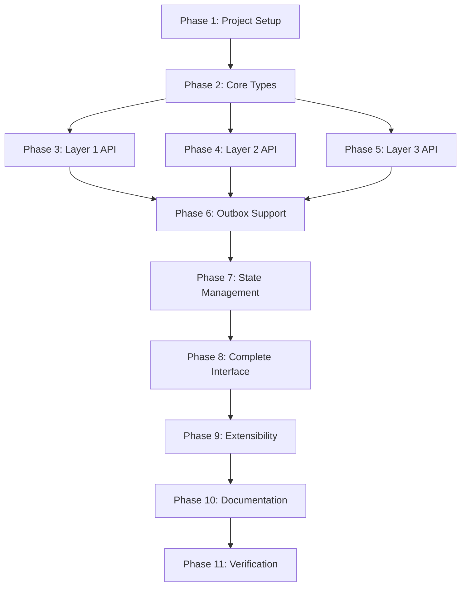

# Implementation Tasks: Testing Support for Command Processor Handlers

**Spec:** 0002-testing-support-for-command-processor-handlers
**Created:** 2026-02-06
**Status:** Draft

---

## Overview

This task list implements the `Paramore.Brighter.Testing` assembly with `SpyCommandProcessor` for testing handlers that depend on `IAmACommandProcessor`.

**Key Artifacts:**
- ADR 0037: Assembly structure
- ADR 0038: SpyCommandProcessor API design

---

## Phase 1: Project Setup

- [ ] **SETUP: Create Paramore.Brighter.Testing project**
  - Create `src/Paramore.Brighter.Testing/Paramore.Brighter.Testing.csproj`
  - Use `$(BrighterTargetFrameworks)` for target frameworks
  - Reference `Paramore.Brighter` project
  - Add to `Brighter.slnx` solution file
  - Verify project builds with `dotnet build`

- [ ] **SETUP: Create test project for Paramore.Brighter.Testing**
  - Create `tests/Paramore.Brighter.Testing.Tests/Paramore.Brighter.Testing.Tests.csproj`
  - Reference `Paramore.Brighter.Testing` project
  - Add xUnit and FluentAssertions packages
  - Add to `Brighter.slnx` solution file
  - Verify project builds and test runner works

---

## Phase 2: Core Types (CommandType and RecordedCall)

- [ ] **TEST + IMPLEMENT: CommandType enum tracks Send method calls**
  - **USE COMMAND**: `/test-first when Send is called should record CommandType.Send`
  - Test location: `tests/Paramore.Brighter.Testing.Tests`
  - Test file: `When_send_is_called_should_record_command_type.cs`
  - Test should verify:
    - `CommandType.Send` exists in enum
    - SpyCommandProcessor records correct type when `Send<T>()` called
  - **⛔ STOP HERE - WAIT FOR USER APPROVAL in IDE before implementing**
  - Implementation should:
    - Create `src/Paramore.Brighter.Testing/CommandType.cs` with initial enum value
    - Create minimal `SpyCommandProcessor` that records calls

- [ ] **TEST + IMPLEMENT: CommandType enum tracks all async variants**
  - **USE COMMAND**: `/test-first when async methods called should record async command types`
  - Test location: `tests/Paramore.Brighter.Testing.Tests`
  - Test file: `When_async_methods_called_should_record_async_command_types.cs`
  - Test should verify:
    - `CommandType.SendAsync` recorded when `SendAsync<T>()` called
    - `CommandType.PublishAsync` recorded when `PublishAsync<T>()` called
    - `CommandType.PostAsync` recorded when `PostAsync<T>()` called
    - `CommandType.DepositAsync` recorded when `DepositPostAsync<T>()` called
    - `CommandType.ClearAsync` recorded when `ClearOutboxAsync()` called
  - **⛔ STOP HERE - WAIT FOR USER APPROVAL in IDE before implementing**
  - Implementation should:
    - Add remaining async enum values to `CommandType.cs`
    - Implement async interface methods in `SpyCommandProcessor`

- [ ] **TEST + IMPLEMENT: RecordedCall captures request and timestamp**
  - **USE COMMAND**: `/test-first when method called should capture request details in RecordedCall`
  - Test location: `tests/Paramore.Brighter.Testing.Tests`
  - Test file: `When_method_called_should_capture_request_details.cs`
  - Test should verify:
    - `RecordedCall.Type` matches method called
    - `RecordedCall.Request` is the exact request object passed
    - `RecordedCall.Timestamp` is set to approximate current time
    - `RecordedCall.Context` captures RequestContext if provided
  - **⛔ STOP HERE - WAIT FOR USER APPROVAL in IDE before implementing**
  - Implementation should:
    - Create `src/Paramore.Brighter.Testing/RecordedCall.cs` as a record type
    - Update `SpyCommandProcessor` to create `RecordedCall` for each call

---

## Phase 3: Layer 1 API (Quick Checks)

- [ ] **TEST + IMPLEMENT: WasCalled returns true when method was invoked**
  - **USE COMMAND**: `/test-first when WasCalled checks for invoked method should return true`
  - Test location: `tests/Paramore.Brighter.Testing.Tests`
  - Test file: `When_was_called_checks_for_invoked_method.cs`
  - Test should verify:
    - `WasCalled(CommandType.Send)` returns false before any calls
    - `WasCalled(CommandType.Send)` returns true after `Send<T>()` called
    - `WasCalled(CommandType.Publish)` remains false (different method)
  - **⛔ STOP HERE - WAIT FOR USER APPROVAL in IDE before implementing**
  - Implementation should:
    - Add `WasCalled(CommandType type)` method to `SpyCommandProcessor`

- [ ] **TEST + IMPLEMENT: CallCount returns number of invocations**
  - **USE COMMAND**: `/test-first when CallCount called should return invocation count`
  - Test location: `tests/Paramore.Brighter.Testing.Tests`
  - Test file: `When_call_count_returns_invocation_count.cs`
  - Test should verify:
    - `CallCount(CommandType.Send)` returns 0 before any calls
    - `CallCount(CommandType.Send)` returns 1 after one `Send<T>()` call
    - `CallCount(CommandType.Send)` returns 3 after three `Send<T>()` calls
    - `CallCount(CommandType.Publish)` returns 0 (different method)
  - **⛔ STOP HERE - WAIT FOR USER APPROVAL in IDE before implementing**
  - Implementation should:
    - Add `CallCount(CommandType type)` method to `SpyCommandProcessor`

- [ ] **TEST + IMPLEMENT: Observe dequeues requests in FIFO order**
  - **USE COMMAND**: `/test-first when Observe called should dequeue requests in order`
  - Test location: `tests/Paramore.Brighter.Testing.Tests`
  - Test file: `When_observe_dequeues_requests_in_order.cs`
  - Test should verify:
    - First `Observe<T>()` returns first request sent
    - Second `Observe<T>()` returns second request sent
    - `Observe<T>()` throws when queue is empty
    - `Observe<T>()` filters by request type
  - **⛔ STOP HERE - WAIT FOR USER APPROVAL in IDE before implementing**
  - Implementation should:
    - Add `Observe<T>()` method with queue-based dequeue behavior
    - Use `Queue<IRequest>` internal storage

---

## Phase 4: Layer 2 API (Request Inspection)

- [ ] **TEST + IMPLEMENT: GetRequests returns all requests of type without consuming**
  - **USE COMMAND**: `/test-first when GetRequests called should return all matching requests`
  - Test location: `tests/Paramore.Brighter.Testing.Tests`
  - Test file: `When_get_requests_returns_matching_requests.cs`
  - Test should verify:
    - `GetRequests<T>()` returns all requests of type T
    - Calling `GetRequests<T>()` multiple times returns same results (non-destructive)
    - Returns empty enumerable when no matching requests exist
    - Filters to specific request type only
  - **⛔ STOP HERE - WAIT FOR USER APPROVAL in IDE before implementing**
  - Implementation should:
    - Add `GetRequests<T>()` method filtering `_recordedCalls`

- [ ] **TEST + IMPLEMENT: GetCalls returns all RecordedCalls for CommandType**
  - **USE COMMAND**: `/test-first when GetCalls called should return matching recorded calls`
  - Test location: `tests/Paramore.Brighter.Testing.Tests`
  - Test file: `When_get_calls_returns_matching_recorded_calls.cs`
  - Test should verify:
    - `GetCalls(CommandType.Send)` returns all Send calls
    - Returns `RecordedCall` objects with full details
    - Returns empty enumerable when no matching calls exist
  - **⛔ STOP HERE - WAIT FOR USER APPROVAL in IDE before implementing**
  - Implementation should:
    - Add `GetCalls(CommandType type)` method

- [ ] **TEST + IMPLEMENT: Commands property returns command types in order**
  - **USE COMMAND**: `/test-first when Commands accessed should return types in call order`
  - Test location: `tests/Paramore.Brighter.Testing.Tests`
  - Test file: `When_commands_accessed_returns_types_in_order.cs`
  - Test should verify:
    - `Commands` returns `IReadOnlyList<CommandType>`
    - Order matches invocation order
    - After `Send`, `Publish`, `Send` → returns `[Send, Publish, Send]`
  - **⛔ STOP HERE - WAIT FOR USER APPROVAL in IDE before implementing**
  - Implementation should:
    - Add `Commands` property derived from `_recordedCalls`

---

## Phase 5: Layer 3 API (Full Detail Access)

- [ ] **TEST + IMPLEMENT: RecordedCalls property exposes all call details**
  - **USE COMMAND**: `/test-first when RecordedCalls accessed should expose all call details`
  - Test location: `tests/Paramore.Brighter.Testing.Tests`
  - Test file: `When_recorded_calls_accessed_exposes_all_details.cs`
  - Test should verify:
    - `RecordedCalls` returns `IReadOnlyList<RecordedCall>`
    - Contains all calls in order with Type, Request, Timestamp, Context
    - Is read-only (cannot be modified externally)
  - **⛔ STOP HERE - WAIT FOR USER APPROVAL in IDE before implementing**
  - Implementation should:
    - Add `RecordedCalls` property exposing `_recordedCalls.AsReadOnly()`

- [ ] **TEST + IMPLEMENT: DepositedRequests tracks outbox deposits**
  - **USE COMMAND**: `/test-first when DepositPost called should track in DepositedRequests`
  - Test location: `tests/Paramore.Brighter.Testing.Tests`
  - Test file: `When_deposit_post_called_tracks_in_deposited_requests.cs`
  - Test should verify:
    - `DepositPost<T>()` returns an `Id`
    - `DepositedRequests[id]` contains the deposited request
    - Multiple deposits are all tracked independently
  - **⛔ STOP HERE - WAIT FOR USER APPROVAL in IDE before implementing**
  - Implementation should:
    - Add `_depositedRequests` dictionary
    - Add `DepositedRequests` property
    - Implement `DepositPost<T>()` to store and return Id

---

## Phase 6: Outbox Pattern Support

- [ ] **TEST + IMPLEMENT: ClearOutbox moves deposited requests to observation queue**
  - **USE COMMAND**: `/test-first when ClearOutbox called should move requests to observation queue`
  - Test location: `tests/Paramore.Brighter.Testing.Tests`
  - Test file: `When_clear_outbox_moves_requests_to_queue.cs`
  - Test should verify:
    - After `DepositPost<T>()`, request is NOT in observation queue
    - After `ClearOutbox(ids)`, request IS in observation queue
    - `Observe<T>()` returns the cleared request
    - Records `CommandType.Clear` in `RecordedCalls`
  - **⛔ STOP HERE - WAIT FOR USER APPROVAL in IDE before implementing**
  - Implementation should:
    - Implement `ClearOutbox(Id[] ids, ...)` method
    - Move requests from `_depositedRequests` to `_requests` queue

- [ ] **TEST + IMPLEMENT: DepositPost batch overloads return multiple Ids**
  - **USE COMMAND**: `/test-first when DepositPost batch called should return array of Ids`
  - Test location: `tests/Paramore.Brighter.Testing.Tests`
  - Test file: `When_deposit_post_batch_returns_array_of_ids.cs`
  - Test should verify:
    - `DepositPost<T>(IEnumerable<T>)` returns `Id[]` with one Id per request
    - Each Id maps to correct request in `DepositedRequests`
    - Works with both sync and async overloads
  - **⛔ STOP HERE - WAIT FOR USER APPROVAL in IDE before implementing**
  - Implementation should:
    - Implement batch `DepositPost` overloads (sync and async)

---

## Phase 7: State Management

- [ ] **TEST + IMPLEMENT: Reset clears all recorded state**
  - **USE COMMAND**: `/test-first when Reset called should clear all state`
  - Test location: `tests/Paramore.Brighter.Testing.Tests`
  - Test file: `When_reset_clears_all_state.cs`
  - Test should verify:
    - After calls, `Reset()` clears `RecordedCalls`
    - `Reset()` clears `Commands`
    - `Reset()` clears observation queue
    - `Reset()` clears `DepositedRequests`
    - `WasCalled(...)` returns false after reset
  - **⛔ STOP HERE - WAIT FOR USER APPROVAL in IDE before implementing**
  - Implementation should:
    - Add `Reset()` method that clears all internal collections

---

## Phase 8: Complete Interface Implementation

- [ ] **TEST + IMPLEMENT: Scheduled Send/Publish/Post methods record correctly**
  - **USE COMMAND**: `/test-first when scheduled methods called should record scheduler command types`
  - Test location: `tests/Paramore.Brighter.Testing.Tests`
  - Test file: `When_scheduled_methods_record_scheduler_types.cs`
  - Test should verify:
    - `Send<T>(DateTimeOffset, ...)` records `CommandType.Scheduler`
    - `Send<T>(TimeSpan, ...)` records `CommandType.Scheduler`
    - `Publish<T>(DateTimeOffset, ...)` records `CommandType.Scheduler`
    - `Post<T>(DateTimeOffset, ...)` records `CommandType.Scheduler`
    - All return scheduler Id strings
  - **⛔ STOP HERE - WAIT FOR USER APPROVAL in IDE before implementing**
  - Implementation should:
    - Implement all scheduled overloads (sync and async)
    - Return generated scheduler Ids

- [ ] **TEST + IMPLEMENT: Call method records and returns null response**
  - **USE COMMAND**: `/test-first when Call invoked should record and return null`
  - Test location: `tests/Paramore.Brighter.Testing.Tests`
  - Test file: `When_call_invoked_records_and_returns_null.cs`
  - Test should verify:
    - `Call<T, TResponse>()` records `CommandType.Call`
    - Returns null (spy doesn't process actual responses)
    - Request is captured in `RecordedCalls`
  - **⛔ STOP HERE - WAIT FOR USER APPROVAL in IDE before implementing**
  - Implementation should:
    - Implement `Call<T, TResponse>()` method

- [ ] **TEST + IMPLEMENT: Transaction provider overloads work correctly**
  - **USE COMMAND**: `/test-first when transaction provider overloads called should record correctly`
  - Test location: `tests/Paramore.Brighter.Testing.Tests`
  - Test file: `When_transaction_provider_overloads_record_correctly.cs`
  - Test should verify:
    - `DepositPost<T, TTransaction>(request, transactionProvider, ...)` records deposit
    - Works with mock/stub transaction providers
    - Both sync and async variants work
  - **⛔ STOP HERE - WAIT FOR USER APPROVAL in IDE before implementing**
  - Implementation should:
    - Implement all transaction provider overloads (ignore transaction, just record)

---

## Phase 9: Extensibility

- [ ] **TEST + IMPLEMENT: Virtual methods allow subclass customization**
  - **USE COMMAND**: `/test-first when subclass overrides method should execute custom behavior`
  - Test location: `tests/Paramore.Brighter.Testing.Tests`
  - Test file: `When_subclass_overrides_executes_custom_behavior.cs`
  - Test should verify:
    - Create `ThrowingSpyCommandProcessor` that throws on `Send`
    - Verify base `Send` records call before throwing
    - Verify custom exception propagates
  - **⛔ STOP HERE - WAIT FOR USER APPROVAL in IDE before implementing**
  - Implementation should:
    - Ensure all interface methods are `virtual`
    - Create example `ThrowingSpyCommandProcessor` in test project for validation

---

## Phase 10: Documentation

- [ ] **DOCUMENT: Create testing-handlers.md guide**
  - Create `Docs/guides/testing-handlers.md`
  - Sections:
    1. Introduction and overview
    2. Using SpyCommandProcessor (installation, basic usage)
    3. Verifying Send/Publish/Post calls
    4. Verifying outbox pattern (DepositPost + ClearOutbox)
    5. Using mocking frameworks (Moq, NSubstitute, FakeItEasy examples)
    6. Using in-memory bus for integration tests
    7. Best practices
  - Include compilable code examples
  - Follow existing documentation style

- [ ] **DOCUMENT: Update core guide with cross-reference**
  - Edit `Docs/guides/paramore_brighter_core_guide.md`
  - Add reference to testing-handlers.md in Testing Strategies section (~line 953)
  - Brief mention of `Paramore.Brighter.Testing` package

---

## Phase 11: Final Verification

- [ ] **VERIFY: Full solution builds and tests pass**
  - Run `dotnet build` on entire solution
  - Run `dotnet test` for `Paramore.Brighter.Testing.Tests`
  - Verify no build warnings
  - Verify all tests pass

- [ ] **VERIFY: Update PROMPT.md for future sessions**
  - Update `specs/0002-.../PROMPT.md` to reflect completed status
  - Document any deviations from original design

---

## Dependencies

---

## Risk Mitigation

| Risk | Mitigation Task |
|------|-----------------|
| Interface changes during implementation | Check `IAmACommandProcessor` hasn't changed since design |
| Missing method overloads | Verify all 30+ interface methods implemented before Phase 11 |
| Incorrect outbox semantics | Review existing test double behavior in Phase 6 |
